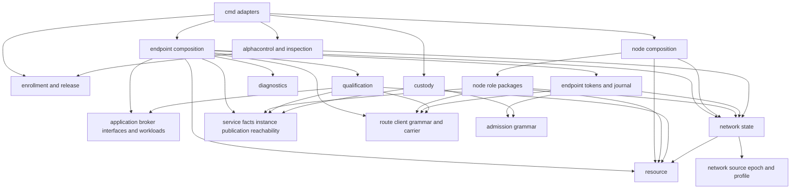
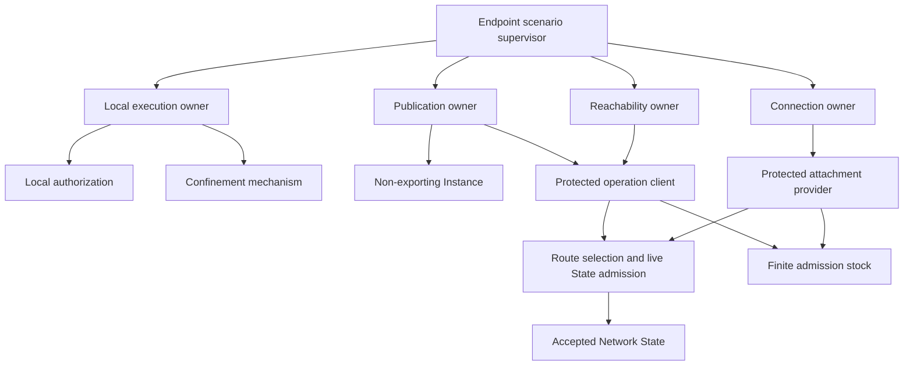

# Contracts and dependencies map

Draft analysis for the Product Owner, dated 2026-10-02. Source baseline is local
`dev` at `a3963544a4c305e14059c7b744b8e68cfbb41e5d`. This map does not accept new
architecture, change import permissions or certify C0. Existing unrelated edits
were preserved. No runtime checks were executed.

## Reading the maps

Import edges were collected from first-party quoted module paths in non-test Go
files under internal and cmd. This is a lexical inventory across build profiles,
not a compiler-resolved platform graph or proof of runtime reachability. Selected
interfaces and lifecycle implementations were read to establish the contracts
below. Diagrams group packages and omit internal edges; an arrow in the import
diagram means the source imports the destination, not that it grants authority.

The earlier service-boundary-proposal remains tied to its own source baseline.
Between that baseline and this one, Application admission/cleanup, Endpoint idle
qualification and Node Hosting code changed. This map uses the newer sources;
neither document establishes the acceptance status of those repairs.

## Current import map

Representative exact edges worth reviewing:

| Source package | Imported package | Interpretation |
|---|---|---|
| endpoint | qualification | Runtime composition carries qualification-specific state and orchestration |
| endpoint/service | application/textdocument | Stream workload mechanism knows the reference Application contract |
| endpoint/service | application/broker | Stream authority surface includes local Application authorization concepts |
| endpoint/tokens | network/state and route/client | Stock owner combines live authority and transport coordination dependencies |
| service/instance | service/publication | Instance uses shared publication vocabulary; import alone does not transfer key ownership |
| service/reachability | service/publication | Descriptor proof uses publication facts |
| custody | service/instance and service/publication | Purpose-specific issuance shares runtime schemas; root secrets remain in custody |
| node/hosting | node/authority and route/replay | Resource admission connects verification, reservation and token spending |

These edges are not automatically defects. Their necessity must be tested against
state ownership and interface obligations, not a blanket layering rule.

## Authority and state contracts

| Producer or owner | Consumer | What crosses the boundary | What it does not authorize |
|---|---|---|---|
| Enrollment | Release and installation | Independently pinned and checked artifact inventory | Network authority or runtime readiness |
| Release | Installation or replacement | Exact accepted artifact decision and bounded authorization | Older bytes merely because they remain on disk |
| Network Source and Epoch | State | Retrieved authenticated candidate evidence | Source-selected current state |
| State | Endpoint and Node roles | Verified current role/profile facts | Local Application grants or Service Authority |
| Custody | Instance credential acceptance | Public bounded Credential response to exact approved request | Root export, arbitrary signing, local grants |
| Instance | Publication | Non-exporting binding and bounded signing operations | Replacement of Service Authority |
| Broker | Endpoint execution | Exact Principal/surface activation lease | Publisher or Custody rights from Connection access |
| Worker mechanism | Job owner | Verified invocation and attachment handles | A Grant based only on worker HELLO |
| Token stock | Protected operation | Exact receiver/class/window-bound token presentation | Local Application access or unbounded resource use |
| Publication | Resolution Store | Signed finite Descriptor through protected operation | Proof that Publisher is accepting |
| Reachability | Connection setup | Verified exact Target and current Descriptor | Alternate destination or successful TLS connection |
| Connection binding | Stream mechanism | Immutable facts, live Job authority and recovery constraints | New destination, extended lifetime or transferable authority |

Source anchors: endpoint/tokens/host.go, endpoint/service/binding.go,
endpoint/descriptor_publication.go, endpoint/resolution.go,
node/hosting/admission.go and the corresponding package doc.go files.

## Temporal contracts

```mermaid
flowchart LR
  Grant[Activate local lease] --> Job[Verify exact Job]
  Job --> Registration[Register Introduction]
  Registration --> Proof[Bind Instance and exact Descriptor proof]
  Proof --> Commit[Resolution Store acknowledgement]
  Commit --> Recheck[Recheck live authority and registration]
  Recheck --> Ready[Publish accepting readiness]
  Ready --> Refresh[Prepare successor and await its acknowledgement]
```

The publication path requires Administration authority. The Reader path below
requires Connection authority; they are separate authorized scenarios, not a
single execution that inherits Publisher rights.

```mermaid
flowchart LR
  Local[Reader lease and Job] --> Lookup[Private exact Target lookup]
  Lookup --> Verify[Verify proof profile lifetime and history]
  Verify --> Binding[Create immutable Connection binding]
  Binding --> Setup[Introduction and joined protected attachment]
  Setup --> TLS[Authenticate exact Service Instance]
  TLS --> Exchange[Bounded Application exchange]
  Exchange --> Terminal[Terminal outcome and joined cleanup]
```

Important ordering obligations:

| Operation | Required sequence | Failure rule |
|---|---|---|
| Class-2 forwarding replenishment | Verify token; reserve work and termination; durable Spend; admit effect | Spend failure releases reservation; no implied refund of spent token |
| Descriptor ACK | Network response; revalidate profile, Source flight, owner, registration and recipient; commit readiness | Late ACK cannot revive retired authority |
| Lookup response | Retrieve bytes; revalidate caller/profile/flight; accept history for exact Target | No successful result under changed authority |
| Refresh | Prepare fresh successor; receive verified ACK; switch accepted registration | Exact retry does not renew predecessor lifetime |
| Context close | Revoke children under lock; join outside lock; retain Job reservation through child completion | First cleanup failure is not erased by replacement work |

Retirement is explicitly sequenced in endpoint/duty_context_retirement.go:
join opening flights, join refresh and registration retirement, close prefixes,
join issuance/resolution/withdrawal/exchanges, then join Job cleanup. Do not turn
this into an asynchronous event cascade without equivalent acceptance evidence.

## Hidden coupling and proposed boundaries

1. **Synchronization contract:** tokens.Host Locked methods use the parent
   dutyContext mutex. Extract owner-local invariants before replacing the lock.
2. **Publication contract:** lifecycle authority is spread across durable
   publication, registration pair, refresh scheduler and Endpoint ACK logic.
   Proposal: one Publication owner, with exact ACK and retirement semantics.
3. **Connection contract:** Binding includes local surface, Job lifetime,
   resource access, publication leases, immutable facts and recovery. Proposal:
   Connection owns continuity; scenario composition supplies bounded execution
   authority and transport operations without exposing the whole Endpoint.
4. **Workload contract:** endpoint/service/workload.go imports textdocument.
   Determine which bounds are genuine Connection requirements and which belong
   to the selected Application. Do not introduce arbitrary workloads or an
   unqualified generic extension as a side effect of separation.
5. **Qualification contract:** production Endpoint imports qualification and
   qualification drives reserves and replenishment. Separate production policy,
   workload driving, observation and verdict while preserving installed paths.

## Proposed semantic dependencies

This is a target responsibility graph, not selected packages or executable code.

Lease expiration and revocation affect all admitted children. Arrows are not a
substitute for that lifetime dependency. Server-side verification, reservation
and spending remain separate owners; the diagram focuses on Endpoint behavior.

## Information and observation contracts

The map must preserve separate role knowledge. Introduction setup is not
Application data forwarding; resolution lookup is not public origin disclosure;
an Endpoint-wide object must not become a wire or telemetry identity shared by
roles. Future traffic-protection claims require per-role inputs, retained state
and joint-observation analysis, including retries and background refresh.

OpenTelemetry proposal: owner-defined observations feed runtime-composed,
bounded local instrumentation/export. Collector, storage and dashboards remain
external. Do not propagate global trace context across Ardents role channels.
No secret, Target, peer topology or raw error becomes an attribute by default.
Admission and durable accounting must remain correct when telemetry is disabled,
sampled, saturated or unavailable. Export destination, custody, cardinality and
traffic effects require a concrete selected contract before implementation.

## Completion boundary for this analysis

Delivered: cross-profile lexical import inventory, grouped dependency diagrams,
authority transfer matrix, selected temporal contracts and proposed boundaries.
Not delivered: exhaustive wire-field review, platform-resolved import graph,
measured contention, runtime failure reproduction or C0 qualification.

Next design work should resolve Publication's external operations, states,
exclusive Instance ownership, exact retries, refresh switching and Close result.
Reconcile active repairs against fresh dev before an implementation slice.
No package relocation, dependency installation or current-contract change is
authorized by the diagrams alone.
