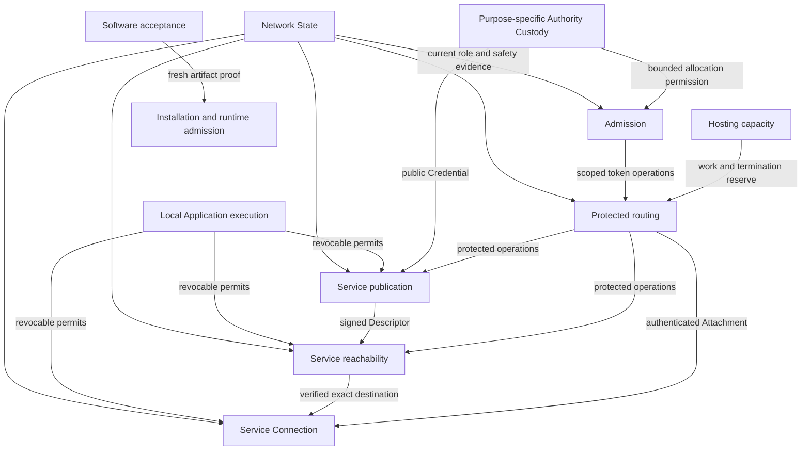

# Domain boundaries and DDD transition design

Status: **context-map proposal; first Admission slice selected by the Product
Owner and implemented**, 2026-10-03. The current implemented boundary and real
callers are documented in [Admission](../../internal/successor/admission/README.md).
The wider migration remains a proposal.
This document owns the proposed context map, source migration and verification
method. It does not accept a new product/protocol contract, register future
packages, select implementation issues, or change existing import permissions.
The [package map](package-map.md) remains the factual source registry; GitHub
Issues in the C0 milestone remain the execution ledger.

## Evidence and diagnosis

The inspected source is local `dev` at
`0e708a737bcf8c81457d797cd43a759a6eacd558`, seven commits ahead of the local
`origin/dev` reference. This is not a freshly fetched remote comparison.
The pre-existing modified reconstruction findings and three untracked design
documents were preserved. That inspection preceded the Admission implementation. Removed-source references below refer to that baseline; inspect them with
`git show <baseline>:<path>`. Existing-source links are navigation, not a claim
that an old finding still describes the changed implementation.

The original eight-context proposal and illustrative tree were recovered from
the chat **Ardents to DDD** (`01a0f3f8-e8e7-7110-a1af-4a17994d632a`), specifically
turns `01a0f3fc-e0af-7980-9477-0b4d8fcd8d04` and
`01a0f403-2c38-7630-8fa9-e6a301631a7f`. The later explicit implementation plans
selected the offline slices. The original tree was an example, not a registered
package contract. Subsequent work did not keep the relationship between those
two levels explicit.

[Issue 483](https://github.com/dianabuilds/ardents-network/issues/483) is closed.
Its final receipt records the local commit, full host checks, Linux
behavior/race/process/CLI/OTLP/fuzz evidence and their limits. Those are prior
receipts, not tests rerun during this analysis. The existing checkpoint at
`C:/Users/vitek/AppData/Local/Temp/ardents-network-quality/issuer-profile-slice/checkpoint.json`
was inspected for source/profile/attempt provenance, not exhaustively re-audited.

The useful work survives: exclusive state owners, opaque debit confirmation,
purpose-limited signing, durable retry results, real CLI consumers and refusal
tests. The defect in the transition process is the missing maintained connection
between **context -> invariant -> owner -> caller -> evidence**. Moving a package
under another directory cannot establish that connection by itself.

### Findings verified against this source

| Evidence | Assessment | Design response |
| --- | --- | --- |
| `successor/admission`, `issuance`, `nodeidentity` and `tokenissuance` have explicit allowed imports and real command callers | These are useful Modules inside or supporting Admission; sibling paths do not prove separate bounded contexts or a failed DDD design | Preserve behavior and state ownership; make their context membership and composition role explicit |
| `IssuerProfileBinding.ledger` in baseline `internal/successor/admission/issuer_profile.go` creates a ledger binding with dummy Authority, Profile and Duty values to validate a public profile | Confirmed model coupling, not evidence of an authority bypass: this temporary value is used for validation | Give public inventory/cohort validation its own value model; keep real ledger binding validation with the ledger |
| baseline `internal/successor/admission/token_key.go` and `internal/successor/issuance/public_key.go` are identical after package-name/newline normalization | Confirmed duplicated canonical grammar; divergence risk, not a demonstrated mismatch today | One Admission-owned public issuer-profile/key grammar with independent byte vectors |
| baseline `internal/successor/tokenissuance/operation.go` and `profile.go` in that package deferred closes overwrite the same Result | Confirmed static loss of primary/earlier cleanup causes when multiple phases fail; failure still overrides success | Retain the operation result and every bounded owner-close result before projecting one CLI category; add a failing multi-fault regression first |
| [tokens.Host](../../internal/endpoint/tokens/host.go) requires Locked calls; [duty context](../../internal/endpoint/duty_context.go) passes its mutex into tokens.Init | Extraction preserved shared synchronization, not independent aggregate ownership; no deadlock is claimed here | Enumerate protected invariants and linearization points before moving state or changing locks |
| [service.Binding](../../internal/endpoint/service/binding.go) exposes Job, publication, resources, time and recovery | A large Interface transfers parent coordination knowledge to the stream implementation | Connection receives immutable destination evidence and narrow live permits; execution and publication remain separate owners |
| [Descriptor publication](../../internal/endpoint/descriptor_publication.go) commits ACK/readiness in Endpoint; [retirement](../../internal/endpoint/duty_context_retirement.go) orders many child lifetimes | Publication's complete transition authority is distributed | Move registration/ACK/refresh/withdrawal state together, retaining synchronous revoke and joined shutdown |
| [Isolation gate](../../internal/architecture/successor_isolation_test.go) allows reviewed CIRCL only for Issuance; repository-layout's isolation paragraph mentions only OTel as an exception | Current summary documentation lags the more specific selected issuance contract and gate | Reconcile the engineering summary with the existing dependency selection in the bounded implementation change; do not relax the gate |

This is a targeted source assessment, not an exhaustive defect or security audit.
The [older dependency map](contracts-dependency-map.md) and
[Service proposal](service-boundary-proposal.md) remain evidence at their stated
baselines; they are not proof of current defects or a competing migration order.

## Design vocabulary and scope

A bounded context defines where one model and its language are consistent.
An aggregate owns the state that must change consistently. A Module puts those
rules behind a small Interface; a Go package is one possible source boundary.
A process, secret-custody boundary and network role have separate security
meanings. This distinction follows the strategic-design vocabulary in
[Fowler's Bounded Context](https://martinfowler.com/bliki/BoundedContext.html)
and [Evans' DDD Reference](https://www.domainlanguage.com/ddd/reference/)
(accessed 2026-10-03). The Ardents choices below are this proposal, not conclusions
derived from those sources.

Keep one root Go module, actual supported processes and one human Product Owner
working with Codex. DDD introduces no requirement for microservices, an event bus,
event sourcing, CQRS, a generic repository layer or an interface per struct.
Durability journals are existing safety mechanisms, not an event-sourcing mandate.
Retain concrete implementations unless a real consumer needs a substitution seam.

The product glossary remains [CONTEXT.md](../../CONTEXT.md). Do not put temporary
source paths or implementation lifecycles there. In particular, distinguish Local
Grant, issuance permission, admission token, Service Instance Credential, Service
Authority and Node identity. The word `credential` without scope is insufficient
at an inter-context Interface.

## Context map

Preserve the eight original contexts as the working strategic map. Add explicit
supporting boundaries for Hosting and Authority Custody that the earlier tree
already kept separate. This is not a requirement for ten packages or processes.
Separate authority kinds inside Custody retain separate rules and stores even
where they share a vault mechanism.

| Context / domain question | Exclusive state and consistency owners | Outgoing contract / forbidden authority | Current source -> intended ownership |
| --- | --- | --- | --- |
| **Network State:** which authenticated rules are usable now? | Accepted Epoch/profile, conflicts, time-confidence watermarks, publication of current views; physical storage is subordinate | Current purpose-scoped evidence with exact generation/expiry; no Local Grant, Target selection or new authority | `network/state`, `epoch`, `closedprofile`, `source`, `duty` -> retain their cohesive owners and keep live acceptance out of callers |
| **Local Application execution:** may this exact process invocation do this work? | Broker Grant/session generation; Job identity, confinement receipt, descendants and joined terminal result are distinct owners | Revocable operation permit and verified Job lifetime; no Service Authority, issuer allocation or route choice | `application/broker`, local Interface grammars, Endpoint Job lifecycle, `endpoint/worker` -> execution owner plus platform mechanism, assembled by Endpoint |
| **Service publication:** which authorized Instance is accepting? | Instance generation/secrets; one publication lifecycle owns registration pair, recipient, revision, ACK, refresh and withdrawal | Signed Descriptor and bounded publication lease; no Credential issuance or arbitrary root signing | `service/instance`, `service/publication`, `endpoint/publication`, `endpoint/introduction`, Endpoint publication methods -> one publication lifecycle, Instance custody kept separate |
| **Service reachability:** what current evidence is valid for this exact Target? | Endpoint-local lookup/history; Node-local durable Descriptor/conflict floors are separate aggregates | Verified exact-Target Descriptor, or refusal; neither readiness nor a connection | `service/reachability`, `endpoint/descriptorhistory`, Endpoint resolution, `node/resolution` -> client lookup/history and receiving Store, never a shared private history |
| **Service Connection:** how does one authenticated logical connection survive an Attachment change? | Immutable destination/provenance and authenticated Instance, ordered byte state, recovery deadline, terminal outcomes | Authenticated bounded stream; no alternate Target, new Application operation, fresh Grant or publication authority | `service/connection`, `endpoint/service`, `service_binding`, recovery integration -> Connection lifecycle owns its policy, Endpoint only assembles the scenario |
| **Protected routing:** which path is permissible, and who may learn what? | Entry/Interior selections and role-local channel, forwarding, Introduction and JOIN lifecycles | Bounded authenticated transports and role-specific outcomes; no Application semantics or global route object at a Node | `entry`, `route/client`, `route/ardp`, relevant Route and Node role owners -> separate selection, protocol and role lifetimes under one declared protection contract |
| **Admission:** what scarce network work is permitted, issued and already spent? | Allocation authority, issuer quota/debit, issuer results, Endpoint pending batch/stock, receiver replay ledger: distinct aggregates at distinct principals | Exact purpose/receiver/window-bound admission; no Network State authority, Local Grant, unlimited Hosting or token refund | `admission`, admission operations in `custody`, `route/credential`, `route/replay`, `endpoint/tokens`, `tokenjournal`, successor Admission/Issuance -> explicit allocation, issuing, stock and spending owners |
| **Software acceptance:** which program/generation may be installed or run? | Enrollment pin, Release roots/floors, installation transition and recovery journals; separate owners | Fresh exact-artifact authorization and observed installation result; local files alone grant no authority | `enrollment`, `release`, `endpoint/installation`, `replacement` -> keep Release authorization separate from platform transition |
| **Hosting and local capacity** (supporting) | One provider-period allowance; work/termination reservations; separate process pressure owner | Finite reservations and pressure observations; neither a token nor a duty assignment | `resource`, `node/hosting`, `successor/hosting` -> Hosting budget separate from Node's role adapter and process supervision |
| **Authority Custody** (supporting boundary) | Purpose-specific roots, signing commitments, recovery floors | Narrow approved public result; never generic Sign or secret export to ordinary runtime | `custody`; runtime Instance and Node keys stay with their own owners -> shared storage does not merge Service, Name, admission or State authorities |

These ownership directions are proposed; current acceptance rules remain in the
[product scope](../product/scope.md), [threat model](../security/threat-model.md),
[State/Route/Node](../technical/network-route-node.md),
[Endpoint/Service](../technical/endpoint-service-runtime.md),
[Admission](../technical/private-admission.md),
[reachability](../technical/private-reachability.md),
[confinement](../technical/application-confinement.md), and
[Release/Custody](../technical/release-update-custody.md) owners.

Naming remains a future separate model: Name -> authenticated Target binding.
The maintained Target-Link journey does not need it; retired Naming paths are
not restored by this map. Public governance/consensus and new traffic-protection
mechanisms remain outside this transition's selected implementation scope.

### Relationships, not one global object model

Arrows below mean evidence/operation dependency, not Go imports or secret access.
Endpoint/Node composition connects owners; it does not become a new authority.



| Boundary | Integration rule |
| --- | --- |
| State -> runtime consumers | State publishes a narrow verified view. The consumer translates it into its own required facts and revalidates the live generation at admission/commit. A cached snapshot is not a perpetual permit. |
| Publication -> reachability -> Connection | Explicit signed/public value contracts; verification at each trust boundary. Store ACK proves persistence; publication readiness additionally needs live registration/Instance; Connection still authenticates the exact Instance. |
| Admission issuer / client / receiver | Published wire grammar, local models and local stores. No shared database, global request identity, stock inventory or telemetry correlation across roles. |
| Hosting -> Node/Route | Node's adapter couples reserve-before-spend with admitted work and physical cleanup. Budget storage neither signs nor spends a token. |
| Release -> installation | Opaque fresh authorization for exact bytes. Installed metadata cannot mint that authorization; recovery cannot lower floors. |
| Old source -> successor | Source reuse and independently checked wire/file fixtures only under the present isolation rule. No imports, mutable-state sharing, automatic conversion or hidden in-process compatibility bridge. |

Values crossing a trust boundary are authenticated again there. Purpose-limited
opaque handles are useful inside one process but are not cryptographic proof
against arbitrary code execution in that process. Separate process/OS/network
boundaries continue to supply the claimed isolation.

## Consistency, time and lifetime contracts

The main design unit is an operation with an invariant, not a file to move.
Each Interface records: trusted/untrusted inputs; exact authorized effects;
linearization/commit point; state owner; durable and volatile parts; absolute
time/generation bounds; cancellation before/after commit; retry identity;
cleanup owner; permitted observations; concrete caller and execution profile.

| Operation | Consistency boundary | Refusal, interruption and retry |
| --- | --- | --- |
| Debit an issuance batch | Admission ledger lock and durable commit; confirmation minted only after commit/revalidated exact retry | Same request ID with changed bytes/kind refuses. No confirmation for an uncertain write. No refund on later failure. |
| Produce issuer response | ResultStore binds confirmation to exact ledger/key inventory and current offline bounds; response exposed after durable verified result | Interrupted after debit: repeat the same request via Admission. Partial result journal refuses; complete uncertain bytes require validated reopen/barrier. Expired permission does not revive on retry. |
| Admit receiving work | Current authority + scoped token verification, work/termination reservation, durable spend, then effect, in the order of the role's accepted contract | Release only the failed attempt's unneeded reservation; a spent token remains spent. Lost ACK does not authorize a fresh Application operation. |
| Admit/revoke local work | One local operation-admission ordering against exact Grant/Job generation | Revoke closes admission synchronously, cancels descendants and joins them. A late completion cannot publish into a replacement Job. |
| Publish or refresh | Publication serializes registration/Instance/revision transitions; ACK is rechecked against live authority before switching readiness | Exact retry keeps proof, recipient and original timing. A failed successor does not extend predecessor expiry. Withdrawal cannot be undone by a late ACK. |
| Accept a lookup | Lookup/history owner checks exact Target/profile and caller generation before advancing local floors | History full refuses before consuming new rights. Expiry/conflict does not reveal an older Descriptor; no alternate destination fallback. |
| Recover a Connection | Connection owns immutable destination, offsets and the original recovery deadline; Attachment generation advances under that owner | No duplicate Application bytes/operations or reset of total recovery time. Late Attachment completion retires only itself. |
| Close an owner | Stop admission, cancel/interrupt, join physical work, then release retained roots/reservations and publish terminal result | Cancellation is not completion. Timed-out waiting cannot release another live owner's resources. Repeated close returns the same retained result. |

Keep the admission ledger and issuer response journal as separate existing
transactions. Their connection is the retained request and opaque confirmation,
not a fictitious distributed atomic commit. Recovery completes or refuses the
same operation without compensating quota refunds. Likewise, publication cannot
atomically transact with a remote Store: its pending/acknowledged state must stay
explicit.

Shared locks are not removed mechanically. First list the invariants currently
covered by `dutyContext.mu`. Move genuinely owner-local state together. For
cross-owner start/revoke ordering, retain a small synchronous admission gate
that allocates an exact operation generation/permit before effects. Network and
disk waits occur outside that gate; completion is accepted only for its still
live owner/generation. Cancellation and joining remain owned even when a result
is rejected. Do not substitute eventually delivered domain events for revocation.
Where this cannot preserve the current invariant, keep the existing lock until
a bounded design and race regression establish a replacement.

## Admission: concrete first structural destination

The first change uses already implemented behavior. It does not create every
future Admission subpackage or a live issuer. Here `admission/` remains a real
package owning permission validation, batch debit and confirmations; a parent
package need not import its children.

```text
internal/successor/                 temporary source zone; no root package
  admission/                       existing quota/debit owner
    issuerprofile/                 public inventory/cohort/SPKI value grammar
    issuance/                      issuer keys, signed profiles, durable results
    issuer/                        complete offline issuer operation composition
  hosting/                         provider allowance and reservations
  nodeidentity/                    pinned Node key and purpose-limited signing
cmd/ardents-next/                   strict input, export, result projection, OTel
```

| Existing source | Destination and exact change |
| --- | --- |
| `successor/admission/inspection.go`, batch/ledger/confirmation files | Stay with Admission. Ledger authority and quota rules never move into the profile grammar. |
| `successor/admission/issuer_profile.go` | Move profile Binding/Request/Verified values, canonical encode/verify and defensive copies to `admission/issuerprofile`. Keep `PrepareLedgerBinding` in Admission as explicit translation from verified public inventory into independently supplied ledger facts. |
| `successor/admission/token_key.go`, duplicated `successor/issuance/public_key.go`, cohort checks in ledger binding | Consolidate exact public issuer key encoding/validation and cohort validation inside `issuerprofile`. Admission separately validates real Authority/Profile/Duty; no sentinel ledger construction remains. Key material/private signing stay outside. Preserve exact DER, JSON and signed bytes. |
| `successor/issuance/*` | Move to `admission/issuance`; preserve its distinct Store, ResultStore and ProfileStore lifetimes and storage formats. Do not merge roots or export the private signer. |
| `successor/tokenissuance/*` | Move to `admission/issuer` after clarifying its operation result. It owns issuer preparation/inspection and issue/retry orchestration, not quota arithmetic. Profile preparation and batch issuing keep different plans and operations; no generic Execute switch. |
| `successor/nodeidentity/*` | Keep separate. Replace its dependency on the whole Admission package with `issuerprofile.Request`; retain only purpose-limited signing, never `Sign([]byte)`. |
| `successor/hosting/*` | Keep separate; no Admission dependency or implied network authorization. |

`issuerprofile` earns a package because there are three real consumer roles
(Admission, Issuance, Node identity), an independent public format, substantive
validation and existing behavior tests. It is not a generic shared-types bucket.
Its Interface contains profile construction/verification and the exact public
key/cohort operations needed by those consumers. Export no unused general codec.
The `issuer` composition owns the whole offline issuer use case; grouping both
profile provisioning and issuance there is intentional and accurately named.

Proposed permitted project imports for this destination:

| Source (under successor) | Only permitted project imports |
| --- | --- |
| `admission/issuerprofile` | none |
| `admission` | `admission/issuerprofile` |
| `nodeidentity` | `admission/issuerprofile` |
| `admission/issuance` | `admission`, `admission/issuerprofile`, `nodeidentity` |
| `admission/issuer` | `admission`, `admission/issuance`, `nodeidentity` |
| `hosting` | none |

All retain the standard library; only Issuance retains its already reviewed
exact CIRCL import. The command retains only the registered domain and OTel
imports. The architecture change updates the package map, ownership inventory
where affected, source isolation, execution-profile manifests, Make targets,
deadcode expectations, command references and technical owners together.
Use exact package ownership in the gate: a broad `admission/` prefix must not
accidentally deny its newly nested owners or grant them unrestricted access.
Negative cases must forbid upward composition imports, sibling private authority,
legacy imports, reverse legacy imports and unreviewed dependency bridges.

### First acceptance boundary

Complete the existing real CLI cycle after these changes:
import pinned identity -> prepare/export profile -> independently verify binding
-> initialize ledger/results -> debit and issue -> reopen -> identical response.
No live authority is inferred. Existing six-slice behavior, foreign-root refusal,
wire bytes, root markers and OTel privacy remain compatible.

Before relocation, reproduce composition result loss with a primary failure and
at least two close failures. Retain an internal finite result containing the
primary phase/outcome and up to one cleanup outcome per opened owner. The three
owner closes remain in reverse order; every failure survives classification.
The existing CLI success/error precedence remains, and no raw error or secret is
added to output. A bounded projection can retain the existing public fields;
any desired public output expansion is a separate explicit contract change.
Regression cases include success + failed cleanup, failed operation + failed
cleanup, several failed closes, and repeated terminal reads where supported.

Verify the semantic repair before relocation, then check the public-grammar
extraction and complete path relocation as one coherent dependency change.
The implemented slice retains separate red/green fault evidence and one scoped
source commit so code, package permissions, command callers and profile targets
stay consistent. Reuse existing code; source moves are not permission to
redesign persistence/crypto.

## Migration order and cutover

The following is a dependency-ordered design roadmap, not a live task list or
authorization to begin every row. Only the first structural boundary above is
specified for immediate issue preparation. Later rows refine the linked current
contracts against their exact selected callers before issue admission under
[the handoff rule](documentation.md#task-admission-after-completed-design).

| Order | Observable result | Dependencies and exit boundary |
| --- | --- | --- |
| 1. Align existing Admission | The real offline cycle above, including uncertainty/retry and retained cleanup causes | Existing accepted offline contracts; eliminate sentinel validation/duplicate grammar, update architecture gates; preserve all six slices |
| 2. Current authority and safety | A reopened owner accepts authenticated current State or explicitly refuses stale/conflicting/uncertain evidence; a real successor consumer loses admission on expiry | Reuse State/Epoch/profile/time/floor behavior and necessary retrieval mechanisms. Project only purpose-specific views; offline `Facts.Now` never becomes live time authority |
| 3. First live admission loop | An actual issuer request and exact retry through the accepted confidential path, with real quota, token/spend and Hosting behavior where required | Move the minimum complete State/Carrier/protected-control/bootstrap dependency closure with the issuer and real client. Preserve the accepted bootstrap exception, not a fake token. Full Route qualification is separate |
| 4. Local execution and protected path | One authorized Job owns its actual confined worker and selected role path, then revoke/expiry joins it | Move the real Broker/Job/platform and Entry/role/transport owners needed by that scenario. Expand to both Carriers, control and data roles, stock/replay and aggregate resource evidence before Service readiness |
| 5. Publish and resolve | Real Instance/Credential -> registration -> Store commit -> live ACK/readiness -> exact-Target lookup; refresh and withdrawal included | Complete Publication plus receiving Store and local history. Real issuance, State and protected operations are prerequisites; fixture ACKs cannot close this row |
| 6. Connect and recover | Two Endpoint roles perform the supported bounded Application exchange; transport loss preserves destination/bytes or yields explicit terminal refusal | Connection owns authentication, continuity, recovery and terminal cleanup. Reuse the accepted text workload; do not generalize the Application contract |
| 7. Install, switch and retire | Authenticated installed generation uses the completed new scenario and refuses obsolete paths with honest interrupted recovery | Bring the selected Release/enrollment/installation owners into the dependency closure. Installed Ubuntu profiles, both Carriers, two Endpoints and required resource/protection evidence precede complete product acceptance |

Do not wait to move an entire large context before exercising it. Each row is
divided into operation-sized vertical slices with a real caller and refusal,
interruption and cleanup outcomes. An offline CLI proves an offline component;
it cannot indefinitely stand in for the missing live consumer. The next slice
should close a known dependency or missing consumer, not merely add another CLI
verb because the supporting package is convenient.

### Isolation has a cutover cost

The current two-way import ban means an old Endpoint cannot gradually call a new
successor owner in-process. Preserve that constraint explicitly. Build the next
complete scenario in the successor composition from reused implementations.
Cross-process compatibility tests may use independently built old/new peers over
the already selected protocol, with separate explicit roots and real authority;
they do not license simultaneous production writers or import bridges.

Promote a dependency-closed set only when its real new scenario is complete.
In one reviewed source change, replace the old consumer path, move the new
owners to final domain paths, remove the redundant old implementation and update
all callers/gates. Surviving successor code must still satisfy isolation; do not
leave it importing newly promoted outside packages through an accidental hole.
If this requires promoting a larger closure, state that cost before selecting
the slice. A narrower bridge would be a deliberate change to the current
isolation policy, not an assumed migration convenience.

Code-path cutover and stored-data cutover are different decisions. For every
root, list: existing identity, writer, selected reader, format, monotonic floors,
refusal/recovery policy and surviving secret. Existing offline successor roots
remain explicit fresh roots; old roots are not adopted, converted or deleted.
Other accepted migrations/refusals remain with their current owners. No dual
writing quota, spend, publication or floor stores; no rollback of safety state
with executable files. Once new irreversible state exists, failure means bounded
unavailability/recovery unless the old program is independently authorized and
demonstrably safe for that exact state.

### Receiving spending owner

The next bounded Admission transfer is the dependency-closed receiving owner
`internal/route/replay` -> `internal/admission/spending`, including its real Route
admission and Node role callers. It owns durable token burns and Introduction
slot replay floors under one receiving-duty lease. Route still verifies the
authenticated channel and selects no new authority through this transfer.
The Interface remains Open/Spend/IntroductionSlots/Close with immutable Binding;
transport, cryptographic verification, State acceptance and hosting remain with
their current owners. No interface wrapper or second writer is introduced.

This leaf has no project imports. Its existing standard-library and Windows
`golang.org/x/sys/windows` dependencies remain exact permitted imports. It can
move directly to its final domain path with all current callers in one change;
no successor package calls it and the two-way successor isolation stays intact.
This narrows the full-domain work without pretending the offline issuer has
become a live issuer. Allocation, holder stock and live issuance remain separate
transfers with their own complete consumers.

The existing ARDSPN01 binding, marker-1 spends, marker-2 compaction floor,
Introduction slot file and lock filename remain compatible. Capacity stays
131,072 spends and 1,024 slots; the acceptance hour, 60-second spend retention
margin and slot lifetime bounds remain unchanged. Normal restart retains burned
tokens and floors. One final append crash tail keeps its existing recovery rule.
Close joins the lease; uncertain append/prune failures terminalize the owner.

Scenario inspection found that removing the journal while retaining the lease
file allowed Open to initialize an empty journal and spend the same token again.
The selected repair distinguishes a newly created lease from a retained one.
Only an empty root can create a lease and journal; a retained lease without its
journal, or journal/slot state without its lease, refuses without reconstruction.
Interrupted initial creation with missing or partial state also refuses;
this change adds no reset or duty-rebinding operation. Both initial creation and validated reopen flush the journal and directory
before returning an owner, including retry after a failed initialization flush. Complete root replacement or
rollback remains outside the surviving-boundary claim in the technical owner.

Verification crosses the real owner and receiving-resource startup: initial
spend, retained duplicate refusal, restart, partial-root refusal before receiving
resources become usable, repeated refusal without mutation, release on failure,
existing crash-tail recovery, pruning floors and slot persistence. The package
keeps the deterministic profile; Linux race tests cover it, Route and all Node
role consumers, followed by quick/full repository gates and bounded review.
These are component and receiving-composition results, not installed topology
or anonymity qualification.

## Find defects during transfer

Use three independent inputs: accepted behavior, current source/callers, and
observed outcomes. Agreement with old code alone is insufficient. A pre-existing
test may faithfully encode an old defect or share its arithmetic/parser.

For each selected operation, prepare one compact migration matrix in its issue
or review brief:

```text
Rule and current authority link:
Exact old owner/caller and source revision:
New owner and invariant/commit point:
Normal / refusal / interrupted behavior:
Independent expected result and adversarial regression:
Checked execution profile and source/evidence identity:
Consumer switch, compatibility and old-path removal criterion:
```

The accepted contract is not immune to contradictions. When source, tests and
owners disagree, record the exact contradiction, inspect the linked ADR if
needed, and propose the bounded correction. A contract change and a behavior
preserving relocation must be distinguishable. Public protocol/privacy changes
return to the existing research/ADR route; routine implementation repairs do not
need repeated design approval.

### Verification matrix

| Failure family | Independent test and oracle | Required observation |
| --- | --- | --- |
| Authority confusion | Cross-product negative cases: wrong Network, holder, role, Target, profile, generation, Instance, permission and key; verify with independent pins | No unauthorized effect and no fallback; zero/copy/expired opaque values cannot create authority |
| Boundary arithmetic | Hand-calculated boundary values and small reference counters; overflow and mixed parent/child loads | Ancestor allowance cannot multiply; reservation plus observed use obey the selected equation; no premature refund |
| Canonical bytes | Independent valid and malformed fixtures, external standard vectors where applicable, decode/encode checks | Preserve signed/wire/storage identities; avoid an encoder testing only itself |
| Durability | Fail each relevant write/sync/rename/readback/close, kill the actual process at commit boundaries, reopen exact files | Floors never decrease; no double debit/spend/reply; torn/foreign state refuses; retained exact result stays byte-identical |
| Lifetime concurrency | Deterministic barriers at admit/revoke, ACK/withdraw, enqueue/timeout, open/close and old/new generation; then race detector | One defined ordering, no late effect from retired work, no replacement owner closed by old completion; cancellation joins |
| Transport backpressure | Real selected Carrier with a blocked writer and independent sibling/child; distinguish queued from partially emitted frames | No late queued emission or credit loss; partial-frame failure retires the correct physical owner; unrelated children survive when permitted |
| Cross-owner integration | Production composition with genuine authority, Store ACK, tokens and physical cleanup; inspect both primary and cleanup results | A passing component cannot hide missing consumer work, release-before-join or failure-result erasure |
| Privacy and telemetry | Inspect actual wire/OTLP/output for fixed field allowlists, cardinality and forbidden identifiers; disabled/saturated collector controls | No Authority, Target, permission, stock or topology leak; no global trace across roles; telemetry cannot decide admission |
| Installed execution | Actual admitted Ubuntu/systemd/cgroup/UID environment, process-tree and inherited-FD checks | Missing prerequisites invalidate the run; package tests do not prove confinement, independence or anonymity |

Use property/state-machine tests for combinations that matter: arbitrary bounded
sequences of issue/retry/close/reopen, monotone floors, no output without admission,
and prefix/child budget conservation. Mutation checks can temporarily break a
specific guard to demonstrate that its regression detects the failure; no new
framework or blanket mutation campaign is required. Fuzz the selected parsers and
transition inputs within checked resource limits.

Differential tests against the old owner are useful for *specified* compatible
behavior. List expected deliberate divergences for fixed defects. Neither
bit-for-bit agreement with a defect nor unexplained output drift is acceptance.
For every candidate taken from an existing issue, first re-localize it at the
selected source; an old open issue is not proof that today's code still fails.
Examples worth checking at their owning slices include queued write cancellation
and child credit, reserve release before physical join, and interrupted Store
staging. This document does not select or duplicate those issue assignments.

Run focused regressions while editing, `make quick-check` during code work, and
`make check` before integration. For the first structural slice, retain the Linux
`issuer-profile-check`, `token-issuance-check`, `admission-check`,
`issuance-check` and `hosting-check` coverage with updated paths, coalescing
identical package runs only where every required case/profile remains covered.
Keep bounded profile/PEM fuzzing and actual compiled CLI/OTLP/process tests.
Use the pinned toolchain/image from the current execution owner; no implicit tool
installation. A host compile-only or unsupported-platform refusal does not count
as Linux persistence evidence.

All attempts retain command, source/dirty-diff identity, environment, stdout,
stderr and exit outcome outside Git. Distinguish source validation, local
component readiness, integrated scenario acceptance and installed qualification.
Do not replace an earlier failure receipt with a later pass.

## Observability, growth and continuity of the design

OTel remains composition-owned and explicitly enabled under the existing local
contract. Owners produce finite phase/outcome observations; sampling/export must
not be the source of quota, replay, authority or terminal truth. Bound queues,
cardinality and shutdown. Collector/storage/dashboard are external, and no
cross-role trace propagation follows from choosing OTel. Add monitoring to a real
operation, not a generic runtime framework that has no selected consumer.

A context grows when a new accepted operation introduces a distinct consistency
owner or information boundary, not when a file crosses a size threshold. Split a
package only with a cohesive Interface, implementation, behavior tests, real
caller, `doc.go` and exact import registration. Keep technical storage details
private to their owner; share a mechanism only after showing matching semantics.
No blanket migration to a common Vault, global Session or generic Context.

Before every resumed slice, read this map, its selected issue, current owner and
the exact code; verify branch/HEAD/index/untracked work. The slice records its
context membership and any proposed deviation. Changes to the map must state the
new invariant, affected callers, privacy knowledge and compatibility cost before
packages are moved. A changed path alone cannot silently redefine a domain.

Implementation proceeds one bounded slice at a time for this implementer, within
the repository WIP policy. Existing decisions to use `dev` and preserve local
work are retained; no additional agents/branches are selected by this document.
The default project cap is not increased by a historical chat count. The issue
ledger records the selected work and status; this design records architecture.

The transition is complete for a supported scenario when its real commands use
the new owners, invariants and fault paths pass in their required profiles,
obsolete accepting paths are removed/refused as selected, state adoption is
explicit, factual owners/gates match the source, and integration evidence is
retained. Repository-wide completion requires that condition for every maintained
scenario, not a percentage of moved files. DDD and passing tests do not establish
that all defects are absent or that the network has qualified privacy claims.

## Validation of this proposal

The document's relative file links resolve, and `git diff --check` passed.
`make architecture` initially refused before testing because PATH selected
Go 1.26.8 with `GOTOOLCHAIN=local`. Repeating the unchanged gate with the
already available Go 1.27.1 toolchain passed. Both attempt outcomes are retained
outside Git under the local quality directory's `ddd-transition-review` folder.
No tool was installed and no product source was changed. Full behavior, race,
network and installed qualification checks were not rerun for this document-only
proposal; the implementation acceptance matrix above remains future work.
