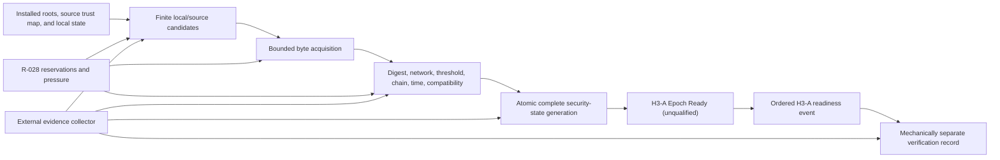

# Withdrawn H3-A standalone implementation brief

Status: **withdrawn and superseded by accepted R-029; retained only as a
technical appendix**

The integrated
[Horizon 3 Stage 1 brief](horizon-3-stage-1-brief.md) replaces this work order.
Do not implement this document independently. Its detailed bootstrap/evidence
material is usable only where R-029 and the Stage 1 brief reference it.

Related records:

- [R-027 — first H3 slice](../research/records/r-027-h3-first-slice.md)
- [R-028 — H3 runtime resource contract](../research/records/r-028-h3-runtime-resource-contract.md)
- [H3 slice gate](entry-gates.md#h3-slice-gate--start-one-closed-test-network-vertical-slice)

## Objective

Implement only H3-A: in a visibly centralized, project-controlled, persistent
Ubuntu test network, a clean or restarted Endpoint must obtain and durably
accept one identical project-authorized experimental Epoch fixture through a finite source
plan, reject every declared invalid/fork/expiry case, retain security epoch/time floors
and conservative H3 Attempted Source History across restart, then emit an exact
ordered readiness-event stream that H separately recomputes from retained state
and evidence, plus one terminal campaign verdict.

This is a product-shaped evidence slice, not a production Control Plane or a
public network.

## Prerequisites before an agent writes code

All are blocking:

1. the Product Owner explicitly marks R-027 and R-028 `decided` and promotes
   H3-A only;
2. their front matter and research-queue rows change from `review` to `decided`
   in the same decision change;
3. the preceding repository/package-layout work is reviewed and either committed
   or clearly separated; the agent must not absorb an unrelated dirty tree;
4. the repository-approved patched Go `1.26.5` toolchain is active and
   `make quick-check` plus `make check` pass on that baseline; a vulnerability
   failure is resolved, not waived, before H3-A implementation;
5. the exact four-VM Ubuntu 26.04 LTS `x86-64` E/S1/S2/H topology from R-027
   is available for the real multi-host evidence phase;
6. the pre-run clock, cgroup-v2, privilege, filesystem, and external-collector
   assumptions can be verified without creating production installation logic.

If a prerequisite is absent, the agent reports it and prepares no placeholder
package or fake multi-host result.

## Exact success path

No arrow may bypass verification or durable commit. The old preconfigured
topology is never a hidden success fallback.

## Frozen topology and test constants

- E (`2 vCPU/2 GiB/100 Mbit/s`) for Endpoint, S1 and S2 (same class) for one
  distributor each, and H (`4 vCPU/8 GiB/1 Gbit/s`) for harness, open-loop
  generators, central evidence, mechanically separate readiness verification, and the
  pre-run offline signer;
- one offline signer operation with no listener and no online-run dependency;
- one installed lab-only source trust map binding source transport key to
  identity, synthetic family marker, opaque endpoint handle, literal sensitive
  `IP:port`, expected SAN, installed test CA, and leaf-key pin;
- one installed distributor client trust map: E is accepted for Endpoint units,
  L1 on H only by S1, and L2 on H only by S2; all client/source/signer keys are
  distinct and no private key is copied;
- distinct identity/key/state/listener/cgroup for every online role;
- one real project-control family in claims; any additional family labels are
  synthetic fixtures and visibly unqualified;
- synthetic `2-of-3` ordinary Ed25519 test signatures;
- one synthetic candidate fixture with no more than `64` static records; it is
  not the product Candidate View;
- one pre-generated corpus of exactly `192` sequential experimental Epoch
  envelopes, each `<= 32 KiB` in the normal workload; runtime keeps only
  active/previous, optional pending, and one temporary generation within the
  R-028 state cap, while hostile parser cells separately reach the `1 MiB` cap;
- one explicit bounded corpus-input cgroup on each source host owns any file
  cache created by pre-staging. It has no live process during candidate work;
  candidate read/validation/activation CPU and the resident current object stay
  in H3-S, while both accounting trees are retained without pretending page
  ownership migrates;
- complete Epoch envelope no more than `1 MiB`;
- read chunks no more than `64 KiB`;
- at most two direct source requests concurrently;
- `1 s` connect, `2 s` cumulative TLS, `3 s` first-frame, `1 s` idle, `5 s`
  request, and `15 s` complete-wave deadlines;
- H3-S profile from R-028;
- one ordered readiness-event/verification stream and one terminal campaign
  verdict.

Candidate-fixture endpoint handles remain synthetic and unresolvable in H3-A.
Only the two source handles map to S1/S2 literal addresses in the sensitive
source trust map. Candidate links use `100 Mbit/s`, `80 ms` added emulated RTT,
independent `0.1%` programmed loss per direction, preflight RTT p50 `<= 5 ms`,
post-impairment p50 `[80 ms, 86 ms]`, and post-impairment
`p95 - p50 <= 10 ms`;
the management plane is unreachable from candidate processes.
Each ordered peer flow is classified by its manifest-bound remote/local data-IP
pair and redirected to its own IFB/root-netem qdisc and seed. L1/L2 have distinct
namespace/data IPs; unmatched candidate-data traffic invalidates the run. H only
orchestrates these receiver-side fixtures and is not an E-to-S data-plane router.

The Endpoint Epoch-path process and each distributor receive separate H3-S
cgroups. Offline signer, corpus-input fixture, external collector, readiness
verifier, and workload clients use the distinct accounting parents fixed by
R-028. Every process and parent appears in the execution manifest. No harness
process may execute online candidate Epoch-path work; the warm immutable corpus
is an explicit bounded fixture cost, not an H3-S or future Node-capacity claim.

Changing any constant creates a new pre-run manifest and candidate identity.
These constants are experiment inputs, not public protocol values.

## Proposed repository boundary

The agent should implement one cohesive deep Module and one thin command. The
first naming candidate is:

| Path | Responsibility |
|---|---|
| `cmd/epoch-bootstrap-lab` | Parse only fixed H3-A commands/inputs, invoke the Module, and translate its terminal result to an exit code. |
| `internal/lab/epochbootstrap` | Own Epoch validation, source sequencing, persistence, readiness, faults, resource reservations, orchestration, evidence, verdict, and cleanup for this one slice. |
| `lab/epoch-bootstrap/` | Human-authored lab-only unit/fixture/manifests needed to reproduce the multi-host scenario; no generated keys, state, evidence, images, caches, or binaries. |

Before using these names, the agent checks the accepted current repository map.
Adding them is one explicit architecture change and must include `doc.go`, real
Implementation, behavior tests, at least one non-test caller, exact permitted
imports, command ownership, and package-map/repository-layout updates in the same
change.

Do not create `epoch`, `model`, `types`, `interfaces`, `util`, `common`,
`storage`, `metrics`, `resources`, or `adapters` packages merely to mirror the
design document. Inside the Module, source, clock, persistence, resource
observation, and evidence seams may be small unexported interfaces with real
lab/fault adapters. A separate resource Module is deferred until a second real
caller proves an independent cohesive boundary.

Existing lab packages may be reused only through their accepted Interface and
package-map direction. Do not move more code or rename packages as incidental
H3-A cleanup.

`internal/lab/epochbootstrap` must not import or modify `internal/lab/namedsite`,
`internal/lab/nativecircuit`, or their OHTTP/route closure. H3-A starts no H2
command and contains no View-to-runtime, Route, Name, Target, or Application Data
shortcut.

## Mandatory implementation increments

H3-A is one research contract but **not one coding prompt or one giant change**.
For the one-to-one team, work stops for review at each increment below. A later
increment may use only behavior and evidence accepted from the earlier one; it
must not add a parallel temporary architecture.

| Increment | Smallest observable outcome | Deliberately not yet claimed |
|---|---|---|
| H3-A0 — evidence freeze | Canonical manifest/sample golden bytes, corpus and fault-plan identities, calculator fixtures, and package-map proposal are reviewable before candidate feature code. | No command, daemon, network, or readiness result. |
| H3-A1 — offline bootstrap tracer | One thin command validates packaged genesis through the exact pipeline, commits one immutable generation, emits one readiness event, and a separate process recomputes it plus a terminal local campaign result. Complete negative parser/signature/state tests accompany the path. | Non-qualifying single-host mechanics only; no direct source or availability claim. |
| H3-A2 — finite authenticated sources | E obtains/revalidates the same corpus bytes from exactly S1/S2 using the frozen mTLS/framing, wave barrier, collision rules, attempt history, and saturating retry contract. | No hostile-clock/restart qualification, load, or Node capacity. |
| H3-A3 — persistent hostile lifecycle | Pending activation, signer transition, fork/conflict, controlled time, crash boundaries, restart, disk/corruption cases, negative events, and emergency fail-stop pass their exact matrix. | No performance or four-host qualification from functional success alone. |
| H3-A4 — bounded runtime tracer | H3-S reservations, cgroup/OS preflight, collectors, per-flow impairment, overload states, diagnostics, cleanup, and the short open-loop ramp work on E/S1/S2/H. | Still no soak, public SLO, production transport, or Node useful-capacity claim. |
| H3-A5 — qualifying short matrix | The complete frozen short matrix produces a valid external evidence root and deterministic machine result on the exact four-host fixture. | H3-A is runnable but cannot receive `advance`. |
| H3-A6 — unattended evidence | Independent `72 h` and `7 day` campaigns use the same accepted candidate/contract and produce separate valid evidence roots and machine verdicts. | Product Owner disposition remains separate; H3-B is not automatic. |

Each coding increment must leave `make quick-check` green and ends with a scoped
review. `make check` is required before integrating that increment. A failure is
fixed within the current increment or returns to its recorded design decision;
it is never hidden by starting the next row.

## Required Module behavior

### 1. Exact-byte Epoch validation

Implement one ordered, side-effect-free acceptance pipeline:

1. bounded envelope and body sizes;
2. strict schema and exact generator representation;
3. content digest and domain separation;
4. expected network identity;
5. signer-policy identity and M-of-N distinct valid signatures;
6. monotonic number, previous digest, and signer transition;
7. strict `valid-after < fresh-until < valid-until` and Time Confidence;
8. experimental protocol/profile compatibility;
9. synthetic candidate-fixture count/digest/record/assignment invariants;
10. exact source declarations against the installed trust map;
11. a typed terminal result without modifying current state.

Ordinary standard-library hashes and signatures only. No custom primitive,
aggregate threshold signature, consensus, or public encoding decision.
Use the exact R-027 content/signature preimages; the current digest is never a
field inside the body it hashes. Implement its fixed canonical JSON body, binary
envelope, scalar lengths/ranges, candidate-fixture digest span, array ordering,
policy-transition rules, and rejection rules;
Candidate identities/endpoint handles are unique,
source-only identities cannot be Route candidates, and Epoch/assignment time
bounds are strict and nested as R-027 specifies.

### 2. Finite source plan

- validate installed/package and last-known-good local candidates first;
- support explicit operator-invoked offline-file import through the identical
  validation/commit path; it is never an automatic fallback;
- create and persist one complete acquisition cycle—id, purpose,
  `LATEST_OBSERVED`/digest selector, randomized source order, attempts, deadline,
  failure count, and next-automatic time—before first contact;
- reject known pre-contact source/candidate-fixture identity, family, and handle
  collisions;
- reserve resource credit before dialing or reading;
- before dial, atomically add the installed source identity/family to the
  non-decreasing H3 Attempted Source History generation; then authenticate
  transport only against the installed source trust map and validate the exact
  returned or digest-selected object;
- use only the R-027 lab profile: mutual TLS 1.3 over TCP to frozen literal
  `IP:port` values, installed test roots, pinned source leaf-key digests, separate
  E/L1/L2 and source transport keys, exact one-request binary framing, full TLS
  1.3 handshakes with client caches/server tickets/early data disabled, and no
  signer-key reuse or DNS lookup;
- mark attempt `started` and add H3 Attempted Source History before dial; restart
  makes it terminal `interrupted` and never repeats it in the same cycle;
- send `LATEST_OBSERVED` to the complete two-source wave, wait for every terminal
  result or `15 s`, and select only the highest observed valid member of exact
  current, exact pending, or a direct one-step successor;
  allow at most one `BY_DIGEST` request per source for an already observed digest;
- persist the exact R-027 saturating automatic backoff: failure count saturates
  at `9223372036854775807`, level saturates at `5`, and base is selected directly
  from `{60,120,240,480,960,1800}` seconds without exponentiation or shifting;
  delay is uniform in `[base/2,base]`, and accepted fresh state or complete exact-
  current fresh revalidation resets count/level;
- never add DNS, peer discovery, DHT, clearnet fallback, alternate network, or
  another source after observing failure;
- return explicit unavailable, timeout, cancelled, authentication, conflict,
  incompatibility, clock, local-resource, and persistence results.

### 3. Crash-safe activation

- serialize every security-state transition through one owner and persist exact
  active and optional pending bytes/digests, signer-policy state, non-decreasing
  epoch/time floors, observed conflict, source order, H3 Attempted Source
  History, acquisition cycle/attempt/backoff, and verdict inputs as one complete
  immutable generation;
- flush and rename the complete temporary generation, then atomically replace
  and directory-flush one `current` pointer; only that pointer activates state;
- cap each deterministic state blob at `2560 KiB`. After pointer commit and
  before event emission, durably create the exact R-027 verification capsule
  containing event, hard-linked immutable state blob, pointer snapshot, and
  digests; retain it until digest-matching external spool and verification ack;
- bound that spool to `15` ordinary plus one reserved terminal capsule and
  `48 MiB`. Reserve before ordinary commit; pressure emits
  `not_ready/evidence_failure` through the terminal slot, while inability to
  preserve even that terminal capsule invokes the `2 s` fail-stop;
- ignore and report orphan generations, fail closed on a missing/corrupt
  pointer, and never choose an arbitrary older generation;
- distinguish exactly three startup states: a completely absent owned state root
  may initialize only packaged genesis Epoch `1`; a root with a valid `current`
  pointer is normal; an existing empty/partial/missing-pointer root is corrupt
  and fails closed;
- revalidate all persistent state on every start;
- preserve a valid last-known-good state without allowing a lower state to
  replace it;
- make corruption, disk full, bad permissions, and crash at every boundary
  explicit and testable;
- expose readiness only after the durable transaction completes.

A future-valid N+1 occupies only the optional pending slot and never replaces
fresh active N. Its timer activation is another atomic generation transition and
survives restart. Full-directory rollback is an explicit unprotected limitation;
only lower replay against surviving epoch/time floors is rejected.

Do not introduce a database unless H3-A is first stopped and a separate research
record demonstrates why the bounded immutable-generation protocol cannot satisfy
the contract.

### 4. Freshness/experimental readiness

- `fresh`: new acquisition/readiness-event work may start;
- `staged`: pending only; active fresh state and its readiness remain unchanged;
- `stale`: no new work; existing bounded work only until the earlier Work Safety
  or Epoch terminal time;
- `expired`, `conflicting`, `invalid`, `incompatible`, `clock uncertain`,
  `PROTECT`, `DRAIN`, and `draining`: not ready;
- no expiry grace or wall-clock rollback may extend trust;
- two same-number threshold-valid different digests persist `conflicting` and
  are never merged or chosen by source preference.

The only positive label is `H3-A Epoch Ready (unqualified)`. It is not Common
Readiness, Target Connect Readiness, Route Qualification, or a public SLO.

H3-A uses the controlled clock preflight in R-027. It does not add an
authenticated-time network protocol. While readiness is positive, it durably
checkpoints `trusted_time_floor` at least every `30 s`; a checkpoint may coalesce
with another generation but otherwise emits its own event, and lateness above
`250 ms` removes readiness. A crash may lose up to `30 s` of uncommitted
monotonic progress. Restart stays not-ready until the external `<=2 s` clock
condition is restored and a new floor is committed.

### 5. Terminal H3-A outcome

Every committed security/readiness state generation emits the exact bounded
canonical `ardents-h3-readiness-event-v1` event from R-027. H separately
recomputes the verification-capsule digest and revalidates its sequence, raw
Epoch envelope, immutable state/current-pointer
snapshot, both manifests, bracketing clock/resource samples, `valid_until`, and
current generation/status, then emits `ardents-h3-verification-v1`. E's
self-reported label cannot make the cell pass. A campaign ends in the distinct
`ardents-h3-campaign-verdict-v1` record. This is mechanically separate
recomputation under the same project operator, not an independent auditor or
operator-family claim.

A terminal result before the first event is representable: `pair_count = 0`,
both sequence bounds are zero, and the pair digest is the domain-separated empty
hash. Candidate-caused failure produces machine `fail`; harness/preflight failure
produces `invalid` under the exact R-027 mapping.

The negative reason order includes `persistence_failure` and `evidence_failure`
before cleanup/shutdown/resource/time/state reasons. If the negative generation
can be committed, it must be emitted normally. If commit or emission is
impossible, E first closes admission/listeners and clears in-memory readiness,
then exits voluntarily within `1 s` or is terminated by the external supervisor
within `2 s`. Liveness is sampled at least every `250 ms` and expires after
`500 ms`; therefore an old positive artifact may look current for at most
`2.5 s`, while no new work is accepted. Do not describe this as instantaneous
revocation.

This outcome proves only bounded authenticated bootstrap. H3-A does not create
the product Candidate View, materialize candidates, configure a persistent Node,
or attempt a Route, Named Site, Private Resolution, or Application Data exchange.
H3-B research owns the first runtime consumer and must explicitly resolve how
the synthetic fixture gives way to canonical View/materialization semantics.

### 6. Resources, overload, and shutdown

Implement the full R-028 H3-S contract, including:

- harness-owned full cgroup-ancestry preflight and candidate-owned validation of
  only its accessible leaf/runtime/rlimit/profile state;
- reservation before goroutine, FD/socket, buffer, timer, or evidence work;
- H3-A working caps and external process-tree accounting;
- fixed `GOMAXPROCS=2`, `GOGC=100`, and `GOMEMLIMIT=768MiB` after preflight;
- `NORMAL -> PROTECT -> DRAIN` with low-watermark hysteresis;
- no automatic limit increase, unbounded queue, disk spill, random eviction, or
  false success;
- local-only low-cardinality diagnostics;
- first-signal bounded drain and `60 s` total graceful-exit deadline;
- the distinct `2 s` emergency fail-stop and `250/500 ms` external-liveness
  evidence contract when a readiness-removing commit or emission is impossible.

The implementation uses the exact Endpoint/distributor work units, cadences,
open-loop start schedules, byte artifacts, role-to-cgroup ownership map,
cell-delta GC rules, disk limits, and fault-specific oracles in R-028. A
percentage label by itself is not a load test. The candidate never starts,
stops, joins, or configures the external collector.

## Dependencies

Expected new runtime dependency count: **zero**.

The pre-provisioned Ubuntu fixture must supply the manifest-bound
`iproute2/tc`/IFB functionality required by R-028. Treat it as a recorded lab
tool with verified cleanup, not a Go dependency, bundled installer, or production
network component.

Use the standard library first: `context`, `crypto/ed25519`, `crypto/sha256`,
`crypto/tls`, `crypto/x509`, strict encoding support, `errors`, `io`, `net`,
`os`, `os/signal`, `path/filepath`, `runtime`, `runtime/metrics`, `log/slog`,
`sync`, and `time` as actually needed.

Before any `go.mod` change, stop implementation and add the exact candidate,
version, reachable closure, license, security, maintenance, removal plan, and
reason the owned standard-library solution is less safe to
[dependencies.md](dependencies.md). Popularity or use by libp2p is not enough.

Forbidden dependency-by-inertia:

- libp2p, Kad-DHT, Waku, mDNS, AutoNAT, hole punching, default relay/bootstrap;
- database/storage engines;
- Kubernetes/Nomad clients or cluster control planes;
- Prometheus/OpenTelemetry remote telemetry;
- custom/aggregate threshold cryptography;
- any H2 OHTTP/Route dependency imported only to create a false product canary.

## Evidence schema and privacy

R-027/R-028 freeze the semantic evidence contract before code: contents,
ownership, cadence, bounds, privacy split, formulas, gates, and result calculus.
The implementation must freeze canonical field order/scalars plus golden bytes
for two linked manifests and every external sample record before running its
first candidate scenario. This serialization is lab-only; changing it changes
candidate identity. Generated evidence stays outside the repository:

- a retained reproducibility manifest uses synthetic host/role IDs and contains
  candidate, corpus, exact workload, fault, resource, and expected-result data;
- a separately access-controlled sensitive execution manifest maps those IDs to
  real addresses, controlled-clock details, paths, cgroup ancestry, and credential
  identifiers/paths, never private-key bytes; only its digest enters the retained
  bundle.

Retain:

- source/build/toolchain/synthetic-host/profile identity and the sensitive
  execution-manifest digest;
- exact public test-key and Epoch digests;
- frozen source order, random seed, exact Endpoint/distributor workload, Epoch
  corpus sizes/digests, fault schedule, and expected terminal class;
- every source, validation, persistence, readiness-event, separate-verification,
  pressure, restart, shutdown, and cleanup transition;
- raw one-second external cgroup/process-tree samples and selected Go runtime
  metrics;
- every failure, timeout, cancellation, and invalidated run;
- deterministic `pass`, `fail`, or `invalid` campaign result; Product Owner
  `advance`, `redesign`, or `stop` disposition remains separate.

All percentiles, means, ratios, one-second populations, tick tolerance, missing
samples, probe-window exclusions, integer/fixed-point comparisons, failed-unit
handling, and histogram bounds use the single deterministic H3-A calculus in
R-028. Do not reuse a Route Qualification helper unless its behavior is proven
byte-for-byte identical to that contract.

Neither manifest retains private-key bytes or unrelated host data. The ordinary
evidence bundle never retains Service Name/Target, Application Data, live Route,
Entry membership, user/attacker-controlled metric labels, or a persistent IP
graph; the minimum execution-only mapping lives solely in the sensitive
manifest. Profiles/traces are opt-in local evidence and never served remotely.
The retained layer permits calculator/hash recomputation over disclosed redacted
inputs. Verification of real topology, clock, cgroup, path, and credential
bindings requires sensitive access, so this is not independent execution
attestation.

## Required tests and scenarios

### Fast behavior tests

- every validation step and precedence rule;
- self-reference absence for the current digest and equal/reversed validity
  boundaries;
- below/at/above all size, count, time, retry, queue, and resource bounds;
- same-number fork and monotonic chain cases;
- fast valid A plus delayed conflicting B with no pre-barrier readiness;
- fresh N plus pending future N+1 and restart on both sides of `valid-after`;
- signer-policy transition matrix;
- strict parser duplicate/unknown/trailing/oversize cases;
- source-order/cycle/started-attempt/backoff persistence, selective withholding,
  exact `LATEST_OBSERVED`/`BY_DIGEST` framing, source declaration/trust-map
  mismatch, offline import, exhaustion, every backoff level, the saturating
  failure-count boundary, and absence of arithmetic wraparound;
- reservation acquire/release under success, error, panic-free cancellation, and
  timeout;
- persistence crash points and startup revalidation, plus restoration of a
  complete older state directory as the expected recorded non-protection rather
  than a false rollback success;
- verification-capsule crash points, rapid transition/collector lag, exact
  acknowledgement, cleanup only after verification, terminal-slot use, and
  fail-stop when the reserved capsule cannot be preserved;
- experimental-readiness and pressure-state transitions with a controllable
  monotonic clock, the `30 s` floor-checkpoint cadence, `250 ms` lateness bound,
  and restart after every checkpoint crash boundary;
- committable persistence/evidence failures produce their exact negative event;
  non-committable/non-emittable failures close admission and satisfy the `2 s`
  service-death plus `500 ms` observer bound;
- redaction/cardinality and deterministic verdict tests.

### Real multi-host matrix

Run every R-027 verification/source/time/persistence/readiness case and every R-028
preflight/pressure/FD/GC/shutdown cell on the frozen Ubuntu topology. At minimum:

- `100` clean starts and `100` routine restarts;
- exactly `20` restart/shutdown cycles in each of idle, acquisition, validation,
  readiness-event, and PROTECT, split `10` service + `10` full-VM restarts per state;
- zero false acceptance in every security-negative cell;
- Endpoint success `>= 99%` of offered refresh units and each distributor success
  separately `>= 99%` of precomputed open-loop units within `5 s`;
- clean start to `H3-A Epoch Ready (unqualified)` `p95 <= 15 s`, routine restart
  to that result `p95 <= 5 s`, with failures counted as infinity;
- capacity ramp and chosen `30 min` run;
- no H3-S resource, GC, queue, leak, or cleanup violation.

### Soak is a separate evidence campaign

Do not keep one implementation agent silently running for a week. After code
review and the complete short matrix:

1. freeze the candidate binary, protocol/resource contract, corpus, and the
   first campaign's retained and sensitive manifests;
2. run the initial `72 h` unattended soak with the exact refresh/distributor
   workload and separate readiness-event verification;
3. provision virgin candidate-state roots and distinct retained/sensitive
   manifests for a separate `7 day` campaign; reuse the exact immutable genesis
   and corpus, never rewind the first campaign's active state, and start no later
   than `7 days` after the first campaign ends;
4. run `7 days` unattended before H3-B may be proposed for promotion.

Both campaigns produce their own evidence root and machine verdict. Any change
to candidate bytes or the frozen protocol/resource contract invalidates both
results and restarts at `72 h`; a harness-only repair changes the harness
identity and reruns every affected campaign in full.
Corpus creation and both campaign preflights must prove every exact scheduled
activation lies within its signed absolute freshness/validity bounds through the
campaign end. Missing that window creates a new corpus/candidate identity and
restarts the sequence at `72 h`; no timestamp is shifted.

An implementation task can finish with the campaign runnable and the short
matrix green. **H3-A itself does not receive `advance` until the required soak
evidence exists.**

## Work sequence for the implementation agent

1. Re-read repository instructions, decided R-027/R-028, current package map,
   and dirty-state ownership; report any contradiction before editing.
2. Freeze canonical manifest/sample serialization and golden bytes, exact
   workload/corpus, result vocabulary, and deterministic verdict fixtures without
   changing the already-frozen evidence semantics.
3. Add the exact package/command/layout registration together with the first real
   vertical behavior; no empty scaffolding and no happy-path networking before
   the evidence fixtures in step 2 are testable.
4. Implement pure Epoch validation and its complete negative matrix.
5. Implement the single-owner immutable-generation commit and finite trusted
   source sequencing with fault adapters.
6. Implement H3-S reservations, preflight, pressure, diagnostics, and shutdown.
7. Implement the exact readiness-event stream, separate harness verification,
   and terminal campaign verdict with no self-reported-success path.
8. Add the real Ubuntu/systemd/cgroup-v2 fixture and external collector.
9. Run `make quick-check` continuously and `make check` before handoff; never
   weaken a gate.
10. Run the short multi-host matrix, retain evidence outside the repository, and
    report exact passes, failures, limitations, and the command for the separate
    soak campaign.

Each commit should contain one coherent tracer step or research-result repair,
not the complete H3 horizon.

## Definition of implementation-task done

The coding task is done only when:

- all intended behavior exists behind one deep Module and thin command;
- no forbidden H3-B+ feature, production foundation, public API, or dependency
  entered the tree;
- E's standalone or stale readiness label cannot make the H3-A verdict pass;
- all behavior/unit/integration/security/resource tests pass;
- the short real multi-host matrix meets every threshold;
- package/dependency/layout records exactly match reality;
- `make check` passes on the final tree;
- generated state/evidence/captures/secrets are absent from Git;
- the agent provides the content-addressed evidence location, recomputed verdict,
  remaining limitation, and exact soak procedure;
- documentation still calls the network project-controlled, synthetic, and
  unqualified.

The task is **not** done merely because an Epoch verifies once or the three
candidate processes start.

## Immediate stop conditions

Stop, preserve evidence, and report before expanding scope if:

- R-027 or R-028 is not `decided`;
- the baseline tree has overlapping unowned changes or a failing gate;
- the exact four-VM E/S1/S2/H topology is unavailable for the real phase;
- H cannot recompute E's exact readiness event/current-state conjunction or the
  campaign verdict;
- correct behavior needs a DHT, database, consensus system, production wire,
  custom crypto, public DNS, or cluster orchestrator;
- any R-027 security/fork/persistence invariant fails;
- any R-028 OOM/unbounded/false-success/GC/resource/shutdown invariant fails;
- evidence cannot distinguish candidate failure from harness failure;
- a synthetic family/key/process is about to be described as independent or
  decentralized.

The correct outcome is then `redesign` or `stop`, not compensating scope in Node
admission, Bridges, Namespace, updates, Windows, SDKs, or UI.
