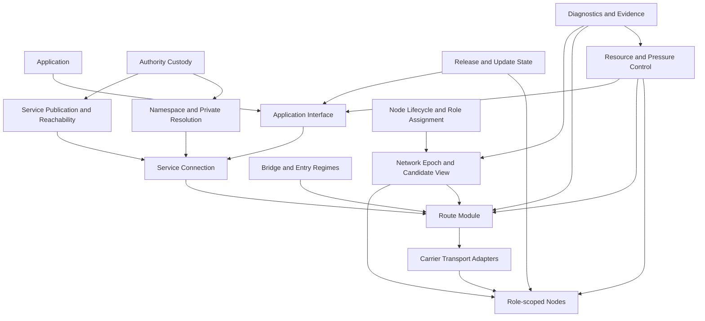

# Horizon 3 technical design — Closed Test Network

Status: **accepted H3 sequencing design; implementation authority is stage-specific**

Audience: Product Owner and implementation agents.

This document is the technical map for the complete Horizon 3. It converts the
accepted product journeys into sequential, testable implementation outcomes
without selecting production foundations by inertia. Detailed research records
remain appendices; they do not replace this cross-H3 design.

Authoritative inputs:

- [product scope](../product/scope.md#horizon-3--closed-test-network);
- [product journeys](../product/journeys.md);
- [functional map](../product/functional-map.md);
- [operating model](../product/operating-model.md);
- [threat model](../security/threat-model.md);
- [R-029 accepted Stage 1 decision](../research/records/r-029-h3-authenticated-node-lifecycle.md);
- [R-027 accepted bootstrap appendix](../research/records/r-027-h3-first-slice.md);
- [R-028 accepted resource/evidence appendix](../research/records/r-028-h3-runtime-resource-contract.md).

The earlier working label `H3-A` refers only to the detailed bootstrap/resource
candidate in R-027/R-028. It is not the name or scope of Horizon 3 and does not
pre-decide the implementation order below.

## 1. Horizon outcome

Horizon 3 produces one persistent, project-controlled, multi-host Ardents Closed
Test Network in which the complete product lifecycle can be exercised:

1. install and start an Endpoint;
2. obtain authenticated current network state;
3. admit, assign, drain, and withdraw bounded Node roles;
4. publish a Service under a stable Service Target;
5. connect to that Target or an exact known Service Name;
6. exchange opaque Application Data through the local Application Interface;
7. recover a live Service Connection from eligible path failure;
8. connect through a Bridge in a declared blocked-entry profile;
9. migrate a Service Instance without changing its uncompromised Target;
10. update or roll back Endpoint, Publisher, and Node processes without losing
    authority or freshness state;
11. expose bounded local diagnostics and reproducible qualification evidence;
12. run on Ubuntu infrastructure and exercise the client boundary on Ubuntu and
    Windows.

The network remains visibly centralized and project-key-controlled. H3 may prove
mechanical security properties in a controlled topology, but it cannot prove:

- independent operators, custodians, builders, or auditors;
- public decentralization or censorship resistance;
- anonymity against a global or multi-position observer;
- permissionless public capacity or fair Sybil resistance;
- production suitability of an unqualified Route, transport, Namespace, update,
  or Application-isolation candidate.

Those are Horizon 4 promotion gates, not omissions to hide inside H3.

## 2. Product actors and trust boundaries

H3 preserves the accepted domain separation. No implementation may collapse
these concepts to simplify an API or data model.

| Concept | Owns or represents | Must not become |
|---|---|---|
| User | A human using an Application | Network account, Node identity, global principal |
| Developer | Integrates an Application or publishes a Service | Network administrator or required custodian |
| Endpoint | One installed runtime and protected local-state boundary | User, Device identity, Service, or Node |
| Client | Endpoint capability opening Service Connections | Public User identity or infrastructure Node |
| Publisher | Endpoint capability publishing Services | Service Authority or Contributor Node |
| Network Contributor | Supplies one or more bounded network roles | Owner of Users, Services, or Application Data |
| Node Identity | Authenticates one infrastructure process family and lifecycle | Service address, User identity, or proof of independence |
| Service Authority | Durable authority over one Service Target | Runtime Instance Key or Local Grant |
| Service Target | Location-independent machine destination | Node ID, IP address, or Service Name |
| Service Instance Key | Private key of one active hosting generation | Exported migration secret or root authority |
| Service Credential | Bounded public authorization for one Instance generation | Private key or permanent hosting authority |
| Name Authority | Controls one Service Name lifecycle | Service Authority or naming server identity |
| Application Principal | OS-local identity for one Application process tree | Network identity or copyable bearer token |
| Local Grant | Endpoint-local authorization for one principal and operation set | Network credential or global approval |
| Transport identity | Authenticates a particular transport/session duty | Node, Service, Name, or User identity by implication |

Personas, profiles, contacts, accounts, groups, retained messages, and
application authorization are Application or Overlay Service concerns. H3 does
not import a universal identity system into the network core.

## 3. Logical architecture



The boxes are logical deep-module boundaries, not permission to create empty Go
packages. A stage creates a package only with a real Interface, maintained
Implementation, behavior tests, a non-test caller, exact imports, and package-map
registration.

The boundaries communicate through the following product contracts. The table
defines ownership and failure direction; it does not freeze Go APIs or wire
serialization before the corresponding stage research is accepted.

| Producer | Consumer | Contract | Fail-closed behavior |
| --- | --- | --- | --- |
| Authenticated Control State | Node Lifecycle, Route | Current Epoch/View, freshness, verification status | Stale, unknown, or unverifiable state cannot admit a Node or create a Route |
| Node Lifecycle | Control State | Bounded admission, role, withdrawal, and terminal-exposure facts | Ambiguous ownership or incomplete withdrawal excludes the Node |
| Control State | Route | Eligible role-scoped Node materialization and exclusion input | Missing diversity/freshness input prevents the requested Route profile |
| Bridge | Route | Bounded adjacent-entry capability with expiry and profile | Failure never falls back to a forbidden ordinary entry |
| Route | Carrier Transport | One hop request with peer, security profile, deadline, and budget | Unsupported or weaker transport is rejected, not negotiated silently |
| Service Publication | Service Connection | Authenticated current Service Target and reachability material | Stale or unauthorized generation cannot receive a new connection |
| Namespace | Service Connection | Exact Service Name to authenticated Service Target binding | Unknown, expired, conflicting, or ambiguous name is not resolved |
| Application Interface | Service Connection | Connect/listen/byte-stream operations with cancellation and classified result | No ambient network access or hidden retry outside the declared profile |
| Resource Controller | Every runtime boundary | Admission token, budget, pressure state, and release obligation | New optional work stops before established useful work is killed |
| Release State | Every process | Allowed build/profile, compatibility, rollback, and recovery state | Unknown or incompatible build cannot become current |
| Evidence boundary | Product Owner/verifier | Manifest-bound events, samples, verification records, and terminal verdict | Missing or unverifiable evidence makes the campaign invalid, never pass |

### 3.1 Local Endpoint boundary

The Endpoint owns:

- local IPC and Application Principal binding;
- Local Grants and their revocation hierarchy;
- Client and optional Publisher capabilities;
- Isolation Contexts;
- Direct Source Exposure Set and Entry exposure;
- current authenticated state and freshness floors;
- local resource policy and capability readiness;
- no global User identity.

The ordinary Application Interface has two least-privilege surfaces:

- **Connection Interface:** connect, accept, read, write, close, cancel, and
  classified results;
- **Service Administration Interface:** configure publication using an already
  issued Credential and matching non-exportable Instance Key.

Authority Custody is a separate stronger local boundary. Connection access never
implies Service administration, and neither implies root-authority custody.

### 3.2 Control-state boundary

The control-state plane authenticates shared facts but carries no Application
Data. It owns:

- Network Epoch validation, freshness, rollback floors, and conflict state;
- signer/control-root transition state;
- logical Candidate View commitment and publication cutoff;
- bounded Candidate Materialization acquisition;
- protocol and Route Profile compatibility;
- Node eligibility inputs and Role Domain Assignment;
- finite source sequencing and Direct Source Exposure;
- explicit stale, conflicting, incompatible, blocked, and unavailable outcomes.

Authorization and distribution remain separate. Package, cache, mirror, peer, or
file may distribute identical bytes; none becomes authoritative merely by being
reachable.

Accepted R-029 combines the adopted R-027/R-028 mechanics with the first real
Candidate View and Node lifecycle consumer. R-027's standalone bootstrap-first
order is withdrawn. A bootstrap mechanism that no later component consumes is
not an H3 vertical result.

### 3.3 Node lifecycle boundary

Each Node process has distinct identity, state, listeners, resource parent, and
declared role capability. Its lifecycle is:

```text
disabled -> self-check -> probation -> eligible
eligible -> stop-new-work -> draining -> withdrawn
eligible -> quarantined -> probation | withdrawn
```

A signed expiring Node Record declares identity, known family, supported role,
transport handles, bounded capacity, and validity. Candidate View eligibility
adds authenticated Role Domain Assignment and policy state.

Hard invariants:

- one Node identity and known family occupy no conflicting Route domains during
  overlapping duty lifetimes;
- reassignment stops new work and drains/quarantines old duties before new-domain
  eligibility;
- withdrawal removes new assignments first and retains only bounded drain state;
- crash/restart never resurrects an expired duty or live route handle;
- stronger hardware adds measured capacity, not authority, priority, or trust;
- multiple project-controlled Node keys never count as independent operators.

### 3.4 Route and Service Connection boundary

The Route Module consumes authenticated Candidate Materializations and creates a
multi-hop route that satisfies identity, family, Role Domain, source-exclusion,
profile, and resource constraints.

The Service Connection is the stable Application-visible stream. It binds:

- exact Service Target;
- supplied destination provenance: Name/Service Link or Target/Target Link;
- current Service Instance proof;
- Isolation Context;
- Route Profile and protocol version;
- Work Safety Lease;
- fresh session keys and route generation.

The Application never receives raw Node IDs, route topology, bootstrap sources,
Bridge membership, or retry internals.

The Service Connection owns ordered unique Application bytes, end-to-end
confidentiality/integrity, bounded logical buffering/backpressure, same-
connection continuity/recovery, and the explicit terminal result. Route owns
endpoint-local path selection and bounded replaceable Route Attachments; Carrier
owns one bounded authenticated channel for a Route leg. The Application owns
data meaning, login, authorization, persistence, semantic retry, idempotency,
and whether to open a new Service Connection after a terminal result.

### 3.5 Carrier Transport boundary

A Carrier Transport Adapter supplies bounded authenticated channels to the Route
Module. The Route and Service Connection contracts must not depend on one
transport's address, stream, connection, NAT, or discovery model.

Candidate families for H3 experiments include:

- TCP with a reviewed authenticated encrypted session;
- QUIC through a reviewed Go implementation;
- HTTPS/WebSocket/HTTP2/HTTP3-shaped channels for constrained networks;
- selected libp2p components behind an explicit Adapter;
- pluggable Bridge/camouflage transports.

H3 does not select all of them. Each comparison freezes the same useful-work,
security, failure, and resource contract. No transport may silently enable DNS,
public bootstrap peers, DHT, mDNS, relay, hole punching, AutoNAT, or metrics.

### 3.6 Service publication boundary

Publication uses the hierarchy:

```text
Service Authority
  -> Service Target
  -> bounded Service Instance Credential
  -> host-generated Service Instance Key
  -> expiring reachability and Introduction publication
```

The active hosting runtime receives only the Instance Key and public Credential.
It does not require an online Service Authority. Publication readiness requires
acknowledged fresh reachability and Introduction coverage, not merely a local
listener.

Routine migration:

1. stop or drain the old Instance;
2. generate a new private Instance Key on the new host;
3. reconcile authority/network generation;
4. issue a higher-generation public Credential;
5. publish new reachability for the same Target;
6. revoke or allow bounded expiry of the old generation.

Copying a Credential or Instance public data alone grants no hosting power. A
lost/compromised Service Authority requires a replacement Target; an independent
Name Authority may later move the stable name to it.

### 3.7 Namespace and Private Resolution boundary

The canonical Service Name is lowercase ASCII and dot-hierarchical. It is not a
DNS name, onion address, search keyword, Node identity, or proof of access.

H3 Namespace candidates must support:

- permissionless claim or bounded delegation;
- renewable expiring Name Lease;
- monotonic revisions and conflict/fork state;
- transfer and precommitted recovery;
- release and descendant behavior;
- binding to Service Target rather than host reachability;
- exact-name private resolution without indexing or browsing;
- Service Link `ardents://<name>` and a distinct Target Link;
- explicit no-result on stale, released, recovery-pending, conflicting, or
  incompatible state;
- no DNS, HTTP, search, local-alias, or alternate-namespace fallback.

ENS-like authority/lease ideas may be evaluated, but H3 does not select a
blockchain, token, wallet, or global account by default. The candidate must show
how anonymous admission cost, withholding, concurrent claims, partitions, and
rule-version forks remain bounded.

### 3.8 Bridge and hostile-entry boundary

H3 has ordinary and Bridge entry regimes. A Bridge Invite is acquired outside
ordinary public DNS and authorizes only one bounded endpoint-adjacent role.

Bridge invariants:

- a Bridge sees the connecting Endpoint IP and traffic pattern; this is explicit;
- one Bridge identity is eligible for exactly one adjacent Role Domain;
- an Invite cannot create an unbounded Entry set or reset exposure history;
- blocked/failing Bridges cannot force endless probing or direct fallback;
- only owner action or bounded local censorship-recovery policy changes regime;
- camouflage failure is explicit and makes no undetectability claim;
- Bridge identity/family cannot reappear in the same Endpoint's Route or
  Destination Resolution eligibility during its exposure lease.

Camouflage is a replaceable Adapter family. It does not alter Route identity,
Service authentication, or Application semantics.

### 3.9 Recovery boundary

Recovery preserves one Service Connection and progresses in this order:

1. repair or replace a Carrier Channel;
2. attach a new leg to the same Rendezvous;
3. after Rendezvous loss, create a fresh sealed Introduction attempt and new
   Rendezvous;
4. terminate explicitly when the bounded recovery deadline expires.

Every attachment proves the same endpoint-only continuity state with fresh
handles, keys, and monotonic route generation. Target, Isolation Context, Route
Profile, stream identity, byte order, and uniqueness do not change.

Recovery never reissues an Application operation, opens a hidden replacement
Service Connection, takes a shorter/direct route, weakens security, or exposes
topology. Detected modification, replay, cross-target attachment, or downgrade
fails closed rather than counting as availability.

### 3.10 Release, update, and recovery boundary

Release authority is separate from package distribution. H3 prototypes:

- threshold-authenticated release metadata and artifact digests;
- platform binding and dependency/source identity;
- staging under finite disk reserve;
- stop-new-work and bounded drain;
- atomic executable/configuration switch;
- startup self-test and compatible rollback;
- non-decreasing release/protocol/build watermarks;
- explicit update-required, incompatible, expired, and revoked outcomes;
- Authority Vault and Authority Recovery Bundle preservation;
- offline import and explicit direct-disclosure recovery paths.

H3 may use project test roots and reproducible laboratory packages. Public
custodians, independent builds, public update privacy, and signed end-user
packages remain H4 gates.

### 3.11 Platform and Application-isolation boundary

Ubuntu LTS `x86-64` is the H3 infrastructure baseline. Client-side behavior is
exercised on Ubuntu and Windows 11.

A generic adapter may expose the Application Interface without controlling the
Application's other networking. It is useful but receives no Application-level
location-privacy claim.

ADR-0016 and decided R-051 make claim-bearing attachment launcher-only: one
private inherited channel, stable root process handle, and complete non-breakaway
Job/cgroup tree are joined with the Local Grant, Isolation Context, resource
parent, Broker start, and deadline. Named endpoints remain a coarse generic
trust domain. The co-resident direct-binary Adapter remains first-class in
Installed and Portable with claim `none`; it neither needs installation nor
pretends to authenticate an external peer. The exact candidate and its open
Windows Job-limit Go-surface constraint are recorded in the
[Application Principal specification](stage-7-application-principal-spec.md).

A Network-Isolated Application Boundary must instead deny ordinary DNS, HTTP,
WebSocket, WebRTC, QUIC, and arbitrary socket ingress/egress by default for the
complete Application/helper process tree. R-052 freezes two exact native
candidates: non-setuid bubblewrap namespaces around the R-051 cgroup/pidfd tree
on Ubuntu, and an ephemeral zero-network-capability AppContainer inside the
R-051 Job on Windows. Neither mutates host firewall, DNS, routes, proxy, or VPN.
The exact policy and unsupported Stage 7 isolated-browser result are recorded
in the
[Application Isolation specification](stage-7-application-isolation-spec.md).

The experiment must prove sibling Application Principal separation, restart
rebinding, no reusable bearer-only authority, no direct-network fallback, and
complete cleanup. It does not turn arbitrary third-party code into an anonymous
Application.

## 4. State ownership and persistence

H3 uses separate state classes with explicit owners. A shared database is not an
architecture shortcut.

| State class | Owner | Persistence and rollback rule |
|---|---|---|
| Installed release roots and packaged bootstrap | Installer/update boundary | Immutable, versioned, authenticated independently of delivery |
| Authority Vault and recovery watermarks | Authority Custody | Encrypted/protected; never exposed to runtime Connection or Service Administration Interfaces |
| Network Epoch, Candidate View commitment, time/epoch floors | Control-state module | Crash-consistent, non-decreasing floors, explicit conflict/incompatibility |
| Direct Source Exposure and Entry regime | Endpoint | Installation-scoped and non-resettable by Application or Isolation Context |
| Node identity, assignment, probation, drain | Node lifecycle | Cannot restore expired duty or overlap old/new domains |
| Service Target and public Credentials | Authority/public state | Monotonic generation; runtime holds no root authority |
| Service Instance Key | Active Publisher host | Non-exportable; migration generates a new key |
| Name Authority, Lease, revision, recovery policy | Namespace/Authority Custody | Separate from Service Authority; explicit fork and recovery state |
| Local Grants and principal bindings | Endpoint local authorization | Persistent policy may survive; ephemeral capabilities never survive restart |
| Route, session, continuity, buffers | Route/Service Connection | Ephemeral and bounded by Work Safety; never restored as live after restart |
| Diagnostics and qualification evidence | Evidence owner | Bounded locally; exported only under declared redaction and manifest rules |

Every persistent module declares:

- exact owned directory or store;
- single writer/transaction boundary;
- authenticated schema version;
- maximum size and retention;
- crash points and recovery behavior;
- migration and rollback compatibility;
- cleanup responsibility;
- data explicitly forbidden from that state.

Storage candidates are immutable files/generations first, with bbolt or SQLite
evaluated only when a real module demonstrates transaction/query needs. No store
becomes network consensus or distributed truth by convenience.

## 5. Resource and performance architecture

### 5.1 Hierarchical ownership

Every accepted unit of work has a complete resource ancestry:

```text
host/profile
  -> Endpoint or Node role
    -> peer / Service / Isolation Context
      -> Service Connection or control operation
        -> stream / request / buffer / timer
```

Before an operation can allocate or start, it reserves the applicable:

- CPU/admission credit;
- goroutine/process credit;
- socket and file-descriptor credit;
- resident-byte and queue-byte credit;
- timer/retry credit;
- persistent/evidence disk credit;
- link/workload credit where the profile requires it.

No queue is unbounded. Full leaves or parents apply backpressure, would-block,
bounded capacity failure, or protective drain. They do not claim success, spill
silently to disk, evict random established work, or borrow from another Service,
peer, context, or role.

### 5.2 Pressure states

Every persistent process implements an externally observable state machine:

```text
NORMAL -> PROTECT -> DRAIN -> EXIT
```

- `NORMAL`: ordinary admission within all headroom gates;
- `PROTECT`: stop optional work and reduce/reject new expensive operations while
  preserving finite control and established progress;
- `DRAIN`: no new work, bounded cancellation/close, negative readiness, exit on
  deadline;
- `EXIT`: owned listeners, processes, sockets, temporary state, and fixture
  resources are gone.

Return from PROTECT requires all resource-specific low watermarks for a declared
continuous interval. DRAIN does not silently return ready in the same process.

### 5.3 Go runtime

Go is the maintained implementation language. Each measured profile fixes and
records:

- effective cgroup/Job Object and host ancestry;
- `GOMAXPROCS` appropriate to the fixed CPU budget;
- `GOMEMLIMIT` below the process-tree memory ceiling with explicit non-Go headroom;
- starting `GOGC` hypothesis, normally `100`, as part of profile identity;
- live heap/object count, allocation rate, GC CPU, limiter activation, pause
  histogram, scheduler latency, goroutines, and OS threads;
- process-tree RSS, anonymous/file/socket/slab memory, and OS OOM events;
- quiescence probes proving that churn does not create monotonic leaks.

The runtime never raises limits automatically to pass a workload. If the live set
cannot fit or GC dominates useful work, the candidate rejects/drains or is
redesigned.

### 5.4 Reference classes and useful work

H3 separates experiment containment from eventual product floors:

- infrastructure comparison host: Ubuntu `2 vCPU`, `2 GiB`, symmetric
  `100 Mbit/s`;
- client/publisher reference endpoint: Ubuntu or Windows `4 vCPU`, `8 GiB`,
  SSD-backed, no required GPU;
- external harness/collectors: separate process trees and budgets, never hidden
  inside candidate capacity.

The existing product targets remain evidence questions, not copied constants:

- Client: at least `64` open / `16` active Service Connections;
- Publisher: at least `256` open / `64` active Service Connections;
- ordinary path recovery goal: `p95 <= 5 s`, explicit terminal result by `15 s`;
- Node: each selected role must first define a measurable useful-work unit and
  effective post-exclusion capacity.

Scale-up on stronger hardware requires a frozen larger profile, proportional
useful-work increase, resource reserve, and unchanged security/failure behavior.
More hardware grants no authority, priority, role, family, or trust.

R-028 supplies a detailed containment/evidence candidate for the bootstrap
experiment only. Its H3-S values must not be copied silently to Client,
Publisher, Route Node, Namespace, or Bridge profiles.

## 6. Technology and dependency candidates

No table entry below is a selected production foundation unless a later research
record and, where lock-in is material, an ADR accepts it.

| Concern | Initial H3 candidates | Selection evidence |
|---|---|---|
| Language/runtime | Go 1.26.x, patched repository-approved toolchain | Existing ADR-0009; memory, concurrency, platform, fuzzing, maintenance evidence |
| Signatures and hashing | Go standard-library Ed25519/SHA-256 for laboratory control state | Threat fit, key lifecycle, reviewed implementation; not a custom primitive |
| Session key agreement/AEAD | Go `crypto/ecdh`, standard AEADs, reviewed Noise-family implementation | Forward secrecy, identity separation, transcript binding, interop, audit history |
| Ordinary carrier | TCP, QUIC, HTTP-shaped/WebSocket adapters | Same useful-work, failure, traffic, resource, censorship, and replaceability matrix |
| Transport framework | Narrow owned adapters; selected libp2p components as comparison | No enabled-by-default discovery/relay/DHT/NAT behavior; dependency closure and threat fit |
| Control-state transport | Finite authenticated sources over a lab Adapter | Distributor cannot create truth; bounded exposure/retry; replacement seam |
| Persistence | Immutable files/generations, bbolt, SQLite | Crash consistency, bounded size, migration, operational cost, dependency risk |
| Candidate View transparency | Signed append-only log/proof candidates | Complete-view commitment, omission evidence, bounded client materialization, auditor feasibility |
| Namespace | Signed record/log candidates; ENS-like lease/authority concepts without required chain | Private exact resolution, fork behavior, anonymous admission cost, recovery, governance simplicity |
| Bridge/camouflage | Pluggable transport specifications and maintained implementations | Blocking profiles, active probing, distinguishability limits, deployment/maintenance cost |
| Linux containment | ADR-0016 R-051 cgroup v2/pidfd plus non-setuid bubblewrap `v0.11.2` profile | Complete process-tree ownership, no-network namespace, scoped storage/IPC, cleanup, unprivileged operation |
| Windows containment | ADR-0016 R-051 Job plus ephemeral zero-capability AppContainer profile | Equivalent process/network/grant ownership and cleanup without firewall or loopback mutation |
| Observability | Go `runtime/metrics`, OS counters, bounded local structured events | No remote listener, no high-cardinality User/Service graph, deterministic evidence |
| Orchestration | Pre-provisioned hosts/systemd; Docker for non-qualifying reproduction | One-to-one maintainability; no Kubernetes/Nomad production decision |

Dependencies are reviewed before `go.mod` changes. Popularity proves ecosystem
maturity, not threat-model fit. Existing Waku or legacy code creates no preference;
components not written by the project are acceptable when maintained, reviewed,
replaceable, and compatible with the product contract.

## 7. Sequential vertical outcomes

H3 is implemented one outcome at a time. Each outcome has one observable
end-to-end result, a frozen evidence contract, and a stop decision. The names are
descriptive work stages, not permanent product APIs.

### Stage 1 — Authenticated State and Real Node Lifecycle

**Outcome:** a clean or restarted Endpoint obtains current authenticated network
state, materializes a bounded real Candidate View subset, while project Nodes
publish records, enter probation/eligibility, receive non-overlapping role
assignments, drain, and withdraw.

Includes:

- Network Epoch, time/freshness/conflict, finite sources, persistence;
- Candidate View commitment and first materializer;
- Node Record and process/state separation;
- probation, eligibility, assignment, reassignment, drain, withdrawal;
- Common Readiness subset sufficient to say why the next Route stage is or is not
  available;
- bounded resources, restart, malformed/conflicting state, and evidence.

[R-029](../research/records/r-029-h3-authenticated-node-lifecycle.md) is the
decided and authorized integrated Stage 1. R-027/R-028 are accepted only as its
bootstrap and resource/evidence appendices. Stage 1 must not finish with a
synthetic fixture that no real Node process consumes.

R-030 records the later Product Owner promotion rule: a current local `short`
pass plus a green repository gate is sufficient development evidence to begin
the bounded Stage 2 tracer. It is not an official Stage 1 qualification result.
The official Ubuntu `short`, `churn-2h`, and `unattended-24h` results remain
deferred conjunctive gates before the final integrated H3 verdict or a stronger
external/release claim.

**Pass:** zero false control-state acceptance; all lifecycle transitions survive
restart and remain bounded; no overlapping forbidden role/family duty; a separate
verifier recomputes the declared state result.

**Stop/redesign:** truth requires one distributor, unbounded contacts/state, a
database/consensus system by inertia, unsafe role overlap, or resource behavior
that cannot fail explicitly.

### Stage 2 — Real Multi-Node Route

**Outcome:** Client and Publisher build the accepted multi-position controlled
Route from authenticated eligible Node material and exchange unpredictable
canary bytes while preserving role-local knowledge separation.

Includes:

- Initiator, Rendezvous, Responder, and separate Introduction domains;
- exact identity/family/source exclusions;
- endpoint-chosen Route rather than service/distributor-chosen path;
- target-independent canary connection at first, then exact Target binding;
- replaceable Carrier Transport Adapter;
- process/network/state capture for every role;
- bounded setup, byte integrity, CPU/RSS/link, shutdown, and negative cells.

**Pass:** exact permitted per-role information, distinct eligible identities,
authenticated target, no direct/short fallback, no Application-visible Node
identity, reproducible canary and resource evidence.

**Stop/redesign:** Route requires forbidden shared state, one Node learns the
complete protected binding from protocol state alone, ordinary performance is
not plausible on the reference hosts, or replacement seams are false.

[R-030](../research/records/r-030-h3-real-multi-node-route.md) is the decided
Stage 2 tracer contract. Its TLS-over-literal-TCP carrier and framing are
replaceable laboratory adapters, not selected Ardents transport or public wire
protocol.

R-031 records the later Product Owner promotion: the clean committed local
Stage 2 Docker development campaign (`95/95` attempts, retained digest
`bcfd00c4e44c501dcc31be103699c4e4474eb8773e243ec68822ac00a036dfb1`) is
sufficient to begin the bounded Stage 3 tracer. It is not official Stage 1 or
Stage 2 qualification. The deferred Ubuntu `short`, current `churn-2h`, and
independent `unattended-24h` gates remain required before the integrated H3
verdict or stronger external/release claims.

### Stage 3 — Service Transport and Application Interface

**Outcome:** an external client/server application uses local IPC to publish one
Service Target and exchange arbitrary opaque bytes over a real Service Connection
without embedding Ardents routing logic.

Includes:

- Connection and Service Administration Interfaces;
- OS-local Application Principal and Local Grant lifecycle;
- Service Authority/Target/Instance Credential hierarchy;
- expiring reachability and Introduction publication;
- backpressure, cancellation, partial-write semantics, explicit failures;
- routine Service Instance migration under the same Target;
- Reference Application tracer without making HTTP part of the core.

**Pass:** least privilege; exact Target authentication; no root authority in the
runtime; no semantic retry or hidden direct fallback; migration changes Instance
Key/Credential but preserves uncompromised Target; byte/resource limits hold.

**Stop/redesign:** the API exposes route internals, becomes a mandatory SDK or
message protocol, conflates Service/Node identity, needs root authority online,
or cannot express bounded backpressure and partial outcomes honestly.

[R-031](../research/records/r-031-h3-service-connection-application-interface.md)
and the [Stage 3 brief](horizon-3-stage-3-brief.md) authorize this exact bounded
development tracer. Unix IPC, credential encoding, publication state, framing,
and carrier/session cryptography remain replaceable laboratory adapters; the
authorization creates no production or privacy claim.

### Stage 4 — Recovery, Churn, and Role Capacity

**Outcome:** an established Service Connection survives eligible Carrier/Node
failure within a bounded deadline or terminates explicitly, while Nodes and
endpoints remain within finite resources under churn and hostile incomplete work.

Includes:

- Carrier Channel repair, leg replacement, Rendezvous replacement;
- sequential and overlapping failure cells;
- no stream/Target/context/profile change;
- Node useful-work units and per-role capacity;
- anonymous pre-establishment pressure and admitted hostile backpressure;
- NORMAL/PROTECT/DRAIN/EXIT and leak/GC evidence;
- stronger-host scale-up experiment.

**Pass:** positive eligible recovery cells resume same-connection ordered unique
data within the applicable target; terminal-by-deadline passes only declared
negative/no-safe-alternate cells and otherwise remains a recovery miss. No
operation replay/downgrade occurs; established work remains usable under
declared pressure; every completed/abandoned recovery resource is released.

**Stop/redesign:** retry storms, hidden reconnect, unbounded recovery state,
security downgrade, starvation of established work, or GC/resource collapse
prevents useful capacity.

[R-032](../research/records/r-032-h3-same-connection-recovery.md) records the
accepted same-connection recovery contract: the Service Connection Module owns
endpoint-only continuity and logical byte order while the Route Module supplies
fresh bounded Route Attachments. The Stage 3 local development gate passed at
commit `6c8faf9` with one retained `27/27` Docker campaign and an independent
`27/27` verifier replay over the same frozen bundle, clean reviews/checks,
retained digest
`9aea2d37de910dec39cce79187fde94b49d53a10f0a6bab3a5ca14e6955162ae`, and
complete cleanup. The Product Owner accepted R-032 on 2026-08-13 and authorized
S4.1–S4.3 recovery development. The
[authorized Stage 4 brief](horizon-3-stage-4-brief.md) translates that decision
into four gated vertical slices. Recovery counters are only inputs to R-023 P3-D3b4:
the complete bounded R-013 role prototype and controlled Ubuntu reference-host
evidence remain prerequisites to role-specific production useful-work units and
effective post-exclusion capacity. R-032 and the brief do not invent those
floors, and S4.4 remains separately unauthorized.

### Stage 5 — Bridge and Blocked Entry

**Outcome:** a fresh or already-installed Endpoint obtains a bounded Bridge Invite
and reaches the same authenticated network/Target in controlled blocked-entry and
active-probe profiles without public DNS or direct fallback.

Includes:

- Invite acquisition/import and expiry;
- one-role/domain Bridge eligibility;
- finite ordinary/Bridge Entry Sets;
- one owner-approved or policy-bounded regime change;
- at least two replaceable camouflage candidates where feasible;
- active probing, blocking, withholding, restart, and cleanup evidence;
- explicit Direct Source Exposure and Bridge limitations.

**Pass:** blocking the ordinary entry does not change target/route security;
contacts and exposure remain bounded; Bridge cannot occupy conflicting Route or
resolution duties; failure is explicit.

The Product Owner recorded the maintained Stage 5 development `advance` on
2026-08-19. The complete R-037 594-episode suite (564 candidate cells plus six
five-episode evidence-integrity campaigns), long-sustained, capacity, pressure,
hostile, recovery, and cleanup campaign is retained unchanged for post-cleanup
S9.6 qualification. This development advance is not a Route Qualification or
censorship-resistance claim.

**Stop/redesign:** success requires public DNS, a permanently mandatory project
address, unbounded probing, false undetectability, or Bridge multi-role reuse.

### Stage 6 — Private Naming and Service Lifecycle

**Outcome:** a Developer claims or receives one exact Service Name, publishes it
for an existing Target, a User resolves only that known name privately enough for
the declared role separation, and migration/recovery/fork cases are explicit.

Includes:

- Name Authority, Lease, revision, delegation, transfer, recovery, release;
- signed Name Record bound to Service Target;
- exact-name Private Resolution and local Isolation Context separation;
- Service/Target migration and compromised-authority replacement path;
- concurrent claim, withholding, squatting/flood, partition, and rule-fork cells;
- no indexing/search/public DNS/alternate fallback.

**Pass:** Active/Grace/Released/Recovery Pending/conflict/fork behavior is exact;
resolver and endpoint-adjacent roles do not receive the forbidden combined view;
name stability and Target authentication are distinct; bounded anonymous
admission does not create identity/fairness claims.

**Stop/redesign:** naming requires a global User account/payment/blockchain by
necessity, resolver learns the complete protected binding, canonical forks are
hidden, or abuse cost is unbounded for the one-to-one project.

### Stage 7 — Install, Update, Platforms, and Application Isolation

**Disposition:** stopped by the Product Owner on 2026-08-22. The intended
outcome below was not achieved or accepted as Stage 7 delivery. S7.1 Release
Decision and the maintained S7.2 Update Transaction engineering slice remain
inputs; S7.3-S7.7 are cancelled rather than deferred obligations. The
[Stage 7 stop record](stage-7-stop-record.md) controls this disposition.

**Outcome:** Ubuntu and Windows expose one Installed package and the exact same
platform executable as a minimal Portable artifact. Both exercise direct-binary
Client/Publisher behavior, Authority recovery, principal rebinding, and generic/
isolated Application attachment against the same H3 network; Installed also
exercises managed repair, update, rollback, and uninstall.

Includes:

- laboratory package/executable release metadata and environment separation;
- two thin Installed lifecycle Adapters; Portable is direct execution with no
  installer, bootstrap, or implicit OS integration;
- unprivileged default Endpoint;
- atomic update and compatible rollback;
- Authority Vault/Recovery Bundle preservation;
- Ubuntu and Windows local IPC and process/resource ownership;
- first-class binary Adapter, optional generic browser Adapter, and
  Network-Isolated Application Boundary candidates;
- uninstall and explicit destructive-purge behavior;
- complete cleanup and no secret/evidence leakage.

**Pass:** update/distribution is not authority; Installed package and Portable
target contain the same executable digest and expose the same runtime features,
Interfaces, resources, state compatibility, and claims; failed update or stopped
Portable replacement does not corrupt authority/freshness; no bearer survives
restart; generic boundary is honestly unqualified; isolated boundary blocks
ordinary network fallback for the complete process tree.

**Stop/redesign:** platform support requires central account/admin authority,
privilege broader than the declared broker, unsafe rollback, lost Authority,
unverifiable process ownership, or a false claim about arbitrary Application code.

The Product Owner accepted the Stage 7 S7.0 set and authorized `start S7.1` on
2026-08-20, then stopped the stage on 2026-08-22 before S7.3. The historical
baseline is R-048–R-054, R-056, ADR-0015, ADR-0016, ADR-0021, the
[Stage 7 brief](horizon-3-stage-7-brief.md),
[Application Adapter specification](stage-7-application-adapter-spec.md),
[Application Principal specification](stage-7-application-principal-spec.md),
[Application Isolation specification](stage-7-application-isolation-spec.md),
[Authority Custody specification](stage-7-authority-custody-spec.md),
[password-derived custody proposal](stage-7-password-derived-authority-custody-proposal.md),
[lifecycle specification](stage-7-lifecycle-spec.md),
[development plan](stage-7-development-plan.md),
[readiness checklist](stage-7-readiness-checklist.md), and
[evidence contract](stage-7-platform-evidence.md), plus the
[development-host campaign specification](stage-7-host-campaign-spec.md) and
[joint review record](stage-7-joint-review.md). The linked
[readiness checklist](stage-7-readiness-checklist.md) records the historical
coding-start gate and the later stop disposition. H3 test roots, threshold
members, rebuilds, distributors, hosts, and review are project-controlled; their
mechanics cannot satisfy the independent-custodian, independent-builder, or
independent-review gates of Horizon 4.

### Stage 8 — Productization and Restructuring

**Outcome:** one deliberately scoped, maintainable product candidate created by
contract-first Module replacement, with all planned mutations complete and an
accepted immutable Stage 9 freeze proposal.

Stage 8 now uses six explicit gates:

1. **S8.0 — freeze and current-system truth:** rescan the clean Stage 7 output,
   rerun the source/test/document delta audit, and produce factual disposition
   inventories without claiming final Qualification;
2. **S8.1 — product and preservation disposition:** choose `continue`, `narrow`,
   `redesign`, or `stop`, then classify every retained behavior, state, format,
   command, experiment, caller, and claim;
3. **S8.2 — development model:** promote the cohesion-based engineering policy,
   qualitative testing pyramid, Qualification separation, and current-truth/
   provenance documentation lifecycle into canonical rules and gates;
4. **S8.3 — target technical shape:** accept deep Module responsibilities,
   Interfaces, real Adapter seams, command/import/trust direction, state owners,
   and format/compatibility decisions;
5. **S8.4-S8.5 — plan and execute:** define M0-M14 with one code-retirement
   ledger, then move one authority/writer at a time, cut callers/tests/docs to
   the target Interface, and delete displaced Implementation and scaffolding;
6. **S8.6 — productization closure:** prove every code/test/dependency/document/
   experiment disposition, run clean readiness profiles, delete transitional
   artifacts, and freeze the complete Stage 9 candidate and schedule.

The target Module responsibilities are Endpoint composition; Application
Broker/Isolation; Network State/Source/Duty; Resource; Namespace/Resolution;
Publication/Connection; Entry/Route and a selected Carrier Adapter; Node;
Release/Update/Custody; thin product commands; and separate claim-bearing
Qualification tools. Exact packages are admitted only with a real Interface,
Implementation, caller, tests, imports, and package-map ownership.

Every migration wave freezes its input, preserves named product contracts,
defines state/format cutover and rollback or forward repair, tests through the
new Interface, migrates callers, updates current documentation, and deletes the
old packages/files/exports/commands/tests/fixtures/plans/configuration/readers.
An experiment is retained only for a current named Qualification or immutable
historical-reproduction obligation; otherwise M14 deletes it after its unique
claim/evidence facts are preserved.

The current journey matrix and bounded install/restart/state/Route/Service/
update/resource/cleanup diagnostics are Stage 8 readiness inputs. Full
cross-platform, adversarial, sustained, soak, and deferred claim Qualification
belongs to Stage 9 after the last mutation.

**Pass:** every G0 preservation row, G2 finding, target Module, format, migration
wave, test profile, dependency, infrastructure asset, experiment, and document
has a completed disposition; the Product Owner accepts the maintained candidate
and Stage 9 freeze. Stage 8 makes no final H3 claim.

**Return/redesign/stop:** unresolved dual authority, unsafe migration,
unbounded compatibility, unowned deletion, missing current truth, failed
readiness, or a product unsupported by the actual team prevents the freeze and
returns to its owning Stage 8 gate.

### 7.9 Product-journey coverage

H3 is incomplete if a stage passes locally but one of the accepted product
journeys has no integrated owner and evidence path.

| Journey | Primary stages | H3 evidence outcome |
| --- | --- | --- |
| J00 install and first run | 7, 8 | Clean supported-host install reaches explicit ready/not-ready state without central account authority |
| J01 start, join, and refresh | 1, 5, 7, 8 | Endpoint obtains authenticated fresh state, establishes allowed entry, survives restart, and fails closed when state is stale |
| J02 open an unlisted Service by exact name | 2, 3, 6, 8 | Exact Service Name resolves privately to a current Target and carries application bytes; unknown names do not leak or enumerate |
| J03 publish and move a Service | 3, 4, 6, 7, 8 | Authority issues a bounded generation, publication becomes reachable, migration preserves the name/Target without moving root authority |
| J04 integrate an Application | 3, 7, 8 | Local principal receives only its granted connect/listen operations and no implicit identity, DNS, or network fallback |
| J05 named end-to-end tracer | 2, 3, 6, 8 | Deterministic test Service proves name, Target, Route, transport, byte integrity, cancellation, and classified failure together |
| J-06 recover from failure or blocking | 4, 5, 8 | Route, Service, authority, and entry failures have bounded replacement or explicit terminal failure without downgrade |
| J07 contribute bounded network capacity | 1, 2, 4, 7, 8 | Contributor starts a declared Node role, resource policy is enforced, useful work is attributed, and withdrawal completes |
| J08 update, rollback, and recover authority | 7, 8 | Signed compatible update succeeds, failed update rolls back, and release infrastructure cannot seize Service/Name authority |

The matrix is a coverage obligation, not permission to implement all journeys in
one change. Stage 8 uses it to find gaps and define the final candidate; Stage 9
recomputes every applicable row against one frozen identity.

## 8. Security and privacy invariants across all stages

Every stage applies these invariants even if its positive claim is narrower:

1. encryption of payload is not described as anonymity;
2. multiple project Nodes are not described as independent operators;
3. no silent DNS, clearnet, alternate Namespace, shorter Route, weaker profile,
   or old-build fallback;
4. User, Endpoint, Node, Service, Name, transport, and Application identities are
   never collapsed;
5. direct-origin source identity/family remains in the Endpoint-local exclusion
   set through its terminal exposure lease;
6. one ordinary Node receives only role-local protocol state; external timing,
   endpoint observation, collusion, active probing, and global observation remain
   explicit limitations;
7. Service Authority and Name Authority are offline/protected roots, not online
   runtime credentials;
8. Application Data is opaque to the carrier and never enters control state,
   metrics labels, or retained diagnostic evidence;
9. every key, credential, record, assignment, lease, Epoch, route duty, and update
   has an explicit lifetime and failure state;
10. stale, conflicting, revoked, incompatible, unqualified, and resource-unavailable
    state removes the applicable readiness instead of degrading silently;
11. diagnostics are local, bounded, role/grant scoped, and non-uploading by default;
12. the project states protected information, adversary, conditions, measurement,
    and limitation for every privacy/security claim.

### Stage 9 — Frozen Product Qualification and Closure

**Outcome:** one exact post-refactoring source/build/supply/configuration/format/
normative-document/stand identity receives the complete final H3 regression and
Qualification cycle and an explicit Product Owner closure disposition.

Stage 9 contains no planned mutation. It separates the evidence surfaces:

1. **S9.0** admits the immutable candidate, complete schedule, dedicated stand,
   observers/verifiers, and external evidence roots;
2. **S9.1** runs clean deterministic Module, Adapter-contract, composition,
   compatibility, race, fuzz-corpus, build, architecture, and documentation
   regression;
3. **S9.2** proves every supported platform, installer/package, process/IPC/
   Isolation Adapter, custody, update/rollback/repair, operator procedure,
   resource, and cleanup lifecycle;
4. **S9.3** runs the complete J00-J08 integrated journey matrix with failure,
   restart, recovery, adversarial, no-fallback, redaction, and residue oracles;
5. **S9.4** runs predeclared sustained, churn, pressure, repeated lifecycle, and
   multi-hour/day stability campaigns with resource/leak time series;
6. **S9.5** executes deferred claim-level protocols, including retained R-023
   and R-037 obligations, and independently recomputes only the claims that
   require an independent verifier; and
7. **S9.6** retains its historical meaning as the terminal integrated journey,
   adversarial-sentinel, multi-day soak, reconciliation, cleanup, and Product
   Owner handoff campaign.

Every selected result is `pass`, `fail`, or `invalid`; missing environment,
actor, evidence, attribution, or cleanup is never pass. A rerun is diagnostic
and never erases an earlier result. Any source, test, dependency, supply,
configuration, format, supported-platform claim, acceptance protocol, or
normative-document change ends the attempt and returns to the owning Stage 8
wave with a new freeze. Only a recorded external-stand repair may resume the
same candidate under the predeclared impact graph.

**Pass:** every applicable conjunctive predicate and required independent
verdict applies to the same candidate, all regression/soak/claim surfaces are
complete, cleanup and retained state are correct, limitations remain honest,
and the Product Owner accepts the Horizon 3 product baseline.

**Return/stop:** a candidate or contract change, failed or invalid evidence,
hidden/mutable supply, unavailable required gate, or infeasible honest claim
prevents closure. The project returns to Stage 8 or records `stop`; it never
manufactures a passing claim.

Accepted [R-058](../research/records/r-058-h3-reassessment-and-closure.md), the
replacement [Stage 8 brief](horizon-3-stage-8-brief.md), and replacement
[Stage 9 brief](horizon-3-stage-9-brief.md) define the current H3-to-H4 closure
model. The prepared G0-G5 workbook analysis is promoted through Stage 8 rather
than becoming another permanent authority. [R-040](../research/records/r-040-h3-stabilization-closure.md)
remains provenance for cleanup and final freeze, but its original stage ordering
is superseded.

## 9. Evidence and decision model

Each stage begins only after its research record freezes:

- one observable end-to-end outcome;
- exact controlled topology and actor ownership;
- candidate algorithms and replaceable seams;
- finite contacts, retries, state, queues, resources, and deadlines;
- positive, negative, fault, restart, overload, and cleanup cells;
- retained and sensitive evidence split;
- deterministic machine result and falsification criteria;
- explicit exclusions and non-claims.

Evidence uses three result classes:

- `pass`: complete valid campaign; every applicable conjunct passed;
- `fail`: complete valid campaign; candidate behavior violated at least one
  security, function, performance, resource, privacy, or cleanup conjunct;
- `invalid`: candidate cannot be judged because the harness, manifest, observer,
  fixture, or evidence integrity failed.

Product Owner disposition is separate:

- `advance`: permit research/implementation of the next vertical stage;
- `redesign`: change one recorded candidate/seam and repeat affected evidence;
- `stop`: return to product/architecture design without compensating scope.

No selected successes, smoke tests, self-reported readiness, or a long soak alone
can replace the complete declared adversarial matrix.

## 10. Whole-H3 completion gate

Horizon 3 is complete only when all are true:

- Stages 1-8 have accepted functional and integrated candidate results, and Stage
  9 passes stabilization plus final post-cleanup qualification without a hidden
  parallel subsystem;
- User can connect to an exact Target and exact known Service Name through the
  ordinary and declared Bridge regimes;
- Developer can publish, stop, restart, and migrate a Service Instance through
  the external Application Interface;
- Contributor Node can join, serve one bounded role, drain, update, and withdraw;
- one eligible Route/Carrier failure preserves the same connection or terminates
  explicitly without downgrade or operation replay;
- Ubuntu infrastructure and Ubuntu/Windows client boundaries produce honest
  capability readiness and cleanup;
- every process, socket, queue, timer, byte buffer, persistent state class,
  evidence stream, and fixture resource has an owner and finite bound;
- complete short adversarial matrices and the final unattended campaign retain
  reproducible machine verdicts;
- no document, UI, log, or result calls the project-controlled network public,
  decentralized, independently operated, censorship-resistant, or anonymously
  qualified.

Completing H3 does **not** automatically open Public Beta. Horizon 4 still
requires independent custodians/operators/auditors/builders, public packages and
update supply, permissionless capacity, production foundation decisions, full
cross-platform Route Qualification, external security review, and the declared
public concentration thresholds.

## 11. Agent work contract

This master design is not one implementation prompt. For each sequential stage:

1. create or update one decision-relevant research record;
2. present the Product Owner with a short human decision summary;
3. mark the record `decided` only after explicit acceptance;
4. generate one agent brief containing exact behaviors, files, dependencies,
   tests, evidence, stop conditions, and Definition of Done;
5. implement the smallest real vertical tracer with no empty packages or generic
   frameworks;
6. run `make quick-check` while working and `make check` before integration;
7. retain generated evidence outside Git;
8. review the result against both this master design and the stage record;
9. record `advance`, `redesign`, or `stop` before starting the next stage.

Lower-effort implementation agents receive the exact stage brief and referenced
appendices, not the complete product archive. The Product Owner receives the
short decision summary and integrated H3 status. Detailed constants, schemas,
fault matrices, and measurement calculators live in stage records such as
R-027/R-028.

## 12. Immediate unresolved decisions

These decisions remain intentionally open and are resolved only when their stage
needs them:

1. first Route session/Carrier Transport candidate and its cryptographic suite;
2. owned narrow transport adapters versus selected libp2p components;
3. persistence engine, if immutable bounded files prove insufficient;
4. Bridge/camouflage candidates and blocked-network profiles;
5. Namespace record/log architecture and bounded anonymous admission mechanism;
6. Linux and Windows Network-Isolated Application Boundary mechanisms;
7. per-role production Node useful-work units and reference capacity;
8. exact final integrated topology and campaign duration after Stages 1–7 expose
    their real processes and resources.

No unresolved decision authorizes a placeholder framework, production dependency,
or silent inheritance from the legacy `old` branch.
