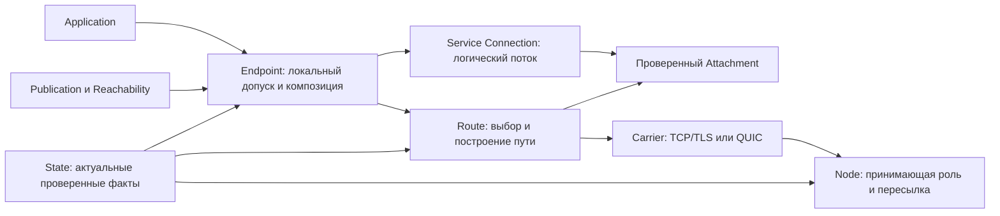

# Сетевое ядро Ardents: проект и переход от существующего кода

Дата сверки: 2026-09-22. **Предложение для обсуждения; новые контракты не приняты.**
Документ связывает целевое устройство ядра, текущий код и ограниченные изменения.
Он не запускает implementation, не меняет accepted ADR и не является вторым
реестром статусов. Исполнение и актуальный статус остаются в GitHub Issues.

Карта исполнения после сверки 22 сентября:
[#50 — ограниченные переходы и приёмка](https://github.com/dianabuilds/ardents-network/issues/50).
Прежняя программа #140 завершена; её результаты — вход этого проекта.

Маршрут чтения: **§3 — устройство и поведение ядра; §4 — файлы и callers;
§5–§6 — переход и границы задач; §7 — следующая итерация; §8 — проверки;
§9 — открытые вопросы.** Точные сообщения и состояния находятся в
[wire-приложении](network-core-wire-proposal.md). Для обсуждения решения
достаточны эти два документа и указанные в них current owners; временный
исследовательский архив нужен для проверки происхождения отдельных evidence.

## 1. Решение, которое предлагается

Собрать поддерживаемое сетевое ядро с явными владельцами. Пригодные механизмы
сохраняются по evidence; запутанную или непригодную реализацию отдельной
обязанности допустимо целиком заменить. Размер старого кода не обязывает
его сохранять. Каждая замена подключается к настоящему consumer и снимает
старый путь; второй постоянно поддерживаемый runtime не является целью.

Ядро отвечает за допуск к сети, актуальные сведения об узлах, защищённые
транспорты, маршруты, достижимость Service, логические соединения, конечные
бюджеты и завершение сетевой работы. Приложение получает разрешённый поток
байтов и terminal outcome; не выбирает узлы, ключи, Carrier или способ обхода
отказа. Содержимое текстового документа остаётся обязанностью Application.

Сохраняются Go, TCP/TLS и QUIC, разделение локальных полномочий, проверка
State/Instance/Target, durable floors и выбранная защищённая Route-конструкция.
Перерабатываются распределённое владение состоянием, связь сетевого lifetime
с конкретным workload, initial/continuation semantics и политика смены пути.
Удаляются принимающие legacy-входы и их exclusive Implementation, когда
названы сохраняемый потребитель, переход и точная граница отказа.

Это два связанных результата, которые нельзя смешивать:

1. **Поддерживаемая реализация выбранного closed-контракта:** понятные владельцы,
   отсутствие дублирующего legacy runtime, необходимые проверки поведения.
2. **Следующее поведение Connection:** согласованные открытие, неопределённый
   результат, продолжение и смена транспорта без повторного Application effect.
   Оно включается через принятый контракт и явную границу нового профиля;
   dev-переход по §5.1 не требует совместимости со старым wire.

Публичное автономное управление сетью и R-149 не являются предшественниками
обычного рефакторинга closed-кода. Они остаются необходимыми для соответствующих
публичных возможностей. Названия задач и итераций ниже — только навигация плана.

## 2. База и влияние завершённой стабилизации

Проверенный HEAD, локальный `origin/dev` и удалённый `refs/heads/dev`:
**`4d5c660e3aa80229846246d2991913d006cce089`**. Удалённый ref проверен
22 сентября 2026 через `git ls-remote`; checkout не переключался.
Предыдущая сверенная база этого плана —
`c95c70144f83d57bd9478b5fbb69033f3d847b55`.
Между ними 49 коммитов, включая merge/history commits: это не число задач.
Git diff: 295 файлов, +7 412/−19 925 строк, чистое сокращение 12 513 строк;
36 добавленных, 108 удалённых, 149 изменённых и 2 переименованных файла.

| Вид изменений | Файлов | Добавлено / удалено | Значение для плана |
|---|---:|---:|---|
| Go Implementation вне `*_test.go` | 118 | +1 012 / −8 274 | Выделены владельцы; сняты старые принимающие пути и exclusive engines |
| Go tests | 139 | +4 111 / −11 127 | Добавлены owner/refusal/architecture oracles; удалены тесты снятого поведения |
| Документы | 27 | +1 579 / −286 | Обновлены текущие owners, командные контракты и retirement ADR |
| Остальное, включая Makefile/testdata | 11 | +710 / −238 | Изменён состав проверок и fixtures; отдельной квалификацией это не является |

Числа характеризуют дельту, а не процент готовности продукта или качество
тестового покрытия. Удаление старых тестов само по себе не доказывает регрессию.

[#140](https://github.com/dianabuilds/ardents-network/issues/140) прочитан заново:
закрыт `completed`; итог от 22 сентября сообщает завершение всех 44 bounded
карточек программы и отдельной #197. Последняя #99 интегрирована PR #211.
Это execution evidence исполнителя; эта сверка не повторяет его Linux checks,
CI или review. Наличие результата дополнительно проверено по source и Git-дельте.

| Уже интегрированное основание | Evidence / реальные владельцы | Влияние |
|---|---|---|
| Node readers/receiving, workload bounds | #108/#107/#109, присутствовали в предыдущей базе | Сохраняем; новой extraction нет |
| Issuance, reservation, Source и его consumers | #101/#148/#102/#149/#150 | Сохраняем exact-operation identity и handles |
| Introduction, Responder, Publication pair | #103/#151/#152 | I1 больше не очередь работ |
| Refresh | #104, `4e69fff2`; `text_publication_refresh.go` | Scheduler уже владеет flight/wake/stop/join |
| Job и qualification run | #105/#153, `a138831b` / `6fa612df`; `text_job_lifecycle.go`, `stream_qualification_run_linux.go` | Ordinary Job не владеет report/observer/joins; сохраняет ссылку на exact qualification owner там, где он нужен |
| Context composition | #106, `838f9c6c`; `text_context_retirement.go` | Cancel-all-before-join уже реализован, чужие поля не возвращаем |
| Binary oracles, dependency/Route facts | #110/#111/#147/#133 | I2 больше не очередь; конкретные тесты сохраняются у consumers |
| Legacy dispositions, refusals и exclusive removal | #141–145 и их завершённые implementation slices; ADR-0088/0089/0090 | Перечисленные в I6 удаления уже выполнены; shared mechanisms и roots сохранены |

**Что не изменилось в этой дельте:** `internal/service/connection`,
`internal/network/state`, `internal/resource`, `go.mod` и `go.sum`.
Из семейства `internal/route/closed*` изменился только
`closed_node_carrier_test.go`. Следовательно, merge не реализует новые
PROPOSE/ContinueOpen/assignment, overlap, detector policy или новый EndpointSet.
Их кандидаты §3 и wire-приложения остаются предложениями, а N01–N18 —
ограниченными будущими результатами с указанными зависимостями.

При этом import closure изменяется и без изменения go.mod: удалены consumers.
Проекция cmd/ardents в dependencies.md привязана к `ebe30149`, а не к последнему
HEAD. Это полезное датированное evidence #147, не готовый receipt нового
candidate; следующая затрагивающая closure приёмка пересчитывает её для своего
build. Удаление старого Name adapter само по себе не разрешает удалить OHTTP.

**Изменение очереди:** I1/I2 и перечисленный retirement I6 снимаются с будущей
работы. I3 — адресные изменения сохранившихся resource/lifetime owners;
I4 — новая Connection и endpoint/profile composition; I5 — защищённые Names.
Номера разделов сохранены для ссылок, они не означают повтор первых итераций.
Следующий рекомендуемый bounded результат и предел его готовности — §7.

**Отдельно о переносе design-материалов:** на исходном `4d5c660e` оба документа
этого проекта ещё не были tracked; они публикуются отдельным docs change #212.
Это не принятие нового контракта. Записи `Open QUIC return-path finding` в
`dependencies.md` нет; четыре файла двух R-152 экспериментов по-прежнему
tracked. Предыдущая редакция неверно описывала эти подготовленные изменения
как текущее состояние ветки. Здесь это исправлено; завершение #140 не означает
интеграцию этих design-изменений. Их судьба — §9/§10, без восстановления чужих
изменений или удаления файлов в ходе этой оценки.

## 3. Архитектура: что именно строим

### 3.1. Путь данных и путь управления



Стрелки показывают передачу фактов/работы, а не разрешения Go imports.
`internal/service/connection` получает уже проверенный Attachment и узкую
возможность запросить следующий; он не импортирует Endpoint, Node или Route
ради выбора узлов. Endpoint связывает владельцев, но не управляет их полями.

Выбранная Route-основа из
[common-privacy-architecture.md](../technical/common-privacy-architecture.md):

```text
User Endpoint → User Entry → User Interior → Rendezvous
                                                  ↑
Publisher Endpoint → Service Entry → Service Interior
```

Introduction обслуживает установление связи; Service-only capsule скрывает
соответствующие setup-данные. Данные приложения дополнительно защищены
сквозным Service TLS с проверкой Target/Instance. Отказ не разрешает более
короткий путь, прямое подключение к Service, иной Target или слабый профиль.
Количество узлов сети не фиксируется этим рисунком: один путь ограничен,
каждый участник держит ограниченный набор контактов; полный mesh не требуется.
Масштабируемость публичного каталога этим не доказана.

### 3.2. Интерфейсы и состояния владельцев

| Владелец | Что получает и возвращает | Единолично изменяемое состояние | Что ему запрещено |
|---|---|---|---|
| `network/state` | Проверенные входы → immutable current view / явная недоступность | Current/pending/conflict, durable floors | Додумывать authority при недоступном producer |
| `entry` и Route selection | Текущие допустимые кандидаты → retained selection | Выбор/сроки своего набора и его lease | Пересэмплировать после отказа без выбранной политики |
| Route prefix/Attachment | Проверенные факты и admission → конкретный защищённый путь | Открытие, lanes, control/data queues, retirement | Выдавать бизнес-результат или повторять Application |
| Carrier | Точный peer/profile/deadline → защищённый поток / ошибка | Socket, handshake, reader/writer lifetime | Самостоятельно выбирать более слабый peer/profile |
| `node` | State-selected duty → принимающая роль | Listener, admitted handlers, duty shutdown | Создавать назначения State или управлять клиентским Connection |
| `service/connection` | Authenticated Attachment + trusted bounds + Application stream → logical stream outcome | Offsets, ACK/EOF, replay, continuation, terminal state | Разбирать textdocument, сбрасывать лимиты при новом пути |
| Endpoint Publication composition | Instance + registration + verified ACK → доступная публикация | Атомарное current/previous соответствие, acquisition/withdrawal | Владеть приватным ключом вместо Instance или переписывать durable floor |
| Endpoint Job | Разрешённый workload и verified attachment → owned invocation | Передача Grant, admission операции, отмена, joined cleanup | Выбирать Route или унаследовать права предыдущего Job |
| `resource` + потребляющие owners | Declared allowance/measurements → reservation / refusal | Собственный ledger и accounting | Закрывать чужой runtime напрямую или превращать неизвестный расход в свободный |

Названия private структур и методов выбираются исполнителем внутри этих
обязанностей. Новый generic `core`, `networkmanager`, `util` или пакет
`interfaces` не нужен. Сначала сокращаем Interface внутри существующего
пакета. Новый Go package допускается только при реальной независимой обязанности,
с caller, Implementation, behavior tests, `doc.go` и точным import-rule в
[package-map.md](package-map.md) в том же изменении.

Один mutex для атомарного admission нескольких owners может остаться. Удаление
совместного **владения** не требует механически дать каждой структуре mutex,
если это разрушит транзакцию stock→opening или publication commit.

### 3.3. Три протокольных уровня

Текущий код уже содержит binary framing:

- Route: `internal/route/closed_lane.go`, `EncodeClosedLaneFrame`, ARDP;
- Service Connection: `internal/service/connection/record.go`, `Read`/`Write`;
- локальный Application: `internal/application/interfacev2/connection/transport_frames.go`, AAI3.

Поэтому план **не** заменяет эти три уровня одним новым «бинарным протоколом».
Route отвечает за перенос/допуск lanes, Connection — за логическую сессию,
локальный интерфейс — за ограниченное общение Application с Endpoint.
Конкретные bytes, registry, transcript и phase gates следующего Connection
собраны в [wire-приложении](network-core-wire-proposal.md). Это часть одного
предложения; compatibility/adoption ещё требует решения N07, не выбирается
исполнителем codec молча. Maintained протокол от переноса документа не меняется.
Наличие текстового magic или `text_` в имени не доказывает текстовый wire и
не служит основанием удаления. Цель — убрать знание text workload из общего
сетевого владельца; текущий текстовый продукт и его confinement не отменяются
этим техническим планом.

### 3.4. Обязательные процессы

| Процесс | Последовательность ответственности | Успех / отказ |
|---|---|---|
| Запуск и обновление сети | Command → State/Source → accepted profile → role-local owners | Только проверенные факты; конфликт/истечение запрещают новые зависимые операции |
| Публикация | Local administration → Instance → Introduction registration → private Descriptor → verified ACK → current publication | До ACK нет advertised readiness; поздний ACK не восстанавливает отозванную публикацию |
| Подключение | Local Grant → Target/Name resolution → допустимый Route → capsule/Introduction + JOIN → Service authentication → Connection | Application I/O только после допусков; отказ не вызывает прямой fallback |
| Обмен | Один Connection owner → ограниченные DATA/ACK/EOF → Application | Порядок и directional close; ACK не является бизнес-квитанцией |
| Смена пути/транспорта | Local failure evidence → допустимый candidate → authentication/binding → согласованное присоединение → bounded overlap → retirement | Тот же Target и logical operation; неизвестный исход не становится fresh Open |
| Изменение сети | State/authority update → revalidate exact leases → запрет новых admissions / выбранное завершение старой работы | Новые сроки не продлевают старые права автоматически |
| Остановка | Сначала закрыть admission и отменить детей → Close I/O → Join → освободить reservations/roots | Timeout не называется завершённым cleanup; ошибка сохраняется |

Восстановление после сбоя — не обещание бессрочной живой сессии. Сохраняемая
операция зависит от retained state и выбранного срока; после их потери возвращается
честная неопределённость/недоступность. Решение о повторе бизнес-операции не
принимается сетевым слоем скрыто.

### 3.5. Какие свойства защиты ядро обязано сохранять

Источник требований — [closed successor claim contract](../security/threat-model.md#closed-successor-claim-contract),
а конструкция — [common privacy architecture](../technical/common-privacy-architecture.md).
Ниже их связь с переходом; это не новый claim registry и не заявление PASS.

| Защищаемое | Противник и необходимые условия | Проверка при изменении | Честное ограничение / задачи |
|---|---|---|---|
| Содержимое и точный Target/Instance | Злонамеренные forwarding/directory/Introduction/Rendezvous роли; сохраняются конечные ключи, независимая authority и Service verification | Изменённые proof/binding, подмена получателя, replay/truncation → отказ до consumer handoff; обычный consumer получает exact bytes | Получатель видит plaintext, захваченный Endpoint снимает его защиту. N07–N10, N14/N15 |
| Отсутствие прямой связи origin↔Target/opposite origin в полях протокола | Отдельные роли и предусмотренные коалиции; выполняются role/family exclusions, защищены control channels | P3: сравнить поля и retained state всех ролей по полной операции, включая новую попытку/продолжение | Время и объём могут коррелировать; разные keys не доказывают независимых операторов. M02/M05/M06, N11/N13 |
| Rendezvous, JOIN secret и Connection binding внутри Introduction | Introduction role и наблюдатели записи трафика; цела recipient encryption и exact Publication | Capsule alteration, подмена exact JOIN, очистка секретов; новый routeBinding не выходит в relay-visible поля | Захват живого recipient key раскрывает доступные ему capsules. N07/N08/N14 |
| Разделение контекстов и ограниченность связывания | Issuer/Source/relay/diagnostics; scoped permissions/keys/caches, channel-local identifiers | P3/P5: две операции, два контекста, повтор и recovery; проверять вместе control и data, включая журналы | Issuer связывает использование одного разрешения в его scope; provisioning знает свои выдачи. N03/N18, N11/N13/N16 |
| Отсутствие прямого сетевого обхода через Application | Враждебный worker/его дети; целы installation, Endpoint и ОС-границы | Реальный confinement и negative controls P1/P6/P7; новая передача stream не выдаёт socket/address/authority worker | Компрометация root/kernel/Endpoint вне этой гарантии; worker может лгать о содержимом. I2, N08/N09 |
| Конечность работы и цена переключения | Перегрузка, неисправные и злонамеренные peers; честные локальные owners и accounting | P8 плюс task tests: новые nonce/Attachment не сбрасывают запас; Stop/Join, exhaustion и полный TX/RX | Не гарантирует доставку при изоляции и справедливость при Sybil. N01–N06, N10–N13/N18 |
| Участие, активность и связь при наблюдении обоих краёв | Broad/active observer, малое множество пользователей | P9: declared priors, timing/volume, delay/drop/watermark; сравнить исходную и изменённую операцию | Это оценка принятого остаточного риска, не количественный anonymity claim. Автономный filler не выбран; успешная корреляция не маскируется как PASS |

Смена только Carrier для того же допустимого peer и смена Route с новыми
наблюдателями — разные действия. N13 не вправе бесконечно пересэмплировать
узлы ради доступности: выбор проходит существующие exclusions и отдельный
ограниченный допуск новых контактов. Handle/Kcont/C0 продолжают одну операцию
между её концами; не становятся идентификаторами relay, Node Record или Job.

Переменное число узлов означает отсутствие единственного фиксированного
продуктового размера сети и поддержку непрямого пути. Это не обещание
неограниченного локального состояния, достаточного числа независимых ролей
в любой маленькой сети либо O(1) стоимости публичного discovery. Закрытый
сценарий использует выбранную реальную State authority; масштабирование и
автономный producer публичной сети требуют своего контракта R-149.

### 3.6. Как предлагается продолжать соединение при смене Carrier

Это семантика **кандидата следующего контракта**, а не описание уже принятого
v3 или готового runtime. Подробные traces остаются evidence; следующие правила
сводят решение в одном проекте. Их реализация распределена между N07–N15.

**Два разных действия.** Выбор TCP/TLS либо QUIC перед новым соединением не
переносит прежнюю операцию. Для живого Connection создаётся новый защищённый
путь и доказывается право продолжить тот же контекст. Старый TCP socket не
становится QUIC session. QUIC path migration внутри QUIC также не заменяет
этот переход между Carriers. Альтернатива должна быть разрешена State и Route;
наличия QUIC adapter недостаточно. Прямого подключения к Service нет.

**Один владелец продолжения.** Исходный инициатор A координирует назначение
путей; принимающая сторона B сохраняет один результат допуска Application.
Смена направления физического dial не меняет эти роли. Возможность B попросить
смену не доказывает, что B может открыть путь к A: публичный listener клиента
и симметричная достижимость не предполагаются. Предлагаемый предел — два
одновременно принятых пути и одна активная подготовка кандидата. Это предел
одного Connection, не размера сети; pending/retiring работа дополнительно
учитывается до Join и не исчезает из бюджета по timeout.

| Событие / состояние | Предлагаемое поведение | Обязанность и проверяемая граница |
|---|---|---|
| Исходное открытие ещё не допущено | Один Prepared owner; CONFIRM разрешает единственный переход к передаче stream потребителю | N07/N08; handoff из §4.1, READY не ждёт первых DATA |
| Допуск мог дойти, READY потерян | ContinueOpen обращается к сохранённому результату; повторного Application admission нет | N09; неизвестный исход не превращается в новый Open |
| Live, transport error конкретного пути | Закрыть этот путь, сохранить общие offsets/replay/EOF; разрешённую попытку начать без дополнительного ожидания detector | N11/N13; сначала admission/срок/ресурсы, затем внешние эффекты |
| Live, кандидат проверен | Связать прежний контекст и continuity authority с новым каналом; назначение сериализовать с Stop/currentness | N07/N11/N15; TLS handshake сам не даёт DATA admission |
| A отправляет ASSIGN | До отправки A фиксирует ReceiveReady; B проверяет и применяет назначение, сериализует ASSIGNED перед своими DATA | N11; у A PeerReady возникает только после допустимого ASSIGNED |
| ASSIGNED потерян | Принятые общим owner bytes не откатываются; stale revision и чужой channel не могут назначить путь | N11; timeout не доказывает отсутствие эффекта у B |
| Новый путь готов | Можно предпочесть его для sending/replay; обе стороны публикуют актуальный общий ACK/credit в своей точке допуска | N10/N11; coalescing, без нового окна на путь и без ACK на ACK |
| Закончился конечный overlap | Оставить предпочтительный допустимый путь; прежний удалить через assignment/retirement owner и Join | N11/N13; не ждать бесконечно доказательства скорости; failure кандидата допускает сохранение ещё разрешённого старого пути |
| EOF одного направления | Сохранить единственный final offset, доставить предшествующие bytes и один EOF; обратное направление продолжает работать | N10/N12; EOF есть и у нулевого направления, socket EOF его не заменяет |
| Своя отправка получила final ACK, входящие bytes/EOF выданы, Application I/O joined, причины Stop нет | Settled удерживает ограниченный terminal receipt; не принимает новый DATA path и не запускает Application заново | N12; пустое направление тоже закрыто EOF(0). Final ACK не является бизнес-результатом или доказательством знания партнёра |
| Отмена, истечение или утрата обязательных прав | Stopping запрещает новые admissions, отменяет детей и закрывает I/O; Closed только после Join | N12/N15; поздний completion не восстанавливает работу, remote Stop не считается мгновенным |

Жизненный цикл Connection, каждого направления и каждого path хранится
раздельно. Live может временно не иметь рабочего пути, но только в пределах
сохранённых прав, срока и replay capacity. Потеря retained state не разрешает
создать прежнюю операцию заново. После возможного Application effect ядро
возвращает честный неопределённый исход; решение о бизнес-повторе ему не принадлежит.

Формальная предлагаемая grammar — [wire-приложение](network-core-wire-proposal.md).
Основания сверки: RESEARCH `connection-state-contract.md`,
`g06-g07-rule-revision.md`, `switching-policy-proposal.md` и
`path-retirement-observations.md`. Их ограниченные модели/прогоны имеют
собственный scope evidence; эта сводка не повышает его до qualification ядра.

### 3.7. Когда переключаемся и чем платим

У policy три разных измерения: время до обнаружения, время до допуска
альтернативы и время до следующего логического прогресса. Обещание «сразу»
означает отсутствие искусственной detector-задержки после явной ошибки,
при наличии разрешённой альтернативы и бюджета; handshake и Route setup
всё равно занимают время. Молчаливый отказ требует отдельного наблюдения.

| Наблюдение | Реакция кандидата policy | Чего из него нельзя заключить |
|---|---|---|
| Writer принятого пути явно отказал | Допустить одну подготовку по общему gate | QUIC обязательно исправит отказ либо можно сменить peer произвольно |
| Отправленные DATA/EOF не получили ожидаемого прогресса | После выбранного интервала разрешить ограниченную попытку | Причина точно в Carrier; встречные DATA, PING или duplicate ACK снимают это ожидание |
| Нового кредита нет, но ранее отправленные bytes ждут ACK | Продолжать наблюдать именно это обязательство | Исчерпанный credit означает отсутствие pending work |
| Все отправленные bytes подтверждены, Application не читает и credit не растёт | Сохранять backpressure; не открывать пути ради увеличения окна | Медленный consumer доказывает неисправность сети |
| A ждёт входящие данные, но ничего не видит | Нужна выбранная конечная сквозная liveness-проверка либо честное отсутствие гарантии быстрого обнаружения | Отсутствие событий различает здоровый idle и потерянные B→A данные |
| ACK пришёл по новому пути | Учесть допустимый общий progress/credit | Подтверждённые bytes доставил именно этот путь; он быстрее прежнего |

Предложение для дальнейшей квалификации — конечный overlap с общими replay,
credit и абсолютными сроками. Постоянное дублирование всего потока, filler
ради измерения качества и гонка PING в idle не входят в него. Конкретный
кандидат интервалов — §3.10; его принятие и проверка остаются GAP-T/R в рамках
существующих пределов §8.1, блокируя зависимую автоматическую policy, а не I1.

| Вариант сравнения | Корректность / доступность | Цена и приватность |
|---|---|---|
| Оставаться на исходном пути | Нет механизма продолжения после его окончательной потери | Не добавляет контакты и handover-трафик; существующий трафик Route остаётся |
| Закрыть старый путь, затем открыть новый | Сохраняемый logical owner может продолжить поток, но есть обязательная пауза без пути | Меньше одновременных path resources; новый контакт и replay всё равно требуют бюджета |
| Ограниченно перекрыть два пути — предлагаемый вариант | Старый допустимый путь работает во время подготовки; новая готовность не гарантирует улучшение | Дополнительные handshake/control/replay, retained resources и возможные наблюдатели; длительность и попытки конечны |

Это сравнение механизмов, не измеренные коэффициенты и не количественный
anonymity claim. Полная цена включает TX/RX всех участвующих legs, служебный
трафик, retransmissions и idle-наблюдение. Failed attempts также учитываются.
Новые socket/nonce/ACK не возвращают потраченные attempts, exposure или срок.
Новый контакт оценивается отдельно от смены Carrier к тому же peer; exclusions
и запрет ослабления Route сохраняются. Численная приёмка — отдельные ограниченные
сценарии §8.1, не основание перенести всё измерение сети в одну задачу N13.

### 3.8. Почему такая композиция: готовые механизмы и собственная работа

Это сводка уже проведённого сравнения, не запуск нового поиска библиотек.
Для closed-продукта Route-конструкция уже выбрана ADR-0078/0081 через
[R-152](../research/records/r-152-common-privacy-design.md). Предлагаемая новая
Connection уточняет продолжение операции поверх неё. Мы не выводим из этого,
что других пригодных конструкций не существует или что native сеть доказанно
анонимнее Tor/Nym/Katzenpost. Сопоставимой квалификации целых сетей нет.

| Вариант | Защита и корректность | Задержка, трафик и ресурсы | Обязанность сопровождения / вывод |
|---|---|---|---|
| Только защищённое прямое соединение | Шифрование содержимого не скрывает связь адресов концов; не выполняет выбранное разделение наблюдений | Нет промежуточных hops; это иной уровень защиты, не допустимый baseline сравнения производительности | Меньше композиции, но не выполняет продуктовый контракт |
| Обязательная готовая анонимная сеть | Может предоставить собственную маршрутизацию и скрытую достижимость; её claims зависят от её условий. Нужен отдельный trace полномочий, Application и continuation Ardents | Нельзя переносить чужие bandwidth/latency результаты без той же нагрузки, условий и полного control/data accounting | Появляются внешняя инфраструктура, интеграция и обновления. Не выбрана для текущего closed-контракта; это не техническое опровержение всех кандидатов |
| Выбранная split Route + готовые криптографические/transport компоненты + общий Connection owner | Явные роли, проверяемая authority и Service-only данные; новый owner удерживает одну операцию. Корреляция времени/объёма остаётся ограничением | Дополнительные legs, handshake/admission/lookup и bounded replay. Низкая цена отдельного компонента не доказывает цену всей сети | Мы поддерживаем композицию, grammar и состояния, но не пишем криптопримитивы или QUIC-стек. Это направление текущего плана |

**Различаем три операции.** Выбор Carrier при новом dial не переносит прежнюю
операцию. QUIC migration по [RFC 9000 §9](https://www.rfc-editor.org/rfc/rfc9000.html#section-9)
меняет сетевой путь QUIC connection; вывод для Ardents — это не механизм
переноса TCP-потока в QUIC. Наш Connection продолжает логический поток через
новый проверенный Attachment (§3.6), независимо от Carrier и transport socket.
Его offsets, operation identity и replay budget не принадлежат socket.

**Ускорение не отменяет admission.** TLS 1.3 не даёт встроенной replay-защиты
early data: [RFC 8446 §8](https://www.rfc-editor.org/rfc/rfc8446.html#section-8).
Поэтому кандидат wire использует завершённый handshake и обычный exporter,
не 0-RTT как разрешение повторить Application operation. Это выбранное правило
кандидата, а не утверждение, что TLS вообще запрещает безопасные применения 0-RTT.

**Codec выбирается отдельно от сети.** Для небольшого registry сравнивались:

| Представление | Что даёт готовое решение | Цена и оставшаяся обязанность |
|---|---|---|
| Protobuf | Schema, генерируемые типы и готовый runtime | Framing/лимиты, state validation и подписываемый transcript всё равно наши. Deterministic serialization не означает canonical representation; подпись нельзя привязать к произвольному remarshal |
| Строгий CBOR fixed-array — кандидат wire-приложения | Готовая библиотека и стандартные deterministic rules | Задать exact arity/types/bounds, отклонять лишние/неоднозначные данные до эффектов; квалифицировать exact dependency use. Кодек сам этого контракта не выбирает |
| Собственная фиксированная binary grammar | Небольшой header может иметь простой stdlib encoder | Каждый parser, отрицательный vector и изменение schema поддерживаем сами. Нет основания писать универсальный serializer или объявлять этот вариант быстрее без измерений |

Основания: [Protobuf serialization](https://protobuf.dev/programming-guides/serialization-not-canonical/)
и [RFC 8949 §4.2.1](https://www.rfc-editor.org/rfc/rfc8949.html#section-4.2.1),
первичные страницы повторно прочитаны 2026-09-21. Выбор fixed arrays, запрет
лишних полей и semantic validation — решения кандидата Ardents, не обещания RFC.

Сохранённая исследовательская проба `codec-probe` (§10) на fxamacker/cbor
v2.9.4 проверила только DATA/ACK/EOF: четыре parent tests и 30 subtests.
При сверке source/test/raw-result hashes совпали с `wire-codec-proposal.md`,
в JSONL — 34 test PASS и 0 FAIL; новый запуск не выполнялся. Ослабленный typed
decoder принимал два непригодных входа, полный проверяемый профиль их отклонял.
Это основание продолжить проверку кандидата N07, не admission зависимости,
оценка пиковой памяти или проверка всего registry. До зависимой реализации
нужны полные vectors и проверка exact dependency use по `dependencies.md`.

Компонентная layered-TLS проба R-152 также не переносится на цену ядра:
она не включала реальную сеть, admission, lookup, padding, retries и background,
не измеряла задержку или анонимность. Численные требования и реальные сценарии
остаются в §8. Сравнение трёх способов handover — §3.7; предпочтение bounded
overlap опровергается, если полная операция не выдерживает свои resource,
traffic, privacy или correctness gates. Тогда пересматривается этот механизм,
а не ослабляются требуемые свойства и не переписываются тестовые пределы.

### 3.9. Общая граница работы при handover: предложение для N11/N13

**Сверенные факты кода.** `service/connection/stream_contract.go` задаёт
`proposalLimit=3`, `recoveryLimit=15s`, `logicalQueueLimit=256 KiB`.
`stream_recovery.go:recoverAttachment` увеличивает `proposals` перед opener,
а `commitAttachment` сбрасывает `proposals` и `episodeEnd` после continuity
и установки Attachment. `stream_send.go:sendApplication` и
`stream_bounded.go` обновляют `lastProgress` от чтения локальной Application;
`stream_receive.go:acceptData` — после выдачи bytes локальному consumer.
Эти факты не доказывают прохождение или нарушение всего NET-14T, но такой
счётчик нельзя выдавать за предлагаемый несбрасываемый бюджет handover.
Connection-файлы одинаковы в `4f12deed` и проверенном `origin/dev`; в Endpoint
opener изменился Source handle, сроки подготовки остались прежними.

**Предлагаемые правила; не изменение accepted policy:**

| Граница | Точное правило кандидата | Что не считается освобождением/успехом |
|---|---|---|
| Accepted paths | Не более двух у одного Connection | Новый stream или nonce не дают отдельного окна/replay owner |
| Все Attachment slots | Не более трёх суммарно: accepted + pending + retiring. Pending не более двух для пересёкшихся инициатив A/B; policy каждого конца начинает не более одной исходящей подготовки | Retired, но не joined путь занимает слот. При двух accepted новую подготовку не начинать до retirement/Join одного из них |
| Состязание A/B | Два pending допустимы только в общем запасе; A назначает одного, другой отменяется и joins. B's JOIN-leg для A-инициированной попытки — часть той же попытки, не самостоятельный requester | Отмена проигравшего не возвращает потраченный attempt/exposure; она возвращает ресурсный слот только после Join |
| Episode attempts | Кандидат сохраняет число 3, но как максимум допущенных подготовок одного незавершённого эпизода. Charge перед первым внешним эффектом; новый канал — новая подготовка, exact duplicate на том же канале — прежняя | PeerReady/ASSIGNED, REFUSE, ошибка и успех handshake не сбрасывают счётчик. Это гипотеза policy, не вывод числа из NET-14R |
| Запас всей Connection | Отдельный конечный `attemptAllowance` и finite rate allowance поступают от доверенного admission; расход не возвращается после успешного эпизода. Продление C0/allowance новым каналом запрещено | Эпизодный лимит сам не ограничивает серию частично успешных эпизодов. Без выбранного численного allowance автоматическую policy не включать |
| Учёт до определения Connection | TLS/Route preparation, ещё не связанная с проверенным C0, резервируется у process/Route owners. После binding расход относится к Connection без исчезновения из общего учёта | Неаутентифицированные кандидаты не получают «бесплатную» память, sockets или handshake CPU вне таблицы |

Три слота не означают три одновременно передающих пути. Проверяемая трасса:
`1 accepted + 2 pending` → `2 accepted + 1 retiring` → `2 accepted` →
`1 accepted + 1 retiring` → `1 accepted`. Каждое состояние укладывается в
три слота; установка winner и перевод loser выполняются под одним admission
owner. Если loser ещё занят I/O, третий слот остаётся занят. Подготовка при
нехватке process/Route reserve отвергается независимо от свободного счётчика
Attachment. Поэтому число slots не подменяет реальные bytes/CPU/queue limits.

**Время не перезапускается при смене канала.** Для направления различаются
начало pending obligation, последний подтверждённый прогресс и начало
подозрения. Первое DATA/EOF, допущенное writer после отсутствия обязательства,
создаёт его часы; локальное App Read, новые queued bytes, duplicate ACK и
встречное направление их не обновляют. Для incoming-only ожидания нужны
отдельные выбранные liveness часы, а не фиктивный исходящий ACK timeout.
При допуске recovery сохраняется исходный anchor затронутого обязательства;
дальнейшие candidates не заменяют его временем обнаружения/handshake.
Явный отказ без такого обязательства использует момент наблюдения отказа.

Episode deadline — не позже `anchor + 15s` и действующих Work/authority bounds;
допуск и разрешающий commit требуют сохранения соответствующих прав.
Наступление `noNewRecoveryAfter` не разрешает новую попытку и само по себе
не отменяет ранее допущенные DATA на ещё допустимом пути. Endpoint preparation
сохраняет максимум 10s из `prepareTextRecovery`, дополнительно обрезанный общим
остатком; каждая попытка не получает новые 10/15s. Monotonic deadline фиксируется
локально; последующая переоценка времени/authority может его только сократить.

Для закрытия успешного эпизода недостаточно установления Attachment: нужны
готовый допустимый путь и новый подтверждённый прогресс по затронутому
направлению либо завершение его EOF-обязательства. Если эпизод охватывал оба
направления, прогресс одного не закрывает ожидание другого. Общий Stop/Settled
заканчивает recovery своей семантикой, не выдаёт новый бюджет. Следующий
действительный отказ может открыть другой эпизод, расходуя прежний lifetime
allowance; три последовательных отказа NET-14R не являются lifetime-квотой.

Остаток GAP-T/R теперь конкретен: численные lifetime/rate allowances и
termination reserve внутри §8.1, принятие/проверка detector/liveness/overlap
кандидата §3.10. Из общего 15s ceiling нельзя вывести эти числа и обещать p95.
До их выбора соответствующая policy остаётся design-blocked; N11 проверяет
slots/assignment на объявленном конечном тестовом профиле без claim её цены.
Qualification clock NET-14Q/T по фактической доставке остаётся внешним oracle:
локальные observation clocks не заменяют его и не доказывают своевременность.

### 3.10. Численный кандидат detector/overlap для ограниченной проверки N13

Это **предлагаемые параметры одного проверяемого профиля**, не принятые
значения runtime и не результаты latency/cost измерения. Они позволяют
подготовить конкретные detector/retirement карточки вместо поручения
«подобрать хорошие таймеры». Действующие NET-14/32/33 bounds не меняются.
Lifetime/rate allowances и реальные resource reservations из §3.9 всё ещё
должны быть выбраны до включения автоматической policy.

| Событие / параметр | Предложение для первого сравнения | Область действия |
|---|---|---|
| Явная ошибка принятого пути | Без дополнительной detector-задержки; общий admission/backoff остаётся | Не объявлять QUIC исправлением причины; active violation ведёт в fail-closed |
| Нет нового подтверждения допущенных DATA или EOF | 2s без соответствующего прогресса → подозрение и bounded admission | Локальная очередь до writer, отсутствие нового credit без pending ACK и медленная Application сами таймер не запускают |
| Сквозная проверка живости | A — единственный initiator PROBE; после 1s без свежего подтверждённого round trip на предпочтительном принятом пути допускает один PROBE. Ответ ждёт не более 1s от допуска control write | Только Live Connection. Для incoming-only работы это способ обнаружить silent loss; B отвечает, не запускает встречную периодическую серию |
| Частота PROBE | Не более одного outstanding на Connection; между допусками новых PROBE не менее 1s, общий gate и сроки обязательны | Номер пути/nonce не сбрасывает cadence. Не probing race по обоим paths; поздний ответ прежнему nonce/channel не закрывает новое ожидание |
| Максимум overlap | 2s от локальной готовности нового назначенного пути до прекращения DATA admission на прежнем; authority/Stop могут сократить | Не ждать бесконечно доказательства скорости. Assignment/retirement закрывают old handle; Join может закончиться позже и всё это время держит slot/reserve |
| Backoff после неудачной подготовки | 100ms, затем 200ms, затем максимум 400ms; общий deadline не продлевается | Один failure disposition для обычного отказа, timeout и late completion. Конец ожидания не отменяет admission/rate gate; в одном эпизоде максимум три подготовки |

Liveness имеет собственные часы. Свежий валидный PROBE_REPLY на exact
channel/nonce доказывает нужное control прохождение туда и обратно. Общий ACK
даже новых bytes не доказывает их доставку именно предпочтительным path (§3.7);
этот первый профиль не использует его для сброса liveness часов. Просто
входящие DATA, duplicate ACK и успешный socket Write тоже их не сбрасывают.
Проверенный OPEN_READY/ASSIGNED на том же канале завершает control round trip, но не
снимает отдельное ожидание DATA/EOF и не закрывает recovery episode (§3.9).
Часы исходящего ACK не сбрасываются ни PROBE_REPLY, ни встречными DATA.
Если control writer не продвигается, это наблюдаемая остановка control path,
а не повод бесконечно откладывать начало его timeout до успешного Write.

После смены предпочтительного path старый outstanding PROBE прекращает быть
свидетельством нового пути. Его поздний ответ игнорируется как stale; новая
проверка подчиняется прежней cadence и budgets. Начало liveness-сомнения
сохраняет anchor интервала тишины, включая ожидание до отправки PROBE:
15s deadline не начинается заново после этих двух секунд. Новых frame kinds
для этого не нужно. Settled/Stopping/Closed не запускают liveness probes.
Выбор A задаёт один автоматический scheduler этого профиля; grammar по-прежнему
описывает аутентифицированные PROBE обеих ролей. Приём и ответ на чужие
control frames ограничены общим control reserve и не создают второй scheduler.
Все интервалы измеряются локальным monotonic clock. Финальная проверка события
при `now >= deadline` считает его просроченным независимо от очередности timer
и I/O callbacks; поздний ответ не отменяет уже выданную/завершённую попытку.

**Почему именно такой первый кандидат.** Окно 1s+1s оставляет номинально больше
времени на подготовку пути в пределах текущего 5s recovery target, чем 2s+2s.
Это причинный аргумент для сравнения, а не сложение p95 разных измерений:
совместный p95 обязательно измеряется на полной операции. Обратная цена —
более частые control frames и возможные ложные подозрения при очередях/потерях.
Overlap 2s — проверяемый компромисс против немедленного retirement после
PeerReady и долгого удержания двух путей; никакое преимущество ещё не измерено.

Одна PROBE или PROBE_REPLY этого registry — 37 bytes CBOR body + 4 bytes
framing. Пример: 600 полных пар дают 49,200 bytes сквозных plaintext frames;
это **не** верхний предел сетевого трафика. TLS, Route layers, retransmissions,
подготовки, abandoned paths и прочий control считаются отдельно в полном W.
Для общего endpoint TX+RX один и тот же перенос наблюдается на обоих концах;
арифметика plaintext не заменяет ни этот учёт, ни NET-14V.

[Current idle declaration](privacy-qualification.md#candidate-and-workload-declaration)
исключает Application job и publication из User-idle NET-32. В таком состоянии
Connection не существует и эта policy не создаёт ни одного PROBE. Live Connection
с временно молчащей Application — другой сценарий, его трафик измеряется
отдельно. Publisher readiness keepalive остаётся у своего owner с нынешним
30s пределом; таймер Connection не заменяет его и не держит лишние User prefixes.
Периодический control создаёт наблюдаемый временной рисунок: его объединение
с DATA и обеими Route legs входит в P9. Назначение PROBE — обнаружение отказа,
не анонимизирующий cover; ни малый размер, ни шифрование этого frame не
доказывают отсутствие дополнительной корреляции.

**Опровержение кандидата:** ложное переключение на здоровом backpressure case;
пропуск pending DATA/EOF из-за control replies; сброс времени после nonce/ASSIGNED;
нарушение конечности slots/attempts; либо непрохождение полного latency,
goodput, traffic, resource или privacy gate §8 на фиксированном build.
Сначала сравниваются этот профиль, без переключения и исключительная замена
при одинаковой защите. При FAIL меняется конкретная policy и сохраняется
первый результат; альтернативные таймеры — следующий именованный прогон,
не незаметный retry до зелёного результата. Нового прогона здесь не было.

## 4. Карта текущего кода → целевая обязанность

Текущие файлы и символы ниже сверены с `4d5c660e` (§2); снятые пути явно названы историческими. Звёздочки означают семейство уже
названных файлов, не разрешение переписать каталог. Матрица определяет fate
обязанности; конкретные удаления принимаются через карточки §6/§8.
Для M07/M08 интегрированы prefix/pair/refresh owners, для M10/M13 —
Job/qualification/Context retirement. Их extraction завершена; ниже указаны
только сохраняемые обязанности и действительно оставшиеся изменения.

| ID / обязанность | Реальные файлы и цепочка caller | Целевой owner и сохраняемое | Заменяемое / удаляемое |
|---|---|---|---|
| M01. State bootstrap/currentness | `cmd/ardents-node/node_mode.go:runNodeRuntime` → `internal/network/state/open.go:Open`; `refresh.go:Refresh/fetchSource` → `internal/network/source/transport.go`; Endpoint: `text_participant_linux.go:useTextParticipant` → `state.Open` | `network/state` принимает current/pending/conflict; Source только получает evidence. Сохраняем pins, durable acceptance, conflict floors, конечный refresh | Старый Source selector уже отвергается по #144/#118. Новый public producer не подменяется callback. Полная перепись State не планируется |
| M02. Entry и выбор узлов | `internal/endpoint/text_source_state.go:closedTextRoleMembers/textEntrySets`, `text_source_set.go`, `text_source_separation.go` → `internal/entry/closed_sets.go`, `closed_set_store.go`; `internal/route/closed_bootstrap_plan.go` | Entry хранит retained set; Route проверяет выбранные роли, profile и исключения. Сохраняем floors и разделение известных Node/key/family | Старый Initiator receiving/Entry adapter уже удалён; новые endpoint-set/profile правила — отдельный contract change |
| M03. Issuance и spend | `internal/endpoint/text_issuance.go` → `text_issuance_operation.go`; `text_prefix_opening_operation.go`; `text_token_transfer.go:takeTextTokenLocked`; `internal/route/credential/closed_token_operation.go`, `closed_token_issuer_ledger.go`; receiving `internal/route/closed_spend_ledger.go` | Credential владеет issuance, Endpoint — exact pending operation/journal и передачей; receiver — durable spend. Сохраняем единственный debit и exact retry identity | Уже снятые shared fields не возвращаем. Retry после потерянного RESULT меняется только по #93; старый Node Transit Grant issuer уже снят по #144/#155/#120; retained Endpoint acquisition не считать новым receiving path |
| M04. Защищённые Carriers | `internal/route/closed_node_carrier.go:OpenClosedNodeCarrier`, `closed_role_carrier_client_linux.go:OpenClosedRoleCarrier`, `closed_shared_carrier.go:ListenClosedSharedCarrier`; callers: `closed_source_prefix.go:openClosedPrefix`, Node listener/forwarding | Пока остаются в `route`: точный TLS/profile/peer, TCP/TLS и QUIC, конечный handshake и socket lifetime | Не копируем TLS/QUIC в новый пакет. Новую switch policy выносим из socket adapter в owner попытки Route. QUIC finding блокирует затронутую приёмку, не исправляется переименованием |
| M05. Клиентский control/forwarding prefix | `internal/endpoint/text_source_prefix.go:openTextPrefix`, `text_source_lifecycle.go`, `text_resolution.go:lookupTextDescriptor`, `text_join_service.go:openTextJoinedTransportAfterSetup`; Route: `closed_source_prefix.go:OpenClosedSourcePrefix`, `closed_source_channels.go`, `closed_source_queue.go` | Endpoint держит разрешённый lifecycle/handle; Route владеет каналом и lanes. Уже внедрённые JOIN/Resolution acquisitions сохраняются | Extracted Source и acquisitions уже используются; новые consumers не получают чужие pointers/cleanup. Не создаём второй «универсальный Source» и не объединяем control prefix с App session |
| M06. Receiving Node и forwarding | `cmd/ardents-node/node_mode.go:runNodeRuntime` → `internal/node/lifecycle.go:Run/runDuty` → `duty_server.go:startDuty` → `closed_forwarding_listener.go`, `closed_resolution_listener.go`, `closed_introduction_listener.go`, `closed_join_listener.go`; `closed_forwarding_receiving.go`, `closed_forwarding_carrier.go` | Node — duty/process composition, Route — grammar/admission/queues. Сохраняем уже extracted receiving rollback и session readers, точный lease incarnation | Старые role engines и dispatch уже сняты по #114–117/#120. Не переносим весь Node в Route |
| M07. Publication, registration и refresh | `internal/endpoint/text_publisher_start_linux.go:startTextPublisher/startPublication` → `text_introduction_registration.go:openTextRegistration` → `text_descriptor_publication.go:publishTextDescriptor/acquireTextPublication/finishTextPublicationCommit`; `text_publication_refresh.go`; `text_publisher_withdraw_linux.go` | Private publication owner в Endpoint: current/previous pair и transitions; отдельные prefix и refresh owners. `service/publication` сохраняет durable generation/lease, `service/instance` — signer/recipient | Prefix/pair/refresh owners уже выделены. N02 меняет только принятый parent transition; extraction не повторяется |
| M08. Introduction, JOIN и setup | `internal/endpoint/text_introduction_prepare.go`, `text_introduction_exchange.go`, `text_introduction_receive.go`, `text_responder_prefix.go:prepareTextResponder`, `text_join_service.go:openTextJoinedService`; Route `closed_introduction_plaintext_linux.go`, `closed_join_client.go`, `closed_join_pairing.go` | Setup owner удерживает exact operation/capsule, Route — JOIN; Application не получает raw JOIN. Сохраняем проверку Instance/Target/authority перед передачей байтов | Связь нового routeBinding с настоящим capsule/JOIN меняется отдельным paired wire slice. Старый digest не объявляется новым commitment |
| M09. Service authentication и logical stream | `internal/endpoint/text_service_binding.go`, `text_service_tls.go:secureTextClient/secureTextPublisher`, `text_service_stream.go:openTextServiceStreamWithRecovery` → `internal/service/connection/stream_lifecycle.go`, `stream_bounded.go:RunBounded`, `stream_recovery.go`; повтор пути: `text_service_route_recovery.go` | `service/connection` — один owner offsets/ACK/EOF/replay/terminal; Endpoint даёт проверенный Attachment и trusted bounds. Exact Service authentication сохраняем | Новые initial opening/continuation/overlap заменяют соответствующие машины состояний и records вместе с caller. Не переносим экспериментальный helper в production как готовый owner |
| M10. Local Application и Job | `cmd/ardents/endpoint_text_linux.go:runTextHeadlessRuntime` → `internal/endpoint/text_participant_linux.go:runTextInterfaces`; AAI3 → `text_connection_linux.go:(textConnection).Open`; `text_worker_launch_linux.go`, `text_worker_grant_linux.go`, `text_worker_attachment_linux.go`; `text_job_lifecycle.go`, `stream_qualification_run_linux.go`, `text_service_workload_linux.go` | Endpoint Job — verified Grant/worker handoff; network stream — opaque bytes. Сохраняем Broker, confinement, actual caller и уже вынесенные trusted bounds | Qualification mutable state уже у отдельного run owner (#153); text codec остаётся в `application/textdocument`. Generic `endpoint open`/AAI2 удалены; новый arbitrary worker не разрешён |
| M11. Names и private reachability | `cmd/ardents/name.go:runName` сохраняет encode и отказывает resolve/control; `internal/naming/namespace/*`; `internal/endpoint/text_resolution.go` → `internal/route/closed_descriptor_client_operation_linux.go` → receiving `internal/node/closed_resolution_operation.go` → `internal/service/reachability/private_store.go` | Naming сохраняет Service Name/proof/floors; Reachability — текущий private Descriptor конкретного Target. Это разные доказательства, их нельзя слить | Старые operator/Alpha accepting paths уже сняты. `naming/resolution` сохранён без production composition по ADR-0090; новый confidential Name exchange требует выбранного authority/wire и обычного caller |
| M12. Ресурсы и малая фоновая активность | `internal/resource/hosting_ledger.go:Reserve/Release/Observe`; `internal/node/closed_hosting.go`, `closed_forwarding_host.go`; `internal/route/closed_forwarding_budget.go`, `closed_control_capacity.go`; State `scheduler.go`, Endpoint `text_publication_refresh.go`, Carrier `closed_node_carrier.go` | Accounting в точном owner, резерв до эффекта; background work только по выбранным triggers. Сохраняем finite bounds и исходные сроки | Нельзя снимать caps ради прогресса. Формула hosting, credit и новые switch budgets меняются отдельными решениями; local timer wake не считается сетевым TX |
| M13. Shutdown и ошибки | `internal/endpoint/text_context.go:Close` → `text_context_retirement.go:stopTextContextChildrenLocked/join`, `text_context_shutdown.go`; `internal/node/closed_forwarding_shutdown.go`, `terminal_cleanup.go`; `internal/service/connection/stream_lifecycle.go` | Родитель отменяет всех, затем joins; каждый child освобождает только своё и сохраняет error. Context не чистит чужие maps/pointers | #106 уже подключил операции child owners. N06/#90 меняет только выбранную область действия cleanup failure, не повторяет shutdown extraction |

### 4.1. Точная граница Connection → Application для N07–N09

Source trace и затронутая дельта повторно сверены на `4d5c660e` 2026-09-22.
Job/qualification теперь отдельные owners; Alpha Target Link получает refusal
до сетевого setup. Порядок Service authentication → handoff → requestReady
сохранился. Ниже — предложение новой composition, не принятая Application API.

| Граница | Реальный producer → consumer | Сохраняемое / целевое изменение |
|---|---|---|
| Проверенный Service и Job | `internal/endpoint/text_service_binding.go:newTextServiceBinding/bindTextServiceLocked` → `textServiceBinding.current` → `text_service_stream.go:openTextServiceStreamWithRecovery` | Сохранить проверку independently decoded Publication, exact Instance/Target/Profile, текущего Job и сроков; новый C0 не заменяет локальную authority |
| Capsule → exact JOIN | `internal/route/closed_introduction_crypto_linux.go:SealClosedIntroduction/OpenClosedIntroduction` → Endpoint attempt → `internal/endpoint/text_join_service.go:openTextJoinedServiceAfterSetup` | Новый protocol-specific commitment вычислять у capsule owner до очистки exact plaintext. Передавать вместе с facts, protocol identity и владением exact JOIN; существующий v3 digest не переименовывать в новый routeBinding |
| Service authentication | `internal/endpoint/text_service_stream.go` → `internal/service/connection/initial_authentication.go:NewAuthenticatedStream` → `initial_receipt.go` / `stream_lifecycle.go` | Сохранить exact Instance signer/currentness, роль и channel binding; заменить initial proof/receipt на принятый OFFER/CONFIRM schedule одной операцией, без `established=true` от caller |
| Reader: допуск запроса | `internal/endpoint/text_connection_linux.go:newTextReadResult` → `text_service_reader_linux.go:completeServiceRead` → `internal/application/textdocument/reader_connection.go:ReadWorkerConnection` | Worker создаётся раньше Introduction. Его локальный OPEN(1) и единственный запрос следуют за Service auth и проверкой запроса local caller; ContinueOpen не вызывает эту цепочку повторно |
| Publisher: передача Service stream | `internal/endpoint/text_publisher_network_linux.go:produceNetworkSequential` → `delivered` → `text_service_publisher_linux.go:serveOperation` → `internal/application/textdocument/publisher_connections.go:ServeWorkerConnections` → `publisher_connection_io.go:startStream` | Один stream передаётся одному consumer; worker и snapshot общие для публикации. Новый Start означает admission этого stream, а не создание процесса на каждое соединение |
| Publisher: начало обработки документа | `publisher_connection_events.go:fromService` устанавливает `requestReady`; `publisher_connections.go:advance` выделяет ID и отправляет worker OPEN/BYTES | Это происходит после получения запроса и не может быть prerequisite сетевого OPEN_READY. Сохранить bounded queues, изоляцию malformed request и отсутствие повторного ID |

**Найденная зависимость, которую нельзя переносить в новый контракт.** Сейчас
Publisher сначала завершает `openTextJoinedService`, затем передаёт stream в
`delivered`. Consumer открывает worker stream лишь при `requestReady`. Если
новый конструктор ждёт этого worker OPEN до сетевого OPEN_READY, получается
цикл: READY → DATA запроса → requestReady → worker OPEN → READY. Это вывод
из source trace о предлагаемой композиции, не зарегистрированный runtime bug.

**Предлагаемая композиция N08:**

1. Endpoint готовит bounded provisional Connection и локальный приёмный ресурс.
   Prepared не передаёт stream приложению и не начинает запрос. Worker может
   быть заранее подготовлен в существующем Job reserve.
2. Проверенный CONFIRM или ContinueOpen разрешает один Prepared→Starting.
   Endpoint повторно проверяет Job/Publication/Stop и один раз передаёт
   retained stream выбранному consumer. Старый синхронный порядок
   «полный handshake → возврат → delivered» заменяется именно в Publisher
   orchestration; внешняя `Connection.Open` остаётся ожидающей сетевой готовности.
3. Результат handoff означает: exact stream зарегистрирован у consumer,
   его bounded приём обеспечен, ответственность за cleanup передана.
   Подтверждение создаётся после регистрации, **не после чтения запроса,
   worker OPEN, ответа документа или EOF**. Нужен явный внутренний результат
   handoff: сегодняшний bare channel send сам по себе не удостоверяет все
   перечисленные условия. Это изменение существующих Endpoint/textdocument
   границ, без нового общего пакета и без передачи ему сетевых полномочий.
4. После результата handoff и повторной проверки Stop/currentness Connection
   фиксирует Live и отправляет OPEN_READY. Читать из зарегистрированного
   локального stream разрешено; ожидание первых DATA не задерживает handoff.
5. ContinueOpen присоединяется к тому же Starting/Live owner и тому же handoff
   result. Он меняет Attachment, не повторяет `delivered`, worker OPEN либо
   Reader request. Утрата owner оставляет явную неопределённость; fresh opening
   той же операции не допускается.

Потеря ответа handoff после передачи ответственности также не разрешает
повторную передачу stream. Результат хранит тот же retained owner, Stop
сериализован с передачей, при ошибке все принятые children присоединяются.
До принятия такого internal контракта N08 не является исполнимой карточкой.
N07 должен зафиксировать эту границу вместе с grammar/version/binding;
не требуется отдельный обзор технологий или изменение локального worker wire.

**Проверки при реализации, пока не выполнены:**

| Сценарий | Наблюдаемый oracle | Задача |
|---|---|---|
| Reader удерживает все request DATA до OPEN_READY | После bounded consumer registration READY достижим; до DATA worker OPEN у Publisher отсутствует. Нет ожидания `requestReady` на пути READY | N08 |
| Stop до handoff / после передачи до READY | В первом случае consumer не получает stream; во втором он получает его один раз и cleanup joined. Поздний completion не публикует Live | N08 |
| READY потерян, исходный CONFIRM и ContinueOpen пересекаются | Один retained stream, одна передача consumer, один Reader request, один Publisher worker stream ID после запроса; считать эти события, а не только PID | N09 |
| Верные facts, но commitment от другой capsule/JOIN либо старого v3 domain | Отказ до handoff; crypto success и ненулевой hash не являются достаточным admission | N07/N08 |
| Удалён retained owner после возможного Start | StateUnavailable/неопределённость без нового consumer admission и запроса | N09 |

Исходные проверки для расширения: `TestReaderWorkerUsesOneAdmittedServiceStreamAndJoinsItsResult`,
`TestPublisherWorkerConnectionsShareSnapshotAndIsolateMalformedRequest`,
`TestInitialAuthenticationCancelledBeforeRunRejectsReceipt` и
`TestTextJoinedServiceTransfersDocumentThroughNetwork`. Их наличие не
доказывает новый P4/ContinueOpen; нужны сценарии через обычную сеть и consumer,
а не только через qualification worker или счётчик mock Start.

## 5. Зависимости, замена и совместимость

Подготовка базы из #140 служит входом новой архитектуры, а не самостоятельной
бесконечной программой. Каждое structural изменение ниже должно убрать
конкретное совместное владение. Перекладывание файлов, переименование `text_`
и создание Interface, который повторяет все private поля, результатом не являются.

Основное направление зависимостей: commands → Endpoint/Node composition →
domain owners. Network/Route не зависят от `application/textdocument` и
`application/streamqualification`; Connection не зависит от topology discovery.
Local Application protocol отделён от его доверенной сетевой реализации.
Точную разрешённую import closure меняет owning PR, а не этот рисунок.

Для каждого заменяемого пути используется одна процедура:

1. Назвать обычный consumer, нужное поведение и accepted contract. Зафиксировать
   прежние тесты; отделить нужные инварианты от багов и retired поведения.
   Изменение accepted результата явно обосновать в owning карточке.
2. В одном bounded change подключить нового owner к этому consumer и снять
   прежнее управление той же обязанностью. Не оставлять новый owner test-only.
3. Для wire/storage change заранее выбрать profile/generation и поведение
   несовместимого peer/root. Sender и receiver меняются согласованно. Никакого
   автоматического downgrade или очистки floor под прежней identity. Для нового
   одноразового dev-deployment применяется отдельный trust context по §5.1.
4. Закрыть принимающий старый вход до dial/listen/root mutation, если выбрано
   retirement; migration reader сохраняется только ради названного актива,
   administrative cleanup — пока у него есть обязанность по действующему контракту.
5. Удалить exclusive код и его лишние dependencies/tests; общие свойства тестов
   перенести к оставшемуся caller. Обновить imports, inventories и current docs.

Сосуществование исходников на переходе допустимо только с названным consumer
и условием удаления. Это не два выбираемых пользователем уровня защиты.
Wire-rollback на старый уязвимый профиль не является rollback-планом: после
cutover откат возможен лишь к совместимому исправному candidate в принятой
политике; иначе явная недоступность.

### 5.1. Переход в активной разработке: чистый запуск нового профиля

**Плановое направление по уточнению Product Owner:** для явно одноразового
dev-окружения основной путь — остановить прежний deployment и запустить новый
на свежих roots в новом Network/trust context. Поддержка прежних форматов,
перенос живых операций и универсальный migration framework не являются
обязательной ценой переписывания ядра. Это предложение перехода; оно не
объявляет существующие пользовательские данные одноразовыми и не меняет
accepted contracts действующих установок.

Сохраняем полезное поведение, доменные границы и защитные инварианты.
Прежние structs, package boundaries, wire и тесты старого поведения не получают
обязательства совместимости только потому, что уже существуют. Изменение
accepted поведения требует явного решения в owning карточке; баг не становится
новым требованием из-за наличия regression fixture.

Предлагается один явно новый State acceptance profile — кандидат имени
`ardents-route-v4`. Имя ещё не принято и не зарегистрировано в runtime.
Состав профиля фиксируется целиком, не выбирается peer при ошибке:

| Состав | Предложение | Сохраняемая граница |
|---|---|---|
| Node Record | ARNR schema 3 / EndpointSet v1, fixed mapping TCP/TLS-v2 и QUIC-v2 | Один Node/key/capacity, exact signed record; прежние schema не становятся разрешёнными входами нового deployment |
| ClosedProfile | Кандидат: сохранить ARDCPR03 layout/signing domain, уже связывающий exact Epoch и Node Record digests | Только при доказанном exact profile gate всех consumers; иначе отдельный envelope в owning карточке. Сходство bytes не означает совместимость |
| Route/admission | Сохранить выбранную privacy-конструкцию и пригодные нижние encodings | Exact profile/duty bindings обязательны, смешанное admission запрещено |
| Service Connection | ALPN `ardents-connection/1` и grammar/transcripts wire-приложения | Другой ALPN отвергнут до admission; прежний parser не включается |
| Local Application | Сохраняемый AAI3 и confinement/Grant граница | Worker не получает адреса, keys или право создавать сеть |

**Основной dev-путь, без конверсии истории:**

1. Карточка запуска перечисляет конкретный одноразовый deployment, новый
   Network/trust context, roots, authorised inputs и fixed build. Нельзя назвать
   прежнюю identity новой и обнулить её chain/conflict/time floors.
2. Старый runtime закрывает admissions и заканчивает Stop/Join до освобождения
   локальных ресурсов. Неизвестный результат старой операции остаётся неизвестным:
   новый запуск не повторяет её автоматически.
3. Новый runtime проверяет новые входы и начинает отдельный deployment. Старые
   Epoch, Credentials, records и roots не импортируются автоматически и не
   авторизуют новую работу. Смешанная сеть не включает legacy/direct fallback.
4. Новый ordinary caller получает обязанность, прежний accepting path и exclusive
   код удаляются в своих ограниченных slices. Архивный decoder не создаётся
   без названного consumer; старая ветка Git остаётся источником истории.
5. Судьба прежних roots отмечается отдельно: не используются новым deployment;
   физическое удаление требует перечисленных объектов и явной disposable
   disposition. Этот документ не выполняет удаление данных.

Проверки этого пути: обычный запуск и обмен на новых roots; отказ старому
profile/Network/record/root до admission; ошибочная подготовка не меняет старые
roots; остановленный процесс не оставляет listeners/children; после рестарта
нового deployment его собственные floors сохраняются. Проверяются оба Carriers
и их обязательное продолжение одной операции внутри нового профиля. Перенос
живой Connection между несовместимыми версиями в scope не входит.

**Миграция — только при конкретной обязанности сохранения.** Если назван актив
(действующая установка, identity, история или данные), который нужно сохранить,
его переход получает отдельную bounded карточку: точные source/target formats,
owner, преобразование, отказ/recovery и доказательство сохранения floors.
Это блокирует переход данного актива, а не чистый dev-запуск и всё ядро.
Не закладываем заранее multi-root transaction, history verifier или dual reader.

Проверенная причина не подменять миграцию переключателем конфигурации:
`internal/network/state/open.go:recover` → `storage.go:loadCurrent` →
`recovery.go:loadGenerationChain` → `storage.go:loadGeneration` →
`epoch.go:verifyDecision` → `epoch_envelope.go:verifyEpoch` →
`epoch_profile.go:matchProfile` проверяет историю под одним configured
`AcceptedProfile`; `AcceptClosedProfile` сейчас требует v3. Смена строки v3→v4
не конвертирует прежние roots. Для основного dev-пути эта цепочка не требует
нового исторического verifier: новый deployment имеет собственную историю.
`internal/endpoint/replacement` остаётся владельцем предусмотренной контрактом
смены executable; его журнал не является готовой миграцией State.

Обычное обновление State внутри действующего нового deployment остаётся N15
с проверкой currentness, цепочки и неубывающих floors. Live TCP↔QUIC
continuation остаётся обязательным свойством нового ядра; несовместимое
обновление версии — отдельная граница.

## 6. Итерации и ограниченные задачи

**Единица исполнения — законченная карточка, не итерация и не строка roadmap.**
I1–I6 группируют зависимости. Строки N01–N18 показывают будущие изменения,
но не разрешают поручить исполнителю весь перечисленный объём одним Issue.
Правила допуска карточки принадлежат
[engineering owner](documentation.md#task-admission-after-completed-design).
Перед стартом каждой строки её нужно довести до следующего паспорта,
применяющего эти правила к переходу ядра:

1. **Один результат и проблема:** конкретное «до → после», реальный caller,
   один изменяемый переход/правило/владелец. Название «реализовать ядро»,
   «сделать recovery» или «пройти всю квалификацию» не является карточкой.
2. **Входы:** актуальный commit, принятые требования, интегрированные
   предшественники, выбранный профиль и доступные prerequisites.
3. **Scope и исключения:** точные обязанности/файлы/callers, сохраняемое
   поведение, заменяемый и удаляемый путь; соседние проблемы перечислены
   вне scope. Количество файлов само по себе не определяет размер задачи.
4. **Как выполнить:** последовательность передачи владельца или изменения
   поведения, подключения всех затронутых callers и снятия старого пути.
   Если шаг требует ещё не принятого решения, карточка пока не Ready.
5. **Приёмка:** для каждого условия вход/событие → наблюдаемый outcome и
   остаточные ресурсы; обычный успешный путь, характерный отказ и затронутые
   cancellation/late-completion случаи. Названы тесты/команды, среда, timeout
   и граница доказанного; `go test` с нулём совпавших тестов не является PASS.
6. **Done:** результат достигается реальным caller, прежний путь снят,
   текущие docs и inventories соответствуют изменению, выбранные checks
   пройдены. Локально проверено / ожидает интеграции / интегрировано — разные
   состояния; Issue закрывается по его исходной полной приёмке.
7. **Отказ и выход за границу:** назвать остающегося владельца при ошибке,
   сохранить первый FAIL/timeout. Независимый обнаруженный дефект становится
   отдельным bounded blocker, а не добавляется молча в текущий scope.

Если у результата несколько независимо принимаемых изменений, разделить
их до начала; не делить один результат на «код», «тесты потом» и «подключение
когда-нибудь». Нельзя обещать несколько взаимоисключающих веток решения
в одной готовой карточке. Проверка полного кандидата — отдельная конечная
verification-задача на фиксированном build и сценарии; её runner не дописывает
продукт при каждом отказе. Это устраняет механизм разрастания прежней #60.

**Повторная проверка scope во время работы:** новый самостоятельный owner,
ещё один изменяемый контракт, независимая migration, новая среда проверки или
другой пользовательский outcome — сигнал остановить расширение карточки и
проверить разделение. Самостоятельный результат выносится в отдельную карточку
с зависимостью; активная сохраняет исходную приёмку. Если результат неделим
из-за общей атомарной границы, это объясняется конкретным инвариантом, а не
фразой «так удобнее». Нужные исправления собственной регрессии остаются внутри.
Не создавать новые Issues из ещё не выбранных вариантов дизайна.

Для удаляемого теста обязательно указать судьбу свойства: отменено продуктом,
проверяется у нового owner или остаётся compatibility gate. Required failing
test нельзя снять ради зелёного baseline; obsolete positive test не является
причиной сохранять отменённый принимающий путь.

Следующая рекомендуемая итерация и точная граница её готовности описаны в §7. Остальные строки — ограниченные
плановые результаты с проверкой и зависимостью. **До реализации последующих
итераций** их owning Issue получает такие же поля, как карточки §7, и сверку
актуального кода. Это не объявление всех будущих карточек execution-ready.
Уже существующие номера переиспользуются; локальные N-номера не новые Issues.

### Связь проекта с карточками GitHub

На 22 сентября 2026 execution map — [#50](https://github.com/dianabuilds/ardents-network/issues/50).
Следующая таблица связывает проектные обязанности с owning карточками, а не
дублирует их live status. Все новые решения используют уже подготовленный
кандидат; отдельная карточка не означает начать новое обзорное исследование.

| Обязанность | Карточка / точная зависимость |
|---|---|
| Доступный в Git draft проекта и wire | #212; publication не принимает новый контракт |
| Existing QUIC finding disposition | #217; регистрация сама не квалифицирует affected use |
| Четыре файла двух завершённых R-152 experiments | #213; без массовой чистки всех experiments |
| N01: обеспеченный Route receive credit | #78 → #79; следующий рекомендуемый code slice |
| N07: bounded encoding/profile refusal | #214 после #212; не выбор всей state machine |
| N08: capsule/Instance и actual Application handoff | #215 после #214 |
| N08/N09: initial opening/ContinueOpen | #216 после #215; затем отдельные code cards |
| N10: DATA/ACK offsets/replay/capacity | #224 после #216/#78; N10-A и N10-B остаются разными code scopes |
| N14: signed EndpointSet format | #218 после #212; только canonical bytes/authority/profile incompatibility |
| N14-B: обычный producer | #226 после #218; один command/key-input/output contract |
| N14-E: до-пакетная destination policy | #227 после #218; один signed endpoint, без enumeration |
| N15: before-commit/retained authority | #219 после #218/#215; code A/B раздельны |
| N11: finite accepted/pending/retiring slots | #220 после #216; reserve/release до Join |
| N13: границы recovery episode | #228 после #220/#224; anchors/deadlines без нового allowance |
| N13: оплаченный lifetime/rate budget попыток | #229 после #228/#84/#93 |
| N11: paired ASSIGN/ASSIGNED и retirement | #225 после #224/#229/#219; не подразумевается синтаксисом #214 |
| N12-A: EOF/Settled | #221 после #224 |
| N12-B: terminal retention/query reserve | #222 после #221/#84 |
| N13: только explicit transport error | #223 после #225 |
| N13: detector исходящих DATA/EOF обязательств | #230 после #225/#224 |
| N13: liveness ожидаемого входящего направления | #231 после #225/#229; отдельный оплаченный PROBE contract |
| N02: publication parent expiry | #80 → #81 |
| N03/N18: funded exact retry и pending между jobs | #93 → #94; #95 после #93; #96 после #94/#95 |
| N04/N05: hosting exposure и same-period recovery | #84 → #85; #86 после #84; #88 после #85/#86 |
| N06: один prefix-retirement error boundary | #90 → #91; другие cleanup consumers не добавляются молча |
| Existing text-read setup outcome до AAI3 | #92; #90 не blanket prerequisite существующей классификации |

**Рекомендуемый порядок:** сначала небольшие #212/#217 и #78 → #79,
далее #214 → #215 → #216 и отдельные initial/continuation changes.
Подготовка endpoints, issuance и resource/cleanup следует перед тем handover,
которому нужны её результаты; все I3 не являются blanket predecessor I4.
Полная очередь приоритета и фактический WIP принадлежат #50 и owning Issues.

Старые крупные #52–55 закрыты not_planned как заменённая постановка.
Непогашенные dependency, State/permission, bootstrap/issuer и receiving
verification obligations сохранены отдельной таблицей в #50; ни одно
закрытие не означает прежний PASS или waiver. #87 также not_planned:
миграция старого root не нужна по умолчанию и больше не prerequisite #88.
Реальный сохраняемый актив и конкретное преобразование, если появятся,
требуют отдельной bounded карточки; его данные не удаляются этим решением.

Каждая опубликованная карточка содержит source baseline, реальные файлы,
один результат, зависимости, порядок изменения, oracles, exclusions и Done.
Code cards с ещё не принятым контрактом явно условны. Плановые N-группы
не выдаются исполнителю как мегазадачи и не создают test-only новый runtime.

### Оставшаяся чистка и устройство пакетов/файлов

Повторная сверка той же базы обнаружила пробел первой редакции: после снятия
внешних legacy-команд ещё остаются внутренние adapters, старые qualification
входы и experiments. Завершение #140 не означает, что они все удалены.
Следующая таблица дополняет M-карту; точные steps/checks/Done принадлежат Issues.

| Обязанность / реальные остатки | Сохраняемое поведение и целевой владелец | Ограниченный результат |
|---|---|---|
| Удалённые `internal/endpoint/alpha_control.go`, `alpha_control_test.go` и exclusive fixture больше не оставляют `AcceptAlphaCorpusControl` или ACA2 intake на Endpoint | Историческое чтение/inspection и floors остаются у naming/alpha и control inspection; новый intake снят | Отдельно подтверждены отсутствие production caller и removal exact deadcode allowance; исторические readers, floors, command refusal и inspection сохранены |
| `internal/endpoint/service_administration.go` → `publisher_attachment_acquisition.go` → `transit_credential_acquisition.go` / `transit_acquisition.go`; внешний caller пока только `publisher_start_test.go` | Current `text_administration_linux.go` и shared interfacev1/administration, roots и cleanup не теряются | #233: exact keep/remove карта одной старой Publisher-цепочки, затем отдельные removal cards по owner |
| `internal/naming/resolution`; callers в `cmd/ardents/name_retirement_fixture_test.go` и `name_retirement_state_fixture_test.go` | Names, Namespace/custody/floors и zero-effect command refusal; future Name authority не выбирается | #234: current consumer или удаление одного модуля с переносом нужной test fixture; зависимости лишь после последнего use |
| `internal/route/node_carrier_listener.go`; старый `ListenNodeCarrier` рядом с `closed_shared_carrier.go` / `closed_role_carrier.go` | Current closed TCP/TLS/QUIC listeners, authentication, TLS/decoder helpers с реальными consumers | #235: одна listener disposition и точный removal slice; не весь Route |
| `internal/endpoint/text_service_binding.go`, `text_service_stream.go`, `text_service_tls.go`, `text_service_route_recovery.go`; callers в Job/workload composition | Connection composition отделена от text Application и Job; сохраняются cancel, authentication, readiness, Join | #236 после #233: одна owner/interface/import/name карта четырёх файлов, исполнимые переносы по одному owner |
| Current `internal/route/closed_node_carrier.go`, `closed_shared_carrier.go`, `closed_role_carrier.go`, `closed_role_carrier_client_linux.go`; Node callers `internal/node/closed_forwarding_carrier.go` / `closed_forwarding_listener.go` | Carrier adapters/TLS/lifetime; route selection, lane grammar и spend остаются у своих owners | #237 после #235: одна реальная package/private-owner граница и migration cohort с exact old/new names |
| Make target/profile `qualification-alpha-control-two-endpoints`, `tests/qualification/alpha-control-two-endpoints`, profiles/ownership registries | Уникальные действующие artifact/inspection checks сохраняются отдельно; old evidence не означает new PASS | #238: снять один retired runnable profile, обновить связанные current инструкции |
| `experiments/multi-agent-real-2026-09-04` | R-139 хранит unique disposition; исходники, runnable instructions и результаты доступны в [pinned historical commit `8bcbdf6c`](https://github.com/dianabuilds/ardents-network/commit/8bcbdf6cbf4f20e6210b772c2f21fdff4cf4d954) | #240: одно дерево снято; pending owner acceptance discontinued/not qualified, без current C0 qualification |
| R-138 historical harness ([pinned tree `7905139d`](https://github.com/dianabuilds/ardents-network/tree/7905139df8bc87dc17df4ddad51ddf37384e61b2/experiments/long-running-simulation-2026-09-04)) | Непроведённые trials не объявляются принятыми; current C0 consumer отсутствует | #241: runnable tree снято в architecture worktree, owner acceptance и интеграция ожидаются |
| Исторический six-consumer Source pilot ([pinned tree `c9b99545`](https://github.com/dianabuilds/ardents-network/tree/c9b9954571b3ddb753013ee44bd4d3dcb7331937/experiments/multi-node-network-2026-09-04)) | Локальный Docker Desktop прогон 2026-09-04: пять honest consumers приняли State, одна probe отвергла ту же State body с чужой подписью как `invalid-state`; все шесть указали generation `f046fcc55118fbe041a2206ae8f5aa76a2de99e2c833697c6e19cd4474a8df87`, distinct results=1, mismatch/parse counts=0. Verdict SHA-256 `E6A2F2574AB5AC37F9B913D12BF0C2217750927E1C201C5890A0583FC6AC2448`. Это локальное implementation evidence без owner acceptance, VPS, независимых операторов и C0 qualification; current runtime/test consumer не найден. | #242: runnable tree снято в architecture worktree; owner acceptance и интеграция ожидаются |

На базе сверки в Endpoint 116 production Go-файлов, в Route — 93. Проверка
internal/cmd не нашла файлов более 500 строк; это не доказывает правильности
границ обязанностей. Не создавать новые пакеты только ради числа файлов.
`contract.go` может быть точным именем Interface, а `text_*` корректно для
текстовой Application. Переименование требуется там, где действительная
сетевая обязанность получает новое ответственное место, и входит в его change.

**Порядок:** #232/#238/#239 и снятие experiments независимы от нового wire;
одна из этих задач может занять свободный implementation WIP. #233 → #236
определяют структурную подготовку затрагиваемого N08, #235 → #237 — N14-D/E.
Это локальные предпосылки соответствующих переносов, не блокировка #78/#79
или всего проекта до полной уборки. #234 не восстанавливает снятый resolver.

В Done #233–237 входят точные исполнимые карточки переносов/удаления:
actual caller, old/new файлы/имена, сохраняемое свойство, import direction,
прямая проверка и удаление exclusive старой реализации. Решение само не
считается выполненным переносом. Если новый пакет оправдан, doc.go, реальная
Implementation, tests, non-test caller и package-map входят в тот же change.
Пустых пакетов и общей задачи «реорганизовать Endpoint/Route» не создаётся.

Остальной код не объявляется проверенным на любой мусор. Найденный новый
остаток получает свою конкретную карточку; active slice не расширяется.

### I1. Владельцы публикации — интегрированное основание

#103/#151/#152/#104 завершены в dev. Introduction, Responder, pair и refresh
имеют выделенных владельцев. Сохраняем exact handles, atomic pair commit,
один scheduler и joined retirement. Новых карточек на эту extraction нет.
Последующие изменения parent policy N02 используют эти операции.

### I2. Job, Application и композиция — интегрированное основание

#105/#153/#111/#110/#106/#133/#147 завершены в dev.
Использовать `textJobIdentity`, `textQualificationRun` и
`textContextRetirement`, существующие AAI3 binary tests и текущую карту
зависимостей. Ссылка Job на qualification run не равна прежнему размещению
всех laboratory mutable fields в ordinary Job и не требует нового extraction.
Результаты не обещают arbitrary Applications или полную qualification сети.

Больше не выдавать эти Issues исполнителю. При изменении конкретного owner
его проверки становятся регрессиями той новой карточки, а не самостоятельной
повторной стабилизацией.

### I3. Обеспеченные ресурсы и сетевой lifecycle

| Задача | Один результат / owner | Зависимость решения | Проверка / Done |
|---|---|---|---|
| N01 | Обеспечить каждый advertised receive credit реальной capacity; M05/M06/M12 | #78; сохранить grammar либо отдельно принять её изменение | Законный concurrent burst проходит; overflow отвергается; control продолжает работу; обе стороны изменены согласованно |
| N02 | Реализовать выбранный переход публикации через истечение parent; M07 | #80 + I1 | Читатели до/после границы получают выбранный outcome; overlap конечен; refresh не продлевает старую authority |
| N03 | Восстановить exact issuer result при потерянном ответе; M03 | #93 | Последний token и потеря RESULT не создают второй debit; при исчерпании конечный явный отказ |
| N18 | Завершать retained pending issuance после отмены Job без переноса его прав новому Job; M03/M10 | #95 после #93; согласовать с N03 | Cancel JOIN → новый read, retired parent и expiry: старый debit сохранён, exact retry различается с новой операцией, нет вечной блокировки или сброса wallet |
| N04 | Ввести выбранную формулу remaining hosting responsibility; M12 | #84 | Численный initial/refill/close oracle без двойного возврата и неучтённых termination costs |
| N05 | Реализовать выбранное восстановление hosting после restart; M12 | #86 после #84; N04 | Crash каждой затронутой durable фазы; неизвестный расход не обнуляется; migration отдельным change, если нужна |
| N06 | Применить выбранный scope cleanup error у реальных consumers; M13 | #90 + I2 | Чисто завершённая локальная ошибка не убивает независимую работу; незавершённый owner не освобождает общий reserve |

Эти результаты принимаются раздельно. #78/#80/#84/#86/#90/#93/#95 — уже имеющиеся
decision-only карточки, не повод открыть новые одинаковые исследования.
Не все задачи I3 обязаны предшествовать каждому следующему slice: зависимость
определяется реально затронутым credit, lifetime или consumer.

### I4. Новый контракт логического соединения и смены транспорта

Предпочтение: развить существующий owner `service/connection`, сохраняя его
отделение от Route; не создавать параллельный «core session manager».
Исследовательские CBOR/initial/overlap материалы — вход для выбора, не готовая
спецификация. Последующие строки зависят от конкретных решений §9.

| Задача | Один результат / текущий код | Предшественник | Проверка / Done |
|---|---|---|---|
| N14 | Актуальный Node endpoint/profile mapping для двух Carriers; M01/M02/M04 | GAP-E; accepted compatibility/storage decision | Нельзя подменить peer/Carrier URL/DNS или reinterpret старый record; обе стороны читают выбранный формат |
| N15 | Revalidation retained Connection/Route на обновлении State | N14-A/C/E, не итоговая N14-F; выбранный currentness contract | Конфликт/истечение закрывают нужный admission; старый callback не восстанавливает права; deadlines не обновляются от нового nonce |
| N07 | Точный compatibility contract нового Connection, границы кадров и mapping к capsule/Service identity; M08/M09 | GAP-C и GAP-B §9 | Однозначны valid/invalid frames, version refusal и авторизующий caller; прежний digest не переименован в новый |
| N08 | Парная замена initial handshake до единственного admission операции; `initial_authentication.go`, `initial_receipt.go`, Endpoint binding/TLS/worker handoff | N07 + соответствующие результаты I2 | Wrong signer/binding, cancellation до/после CONFIRM, потерянный READY; обычный caller достигает одной операции |
| N09 | Продолжение неопределённого открытия с прежним owner | N08 | ContinueOpen не создаёт второго Start; потерянный owner возвращает выбранную неопределённость, не fresh Open |
| N10 | Общий DATA/ACK/credit owner для сменяемых Attachments; `stream_bounded.go`, `stream_send.go`, `stream_receive.go`, `stream_data_replay.go` | N07/N09 + выбранные capacity/bounds | Потерянный ACK вызывает передачу прежних offsets без повторной выдачи App; смена пути не выдаёт новый credit |
| N11 | Bounded присоединение второго пути и его согласованное назначение; `stream_recovery.go`, Endpoint recovery opener | N10 + N14-A–E/N15 + GAP-T; не N14-F | Потеря ASSIGNED, stale response, одновременная отмена; candidate не получает права до нужной границы; failure не допускает downgrade |
| N12 | Независимые EOF/final acknowledgement и terminal retention; `stream_terminal_tail.go`, `stream_terminal_replay.go`, lifecycle | N10 + GAP-C/GAP-R | Пустое направление, gap перед EOF, потерянный final ACK; нет ACK-on-ACK, resurrection или бесконечного retention |
| N13 | Политика выбора/смены TCP/TLS↔QUIC поверх готового Connection | N11/N12 + GAP-T/GAP-E/GAP-Q для затронутого QUIC use | Оба направления смены, полезный прогресс, конечные попытки, отсутствие flapping; проверяются фактические bytes и latency, не только socket success |

N10/N11 не объединяются с N13: сначала корректный механизм, затем триггеры,
выбор и цена. Инициатор смены не угадывает, что QUIC исправит любой сбой.
Использует только допустимые endpoints и выбранные измеримые признаки.
N14/N15 помещены перед зависимым handover намеренно: разрешённые адреса и
актуальность прав нужны до выбора нового пути. Локальные номера не задают
порядок исполнения; таблица предшественников задаёт его явно.

**N14 — группа, а не карточка.** Дополнительная проверка scope разделяет даже
прежний пункт «schema/State migration через producer»: подготовка подписанной
записи и её принятие State имеют разных владельцев и наблюдаемые результаты.
После фиксации нового profile и dev-запуска по §5.1 готовятся отдельные карточки;
миграция существующих установок не добавляется к ним по умолчанию:

| Часть | Один результат / граница | Зависимость и наблюдаемая приёмка |
|---|---|---|
| N14-A | Atomic projection существующей пары Endpoint/Carrier в State → Route/Node; без нового формата | Независима от successor schema. Те же выбранные peers, отказы и currentness; невозможно смешать два record |
| N14-B | Оператор получает одну каноническую Node-подпись нового record через определённый обычный command; без выдачи membership | Сначала выбран format/key-input/output contract. Exact bytes проверяет независимый verifier; неверный ключ/вход не создаёт успешный результат; fixture не является production caller |
| N14-C | State принимает новый schema/profile и строит один View нового deployment | N14-A, выбранные acceptance rules, vectors N14-B. Parse и классификация дают согласованный View; чужой/старый profile отклонён, restart сохраняет floors этого deployment. Без конверсии старой истории и второго listener |
| N14-D | Одна действующая Node duty владеет двумя listeners с общим budget/spend и конечным cleanup | N14-C и закрытая receiver qualification нужного Carrier. Обычный Node caller, partial listen failure и Stop/Join; число адресов не удваивает capacity. Без автоматической смены пути |
| N14-E | Один Route dial использует разрешённый подписанный tuple и проверяет destination до первого пакета | N14-C и выбранная policy среды. Отказы до dial, exact key/profile/currentness; нет перебора всех адресов, redirect или скрытого fallback. Без triggers N13 |
| N14-F | Проверен чистый запуск одного нового disposable closed deployment на fixed build | N14-B–E, готовая композиция N07–N12, N13 для включаемой автоматической смены, currentness N15 и среда §5.1. Новые roots/inputs, обычный обмен, отказ старым profile/Network/roots, Stop/Join и restart с сохранением новых floors. Без migration framework; дефекты возвращаются владельцам |

Это плановые обозначения, не новые GitHub Issues, packages или protocol IDs.
Никакая часть не включает public consensus, общий State refactor или N13.
N14-F находится в конце зависимой цепочки как проверка собранного deployment,
а не перед N15/N11. Ссылки этих механизмов на N14 означают результаты A–E;
готовность F не является их предпосылкой. В F проверяется один заранее
зафиксированный сценарий запуска/restart; полная recovery/performance матрица
§8 — другие ограниченные verification-карточки, не скрытая часть F.
N14-C не дробится на отдельно принимающие несовместимые половины; если её
подготовка требует самостоятельного refactor, он получает свою сохраняющую
поведение карточку до включения successor profile.
Конкретный schema-3/EndpointSet-v1 кандидат, fixed Carrier mapping, source
цепочка и negative oracles описаны в RESEARCH `endpoint-set-proposal.md`.
До определения successor acceptance profile и обычного Node Record producer
N14-B/C/F остаются design gaps, не исполнимыми карточками. Проверенный текущий
путь ключа: `cmd/ardents-node/node_config.go:readNodePlan` →
`node_identity.go:loadNodeIdentity` → `internal/node/identity.go:IdentityKey`.
`internal/node/admission.go:assessAdmission` сравнивает public key, Node и Network
с уже принятым State. Этот путь читает PKCS#8 PEM и допускает duty; он не создаёт
Node Record или membership. `ardents-control` готовит/подписывает ClosedProfile,
что также не заменяет Node Record producer. Новый путь подготовки должен
сохранить разделение Node-подписи и независимого принятия State.

### Разделение пунктов I4 с риском разрастания

N07, N08, N10–N15 — группы результатов, **не будущие Issues целиком**.
Таблица ниже задаёт границы дальнейшей подготовки. Decision-карточки уже
связаны с ней выше; implementation-карточки эта таблица сама не создаёт:
implementation-карточка получает полный паспорт §6 только после выбора
затрагиваемого контракта. У каждого будущего изменения свои caller/tests/docs.

| Группа / отдельный результат | Граница и зависимость | Приёмка результата |
|---|---|---|
| N07: grammar/state contract | Design: exact frames, разрешённые фазы/ошибки, initial/continuation/EOF. Не выбор библиотек, Node Record или budgets всей сети | Один непротиворечивый registry/state table; для каждой фазы valid/invalid сценарий, без новых runtime-пакетов |
| N07: capsule/JOIN/Instance binding contract | Design по §4.1: кто создаёт commitment, проверяет facts и передаёт exact JOIN. Зависит от выбранной grammar; не переделывает публикацию/State | Каждое авторизующее поле имеет producer, проверку и negative oracle; прежний v3 digest не переименован |
| N07: включение нового профиля | Design: точная accepting boundary чистого dev-запуска по §5.1. Использует два предыдущих результата; сохранение названного старого актива — отдельная карточка при необходимости | Новые trust context/roots, отказ старым inputs до эффектов, Stop/Join прежнего процесса и отсутствие автоматического повтора операции; обязательное recovery внутри нового профиля сохранено |
| N08: внутренний Publisher handoff owner | Сохраняющее поведение изменение текущего producer → consumer из §4.1. Не меняет wire и не вводит ContinueOpen | Один stream передан один раз; конечные cancel/Join и сохранённый результат передачи; обычный нынешний caller работает |
| N08: initial admission по выбранному контракту | Парное изменение после N07 и handoff owner: PROPOSE/OFFER/CONFIRM/READY, один admission. Не добавляет overlap и автоматический selector | READY достижим без request DATA; wrong binding, duplicate/cancel/late completion имеют выбранный outcome. Продуктовая активация ждёт всех сохраняемых compatibility/recovery обязанностей N07; test-only путь не выдаётся за завершённую задачу |
| N13: конечный admission автоматической попытки | После N11/N12 и выбранных budgets: общий запас попыток, rate/cooldown и запрет новой попытки после Stop. Без новых причин переключения | Существующий реальный caller проходит gate; новые socket/nonce не обновляют запас; exhaustion даёт конечный выбранный outcome |
| N13: один recovery episode owner | `stream_recovery.go:recoverAttachment/commitAttachment` и вызывающие send/receive paths отделяют установку пути от конца эпизода по §3.9. Без detector, нового wire или process-wide fairness | После выбора episode contract: ASSIGNED без progress и повторный отказ сохраняют исходные anchor/count; новый полезный прогресс завершает только затронутые обязательства; lifetime расход не возвращается |
| N13: смена по явной transport error | После admission попытки: один класс наблюдаемого отказа и оба направления TCP/TLS↔QUIC. Не добавляет idle probes/silent-loss эвристику | Ошибка вызывает допустимую попытку, прежняя операция продолжается без нового request; отказ альтернативы не запускает бесконечный цикл |
| N13: detector исходящих обязательств | После admission и выбранных интервалов: только DATA, допущенные writer, и отправленный EOF; отличать ожидание ACK от App/credit. Без idle probes | Pending ACK наблюдается и при исчерпанном credit; duplicate ACK/встречные DATA не сбрасывают часы. Неотправленная локальная очередь не выдаётся за network stall |
| N13: liveness при ожидании входящего направления | Отдельно, после выбора probe policy и цены: один класс silent loss при отсутствии исходящих обязательств. Без переписывания DATA detector/assignment | Здоровый idle и потеря B→A проверены раздельно; конечный исход и полный дополнительный control TX/RX. Нет обещания нулевого idle-трафика одновременно с конечным обнаружением без иных сигналов |
| N13: проверка цены конкретной policy | Verification: один фиксированный build × workload × impairment × Carrier case; воспроизводимый профиль §8.1 | Исходные failures, full TX/RX, latency/progress и cleanup сопоставлены с заранее выбранными пределами. Обнаруженный дефект не расширяет runner в implementation-задачу |

Независимые contract-результаты выше готовит design, а не передаёт исполнителю
как нерешённый продуктовый выбор. Если adoption выявит, что два изменения
нельзя подключить раздельно, сначала выделяется полезная подготовка на текущем
caller, затем минимальный парный cutover; нельзя объявлять временно сломанный
consumer промежуточным Done. В N08 отдельная смена worker wire, новая
confinement-схема или переделка Job будут самостоятельными задачами, если
потребуются, а не автоматически частью initial handshake.

### Дополнительное разделение DATA, handover, завершения и currentness

Эти границы получены из реальных owners §4, а не из числа файлов. Названия
ниже — части roadmap, не новая параллельная очередь. Каждая получает паспорт
§6 перед исполнением. Общая N-строка не выдаётся одному исполнителю целиком.

| Отдельный результат | Как меняется настоящий caller; что исключено | Зависимость и проверяемое завершение |
|---|---|---|
| N10-A: один DATA/replay cursor | `stream_send.go:sendApplication/flushAvailable`, `stream_receive.go:acceptData/acknowledgeLocked`, `stream_data_replay.go:startRecoveredDataReplay` используют одну offset/ACK историю. Без нового credit policy, assignment и EOF | После N07/N09; выбранные offsets сохраняются при повторной передаче, App получает диапазон один раз, несовпадающий overlap отвергнут; старый конкурирующий cursor снят |
| N10-B: receive credit поверх capacity | `stream_bounded.go` и те же send/receive callers используют уже выбранное обеспечение capacity. Без изменения Route control credit или hosting formula | После N10-A и затронутого решения #78/N01. Законный burst помещается в зарезервированный объём; новый Attachment не создаёт дополнительный credit; контроль продолжает работу |
| N11-A: авторизованное присоединение candidate | `text_service_route_recovery.go:prepareTextRecovery` и `stream_recovery.go:recoverAttachment` строят и привязывают candidate к прежнему Connection. Без автоматических triggers и права candidate передавать DATA | После N10, N14-A–E и затронутого N15. Wrong peer/profile/expired facts отвергнуты; cancel и late completion освобождают именно эту попытку; существующий путь не теряет права из-за одного открытия candidate |
| N11-B: парное назначение Attachment | `stream_recovery.go:commitAttachment` и реальный counterpart переходят на выбранные ASSIGN/ASSIGNED правила. Без detector, Endpoint discovery и terminal retention | После N11-A. Один номер назначения/набор путей у пары; lost ASSIGNED и stale reply не допускают ранний send; прежний путь закрывается с Join после выбранной границы. A/B здесь одна неделимая protocol transaction |
| N12-A: EOF и состояние Settled | `stream_send.go:sendTerminal`, receive/lifecycle и `stream_terminal_replay.go:ensureTerminal` фиксируют независимые конечные offsets направлений. Без новых retention timers и post-Settled query policy | После N10 и выбранной grammar. EOF(0), gap перед EOF, один законченный/один живой поток, lost final ACK: ни ложного завершения, ни повторной выдачи App |
| N12-B: ограниченное terminal хранение | `stream_terminal_tail.go:startTerminalTail/runTerminalTail/RetireTerminalTail` и `stream_terminal_replay.go:replaySettledTerminal` используют выбранные deadline/query budgets. Без изменения значений DATA/EOF | После N12-A и GAP-R. Поздний разрешённый запрос получает terminal ответ, expiry/Stop запрещает новые запросы; исчерпание не воскрешает stream, память/работа освобождены после Join |
| N15-A: актуальность в точке допуска | State view → `text_service_route_recovery.go:prepareTextRecovery` → binding checks `text_service_stream.go`: проверка exact facts непосредственно перед разрешающим commit. Без новой политики судьбы уже активного stream | После N14-A/C/E и выбранного currentness contract. State changed между prepare/commit → заданный отказ, старый callback не возвращает права; допустимые неизменные facts дают прежний результат |
| N15-B: судьба retained работы при обновлении | Existing binding/lease consumers в `text_service_stream.go` применяют выбранный outcome для уже admitted Connection при expiry/conflict/revocation. Без нового State producer/формата и межверсионной миграции | После N15-A и решения о retained authority. Ordinary exchange при наступлении каждой границы получает заранее заданный continue/terminal outcome; никакого продления deadline от nonce или повторного handshake |

N13 admission использует уже подготовленный episode owner; это разные
результаты, не две задачи, которые независимо переписывают `proposals`.
Первый владеет разрешением новых эффектов и lifetime/rate расходом, второй —
несбрасываемыми границами текущего эпизода. Новые численные allowances выбираются
до admission-карточки; существующий `proposalLimit=3` не подменяет этот выбор.

N01 и N10-B не должны дважды «исправлять flow control»: N01 владеет
обеспечением capacity в текущем затронутом Route/Connection owner по решению
#78; N10-B подключает выбранные DATA/ACK semantics нового Connection к этому
обеспечению. Если #78 меняет только один из уровней, второй не добавляется
молча. У каждого уровня свои caller, reserve и проверка; изменение двух
независимых owners — две карточки с явной зависимостью.

N06 также не является поручением исправить все cleanup errors: после решения
#90 создаётся по одной карточке на конкретный consumer и error boundary из
M13. N05 восстанавливает выбранный ledger нового deployment; перенос прежнего
root не входит без отдельно названного сохраняемого актива (§5.1).

**Готовность компонента и включение профиля различаются.** Переход всех
protocol consumers может занять несколько карточек, но каждая меняет реальный
production caller вместе с его поведением и проверками; отдельный test-only
«новый стек» не является результатом. До закрытия обязательной композиции
новый профиль не объявляется пригодным для ordinary deployment. Карточка его
включения принимает фиксированную собранную версию, inputs и полную обычную
операцию; она не включает дописывание всех недостающих компонентов. Если
выбранный split оставляет только неподключённый helper, его пересматривают до
старта: выделяют полезную подготовку текущего caller либо минимальный парный
переход. Это не разрешение временно принять ослабленный сетевой профиль.

### I5. Service Names поверх защищённой достижимости

| Задача | Один результат / owner | Предшественник | Проверка / Done |
|---|---|---|---|
| N16 | Отделённый Name-resolution contract поверх защищённого control path; M11 | GAP-N; #145 последствия retirement | Name, Target и Descriptor проверяются раздельно; неоднозначность/подмена/откат дают refusal; обычный caller не падает в DNS/Target fallback |
| N17 | Подключить выбранный защищённый Name consumer к обычной команде | N16; ADR-0090 сохранён | Человек использует Service Name без fallback; старые командные adapters уже удалены. Fate retained `naming/resolution`/OHTTP определяется отдельно по exact consumers, без повторного #99 |

Link-first closed workload остаётся честно ограниченным до N16/N17. Сохранение
доменных имён — требование; отсутствие выбранного нового authority нельзя скрыть
ни удалением функции из плана, ни обещанием готовности Namespace.

### I6. Завершённое снятие старых путей и будущая приёмка

Перечисленная retirement-программа #140 уже интегрирована. Таблица показывает
удалённые цепочки как **исторические пути**, а не существующие файлы.

| Снятый путь | Завершённые slices | Что осталось и куда идти дальше |
|---|---|---|
| v1 Endpoint → RunParticipant | #141/#98/#157 | `endpoint_headless.go` отказывает до эффектов; `participant_runtime.go` удалён; State/Entry/Instance roots сохранены |
| Generic endpoint open → AAI2 | #142/#156/#112/#122 | `endpoint_headless_client.go`, `connection_interface.go`, `interfacev1/connection` удалены; `endpoint_administration_client.go` сохраняет отдельную Administration |
| Alpha links/corpus intake | #143/#154/#113 | Принимающие entrypoints сняты, `alpha_resolution.go` и command corpus adapter удалены; нужные history readers не объявлены новым intake |
| Старые Node duties и Source selector | #144/#100/#114–118 | Старые Initiator/Responder/Introduction/Rendezvous engines удалены; closed duties и их authority checks сохранены |
| Старый issuer и Contributor starts | #155/#120/#158/#119 | Старый issuer engine удалён; Contributor не запускает поколения из recovery. Owned retirement и persisted evidence остаются |
| Uncalled User Route и старый Node leg | #121/#159, дополнительная #197 | Exclusive Open/Attach, direct dial, receiving relay/Entry adapters удалены; shared Carrier/listeners/credential mechanisms сохраняются |
| Name operator network commands | #145/#99 | `name_resolution.go`/`name_control.go` удалены; `name.go` отказывает для resolve/control. Local encode, Namespace/custody и uncomposed resolution module остаются |

Ни одна строка не становится новой задачей удаления. В частности,
`internal/naming/resolution` сохранён ADR-0090 до отдельного exact-consumer
решения; устранение команд не даёт разрешения удалить пакет, OHTTP или историю.
Другой сохранившийся код также оценивается по его callers, не по префиксу имени.
При обнаружении нового exclusive остатка — один самостоятельный removal slice.

Будущая приёмка нового ядра остаётся тремя ограниченными результатами:
(a) exact build/import/command closure изменённого candidate;
(b) обычный защищённый publish/connect/exchange/withdraw и recovery;
(c) нагрузка/idle/control/failure costs и privacy-ограничения.
У каждого свои входы, environment и verdict. Выполненные refusal tests не
заменяют пользовательскую приёмку нового Connection; один failure не
расширяет соседнюю карточку.

## 7. Следующая ограниченная итерация после merge

Прежняя карточка #104 и её предполагаемые новые тесты удалены из плана:
результат уже интегрирован. Не поручать его повторно. Следующая рекомендация —
**один контракт receive credit и его адресная реализация N01**. Это исправление
сохранившегося механизма, которым пользуется новый Connection, а не исследование
всей сети. #78 открыт, #79 открыт и явно условен; их статус прочитан 22 сентября.
Рекомендация не запускает исследование или implementation автоматически.

### 7.1. #78 — принять обеспеченный capacity контракт одного forwarding parent

**Тип и результат:** decision-only. Одна численная таблица обязательств parent:
advertised receive credit, занятые очереди, control reserve, освобождение
после delivery/close. Выбранное правило оформлено у текущего owner; новый
lifetime/hosting tariff/Connection wire этой карточкой не выбирается.

**Вход и реальные callers на `4d5c660e`:**
`internal/endpoint/text_source_prefix.go` →
`internal/route/closed_source_prefix.go` →
`closed_source_channels.go:open/receive` и
`closed_source_queue.go:reserveQueuedLocked/releaseQueuedLocked`;
receiving:
`internal/node/closed_forwarding_link.go` →
`internal/route/closed_forwarding_channel.go:Accept/Credit` →
`closed_forwarding_budget.go:reserveQueue/reserveControlQueue`.
`closed_control_capacity.go` задаёт distinction control purpose.
Текущее начальное окно 64 KiB на lane не заменять предположением о размере
общей очереди: суммарные promises и reserve надо считать у реальных owners.

**Как выполнить:**

1. Снять из этих файлов точные ограничения parent/child, направления и моменты
   выдачи/возврата credit. Назвать, какие bytes действительно делят capacity.
2. На конечном допускаемом наборе lanes построить initial, simultaneous burst,
   delivered-but-credit-pending, cancel/EOF/close и nested-parent случаи.
   Доказать отсутствие double reserve/refund; control имеет обеспеченный остаток.
3. Сравнить внутреннее резервирование при прежней grammar и изменение grammar.
   Предпочтение не является решением: выбрать только вариант, который выдерживает
   таблицу и сохраняет текущую нагрузку. Не понижать лимиты скрытно.
4. Записать выбранную формулу и oracles в
   `docs/technical/protected-route-protocol.md` и соответствующую часть
   `docs/product/protected-service-workload.md`; consequential wire change —
   через принятый ADR. Для независимых Source/receiving изменений разделить #79
   до начала реализации; для inseparable paired wire change сохранить одну
   малую sender/receiver карточку, без всего scheduler.

**Приёмка:** для каждого разрешённого concurrent burst сумма обязательств
покрыта capacity; возврат соответствует одному освобождению; контрольное
сообщение проходит при полностью занятом DATA allowance; незаконный burst
получает точный отказ. Таблица содержит числа, ownership и boundary эффекта,
а не фразу «будет backpressure». Новое значение или grammar явно принято.

**Done:** решение принято в актуальном owner, перечислены отвергнутые варианты,
#79 получает точный список изменения и проверок без оставшихся выборов политики.
Закрытие только текста черновика не равно этому Done. Это bounded design card,
готовая к проработке; сейчас ещё не готовая карточка изменения runtime.

**Остановка scope:** если требуется переделка hosting persistence, общего
Connection scheduler, смены Carrier или authority, оформить отдельную
зависимость к N04/N05/N10/N13 и остановить именно зависимую часть.
Чтение текущего кода и арифметическая проверка не требуют сетевого эксперимента.

### 7.2. #79 / N01 — условная реализация только принятого credit результата

**Граница:** те же Source/receiving owners и реальные forwarding callers.
Сохраняются binary frame authentication, exact parent identity, сроки,
control progress, EOF/half-close и cancel/join. N10 не реализует credit второй раз.

**До запуска:** результат #78 принят; указан конкретный вариант grammar,
инвариант reserve/release и exact baseline. При независимых изменениях —
отдельные карточки Source и receiving с собственным Done; их compatibility
на промежуточном commit доказана. Нельзя превратить #79 в общий transport rewrite.

**Как выполнить:** перенести выбранный расчёт в существующего capacity owner,
подключить выдачу/возврат credit на actual producer/consumer, удалить прежний
конкурирующий расчёт. Нового пакета ради accounting не создавать.
Добавить отсутствующие behavioral oracles, обновить owning docs и vectors
только если меняются bytes.

**Проверки:** lawful aggregate burst, hostile overflow, child cancel/recovery,
однократный refund, progress control при DATA saturation, retained terminal
и memory bound. Использовать существующие
`closed_forwarding_channel_test.go`,
`closed_forwarding_control_budget_test.go`,
`closed_bootstrap_forwarding_test.go` и
`closed_outer_backpressure_test.go` как regression surface, не как
автоматическое доказательство нового инварианта. Недостающие scenarios
добавляются к реальным owners; имена новых тестов определяет конкретный patch.
Оба Carriers нужны для затронутого integrated path; чистая арифметика имеет
детерминированный тест без сети.

**Done:** все критерии конкретного split выполнены, тесты проверяют наблюдаемое
поведение; `make quick-check` и `make check` пройдены в выбранном профиле;
новый код имеет non-test caller, старый competing accounting удалён,
точный owner документации обновлён, результат интегрирован и отражён в Issue.
QUIC applicability blocker §9 не обходится зелёным обычным тестом.

### 7.3. Предел порядка

#78 → конкретизированная #79 — рекомендуемая первая цепочка, а не общий
predecessor всех I4. N14 atomic projection и N07 grammar/state могут получить
собственные bounded карточки, когда их адресные контракты приняты.
#80/#84/#86/#90/#93/#95 не открывать одновременно: каждый ответ нужен только
соответствующим N02–N06/N18. Новый обзор Tor/Go-стеков не нужен для N01.

Один исполнитель — Terra, Astra выполняет review/design по AGENTS.
Перед запуском проверяются GitHub milestone и единственный WIP. Отсутствие
accepted contract или подходящей среды не выдаётся за passing skip.
Эта оценка изменений не выбирает активную implementation issue за исполнителя.

## 8. Что проверяется по мере строительства ядра

| Изменение | Минимально достаточное доказательство | Что этим не доказано |
|---|---|---|
| Перенос owner | Реальный caller; success/refusal/cancel; deterministic late completion; joined resources; race затронутых путей | Новая privacy-гарантия или весь runtime |
| Parser/wire | Exact vectors обеих сторон; truncation/oversize/unknown; fragmentation; property/fuzz с semantic oracle | Жизненный цикл и реальная доставка |
| Credit/accounting | Независимый расчёт capacity, разрешённый burst, overflow/refusal, reserve control/termination | Provider costs без соответствующих измерений |
| Carrier/Route | Реальный TCP/TLS и QUIC в выбранных условиях; peer identity, bounded setup, network failure и cleanup | Анонимность от одного успешного handshake |
| Connection recovery | Потери/повторы/перестановка между Attachments; точные bytes, EOF, один App effect, finite attempts | Crash-proof exactly-once без durable контракта |
| Publication | Реальные registration/Descriptor callers и ACK barriers; floors и withdrawal | Availability при произвольной сети |
| Удаление | Старый valid input → refusal до эффектов; новый caller работает; production/test/build closure без exclusive кода | Возможность удалить shared roots или historic readers |
| Полный кандидат | Обычный binary и выбранная установка; полный сценарий; accounting всех relevant legs и privacy observations | Public independence/анонимность при неподтверждённых предпосылках |

Служебный трафик учитывается отдельно: setup, control, retransmit, refresh,
keepalive, failed attempts, relay receive+forward и idle. Счётчик application
payload не заменяет сетевую цену. Не вводим автономный filler и не объявляем
«как Tor» численным результатом без сопоставимого измерения.

### 8.1. Существующие численные границы и точный остаток N11/N13

[Privacy qualification](privacy-qualification.md#numeric-design-parameters)
уже задаёт closed-профиль. Он не превращается в результат измерения и не
ослабляется новым Connection. Следующие числа — указатель на current owner,
не отдельная редактируемая копия контракта:

| Область | Уже задано в current owner | Что действительно осталось для нового поведения |
|---|---|---|
| Открытие | Whole-open 10 s; cold p95 ≤3 s, warm ≤1 s на объявленной нагрузке/среде | Учесть P4 flights, consumer handoff и отказы в этих пределах; не начинать новый срок после продолжения |
| Recovery | p95 ≤5 s single/sequential, ≤8 s overlapping; terminal ≤15 s внутри Work Safety | Порог подозрения, время setup/handoff/retirement и silent-loss policy; разобрать распределение общего срока, а не выбрать более мягкий deadline |
| Трафик recovery | Существующие NET-14V ratios и 8 MiB addition/episode | Доказать, что подготовка второго Route, replay, probes и cleanup укладываются вместе; уточнить конечное число/скорость попыток и overlap |
| Память и очереди | Route ARDP: body до 16 KiB (`closed_lane.go`), не весь сквозной Connection frame; 64 KiB lane receive window; 4 MiB/prefix, 64 MiB/Node ciphertext queues; отдельный control/termination reserve | Разложить сохранённый запас между двумя путями и общим replay owner без удвоения; учесть framing/TLS/Route overhead. Конкретные allocations — N01/N10/N11 |
| Idle и полезный control | NET-32 ≤1,000,000,000 tx+rx bytes/24 h; publication keepalive ≤1 request/reply за 30 s без useful traffic; one unused prefix/context, 120 s expiry | Измерить фактическую цену отдельно User/Publisher/relay; учесть transport-level control. Предел — не целевой расход и не доказательство выполнения требования минимизировать трафик |
| Whole-client/Publisher | Normal bulk NET-14J/K: 512 MiB/1 GiB. Recovery/impaired NET-14U: 512 MiB для каждого Endpoint process tree, mean CPU ≤50%, p95 one-second CPU ≤100% одного core; внешний App исключён из именно NET-14U | Не подставлять Publisher bulk limit в recovery gate. Retained state/helpers/cleanup входят в свой declared accounting boundary; отдельный installed-Application gate остаётся обязательным |

Не переносить publication keepalive 30 s на произвольный Carrier и не считать
его всем idle cost. Текущий `internal/route/closed_node_carrier.go` имеет свой
QUIC keepalive/idle timeout; соответствие полного поведения current gates
требует отдельного подсчёта, а не переименования таймера. При смене этих
значений это N13 policy change с проверкой liveness, а не I1 refactor.

Сопоставимый прогон новой policy фиксирует один workload/seed, топологию и
допустимые authority/permissions, обе Carrier-композиции и impairment profile.
Сравниваются: без смены, исключительная замена, bounded overlap; у всех один
protection baseline. Учитывать исходные неуспехи, время первого полезного
прогресса и terminal outcome, full TX/RX каждого relevant leg, RSS/CPU и Join.
Порогам нельзя подгоняться под полученный PASS: policy и oracle фиксируются
до такого прогона. Прогон не начат; это адресная приёмка N11/N13.

Упоминания #60 в старых qualification receipts задают provenance измерений,
не разрешение возобновить задачу. Для будущей проверки нужна объявленная
длительность: ten-minute projection не равна наблюдаемым 24 часам.

### 8.2. Воспроизводимый сценарий — единица проверки

Применяются [checked profiles](testing.md#current-profiles) и
[declared candidate/workload](privacy-qualification.md#candidate-and-workload-declaration).
Таблица ниже — проект сценариев, не новый разрешённый profile, не существующие
runner flags и не поручение выполнить всю матрицу одной карточкой.
Implementation подключает свой oracle к реальному caller; последующая
verification фиксирует build и один scenario.

**Перед запуском фиксируются:** commit/dirty digest, binary/manifest/tool hashes,
ОС и checked profile; один Publisher и как минимум два Endpoint-процесса;
проверенные State/role inputs, размещение ролей и Carrier каждого физического
link до/после смены. «TCP→QUIC» без названных изменённых links и сохранившихся
родителей недостаточно. Synthetic family values одного оператора проверяют
exclusions, но не независимость операторов. Seed управляет harness scheduling/
impairment, не ключами и nonces продукта.

Reference — один 512-byte запрос и **65,536 bytes всего ответа**:
13-byte header + 65,523 bytes UTF-8 body. Empty и maximum 4 MiB content —
отдельные functional cases. Cold/warm cache/stock/prefix условия берутся из
current owner; продолжение живой Connection не является warm new Open.
Результат — exact bytes и terminal outcome обычного consumer, не успешный TLS.

| Сценарий / задача | Заранее заданный trigger | Наблюдаемый oracle и граница |
|---|---|---|
| Initial handoff, N08 | Reader удерживает request DATA до OPEN_READY | Publisher регистрирует retained stream, READY достигается без ожидания worker request; нет второго handoff |
| Unknown Open, N09 | OPEN_READY потерян после передачи stream потребителю | ContinueOpen получает прежний результат; один handoff, один 512-byte App request и exact response. Потеря retained state — отдельный case, не разрешающий fresh Open |
| Общий replay/ACK, N10 | ACK выбранного prefix задержан, bytes повторяются по второму разрешённому пути | Один ordered prefix, монотонный credit, нет нового окна. Инъекция задана logical byte offset, не «примерно посередине» |
| Assignment, N11 | B применил ASSIGN; ASSIGNED потерян до A | Общие bytes не откатываются; A не начинает sending до своей готовности; retry/retirement не создаёт нового App effect. Stop на этой границе — отдельный case |
| Slots, N11-A/B | A и B подготовили встречных кандидатов; loser удержан на cleanup barrier | Максимум три slots, не более двух accepted; loser не отдаёт слот до Join, третья подготовка не создаёт эффектов. Снятие barrier освобождает ровно один owner; App/replay reserve не удвоен |
| Episode, N13 | Replacement прошёл assignment без нового полезного progress, затем отказал; локальный App producer продолжает выдавать bytes | Anchor и счётчик эпизода прежние, App Read их не сбрасывает. Новая попытка тратит следующий allowance; Stop/exhaustion дают выбранный terminal outcome. Отдельный case: допустимый progress завершает эпизод без возврата lifetime расхода |
| Явная ошибка, N13 | После принятия полного request отказал exact path; альтернатива разрешена State | Автоматический caller, одна допущенная подготовка, прежний worker/operation и exact результат; harness не переключает transport вместо policy. TCP→QUIC и QUIC→TCP — отдельные cases |
| Silent-loss detector, N13 | Объявленное направление не доставляет уже допущенные DATA/ACK, без socket error | Записаны ожидаемое обязательство, detector и попытка. Парный здоровый case с App backpressure/credit не даёт ложный DATA-stall. Idle liveness — отдельный сценарий |
| Раздельные часы, N13 | DATA допущены writer в t=0, их ACK отсутствует; exact PROBE_REPLY приходит до своего срока | DATA-подозрение достигается в t=2s по кандидату §3.10. Ответ control не переносит этот момент; допуск ровно одной попытки дополнительно зависит от общего gate |
| Живой тихий Connection, N13 | Application временно молчит, нет pending DATA/EOF; A получает допустимые PROBE_REPLY раньше 1s | Никаких recovery attempts, один scheduler A и не более одного outstanding PROBE. Отдельный парный case теряет reply и проверяет конечное подозрение; Node/worker не подменяются harness |
| User idle, N13/NET-32 | После завершения Job нет Connection или publication, обычный State/time refresh сохранён | Ноль Connection PROBE; учитывается весь другой действительный control/transport трафик, а не объявляется «сеть не создаёт трафик» |
| Конец overlap, N11/N13 | Новый path локально готов в t=1s, cleanup старого удержан барьером | После t=3s DATA admission старого прекращён, но slot/reserve остаются до Join. Новые кандидаты не обходят занятый reserve; границы по обеим ролям проверяются отдельно |
| Terminal, N12 | Final ACK потерян после выдачи всех bytes/EOF | SettledReceipt не создаёт недоставленные bytes и не запускает worker; expiry даёт Unconfirmed. Empty EOF(0) — отдельный case |
| Currentness, N15 | После preparation, до readiness State стал конфликтным/прекратил права | Кандидат не опубликован, deadlines не продлены, дети Joined. Старый путь проверяется собственным authority gate |
| Role observations, N11/N13 | Один bounded handover с точными старыми/новыми ролями | P3: совокупные role inputs/state без запрещённых связующих полей; P9 отдельно сообщает timing/volume correlation и priors. Доставка не даёт PASS приватности |

Fault hook задаёт событие, но не выдаёт usable Attachment, trusted State или
готовый альтернативный socket вместо product owner. Если механизм ещё не
реализован, запись имеет статус «scenario specified»; отсутствующий код не
означает skipped PASS. Новые live/hostile/soak условия требуют собственного
profile и решения по testing.md; этим документом они не запускаются.

**Часы и результат:** сохраняются fault onset, обнаружение, attempt admission,
readiness нового пути, первый новый logical progress, validated result и Join.
NET-14Q начинает recovery clock после последнего pre-failure delivered byte;
конец — доставка непредсказуемого post-failure canary по тому же соединению.
Буферизованные до отказа bytes не заканчивают этот clock. NET-14T сохраняет
один срок от первого interruption, вторая ошибка/попытка его не перезапускает.
По NET-14AI обе границы каждого elapsed-time KPI измеряет monotonic clock
одного host; wall clocks служат только корреляции logs. ACK, выдача bytes и
бизнес-результат различаются. Неуспех остаётся в исходной выборке.

Cold/warm latency использует 1,000 + 1,000 attempts / 3 seeds и pacing current
owner. **Recovery имеет другую выборку:** NET-14AB требует ≥20 eligible episodes
на cell и direction, ≥95% continuation там, где оно ожидается, и сохраняет
более строгие правила сценария. Один smoke episode не доказывает p95.
Нормальные/impairment/recovery cells из
[NET-14Q–V/AB/AF–AI](../product/functional-map.md#accepted-requirements-registry)
не объединяются в один удобный усреднённый verdict. Verification одной cell
не становится обязательной полной кампанией каждого ownership refactor.

Reference text-read выше — bounded product journey, а не замена continuously
loaded stream для NET-14R/S/T. Для их canary/continuous workload требуется
соответствующий выбранный all-byte runner и его реальный consumer (§I2,
#110/#111); fixed publication snapshot не объявляется свежим canary,
сгенерированным после отказа. Наличие test-only callback не закрывает эту границу.

**Цена:** tx/rx по направлениям/ролям, setup/control/replay/refresh/keepalive,
неудачные попытки, memory/CPU и reservations до Join. Receipt определяет,
что сумма по ролям учитывает передачу и приём одного пакета отдельно.
Полезные bytes, client interface totals и network-wide totals хранятся
раздельно. Потеря capture или неизвестная категория не превращается в нулевой
расход. NET-14V одновременно проверяет directional carrier ratio ≤2.0,
добавку ≤8 MiB combined endpoint traffic на episode относительно paired
no-failure run и p95 one-second bitrate ≤min(25 Mbit/s, 80% usable link budget).
Network-wide relay totals нужны дополнительно, но не заменяют эти endpoint
границы; спокойное направление не компенсирует другое. Idle observation
duration и суточная проекция различаются. Численный
PASS требует выбранных budgets §8.1; пока GAP-T/R открыт для новой policy,
соответствующий scenario неподготовлен к qualification.

### 8.3. Что дают существующие entrypoints

| Настоящий entrypoint / source | Что проверяет его существующий сценарий | Что им нельзя подменять |
|---|---|---|
| `make text-command-network-check`; `tests/e2e/node/closed_text_command_installed_linux_test.go` | Ordinary installed commands, empty/64KiB/4MiB content на обоих Carriers | Новую grammar, автоматическую смену Carrier, hostile-network/privacy или percentile qualification |
| `make text-worker-recovery-check`; `internal/endpoint/text_worker_recovery_installed_linux_test.go` | Один прерванный accepted request и matching fresh Route в отдельном case каждого Carrier; 65,523-byte body | TCP↔QUIC selector: fixture получает один `carrier` на case. Два smoke episodes не являются NET-14V матрицей |
| `make text-worker-network-check`; `internal/endpoint/text_worker_network_installed_linux_test.go` | Confined worker/network exchange и elapsed refresh; State provisioning — явная fixture | Ordinary command journey, независимую authority или автоматическую смену Carrier |

Source-сверка выявила различие workload: command case `64KiB` и worker-network
case `reference` задают **body** `64<<10`, то есть ответ 65,549 bytes с header.
Recovery smoke задаёт `(64<<10)-13`, то есть reference 65,536 bytes ответа.
Это разные functional inputs; их нельзя смешивать в численной выборке.
Сверка не меняет тесты и не объявляет их результаты ошибочными: она задаёт
границу переноса evidence. Профили в этой design-сессии не запускались.

## 9. Пробелы: только адресные блокеры

| Блокер | Какой ответ действительно нужен | Блокирует | Не блокирует / следующий ограниченный результат |
|---|---|---|---|
| GAP-C: G06/G07 | Согласованные error scopes, REFUSE по состояниям, initial vs ContinueOpen, EOF(0), assignment commit boundary | N07–N12 в затронутой части | Завершённое основание I1/I2. Единая таблица кандидата собрана в RESEARCH `g06-g07-rule-revision.md`; wire/state/opening согласованы с ней. Остаются принятие контракта и выполнение перечисленных сценариев на реальных владельцах; текстовая сверка не является qualification |
| GAP-B: реальный binding и admission | Точный owner routeBinding, Instance authority и момент Application effect относительно JOIN/CONFIRM | N07/N08/N09 | Сохранение уже интегрированных owners. Source mapping и предлагаемая граница handoff описаны в §4.1; worker OPEN не является условием OPEN_READY. Остаются принятие internal handoff/commitment contract и проверки через реальных consumers |
| GAP-E: endpoints/profile | Подписанный tuple set, Node Record schema и immutable Carrier mapping; новый State profile, обычный record producer и pre-packet policy; N15 currentness | N11/N13/N14/N15 в соответствующей части | Текущий exact-profile dial и independent atomic projection. Schema/mapping/source trace предложены в `endpoint-set-proposal.md`; остаются exact profile/producer decision и проверки consumers чистого dev-запуска §5.1. Конверсия старых roots не общий блокер |
| GAP-T: switch policy/цена | Принять или отклонить численный candidate §3.10 и проверить на одинаковой full-operation матрице; privacy-эффект нового контакта. Episode/slot contract — §3.9 | N13 и соответствующие параметры N11 | Модель stream и credit-карточка §7. Есть конкретные интервалы и falsification criteria, но нет измеренного PASS; готовность Attachment не закрывает episode |
| GAP-Q: QUIC finding | Перенести disposition и проверяемое evidence в [dependency owner](dependencies.md); затем fix либо reviewed scoped non-applicability и qualification соответствующего use. На HEAD §2 записи пока нет | Qualification затронутого U2 и новые зависимые QUIC claims. Closed shared listeners продолжают иметь реальные Node callers; удаление старого Rendezvous этого не решает | Анализ и незатронутые uses. `ListenNodeCarrier` остался, прежний `rendezvous_listener.go` удалён: отдельная повторная caller-disposition, не утверждение полной недостижимости. Upstream/новый эксперимент не запускаются |
| GAP-R: распределение существующих budgets | Lifetime/rate attempt allowances, обеспеченные capacity/control/termination reserve и terminal retention внутри current limits (§8.1). §3.9 отдельно ограничивает accepted/pending/retiring slots | N01/N10–N13 и их ресурсы | Refactor с неизменной policy. Closed numeric profile уже выбран; #78/#84/#86/#93 переиспользуются по предмету. Лимит 3 попытки/эпизод не является lifetime allowance |
| GAP-P: parent/cleanup policy | Одна таблица допустимых transitions и области остановки | N02/N06, не extraction | Интегрированные owners сохраняют прежнюю policy. #80/#90 — точные decision owners |
| GAP-I: pending issuance после отмены | Reconcile/abandon/expiry с сохранением старой identity и прав нового Job | N18; выбранная retry policy N03 | Уже завершённый #101 и Job extraction #105. #95 после #93 — адресные decision owners |
| GAP-N: Names/authority | Новый защищённый resolution, authentic proof/currentness и действительный producer | N16/N17; public autonomy/R-149 в своей области | Closed Link-first сценарий, ordinary State owners. Не объявлять public producer общим prerequisite всего ядра |
| GAP-A: будущий generic Application | Если этот продуктовый scope выбран отдельно: finite workload, local authorization/confinement и обычный consumer | Только новую generic Application возможность; #142 уже выбрала retirement и больше не открытый выбор | Весь выбранный text-Service/Connection переход. Fixed qualification worker не заменяет ordinary Application |
| GAP-L: сохранённые установки/данные | Для реального переносимого актива назвать input/root/floor; чистый dev-запуск — §5.1 | Только будущий перенос конкретного актива. Завершённые retirement slices #140 не открываются повторно | Новый dev-запуск и current owners. Старые roots не удаляются автоматически; migration framework без актива не нужен |

Ни одна открытая строка не становится автоматически активным исследованием.
Перед следующим вопросом назвать task, который без ответа невозможно определить,
решение и прекращающее исследование evidence. Каталог Tor/Nym/Katzenpost/Yggdrasil
не расширяется ради полноты списка; к нему возвращаемся лишь при реальном
component-choice blocker.

## 10. Документация и передача исполнителю

Авторитеты: accepted ADR → product/threat contract → completed research →
experiments. Current owners:
[scope](../product/scope.md), [threat model](../security/threat-model.md),
[common privacy architecture](../technical/common-privacy-architecture.md),
[protected Route protocol](../technical/protected-route-protocol.md),
[private admission](../technical/private-admission.md),
[Application confinement](../technical/application-confinement.md),
[Endpoint/Service runtime](../technical/endpoint-service-runtime.md),
[Network/Route/Node](../technical/network-route-node.md),
[dependencies](dependencies.md), [testing](testing.md).

Исследовательские предложения находятся вне репозитория, в каталоге
`ardents-handover-model-11a26ed48d104b1a826aa64fd2e1ea9c` системного Temp:
`network-contract-research.md`, `core-decision-and-delivery-map.md`,
`g06-g07-consistency-review.md`, `g06-g07-rule-revision.md`,
`connection-wire-draft.md` (теперь только история probes; grammar перенесена в
[wire-приложение](network-core-wire-proposal.md)), `connection-state-contract.md`,
`opening-continuity.md`, `route-connection-composition.md`,
`join-service-source-trace.md`, `endpoint-set-proposal.md`,
`quic-applicability-note.md`, `finding-disposition-and-g10-lanes.md`,
`wire-codec-proposal.md` и исходники/первичные журналы `codec-probe/`.
Они не должны быть единственным долговременным основанием принятого решения:
при promotion сохранить воспроизводимое evidence в объявленном хранилище,
перенести норму к current owner и сохранить provenance/hash.

Этот документ — единый проект перехода; owning Issues — execution ledger,
#140 — завершённое основание. Предварительный план обновления удалён после сведения нужных правил
в §5–§8/§10. Старое утверждение «протокол не выбран» не сохраняется как
действующее: ADR-0081 closed-протокол выбран; новый Connection draft не принят.
Материалы отдельной прежней design-ветки на
`e6168f167332f5a77f02613cc7f30a35a0c49787` не становятся текущими решениями dev
по одному чтению и не накладывают дополнительные зависимости на эту очередь.

### Удаление устаревших материалов

Старый документ или эксперимент не остаётся в рабочем дереве лишь потому,
что когда-то был полезен. Для каждого удаления достаточно установить:
какой материал его заменяет; куда перенесены ещё нужные уникальные сведения;
какие входящие ссылки/команды исправлены; где доступна исходная версия, если
на неё ещё опирается исследовательский результат. История Git подходит для
снятых воспроизводимых экспериментов; отдельный каталог дублей не создаётся.

**Сверка dev:** четыре named R-152 files removed by #213 after their unique
facts and limits were retained in the R-152 record, with source pinned at
commit `61941f41c2b1d71700bb441115e7e98bb66c4b63`. Current links no longer
name the removed paths. This does not remove all experiments; R-149 and current
qualification evidence are excluded by scope.

Повторная сверка добавила отдельные #240/#241/#242 для трёх старых harness,
перечисленных в §6. Их фактическая незавершённая приёмка фиксируется честно,
нужные факты переносятся к current owner, исходный source закрепляется в Git.
Общий статус «experiments очищены» до этих результатов не используется.
Отдельные #238/#239 снимают именно runnable инструкции снятых runtime,
не текущие тестовые обязательства и не существующие установки.

Запись QUIC finding также не присутствует в текущем `dependencies.md`.
Её перенос — отдельный bounded evidence/disposition change (§9), с проверкой
current admitted uses и происхождения сохранённых наблюдений. Нельзя выдать
отсутствие записи за снятие finding или успех qualification. Отправка upstream,
новые сетевые прогоны и замена компонента этим планом не разрешены.

Текущие `AGENTS.md` и `agent-execution.md` закрепляют Terra как единственного
implementation executor, Astra — bounded review/design. Старый выбор Sol/Terra
больше не инструкция для следующей работы. Историческое авторство сохраняется
в Git/Issues, не превращается в конкурирующее назначение исполнителя.

При каждом owning change обновлять точный текущий документ. Не откладывать всю
документацию на финальную «чистку» и не удалять accepted ADR/evidence ради
внешней непротиворечивости. После принятия нового контракта исходный research
остаётся основанием, а не вторым нормативным описанием.

**Передача:** design-агент поддерживает проект и прорабатывает только gap,
нужный следующему конкретному изменению. Terra исполняет один выбранный
bounded slice после его подготовки и проверки WIP. #140 завершена; ни #104,
ни остальные extraction/retirement карточки повторно не запускаются.
Не переключать чужую ветку и не начинать параллельную реализацию.
Для конкретной карточки достаточно §3, соответствующей M-строки, её
контракта/§7, relevant GAP и current owners; весь Temp-архив не нужен.

## 11. Проверка актуализации после merge

Сверка 22 сентября 2026 привязана к `4d5c660e`:

- Удалённый dev, локальный origin/dev и HEAD совпали. Прочитаны Git-дельта,
  текущие scope/threat/Endpoint/Node/Naming/dependency owners и execution rules.
- Через GitHub повторно прочитаны #140 и #78/#79/#80/#84/#86/#90/#93/#95.
  Итог #140 о завершённых checks приведён как evidence исполнителя.
- Source проверяет новые refresh/Job/qualification/Context owners, command
  refusals, удалённые callers и сохранённые closed listeners. Сравнение деревьев
  подтверждает отсутствие изменений Connection, State, Resource, module pins
  и production `route/closed*` в рассматриваемой дельте.
- В §4 исправлены M01/M02/M03/M05/M06/M07/M10/M11/M13; сохранённый handoff
  §4.1 перепроверен по current callers. I1/I2 и выполненные I6 сняты с очереди.
  В §7 нет повторного #104: следующая рекомендуемая карточка — #78, #79 условна.
- Старые сообщения о внесённом QUIC register и удалённых R-152 experiments
  заменены фактическим состоянием HEAD. Новый блок работы #140 не придуман.
- При первоначальной локальной актуализации runtime, GitHub Issues,
  зависимости, user data и чужие worktrees не менялись; последующие изменения
  backlog указаны ниже. Новые сетевые/security-прогоны и исследования
  не запускались. Для docs-only изменения полный runtime check не заявляется.
- После актуализации проверены все 47 уникальных полных Go-путей в документе:
  отсутствующих нет. Относительные ссылки обоих документов проекта ведут к
  существующим файлам. Исторические удалённые файлы в I6 не названы текущими.

При последующей стабилизации backlog обновлены #50 и 15 предметных карточек,
добавлены #212–225, а #52–55/#87 закрыты not_planned с сохранением обязательств.
Все 35 затронутых GitHub Issues повторно прочитаны: body/status/milestone
соответствуют подготовленным изменениям. В графе 29 действующих предметных
карточек нет циклов и зависимостей от снятых #52–55/#60–62/#87.
Это проверка плана и публикации, не приёмка runtime. Implementation не начата.

После отдельной проверки размера задач сужены #218/#220/#223, добавлены
их шесть отдельных результатов #226–231 и одиннадцать карточек #232–242
для оставшегося legacy, структурных границ, runners и experiments. #225
теперь зависит от отдельного attempt budget #229. Повторно прочитаны все
52 Issues затронутой карты: опубликованные body совпадают, состояния и
milestone согласованы. Граф 46 действующих предметных карточек не имеет
циклов и неизвестных/снятых predecessors. Это не оценка всего остатка
разработки: будущие implementation slices появляются по принятому решению,
а адресная сверка кода может выявить новые ограниченные удаления.

### Граница результата

| Требование | Результат и предел |
|---|---|
| Единое устройство ядра | §3 и wire-приложение: сохранённый current contract отделён от предложенного Connection |
| Реальные файлы/callers и fate | §4 на новой базе; §6/I6 отдельно называет исторические удалённые пути |
| Ограниченные задачи | §6 и split-правила N07–N15; никакая группа не одна implementation Issue |
| Следующая итерация | §7: точный decision scope #78 и зависимая #79. Runtime ещё не execution-ready до принятия расчёта |
| Проверки | §8: реальные profiles, точные events/outcomes и cost bounds; будущие сценарии не выданы за PASS |
| Адресные исследования | §9: только блокирующий конкретное изменение ответ; общая технология-съёмка не требуется |
| Документы и удаление | §6/§10: design-результаты, два завершённых probe дерева, три старых harness и два retired runnable входа; current claims и evidence сохраняются |
| Авторитет и исполнение | Accepted ADR/current owners выше draft; Terra — implementation, Astra — review/design; один WIP |

Предложение нового протокола не стало accepted contract из-за merge maintenance.
Подготовка базы выполнена в объёме #140; оставшаяся работа — конкретные изменения
семантики/ресурсов и их приёмка, а не ещё один раунд общей стабилизации.
