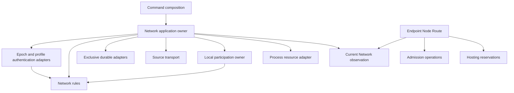

# Network domain: responsibility inventory and reconstruction proposal

Analysis for the Product Owner, 2026-10-03. Repository baseline: local `dev`,
HEAD `98052a2f9f5612b65ad9a17463e82d5b00523edc`, including the preserved,
uncommitted Network migration. The initial inventory was captured while
Admission was being completed in chat `01a0fea1-d0ec-7342-8a8f-4818e34843c7`.
The integration refinement below was subsequently checked against completed
Admission commit `a40d2148e9c4ee23241e14bb13f909b8b6b71caa`, now local HEAD.
This document proposes implementation boundaries; it does not amend accepted
contracts, grant new imports, select another implementation slice, or report
Network completion. The Product Owner permits replacing the entire new Network
implementation if necessary. Its existing shape is therefore evidence, not a
constraint on the target design.

The diagnosis and initial receipts describe that captured baseline. The
implementation plan below was added on authorization to begin development;
current implemented behavior belongs to the technical owner and execution
receipts belong to #493, rather than treating the original failures as a
permanent description of subsequent code.

## Authority and evidence

Read the current [product scope](../product/scope.md),
[threat model](../security/threat-model.md), [Network owner](../technical/network-route-node.md),
[successor Network owner](../technical/successor-network-state.md),
[Admission boundary](../technical/successor-admission-boundary.md),
[package map](package-map.md), [execution workflow](agent-execution.md), and
[documentation handoff](documentation.md#research-to-implementation-handoff).
The earlier [contracts map](contracts-dependency-map.md) supplies investigation
context; fresh sources determine the facts below. The canonical product terms
remain in [CONTEXT.md](../../CONTEXT.md). No new glossary term is selected here.
The remote `old` branch was not consulted.

[Issue #493](https://github.com/dianabuilds/ardents-network/issues/493) was read
through GitHub MCP, including its comments. It is open, in milestone 1, and
explicitly requires responsibility-based reconstruction under `successor`,
bidirectional inventory, real consumers, and removal of replaced owners.
Earlier receipts in its comments are not evidence that this working tree passes.
The CLI returned HTTP 401; MCP access succeeded. No tracker write was made.

The inventory covers all production Go files in the existing Network tree,
including platform files. Searches outside it include direct imports and
semantic fields, so consumers without a State import were also examined.
This is a lexical inventory across build profiles plus focused semantic review,
not a compiler-resolved whole-repository reachability or security audit.

| Existing package | Implementation files | Test files | Main responsibilities found |
|---|---:|---:|---|
| `network/epoch` | 20 | 8 | Document verification, Candidate View evaluation, assignment computation, projections, initial preparation, retained extensions |
| `network/closedprofile` | 5 | 4 | Signed profile grammar, role inventory, token-key grammar, unsigned preparation |
| `network/state` | 36 | 33 | Acceptance, recovery, authority observations, Source accounting and execution, local guard coordination, supervision |
| `network/state/durable` | 8 | 15 | Exclusive root and physical byte/pointer transactions |
| `network/source` | 6 | 8 | Source plan, identity separation, TLS, bounded request/bundle grammar |
| `network/duty` | 15 | 11 | Local participation and exposure restrictions, durable history, root/platform mechanics |
| **Existing tree total** | **90** | **79** | **169 Go files** |
| `successor/network` | 8 | 5 | Partial pure model; 13 additional Go files |

External evidence is retained under
`C:/Users/vitek/AppData/Local/Temp/ardents-network-quality/network-boundary-analysis-20261003/`:
`network-source-manifest.json` (182 file hashes), `network-consumers.txt`
(57 production importing files), `network-semantic-candidates.txt`
(50 production files selected by authority-related fields), and test JSONL.
The latter two lists overlap; their counts must not be added. Import and field
presence identify candidates, not defects or an automatic move instruction.

## Recommended meaning of Network

Network decides which authenticated network statement, Candidate View, profile,
Node membership and finite assignment can be used now, under retained history
and time confidence. It also owns the local network-participation restrictions
that keep known identity/family exposures from being treated as safe eligibility.
It does not decide which Service to contact, which Route to choose, whether a
token allowance exists, whether physical capacity exists, or whether a local
Application has permission to run.

Distinguish the **bounded context**, its **domain model**, and its application
and infrastructure adapters. Source retrieval and State persistence support
Network; their sockets, files, mutexes and goroutines are not domain state.
Removing them from the pure model does not remove their production obligation.

### Exact ownership and consistency boundaries

The proposed target has **two authority-owning application lifetimes**:

1. **Network State**, identified by its pinned Network and exclusive State root.
   Its domain aggregate owns current/pending Epoch history, generation/profile
   acceptance and conflicts, retained Epoch/time floors and the finite
   acquisition cycle. Profile history is scoped to its exact generation;
   acquisition is a nested transition history, not an independently publishing
   authority. One application owner serializes these transitions and constructs
   coherent observations. A missing profile refuses profile-dependent use but
   does not prevent authenticated Epoch intake or diagnostics.
2. **Local participation**, identified by its installation's separate retained
   restriction root. It owns producer-scoped local duties, identity/family
   exclusions and live/time-held exposures. It can refuse local participation;
   it cannot rewrite signed membership, select an Epoch or grant Admission.

Candidate View evaluation, joined membership, trusted-time observations and
retained-assignment matching are policies/values within those boundaries, not
additional independently mutable authorities. These six responsibility groups
must not be turned into six aggregate roots:

| Responsibility | Owned decision/state | Commit or use boundary |
|---|---|---|
| Epoch history | Current/pending identities, exact successor, conflict, retained Epoch floor and intake/recovery policy | Authenticate all relevant observations; propose a transition; application commits before exposing changed authority |
| Candidate View policy | Node eligibility, collisions, canonical accepted/rejected membership, known-family summaries and deterministic Role Domain assignments | Authentication adapter verifies signed evidence and commitments using this one policy; preparation uses the same rules |
| Profile history and membership | One accepted profile per generation, sticky conflict, exact profile-to-record correspondence, unambiguous member identity/key, bounded currentness | Persist profile acceptance/conflict; observe against the same accepted Epoch and trusted time |
| Time confidence | Agreement bound and non-decreasing retained time floor | Application supplies observations and persists advancing floors; the model samples no clock |
| Acquisition history | Finite Source cycle, attempt consumption, interrupted recovery, exact object/index retry, exposure-history cap and backoff decisions | Record attempt/exposure before contact; terminal recording after joined work; restart does not restore consumed attempts |
| Local participation restrictions | Identity/family exclusions, producer-owned duties, live versus time-held Source guards, finite installation history and rollback refusal | Own local-role root, separate from State root; release only with the required joined-work and retained-dependency evidence |

The current Technical owner explicitly separates local restrictions from the
global Epoch aggregate. Placing their **rules** in the Network context is this
proposal; it does not silently put them into `AcceptedState`, merge roots, or
change the current `duty` adapter's authority. Keep this distinction explicit
when updating the owner and package map with implementation.

The State aggregate designation does not promise one atomic write across its
files or roots. Existing publication requires ordered guard, immutable bytes,
control journal and pointer effects, with retirement on uncertain publication.
Profile acceptance has its own persisted generation receipt. The existing
`distributionState` additionally commits Epoch floor, time floor, conflicts and
Source-cycle results together; separating their domain transitions into
independent asynchronous owners would break this invariant. Keep these commit
protocols explicit behind the State application owner. Cross-root guard ordering
remains synchronous and conservative; an event bus or eventual consistency is
not a replacement for required exclusion before contact/publication.

The exact semantic import boundary is:

- Pure `successor/network`: standard library only; deterministic proposals and
  immutable facts, no clock sampling, private keys, files, network I/O or other
  domain owners.
- Network application: authentication, exclusive persistence, Source transport,
  local participation coordination, clock/resource observation and joined
  lifecycle. It owns their ordering, not token or work execution.
- Public profile-format adapter: ARDCPR03 decoding/signature/binding and the
  Admission `issuerprofile` public key/cohort validator. It neither holds issuer
  private material nor authenticates ARDCIP01 as current Network State.
- Endpoint/Node application composition: adapt current Network facts into
  Admission inputs and attach actual Route/Hosting/Job authority. Admission and
  Network core packages do not import each other.

These are proposed responsibilities, not permission to create packages or
imports absent from the package map. A real application/adapter package is added
only with its implementation, caller, tests and registered imports. The glossary
is unchanged: implementation aggregate names are not new product concepts.

## What is already in the new model

`successor/network` currently contains `EpochHistory`, `ProfileHistory`,
`Membership`, `TrustedTime`, `AcceptedState`, `RuntimeView`, `Member` and
`RetainedDuty`. Existing State has eight exact permitted bridges:
`epoch_history.go`, `membership.go`, `closed_member.go`,
`closed_runtime_view.go`, `clock_observation.go`, `closed_profile_view.go`,
`closed_duty_binding.go`, and `closed_profile_accept.go`.

Useful behavior is already present: conflict comparison before winner selection
inside `Reconcile`; ambiguity survives role/expiry filtering; copied public
members cannot mutate the retained relation; time never falls below its floor;
zero observations refuse; profile/member/duty use is bounded. These behaviors
should survive reconstruction, without requiring their current structs or methods.

The model is partial. Candidate View rules, Source-cycle rules and local
restrictions remain elsewhere. `RetainedDuty` carries old projection flags and
the literal Route profile; it is an adapter-shaped input, not a reason to keep
the old broad Interface. Prefer a retained assignment identity that the current
Network observation validates. Node retains local key/configuration, enabled
listener, Purpose and execution decisions. Runtime readiness must not depend on
a consumer-created `Fresh` boolean.

There is also a concrete Admission integration gap: the new `RuntimeView`
provides members and trusted observation time, but no complete accepted public
profile projection. Its `ProfileBinding` carries only identities and bounds.
Issuer selection, allocation-authority key and public token-key inventory still
come from the old `ClosedProfileView`. The target observation must expose copied
authenticated profile facts alongside membership from the same accepted
generation. Merely wrapping the old State projection would leave its authority
owner unmigrated.

Private fields and invalid zero values do not prove authentication. Public model
constructors accept supplied facts; only a genuine opened application owner,
using authenticated evidence and committed history, supplies runtime authority.
No integration may replace that owner with hand-assembled `AuthorityFacts` or
a freshness callback and then claim Network acceptance.

## Inventory inside the existing tree

Paths in this table are relative to `internal/network`. Every one of the 90
production files is covered. A mixed file must be split by responsibility;
moving it wholesale would preserve the mistake.

| Current files | Domain-owned part | Adapter/neighbor part and disposition |
|---|---|---|
| `epoch/assignment.go`, `role_assignment.go`, `candidate_view.go`, `profile.go` | Deterministic assignment, eligibility/collision policy, family counts/capacity summaries, accepted/rejected order, profile/Carrier eligibility | Hash transcripts, signature checks, materialization/commitment verification and format decoding remain authentication work. Share policy with preparation; no second evaluator |
| `epoch/chain.go`, `decision.go` | Admissibility against retained current history | `Authenticate` and owned authenticated bytes remain the verifier boundary. Do not run current-chain selection before the domain sees possible conflicts |
| `epoch/candidate_projection.go`, `materialized_snapshot.go` | Exact correspondence of assigned and authenticated facts | Projection and proof-byte production remain adapters; no mirrored authority-owning Snapshot model |
| `epoch/record.go`, `envelope.go`, `decoder.go`, `header.go`, `commitment.go`, `commitment_proof.go`, `materialization.go` | Extract any embedded semantic eligibility/assignment rules into the single policy | Keep bounded canonical grammar, signature and commitment verification, record/proof byte ownership; `Inspect` remains non-authorizing |
| `epoch/initial_record_preparation.go`, `initial_epoch_preparation.go` | Invoke the same record/assignment/View policy | Explicit closed control preparation and byte encoding; no acceptance, floor change or generic signer in the model |
| `epoch/destination_resolution_gateway.go`, `transit_issuance.go` | No new accepting closed-v3 duty | Retained historical signed extension binding only. Keep required predecessor verification isolated; removal requires population/compatibility evidence |
| `epoch/doc.go` | Document the resulting rule owner | Adapter contract must distinguish authentication from State selection |
| `closedprofile/profile.go`, `decoder.go`, `prepare.go` | Valid role inventory/correspondence and semantic profile bounds, shared where acceptance/preparation need them | Preserve ARDCPR03 grammar, signature and exact preparation; signing/authority-key use belongs explicit control operation, not pure Network |
| `closedprofile/token_spki.go` | None of RSA token grammar is a Network rule | Admission `issuerprofile` owns canonical token SPKI/cohorts; Network binds the authenticated inventory to its accepted profile. Integrate through a narrow public-format adapter, not Network-to-issuer/private-stock dependencies |
| `closedprofile/doc.go` | Document semantic rule ownership | Preserve the grammar adapter's exclusion of current authority |
| `state/epoch_history.go`, `epoch_intake.go`, `pending.go`, `recovery.go`, `epoch.go`, `candidate.go` | Current/pending/conflict, rollback, live-versus-retained schema policy | Authentication calls, byte comparison and bounded loading remain adapters. Keep historical verification distinct from new intake |
| `state/closed_profile_accept.go`, `membership.go`, `closed_duty_binding.go`, `closed_member.go`, `closed_runtime_view.go`, `closed_profile_view.go`, `node_duty.go` | Profile history, exact membership/assignment matching, coherent current observation | Commit and read ordering plus purpose-specific copied projections. Remove old reconstruction paths after real consumers migrate |
| `state/clock_observation.go` | Confidence and retained-floor rules already delegated | `os.Stat`, wall/monotonic/independent observation gathering stay outside the model |
| `state/attempts.go`, `source_wave_state.go`, `source_wave.go`, `control_state.go` | Source attempt/cycle/history/backoff transitions and conflict retention | Locking, random-byte acquisition, durable commits, contact joining and scheduling remain application work |
| `state/local_roles.go`, `active_publication.go` | Source/View collision rule, exposure horizons and retained dependencies | Cross-root ordered guard/State publication, handler counting and join evidence remain coordinated effects; never invent atomicity across the roots |
| `state/control_encoding.go`, `control_decoding.go`, `storage.go`, `outcomes.go` | Interpret retained states and finite outcomes through one rule owner | Exact ARDS1D4 byte mapping, loading/authentication/recovery orchestration and error-cause mapping remain adapters |
| `state/contract.go`, `runtime_state.go`, `config_validation.go`, `open.go`, `offline_accept.go`, `refresh.go`, `scheduler.go`, `server.go`, `lifecycle.go`, `resources.go`, `snapshot_access.go`, `doc.go` | Extract authority and policy predicates; distinguish unavailable authority from diagnostic state | Application owner owns root, operation serialization, Open/Accept/Refresh/Observe/Close, resource reaction, finite work and retained cleanup. Diagnostics cannot substitute for accepting observations |
| `state/durable/root.go`, `generation.go`, `distribution_journal.go`, `closed_profile.go`, `file_transaction.go`, `filesystem_unix.go`, `filesystem_windows.go`, `doc.go` | No acceptance or authority decision | Reuse physical transaction mechanisms after review. Keep exclusive lease, immutable bytes, sync uncertainty and error identities; do not create a generic storage framework |
| `source/plan.go`, `credentials.go` | Exactly two distinct declared Sources; identity/family/key separation from each other and Epoch authorities; finite selected material index | TLS/X.509 configuration and certificate custody belong Source adapter. Expose non-secret facts for the Network rule; no transport success becomes Epoch acceptance |
| `source/protocol.go`, `bundle.go`, `transport.go`, `doc.go` | No winner, currentness or retry-authority decision | Keep bounded private framing, mTLS contact/serve, cancellation and joined socket ownership; eliminate accidental dependency on Epoch merely for framing bounds when the real format seam is rebuilt |
| `duty/contract.go`, `node_participation.go`, `store.go` | Restriction classes, validity, live Source effectiveness, producer-scoped replacement, identity/family collisions, limits and Node exclusion classification | Separate domain transitions from storage, locks, root and runtime phase reporting. Node reports phases and joins execution; it cannot invent an exemption |
| `duty/persistence.go` | Retained-generation/watermark interpretation and existing v1-to-v2 restriction-history obligation | Strict encoding and physical write/reopen; do not reintroduce retired Transit spending |
| `duty/conflict_read.go`, `operation_lease.go`, `root.go`, `atomic_files.go`, `directory_sync_unix.go`, `directory_sync_windows.go`, `root_lease_unix.go`, `root_lease_windows.go`, `root_permissions_unix.go`, `root_permissions_windows.go`, `doc.go` | No global authority or Route choice | Narrow durable restriction adapter: bounded cancellable lease acquisition, validation, transaction and retained release failure; busy/corrupt is unavailable, never no-conflict |

## Network rules and collaborations outside that tree

| Current location | Network-owned responsibility to collect or centralize | Responsibility that stays with its caller |
|---|---|---|
| `node/authority/receiver.go`, `peer.go` | Already delegate duty binding/member-by-key ambiguity; remove old State type dependence when the final observation Interface exists | Mapping a member into a role receiver, expected Purpose and Carrier peer policy |
| `node/admission.go`, `lifecycle.go`, `local_roles.go`, `process_config.go` | Freshness/current generation, exact retained assignment, local exclusion classification. Closed admission still repeats freshness/window checks after `MatchDuty` | Local private-key/config match, selected listener, pressure, quarantine, readiness and joined retirement; role-probe remains an explicit separate consumer |
| `node/forwarding/recipient.go`, `bootstrap.go`, `session.go` | Exact member/key lookup and record/duty relation come from one current observation | OPEN equality, Purpose, adjacency, literal endpoint/dial validation, relay configuration, finite sessions and incarnation-safe cleanup |
| `node/issuer/listener.go`, `node/resolution/operation.go`, `node/introduction`, `node/join` | Re-observe current Network and retained local assignment at every existing authority check | Token receiving, work reservations, role/Service/registration/pair state, wire I/O and joined roots |
| `endpoint/source_state.go`, `permission.go`, `issuance.go`, `closed_state_binding.go` | Coherent profile/member observation, membership existence, exact receiver duty generation and trusted observation time | Context/Job/grant authority, selecting retained Entry/Interior sets, exact exchange/pending batch, cancellation and rechecks around effects |
| `endpoint/source_separation.go` | Network supplies all current assignments and known family/key facts; local durable exclusion facts have their own owner | `roleSeparated` checks eligibility of a proposed Route selection. Cross-leg/path separation and no resampling remain Endpoint/Route policy, not a new universal Network selector |
| `route/client/closed_bootstrap_plan.go`, `closed_terminal_recipient.go`, `closed_recipient_inspection.go` | Consume exact Network membership and coherent profile; do not rejoin signed records or decide current State | Purpose/subrole selection, singleton terminal recipient for that operation, family separation along that path, 10-second handshake bound and original operation deadline |
| Old `admission/stock/*`, `issuer/issuer.go`, `receiving/verification.go`, `token/*` | Replace dependency on old State projections with authenticated external facts; Network remains the producer of currentness | Permission window/equality, quotas, token binding/signatures, issuance material, stock and durable presentation/spending |
| `entry/closed_sets.go` | Consume eligible current member observations; no independent Network authority | Two-member selection, persisted retained sets/watermarks, expiry and no replacement triggered by failure |
| `cmd/ardents`, `cmd/ardents-node`, `cmd/ardents-control`, `cmd/ardents-qualification` | Compose the real Network application and explicit pinned trust inputs | Parse bounded plans/keys, inspect/prepare, resource adapter, human output and qualification scenarios; do not copy business rules into commands |
| `alphacontrol/inspection` | Independent Network verification uses the same acceptance policy where applicable | Separate disclosure/Release/compatibility inspection; report does not grant Network or Release authority |
| `route/closed_outer_handshake.go`, `closed_admission_channel.go`, `ardp/frame.go`; Service/Introduction/JOIN bindings | Network supplies the authenticated facts those protocols bind | Wire equality, channel-local state, Service credential/Target/proof and registration continuity stay with their owners |
| `resource/source_control.go`, `hosting`, `node/hosting` | No Network accounting authority here | Physical observation, pressure, capacity and reservations; a Network-valid member does not guarantee capacity |

An equality involving `StateDigest` is not automatically Network policy. Token,
OPEN, Descriptor, registration and capsule bindings have their own replay and
effect boundaries. Move the producer's authority decision, not every use of
its facts. The semantic-candidate search also finds Service Instance conflict
state and disclosure transitions; these remain their existing domains.

## Required integration seams

The target dependency direction is:

Authentication may invoke the single pure Candidate View policy to check signed
commitments. It never selects the accepted current generation. A prepared or
authenticated document is not an accepting observation. Acquisition I/O and
admitted token/Hosting work run outside the State authority lock; durable reads,
decisions and required cross-root publication have their explicitly ordered
locking, rather than a blanket promise of no I/O under any lock.

Prefer one small application Interface with current semantic operations:
open/recover, accept authenticated offline evidence, accept profile, finite
refresh, observe current authority, observe diagnostics, stop/join. Exact Go
signatures are implementation choices after lifetime ownership is settled;
there is no need for a generic controller or a getter Interface mirroring
Snapshot. A current observation carries identity/window plus immutable members;
retained assignment matching and key ambiguity belong to Network. Diagnostic
observations may expose a conflict/expiry while an accepting observation refuses.
Every accepting consumer must re-observe at its existing effect boundaries.

Admission integration is a translation at composition:
current Network observation -> `admission.AuthorityFacts` plus the exact
`receiving.Receiver` and authority horizon. Admission's `ValidateAt` checks
supplied consistency, not signatures or Network history. It keeps permission,
issuer/hour keys, quota, stock and irreversible spend. Network cannot import
Admission's signer, stock or receiving owner. A narrow format adapter can use
Admission's `issuerprofile` for SPKI/cohort validation; it must have exact
registered imports and preserve ARDCPR03 bytes. Root Network remains standard
library only. The adapter neither accepts issuer inventory as State nor turns
private keys into shared Network data.

Receiving checks current authority before accepting work and rechecks at the
selected post-I/O boundaries. A State refusal observed before an effect must
prevent that effect. This is not an atomic Network-plus-spend transaction: a
concurrent publication can occur between observations. If authority disappears after an
already committed spend, retain that spend, release untransferred capacity and
refuse the effect. Already accepted work holds its transferred reservation until
the actual work owner joins. Network successor cannot extend its original
deadline, refund a token, choose another path or release someone else's handle.

## Exact integration with the new Admission

Checked against the working-tree contracts in `admission/authority.go`,
`stock/owner.go`, `stock/issuance.go`, `issuer/current.go`,
`issuer/operation.go`, `receiving/owner.go` and `quota/ledger.go` under
`internal/successor`. Admission completed publication as commit
`a40d2148e9c4ee23241e14bb13f909b8b6b71caa` during the analysis; the inspected
APIs are present at that commit. Its independent command scenario is complete;
authenticated Network authority remains explicitly outside its acceptance.

### One coherent observation and a lossless fact translation

The Network application performs current-owner/guard checks, required persisted
profile verification and a trusted-time observation after that I/O. It refuses
closed, conflicted, uncertain, missing, expired or mismatched authority and
returns immutable profile/member facts from one accepted generation. The
composition adapter translates that one observation; it never joins a separate
diagnostic snapshot and separately read profile.

| Admission input | Source and exact meaning |
|---|---|
| `AuthorityFacts.NetworkID` | Pinned, authenticated Network identity |
| `StateGeneration` | Exact accepted persisted generation identity, not a refresh sequence or operation identifier |
| `StateDigest`, `Epoch` | Accepted Epoch document digest and number |
| `Digest` | Accepted signed ARDCPR03 profile digest |
| `IssuanceAuthorityKey` | The Permission issuance authority selected in that signed profile; not its Epoch signer or the receiver's Node key |
| `IssuerNodeID`, `IssuerDutyGeneration` | Profile-selected issuer and its exact signed assignment joined to the authenticated Node Record |
| `NotBefore`, `NotAfter` | Original signed profile interval, unchanged |
| `TokenKeyCount`, `TokenKeys` | Copied complete canonical class/hour public SPKI inventory, preserving order and a zero unused array tail |
| Observer time | Fresh Network trusted observation time, not an independent `time.Now()` or caller-declared freshness |
| `receiving.Receiver` | Same Network/generation/Epoch/profile identities plus the exact retained local Node ID and duty generation |
| `receiving.Observation.NotAfter` | Minimum of profile/Epoch, this receiver's record/assignment and retained local duty bounds; an individual operation supplies its original deadline separately |

Do not shorten `AuthorityFacts.NotAfter` to the receiver or operation horizon.
Admission validates complete hour cohorts against the signed profile interval
and compares the complete facts across I/O. Changing that interval alters the
binding. The separate receiver horizon and operation deadline enforce the
shorter permission to act. Similarly, profile authority for token verification
does not require every member, or the remote issuer's listener, to remain live.
Local issuance does require the selected issuer's own current assignment.
Computing a minimum horizon follows, rather than relaxes, the existing exact
assignment/profile coverage checks. It cannot turn an invalid retained duty
into a valid one by shortening its returned horizon.

`AuthorityFacts.ValidateAt` validates supplied public structure/cohorts and
time bounds. It does not verify Network signatures, history, conflicts,
membership or local exclusion. The production provider must therefore be the
opened Network owner. `cmd/ardents-next/admission_console.go:admissionObserver`
explicitly reads operator assertions from JSON; those standalone operations are
useful Admission consumers but do not implement this Network integration.

### Three concrete application paths

**Holder (Endpoint).** Give `stock.Open` the profile observer above. Endpoint
keeps Context/Job permission, finite exchange, retained Entry/Interior/issuer
selection, Purpose/Carrier and cancellation/join ownership. It constructs
`stock.IssuanceIntent` and calls `Begin` -> `Attempt.Request` -> actual protected
exchange -> `Attempt.Complete`. The exchange runs outside the Stock mutex.
Failed exchange retains the exact pending blind batch and original delivery
binding/deadline without refund or resampling. `ExchangeBinding.ID` is a local
binding of the already selected delivery, not a new Network or wire identity.

Before `stock.Take`, Endpoint validates the actual authenticated HELLO recipient
against current Network membership, its retained exact duty, required Purpose
and channel nonce. It repeats the recipient/operation check after the durable
presentation and before sending bytes. `Take` rechecks profile authority but
does not authenticate a nonzero caller-supplied recipient/duty or TLS nonce.
Refusal after presentation retains the consumed attempt/token. Network does
not create challenges, hold Stock or execute the exchange.

**Issuer (Node).** Supply `issuer.IssueCurrent` with a profile observer that
also matches the retained local duty and profile-selected issuer, and refuses
when that duty or local participation is unavailable. Preserve the signed
profile interval in returned facts even when the local duty expires sooner.
Build `issuer.Plan` from exactly that public inventory and its provisioned
exclusive quota/key/result roots. Network holds none of the private keys.

Node authenticates HELLO, Purpose, adjacency and child-lane restriction before
choosing `quota.Bootstrap` or `quota.Admitted`; a holder's `Bootstrap` flag is
not proof of an eligible bootstrap lane. Keep bootstrap restrictions and the
ordinary admitted lane's token/capacity checks. `IssueCurrent` re-observes
before debit, after debit and before exposing the result after cleanup. A later
refusal keeps committed quota/result history; it cannot authorize offline
`Issue` as a fallback or regenerate keys under an existing signed profile.

Unlike the current long-lived old `ClosedTokenIssuer`, `IssueCurrent` acquires
and closes quota/key/result leases per operation. The Node application must
serialize these operations for the same roots using a bounded existing work
admission, keep reception spending separately owned, cancel/join all work on
retirement and retain cleanup failures. Do not hold the old issuer roots and
open the new roots simultaneously for the same duty. This lifetime adaptation
is required even though the observer function types already fit.

**Receiver (Node/role operation).** Open one `receiving.Owner` for the retained
exact receiver binding and spending root. Its observer re-observes Network,
matches the retained local assignment, and the role application checks local
eligibility, expected Purpose and operation/channel authority. On any change
of that binding the owner refuses; the supervisor retires and joins it before
opening a replacement with correctly provisioned history.

Call `Accept(ctx, class, token, originalDeadline, reserve)` with the real Hosting
reservation callback. Admission verifies first, obtains capacity, rechecks,
commits the spend and rechecks before transferring a `Grant`. Route consumes
its allowance to enforce bytes/class/time and keeps framing/TLS/channel limits.
Remove the old channel's second redemption path: one incoming token is spent
once by the new receiving owner, not independently by both owners.

The actual work owner holds the transferred reservation until work is joined.
`receiving.Owner.Close` closes future acceptance/spending; it does not release
accepted grants. A refill uses `Refill` with the original grant, remaining
bytes and retained deadline. The work owner explicitly transfers/releases the
old and new reservations on successful replacement or failure; it does not
extend the operation or leak either handle. Introduction slots, Service/JOIN
state and physical outer/child/channel limits keep their existing owners.

### Ordering, migration and integration acceptance

Observer callbacks are invoked while Stock/Receiver mutexes are held. They may
call Network observation but must not reacquire an Endpoint/Node parent mutex
already held by the caller, call back into the same Admission owner, reserve
Hosting or start transport. Network publication does not call Admission while
holding its authority lock. Give each current-effect check a fresh observation;
an immutable view is not a durable permission lease.

Integrate new Network command intake and the three new Admission composition
observers first, then exercise actual new holder, current issuer, receiving and
Hosting reservation ownership. Old consumer migration and retirement belong
to subsequent domain work; their implementation is not selected here.
Use the accepted public/wire identities. New private roots need explicit
provisioning/compatibility disposition; replacing source code does not authorize
resetting quota, spends, presentation history or retained Network floors.

Acceptance must execute signed Epoch + ARDCPR03 -> opened new Network -> actual
new issuance/Stock/receiving -> real Hosting and joined bounded work. Carrier/Route
qualification belongs to their subsequent replacement. Exercise successor/profile conflict, clock uncertainty, unavailable
roots, receiver expiry during reservation, issuer expiry after debit, holder
recipient change after presentation, failed exact issuance retry, refill and
joined shutdown. Assert no effect on observed pre-effect refusal, retained
burns on post-commit refusal and reservation ownership until joined work.
An `AuthorityFacts` fixture or JSON profile file cannot stand in for this path.

## Confirmed defect: authenticated evidence is filtered before reconciliation

Source flow currently follows:
`Refresh.fetchAndVerify` -> `verifySourceBundle` -> `verifyDecision` ->
`epoch.Verify` -> `verifyEpochChain` -> `EpochHistory.Reconcile`.
`Verify` authenticates and then requires an exact successor of the existing
current Epoch. A differently signed digest for the **same current number**
therefore becomes `invalid-state` before reconciliation. The valid successor
from the other Source then advances State with `Conflicting=false`.

There is already an `epoch.Authenticate` Interface and an unused
`state.authenticateDecision` adapter. The domain unit test sees all supplied
facts and catches the conflict, but the real application fails to supply those
facts. This is a demonstrated integration defect, not a hypothetical redesign
argument or evidence that the conflict comparison itself is absent.

Existing `TestRefreshSuccessorCannotHideCurrentEpochConflict` reproduced this
on Windows: `conflict=false` passed, `conflict=true` failed, the successor became
Epoch 2 and the conflicting current document was classified `invalid-state`.
The initial combined diagnostic run and the separately captured reproduction
both failed. The captured run is `windows-conflict-reproduction.jsonl`.

Concrete repair within the existing contract: authenticate candidate content,
signatures, View and materialization first; retain all authenticated identity
observations; reconcile against current/pending history before discarding a
candidate for successor admissibility. Commit the conflict or retire the owner
if committing it fails. Only after a conflict-free selection, validate selected
chain/disposition at completion time and perform ordered publication. Keep
historical-chain verification for recovery distinct. Preserve live-intake
schema refusal and exact object/index binding. An invalid signature or unrelated
network must not manufacture a conflict. Cover Source and offline paths, both
arrival orders, retained pending, expired/unusable evidence policy and reopen.

The existing reproducer uses the maintained role-probe profile. It demonstrates
the shared Source intake failure, not a passed closed-v3 integration scenario;
implementation acceptance also needs signed closed-v3/profile cases.

## Reconstruction sequence and deletion conditions

### Implementation and regression plan

The Product Owner authorized implementation after this plan on 2026-10-03.
Issue #493 remains the single execution ledger and active implementation slice;
the existing `dev` worktree and unfinished Network delta are preserved. These
ordered increments describe acceptance boundaries, not additional active issues
or a second delivery ledger. Admission integration targets commit `a40d2148`;
Hosting uses its selected successor owner. No new runtime dependency is needed.

| Increment | Reviewable implementation result | Regression and acceptance boundary |
|---|---|---|
| Authenticated intake | Source and offline intake authenticate before history reconciliation; only the domain selects the successor; verified conflicts persist or retire the owner | Signed current/pending conflict versus successor in both Source orders; offline conflict; reopen; bad signature/wrong Network cannot manufacture conflict; invalid chains/schema remain refused |
| Complete rules and observations | Single Candidate View policy shared by verification/preparation; coherent accepted public profile, membership and time; remove projection freshness flags; pure acquisition/local restriction transitions | Existing golden ordering/bytes; record/duty/key ambiguity and independent expiry; immutable returned data; clock rollback/slow persisted read; finite attempts/exact retry/caps; producer-scoped guard histories |
| New application owner | New Network opens/rebuilds authenticated history and owns acceptance/refresh/observation/stop; real storage/authentication/transport adapters use ordered publication | Real exclusive roots, immutable generation/control/pointer failures and recovery; concurrent publication; uncertain commit retirement; cancellation and joined repeated Close; retained predecessor Source guards |
| New-domain integration | New command composition connects Network to new Stock, current Issuer, Receiver and Hosting without old Node/Endpoint/Route | Signed opened new Network plus real blind issuance, presentation/spending/Hosting roots; pre-effect refusal; post-commit burns; no deadline extension; exact retries/refill; cancellation and reservation retention until joined work |
| New-domain completion | Finish the new owner and explicit contracts for subsequent domain replacements; preserve named grammar/recovery obligations | Full regression only of new domains and their command composition; import isolation, Linux race, vet/build, frozen formats and bounded review. Old-tree retirement and Carrier/Route qualification are subsequent work |

Each increment has one active next result. The first is the reproduced
authentication/reconciliation defect, followed by the accepted public-profile
projection needed by Admission. A passing first increment is component evidence,
not completion of #493. Preserve failed runs and exact source identity outside
Git. Windows targeted checks cover portable rules and application behavior;
Linux filesystem/race and real new-domain work composition remain required.

Run focused Network checks during implementation. The final selected regression
runs all new domains and their command composition, Linux race integration,
Network import isolation, static analysis of Network, vet/build and a bounded
review against this inventory. Whole old-product quick/full gates are outside
the Product Owner-selected completion boundary. Do not weaken tests, erase
failed receipts, repair other domains or install tools implicitly.

1. Fix and freeze the semantic responsibility matrix and observable refusal
   outcomes. Treat existing new structs/callbacks as replaceable. Record each
   rule's producer, real consumer, commit point, compatibility and scenario.
2. Correct the authenticated-observation/reconciliation seam first. Keep one
   owner for conflict and successor decisions; preserve the failing reproducer
   and add the closed-v3 path to acceptance evidence.
3. Centralize Candidate View and assignment policy. Both verification and
   initial preparation call it. Authentication/commitment mechanics remain
   distinct; frozen accepted/rejected ordering and hashes must stay identical.
4. Rebuild Epoch/profile/time/member model and its current observation Interface.
   Consolidate where invariants require it; no file-count target. Preserve
   independent member availability and all retained floors/conflicts.
5. Extract pure Acquisition history and local-participation rules. Acquisition
   stays within State's commit boundary; local participation keeps its separate
   root and failure semantics. Build ordered adapters around them;
   Source live guards precede contact/publication and outlive dependent work.
6. Rebuild the Network application owner with its real durable/authentication/
   transport adapters and borrowed application admission. Move mechanisms only after checking ownership;
   never hide the old State as a permanent backend of a new wrapper.
7. Integrate new Admission holder, current issuer and receiver through new command composition and real Hosting reservations. Exercise signed opened Network, genuine blind issuance, pre-effect refusal, post-commit burns and reservation retention until work joins.
8. Remove superseded interfaces and unrelated responsibilities from the NEW Network implementation. Keep only named compatibility readers and planned contracts for subsequent domains. Old Node, Endpoint, Route and their accepting paths remain outside this slice.
9. Run the complete selected regression of new domains and their command composition: Linux functional/race integration, Network import isolation, vet/build, Windows portable boundary and bounded review. Preserve all failed receipts. Record external findings for their owners; do not repair other domains. After Network completion, hand off the contracts and results to the Product Owner-selected thread.

Root `successor/network` should contain coherent authority concepts and pure
rules. Application, authentication, durable and Source responsibilities require
real cohesive Modules with small Interfaces. Local participation is a separate
consistency owner. Exact subpackage paths are selected with their implementation
and consumers, permitted imports, `doc.go`, behavior tests and package-map
entries; this analysis creates no speculative packages. Do not reproduce the
old six-package tree automatically. Do not introduce a new runtime identity,
wire format or database in order to make DDD visible in the directory tree.

Deleting all new Network code is structurally allowed. Deleting authenticated
history, weakening its interpretation, resetting roots or changing compatibility
is a separate contract action and is not implied by that permission.

## Acceptance matrix for the eventual change

| Boundary | Required observable scenario | Existing useful evidence to carry forward |
|---|---|---|
| Authentication to history | Same-number signed conflict cannot be hidden by newer candidate; bad signatures do not cause authenticated conflict | `epoch_history_test.go`; `state/refresh_test.go` failing reproducer |
| View policy | Same accepted/rejected order, assignment, summary and commitments for verification/preparation; collisions and wrong capability/Carrier refuse | `epoch/verification_property_test.go`, `initial_preparation_test.go`, frozen vectors |
| History and profile | Exact successor/pending activation, future genesis deferral, wrong chain/schema refusal, sticky conflict through reopen | `state/offline_pending_consistency_test.go`, `source_bootstrap_test.go`, `epoch_intake_test.go`, `closed_profile_store_test.go` |
| Membership | Wrong record/generation/domain, duplicates, key ambiguity including expired/different-role records, independent member expiry | `successor/network/membership_test.go`, `state/closed_profile_role_join_test.go`, `closed_runtime_view_test.go` |
| Observation/time | No mixed generation, private copied data, zero refusal, time sampled after required durable read, rollback and expiry during I/O | `accepted_state_test.go`, `time_confidence_test.go`, `state/membership_transition_test.go`, `closed_runtime_view_test.go` |
| Durable publication | Guard/immutable bytes/floor/pointer order; pre-rename retry versus sync-uncertain retirement; reopen verifies named identity | `state/control_commit_test.go`, `durable/closed_profile_test.go`, `state/durable_test.go` |
| Acquisition | Two Sources, original index/object retry, finite attempts and deadline, consumed attempts stay consumed, backoff/history bounds persist | `state/fallback_test.go`, `refresh_cycle_test.go`, `refresh_resume_test.go`, `outcomes_test.go` |
| Local restrictions | Identity-only/family-only collision, blocked live work beyond timestamp, A->B->C retained predecessors, full caps and crash recovery | `duty/source_collision_chain_test.go`, `node_participation_test.go`, `state/source_server_predecessor_test.go`, `source_wave_guard_failure_test.go` |
| Lifecycle | Stop closes admission; cancel joins Source/refresh; repeated Close keeps cleanup failures; unavailable/busy root never grants eligibility | `state/lifecycle_close_test.go`, `duty/operation_lease_test.go`, `conflict_concurrency_test.go` |
| Admission/Hosting integration | Real signed opened State, real token and spend/Hosting roots; pre-effect refusal, retained post-spend burn, reservation through joined work | New-domain holder/current-issuer/receiver commands and real Hosting with joined local socket work; no old Node/Endpoint/Route or Carrier qualification |
| Final composition | Production commands use new owner; removed accepting paths absent; retained compatibility explicit; package/profile/golden/deadcode rules consistent | Required project gates and bounded change review; whole installed-product qualification remains separate |

## Second pass and limits

The second pass worked backward from failures and callers rather than repeating
the initial package categorization. It corrected four possible mistakes:

- A green pure-model suite is not proof of correct integration: the current
  Source conflict reproducer fails at the authentication-to-history seam.
- The target is broader than the existing new package: Candidate View,
  Acquisition history, and local participation rules need explicit disposition.
- Local exclusion is not global Epoch acceptance, and per-Route family
  separation is not automatically a universal Network decision.
- Presence of Network identity fields does not transfer token, Service,
  registration, transport or physical reservation ownership to Network.

All 90 production filenames are covered by the inventory, local document links
resolve, and comparison against the 182-file source manifest found no changed
Network Go source between capture and final verification, including the
integration refinement after Admission publication.

The integration second pass corrected these additional design risks:

- Six responsibility groups are not six independent authorities. Epoch/time
  floors and acquisition results have a shared commit invariant; profile facts
  need the same State observation owner; local restrictions remain separate.
- Profile interval and receiver/operation horizon must remain distinct, with
  exact public-key inventory preserved.
- Stock does not authenticate HELLO recipients and bootstrap accounting does
  not authenticate bootstrap lanes. These checks require real application
  composition before and around the selected effects.
- Issuer per-operation root ownership and transferred Receiver reservations
  require lifecycle changes; matching callback signatures alone is insufficient.
- State observation and Admission commit are not one cross-domain atomic
  transaction. Post-commit refusal retains irreversible history and releases
  only untransferred work capacity.

Reran `TestRefreshSuccessorCannotHideCurrentEpochConflict` on the preserved
working tree at local HEAD `a40d2148`. It still fails for `conflict=true`:
Epoch 2 is published with `Conflicting=false` (State run 2.679s). Admission's
reported full gate covers its isolated change, not the preserved Network delta;
that receipt does not supersede this reproduced Network failure.

Executed the existing pure-domain cases and selected State scenarios for copied
views, expiry during durable read, coherent generation publication, failed
profile-conflict persistence, uncertain Source commit and joined repeated Close.
Both selected package groups passed on Windows (domain 0.173s; State 1.622s),
recorded in `windows-selected-boundaries.jsonl`. This selected run excludes the
known failing Source-conflict scenario; it does not supersede its failure.

Linux/race and full gates were not run in this analysis. A Docker image
inspection was denied access to the engine from the sandbox, so no Linux result
is claimed. No tool/dependency was installed and no production code, staged
change, branch or tracker record was modified by this analysis. The output is the inventory,
recommended boundaries, concrete defect and reconstruction/verification plan.
No independent-security or full-domain-completion claim follows.
