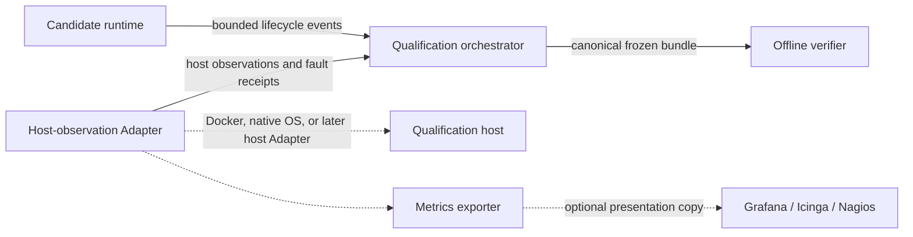

# Qualification observation contract

Status: Product Owner-approved architecture direction, 2026-08-14.

This document fixes the implementation seams between an Ardents candidate,
qualification orchestration, host observation, and independent verification.
It applies to the Horizon 3 Stage 4 tracer and later qualification work. It
does not select a transport, operating system, container runtime, metrics
backend, or public observability product.

The Interfaces below are semantic contracts. They do not require one generic
Go package or an exported Go interface before a second maintained Adapter has
a real caller. The current Stage 4 implementation may deepen the authorized
`recoverysmoke` Module while it separates the Docker Adapter from the common
values and verdict rules.

The qualification host in this document is an implementation environment. It
is not an Ardents Endpoint, Node, Local Traffic Observer, or product identity.

## Current migration status

This is the accepted target contract, not a claim that the current Stage 4
evidence schema already implements it. The maintained recovery bundle and
verifier still contain required Docker container, image, network-mode, and
cleanup fields. Route observations also retain candidate-reported process
fields from the earlier tracer. Until migration steps 1-4 are complete, the
result remains Docker-local development evidence and is not a cross-Adapter or
native-host qualification result.

New work must not add further candidate/host coupling. Each migrated verifier
rule must distinguish a common verdict fact from its Docker Adapter provenance;
removing a Docker field is valid only after the common fact remains provable.

## Design rule

Candidate behavior and qualification observation are separate Modules.

- the candidate exposes only bounded lifecycle events that are natural results
  of its maintained behavior;
- the qualification orchestrator owns schedules, faults, baselines, and bundle
  assembly;
- a host-observation Adapter owns process, channel, resource, and cleanup facts;
- the offline verifier consumes a frozen bundle and has no live management
  access.

Docker vocabulary may appear inside a Docker Adapter projection. It may not be
required by the host-observation Interface, candidate event schema, or verdict
rules.



## Candidate lifecycle-event Interface

The candidate emits a bounded append-only stream. Events report candidate
behavior; they never assert host facts.

Every event contains:

- `schema` and `event_version`;
- a connection-local monotonically increasing `sequence`;
- an evidence-safe `connection_commitment` that is stable for one logical
  Service Connection and unusable as a bearer capability;
- `kind`;
- the current `attachment_generation`, when an Attachment exists; and
- a bounded result or reason class, when the event is terminal.

The bounded event kinds are:

1. `connection-started`;
2. `attachment-started`;
3. `attachment-accepted`;
4. `attachment-retired`;
5. `connection-terminal`.

An Attachment event may additionally contain public commitments to the
authenticated Candidate View, selected Route, Isolation Context, Route Profile,
Destination Binding, continuity proof, and fresh Introduction result. It may
contain cumulative accepted, acknowledged, and delivered byte counters.

The candidate event stream must not contain:

- PID, container ID, Compose service, cgroup, namespace, interface, or socket
  identity;
- host monotonic or wall-clock authority;
- the qualification fault schedule or a host release signal;
- raw keys, channel material, bearer capabilities, reusable credentials, or
  Application Data;
- CPU, RSS, host traffic, process-tree, cleanup, or image-provenance claims; or
- a pre-scripted future sequence of Candidate exclusions or Attachments.

Candidate events are necessary evidence inputs but never prove that a process
remained alive, a resource was faulted, or cleanup completed.

## Host-observation Interface

The host-observation Interface is technology-neutral and fail-closed. Its
Adapter uses one host-owned monotonic clock and returns bounded canonical values.
The Interface exposes the following operations:

### Resolve process

`ResolveProcess(scope, selector) -> ProcessObservation`

Returns an immutable `ProcessRef`, its parent/process-tree relation, executable
commitment, observed running state, and observation time. A PID alone is not a
`ProcessRef`; the reference must distinguish process reincarnation.

### Observe channel

`ObserveChannel(scope, selector) -> ChannelObservation`

Returns an immutable `ChannelRef`, public local/remote endpoint projection,
network-scope commitment, state, and observation time. The Adapter must reject
ambiguous matches.

### Observe resources

`ObserveResources(scope, cadence, limit) -> ResourceSample stream`

Returns complete process-tree samples with monotonic interval bounds, RSS, CPU,
and receive/send counters. Missing members, counter regression, ambiguous
attribution, or cadence outside the frozen contract invalidates the affected
claim.

### Inject fault

`InjectFault(scope, ResourceRef, FaultSpec) -> FaultReceipt`

Targets an already observed exact resource. The receipt binds the resource,
requested operation, invocation start/completion bounds, observed postcondition,
and Adapter identity. It cannot select a different resource on retry.

### Await state

`AwaitState(scope, ResourceRef, StatePredicate, deadline) -> StateObservation`

Observes a named postcondition without converting timeout, permission, decode,
or management failures into absence.

### Prove cleanup

`ProveCleanup(scope) -> CleanupReceipt`

Enumerates every resource owned by the exact qualification scope and proves the
set empty. Cleanup is not inferred from a successful remove/stop request.

## Common observation values

`HostScope` binds one campaign to a machine incarnation, Adapter identity,
source/image commitments, and an opaque campaign identity.

`ProcessRef` binds an Adapter namespace, a stable process identity, and a start
incarnation. It is comparable only inside its `HostScope`.

`ChannelRef` binds a network scope, transport family, public endpoint tuple,
and channel incarnation. It never contains protected payload bytes.

`ResourceRef` is a tagged union of `ProcessRef`, `ChannelRef`, network-interface
reference, or another explicitly versioned host resource.

Every observation contains:

- `adapter_schema` and `adapter_version`;
- `scope_commitment`;
- `observed_at_nanos` from the scope's monotonic origin;
- an exact subject reference;
- the bounded public projection used by the verifier; and
- an observation commitment over the canonical projection.

Adapter-private raw diagnostics remain in the private fixture root and are
erased. Durable evidence retains only allowlisted public projections and bounded
diagnostic digests.

## Adapter mappings

| Fact | Docker/Compose Adapter | Native-host Adapter |
| --- | --- | --- |
| machine incarnation | Docker engine/VM identity commitment plus host campaign root | OS boot/session identity commitment plus host campaign root |
| process identity | full container ID plus inspected start incarnation and executable/image commitment | boot identity plus PID plus OS process start identity and executable commitment |
| process tree | exact owned container set and declared parent/scope relations | OS parent tree constrained by an owned process group, job, cgroup, or equivalent scope |
| channel identity | network namespace, interface/socket identity, tuple, and incarnation | OS network namespace/compartment, interface/socket identity, tuple, and incarnation |
| resource samples | runtime counters independently attributed to the exact process scope | OS process-tree and interface counters attributed to the exact owned scope |
| fault | exact runtime network/process operation with observed postcondition | exact OS process/channel/interface operation with observed postcondition |
| cleanup | label/scope enumeration proves no owned containers, networks, or volumes | process-group and owned resource enumeration proves no owned processes or resources |

The two mappings may retain different Adapter projections. Verdict rules depend
only on common facts. A rule that can be evaluated only from a Docker field is a
Docker development limitation, not a technology-neutral qualification result.

The current Stage 4 campaign is one Docker/Compose development Adapter, not the
definition of observation itself. Its present schema has not yet completed this
separation. Container IDs, Compose labels, profiles, and network-namespace
projections belong in that Adapter's evidence section. They may support a local
Docker limitation or prove Adapter integrity, but they must be normalized to
the common process, channel, resource, fault, chronology, and cleanup facts
before a cross-Adapter verdict rule consumes them.

## Qualification-attempt Interface

Every maintained qualification scenario, independent of Stage or execution
Adapter, uses one six-phase attempt:

1. `prepare` creates owned resources and starts passive candidate processes;
2. `arm` starts observation and waits for an Adapter-level ready receipt from
   every required observer and sampler;
3. `release` opens the precommitted qualification-Application workload gate and
   fixes the active interval origin;
4. `observe` waits for candidate terminal behavior while retaining samples;
5. `freeze` obtains the terminal event and final immutable observation values;
6. `cleanup` removes and independently enumerates the attempt's owned resources.

`prepare` and `arm` complete before qualified candidate deadlines, recovery
clocks, or resource-sample membership begin. Passive candidate processes may
retain their ordinary bounded setup/lifetime contexts while arming; a process
that terminates before release makes the attempt `not-run/invalid`, not a
candidate failure. `ActiveNanos` begins after the sender workload gate is
published and ends at the terminal observation that starts `freeze`; it
includes only candidate behavior and its already-armed host observation.
Evidence reads and persistence inside `freeze` are outside candidate time.
`cleanup` begins afterward. Execution-Adapter create, start, inspect, log,
stop, or remove latency is never candidate time merely because the current
Adapter uses Docker.

The attempt produces three independent terminal facts:

- `candidate: pass | fail | not-run`, where `not-run` means candidate behavior
  was not validly observed;
- `observation: complete | invalid`; and
- `cleanup: complete | invalid`.

An orchestration, Adapter, observer, sampler, persistence, or verifier failure
cannot produce `candidate: fail`. Before or during the active interval it yields
`candidate: not-run` and makes observation invalid. A candidate
failure is an explicit observed protocol or product result, never a Go error or
an execution-management exit status. Cleanup failure changes only the cleanup
fact and does not rewrite an already frozen candidate result.

The qualification-attempt Module owns:

- canonical manifest creation and precommitment;
- the exact prepare/arm/release/observe/freeze/cleanup state machine;
- workload and fault schedules;
- candidate launch through the selected execution Adapter;
- collection of candidate events and host observations;
- baseline pairing, fault injection, and monotonic evidence clocks;
- evidence redaction and freeze; and
- atomic per-attempt receipt persistence.

Each attempt has a unique identity and atomically writes one immutable final
receipt beneath that identity. The receipt binds the unchanged manifest digest,
the measured run interval, all three terminal facts, and the frozen evidence
commitment. A campaign aggregates final cell receipts; it is not one
all-or-nothing evidence transaction.

An observation-invalid attempt may be repeated only as a new attempt whose
receipt preserves the original failure. An observed candidate failure is
terminal for that manifest cell and cannot be rerun until green. Aggregation
rejects missing attempts, manifest changes, duplicate identities, overwritten
history, or a successful retry after an observed candidate failure.

The retained layout is manifest-first and attempt-local:

```text
campaign-manifest.json
cells/<cell-id>/attempt-0001/receipt.json
cells/<cell-id>/attempt-0002/receipt.json
campaign-verdict.json
```

Each receipt is frozen immediately after its attempt. Completion of later cells
cannot overwrite or invalidate an earlier receipt. A Stage slice references
accepted prerequisite receipts for the same candidate identity; it does not
rerun an earlier Stage's full matrix inside the new Stage. A cheap explicitly
manifested integration canary is allowed, but it is not a disguised prerequisite
campaign.

The Module never forwards Application Data and never exposes its schedule
or host-management channel to the candidate. It may use a qualification-owned
Application workload gate because that Application is the sender/receiver test
Adapter; the gate is not part of the Route or Service Connection Interface.

The Module does not preload a candidate with a future failure script.
Candidate replacement follows the maintained runtime policy from authenticated
Candidate material and observed Attachment failure.

## Offline-verifier Interface

`Verify(receipts, manifest) -> candidate result + observation result + cleanup result`

The verifier:

- accepts bounded canonical per-attempt receipts and one immutable campaign
  manifest;
- has no host, Docker, network, or candidate-management access;
- recomputes candidate bindings and common observation commitments;
- checks chronology using host monotonic observations, not candidate clocks;
- checks candidate events against external process/channel/fault observations;
- treats missing, contradictory, ambiguous, secret-bearing, or Adapter-unbound
  evidence as `invalid`; and
- never upgrades a candidate self-report into a host fact.

The verifier never collapses the three results into one ambiguous verdict. A
presentation Adapter may render an overall status, but the canonical evidence
retains the independent candidate, observation, and cleanup facts.

## Metrics and dashboards

Prometheus exporters, Grafana dashboards, Icinga/Nagios checks, or equivalent
tools may consume a copy of host-observation samples. They are presentation and
alerting Adapters, not qualification authorities.

They cannot replace the canonical bundle because normal monitoring may sample,
aggregate, drop, relabel, or retain data under mutable configuration. A future
metrics Adapter may qualify only if it preserves exact scope, cadence, raw
counters, monotonic chronology, provenance, and bundle immutability required by
this contract.

## Invalid designs

The following invalidate an affected qualification claim:

- a candidate-visible fault schedule or cooperative self-failure;
- a product Module importing Docker, Compose, host metrics, or evidence-bundle
  types;
- PID-only or container-name-only process identity;
- treating a management request as proof of its postcondition;
- accepting aggregate dashboard values without exact raw observation lineage;
- deriving authoritative timing from candidate logs or wall clock;
- a verifier that queries the live host after bundle freeze; or
- a host Adapter that proxies Application Data.

## Migration order

1. freeze the project-wide attempt and receipt Interfaces and add architecture
   tests preventing host/evidence imports into product Modules;
2. add Docker-free regressions proving workload remains gated until sampler
   readiness, infrastructure errors cannot become candidate failure,
   prepare/cleanup delay cannot affect `ActiveNanos`, and a later invalid
   attempt cannot erase an earlier receipt;
3. remove transient traffic-observer containers and their verifier schema;
   retain exact client and publisher Route counters in the host sampler rather
   than summing an endpoint process tree;
4. migrate isolated-Rendezvous to prepare/arm/release/observe/freeze/cleanup and delete
   that scenario's previous orchestration, verdict, and campaign-wide evidence
   path in the same change;
5. stress that cell with artificial execution-Adapter prepare and cleanup delay;
6. migrate the remaining S4.1 and S4.2 scenarios, atomically retaining each
   attempt and permitting retries only under the rule above;
7. aggregate receipts against the immutable campaign manifest and reference
   compatible S4.1 and Stage 3 receipts instead of rerunning their matrices;
8. reduce Route output to candidate lifecycle events and move rendering into a
   qualification Adapter;
9. move Docker process, channel, resource, fault, and cleanup implementation
   behind the host-observation Interface;
10. rerun S4.1 and S4.2 through the Docker Adapter using only common verdict
   rules, retaining Docker projections as local provenance;
11. delete superseded Stage-specific orchestration and evidence code; migration
   is incomplete while the new Module merely layers over an old path;
12. add a native-host Adapter before any native-reference-host or cross-Adapter
   qualification claim and require the same common verdict rules;
13. remove pre-scripted `AttachmentPlans`/`ConcurrentAttachments` from the
   maintained Route Interface and make replacement follow runtime policy; and
14. rerun the affected recovery slices before beginning S4.3.
