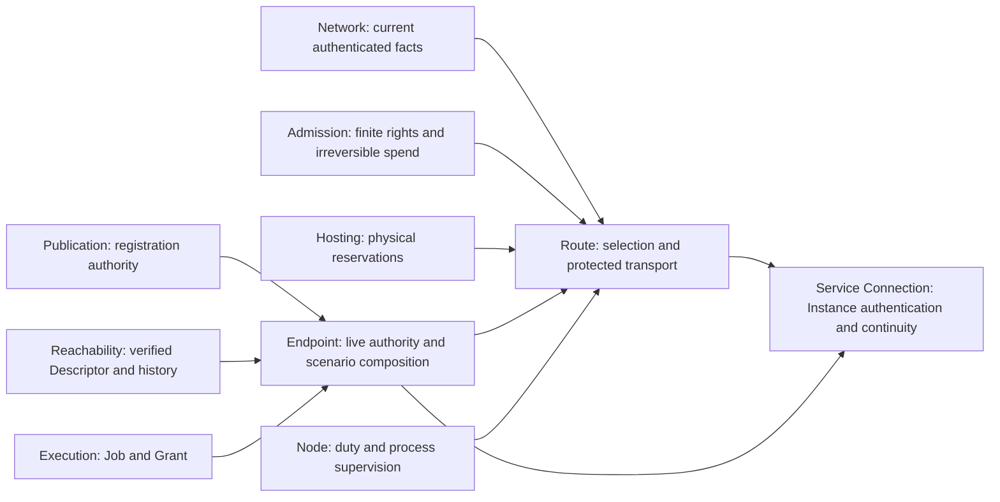

# Route domain boundaries and owners

Status: **source inventory and boundary proposal**, 2026-10-04. The Product
Owner requested preparation of Route after the Network migration, including
documentation corrections, and then proposed isolation from the old runtime.
The [Route migration contract](route-migration-contract.md) now makes isolation
from old runtime mandatory; the remaining domain model and policy choices are
proposals. New Route connects only to new domains and new command composition.
This document selects no implementation issue,
creates no package, and changes no accepted wire, persistence or product rule.
The [package map](package-map.md) remains the current import registry; the
[DDD transition design](ddd-transition-design.md) owns the wider proposal.

The original inventory checkout was `dev` at
`b989b39da389ece7414a27aec334340e1c040c20`, with pre-existing staged, modified
and untracked work. At that inspection, Network adapters were moving under
`internal/successor/network`; a source location alone did not establish
completed integration. Source links below preserve that inventory provenance.
Subsequent new Network, retained Route prefix and Introduction registration results are recorded in the
[maintained domain map](domain-map.md) and
[implemented prefix owner](../technical/successor-route-prefix.md) and
[registration owner](../technical/successor-route-introduction.md).
The bounded prefix result at `69406f7c896aa45321b5556f2b63d0c99f2dba44`
alone does not implement Introduction or JOIN. Registration is implemented at
`ca0767ebaa02513166d6bcb14cd55836a45ae661`; opaque delivery, JOIN and
forwarding-parent refill transport remain distinct obligations under the
[remaining behavior design](route-delivery-join-boundary.md). Admission's refill
component does not establish the missing Route ADMIT/ACCEPT exchange.
The earlier [Route extraction record](route-refactoring-boundary.md) keeps its
named baseline and is not the current owner map.

## Current contract and modeling scope

Read the [product scope](../product/scope.md),
[threat model](../security/threat-model.md),
[protected forwarding protocol](../technical/protected-route-protocol.md),
[State and Node owner](../technical/network-route-node.md),
[private admission](../technical/private-admission.md), and
[successor Network State](../technical/successor-network-state.md).
[Execution](agent-execution.md), [documentation](documentation.md), and
[testing](testing.md) own the handoff and verification rules. Accepted ADRs
linked by those owners take precedence over source behavior.

This is brownfield Go in one root module, with Endpoint and Node process
composition and separate installation, context and receiving-duty roots.
The current routing composition contains behavior-rich state machines:
admission-gated bounded forwarding children, registration slots and JOIN
pairing. Admission remains the exclusive owner of irreversible spend; calling
its gate does not move that policy into Route. The routing problem
is distributed ownership across Route, Entry, Endpoint and Node. Protected
routing is a core domain worth explicit consistency boundaries; Carrier and
byte codecs remain technical mechanisms. The proposed migration uses DDD for
rules and ownership, without adding processes, an event bus or a repository
interface for every in-memory object.

## Domain boundary

Route answers: **which protected path and role channel may this operation use,
under the current public Network facts, and how does that transport terminate?**
It owns role-purpose eligibility, Entry/Interior selections, exclusions and
retention, protected prefix establishment, child lanes, forwarding, receiving
Introduction transport and data JOIN. It enforces the existing deadlines,
credit, queue and role-local resource rules. It returns bounded transport and
role-operation outcomes. A joined Route transport does not authenticate a
Service Instance or authorize Application Data by itself.

The Route code domain includes rules executed at different principals. It does
not imply a global route object: an Endpoint selects its own leg; a forwarding
Node owns only its current duty, parent and children; a JOIN receiver knows its
two local sides. The five-position data path is an architectural description,
not an object passed to each Node.

| Neighbor | Rule and state outside Route | Route's responsibility at the seam |
|---|---|---|
| Network | Epoch/profile acceptance, signature verification, membership, currentness, exact assignment and participation | Consume authenticated current views and recheck the same selected facts before effects; never turn a cached view into permanent authority |
| Admission | Permission allocation, issuer quota, token grammar/verification, pending batches, stock, presentation journal, irreversible spend | Carry the confidential operation, bind HELLO/exporter to the receiver, transfer an admitted channel once and enforce the allowance returned by Admission |
| Hosting | Provider-period budget, durable work/termination reservations and release policy | Hold the supplied reservation through physical termination and joined cleanup; role queue/credit limits cannot enlarge the provider budget |
| Local execution | Grant, live Job, principal, confinement and worker lifetime | Accept the caller's bounded lifetime and cancellation; create no Grant or Job |
| Service Publication | Instance Credential, registration pair/revision, readiness, refresh and withdrawal authority | Establish the registration channel, carry REGISTER/WITHDRAW, and deliver opaque capsules to its exact receiving slot |
| Reachability | Descriptor verification, publication authority, Store conflict floors and private local history | Carry bounded proof bytes and requests; decoding a terminal body grants no Descriptor authority |
| Service Connection | Exact Instance TLS authentication, immutable destination, logical byte state, continuity, recovery policy and terminal Service outcome | Provide a fresh protected Attachment transport for a permitted attempt; choose no new Target, operation or logical recovery policy |
| Custody and software acceptance | Purpose-specific authority keys, Release authorization, enrollment pin and installation transition | Borrow only the already authorized public/runtime inputs required by a Route operation |

Information boundaries remain those of the threat model. Route protects private
operation bytes from intermediate forwarding roles under the selected inner
TLS composition; the intended recipient receives its operation. This source
inventory measures no traffic-analysis resistance or anonymity. Tests and
diagnostics must not create a path-wide identifier or log Target, join secret,
permission, capsule plaintext or private selection history.

## Required isolation boundary

The [migration contract](route-migration-contract.md) owns the mandatory rules,
resume checklist and acceptance checks. This analysis supplies the source map
and rationale; it cannot grant an exception to that contract.

The new Route must not connect to the existing `internal/route`, `internal/entry`,
`internal/endpoint`, `internal/node`, `internal/admission`, `internal/hosting`
or `internal/service` implementations. Those packages must not call the new
Route either. This applies to production and tests, transitive dependencies,
delegating wrappers, callbacks that execute old policy, and shared live state.
No Route exception is granted by the existing Network-specific import registry.

The candidate source destination is `internal/successor/route`, with a real
caller in `cmd/ardents-next`. Its model owns Route rules; its application
coordinates narrow contracts from new Network, Admission and Hosting; its
physical and durable adapters own actual I/O. The model need not import every
neighbor merely because the application uses it. Standard-library and reviewed
third-party mechanisms remain possible under exact package/dependency
acceptance, including a specifically registered QUIC adapter; the isolation
choice does not authorize a new dependency exception by itself.

The current source is evidence and reusable implementation material. Move or
adapt a cohesive codec/Carrier/storage mechanism into the new owner with its
tests and independently checked byte oracles if it fits the selected contract.
Do not import the old package as a shortcut, copy its distributed policy
unchanged, or recreate an entire old Endpoint/Node inside Route. Source reuse
must preserve exact bytes and refusal rules while placing decisions with the
new owners.

Entry persistence and Introduction anti-reclaim floors need Route-owned
adapters in the new tree. In particular, successor Admission deliberately
excludes Introduction slots; borrowing `admission/spending.IntroductionSlots`
would violate both ownership and isolation. New slot history must coordinate
durable claim-before-ACK and root retention with the new Admission receiving
use case, without accessing old spend roots. The current common-root mechanism
is a compatibility and failure-ordering input, not a requirement to share a
live old lease.

Until new Publication, Reachability, Connection and execution consumers exist,
their complete scenarios remain unavailable. Do not fill those gaps with an
old Service adapter or a successful test callback. Route can still have genuine
command consumers and actual Carrier, admission, forwarding, Introduction
delivery and JOIN evidence within its own boundary. Such component evidence
does not establish Service readiness or a complete User journey.

The old runtime remains separate. Replacing an installed generation, importing
durable floors, or retiring the old implementation requires its own explicit
compatibility and acceptance work. Independent development roots cannot be
used to bypass existing security floors during adoption.

## Source inventory

The inspected `internal/route` and `internal/entry` trees contain 167 Go files:
87 non-test files and 80 test files. Counts include `doc.go` and any non-test
support source; they measure source organization, not production reachability.

| Current package | Non-test Go files | Test files | Responsibility |
|---|---:|---:|---|
| `internal/entry` | 9 | 3 | Exclusive durable installation Entry Sets and time floors |
| `internal/route` | 21 | 29 | Receiving channels, limits, forwarding/outer bridge, bootstrap and JOIN |
| `internal/route/ardp` | 3 | 1 | Frame header, HELLO, kinds and byte bounds |
| `internal/route/capsule` | 6 | 1 | Fixed Introduction envelope, plaintext and selected HPKE transcript |
| `internal/route/carrier` | 14 | 15 | Physical TCP/TLS and QUIC, exact peer authentication, pool and retirement |
| `internal/route/client` | 25 | 27 | Linux outgoing prefix, lanes, bootstrap and terminal exchanges |
| `internal/route/terminal` | 9 | 4 | Fixed issuance, Descriptor, registration and JOIN body codecs |

Route responsibilities additionally live in Endpoint and Node. The following
map names current owning source and real consumers; the proposed destination
is semantic ownership, not an already approved package move.

## Owner map

| Responsibility | Current owning source | Current consumer/composer | Proposed ownership and boundary |
|---|---|---|---|
| Installation Entry Sets | [entry/closed_sets.go](../../internal/entry/closed_sets.go), [durable store](../../internal/entry/closed_set_store.go) and root/lease files | Endpoint source selection | Route selection with an installation-scoped durable adapter; all three adjacent-domain sets share the existing exclusive root |
| Interior Set and retained leg | [endpoint/interior_set.go](../../internal/endpoint/interior_set.go) | Source and Publisher role opening | Route selection policy; Endpoint supplies context/role lifetime and retains composition locking |
| Current bootstrap plan | [client/closed_bootstrap_plan.go](../../internal/route/client/closed_bootstrap_plan.go) | Outgoing bootstrap and prefix opening | Route; consume Network's current view without owning its verification or durable floors |
| Terminal and Rendezvous recipient | [client/closed_terminal_recipient.go](../../internal/route/client/closed_terminal_recipient.go) | Resolution, Introduction/submission and data JOIN | Route selection; singleton refusal and exclusions are current behavior, general selection is a contract gap below |
| Source opening and exact acquisitions | [endpoint/source/lifecycle.go](../../internal/endpoint/source/lifecycle.go), [source_prefix.go](../../internal/endpoint/source_prefix.go), [source_operations.go](../../internal/endpoint/source_operations.go) | Source operation and JOIN composition | Route owns transport state and acquisition validity; Endpoint still coordinates live authority and Admission stock under its shared lock |
| Publisher Introduction/Responder prefix | [endpoint/role_prefix_lifecycle.go](../../internal/endpoint/role_prefix_lifecycle.go) | Publication and Publisher JOIN | Route owns each role's opening/live/retirement state; Publication decides whether registration remains authorized |
| Outgoing protected prefix and lanes | [client/closed_source_prefix.go](../../internal/route/client/closed_source_prefix.go), [lane owner](../../internal/route/client/closed_source_lane.go) and neighboring lane/queue files | Endpoint source, role prefixes and qualification Session | Route outgoing transport; preserve ownership transfer, actual-work idle timer, credit and joined cancellation |
| Carrier pool, listener and TLS | [carrier/closed_carrier_pool.go](../../internal/route/carrier/closed_carrier_pool.go), [shared listener](../../internal/route/carrier/closed_shared_carrier.go) | Route client and all receiving Node roles | Route technical adapter; literal endpoints, exact current keys, one selected Carrier and retained close result |
| Wire, terminal bodies and capsule | [ardp/frame.go](../../internal/route/ardp/frame.go), [terminal/doc.go](../../internal/route/terminal/doc.go), [capsule/doc.go](../../internal/route/capsule/doc.go) | Route, Endpoint and receiving Node roles | Route protocol mechanisms; codec validity grants no Admission, Publication or Connection authority |
| Role-purpose matrix and receiving limits | [closed_purpose_assignment.go](../../internal/route/closed_purpose_assignment.go), [closed_duty_limits.go](../../internal/route/closed_duty_limits.go) | Client selection, Node authority and receiving channels | Route rules; Network supplies exact assignments, Hosting supplies stricter physical budget |
| Initial channel admission adapter | [closed_admission_channel.go](../../internal/route/closed_admission_channel.go) | Forwarding, Introduction, JOIN, issuer and resolution receivers | Route frames/channel claim; [receiving.Redeem](../../internal/admission/receiving) retains verification, reservation/spend ordering and non-refund |
| Target-free bootstrap | [closed_bootstrap.go](../../internal/route/closed_bootstrap.go), [client exchange](../../internal/route/client/closed_bootstrap_exchange.go) | Forwarding receiver and outgoing issuer bootstrap | Route restricted transport; Admission owns issuance, and bootstrap cannot become arbitrary private work |
| Forwarding parent and children | [closed_forwarding_channel.go](../../internal/route/closed_forwarding_channel.go), budget/reverse files; [node/forwarding](../../internal/node/forwarding) | Node root starts and supervises the duty | Route receiving role, including sessions, pool and child links; Node retains process supervision and current-duty withdrawal reaction |
| Outer physical Carrier and inner channels | [closed_outer_bridge.go](../../internal/route/closed_outer_bridge.go), [outer handshake](../../internal/route/closed_outer_handshake.go), [node/outer/writer.go](../../internal/node/outer/writer.go), [outer lifetime](../../internal/node/outer/lifetime.go) | Forwarding, Introduction, JOIN, issuer and resolution roles | Route receiving transport adapter; outer Node authentication does not replace inner Endpoint admission |
| Receiving Introduction registry and delivery | [node/introduction/registration.go](../../internal/node/introduction/registration.go), [delivery.go](../../internal/node/introduction/delivery.go), [listener.go](../../internal/node/introduction/listener.go) | Node duty composition; Publisher registration transport | Route receiving role owns channel slots, pending deliveries, local nonces, rate and termination; it never decrypts the capsule |
| Durable slot non-reclaim floor | [Admission spending](../../internal/admission/spending), called by the Introduction receiver | Same exclusive receiving-spend lease | Route owns new slot history and coordinates claim-before-ACK with new Admission spending; the old common lease is failure-ordering evidence, not a new runtime dependency |
| JOIN pairing and role stream | [closed_join_pairing.go](../../internal/route/closed_join_pairing.go), accept/stream/refill files; [node/join](../../internal/node/join) | Node duty composition; Source and Responder clients | Route receiving role; match opposite sides, require both RESULT writes, transfer each admitted claim once and join both sides before root release |
| State-to-channel projection | [node/authority/receiver.go](../../internal/node/authority/receiver.go), [peer.go](../../internal/node/authority/peer.go) | All receiving roles | Keep Network current membership distinct from Route purpose/transition rules; Node composes the narrow projection |
| Issuer and resolution listeners | [node/issuer](../../internal/node/issuer), [node/resolution](../../internal/node/resolution) | Node command/supervision | Extract only shared Route transport; issuance stays Admission and Descriptor Store stays Reachability. Do not move whole packages into Route |
| Publisher registration and capsule acceptance | [endpoint/introduction](../../internal/endpoint/introduction), [introduction_accept.go](../../internal/endpoint/introduction_accept.go), [introduction_prepare.go](../../internal/endpoint/introduction_prepare.go) | Endpoint Publication, Job and Service binding | Mixed ownership: registration authority/pair is Publication; recovery slots and exact Instance binding are Connection; Route owns only transport selection and delivery |
| JOIN-to-Service handoff and retirement | [endpoint/join_service.go](../../internal/endpoint/join_service.go), [duty_context_retirement.go](../../internal/endpoint/duty_context_retirement.go) | Endpoint Service opening/recovery and context revocation | Endpoint composes Route, Execution, Publication and Connection. Preserve stop-all-before-join and the existing authority rechecks |

Current sources and consumers in this table are evidence, not integration
destinations. Proposed owners refer to new domain implementations. Where a
row names an old shared lease or Endpoint lock, preserve its invariant through
an explicit new ordering mechanism; do not connect the old object to new Route.

The diagram shows operation/evidence relationships, not permitted Go imports
or an event bus. Endpoint, Node and Service neighbors represent future new
composition owners, not permission to import current runtime packages.
Its editable [PlantUML companion](route-domain-boundary-analysis.puml)
contains the same boundary map.

## Consistency and lifecycle owners

There is no single Route aggregate spanning Endpoints and Nodes. Candidate
consistency owners are these existing lifetimes:

| Owner | Atomic rule and retained state | Lifetime |
|---|---|---|
| Installation Entry Sets | Commit both ordered alternatives before exposure; preserve exclusive lease, assignments and monotonic time floor | Six hours or earlier assignment expiry; independent of a physical prefix |
| Local leg selection | Retain Entry/Interior identities and exclusions; freeze selection during exact pending Admission work | Interior at most 30 minutes or duty expiry; context/Service role owns retirement |
| Outgoing prefix | One permitted leg, accepted transport, lanes, queue credit and one terminal cleanup result | Caller/authority bounds and 120 seconds after actual work; no idle refill |
| Receiving duty governor | Aggregate channels, children, queues and bootstrap counters; new Admission retains its verification gate | Exact Network/profile/Node/duty generation; not a provider-period Hosting ledger |
| Forwarding parent | Original admission claim, remaining allowance, children and bounded refill | Original immutable deadline; children spend the same parent allowance |
| Introduction registry | Live channel-owned slots, pending deliveries and durable anti-reclaim floors | Admission/slot expiry; restart restores floors, never a live registration |
| JOIN registry and pair | Local secret-indexed matching, two opposite admitted claims, acknowledgements and joined termination | Bounded setup; data sides retain their original admitted terminal bounds |

These are ownership boundaries, not a requirement to expose seven new packages
or seven repositories. Carrier pools and codec values are technical objects.
Introduction and JOIN remain different role state machines even where they
share physical transport mechanisms.

Key existing bounds must retain their separate owners:

| Bound | Owner and interpretation |
|---|---|
| Control: 64 KiB, 30 seconds; Forward: 32 MiB, 1,800 seconds | Admission class policy; Route accounts ingress plus egress and applies earlier caller/authority deadlines |
| Registration: 1 MiB and 600 seconds | New Admission enforces the selected policy at `fd8f01971`; preserved predecessor 8 MiB is not an accepted amendment |
| 256 concurrent forwarding work lanes plus two control lanes | One Route parent; children cannot acquire independent parent allowance |
| 1,024 duty channels, 1,024 duty children, 64 MiB queued ciphertext | Shared Route duty governor; allocate on demand, with 16 KiB channel control reservation inside the aggregate ceiling |
| 128 signature verifications/s and four concurrent checks per duty | Current Route source enforces this restriction; new Admission owns `receiving.VerificationGate`, while Route owns transport/role counters |
| 16 pending Introduction deliveries, four starts/s | Route registration receiver; submission admission cannot enlarge the registration allowance |
| 32 directed Carrier-pool pairs and 120-second actual-work idle retention | Route physical pool; exact pair/profile identity, no speculative fallback dial |

The old Endpoint context lock currently serializes live authority, Admission
stock, selection, opening reservations and publication/recovery state. The new
composition must preserve start/revoke linearization without borrowing that
lock. Define a synchronous operation lifetime and generation before effects;
completion must recheck the same still-live owner. Stop dependent work before
joining it outside the ordering gate. Eventually delivered events cannot
replace revocation. An incomplete join retains the owner root and its failure;
a token is never refunded after spend. Future full Endpoint composition needs
its own race evidence for these cross-domain invariants.

## Proposed internal organization and integration seams

Keep one Route domain with selection rules, outgoing operations, receiving
role lifetimes, protocol codecs and physical Carrier adapters. Existing
`ardp`, `capsule`, `carrier`, `terminal` and `client` demonstrate cohesive
responsibilities to assess for source reuse; new Route must not import them or
add delegating wrappers around them.
Installation selection and Endpoint Interior policy should gain one declared
Route owner. Receiving forwarding, Introduction and JOIN should be readable as
separate responsibilities inside that domain. Their final package paths and
exports require an implemented slice with `doc.go`, behavior tests, real
callers and exact package-map imports; this proposal registers none.

| Seam | Input and use-time check | Observable result and ownership |
|---|---|---|
| Network to selection/dial | Coherent current profile/member view; exact Node/key/family/record digest/duty/Carrier; reobserve before dial and acceptance | Same selected peer or refusal; Route cannot activate State or discover fallback peers |
| Admission to channel | Token presentation is durably marked before bytes; receiving validation and Hosting reservation precede spend; recheck deadline after durable I/O | One transferable admitted claim; Route owns physical termination, Admission retains the irreversible debit |
| Hosting to receiving role | Finite work and termination reservation for the supplied envelope | Keep reservation through producers/readers/children joining; repeat close returns the retained result |
| Endpoint to prefix | Live operation/Job and exact selection; complete opening rechecks the same reservation and authority generation | Exact acquisition to the live handle; stale generation cannot use or close a replacement |
| Publication to registration | Authorized pair/revision and private Instance recipient; original expiry | ACK/withdrawal/retirement transport outcome; Publication alone decides readiness and refresh |
| Reachability to terminal transport | Bounded request/proof encoding, then actual Store/Endpoint verification | Verified Descriptor is returned by Reachability, never by a Route decoder |
| Connection to JOIN transport | Already authorized immutable Attachment attempt and its original bounds | Protected joined transport, followed by exact Service TLS/continuity checks in Connection |

The old `route/client` currently imports the moving successor Network State
adapter through its registered migration seam. This does not make that client
an allowed consumer or dependency of new Route. New composition consumes the
new Network application's verified observations, new Admission's
receiving/stock/spending owners and new Hosting reservations directly through
their exact reviewed contracts. An offline example alone does not qualify a
live Route consumer; the new command scenario must exercise the real owners
and physical transport without an old-runtime bridge.

Preserve existing Entry root format, Domain positions, time floors, spend-root
binding, Introduction slot journal, HELLO/exporter bytes, OPEN restrictions,
profile identities and both selected Carriers. Package movement grants no
root reset, different randomness, quota increase, retry expansion or accepting
legacy fallback. Actual API/import choices must remain acyclic and be recorded
in the package map with the owning implementation change.

## Contract and implementation gaps

1. **Forwarding Domain table: corrected in the current owner.** The protected
   protocol's profile section already assigns adjacent/interior duties only
   to Initiator=1, Responder=3 and Introduction=4. Its purpose table incorrectly
   included Rendezvous and omitted Introduction. The table now agrees with
   that contract and `ClosedPurposePermitsDuty`; no byte or code behavior changed.

2. **Class-3 allowance: repaired in the new Admission owner.** The private
   Admission table selects 1 MiB. Commit `fd8f01971e5ee2c3b35fed51e0172cc605f01719`
   restores that maximum in new Admission with genuine signed-Network receiving,
   Hosting, compiled-command and durable no-refund evidence. The unchanged
   600-second lifetime and earlier bounds remain Admission policy; Route must
   consume the returned allowance rather than enforce a second numeric quota.
   The preserved predecessor still uses 8 MiB and is not integrated or rewritten
   by this isolated change. The earlier 8 MiB suggestion below remains workload
   analysis, not an accepted amendment or the new implementation direction.

3. **Rendezvous selection: selected behavior exceeds the inspected client.**
   The protected protocol requires uniform choice among eligible data-join
   duties, retained within a context, with at most one preselected alternative.
   `closedTerminalPeer` refuses a second matching duty before establishing
   uniqueness and exclusions. `TestClosedSourceResolutionRequiresUniqueCurrentStateRecipient`
   pins that singleton behavior. Uniformity is trivial with one candidate,
   but the code implements no general multi-candidate selection or alternative
   retention. Keep the accepted contract; describe this as an implementation
   limitation. A future owning slice should either implement the selected
   context-local policy or explicitly obtain a narrower contract, with no
   failure-driven resampling.

4. **Interior selection scope needs a declared interpretation.**
   `chooseInteriorSet` derives an ordered pair from SHA-256 of the Role Domain
   and the retained Entry pair, modulo the eligible pair count. Contexts with
   the same inputs derive the same pair; state is then retained per local
   owner. The contract says an Interior Set is owned per context or Service
   role, but does not explicitly require an independent random draw. This is
   an observed correlation property, not a demonstrated contract violation or
   anonymity result. Record the intended independence/restart behavior in
   the Route owner before changing the algorithm.

5. **Source and build descriptions: corrected without rewriting historical
   evidence.** The protected owner now references the current Go 1.27.2
   selection and separates Carrier family from exact-version dependency
   acceptance. The earlier extraction record marks its old graph as a baseline,
   removes current dependence on the absent `route/credential`, describes
   Admission ownership, and records terminal's stdlib-only production imports
   with its test-only Reachability size oracle. Historical ADRs and exact-version
   test receipts retain their actual versions.

## Recommended resolution

The following is the engineering recommendation after checking the current
byte accounting and retained workload. It is a proposal, not an accepted
contract amendment or an implementation result.

**Registration: keep the selected 1 MiB; do not promise the predecessor's
256-Connection workload per slot.** The original suggestion to consider 8 MiB
did not amend the Admission contract. The new owner has restored 1 MiB; the
accounting below describes a workload limit and any future policy investigation,
not permission to enlarge it. [Delivery accounting](../../internal/node/introduction/delivery.go)
reserves `16 + 4096 + 16 + 16384 + 16 + 1 = 20,529` bytes per dispatched
capsule. The [registration owner](../../internal/node/introduction/registration.go)
also accounts the REGISTER exchange and reserves withdrawal before deliveries.
Ignoring initial HELLO/admission bytes, 1 MiB therefore permits at most 49
deliveries; actual initial overhead can only reduce that bound. A series of
256 deliveries alone reserves 5,255,424 bytes, approximately 5.01 MiB. The
[retained Publisher scenario](../../internal/qualification/streams_linux.go)
expects 256 streams, and the Admission owner names that workload. Even dividing
256 openings equally between two registrations requires more than 1 MiB per
registration. This is static accounting, not measured network capacity or
evidence that every scenario uses one slot.

Keep 1 MiB/600 seconds, four starts/s, 16 pending deliveries and all Hosting/duty
limits. These are maxima, not sustained-throughput promises or preallocated
memory. Failed dispatched work also consumes reserved bytes. Route needs
quota-exhaustion and withdrawal-reserve evidence on both Carriers under the
selected allowance. A larger workload would require an explicit Admission-owned
policy amendment and corresponding evidence; neither source reuse nor the
earlier static estimate accepts that change.

**Rendezvous: retain the accepted general selection contract.** Filter current
data-join duties against all known Node/key/family conflicts before selection.
Choose the initial eligible recipient uniformly with a CSPRNG and retain at
most one permitted alternative at the same time, scoped to the local context
and existing expiry. One eligible candidate is valid; zero is a refusal. More
than one eligible candidate should not itself be an ambiguity refusal. An
alternative attempt must retain all currentness, Admission, Hosting and
original operation/recovery bounds; failure cannot draw another candidate.
Retain only public recipient selection, with fresh join material and terminal
channels for fresh Connections. This implements the selected construction
rather than narrowing it to today's singleton fixture.

**Interior Set: select independently per local context or Service role.** Keep
the long-lived installation Entry Set as the existing anchor. For each new
Interior owner, choose an eligible ordered pair with a CSPRNG, retain it for at
most 30 minutes or earlier duty expiry, and never redraw because of a failed
dial or pending issuance. Preserve the exact family/key/Node exclusions and
shared-lock coordination. Independent selection does not mean forcing different
Nodes for every context: draws may legitimately coincide in a finite pool.
Remove the deterministic derivation from the Entry pair only in an explicitly
owned change after this interpretation is accepted in the Route contract.
Already admitted work keeps its original lifetime; a lost local context is
not resurrected through a remembered physical path.

This resolves policy direction while keeping the domain extraction separate
from behavior changes. The implementation scope should name each policy change
it actually includes; a package relocation is not evidence for these outcomes.

## Preparation for the first implementation slice

Proposed first boundary: **new retained leg selection through a genuine admitted
protected prefix and joined cancellation**. Establish Entry/Interior ownership
and the required Route-owned durable adapter in the new tree, then connect a
real `ardents-next` consumer and new receiving Route role. Use new Admission
stock/presentation/spending, current new Network observations and new Hosting
reservations. Exercise real TCP/TLS and QUIC, refusal and operation revocation.
The consumer must perform actual domain work, not only inspect a plan or call
a test fixture. Do not connect the old Endpoint, prefix, Node listener or
Introduction implementation. A specific terminal operation enters this slice
only when its required new owners exist; a missing Service domain is not an
excuse for fake ACK or old-runtime compatibility glue.

Before beginning that slice, refresh the owner map after verifying the new
Network handoff,
select its C0 issue under the WIP policy, and decide whether any contract gap
above is in scope. The observable acceptance boundary is the exact retained
selection, real protected operation, refusal on stale authority, and complete
joined cleanup on both TCP/TLS and QUIC. Success is not Service readiness or
whole installed-journey qualification.

### Concrete objective for Product Owner selection

Implement one new operation that retains its Entry/Interior selection, opens
the genuine admitted protected prefix to new receiving Route owners, and
terminates it with joined physical cleanup. A real `ardents-next` command must
drive this operation using independently opened new Network, Admission and
Hosting roots. Its successful result is an accepted bounded protected channel;
it is not a Service publication, Descriptor ACK or authenticated Service
Connection. No issue is selected by this proposal.

Use the completed Network observation contract, rather than recreating its
earlier Node/Route wrappers: `state.CurrentRuntime`, copied `Profile`/members,
unambiguous `MemberByKey`, and `RuntimeView.RetainDuty` from the same observation.
Obtain fresh observations and use `MatchDuty` at the required effect and
post-commit boundaries. A diagnostic Snapshot, profile receipt or retained
observation cannot authorize later work. Signed profile cohorts keep their
original bounds; a successor cannot rebind the operation.

Admission Stock owns durable presentation before transport. Its genuine
receiving owner owns verification, spend and bounded Grant transfer. Hosting
owns the actual work/termination reservation. New Route owns role/Purpose
checks, retained selection, actual peer/channel authentication, prefix/lane
state and cancel/join before releasing the transferred reservation. Callback
composition must not introduce a reverse lock dependency or a second authority,
quota or budget policy.

Acceptance for this one boundary requires:

- a compiled non-test consumer and actual new receiving role, with real
  TCP/TLS and QUIC operation and accepted canonical bytes independently checked;
- retained selection and floors surviving reopen, with no extra sample,
  implicit fallback, successor rebinding or deadline renewal;
- causal refusals for wrong peer/key/family/duty/Purpose, stale or conflicting
  State, clock-confidence loss and expiry before and during physical/durable I/O;
- genuine token presentation and reservation-before-spend ordering, retained
  burn after post-spend refusal, and exactly-once successful transfer;
- cancellation/revocation, queued writes, late completion and shared-lane
  failures with readers/writers/children joined before release; reopen and
  uncertain writes cannot restore consumed authority or erase floors;
- final source-matched new-domain regression and race evidence for Network,
  Admission, Hosting and Route, exact import/behavioral isolation, registered
  profiles, `make quick-check`, and `make check` before repository integration.

Before preparing the implementation checkout or delegating, obtain the scoped
Network commit and verification of its exact contents. The Network handoff's
dirty base HEAD alone does not identify or carry its uncommitted implementation.
The Product Owner corrected the ordering: do not create an earlier-base worktree
and copy uncommitted predecessor code into it. Use the verified committed
revision, with the required registry, instruction and guard files present.
Do not copy the earlier unfinished old-consumer delta as a dependency. Verify
the source identity recorded in the [domain map](domain-map.md), selected issue,
C0 milestone and WIP; one implementer owns the bounded result and corrections.

Introduction registration, Resolution Store, JOIN-to-Service handoff,
Publication, Connection, execution and installation remain later boundaries.
Their absence cannot be replaced by successful fixtures or old consumers.
The quota and selection recommendations above remain unaccepted; this first
operation must not depend on adopting them without a Product Owner decision.

The existing tests below are sources of behavioral oracles, not permitted
imports or first consumers of new Route. Port and independently check the
relevant tests in the new tree and new command profile. Keep predecessor tests
separate; their results do not qualify the successor.

| Verification concern | Existing oracle/owner to retain | Acceptance evidence for a migration |
|---|---|---|
| Entry persistence and selection | `entry/closed_sets_test.go`, `closed_adjacent_domains_test.go`, Endpoint Interior tests | Same retained pair across restart, no third sample, conflict/expiry/time regression refuse |
| Network freshness and exact recipient | Client bootstrap/recipient tests, Node authority and forwarding recipient tests | Same Node/key/family/digest/duty and selected Carrier at effect boundaries; stale views refuse before effects |
| Spend and Hosting ordering | Admission receiving tests; Route admission-claim and Node receiving-root tests | Reservation before spend, exactly-once claim transfer, no post-spend refund, cleanup failure retained |
| Parallel lanes and physical failure | Client credit/cancel/close tests; `node/outer/queued_write_test.go`; forwarding parent-progress tests | Queued cancellation preserves siblings; partial physical frame poisons the Carrier; every reader/writer/child joins |
| Registration | Node Introduction registration/delivery/drain tests and Endpoint ACK/refresh tests | Channel-owned slots, restart non-reclaim floor, bounded pending/rate/bytes and withdrawal; no fake readiness |
| JOIN and Service handoff | Root pair/stream tests; Node JOIN lifecycle; Endpoint JOIN/Service tests | Opposite-side match, both RESULT writes before data, original bounds, protected transport then genuine Instance authentication |
| Package move and process integration | Package-map/architecture checks and checked testing profiles | Real non-test callers, Linux/Windows compilation as applicable, relevant race and actual TCP/TLS+QUIC paths; quick-check while coding and full check before integration |

## Inspection limits

This preparation reads code, tests and current owners; it does not rerun product
tests, validate an installed candidate or perform an independent security audit.
The source inventory uses a per-file SHA-256 manifest outside the repository
to detect concurrent changes while preparing the document. Moving work must
be rechecked at the selected implementation baseline. Documentation validation
covers local links, headings, whitespace and the scoped diff; it grants no
additional runtime readiness claim.
