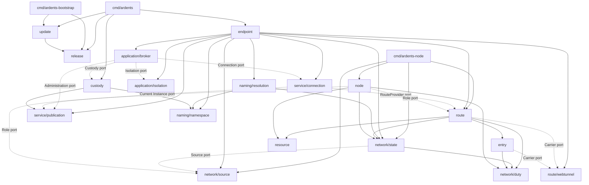

# Stage 8 productization design workbook

Status: **transitional Stage 8 design input; preparation started 2026-08-21 and
Stage 8 execution started 2026-08-22.** Stage 7 was stopped on 2026-08-22. This
document did not itself start Stage 8, change engineering policy, or authorize
production refactoring; that authority now comes from the Stage 8 brief and
start record. An accepted working-group result remains transitional until it is
promoted into the applicable active architecture or engineering document.

Owners: Product Owner and Codex.

Authority: accepted ADRs, the Product Core, threat model, R-058, and the Stage 8
brief remain authoritative. A statement in this workbook becomes binding only
after the Product Owner accepts it and the same change promotes it into its one
canonical active document or executable gate.

Disposition: delete this workbook after every accepted result has been promoted
and every rejected or superseded option is recoverable from Git history. It must
not become another permanent planning archive.

## Purpose

Prepare the questions, alternatives, evidence methods, and promotion paths needed
to redesign Ardents as one maintained product after the stopped Stage 7.
Preparation reduces Stage 8 discovery cost without treating the retained Stage
7 tree as the target or its earlier moving-worktree measurements as the final
baseline.

The preparation concerns the complete maintained shape:

- product behavior that must survive and behavior that may be removed;
- Module responsibilities, Interfaces, seams, Adapters, packages, commands, and
  dependency direction;
- code, file, error, concurrency, resource, and review rules;
- test surfaces, execution profiles, duplicate-test removal, and Qualification;
- refactoring order, migration, rollback, compatibility, and source freeze; and
- active technical and operational documentation after Implementation settles.

## Fixed preparation constraints

- Stage 7 is stopped; its retained code and documents are inputs, not a mandate
  to complete its remaining slices.
- Go, one root module, and the first-party monorepository remain accepted inputs.
- Existing packages, files, Interfaces, tests, and documents are evidence, not
  presumptively correct targets.
- Product behavior, security/privacy claims, trust separation, fail-closed
  behavior, and resource contracts cannot change silently inside refactoring.
- Internal Implementation, package layout, unexported data, internal Interfaces,
  and test organization may be replaced after Stage 8 authorizes the change.
- Persistent, wire, configuration, command, and evidence formats require an
  explicit compatibility, migration, or deliberate-breaking disposition.
- Generated inventories, call graphs, reports, run logs, and captures stay
  outside the repository. This workbook records only their identity and finding.
- A working group below is a decision area, not a new stage, team, brief,
  checklist, evidence protocol, or permanent document.

## Preparation iteration

The work is ordered by decision dependency, not by current directory. Groups
may be explored together, but later decisions cannot be accepted before their
inputs are stable.

### G0 — Preservation and change envelope

Status: **accepted by the Product Owner as the Stage 8 preservation planning
input on 2026-08-21.** S8.0 revalidates it against the clean Stage 7 identity;
S8.1 supplies the final product and per-surface disposition before migration.

Decide how every relevant contract is classified before proposing a target
architecture.

Required classifications:

1. **Preserve:** externally observable product/security behavior that remains
   normative through restructuring.
2. **Migrate:** a retained contract whose representation or invocation may
   change only through a bounded compatibility and rollback plan.
3. **Replace freely:** internal Implementation shape with no retained external
   observer.
4. **Remove:** behavior or machinery excluded by the accepted product
   disposition.
5. **Decide first:** a consequential product/security change requiring normal
   research or ADR authority before restructuring.

Questions include CLI and process behavior, persistence and wire formats,
configuration, evidence semantics, supported hosts, upgrade state, errors,
resource limits, cleanup, and every security or privacy limitation.

Output: a provisional preservation matrix and a recipe for validating it against
the clean Stage 8-entry source. The final matrix is accepted only after S8.1.

#### G0 working draft — classification rules

This first pass classifies contract families, not current files. It is deliberately
coarser than the final matrix. Split a row when two parts have different observers,
authority, compatibility duties, or refactoring dispositions.

Each final row records:

- a stable contract ID and one observable statement;
- authority and the exact Product Owner disposition that can change it;
- observer or adversary able to distinguish a change;
- current commands, Modules, stored/wire/configuration forms, and non-test callers;
- current behavior, negative, migration, and Qualification coverage;
- class, compatibility period, rollback rule, and removal precondition; and
- promotion destination in the final technical or operational documentation.

Interpretation rules:

- current accepted behavior defaults to **Preserve** until S8.1 narrows,
  redesigns, or stops the applicable product claim;
- **Migrate** permits a representation or invocation change, not semantic loss;
- **Replace freely** still requires S8.0 to prove that no retained observer,
  persistent state, wire peer, operator, Application, verifier, or test contract
  crosses the seam;
- **Remove** is provisional until the product disposition and caller inventory
  prove that no retained responsibility depends on it; and
- **Decide first** means an ADR, research decision, or Product Owner product
  disposition must precede the change. It is not a synonym for “keep.”

#### Product and Interface contracts

| ID | Contract family | Observer | Provisional class | Refactoring consequence |
|---|---|---|---|---|
| G0-P01 | Exact-target Service Connection: authenticated current Instance, confidential/integrity-protected reliable ordered bidirectional bytes, explicit terminal result, no Application-operation replay | Application and both endpoints | Preserve | Internal Route, Carrier Channel, handshake, recovery, buffering, and IPC orchestration may change without weakening these semantics. |
| G0-P02 | Opaque Application Data and local Application Interface without a mandatory SDK or imported Application identity, persistence, or protocol semantics | External Application | Preserve | Commands and IPC representation may migrate; Ardents must not become an application runtime or message model. |
| G0-P03 | Connection, Service Administration, and Authority Custody remain separately authorized; lesser access never implies greater custody | Local Application, Endpoint Owner, attacker | Preserve | A target Module graph must retain this privilege lattice even if today’s commands, sockets, grants, and packages are replaced. |
| G0-P04 | Service Target is location-independent; routine migration keeps the Target with a fresh non-exported Instance Key, while compromised/lost Service Authority requires Target replacement | Application, Service host, Authority custodian | Preserve | Internal key stores and publication flows may change; same-Target migration and replacement-Target semantics may not be collapsed. |
| G0-P05 | Exact human-readable Service Names are unlisted but guessable, use authority distinct from Service Authority, resolve to a Target, and never become discovery, authorization, or a direct-network fallback | User, naming roles, Service operator | Preserve until S8.1 | Naming algorithms and Module layout may change; weakening authority separation, fail-closed resolution, or the unlisted model requires product redesign. |
| G0-P06 | Interactive Route information-flow contract and role-local knowledge separation; Application Interface and Service Connection do not expose Route topology | endpoints, ordinary Node, accepted network observers | Preserve until S8.1 | Current hop shape, algorithms, and transports are not product invariants unless a separate accepted decision fixes them. |
| G0-P07 | Stage 1–7 mechanisms, laboratory shapes, and evidence machinery are implementation/evidence inputs rather than Product Core merely because they exist | maintainer and Qualification reviewer | Decide first | S8.1 decides which mechanisms remain necessary for the retained product; sunk implementation cost grants no preservation status. |

Primary authority: [Product Core](../product/scope.md#product-core--not-a-delivery-horizon),
[product surfaces and promises](../product/vision.md#product-surfaces),
[domain language](../../CONTEXT.md), and accepted product requirements in the
[functional map](../product/functional-map.md).

#### Security, privacy, and resource contracts

| ID | Contract family | Observer/adversary | Provisional class | Refactoring consequence |
|---|---|---|---|---|
| G0-S01 | Authentication, integrity, freshness, supported-profile selection, and unavailable state fail closed without direct or weaker-profile fallback | malicious Node, Local Traffic Observer, active attacker | Preserve | Error plumbing and recovery strategy may change; detected violations cannot become retryable success or hidden downgrade. |
| G0-S02 | Service/Name root authority, runtime Instance Keys, Node identities, Local Grants, release authority, and Application Principals remain distinct and least-privileged | compromised host, malicious local Application, supply attacker | Preserve | Storage and process layout may migrate only while non-exportability, monotonic authority state, revocation, and privilege separation remain demonstrable. |
| G0-S03 | One ordinary role-local view does not receive the forbidden origin/name/Target/opposite-endpoint/full-Route binding; collusion and Broad Traffic Observation remain explicit limitations | ordinary malicious infrastructure Node and declared observers | Preserve until claim disposition | A new topology may replace the current one only with equivalent or deliberately superseded claim/evidence. |
| G0-S04 | Isolation Context and Network-Isolated Application Boundary prevent cross-context state reuse and ordinary-network escape under claim-bearing profiles; generic adapters receive weaker honest claims | malicious same-user Application, Application network escape | Preserve until S8.1 | OS Adapters may be redesigned; the distinction between generic compatibility and qualified isolation must remain explicit. |
| G0-S05 | Queues, attempts, goroutines/processes, CPU, memory, sockets, deadlines, retries, backpressure, cleanup, and overload behavior remain finite and observable | User, operator, resource attacker | Preserve where the product/claim remains | Ownership may move into deeper Modules, but refactoring cannot erase accounting, extend lifetimes, or convert pressure into unbounded work. |
| G0-S06 | Every security/privacy statement retains protected information, adversary, conditions, measurement, and honest limitation; encryption is not anonymity and multiple Nodes are not independent operators | User and auditor | Preserve | Documentation reduction must promote these facts rather than shortening them into stronger claims. |

Primary authority: [threat model](../security/threat-model.md), accepted ADRs,
and the fixed rows of the [functional map](../product/functional-map.md). Every
retained `NET-*` row is expanded into an atomic G0 row during S8.0 when different
parts have different migration or Qualification impact.

#### Lifecycle, compatibility, and operational surfaces

| ID | Contract family | Observer | Provisional class | Refactoring consequence |
|---|---|---|---|---|
| G0-L01 | Restart, recovery, migration, update, rollback, revocation, expiry, drain, shutdown, and removal produce explicit monotonic outcomes without resurrecting stale trust | Application, Endpoint Owner, operator, verifier | Preserve | Lifecycle ownership may be consolidated; intermediate state and recovery paths require characterization before replacement. |
| G0-L02 | Existing persistence, wire, configuration, CLI, IPC, link, and evidence encodings that cross a retained observer | process, stored-state owner, peer, operator, Application, verifier | Migrate | Each concrete format receives a version/support window, reader/writer plan, rollback behavior, fixture disposition, and deliberate-breaking decision where compatibility is not retained. |
| G0-L03 | Application Interface behavior and Connection Result semantics | external Application and command operator | Preserve | Socket paths, channel count, framing, command names, and configuration syntax are independently classified as migration surfaces rather than assumed permanent. |
| G0-L04 | Qualification candidate identity, completeness, invalidation, raw-evidence retention, and independent recomputation where a claim requires it | Product Owner and auditor | Preserve | Manifest and bundle schemas may migrate, but changed candidates cannot inherit evidence without an accepted impact proof. Ordinary Module tests do not gain a duplicate verdict protocol. |
| G0-L05 | Supported host, install/update mode, privilege, filesystem ownership, isolation, and cleanup claims | Endpoint Owner and operator | Decide first, then Preserve/Migrate | S8.1/S8.2 select the retained operating profiles; implementation changes then require matching operational and platform tests. |

Primary authority: [product journeys](../product/journeys.md),
[operating model](../product/operating-model.md), ADR-0006, ADR-0011, and the
accepted stage-specific lifecycle decisions that survive S8.1.

#### Foundation, Implementation, tests, and documents

| ID | Current concern | Provisional class | Preconditions and destination |
|---|---|---|---|
| G0-I01 | Go language foundation, one root Go module, and first-party monorepository | Preserve | Retained under ADR-0009/0010 unless measured failure produces a superseding ADR. This does not preserve today’s packages. |
| G0-I02 | Current package graph, file allocation, internal Go types/functions, unexported state, command orchestration, internal Interfaces, and test-only seams | Replace freely | S8.0 must find every non-test caller and hidden format observer first. Target shape follows responsibility and locality, not minimal diff. |
| G0-I03 | Current exported Go symbols | Replace freely unless a retained external caller or contract exists | Reduce to the accepted Module Interface; migrate real external callers and delete test-driven exports. Repository-internal export is not automatic preservation. |
| G0-I04 | Current Route topology, selected Camouflage Adapter, accepted cryptographic/protocol choices, withdrawn or still-open choices, storage choices, and other decision-bound technology | Decide first | Preserve only where an accepted ADR remains applicable to the S8.1 product. A withdrawn ADR grants no preservation status; replacement of an accepted choice requires its normal evidence/supersession and compatibility disposition. |
| G0-I05 | Test files, fixtures, helpers, stage-named suites, and internal assertions | Replace freely or Remove | Preserve owned risk coverage, not file identity. Replace tests at the retained Interface and delete same-seam duplicates and characterization scaffolds after migration. |
| G0-I06 | Laboratory packages/commands, temporary Adapters, compatibility paths, experimental flags, and Qualification machinery | Remove, Promote, or Decide first | S8.0 identifies retained responsibility and production separation. No laboratory label or historical campaign makes code shippable or disposable by itself. |
| G0-I07 | Stage briefs, plans, checklists, proposals, this workbook, and duplicated current-behavior prose | Remove after promotion | Move each unique current fact to one active technical/operational authority, repair inbound links, then rely on Git history. |
| G0-I08 | Runtime dependencies and external tools | Replace freely unless decision/format/supply bound | Retained dependencies need a real caller and reviewed operational/security fit; protocol or evidence identity may require migration or a superseding decision. |

#### Captured pre-Stage-8 baseline

The concrete inventory below is a reproducible Git-object snapshot, not a claim
that Stage 7 is complete or that the live working tree is frozen.

| Baseline field | Captured value |
|---|---|
| Source identity | `19faa57488b22ba8dc865b5261128a46ac2ec3c4` (`19faa57`, 2026-08-21) |
| Source interpretation | Committed code facts are read from that Git object. Concurrent uncommitted Stage 7 work is excluded from code facts and must be inspected as a later delta. |
| Planning authority | The accepted Stage 8 brief and R-058 govern preparation even though they are later than the captured code object. |
| Command inventory | Nine maintained command adapters and six purpose-named laboratory commands, as registered in the [package map](package-map.md#maintained-command-adapters). |
| Compatibility evidence | The inspected authorities establish no public-release compatibility window for the current command names or encodings. This is not proof that no retained installation, script, state root, or external evidence bundle exists; S8.0 must establish that fact before a coordinated break. |

This split is intentional. It prevents concurrent Stage 7 edits from changing
the result during review, while preventing the snapshot from becoming the
eventual Stage 8-entry inventory.

#### Concrete boundary ledger at `19faa57`

The class applies to the concrete representation named in each row. Its
semantic obligation points back to the family rows above. `Migrate` does not
promise indefinite backward compatibility: when the only observers are
repository-owned processes in one release, it may be a single coordinated
switch with rollback evidence. A discovered external observer requires a real
support window.

##### Application and operator boundaries

| ID | Current concrete surface | Observer | Class | Minimum change rule |
|---|---|---|---|---|
| G0-A01 | Raw Application bytes over the caller-supplied local connection in [`applicationipc`](../../internal/applicationipc/connection.go) and the Endpoint-owned Application socket | External Application | Migrate | The local transport and socket layout may change, but byte transparency, ordering, backpressure, deadlines, cleanup, and the P01/P02 semantics must be characterized through the replacement Interface. |
| G0-A02 | The `ASRS` v1 bounded JSON Connection Result frame and derived `.result` channel, including the temporary raw-only compatibility path in [`serviceendpoint`](../../internal/serviceendpoint/result_channel.go) | External Application and Endpoint process | Migrate | Preserve exactly one terminal classified result after Application Data; EOF is not success. Decide the legacy support window from actual callers, then delete the compatibility path in the same migration wave. |
| G0-A03 | Service Administration Unix socket request/response `publish\n` / `published\n`, currently exercised by [`ardents-publish-app`](../../cmd/ardents-publish-app/main.go) | Separately granted publication operator | Migrate | Preserve the P03 privilege boundary and explicit terminal outcome. Socket kind, text framing, and helper command have no independent preservation status. |
| G0-A04 | Seven product-candidate command adapters: `ardents`, `ardents-name`, `ardents-node`, `ardents-bridge`, `ardents-route`, `ardents-service`, and `ardents-release` | Operator, automation, and cross-process tests | Decide first | S8.1/S8.3 select the product/process topology. Do not preserve command count, names, or one-command-per-stage history; do not break a discovered external caller without a migration disposition. |
| G0-A05 | Versioned JSON plan/input files such as `ardents-h3-source-plan-v1`, `ardents-h3-node-plan-v1`, bridge serve/entry plans, and private name resolution/control inputs | Adjacent process, test harness, or operator | Migrate | Inventory every producer and consumer. Repository-owned pairs may switch atomically; operator-authored or retained files need versioned readers, explicit rejection, and a rollback/export rule. Plans remain configuration, never authority. |
| G0-A06 | Machine-readable JSON events/results and command diagnostics, including Network/Node/Route events, Name receipts, release/update results, and stream-tracer events | Automation, operator, and evidence collector | Migrate | Preserve outcome classes, ordering needed for diagnosis, bounds, and secret/topology redaction. Exact JSON field sets, error strings, and numeric exit codes are retained only if S8.0 finds a real consumer contract. |
| G0-A07 | `ARDENTS_STREAM_*` environment variables and the direct modes of `ardents-stream-app` | Development/live workload driver | Replace freely | They are tracer controls, not product configuration. Retain only a measured test need, migrate all repository callers together, and keep them out of the eventual operator contract. |

##### Durable and local hand-off state

| ID | Current concrete surface | Observer | Class | Minimum change rule |
|---|---|---|---|---|
| G0-D01 | Network root `.ardents-network-state-v1`, immutable `generations`, `epoch.bin`/input files, distribution journal, hash pointers, and lock in [`network/store`](../../internal/network/store/state_root.go) | Restarted binary, Source/Node process, state owner, and tamper actor | Migrate | Use bounded side-by-side conversion and validate the complete accepted generation before atomic selection. Preserve authentication, monotonic selection, exclusive ownership, tamper rejection, and restart recovery. |
| G0-D02 | Endpoint-local duty root `.ardents-local-roles-v1`, hash-addressed JSON state, `current`, `watermark`, and exclusive lock in [`localroles`](../../internal/localroles/root.go) | Route/Node/Bridge role producers and restarted binary | Migrate | Preserve conflict freedom, expiry, non-resurrection, owner-only access, and monotonic watermark. Never reset the root merely because its package owner changes. |
| G0-D03 | Bridge root `.ardents-bridge-state-v1`, bounded hash-addressed JSON generations, replay/attempt state, `current`, and `watermark` in [`bridge`](../../internal/bridge/root.go) | Bridge owner, restarted Bridge process, and hostile Invite peer | Migrate | Convert state and replay history together; interrupted conversion must reopen either a fully old or fully new root. Retained Invites must not regain use or extend their lifecycle. |
| G0-D04 | Naming snapshot/materialization state, canonical leaves, proofs, and `ardents-naming-state-snapshot-v2` in [`namestore`](../../internal/namestore/store.go) | Resolver/Gateway, restarted binary, Network Epoch verifier, and tamper actor | Migrate | Preserve the authenticated-current-Namespace and stale/fork rejection semantics. A new store must validate the old materialization before publication and must not silently recompute a different current view. |
| G0-D05 | Service publication file, local administration/Application/Route socket paths, and Instance lifecycle generation hand-offs in [`serviceendpoint`](../../internal/serviceendpoint/publication.go) and `serviceconn` | Service operator and adjacent Endpoint/Route process | Migrate | Move publication, credential, and socket ownership as one lifecycle. Do not widen file/socket access, export an Instance Key, retain stale publication, or leave residue after failure. |
| G0-D06 | Release floor root `.ardents-release-decision-v1`, archived verified roots, canonical floor records, `current`, generations, and exclusive lease in [`releasedecision`](../../internal/releasedecision/store.go) | Release verifier, operator, rollback attempt, and future binary | Migrate | Conversion is security-forward-only: preserve every non-decreasing floor and exact trusted root bytes. A rollback binary that cannot read the successor format must stop; it may not recreate a lower floor. |
| G0-D07 | Update root `.ardents-update-transaction-v1`, `ARDUPD01` binary records, immutable payload generations, staging, activation record, and nine-step journal in [`updatetransaction`](../../internal/updatetransaction/contract.go) | Bootstrap/update process, operator, interrupted restart, and rollback path | Migrate | Migrate only from a classified quiescent or recovered transaction state. Preserve candidate identity, immutable rollback reservation, atomic activation, idempotent replay, cleanup, and `repair-required` outcomes. |
| G0-D08 | Accepted `ardents-authority-envelope-v1` Vault and Recovery Bundle format and Argon2id/AES-GCM profile from [ADR-0021](../adr/0021-use-password-derived-authority-custody.md) | Authority custodian, offline attacker, restore process, and future binary | Decide first | Custody semantics are Preserve under P03/S02. Changing envelope, KDF band, authenticated purpose, password lifecycle, or restore state requires the decision/evidence route plus an export/import migration that never silently reactivates Authority. |

##### Network, cryptographic, and peer-visible representations

| ID | Current concrete surface | Observer/adversary | Class | Minimum change rule |
|---|---|---|---|---|
| G0-W01 | Canonical Network Epoch/record encodings, Source TLS exchange, role-domain selection, distribution-state commitments, and Node probe framing | Source, Node, Endpoint, malicious peer, and old/new protocol participant | Decide first | If retained, change only through an explicit protocol phase with mixed-version and downgrade behavior. Internal type replacement is free; canonical bytes and trust-root meaning are not. |
| G0-W02 | Route introduction/acknowledgement, sealed-introduction v2, Route Attachment and Service Connection frames (`ASIA`, `ASAT`, `ASCH`, `ASPR`, `ASCR`, `ASPB`, `ASCF`), TLS exporter labels, and domain tags in [`route`](../../internal/route/introduction_setup.go) and [`serviceconn`](../../internal/serviceconn/connection.go) | Both endpoints, each role-local Node, active attacker, and traffic observer | Decide first | Preserve P01/P06 and S01/S03 while S8.1 decides the topology. A retained protocol change needs version negotiation that itself cannot become a downgrade or topology-disclosure channel. |
| G0-W03 | Canonical Name Record v3, signed-record container/transcript, claim/recovery/control transcripts, Namespace materialization statement/proof, fixed OHTTP exchange, and Gateway profile | Name Authority, resolver roles, Network Epoch authorities, clients, replay attacker, and independent verifier | Decide first | Respect ADR-0014, ADR-0017 through ADR-0020, and the withdrawn status of ADR-0013. Any byte, domain, suite, key-distribution, or proof change needs the applicable evidence/ADR and a dual-verifier or explicit old-record retirement plan. |
| G0-W04 | Bridge Invite signature/ID domains, transition v1, selected WebTunnel Adapter configuration commitment, and candidate transport identity | Bridge owner, invited peer, Camouflage peer, blocker/prober, and evidence verifier | Decide first | ADR-0012 is an H3 controlled-network selection, not a production transport promise. S8.1 may retain, replace, or remove it; no fallback or compatibility bridge may silently strengthen the privacy claim. |

##### Qualification, tests, and provenance

| ID | Current concrete surface | Observer | Class | Minimum change rule |
|---|---|---|---|---|
| G0-Q01 | Six `*-lab` commands plus Stage 5/6 manifest, raw-observation, verdict, and independent-verifier schema families | Product Owner, auditor, verifier, and historical claim reader | Decide first | Keep immutable evidence usable for the claim/source identity it actually covers. S8.1 decides whether each family is retired provenance, a retained Qualification input, or a responsibility to promote; ordinary tests must not consume prior-run verdicts. |
| G0-Q02 | Unit, `tests/e2e`, and `tests/live` files, stage-named cases, golden bytes, plan builders, fixtures, and test-only exports | Maintainer and test runner | Replace freely | ADR-0011 preserves the three observable surfaces, not file identity. Retain a fixture only for a live compatibility promise; otherwise migrate risk coverage to the retained Interface and delete duplicate/scaffolding coverage. |
| G0-Q03 | Stage briefs/plans/specifications, research records, accepted ADRs, technical design, package/dependency maps, and current-behavior prose | Maintainer, operator, and auditor | Remove after promotion | Accepted ADR/research stays as provenance. Promote current truth and honest limitations into the small active technical/operational set, repair links, then delete transitional and duplicate prose rather than preserving the stage hierarchy. |

#### Current command disposition

This is a G0 disposition of present surfaces, not a G1 command design.

| Current family | Members | G0 disposition |
|---|---|---|
| Product candidates | `ardents`, `ardents-name`, `ardents-node`, `ardents-bridge`, `ardents-route`, `ardents-service`, `ardents-release` | Product journeys and privilege boundaries may survive; command count, names, flags, plan-file choreography, and stage-shaped process topology do not. S8.1/S8.3 must choose a coherent product/operator surface. |
| External tracers | `ardents-stream-app`, `ardents-publish-app` | They currently prove Application and publication boundaries. Promote only the smallest reusable test Adapter or example needed by the accepted product; do not ship test workload modes as product UI by inertia. |
| Laboratories and independent verifiers | `carrier-lab`, `named-site-lab`, `blocked-entry-lab`, `blocked-entry-verify-lab`, `stage6-evidence-lab`, `stage6-verify-lab` | Keep outside the runtime product. Retain a command only while an accepted experiment, historical evidence reproduction, or Qualification contract has a real caller; otherwise archive the record and remove the code. |

#### Accepted contracts absent from this code snapshot

The code snapshot predates completion of Stage 7, so absence from the package or
command inventory is not permission to omit an accepted contract.

| Accepted surface | Authority | G0 treatment at the Stage 8-entry rescan |
|---|---|---|
| Launcher-born Application Principal and native isolation profiles | [ADR-0016](../adr/0016-bind-and-isolate-launcher-born-application-principals.md) | Add concrete Broker, Isolation, Grant, IPC, cleanup, and platform rows. Preserve the identity/confinement separation if the product continues; changing a selected native profile is Decide first. |
| Native install/repair/uninstall, stable bootstrap, Portable replacement, and versioned activation | [ADR-0015](../adr/0015-separate-release-decision-from-local-activation.md) | Add every installed path, registration, privilege, activation, repair, rollback, residue, and purge observer. Protected state remains outside payload rollback. |
| Authority Vault and Recovery Bundle implementation | [ADR-0021](../adr/0021-use-password-derived-authority-custody.md) | Replace G0-D08’s authority-only row with concrete command, envelope, storage, secret-input, export, restore, reconciliation, resource, and platform rows. |

#### Migration modes

Every final `Migrate` row selects one mode; the word alone is not an execution
plan.

| Mode | Applicable boundary | Required proof and rollback |
|---|---|---|
| G0-M0 — coordinated switch | Repository-owned producer and consumer with no retained external artifact | Move all callers, tests, fixtures, and docs in one wave; the pre-wave commit is rollback. Caller search must prove the boundary is closed. |
| G0-M1 — side-by-side state conversion | Durable local state | Read old state without mutation, write a bounded new copy, validate semantics and permissions, atomically select it, and retain only the explicitly bounded rollback copy. Interruption at every step reopens safely. |
| G0-M2 — compatibility Adapter | External Application/operator/process Interface | Give the Adapter an owner, versions, maximum lifetime, telemetry, and deletion condition. Test old-to-new, new-to-old where promised, malformed input, timeout, cleanup, and downgrade refusal. |
| G0-M3 — protocol phase | Peer-visible wire or cryptographic representation | Bind version/phase into authenticated negotiation and transcripts, define mixed-version behavior and sunset, and rerun affected security/privacy Qualification. No silent fallback. |
| G0-M4 — retire/export | Behavior or state removed by product disposition | Prove no retained caller or claim; provide bounded export/closure where the owner still needs data; remove code, fixtures, gates, and active docs together while retaining required provenance. |

Release floors, revocation watermarks, and other monotonic security state can use
G0-M1 only in a forward-secure form. “Rollback” means restoring executable
availability without lowering accepted trust state.

#### Provisional G0 result

G0 preparation is complete for the captured source identity with these
conclusions:

- the preservation unit is an observable product, security, lifecycle, or
  Qualification contract—not a file, package, command, test, or stage;
- the current package graph and internal Interfaces may be replaced wholesale
  after their boundary observers are extracted;
- local IPC, command/configuration, persisted state, and machine-output forms
  are migration surfaces, with compatibility duration determined by real
  observers rather than by their `v1` suffix;
- peer-visible canonical bytes, cryptographic domains, selected dependencies,
  native isolation/custody profiles, and privacy-bearing topology changes are
  decision-bound and cannot ride inside an ordinary refactor;
- historic evidence remains valid only for its exact source/candidate/claim;
  restructuring cannot inherit its verdict, and ordinary tests do not become a
  second evidence protocol; and
- G1 may now explore materially different Module graphs, but every candidate
  must show how it satisfies the P/S/L rows and disposes every A/D/W/Q row.

Final G0 acceptance remains intentionally deferred until the Stage 8-entry
source rescan and S8.1 `continue|narrow|redesign|stop` disposition.

#### Open decisions carried into Stage 8

| Decision | Why G0 cannot answer it now | Required authority/output |
|---|---|---|
| Product and claim scope | It determines which conditional Preserve rows survive. | Product Owner S8.1 disposition; research/ADR only for consequential redesign. |
| Public command and automation compatibility | Current repository evidence does not prove the installed/user caller population. | S8.0 installation/script/state inventory, then Product Owner support-window decision. |
| Supported host and isolation/install profiles | Stage 7 implementation and native-host evidence are incomplete. | S8.1/S8.2 operating profile decision and affected ADR supersession if changed. |
| Network/protocol continuity | Current H3 mechanisms are not automatically the product architecture. | S8.1 product choice, then applicable research and ADRs before wire/crypto mutation. |
| Evidence and laboratory retention | Some code reproduces historical claims; some is only development machinery. | Claim-by-claim provenance inventory and Stage 9 Qualification design. |
| Stage 7 delta | Parallel work can add commands, state, schemas, dependencies, or compatibility paths after `19faa57`. | Clean Stage 8-entry identity plus a generated delta inventory outside the repository. |

#### S8.0 validation recipe

For every provisional row:

1. freeze one clean source/dependency/tool identity;
2. resolve its highest authority and applicable horizon rather than treating all
   fixed future requirements as current implementation scope;
3. trace the contract through public commands, Module Interfaces, non-test
   callers, persisted/wire/configuration forms, fixtures, and operational paths;
4. identify every observer that can distinguish a proposed change;
5. map positive, negative, migration, restart, hostile, resource, platform, and
   Qualification coverage without using file count as evidence;
6. split mixed rows until every atomic contract has one class and owner;
7. falsify **Replace freely** and **Remove** claims with caller, state, format,
   and clean-check searches;
8. attach compatibility, rollback, deletion, and evidence-rerun preconditions;
9. obtain the S8.1 product disposition and applicable decision authority; and
10. promote the accepted matrix into the target technical architecture,
    engineering/testing policy, operations documentation, and task map rather
    than leaving this workbook authoritative.

G0 is ready for acceptance only when:

- every public command, IPC endpoint, stored state root, operator-authored
  configuration, peer-visible encoding/transcript, and verifier-consumed
  evidence family has exactly one atomic row;
- every `Migrate` row selects G0-M0 through G0-M4, names the supported source
  and target versions, and has an interruption/rollback test;
- every `Decide first` row names the unresolved decision and its authority;
- caller/state/format searches falsify every proposed `Replace freely` or
  `Remove` classification; and
- the Stage 7 delta and all accepted-but-absent rows above are resolved against
  the same clean Stage 8-entry identity.

### G1 — Target Module and package architecture

Status: **accepted by the Product Owner on 2026-08-21 as the G1 target
architecture baseline under the explicit assumption that S8.1 chooses
`continue` and retains the Product Core.**

Acceptance fixes the target namespace/package shape, Module and Adapter roles,
state and decision ownership, dependency direction, and conditional rows for
Stage 8 planning. It does not authorize package creation, code movement, or a
`package-map.md` change during Stage 7. S8.0 evidence may falsify a claimed seam;
`narrow`, `redesign`, or `stop` reopens the affected rows explicitly rather than
silently mutating the accepted result. Exact Go declarations, method signatures,
migration waves, and compatibility mechanics remain S8.3/S8.4 work.

#### Current graph evidence

The same `19faa57` source used by G0 has no Go-source delta in the live working
tree at the time of this scan. It contains 30 non-laboratory production packages
under `internal` and 15 commands. Counts below are investigation evidence, not
size targets or reasons to merge by themselves.

| Current cluster | Packages | Production lines | Structural observation |
|---|---:|---:|---|
| Naming | `naming`, `nameadmission`, `nameauthority`, `nameclaim`, `namelease`, `namerecovery`, `namestore`, `nameresolution` | 5,352 | One Name lifecycle and private-resolution journey is exposed through many peer packages and types. `naming` has six first-party importers while most of the cluster exists to pass canonical facts to the next stage-shaped package. |
| Authenticated Network State | `network/state`, `network/store`, `network/source`, `network/epoch`, `network/epoch/assignment`, `network/epoch/merkle`, `network/framing` | 5,171 | `network/state` imports six first-party packages and is then imported across Route, naming, Bridge, and commands. Codec, Merkle, storage, acquisition, and accepted-view details leak into several callers. |
| Route, Entry, and Carrier | `route`, `routeplan`, `bridge`, `camouflage` | 6,378 | Commands assemble Route internals, role plans, Bridge state, the selected Carrier Adapter, local duties, and Network State. `routeplan` is orchestration around `route`, not a separate state owner. |
| Service and Application hand-off | `applicationipc`, `serviceconn`, `serviceendpoint` | 2,969 | Logical Service Connection semantics, process composition, local IPC, publication files, and terminal Result framing are split across three packages and commands. |
| Release and activation | `releasedecision`, `updatetransaction` | 3,922 | This split is justified: separate trust roots, state, failure domains, and an accepted ADR. It is evidence against merging everything merely to reduce package count. |

The high-value deepening opportunities are therefore the naming, Network State,
Route, and Service clusters. `releasedecision`, `updatetransaction`,
`localroles`, and a strengthened resource-budget owner already have real state
or trust seams and are not cosmetic merge targets.

#### Design-it-twice alternatives

##### G1-A — One product kernel

Shape: `cmd/ardents` and `cmd/ardents-node` call one large `internal/product`
package; only operating-system and external-binary Adapters remain separate.

- **Depth:** apparently high because callers learn one Interface.
- **Locality:** poor inside the Implementation; Name lifecycle, Route recovery,
  release floors, Authority secrets, Application grants, and update activation
  share one compilation and test surface.
- **Trust fit:** unacceptable. Package-private access would no longer reinforce
  Authority Custody, release/update, or role-knowledge separation.
- **Testing:** forces either very broad product tests or private seams exposed
  only for tests.
- **Disposition:** rejected. Removing artificial packages does not justify
  collapsing genuinely separate state, trust, and lifecycle owners.

##### G1-B — Process-first packages

Shape: packages mirror executables and deployed roles: Endpoint, Publisher,
Contributor, Source, Resolver, Gateway, Relay, Bootstrap, and Custody. Shared
wire, record, state, and policy libraries sit below them.

- **Depth:** good at an individual process entrypoint, shallow in the shared
  libraries required to avoid duplicating protocol rules.
- **Locality:** good for deployment changes, poor for a Name, Service
  Connection, Route, or update invariant that spans several processes.
- **Trust fit:** process zones are visible, but canonical behavior is likely to
  fork between callers or reappear as `protocol`, `model`, `codec`, and `store`
  packages.
- **Testing:** overweights process tests and duplicates the same invariant at
  each role.
- **Disposition:** rejected as the primary code structure. Processes remain
  composition and deployment boundaries, not the owners of every rule they use.

##### G1-C — State/lifecycle-owner Modules with process composition

Shape: each deep Module owns one domain state machine or external seam; thin
commands and one Endpoint composition Module assemble them into processes.
Process-spanning behavior uses a port only at a real remote/external seam.

- **Depth:** callers see a small operation/result Interface while encoding,
  persistence, retry, recovery, cleanup, and resource rules remain local.
- **Locality:** a Name rule, Service Connection invariant, Route recovery rule,
  or security floor changes in one owning Module.
- **Trust fit:** Authority Custody, Application authorization/isolation,
  release decision, activation, Endpoint runtime, and Contributor runtime stay
  distinct.
- **Testing:** Module behavior is tested through the same Interface used by its
  caller; cross-process and Live tests remain separate surfaces.
- **Migration:** permits one cluster and one state owner to move at a time.
- **Disposition:** **accepted G1 target under `continue`**.

| Criterion | G1-A product kernel | G1-B process-first | G1-C state/lifecycle owners |
|---|---|---|---|
| Interface leverage | High but over-broad | Mixed | High at domain seams |
| Change locality | Weak | Mixed | Strong |
| Trust/state ownership | Weak | Strong by process, weak in shared rules | Strong |
| Process operability | Mixed | Strong | Strong through composition roots |
| Module-level testability | Weak | Mixed | Strong |
| Incremental migration | Weak | Mixed | Strong |
| Risk of shallow helper packages | Low | High | Low by admission rule |

#### Remaining-node falsification audit

The first G1 review rejected flat compound package names. This second pass
applies the deletion, depth, independent-state, and caller tests to every
remaining root candidate rather than treating the first target tree as proof.

| Candidate | Evidence and deletion result | G1 disposition |
|---|---|---|
| Endpoint runtime | Deleting the composition Module moves multi-Module startup, capability readiness, stop-new-work, drain, shutdown, and safe diagnostics into `cmd/ardents`. It owns orchestration, not every Endpoint-owned state root. | Keep `endpoint` as one composition Module behind `Run`; commands remain presentation Adapters. |
| Service Connection | This is the canonical Application-visible lifetime and an already accepted deep Module. Without it, exact-Target authentication, logical byte order, continuity, replay bounds, Work Safety, and the terminal Connection Result spread into Application and Route callers. | Use `service/connection`, not the overloaded package name `service`. |
| Service publication | Publication is not merely a `Connect` option: a separately granted administrator mutates current Instance generation, Credential/reachability state, possession proof, and unpublish lifecycle shared by multiple connections. The Connection Interface must not acquire that privilege. | Use `service/publication` with its own Interface. It supplies a narrow current-Instance/acceptance port to `service/connection` without exporting the private Instance Key. |
| Route | `CONTEXT.md` already defines the Route Module and R-032 records its deletion test: selection, role-local topology, replacement attachments, and Carrier cleanup would otherwise spread into Service Connection and role processes. | Keep `route` as the deep owner of Route Profile execution and opaque Attachments. |
| Entry | Entry Set state outlives an individual Route and owns Invite replay, exposure, replacement, attempts, restart, and explicit no-fallback policy. Folding it into Route would make a connection-scoped Module own installation-scoped durable state. | Keep `entry` as a separate state/lifecycle Module; migrate the current `bridge` implementation into it. |
| WebTunnel | It owns a true external binary/process/TLS-front Adapter lifecycle but no Route, Entry, privacy, availability, or fallback decision. Its name is valid only while ADR-0012 remains selected. | Move the Adapter package to `route/webtunnel`; the Carrier port remains caller-owned by `route`/`entry`. |
| Node | Node identity, assignment admission, probation, capacity, pressure, drain, withdrawal, and cleanup form one lifecycle. The current probe has no independent product caller after command composition is repaired. | Keep `node`; fold `node/probe` into its Implementation unless S8.0 finds a second real caller or independently replaceable protocol. |
| Endpoint-local duty truth | The current `localroles` root has four production producer families, independent durability, conflict/expiry invariants, and non-resurrection behavior. The Module is real, but the name sounds like a generic role registry and loses the canonical Role Domain duty meaning. | Move to `network/duty`; it owns only local active-duty conflict truth, never Network assignment authority or role execution. |
| Resource control | Current pressure sampling has three production callers, but G1's proposed hierarchical reservation Interface is broader than the implemented evidence. A shared Module earns its keep only if all callers obey one reservation/release/pressure invariant. | Keep provisional `resource`; S8.0 either proves and deepens that Interface or folds scoped accounting into work owners. No generic metrics/helpers accumulate here. |

#### Accepted target tree

These are the accepted G1 target paths for planning. They become factual
packages only after S8.3 validates an implementation-ready Interface and the
applicable migration wave updates `package-map.md`. Any later path or ownership
change is an explicit G1 amendment, not an incidental implementation choice.
The tree distinguishes namespace directories, state/lifecycle Modules,
composition Modules, and packages whose primary role is an Adapter at another
Module's seam. These roles may overlap: an Adapter with its own Interface and
Implementation is also a Module, but it does not therefore own the caller's
domain decision. A namespace contains no Go files and grants no import or
visibility privilege; it exists only when it groups at least two real related
packages. A directory alone proves none of these roles.

```text
cmd/
  ardents/                  product Endpoint and direct operator entry
  ardents-node/             dedicated Contributor entry
  ardents-bootstrap/        small Installed-profile bootstrap/activation entry

internal/
  endpoint/                 process composition, readiness, drain, diagnostics
  application/              namespace; no Go package
    broker/                 Grants, Principals, local Interface sessions
    isolation/              complete process-tree confinement and observation
  service/                  namespace; no Go package
    connection/             exact Target, logical byte stream, recovery, Result
    publication/            current Instance, reachability, publish/unpublish
  naming/                   namespace; no Go package
    namespace/              Names, records, claims, leases, recovery, materialization
    resolution/             private Client/Relay/Gateway exchange and admission
  network/                  namespace; no Go package
    state/                  authenticated current Network State and persistence
    source/                 bounded Source transport Adapter and server role
    duty/                   durable local Role Domain duty/conflict truth
  route/                    selection, role actors, attachments, recovery
    webtunnel/              selected external Carrier Adapter, if retained
  entry/                    Entry Set, Invites, exposure, durable attempts
  node/                     Contributor identity, duty, capacity, probe, drain
  resource/                 hierarchical budgets, reservation, pressure, observation
  custody/                  Authority Vault, Bundle, unlock/export/restore/reconcile
  release/                  metadata verification and non-decreasing release floors
  update/                   immutable staging, activation, rollback, recovery

tests/
  e2e/                      public-command and process behavior
  live/                     real-container/network behavior

packaging/                  created only after the applicable delivery gate
  ubuntu/                   package-owned install/repair/remove declarations
  windows/                  package-owned install/repair/remove declarations
```

The resulting call-site vocabulary is intentionally short and non-stuttering:
`broker.Open`, `isolation.Launch`, `connection.Open`, `publication.Open`,
`state.Current`, `source.NewClient`, `duty.Open`, `release.Evaluate`, and
`update.Apply`. `Application`, `Service Connection`, `Network State`,
`Authority Custody`, `Release Decision`, and `Update Transaction` remain product
or architecture terms; a Go package path does not redefine them.

`custody`, `release`, and `update` remain real state/lifecycle Modules rather
than names copied mechanically from Stage 7. Custody exclusively owns root
secrets and locked Vault/Bundle transitions. Release exclusively authenticates
one candidate and advances non-decreasing trust floors. Update exclusively owns
staging, activation, journal, rollback, and repair. ADR-0015 requires the latter
two trust/state owners to remain separate; the refactor may shorten their Go
names but cannot merge their decision authority without a superseding ADR.

`entry`, `network/source`, and `route/webtunnel` are H3 mechanism packages, not
Product Core. They remain in this `continue` candidate only if S8.1 retains
those mechanisms. Their removal or replacement must not change the
`application/broker`, `service/connection`, or product-level Connection Result
Interfaces.

`install` is deliberately absent as a runtime package. ADR-0015 selects thin
Install Lifecycle Adapters, not an Install Module. Platform packaging and the
stable bootstrap own those mutations. A shared Go package is admitted later
only if implementation evidence reveals an independent cross-platform state,
lifecycle, failure policy, and at least one maintained caller; shared verbs such
as install/repair/remove are not enough.

Laboratory, evidence-generation, independent-verification, and workload-driver
code is intentionally absent from the runtime tree. G3 decides the smallest
non-shipped Qualification layout after claim disposition; runtime packages may
never import it.

#### Target dependency graph

Solid arrows are permitted Go imports. Dotted arrows are caller-owned ports
wired by a composition root; the left Module does not import the concrete right
Adapter.



No domain Module imports `endpoint`, a command, installer, Qualification code,
or a concrete test Adapter. `release` imports no Endpoint, Application,
Route, naming, custody, update, installer, or downloader orchestration.
`custody` may consume only the canonical public signing inputs owned by
`service/publication` and `naming/namespace`; neither imports custody or receives
Vault access.
The Endpoint and Node composition roots import the concrete `isolation`,
`source`, and `route/webtunnel` packages they select; the consuming Modules
depend on their own ports rather than those concrete Adapter packages.

#### Interface contract shared by target Modules

Method names below are sketches, but these caller-visible facts are mandatory:

- bounded work accepts `context.Context`; an Interface does not create a hidden
  longer deadline, retry loop, queue, goroutine, or fallback;
- supported product outcomes use a bounded typed Result. `error` does not become
  an unreviewed second taxonomy or expose secrets, peer identity, or topology;
- admission reserves finite parent and child resources before work becomes
  externally accepted; backpressure and overload are observable;
- `Open` validates the complete owned state before returning. `Close` is
  idempotent, bounded, stops admission, accounts for accepted work, and reports
  incomplete cleanup;
- durable mutation is monotonic or transactional according to G0. Restart never
  converts missing, stale, incompatible, or tampered state into an empty success;
- callbacks and ports are invoked in a documented order and never while a
  caller-visible lock can deadlock or re-enter the Module; and
- Module tests use this same Interface. Private fault seams stay private and
  disappear with their Implementation tests after replacement.

#### Target Module Interfaces and ownership

Namespace directories have no Interface or tests and therefore do not appear in
this table. `endpoint` is a composition Module. `network/source` and
`route/webtunnel` are concrete Adapter packages at caller-owned seams. Every
other row is a candidate deep Module unless its S8.0/S8.1 condition says
otherwise.

| Package / classification | Interface sketch | State and behavior hidden by the Implementation | Real seams, callers, and forbidden knowledge |
|---|---|---|---|
| `endpoint` | `Run(ctx, Config) Result` | Process startup, Common Readiness Base, capability readiness, composition order, stop-new-work, drain, shutdown, aggregate budgets, and redacted diagnostics | Sole production caller is `cmd/ardents`. It composes concrete Modules but owns none of their protocol or protected state. No Module imports it. |
| `application/broker` | `Open(BrokerConfig, Ports)`, `Serve(ctx)`, `Close()` where `Ports` contains disjoint Isolation, Connection, Administration, and Custody ports | Local Grants, launcher-born Principal binding, session capabilities, IPC admission, Connection/Admin/Custody authorization separation, revocation/drain, and safe Result projection | Each operation port has Endpoint production and in-memory test Adapters; `Isolation` is implemented by `application/isolation`. No grant or session capability is valid across ports. Broker never learns Route topology, Vault secrets, or release state. |
| `application/isolation` | `Launch(ctx, LaunchRequest) (Process, Observation, error)`; bounded `Process.Wait/Close` | Ubuntu process tree/cgroup/namespace and Windows Job/AppContainer lifecycle, handles, ACLs, descendant coverage, escape checks, and cleanup | Wired to `application/broker` by Endpoint composition. Ubuntu and Windows are real platform Adapters; a test Adapter injects failure/escape observations. It cannot grant an operation or claim network success. |
| `service/connection` | `Open(Config, RouteProvider, InstanceProvider)`, `Connect(ctx, Request)`, `Accept(ctx, Request)`, `Close()` | Exact-Target and current-Instance authentication, ordered Application bytes, per-connection resource and Work Safety state, continuity, bounded attachment recovery, and one Connection Result | Called only through the separately authorized Connection operation. `RouteProvider` has Route and in-memory fault Adapters; `InstanceProvider` exposes proof/acceptance operations without returning the Instance Key. It owns no publication generation, Service Name, Application grant, Route selection, or direct network fallback. |
| `service/publication` | `Open(Config)`, `Publish(ctx, Request) Result`, `Unpublish(ctx, Target) Result`, `Close()`; supplies the narrow current-Instance port consumed by Connection | Credential and Instance-Key possession validation, exclusive generation, Introduction acknowledgement, current reachability, publish/unpublish, restart/drain state, and private-key use behind the Interface | Called only through the separately authorized Service Administration operation. One publication can serve multiple connections; neither Broker nor Connection receives the private Instance Key. Custody may issue a public Credential but cannot publish. |
| `naming/namespace` | `Open(NamespaceConfig)`, `Prepare(Draft)`, `Submit(SignedSubmission)`, `Install(EpochMaterialization)`, `Lookup(NameQuery)`, `Verify(CurrentProof, EpochView, DecisionTime)`, `Close()` | Canonical names/links, signed records, lease and parent lifecycle, claim ordering, recovery, effective lineage, pending submissions, current materialization, proofs, persistence, and monotonic rejection | `naming/resolution` transports submissions/proofs; `service/connection` consumes only the immutable verified Binding; Endpoint administration and Custody use preparation; authenticated Network Epoch facts drive `Install`. It owns no OHTTP transport, Route, or private authority key, and submission alone never means current. |
| `naming/resolution` | `OpenClient(ClientConfig).Resolve(ctx, Name)`, plus bounded `Serve(ctx, RelayConfig)` and `Serve(ctx, GatewayConfig)` role entrypoints | Fixed private exchange, local admission, opaque control/proof envelopes, replay state, role-local knowledge, common Gateway profile, timeout/no-fallback behavior, and privacy-safe counters | Client/Relay/Gateway are role Adapters of one process-spanning Module. It uses `naming/namespace` and authenticated `network/state` views; it can submit opaque controls but only an installed Namespace proof can produce a current Binding. |
| `network/state` | `Open(NetworkConfig, Source)`, `Current() View`, `Refresh(ctx) View`, `Close()` | Epoch/record codecs, authority verification, deterministic assignments, candidate materializations, Direct Source Exposure, conflict/freshness/clock policy, immutable generations, control journal, and restart recovery | Used by Endpoint, Route, Name Resolution, Entry, and Node through an opaque read-only View. `Source` has direct/offline/test Adapters. Callers never parse epoch bytes or open the state root. |
| `network/source` — Adapter | `NewClient(SourceConfig)` and `Serve(ctx, ServerConfig) Result`; satisfies the `network/state` Source port | Direct-origin TLS credentials, framing, finite request/response, exposure identity, deadlines, server readiness, and cleanup | Concrete Direct-Origin Adapter; offline and in-memory Adapters exercise the same consumer-owned seam. It never decides whether supplied Network State is authentic or current. |
| `route` | `Open(RouteConfig, View, Entry, Carrier, Duty, Budget)`, `Attach(ctx, Intent)`, `Close()` | Profile selection, role-local actor state, Introduction/Rendezvous setup, Route Attachments, continuity proofs, bounded recovery, pressure, and cleanup | `service/connection` consumes a `RouteProvider` port. `route` uses opaque Network View and owns the Carrier port; it never receives Name, Service Authority, Application Data meaning, or Vault state. |
| `entry` | `Open(EntryConfig)`, `Import(Invite)`, `Acquire(ctx, Intent)`, `Close()` | Entry Set exposure, Invite replay, replacement/drain, durable attempts/contacts, candidate exclusions, and restart revalidation | Called by Route and Endpoint readiness. It may use an authenticated Network View and Carrier port, but cannot select a weaker profile or reset exposure per Application. |
| `route/webtunnel` — Adapter | Constructor returning the Carrier client/server Adapter required by `route`/`entry` | External binary identity/configuration, TLS front, process I/O bounds, admission, shutdown, residue, and current WebTunnel-specific failure mapping | One true external Adapter; direct/in-memory Adapters exist only for measurement/tests. The package makes no privacy, availability, or fallback decision. Delete it if S8.1 replaces ADR-0012. |
| `node` | `Run(ctx, NodeConfig, View, Duties, Budget) Result` | Contributor identity, Role Domain duty admission, probation, capacity, probe, pressure, drain, withdrawal, and terminal cleanup | Sole shipped caller is `cmd/ardents-node`; Network Source or Route-role Adapters are wired there. It cannot become an Endpoint, Service, User identity, or network authority. |
| `network/duty` | `Open(Config)`, `Replace(Producer, Duties)`, `Conflict(Identity, Family)`, `Close()` | Owner-only duty generations, expiry, conflict rules, watermark, atomic persistence, and restart cleanup | Real multi-caller state owner used by Route, Entry, Node, and Network State. It receives authenticated opaque identities/families and duty bounds, but cannot assign a Role Domain or execute a role. |
| `resource` | `Open(Limits, Sampler)`, `Reserve(Scope)`, `Observe()`, `Close()` | Hierarchical parent/leaf budgets, queue/byte/work reservations, fair release, pressure samples, platform measurement, and invariant checks | Endpoint creates roots; Route, Service Connection/Publication, Network State, and Node receive scoped children. OS samplers and deterministic test samplers are real Adapters. It owns no retry or product outcome policy. |
| `custody` | `Open(VaultConfig)`, `Execute(ctx, CustodyOperation, SecretInput) Receipt`, `Close()` | Envelope/KDF/AEAD, Vault records, per-operation unlock, public artifact issuance, Bundle export/test-restore, authority-locked reconciliation, floors, and cleanup | Runs in a separate custody process/mode. It may call canonical Service Publication/Namespace signing constructors, but imports no Application IPC, Route, updater, installer, or runtime orchestration and releases no private key. |
| `release` | `Open(FloorRoot)`, `Evaluate(ctx, Inputs) Decision`, `Close()` | TUF-compatible verification, exact artifact/platform identity, root chain, build/protocol states, non-decreasing floors, and root archive | Called by bootstrap/update/direct offline operation. Metadata fetchers are private Adapters. It never downloads, installs, activates, drains, signs, or reads custody/runtime state. |
| `update` | `Open(UpdateRoot, WorkControl, Activator, SelfTest)`, `Apply(ctx, release.Decision, Candidate) Result`, `Recover(ctx) Result`, `Close()` | Immutable staging, journal chain, rollback reservation, stop/drain ordering, atomic activation, self-test, commit, replay, repair, and cleanup | Consumes an accepted `release.Decision`; platform activation, Endpoint work control, and self-test are real Adapters. It never parses metadata or mutates Authority/network floors. |

The Interface sketches deliberately avoid shared `Config`, `Result`, `Store`,
`Clock`, or `Client` packages. Each Module owns the vocabulary and encoding of
its Interface. Clocks, randomness, filesystem durability, and codecs stay
private until at least two owning Modules demonstrate the same replaceable
behavior rather than merely similar helper code.

#### Package and file formation inside a Module

The default target is one package per accepted Module, but the relationship is
not reversible: the existence of a package does not prove a deep domain Module.
Its primary role may instead be composition or an Adapter at another seam, and
a namespace is not a package at all. Files group cohesive implementation
responsibilities without a hard line cap. For example, the current eight-package
naming cluster initially becomes one namespace with two Modules, with the
canonical Namespace state concentrated in:

```text
internal/naming/namespace/
  doc.go                 complete Module contract
  namespace.go           caller-visible Interface and opaque results
  name.go                canonical Name and Service Link rules
  record.go              canonical signed Record and transcript
  lease.go               lease/parent/Target transition state machine
  claim.go               ordered root-claim state machine
  recovery.go            Recovery Policy and authorization state machine
  materialization.go     current Namespace statement and proofs
  persistence.go         owned state root, migration, restart, cleanup
  namespace_test.go      behavior through the external Interface
```

This is illustrative, not a filename quota. A larger cohesive state-machine
file is preferable to cross-file choreography. Split a file when responsibilities
or change locality differ; create a package only when state/lifecycle ownership,
trust, deployment, or a true replaceable Adapter requires a seam.

A nested package must pass all of these tests:

1. deleting it would spread meaningful complexity into at least two real
   callers;
2. it owns a distinct Interface, state/lifecycle, or true external dependency;
3. production and test callers use the same Interface;
4. dependency direction remains acyclic and does not expose an internal codec
   or persistence representation; and
5. its name is a product/implementation responsibility, not a grouping noun.

A namespace directory passes a different test: it contains no Go files, groups
at least two accepted related packages, and makes the target easier to navigate
without implying dependency or shared private implementation. Compound sibling
names such as `applicationisolation`, `networksource`, `releasedecision`, and
`updatetransaction` are not substitutes for a domain hierarchy or concise
package vocabulary.

#### G0-to-target ownership map

Cross-Module behavior may have collaborators, but one Module owns the terminal
decision or state transition. `endpoint` coordinates and reports; it does not
become the fallback owner for rules that lack locality.

| G0 contract rows | Primary target owner | Collaboration without ownership ambiguity |
|---|---|---|
| P01, P04, L03, A01-A02 | `service/connection` | `application/broker` owns local admission/result projection; `service/publication` supplies the current Instance acceptance port; `route` supplies opaque Attachments. Connection owns exact Target, logical stream, recovery, and terminal Connection Result. |
| P02, S04 | `application/broker` | `application/isolation` supplies confinement observations. Broker owns Principal, Grant, session, revocation, and IPC authorization without becoming an Application runtime. |
| P03, A03 | `application/broker` for the privilege lattice; `service/publication` for admitted publication state | Connection, Service Administration, and Custody use disjoint operation ports. Authorization does not move into Publication, and Broker cannot mutate a publication without the separately admitted operation. |
| D05 | `service/publication` | `service/connection` consumes current Instance proof/acceptance without receiving the private Instance Key; Endpoint composition owns local socket/process placement. |
| P05, D04, W03 | `naming/namespace` for canonical state; `naming/resolution` for private exchange | Namespace alone decides valid Name lifecycle/current binding. Name Resolution alone owns OHTTP roles, replay/admission transport, and the no-plaintext-fallback exchange. |
| P06, S03, W02 | `route` | `network/state` supplies an authenticated opaque View; `entry` supplies bounded entry; `route/webtunnel` supplies a Carrier Adapter. Route owns topology/profile selection, role-local knowledge, attachment, and recovery behavior. |
| S01 | The Module receiving and authenticating that input | `network/state`, `naming/namespace`, `naming/resolution`, `entry`, `route`, `service/publication`, and `service/connection` each own downgrade/replay/integrity failure at their Interface. `endpoint` only maps the already classified result. |
| S02, D08 | `custody` for Authority material; `application/broker` for Local Grants | `service/publication`, `naming/namespace`, and `release` own their public identities/floors but never custody private root material on behalf of the Vault. |
| S05 | Each work-owning Module, enforced through scoped `resource` budgets | `resource` owns reservation/accounting mechanics; the admitting Module owns what is rejected, blocked, drained, or closed under pressure. |
| S06 | The Module owning the claim fact; promoted documentation owns the human statement | No generic diagnostics package may strengthen a claim. `endpoint` redacts and aggregates only already-owned facts. |
| L01 | The Module whose state/lifecycle changes | `service/connection`, `service/publication`, `naming/namespace`, `network/state`, `network/duty`, `entry`, `custody`, `release`, and `update` each own restart/migration/recovery for their root; packaging owns only declared platform artifacts and residue. |
| L02, A04-A07 | Representation owner named by the applicable row | `endpoint`/commands own operator configuration and presentation; domain Modules own persisted/wire formats. Compatibility Adapters never acquire semantic ownership. |
| L04, Q01 | G3 Qualification owner, outside runtime imports | Runtime Modules expose bounded facts only. Independent verification owns candidate/claim verdict and cannot call private validators. |
| L05 | `endpoint` for runtime host claims; packaging/bootstrap and `application/isolation` for their platform lifecycle | Platform Adapters supply observations but cannot grant readiness or a stronger privacy claim. |
| D01, W01 | `network/state` | `network/source` transports bytes and observations only; it cannot accept a Network Epoch or reset exposure state. |
| D02 | `network/duty` | Route, Entry, Network State, and Node are producers/consumers, never alternate writers to its state root. |
| D03, W04 | `entry` for Entry state; `route/webtunnel` for current external Adapter behavior | Route consumes the Entry Interface. Replacement of the H3 mechanism follows its G0 decision and migration mode. |
| D06 | `release` | Installer, updater, bootstrap, package signature, and distribution are callers/evidence, never release authority. |
| D07 | `update` | Endpoint work control, platform activation, and self-test are Adapters; none writes the transaction journal or chooses release validity. |
| Q02, I05 | G3 test portfolio, owned per target Module Interface | No runtime package owns test layout. Each Module owns the risk; G3 owns profile placement and duplicate removal. |
| Q03, I07 | G5 documentation disposition | Modules supply facts; active technical/operational documents own explanation. Stage documents and this workbook are removed after promotion. |
| I01-I04, I06, I08 | S8.1-S8.3 architecture/decision authority, not a runtime Module | Go/monorepo remain accepted; package graph, mechanism retention, dependencies, and laboratory promotion follow their explicit decisions. |

#### Current-to-target package disposition

| Current source | Target | Disposition |
|---|---|---|
| `applicationipc` | `application/broker` and `service/connection` | Application socket/session admission moves to `application/broker`; raw byte and terminal Connection Result semantics move behind the Connection/Application seam. Delete the standalone framing package after compatibility migration. |
| `serviceconn`, `serviceendpoint` | `service/connection`, `service/publication`, with composition in `endpoint` | Preserve the deep connection/recovery state machine while separating current publication generation and administrator lifecycle. Plan decoding, IPC framing, and process assembly leave both Module Interfaces. Private Instance Keys remain behind Publication rather than crossing into Connection or Broker. |
| `naming`, `nameadmission`, `nameauthority`, `nameclaim`, `namelease`, `namerecovery`, `namestore` | `naming/namespace` | Replace peer package exports with private implementation types and one Namespace Interface. Admission transport/replay portions needed by private exchange move to `naming/resolution`. |
| `nameresolution` | `naming/resolution` | Retain the real process-spanning privacy seam, but consume opaque Namespace and Network State views instead of importing five implementation packages. |
| `network/epoch`, `network/epoch/assignment`, `network/epoch/merkle`, `network/framing`, `network/store`, `network/state` | `network/state` | Deepen codecs, verification, selection, persistence, exposure, refresh, and lifecycle behind one opaque authenticated View. S8.0 must still test whether `epoch` or `store` has an independently useful Interface before folding it; line count or nesting alone decides nothing. |
| `network/source` | `network/source` | Retain at the consumer-owned Source seam only while the mechanism is selected; it supplies bytes and transport observations, never accepted state. Remove the current reverse dependency from State to a concrete Source implementation during migration. |
| `route`, `routeplan` | `route` | Fold plan sequencing, deferred attachments, validation, and actor execution into Route or Endpoint configuration. Delete stage plan types and test-only exports after callers move. |
| `bridge` | `entry` | Promote the durable Entry Set responsibility; keep Bridge Invite/transition details private and conditional on the retained H3 entry mechanism. |
| `camouflage` | `route/webtunnel` | Name the concrete selected Adapter under the Module that owns the Carrier seam; the generic Carrier Interface lives with its caller in `route`/`entry`. |
| `node`, `node/probe` | `node` | Merge probe lifecycle into the Contributor Module; no nested package is justified by one caller. |
| `localroles` | `network/duty` | Retain and deepen as the one durable cross-Module duty/conflict ledger. Rename it around the owned Role Domain duty truth, narrow exports to its Interface, and migrate its state root without reset. |
| `resource` | `resource` | Retain only if S8.0 confirms one hierarchical reservation/observation owner across real callers; otherwise fold scoped accounting into those owners. |
| `planfile` | consuming command or Module | Delete. Bounded decoding, canonical config, key loading, and trust inputs belong to the owner that understands them; six generic helpers do not justify a public package seam. |
| `releasedecision`, `updatetransaction` | `release`, `update` | Retain their accepted separate trust/state Interfaces under ADR-0015, but remove package-name stuttering, staging-era exports, and duplicate fixtures. `update` consumes the bounded `release.Decision`; it never re-parses metadata. |
| `streamworkload` and `internal/lab/*` | G3 Qualification/test disposition | No runtime target. Retain only claim-bearing independent verification or reusable external workload behavior outside product imports; remove the rest with its stage callers. |
| Stage 7 Broker/Isolation/Custody code created after `19faa57` | `application/broker`, `application/isolation`, `custody` | Rescan and migrate by responsibility, not by whatever temporary package split Stage 7 uses. |
| Stage 7 Install Lifecycle code and assets created after `19faa57` | bootstrap composition plus conditional `packaging/ubuntu` and `packaging/windows` | Do not create a generic `internal/install` forwarding layer. Keep package-manager mutation in platform artifacts and put only authenticated selection/activation behavior behind `release` and `update`. Reopen a shared Go package only if a distinct state owner emerges. |

#### Target command ownership

| Target command | Owns | Replaces or absorbs |
|---|---|---|
| `cmd/ardents` | Thin parsing/presentation and one Endpoint composition entry for the same Installed/Portable executable. Direct connect, publish, Name, custody invocation, readiness, diagnostics, and update are modes over Module Interfaces, not separate domain implementations. | `ardents`, `ardents-name`, `ardents-route`, `ardents-service`, `ardents-bridge`, `ardents-release`, and the product-relevant part of `ardents-publish-app`. Exact subcommands remain an S8.3 operator-Interface decision. |
| `cmd/ardents-node` | Dedicated Contributor composition for supported Node/Source/role modes with no Client/Publisher co-residence claim. | Current `ardents-node` plus retained infrastructure portions now assembled by `ardents-bridge` or Route plans. |
| `cmd/ardents-bootstrap` | Small high-risk Installed-profile bootstrap/activation/repair entry. It launches only an authenticated selected payload and has no Application, naming, Route, Node, or custody operation. | New accepted lifecycle responsibility; it does not exist merely to make the command tree symmetrical and is omitted if S8.0 proves no separate executable is required. |
| Non-shipped G3 commands | Qualification runner, independent verifier, and workload fixtures only where a retained claim requires them. | `ardents-stream-app` and six lab commands after claim-by-claim consolidation. They are not installed product commands. |

The target therefore has three provisional shipped commands instead of fifteen.
That count is a consequence of three real deployment/trust entries, not a
command-count goal.

#### Testing through the target Interfaces

- `application/broker`, `application/isolation`, `service/connection`,
  `service/publication`, `naming/namespace`, `naming/resolution`,
  `network/state`, `network/duty`, `route`, `entry`, `node`, `resource`,
  `custody`, `release`, and `update` own
  behavior, hostile-input, restart, migration, resource, and cleanup tests at
  their Interfaces according to the risk they own.
- `application/isolation`, `network/source`, and `route/webtunnel` additionally own
  Adapter contract tests on every supported platform or external
  implementation. Packaging owns native install/repair/remove qualification,
  not a synthetic runtime Module test suite.
- `endpoint` and `node` own a small number of composition/readiness/drain tests;
  they do not repeat every child Module invariant.
- `tests/e2e` uses only the three shipped command surfaces and independently
  creates its prerequisites. `tests/live` adds real containers/network faults.
- Characterization tests protecting old seams are deleted after the applicable
  G0 migration finishes; old shallow-package unit tests are replaced, not
  layered under the new Interface tests.

#### Accepted G1 result

Under `continue`, restructuring should converge on G1-C: three shipped
composition commands, four namespace directories, and 18 working runtime
packages. Their primary roles differ: `endpoint` owns composition;
`network/source` and `route/webtunnel` are Modules whose role is a concrete
Adapter at another seam; the domain packages must earn a deep Interface through
state, lifecycle, trust, or failure ownership. Most complexity concentrates in
`naming/namespace`, `network/state`, `service/connection`, and `route`. The
important result is not `30 -> 18`; it is that the tree no longer confuses
product vocabulary, navigation hierarchy, Module seams, Adapter roles, and Go
compilation units.

The accepted G1 baseline remains subject to these S8.0/S8.1 falsification and
implementation-readiness checks:

- every G0 P/S/L contract maps to an owning target Module and every A/D/W/Q row
  maps to one migration or removal destination;
- the clean call graph confirms there is no unlisted non-test caller or state
  owner preventing a proposed merge;
- every port has a production Adapter and an independently useful test or
  alternate Adapter;
- the target import graph remains acyclic and commands no longer assemble
  domain internals;
- S8.1 disposes `entry`, `network/source`, `route/webtunnel`, supported platforms, and
  the public command surface explicitly; and
- S8.3 validates exact Go declarations and Interface contracts against this
  accepted ownership graph before S8.4 creates the migration task map.

### G2 — Engineering and code policy

Status: **source audit complete and accepted by the Product Owner as the Stage 8
engineering-policy input on 2026-08-22.** No current rule changes merely because
this input is accepted or because Stage 7 stopped. Promotion remains a separate
S8.2 change against the clean Stage 8-entry identity.

#### Decision boundary

G2 is not a file-style exercise. It must answer two linked questions:

1. **How should maintained code be designed, reviewed, and mechanically
   checked?** This produces the replacement engineering policy and enforcement
   map.
2. **What does the present Implementation reveal about incorrect algorithms,
   misplaced invariants, shallow Interfaces, lifecycle hazards, and accumulated
   stage-shaped code?** This produces a source-anchored finding register that
   drives G1 falsification, S8.1/S8.3 redesign, G4 migration, or deletion.

An algorithmic defect is not converted into another style prohibition. A large
file, broad struct, duplicate function, string outcome, direct clock read, or
high-complexity function is an investigation lead until its contract and callers
show the actual failure. Conversely, a cohesive file below every numeric limit
does not make an incorrect state transition, unsafe filesystem observation, or
unowned goroutine acceptable.

G2 may decide engineering rules and record refactoring destinations. It does not
choose a new product guarantee, wire/cryptographic protocol, storage contract, or
platform claim without the authority and evidence required by G0.

#### Current evidence baseline

The first pass is anchored to commit
`e843f556dfb003c7aa8862fe2e4095ddc134ae49` for command, product, and laboratory
Implementation. The only Go worktree delta when the pass began was the accepted
file-size-policy edit to `internal/architecture/architecture_test.go`; it was
later committed as `f4acab3` and does not change runtime-code metrics. HEAD then
advanced through documentation-only S7.2 commits to `5955590`; at the recheck
there was no other Go delta from `e843f556` and no uncommitted Go file. Concurrent
documentation changes are not treated as source evidence. The same frozen
Go/AST analyzer used by the MiniMax audit was rerun with its generated JSON
outside the repository. Stage 7 has since stopped, but its final retained source
identity differs from these audit identities. S8.0 must therefore repeat the
scan against one clean Stage 8-entry identity rather than merging counts from
different source states.

The prior MiniMax audit at
`C:\Users\vitek\.minimax\audit\2026-08-20T12-17-01Z\report.md` is useful
measurement evidence: it freezes metric definitions and explicitly does not
claim that size, field count, error-check density, or Interface count is a design
verdict. The deleted earlier review is not reconstructed as authority; only
claims independently reproduced in source or another retained record are used.

| ID | Reproduced evidence | Current conclusion | G2 consequence |
|---|---|---|---|
| G2-E01 | Current `cmd` and `internal` contain `685` production Go files: `66` command, `319` non-lab product, `299` lab, and one architecture file. `53` files are `201–249` lines and seven are exactly `250`. The prior audit found `25` production files within `230–250`. | The former 250-line limit materially shaped allocation. This does not prove that every near-limit split is wrong. | Remove line count as an architecture verdict; inspect invariant locality and change coupling. |
| G2-E02 | `internal/updatetransaction/transaction.go` and `generation.go` are exactly `250` lines and `store.go` is `249`. The accepted S7.2-02 remediation nevertheless rejects the lock identity and recovery-inventory algorithms as insufficient for correctness. | Passing a size rule neither detected nor prevented the substantive defect. | Correctness oracle, physical-object identity, complete inventory, pure planning, and cleanup observation outrank code shape. |
| G2-E03 | `cmd/ardents`, `cmd/ardents-name`, and `cmd/ardents-release` are exactly `360` production lines; `cmd/ardents-bridge` is `356`. | The command aggregate cap is binding and can create orchestration-by-file-budget. Thinness still matters, but LOC cannot prove it. | Review command responsibility and dependency/call flow; report size only as a lead. |
| G2-E04 | Fourteen product packages have exactly eight production exported declarations under the audit's frozen exported-symbol count. The same tree contains a 49-field `route.Evidence`, 40-field `state.Snapshot`, 35-field `serviceconn.Result`, 36-field `recoveryStream`, and 29-field `releasedecision.Decision`. The executable gate uses a slightly different receiver-aware count. | A symbol cap can be satisfied by widening structs, multiplexing operations, or hiding callable methods behind unexported result types. Broad records can also be legitimate atomic projections, so field count alone is not a verdict. | Replace the universal symbol cap with caller-knowledge, operation-cohesion, state-ownership, and compatibility review. |
| G2-E05 | `route.Actor` is a role-discriminated configuration with fields for several roles; `serviceconn.Request` plus `Do` multiplexes `admit`, `publish`, `unpublish`, `connect`, and `accept`. | These are concrete shallow-Interface candidates, not automatic bugs. Their callers and invariants must decide whether one deep operation or several focused entry points are correct. | Audit operation unions and role unions before fixing exact G1 Interfaces. |
| G2-E06 | `releasedecision.Evaluate` selects `release-incompatible` by searching an error-message fragment through `errStringContains`. Other Modules mix typed sentinel errors, free-form errors, string state, and terminal result classes. | Error text is acting as control data in at least one security-relevant decision path. | Define typed internal failure identity and stable boundary outcomes; forbid control decisions based on display text. |
| G2-E07 | Stateful Modules use mixed time ownership: some accept a clock, while Route, Service Connection, cleanup, and recovery paths also call `time.Now`, `time.Since`, `context.Background`, timers, or sleeps directly. Concurrency ownership is spread across callers, `AfterFunc`, listener closure, channels, condition variables, and goroutine joins. | Direct use is not automatically wrong, especially for monotonic duration or cancellation-independent cleanup, but each lifetime and clock domain needs one owner and testable rule. | Audit clock domains, goroutine termination, callback completion, cleanup deadline authority, and resource release for every long-lived Module. |
| G2-E08 | `bridge`, `localroles`, and `network/store` repeat platform durability helpers; two commands repeat the same synchronized event writer. `verifyRootClaim`/`verifyRootCandidate` are near-duplicates with different lock-state preconditions, while `authenticateInstance`/`proveInstance` are intentional protocol duals. | Similarity can indicate a missing owner, command duplication scheduled for removal, or necessary role separation. A duplicate detector cannot select the abstraction. | Report normalized duplication, then resolve by ownership and invariant; do not create a generic helper package automatically. |
| G2-E09 | The package registry and import-direction gate reject unregistered packages, undeclared project imports, and product-to-lab dependencies. | These are mechanically provable architecture facts and align with accepted G1. | Retain the capability, regenerate it for the G1 target, and keep semantic package admission in review. |
| G2-E10 | ADR-0016 authorizes one exact bounded Windows `unsafe.Pointer` bridge, while the current AST gate rejects every `unsafe` import and can only print that an ADR is required. | The policy text permits a scoped exception that the executable rule cannot represent. This will produce either an unauthorized bypass or a false failure when the accepted bridge arrives. | Any retained prohibition needs a narrow, source-bound exception registry plus dedicated risk-test verification. |

The table is an initial evidence set, not the complete code review. In
particular, G2-E05 and G2-E07 are review leads; G2-E02 and G2-E06 identify
specific correctness/policy failures already visible in source or an accepted
remediation record.

#### Detailed trust and durable-mutation audit — pass 1

The first source-level pass covers the highest-risk current chain:
`cmd/ardents-release -> releasedecision -> updatetransaction`, plus the absent
Authority Custody owner. It is anchored to
`59555903efe409734fb8aa440ecd7aa84f8dd094`; the Go worktree was clean at both
the opening and focused-test observations. At that identity Release Decision
has 28 production files and 2,652 lines, Update Transaction has eight
production files and 1,270 lines, and no `authoritycustody` or `custody` package
exists. The focused command and Module suites passed:

```text
go test ./internal/releasedecision ./internal/updatetransaction \
  ./cmd/ardents-release -count=1
```

Green here means only that the current tests describe the current snapshot. In
particular, the controller-frozen S7.2-02 Gate A recovery files live outside
this branch while Gate B is in progress, so these three green packages are not
evidence that the accepted R00-R14 recovery contract is implemented.

| ID | Class and source evidence | Concrete consequence | Disposition before product restructuring |
|---|---|---|---|
| G2-F001 | `ownership`, `algorithm`, `testability-observability`: `releasedecision.Decision` is a public field bag; `Outcome` is string-backed and its constants are deliberately unexported. `updatetransaction.validateRequest` authorizes Apply by rechecking public fields against string literal `"release-accepted"`. Update tests construct accepted Decisions directly. | Update cannot prove that its authorization came from TUF verification. A new in-repository caller or composition error can synthesize a structurally valid accepted Decision without invoking Release Decision. Rechecking the artifact digest does not recover release authenticity. | Refine the accepted G1 Interface without changing the Module boundary: Release returns a bounded public decision view and a private-state/opaque accepted authorization that callers cannot construct or mutate; Update accepts only that authorization. Export typed outcome constants for display/branching, but never use their strings as authority. Add one real Release-to-Update contract test and keep Module tests independently injectable through private seams. |
| G2-F002 | `ownership`: Release claims ownership of floors and their archive but exports `Store`, `OpenFloorStore`, `CommitRoot`, `CommitFloors`, and `Close`; the command must open, pass, defer-close, and understand partial root publication. The separate memory Store repeats production floor validation in tests. | Persistence representation, lease lifetime, commit ordering, and failure semantics leak through the Module Interface. The public seam exists largely to substitute a test Store, and the duplicate validator can reproduce the same mistake as production instead of acting as an independent oracle. | Keep G1's `release.Open(FloorRoot) / Evaluate / Close`; make the Store and fault seams private. Test durable behavior through the real Release Interface, and use a private recorder/fault Adapter only where the real filesystem cannot inject the required failure. |
| G2-F003 | `algorithm`, `compatibility`: accepted R-049 says a failure publishes no partial floor transaction. Current `Evaluate`/`CommitRoot`, `TestFloorStorePublishesRootBeforeRejectingExecutableMetadata`, and Stage 7 B10 instead require every already verified successor root to remain durable even when later executable metadata is rejected. | The two semantics produce observably different trusted-root state after the same failed import. Refactoring either behavior silently could reject a later valid chain, retain trust that the accepted research forbids, or invalidate stored evidence. | `research/decide first`. Select and state one root-rotation transaction boundary, then update the authoritative record, state format/recovery oracle, tests, and operator documentation together. Do not classify current behavior as automatically correct merely because its test is green. |
| G2-F004 | `platform-security`, `lifecycle`: Release acquires its lease with `O_CREATE|O_EXCL`, treats any surviving path as active or unrecovered forever, then closes its handle and removes the current pathname without proving it still names the held object. The only lease test covers two live Stores and a clean Close. | Process crash leaves a permanent denial until an operator deletes security state by hand. Concurrent path replacement can make Close remove an object it never locked. The marker file is existence, not OS mutual-exclusion evidence. | Replace with the same physical proof standard already accepted for S7.2-02: precreated direct regular single-link lock, nonblocking OS lock, held-handle/path identity, exact busy classification, and observed unlock/close. Add crash-stale, replacement, hardlink/reparse, permission, and platform tests. |
| G2-F005 | `algorithm`, `platform-security`: a Release generation name hashes `state.bin` plus every archived root byte, but read/reopen never recomputes that name. `validateStoredRootArchive` checks parseability, filenames, consecutive versions, and only the final root digest; it does not reverify the root chain or bind intermediate bytes to the generation identifier. | An intermediate archived root can be replaced by different parseable bytes of the same version while reopen still succeeds, provided the final root stays unchanged. This does not by itself authorize executable metadata, but it violates the claimed fail-closed tamper detection and preservation of the exact verified chain. | On every read, recompute and compare the content-addressed generation identity and define whether restart must also reverify root-chain signatures. Freeze a tampered-intermediate-root restart oracle before changing the codec. |
| G2-F006 | `lifecycle`, `testability-observability`: `Inputs` accepts caller-owned mutable byte slices. `copyFiles` copies only the map, not its values; Root, Artifact, and metadata bytes can change while preflight, TUF refresh, and target verification are running. The Interface states provenance but no ownership-transfer or immutability rule. | A concurrent caller mutation is a data race and breaks the premise that one evaluation observes one input snapshot. Most mutations should fail closed, but the current Interface supplies no proof and forces hidden caller lifetime knowledge. | Snapshot all bounded input bytes once at `Evaluate` entry, or introduce an explicitly immutable owned input value. Add a race/TOCTOU test; do not rely on a comment requiring callers to avoid mutation. |
| G2-F007 | `failure`, `testability-observability`: `reject` appends the complete cause text to public `Decision.Notice`; several callers pass `err.Error()` as both notice and cause. Input map keys have no length bound and filesystem errors include local paths, despite the declaration that Decision is bounded and Notice is short, stable, and secret-free. Error text also selects `release-incompatible`. | A maliciously long metadata key can amplify public JSON output, cause strings can change classification after dependency wording changes, and local state paths can cross the command boundary. | Use typed internal failure identities and one exhaustive outcome mapping. Render a fixed bounded public code/message; retain bounded redacted diagnostics separately. Add maximum-output, path-redaction, dependency-error-change, and unknown-error tests. |
| G2-F008 | `algorithm`, `platform-security`: current Update Transaction creates/removes a lock marker rather than holding a proven OS lock; `Recover` reads `current` before acquiring it and infers the interrupted transaction from `current.Transaction`. The accepted S7.2-02 v2 remediation explicitly rejects both algorithms and requires one post-lock bounded inventory that enumerates transactions. | Current green tests cannot establish exclusive ownership or correct recovery under crash, path replacement, ambiguous transactions, current corruption, or the R00-R14 physical checkpoints. | Do not port the current Store/Recover implementation into G1. Treat the accepted Gate A oracle and Gate B physical-evidence design as the minimum input to the future Update Module, then reassess its depth and persistence format after Stage 7 lands. |
| G2-F009 | `ownership`: Update's current `Request` asks the caller for transaction `Generation`, `ActiveWork`, and `SchemaPlan`. `cmd/ardents-release` hard-codes `1`, `0`, and `no-op-v1`. | Values that should be derived from owned durable state, a real WorkControl observation, and candidate/schema policy become caller assertions. The caller must understand Update's state machine to invoke it correctly. | Keep G1's narrower `update.Open(...Adapters) / Apply(accepted, candidate)`: derive the successor generation under the lock, observe work through the Adapter, and own schema planning inside Update. Preserve old fields only in a bounded format migration reader if G0 requires it. |
| G2-F010 | `lifecycle`, `testability-observability`: the sole production Apply caller supplies `stoppedRuntime`, whose stop/drain methods only return `ctx.Err()`, and `offlineCandidateTest`, which checks fields but never launches or probes the activated candidate. | `apply-offline` can report a committed update without demonstrating real admission stop, drain, candidate startup, schema readability, IPC readiness, or the accepted S7.2 self-test predicates. This is an honest Stage 7 tracer limitation, not a product-capable updater. | Defer implementation to S7.2-04 through S7.2-07, but require real Endpoint/Activator/SelfTest Adapters before promotion. Delete this command composition when G1 consolidates it; no no-op Adapter may satisfy the product Interface. |
| G2-F011 | `lifecycle`: after activation, journal or self-test failure deliberately leaves the successor selected and current `Recover` cannot normalize it. Failed-self-test rollback and `repair-required` are scheduled for S7.2-05b, not implemented in this snapshot. | The current code is a staged tracer, and treating `Apply` as a complete product transaction would leave normal networking safety dependent on unfinished follow-up work. | Preserve the interruption evidence until S7.2-05b/S7.2-08 closes it. The G1 Update Interface is accepted only after every post-activation outcome has a restart-equivalent terminal path and bounded cleanup. |
| G2-F012 | `ownership`, `compatibility`: no Custody Module exists, but Release creates an H3 custody limitation string and Update copies it into its manifest and Result. D0 tests show string preservation, not preservation of actual Vault, Bundle, key, or signing-watermark state. | Release and Update know a concern owned by future Custody, while the persisted/result formats make that presentation text part of their compatibility surface. The absence of custody mutation is not yet proven through a real owner. | Keep G1's complete separation: Custody owns its state and status; product composition renders the joint limitation. Add cross-Module non-mutation tests over actual commitments when Custody exists. Give the v1 notice field an explicit migrate/break/transitional-reader disposition before removing it. |

The compact routing record supplies the ownership, preserved-contract, risk,
and status fields needed before any finding becomes a refactoring task:

| Findings | Current -> target owner | Preserved G0 rows | Risk / change radius | Gate and status |
|---|---|---|---|---|
| F001-F003 | `releasedecision` and caller-managed Store -> `release`; authorization seam into `update` | D06-D07, L01-L02, S01 | high; both trust Modules and existing floor format | F001-F002 confirmed for S8.3 Interface design; F003 is an open decision blocker before migration |
| F004-F007 | Release persistence/input/failure internals -> `release` | D06, L01, L05, S01, S06 | high for lock/archive integrity; medium for input/error surface; command output and tests affected | confirmed at `5955590`; freeze missing oracles in S8.0/S8.3 before repair |
| F008 | current Update Store/Recover -> `update` | D07, L01, L05 | high; durable root, both supported platforms, recovery format | accepted Stage 7 repair in S7.2-02; re-audit landed code rather than duplicating the active work |
| F009-F011 | `updatetransaction` plus tracer command -> `update` with real Endpoint/activation/self-test Adapters | D07, L01, L05 | high if exposed as product; currently bounded transitional code | F009 confirmed for S8.3; F010-F011 deferred to named S7.2-04...08 gates and must be re-observed |
| F012 | limitation text in Release/Update -> `custody` state plus product composition presentation | S02, D07-D08, L01-L02 | medium architectural coupling; high compatibility radius if persisted v1 fields are removed | confirmed coupling; actual non-mutation proof blocked until Custody exists; G0 disposition required |

These findings refine, rather than overturn, the accepted G1 structure. The
separate `release`, `update`, and `custody` Modules remain justified. What does
not survive is the provisional phrase “Update consumes a
`release.Decision`”: it must consume an opaque accepted authorization while
public decision/result projections remain non-authoritative. The codebase-design
deep-Module test also confirms that Store, generation selection, schema plan,
and recovery inventory belong behind the owning Interfaces; injecting a test
double is not sufficient reason to expose an internal seam.

The first-pass test consequences carried into G3 are:

- preserve independent frozen tables for root-rotation atomicity and R00-R14
  recovery rather than deriving expected states through production helpers;
- replace memory-Store validation duplication with behavior tests through the
  real Release Interface plus narrow private fault recorders;
- keep one Release-to-Update composition contract test using a real accepted
  authorization, while Update's exhaustive state-machine suite uses a private
  package-owned test constructor rather than TUF setup in every row;
- add restart/tamper, crash/lock identity, bounded-output/redaction,
  caller-mutation race, post-activation recovery, and real Adapter contract
  profiles at the layer owning each risk; and
- treat current Stage 7 tracer tests as characterization evidence to replace,
  not a permanent lower layer underneath the product Interface suites.

#### Detailed Network State audit — pass 2

The second source-level pass tests the proposed G1 `network/state` consolidation
against the current `network/state`, `network/store`, `network/epoch`,
`network/epoch/{assignment,merkle}`, `network/framing`, concrete
`network/source`, and the `namestore` reuse of Network Store. It is anchored to
the same clean Go identity `59555903efe409734fb8aa440ecd7aa84f8dd094`.

| Current package | Production shape | Observed responsibility |
|---|---:|---|
| `network/state` | 30 files / 2,230 lines | authenticated state orchestration, active/pending selection, source cycles, time/freshness, runtime lifecycle, exposure/duty writes, and public snapshots |
| `network/store` | 12 files / 723 lines | filesystem lease, immutable byte generations, distribution control generations, pointers, cleanup, and platform durability |
| `network/epoch` including subpackages | 19 files / 1,177 lines | canonical epoch/view verification, materializations, assignment, and shared Merkle construction |
| `network/framing` | two files / 74 lines | bounded canonical binary reads used by the current protocol packages |

All focused suites were green, including real TLS source tests and Namespace
reuse of the store:

```text
go test ./internal/network/state ./internal/network/store \
  ./internal/network/epoch/... ./internal/network/framing \
  ./internal/network/source ./internal/namestore -count=1
```

As in pass 1, the green result does not settle correctness where a test freezes
behavior contrary to an accepted contract or omits the relevant failure point.

| ID | Class and source evidence | Concrete consequence | Disposition before product restructuring |
|---|---|---|---|
| G2-F013 | `algorithm`, `lifecycle`: offline `Accept` verifies with `config.now`, captured once by `Open`, then advances the time floor using the live Clock. A later Accept therefore does not revalidate at the decision time. A source wave retains its starting `now`, verifies each candidate at another live Clock read, waits up to 15 seconds, and commits without a final `validUntil` check. | An Epoch valid when the Module opened, or when the first Source replied, can become current after it has expired. The returned freshness may already be expired, but the monotonic Epoch floor and active selection have still advanced. The source wave can also persist a trusted-time floor older than the actual acceptance decision. | Separate cryptographic authentication from temporal classification. Every offline acceptance, pending activation, and source-wave commit uses one explicitly owned trusted decision time, rechecks validity immediately before durable selection, and commits that exact time floor in the same transaction. Freeze “Open then expire then Accept” and “first Source valid, second delayed beyond expiry” oracles. |
| G2-F014 | `algorithm`, `compatibility`: when `current` is missing, `recoverMissingCurrent` selects the unique generation-chain tip and writes it as current before loading the distribution control state. R-029 adopts R-027's persistence appendix, which says complete orphans are ignored/reported and a missing pointer outside the virgin case fails closed. The current `TestAcceptRecoversCompleteGenerationMissingCurrentPointer` asserts the opposite behavior. | Recovery can turn an unselected orphan into active state. With active N plus staged future N+1, loss of `current` makes recovery write N+1 first and then fail because the older durable distribution floor disagrees, leaving a poisoned pointer for later restarts. | Replace discovery-time mutation with one read-only inventory and pure recovery plan over both pointers, active/pending generations, and floors. Follow the accepted fail-closed rule unless an explicit superseding decision defines a provable repair row. Replace the contradictory test only after the authority conflict is recorded. |
| G2-F015 | `platform-security`, `lifecycle`: Network Store does hold an OS-level lease, but it creates/follows the lock path without proving direct regular single-link handle/path identity. Bounded reads follow symlinks and do not revalidate opened-object identity. An owned root with its marker bypasses exact root inventory; generation directories tolerate extra entries. Cleanup and failed staging paths contain ignored `RemoveAll`/temporary removal errors. | A replaced, linked, reparse, or externally backed object can be treated as owned state; unknown residue survives validation; cleanup failure can be lost. Content authentication catches many byte changes but does not prove physical ownership, confinement, or complete inventory. | Reuse the physical-evidence standard from the accepted Update remediation: bounded post-lock inventory, handle/path identity, exact known entries, direct regular single-link files, reparse rejection, typed busy versus invalid, and observed cleanup. Qualify both platforms without claiming power-loss behavior beyond their evidence. |
| G2-F016 | `algorithm`, `failure`: active identity is duplicated between `distribution/current` plus its `epochFloor` and the root `current` pointer. `commitActiveDecision` commits distribution first, updates in-memory current, and only then replaces the root pointer. If the last replacement fails, Accept/Refresh returns an error although the authoritative floor is already durable and `Current` in the same process has advanced. | The caller cannot distinguish “nothing committed” from “committed, mirror repair failed.” Retry and restart are intentionally repairable, but the public error loses that partial-success fact and two pointers must be reconciled after every crash boundary. | Declare exactly one authoritative selection and make the other a derived mirror, or publish one complete logical state transaction. Recovery returns a typed committed/degraded/invalid Result rather than a bare ambiguous error. Freeze faults after generation publish, control publish, in-memory promotion, pointer replace, and directory sync. |
| G2-F017 | `lifecycle`, `testability-observability`: when Source serving is active, `Wait` and `Close` observe `serverErr` and `resourceErr` but omit terminal `automaticErr`; only the no-server polling branch discovers it through `Current`. `Current` calls caller-supplied Clock/ObserveClock while holding an RLock, and Refresh calls them while holding the transition mutex. | The same automatic-refresh failure is observable in one deployment mode and indefinitely hidden in another. A slow or re-entrant time Adapter can block Close and every state transition while a Module lock is held. | Give all background workers one terminal error channel/state observed by Wait and Close in every mode. Snapshot state under lock, invoke external ports outside it, and revalidate the generation/version before committing. Add serving+automatic failure, Close, slow callback, and re-entrancy tests. |
| G2-F018 | `ownership`: public `state.Config` embeds concrete `network/source.Config`; State constructs its own Source Plan. It also receives `LocalRoleStateRoot`, repeatedly opens `localroles`, and writes another Module's durable duties directly. | Concrete transport, TLS configuration, and a second state-root lifecycle leak into Network State. Tests need real Source construction where a consumer-owned in-memory port would suffice, and target `network/duty` cannot remain the sole writer if State opens its files itself. | Refine G1 to `network/state.Open(NetworkConfig, Source, Duty)` (exact names remain S8.3). `network/source` and in-memory acquisition implement the Source port; `network/duty` implements a narrow exposure/duty port. State owns acceptance and collision policy, not either Adapter's root or transport configuration. |
| G2-F019 | `failure`: Source wire decoding currently rejects unknown status bytes, but State persists/publicly exposes outcome classes selected partly by scanning dependency error strings. Its `sourceStatusError` map also returns nil for an unknown status string; that branch is unreachable only because the current concrete Plan validates it first. | TLS/library wording can change durable/public SourceOutcomes. Once G1 introduces a real Source port, a non-exhaustive Adapter result could be treated as success unless the type system and boundary validator replace the current implicit precondition. | Define a closed typed Source result/failure vocabulary at the consumer-owned port. Map transport errors once inside the concrete Adapter, reject unknown variants exhaustively, and never derive durable control state from display text. |
| G2-F020 | `ownership`, `compatibility`: R-043 accepted a naming-owned Storage Interface backed by the existing generation engine. Current `namestore` instead stores `*networkstore.Root` and constructs `networkstore.Generation` directly. Its naming root consequently receives the `.ardents-network-state-v1` marker and an unused `distribution` tree. | The supposedly Network-owned package is already a shared technical engine, while Namespace leaks its concrete file protocol and Network naming. Folding it wholesale into target `network/state` would create a reverse domain dependency; copying it would duplicate the highest-risk durability code. | Reopen only the exact G1 package disposition, not the Module boundary. In S8.3 choose a hardened, precisely scoped generation-filesystem Adapter behind owner-defined semantic ports, or prove that separate private stores are safer. Migrate distinct root markers/formats explicitly. Do not create a generic `storage` dumping ground or preserve `network/store` as-is. |
| G2-F021 | `locality-duplication`, `compatibility`: `network/epoch/merkle` is used by both Network Epoch and Namespace membership/lineage proofs. It owns one compatible leaf/branch/proof construction; only the empty/rejection domains differ. | Folding this package under private Network State makes Namespace depend on another domain's internals, while copying it risks silent commitment divergence. Its location, not its cohesive algorithm, is the defect lead. | Treat the construction as a small frozen technical foundation used by two real owners, or explicitly version two domain constructions with migration. S8.3 chooses the exact precise package name and records every persisted/wire commitment affected; it is not a new domain Module. |
| G2-F022 | `testability-observability`: current tests cover happy restart, simple tamper, two live lease holders, TLS source waves, pending activation, and interrupted attempts. They do not cover F013's decision-time races, missing-current with pending state, post-control/pre-pointer faults, physical lock/path aliases, unknown owned entries, serving plus automatic failure, or callback re-entry. One test positively freezes the F014 recovery conflict. | The current suite can be green while acceptance time, crash recovery, filesystem ownership, and terminal lifecycle violate their contracts. Store tests are too narrow to qualify an engine now shared by two state owners. | G3 adds independent transition/fault tables at Network State, platform Adapter contract suites for the physical engine, and a small Source contract suite. Replace the conflicting recovery oracle; do not layer new tests over it. Reuse real TLS only for Adapter integration, not every state-machine row. |

Compact routing for pass 2:

| Findings | Current -> target owner | Preserved G0 rows | Risk / change radius | Gate and status |
|---|---|---|---|---|
| F013-F014 | `network/state` time and recovery -> `network/state` | D01, L01, S01, W01 | critical/high; monotonic accepted state, current/pending format, restart | confirmed at `5955590`; freeze oracles and resolve R-027 contradiction before migration |
| F015-F016 | `network/store` plus State commit choreography -> State-owned persistence and selected filesystem Adapter | D01, L01, L05, A04 | high; both platforms and both current pointers | confirmed design/correctness gaps; S8.3 format and platform plan required |
| F017-F019 | State lifecycle and concrete Source/Duty dependencies -> `network/state` with consumer-owned ports | D01-D02, L01, S01, S06 | high lifecycle; medium compatibility; callers and source tests affected | confirmed; exact Interface refinement carried to S8.3 |
| F020 | `network/store` reused by `namestore` -> owner-defined Network/Namespace persistence ports plus a selected concrete Adapter | D01, P05, L01-L02, W01 | high platform code; existing Network and naming roots require migration | G1 package disposition reopened; R-043 remains authority and current direct import is nonconforming |
| F021 | `network/epoch/merkle` -> precise shared commitment foundation or separately versioned owners | D01, P05, L02, W01 | high compatibility, low runtime lifecycle | G1 exact package tree reopened; decision belongs to S8.3 representation review |
| F022 | current State/Store/Source/Namespace tests -> G3 risk-owned portfolio | Q02, I05 | test-only change but protects critical state | confirmed missing/contradictory oracles; replacement plan pending G3 |

Pass 2 therefore validates the target `network/state` domain owner but
falsifies the exact “all `network/{epoch,store}` packages simply fold into it”
package count. Top-level Epoch verification and framing have one semantic owner
and can become private State implementation. The shared filesystem engine and
Merkle construction each have two demonstrated callers and need an explicit
technical-package disposition. This is a correction to G1's exact package tree
and Interface sketch, not a reversal of the accepted domain Module structure.

#### Detailed Namespace and private naming audit — pass 3

The third source-level pass covers the current `naming`, `nameadmission`,
`nameauthority`, `nameclaim`, `namelease`, `namerecovery`, `namestore`, and
`nameresolution` packages, their `cmd/ardents-name` caller, and the Stage 6
evidence/verifier consumers. It is anchored to clean Go identity
`840266e08174efe9a9a4bd056182cea097ca7194`. The naming code is unchanged from
the pass-1/pass-2 identity; the intervening Go delta is confined to the active
Update Transaction remediation. Concurrent documentation edits are not source
evidence for this pass. At the closing observation another agent had modified
only files under `internal/updatetransaction`; no naming Go file was dirty, so
that unrelated moving worktree did not change this pass.

| Current package | Production shape | Observed responsibility |
|---|---:|---|
| `naming` | 3 files / 269 lines | canonical Service Name and Link grammar plus V1 name wire |
| `nameadmission` | 4 files / 261 lines | four local anonymous-work profiles, challenge authentication, spent state, and concurrency admission |
| `nameclaim` | 5 files / 455 lines | threshold Epoch-close verification, commit/reveal ordering, proof JSON, and a local Merkle implementation |
| `namelease` | 12 files / 963 lines | public Record/Op field bags, Lease/parent/Target/recovery transitions, record wire, and binding derivation |
| `namerecovery` | 4 files / 206 lines | Recovery Policy digest/transcript and threshold multisignature authorization |
| `nameauthority` | 7 files / 716 lines | record/transition signatures, control JSON, admitted transitions, in-memory records, and claim/recovery composition |
| `namestore` | 8 files / 765 lines | threshold current materialization, record/lineage proofs, and direct Network Store persistence |
| `nameresolution` | 17 files / 1,717 lines | role selection, OHTTP client/Relay/Gateway, replay/admission, resolution/control codecs, and direct Namespace verification |

The eight product packages contain 5,352 production and 3,737 ordinary-test
lines. Their shipped callers are the transitional `ardents-name` client command
and `serviceconn`, which consumes `namelease.Binding`; construction of Name
Authority control, current materialization, and Gateway roles otherwise occurs
in tests or `internal/lab/stage6evidence`.
Stage 6 evidence plus its independent verifier add 65 Go files and 7,524 lines
(6,076 non-test). That code is valuable claim evidence, but it is not evidence
that the current package seams are product seams.

The source trace uses accepted ADR-0014 and ADR-0017 through ADR-0020, plus
R-039/R-041 through R-047 and R-057. In particular, a root claim is admitted at
commit input, ordered by a global authenticated Epoch close, and becomes
current only through the threshold-authenticated Namespace materialization. A
Gateway is not Namespace authority. A self-signed Record is necessary but not
sufficient evidence that a state is current.

The focused ordinary suites passed:

```text
go test ./internal/naming ./internal/nameadmission ./internal/nameauthority \
  ./internal/nameclaim ./internal/namelease ./internal/namerecovery \
  ./internal/namestore ./internal/nameresolution -count=1
```

The Windows race invocation did not reach tests: the linker inherited a stale
RLN cgo search path and failed on unavailable `-ldl`. This is a test-toolchain
failure, not a race verdict. The Stage 6 evidence package passed; the combined
evidence/verifier/command invocation was stopped after more than four minutes
without further output and therefore supplies no pass/fail result.

| ID | Class and source evidence | Concrete consequence | Disposition before product restructuring |
|---|---|---|---|
| G2-F023 | `algorithm`, `compatibility`: R-042's signed close contains global input/materialization/rejection roots and lengths. `ClaimOrder.Verify` instead rebuilds `RejectionRoot` solely from one Name's ordered-collision losers and requires the global `RejectionLength == len(proof.Claims)-1`. Current fixtures make the complete Epoch contain only that one Name. `CanonicalProof` also caps JSON at `2048` bytes while R-042 measured the accepted 32-claim logical proof at `5,932` bytes before JSON/base64 overhead; the only wire test uses two claims. | A real Epoch containing another Name or another deterministic rejection cannot satisfy the verifier even when the threshold close is valid. The accepted maximum-contention proof cannot pass the selected wire cap. Green tests demonstrate an isolated tracer corpus, not the accepted global ordering contract. | Redesign claim materialization inside Namespace. Keep global close roots distinct from a per-Name winner proof, prove the local materialization's inclusion in the global roots, and derive wire bounds from the accepted maximum corpus and actual enclosing transport. Freeze multi-Name, unrelated-rejection, maximum-32, cap-overflow, withholding, and authenticated-rule-fork vectors before migration. |
| G2-F024 | `ownership`, `lifecycle`, `compatibility`: `nameauthority.control` immediately mutates an in-memory `map[string]namelease.Record`; `namestore.Store` separately persists an externally supplied corpus of signed Records and opaque transition/rejection roots. `control.Apply` returns unsigned Record bytes after mutating the map, has no R-043 Storage seam, and never commits a current materialization. Conversely `namestore.Commit` can install a corpus that never passed this control state machine. There is no shipped composition of the two paths. | “Control accepted”, durable lifecycle history, and threshold-current resolution are three unrelated facts. A successful control disappears on restart and is not necessarily resolvable; a current materialization can bypass local transition history. No atomic fault point or recovery rule connects them. | One `naming/namespace` Module owns pending submissions, durable lifecycle/transition history, current Epoch materialization, and restart recovery. Submission must not claim current acceptance. Only installation of an authenticated Epoch materialization advances current state and proof lookup. The R-043 semantic persistence seam stays private to the Implementation and the F020 physical Adapter decision remains explicit. |
| G2-F025 | `algorithm`, `ownership`: `namelease.Op.Parents` makes the caller supply the complete immediate-parent-to-root Record chain. `nameauthority.control.delegate` supplies only the immediate parent, so delegation below a non-root parent fails the “lineage reaches root” check. The `renew` and `record` control paths supply no parents at all, so a successfully delegated child cannot later renew or publish through the real control path. Tests either pass parent Records directly to `namelease.Apply` or handcraft 127 signed current Records for resolution. | The product advertises a 127-level hierarchy but the admitted mutation path supports, at best, creation of one root child and then strands it. Callers must know and synchronize Namespace internals to perform one transition. | Namespace resolves and validates parent lineage from its own one-snapshot state under the transition lock/transaction. A control carries the child identity and exact expected parent/generation facts, not a caller-authored Record graph. Add root → child → grandchild create, publish, renew, parent release/reclaim, and restart tables through the Namespace Interface. |
| G2-F026 | `algorithm`, `compatibility`: the frozen `record` control requires `RecordNotAfter` and `nameauthority.lifecycle` checks it against the Lease, but `namelease.Op`, `namelease.Record`, `applyPublish`, record wire, `namestore.resolutionLeaf`, and `effectiveLease` do not retain it. Resolution derives effective `notAfter` only from Lease/parent lifetimes. | A Target binding can remain current and resolvable after the control's authenticated Record expiry. The field is validated and then discarded, so no downstream verifier can enforce it. | Add the Target/Record validity boundary to the owned canonical state and effective-lineage calculation. This changes Record wire, signatures, materialization leaves/proofs, evidence codecs, and command receipts; version and migrate them as one G0 compatibility wave. Freeze expiry-before-Lease, parent-minimum, rotation, recovery-resume, and exact-boundary tests. |
| G2-F027 | `algorithm`, `lifecycle`: policy scheduling requires `PolicyNotBefore == gatewayNow + policyDelay` to the millisecond; recovery initiation requires the participant-signed `StartedAt == gatewayNow`; cancellation requires `RecoveryNotBefore == gatewayNow`. The tests construct operations and run the Gateway at one frozen instant. A client must sign before a private network exchange and cannot predict the server's processing millisecond. `namelease.Apply` also exposes a second time-only `advance` route that completes pending recovery without the proof required by the accepted control shape. | Valid real-network policy and recovery operations are normally denied by transport latency, while an internal caller can reach a materially different recovery-completion rule. Time authority and transition authority are not coherent. | `research/decide first` for the exact accepted-time/freshness rule because it changes signed transcripts and replay behavior. Then give Namespace one decision-time owner, one recovery completion rule, and a bounded requested-boundary versus accepted-boundary contract; delete the public unauthenticated time-advance path. Test skew, delay, duplicate delivery, restart at the boundary, and cancellation/completion races. |
| G2-F028 | `algorithm`, `ownership`: R-042 binds Anonymous Cost to the claim commitment when it enters Epoch `E`. The control path instead consumes another challenge whose operation digest covers the later full JSON operation including its ordering proof. The logged `Claim.AdmissionDigest` is only checked for non-zero, is not coupled to that challenge, and claim verification is then performed twice (`control.claim` and `ApplyOrderedClaim`). | Admission is charged at the wrong lifecycle point and the proof that allegedly admitted the committed input is not verified by this path. Repeated expensive verification adds cost without restoring the missing binding. | Treat commit, reveal, and ordinary authority controls as distinct typed submissions. The input-ingestion owner verifies the commit-bound local admission once; Namespace consumes the authenticated Epoch input/materialization fact and never asks a later current-state operation for a fresh unrelated root-claim proof. Share one verified internal claim result rather than rerunning the verifier. |
| G2-F029 | `algorithm`, `security`, `failure`: a private control response is accepted when `Class == "accepted"`, generation/revision are non-zero, and `State` is any non-empty byte slice up to 3 KiB. The client neither decodes nor authenticates it. `TestControlUsesTheResolutionOHTTPBoundary...` deliberately returns `[]byte("accepted-state")`; `cmd/ardents-name` publishes it as a successful receipt. OHTTP authenticates the selected Gateway exchange, but the Gateway is not Name or Namespace authority. | A malicious or confused Gateway can fabricate a successful control receipt and arbitrary state without an Authority signature or current Namespace proof. The user cannot distinguish queued, locally applied, Epoch-accepted, and threshold-current outcomes. | Define separate bounded `submitted`, `rejected`, and `current` results. A submission receipt proves only what its actual signer/owner can assert; a current result requires the installed Namespace proof. The resolution Module transports opaque Namespace-owned result bytes and the client verifies them through Namespace before rendering success. |
| G2-F030 | `algorithm`, `resource`, `testability-observability`: `nameadmission` creates per-surface channels with accepted in-flight limits 64/32/16/8, then serializes all verification and expiry cleanup across every surface with one global `mu.TryLock`. The Stage 6 pressure check treats observing any `busy` as proof of the selected per-surface cap, so the one-wide global mutex satisfies it. `Issue` continues to mint challenges when spent state is already full; capacity is discovered only after work reaches `Verify`. | Effective verification concurrency is one across all surfaces, one resolution cleanup can deny root/control verification, and clients may solve challenges the Node already knows it cannot admit. The evidence proves finite rejection, not the selected independent in-flight profiles. | Resolution/Gateway owns this local amplification gate, but its state machine must implement the accepted per-surface capacities and immediate issue-time saturation rule without cross-surface serialization. G3 replaces the current `busy exists` oracle with distinct-proof concurrency, cross-surface isolation, full-state Issue, expiry-scan, and race tests. |
| G2-F031 | `ownership`, `locality-duplication`, `compatibility`: lifecycle state is a public string-backed 25-field `Record` plus a public 18-field `Op`; invalid combinations remain constructible and `Apply` is exported without authentication. The exact 25-field control JSON and most shape validation are duplicated in `nameresolution` and `nameauthority`, with more copies in command/evidence fixtures. `namelease` tests intentionally preserve a 5,000-byte opaque Authority, while signature, durable chunk, fixed proof, and control-result layers impose unrelated 16 MiB, ~32 KiB, 4 KiB, and 3 KiB limits. Recovery can be reached through both control and direct `Apply` operations. | The current packages expose nearly as much lifecycle knowledge as they hide. Schema changes require synchronized reflection-based validators and fixtures, and a value valid in one layer can be impossible to sign, persist, resolve, or return. The split packages create choreography rather than leverage. | Fold canonical state, transitions, transcripts, and result construction behind one Namespace Interface with private typed states and sealed operation constructors. Namespace owns one canonical control representation; Resolution carries it opaquely plus its role-local envelope. Keep product/message/resource limits in one compatibility table and reject values before signing. Do not replace these packages with one giant exported union. |
| G2-F032 | `algorithm`, `resource`: `namestore` hard-caps the complete current Namespace at 4,096 Records without an accepted product-capacity decision. Every exact lookup reloads and rematerializes the complete durable corpus, verifies and sorts every signed Record, then linearly scans and verifies Records again until the name is found. The cap hides the asymptotic behavior; it is not derived from R-041 or R-057. | A product Namespace cannot grow beyond 4,096 Names, and lookup cost is whole-Namespace I/O, sort, allocation, signature verification, and linear scan per query. Increasing the cap worsens latency and amplification instead of removing the limitation. | `research/decide first` for supported Namespace scale and update/query resource envelopes. Retain authenticated immutable snapshots and compact proofs, but install/index once and serve exact lookup from a bounded authenticated index/cache with restart equivalence. Measure high-cardinality install, exact hit/miss, concurrent lookup, memory, and proof size rather than choosing a new arbitrary cap. |
| G2-F033 | `testability-observability`, `locality-duplication`: ordinary tests are mostly package-level Stage 6 slices. They omit F023's real maximum/global corpus, F024's submit-to-current restart transaction, F025's multilevel admitted lifecycle, F026 expiry, F027 network-time behavior, F029 forged success, F030 distinct-proof capacity, and F032 scale. Several tests positively freeze the narrow behavior: two-claim wire, arbitrary opaque Authority, fake accepted control state, and one-root-child parent fixtures. Meanwhile the 7,524-line Stage 6 evidence/verifier layer independently duplicates codecs and state predicates, as required for the historical claim, but is cell/stage shaped and can take minutes under ordinary `go test`. | Adding new Namespace tests underneath all existing package and Stage 6 tests would invert the test pyramid and preserve contradictory oracles. Sharing production codecs with the independent verifier would make it cheaper but destroy its independence. | G3 uses replace-don't-layer: create behavior tests at the Namespace Interface, a small Resolution contract/integration suite, and focused crypto/codec properties or fuzzing. Replace contradictory package tests as their seams disappear. Keep independent recomputation only in a separately named Qualification profile, promote its still-current claim predicates, and retire Stage 6 runner/cell machinery after traceability is recorded. Repair the Windows race toolchain before claiming race coverage. |

Compact routing for pass 3:

| Findings | Current -> target owner | Preserved G0 rows | Risk / change radius | Gate and status |
|---|---|---|---|---|
| F023, F028 | `nameclaim` plus root-control choreography -> `naming/namespace` consuming authenticated Epoch inputs | P05, S01, L02, W03 | critical protocol correctness; claim wire, Epoch roots, evidence | confirmed at `840266e`; redesign and compatibility vectors required before migration |
| F024-F027 | split `nameauthority`/`namelease`/`namestore` lifecycle -> one durable `naming/namespace` | P05, L01-L02, S01-S02, D08 | critical/high; current state, signed Record v3, restart, recovery, hierarchy | F024-F026 confirmed; F027 exact time rule needs decision before code |
| F029-F030 | control receipt and local work gate -> Namespace-owned authority result plus Resolution-owned admission transport | P05, S01, S05-S06, W03 | critical receipt authenticity; medium/high availability and wire impact | confirmed; Interface/result vocabulary and capacity oracle must change |
| F031 | peer exported field bags/codecs -> private Namespace implementation plus opaque Resolution transport | P05, L02, A04, W03 | high compatibility and broad caller/evidence churn | confirms G1 package consolidation; exact constructors/files remain S8.3 work |
| F032 | whole-corpus `namestore` lookup -> indexed authenticated Namespace snapshots | P05, S05, L01 | product-scale decision plus high persistence/query change | decide supported scale and measure before selecting data structure |
| F033 | package/stage tests -> G3 Namespace behavior, Resolution contract, and separate Qualification profiles | Q02, I05, L04 | large test deletion/replacement; independent claim logic retained deliberately | replacement inventory required; current green suites are characterization only |

Pass 3 validates the accepted two-Module domain structure but refines the G1
Interface substantially. The future flow must distinguish submission from
current state:

```text
Custody signs Namespace-prepared transcript
        -> Resolution transports and locally admits opaque submission
        -> Namespace verifies and records a pending submission
        -> authenticated Network Epoch orders/materializes inputs
        -> Namespace atomically installs the current materialization
        -> Resolution transports a current proof
        -> local Namespace verifier returns an immutable Binding
```

The resulting candidate external Namespace Interface is intentionally small but
not yet frozen:

- `Open(NamespaceConfig)` and `Close()` own one durable lifecycle;
- `Prepare(Draft) SigningRequest` constructs the sole canonical transcript for
  Custody without receiving a private key;
- `Submit(SignedSubmission) SubmissionResult` verifies authority/recovery
  semantics and records only a pending/submitted fact;
- `Install(EpochMaterialization) InstallResult` is the only operation that can
  advance threshold-current Namespace state;
- `Lookup(NameQuery) CurrentProof` serves the installed exact-name proof; and
- `Verify(CurrentProof, EpochView, DecisionTime) Binding` authenticates a proof
  on the local side without transport knowledge.

`Draft` and `SignedSubmission` are not public field bags: package-owned typed
constructors represent claim commit/reveal, renewal, Target publication,
release/transfer, delegation, policy, and recovery. Whether `Verify` is a method
on a read-only opened verifier or a package function is an S8.3 composition
choice, not another Module. Resolution retains one package with distinct
Client/Relay/Gateway role entrypoints because they implement one fixed private
exchange and share one compatibility codec; OHTTP does not justify a public
subpackage while there is one selected Adapter. Namespace persistence and
Merkle technical placement remain subject to F020/F021 rather than being
silently hidden by this package sketch.

This deepening passes the deletion test: deleting Namespace would spread name
grammar, lifecycle, lineage, authority/recovery verification, current-state
authentication, persistence, and proof rules back across Resolution, commands,
and evidence. By contrast, retaining the seven current peer packages would
preserve caller choreography and duplicate state authority rather than expose
independently variable Adapters.

#### Detailed Service Connection and publication audit — pass 4

This pass covers `internal/serviceconn`, `internal/serviceendpoint`, the
`cmd/ardents-service` process adapter, and their ordinary/process callers. It
is anchored to Go-clean identity `784918e49d2e084b437d6b994a02e7c80d68d84e`.
At both opening and closing observation these paths had no worktree delta;
concurrent changes elsewhere in Stage documentation are not source evidence.
The focused characterization suite passed at this identity:

```text
go test ./internal/serviceconn ./internal/serviceendpoint ./cmd/ardents-service \
  ./tests/e2e/service -count=1
```

| Current package | Production / ordinary-test lines | Observed responsibility |
|---|---:|---|
| `serviceconn` | 2,182 / 1,775 | local one-use admission, current publication, Credential and Instance-Key proof, TLS/continuity, ordered/replayed stream state, resource sampling, and terminal result |
| `serviceendpoint` | 654 / 285 | strict stage-plan decoding, Unix-socket process composition, one startup publication, fixed-count connection acceptance, and result projection |
| `cmd/ardents-service` | 41 / 0 | JSON readiness/terminal-output adapter for `serviceendpoint.Run` |

The 43 ordinary package tests establish valuable laboratory behavior. They do
not establish the future product seam: `tests/e2e/service`, the Stage 6
evidence runner, and several live-network fixtures compile against
`serviceconn.Request`, `Result`, `Setup`, and `Credential`. These are
characterization consumers of a staged implementation, not independent
callers of a stable product Interface.

Accepted ADR-0003 requires a host-generated non-exportable Instance Key, a
bounded monotonic public Credential, and one active Instance generation. It
also requires the terminal connection lifetime to respect Credential and Work
Safety bounds. ADR-0006 independently requires authenticated current release
safety for every live publication and connection. The product journey requires
a publisher to remain able to accept at least 256 concurrent incoming
connections (with 64 active) and to support routine migration without exporting
the old runtime key. The current code is a Stage 3--4 laboratory implementation;
the following findings say exactly which parts must be characterized and
replaced rather than mechanically moved.

| ID | Class and source evidence | Concrete consequence | Disposition before product restructuring |
|---|---|---|---|
| G2-F034 | `ownership`, `locality-duplication`: `serviceconn.Request` is one public operation bag containing `Action`, local admission principal/session, Credential, raw `ed25519.PrivateKey`, publication bytes, Route socket, Application stream, recovery opener/binding, Name binding/watch channel, byte limits, and time. `endpoint.Do` dispatches five unrelated actions (`admit`, `publish`, `unpublish`, `connect`, `accept`). Its 35-field `Result` is shared by every action. | A caller/test must know which fields and privilege are meaningful for an action, and a Connection caller can compile against publication/key/recovery details it must never own. The one interface is shallow even though the recovery implementation behind it is deep. | Replace the action union, not the recovery state machine. `application/broker` admits an already-authorized operation. `service/publication` receives only an Administration operation; `service/connection` receives only distinct outbound/inbound connection requests and returns one small Connection Result. Constructors keep Credentials, routes, key material, frames, and sessions private. |
| G2-F035 | `lifecycle`, `ownership`: `accept` copies the active private Instance Key and unconditionally calls `retire(generation)` when that one connection returns. `retire` clears the entire current publication. `serviceendpoint` works around this only by accepting a fixed batch before any connection runs; the plan hard-caps that batch at 16 and the process exits after collecting it. There is no sequential accepted-connection lifecycle. | Completion of any one accepted stream can withdraw the published Instance for future streams, while an explicit Administration `Unpublish` is no longer the sole lifecycle transition. The current tracer cannot represent a real long-lived publisher, drain, or the accepted 256/64 capacity requirement. | Publication owns one current generation and an acquire/release count for accepted work. `Unpublish`, expiry, or supersession first stops new acquisitions, then drains to a bounded deadline, and only then erases private material. Connection receives an opaque acquired acceptance handle/proof, never a Key; its completion releases that handle rather than retiring publication. |
| G2-F036 | `algorithm`, `security`, `ownership`: `endpointSetup` parses one plan `At`; every later admission, publication, and connection request reuses it. Credential validity is therefore checked against startup text rather than decision time. Recovery fields (Candidate View, Isolation Context, Destination Binding, profile, and all Work Safety deadlines) are also parsed once from the plan and supplied as an unauthenticated-looking public `Recovery` value; the Connection code checks only local consistency. It has no source for authenticated safety refresh, Name catastrophe, or release revocation. | A process that stays alive can admit work using a stale plan timestamp or frozen safety facts. A future caller can accidentally make a field bag look authoritative even though neither the Connection nor the plan establishes its current provenance. This conflicts with ADR-0003/0006 and the accepted Time Confidence/Name-binding lifecycle. | Preserve Connection's enforcement of a finite terminal bound, but give it one opaque verified `ConnectionIntent` and a current-policy subscription/port. The production adapter derives it from authenticated Time/Release/Name/Route state; a deterministic in-memory adapter is justified for behavior tests. The port exposes only current/changed/terminal facts, never raw root, Name, route topology, or a mutable deadline bag. |
| G2-F037 | `lifecycle`, `compatibility`: exclusive-generation state is a decimal file written directly by `os.WriteFile`; restart treats a missing file as the supplied fallback (normally zero). It neither has write-new/fsync/rename/directory-sync semantics nor records enough publication lifecycle state to distinguish intentional unpublish, crash, stale rollback, and valid drain. | A deletion or incomplete persistence path can turn a previously used generation into an admissible lower generation after restart. Even a parse failure merely fails one local startup; it does not give publication a durable recovery/repair protocol. This is incompatible with the accepted atomic-persistence properties in R-043 when publication becomes a product lifecycle. | `service/publication` owns a versioned, target-scoped monotonic generation and drain record behind a private persistence seam. Select its exact state classes and reuse/adapter relation to the accepted filesystem transaction mechanism in S8.3; do not make an ad-hoc generation file a shared storage abstraction. Freeze crash-before/after publish, unpublish, supersession, missing/tampered state, and rollback vectors. |
| G2-F038 | `ownership`, `compatibility`: the plan makes `SendBytes`/`ReceiveBytes` or `BytesEachDirection` mandatory, caps a stream at 768 MiB, admits at most 16 connections, and `serveEndpointConnections` waits for exactly that many local Application sockets before completion. `newRecoveryStream` consequently treats a declared byte count as stream completion. The optional `.result` socket has a fixed 50 ms compatibility window. | These are useful bounded tracer and campaign controls, but they are not the product's live `read/write/close/cancel` Service Connection Interface. Carrying them as generic product request fields would turn a laboratory workload into a protocol/lifecycle contract and preserve the temporary result-channel compatibility rule indefinitely. | Keep explicit per-operation resource reservations and Qualification workloads, but remove total-byte count, fixed accept count, and raw plan/socket compatibility from the product Interface. The Broker/Application adapter owns IPC framing and compatibility migration; Connection owns an open-ended bounded-by-policy stream until application close/cancel or an honest terminal result. G0-A02 decides and deletes the legacy result path in one wave. |
| G2-F039 | `ownership`, `testability-observability`: `Result` combines the Application-visible classification with publication receipt, local grant/session commitments, resource high waters, Route generation/recovery counts, and process/socket observations. `serviceendpoint` then mutates those fields while aggregating outcomes; the process E2E test treats the same JSON value as both connection outcome and recovery/resource evidence. | Application callers learn an unstable implementation/evidence shape, and adding a counter or changing process accounting becomes a public Connection-result change. Conversely, the product result cannot state a clean small contract without breaking evidence consumers. | Make Connection Result a dedicated stable product value: class, honest reason, authenticated target when applicable, and bounded local byte facts only if the Application contract needs them. Send redacted measurement facts to an injected endpoint/qualification observer and preserve independent verifier recomputation outside runtime imports. No generic observability package is introduced. |
| G2-F040 | `testability-observability`, `locality-duplication`: package tests directly construct every staged control field and inspect private-state-adjacent outcomes; process, live, and Stage 6 suites additionally import the same exported bags. The focused suite is green, but it contains no sequential-publisher, trusted-current-time, safety-refresh/revocation, crash-atomic-generation, 256/64 admission, or durable-drain test. There is not yet evidence of literal duplicate assertions sufficient to delete a test blindly. | Adding new product tests beneath these construction-heavy tests would layer contradictory oracles and make implementation replacement expensive. Deleting current evidence prematurely would lose historical Stage 3--6 characterization. | Apply G3's replace-don't-layer rule: establish Connection and Publication Interface behavior suites first; retain small crypto/frame property/fuzz tests privately; keep process tests for Broker/IPC/Route composition; and retain independent live/qualification recomputation in separately named profiles. Map each old test to retain-as-characterization, replace-by-interface, or retire-after-claim-traceability before code migration. |

The target split remains two real Modules, not three visual directories or a
copy of the action union under new names. The pass refines their interaction:

```text
Broker-authorized Connection operation
  -> service/connection uses an opaque current ConnectionIntent
  -> RouteProvider supplies owned opaque Attachments
  -> Publication's InstanceProvider acquires one current acceptance handle
  -> Connection owns handshake, byte order, recovery and terminal Result
  -> release of the handle returns to Publication; it alone drains/erases it

Broker-authorized Service Administration operation
  -> service/publication validates public Credential + non-exportable key handle
  -> reaches Introduction through its private Adapter
  -> atomically makes a generation current, drains/unpublishes, and persists it
```

This is a real seam: production Route/Publication/verified-policy adapters and
deterministic fault adapters are all required by present behavior tests. The
external Connection Interface remains small; those adapters are internal to
Endpoint composition. `service/publication` does not become a subpackage of
Connection, because deleting it would spread exclusive-generation, key
possession, reachability, drain, and durable lifecycle back into every
publisher. Conversely `service/connection` keeps the existing continuity state
because deleting it would spread replay/order/authentication recovery into
Route, Publication, and Broker.

Compact routing for pass 4:

| Findings | Current -> target owner | Preserved G0 rows | Risk / change radius | Gate and status |
|---|---|---|---|---|
| F034 | action/session/key union -> Broker plus `service/connection` and `service/publication` Interfaces | P01, P03-P04, A01-A03, D05 | critical privilege/compatibility; all staged callers and fixtures | confirmed; interface replacement before package moves |
| F035, F037 | one-shot current publication/generation file -> `service/publication` lifecycle and private durable state | P03, D05, L01-L02, S01-S02 | critical key/generation/restart behavior | confirmed source behavior; persistence design is S8.3 decision work |
| F036 | static plan facts -> verified ConnectionIntent/current-policy port enforced by Connection | P01, P05, P06, S01, S05, L01 | critical freshness/revocation and high Adapter/composition impact | confirmed; exact source ownership and codecs need S8.1/S8.3 design |
| F038 | fixed tracer plan/socket model -> Broker/Endpoint adapter and policy-bounded live stream | P01, A01-A02, L02, Q01 | high compatibility; application/process migration | confirmed; preserve only as characterization/evidence profile |
| F039-F040 | broad result/stage tests -> small Result, endpoint observer, G3 portfolio | S06, Q02, I05, L04 | high test/evidence migration; no blind deletion | confirmed; inventory and profile gate required |

#### Detailed Application Interface and broker audit — pass 5

This pass covers the current `applicationipc` adapter and the
`ardents-stream-app` / `ardents-publish-app` tracer commands, together with the
admission code that currently lives in `serviceconn`. Its source identity is
again Go-clean `784918e49d2e084b437d6b994a02e7c80d68d84e`; no files in these
paths changed during the pass. The focused suites passed:

```text
go test ./internal/applicationipc ./cmd/ardents-publish-app \
  ./cmd/ardents-stream-app ./internal/streamworkload -count=1
```

The accepted product contract is stronger than a Unix socket with restrictive
permissions. A Local Grant must bind to one OS-enforced or launcher-brokered
Application Principal/process tree; a desktop account, PID, loopback port, or
copyable bearer alone is explicitly insufficient. Connection, Service
Administration, and Authority Custody remain non-collapsing operation
boundaries, and revocation must stop new work and invalidate descendants. The
present code is honest Stage evidence for scoped Docker/Unix fixtures, but it
does not implement that product authority model.

| ID | Class and source evidence | Concrete consequence | Disposition before product restructuring |
|---|---|---|---|
| G2-F041 | `security`, `ownership`: `serviceendpoint` accepts any peer on the Application or Administration Unix socket, then calls `admit` with the Principal preloaded in the endpoint plan. `admit` compares that plan value to another plan value; it receives no peer credential, inherited handle, launcher observation, or OS process-tree fact. `ardents-publish-app` needs only an arbitrary socket pathname and the literal eight-byte `publish\n` request. Socket mode `0600` limits other accounts but does not distinguish same-account sibling processes. | A same-user/same-container sibling with access to the socket can exercise the configured Connection or Administration authority. The test demonstrates framing and socket placement, not the accepted malicious-sibling or per-Application grant claim. Treating the plan hash as an Application Principal would silently strengthen the current evidence. | Create `application/broker` as the sole Local Grant and Principal owner. Its production platform adapter binds a broker-created inherited channel/non-reusable process-tree handle before activating an operation; direct invocation is explicitly a weaker `principal=none` mode. Connection and Publication receive an already-admitted one-operation port, never Principal, session capability, or raw Local Grant fields. |
| G2-F042 | `ownership`, `lifecycle`: one-use sessions, their 15-second expiry, the principal comparison, and the six-session map are hidden in `serviceconn.endpoint`, alongside publication and connection state. They are neither durable policy nor tied to socket close, parent resource scopes, grant revocation, process restart binding, or administration-versus-data drain rules. The result only records a post-hoc commitment to the consumed session. | The current mechanism can prove a narrow laboratory non-replay property, but cannot express the product lifecycle: revoke one Grant, reject descendants, immediately terminate custody/admin work, or choose finite data drain. Moving this code unchanged to either Connection or Publication would give it authority outside its domain. | Replace it with Broker-owned Grant/session/revocation state and resource-child allocation. Broker calls Connection/Publication only after admission and observes returned terminal facts; it owns IPC close/cancel on revocation. Characterize the current one-use session tests, then replace them with cross-port theft, sibling, PID/handle reuse, restart, revocation-before-admission, and drain-race Interface tests. |
| G2-F043 | `compatibility`, `failure`: `applicationipc` permits two incompatible terminal-result placements selected by timing rather than an explicit negotiated version. The Endpoint offers the derived `.result` listener, waits 50 ms, and otherwise appends the `ASRS` frame to the raw byte stream after data. The tracer dials the result socket first; older peers consume only the raw stream. No local operation declares which contract it accepted. | A slow but capable peer can be treated as legacy, while a raw consumer and a terminal-result consumer require different EOF/framing expectations. Keeping both paths as a permanent abstraction would leak stage compatibility into every Application adapter and makes safe removal untestable. | G0-A02 remains a single migration decision: Broker owns an explicit versioned Application operation handshake and one terminal-result delivery contract. Keep the raw-tail path only in a named compatibility adapter with a measured caller list and removal date; do not teach Connection or Publication either framing. Test absence, delayed capability, downgrade/mismatch, partial terminal frame, and removal with real adapters. |
| G2-F044 | `locality-duplication`, `testability-observability`: `ardents-stream-app` supplies byte counts, seeds, pacing environment variables, direct TCP modes, readiness/progress JSON, and workload-success interpretation; `ardents-publish-app` supplies one text command. They are installed in current stage images and process tests, but their public command syntax is a test harness rather than an operator or Application contract. The small `applicationipc` package is a concrete framing adapter, not a broker or a general SDK. | Promoting these commands by inertia would ship campaign knobs and direct-mode affordances as product surface. Deleting them immediately would erase the only executable characterization of raw-byte ordering, fail-closed terminal results, and independently driven workload pressure. | Keep `applicationipc` only as a temporary adapter beneath Broker and retain the two commands in a G3 qualification/test profile until their individual claim predicates move. The product `cmd/ardents` may become a first-class Broker client with the same grant/isolation rules, but it does not import workload semantics. Track each command mode under G0-A01/A03/A07 and delete or migrate callers together. |

Pass 5 confirms a missing product Module rather than a reason to split
`applicationipc` into more packages. `application/broker` earns its seam:
deleting it would distribute Principal binding, grant policy, session/revocation,
IPC authorization, result projection, and resource-parent creation across
Endpoint, Connection, Publication, Custody, and command adapters. The tiny
framing adapter fails that deletion test and remains an implementation detail
until the compatibility migration is over. `application/isolation` remains a
separate real Module because platform process-tree confinement has distinct
lifecycles and production/test platform adapters, but it cannot decide a
Grant.

Compact routing for pass 5:

| Findings | Current -> target owner | Preserved G0 rows | Risk / change radius | Gate and status |
|---|---|---|---|---|
| F041-F042 | plan/socket pseudo-principal and local session map -> `application/broker` with `application/isolation` production observation | P02-P03, A01-A03, S02, S05, L01, L05 | critical local privilege/revocation; platform and process composition | confirmed as source limitation; no security claim until platform qualification |
| F043 | optional raw-tail/result socket -> Broker-owned compatibility adapter | A01-A02, L02, S01 | high local wire/application migration | confirmed; decide retained protocol window before code move |
| F044 | tracer command surface -> G3 adapters and one product command over Broker | A01, A03, A07, Q01-Q02, I05 | medium/high command/test migration | confirmed; test-only disposition inventory required |

#### Detailed Route and Route Plan audit — pass 6

This pass covers `internal/route`, `internal/routeplan`, and
`cmd/ardents-route` at Go-clean identity
`784918e49d2e084b437d6b994a02e7c80d68d84e`. There was no worktree delta in
these source paths while it ran. The focused ordinary suites passed:

```text
go test ./internal/route ./internal/routeplan ./cmd/ardents-route -count=1
```

The cluster contains 2,168 production / 1,503 test lines in `route`, 890 / 578
in `routeplan`, and 296 / 87 in the command. Its 49 ordinary tests prove
important H3 role-local and bounded-carriage properties. They do not make the
stage plan format, a `state.Snapshot` field bag, fixed test timestamps, or the
combined endpoint/node actor a future Route Interface.

| ID | Class and source evidence | Concrete consequence | Disposition before product restructuring |
|---|---|---|---|
| G2-F045 | `ownership`, `locality-duplication`: `route.Actor` is a role-discriminated configuration for client, publisher, four Node roles, raw stream ownership, Introduction/acknowledgement sockets, certificates, route selection, entry opening, capacity, and resource callbacks. `route.Run` switches among all six roles; `routeplan.actorPlan` repeats the same role lattice as JSON fields and validation. `route.Evidence` is a 49-field mixture of role protocol observations, selected positions, raw byte digests, process identity, capacity counters, and resource samples. | Each caller must understand forbidden cross-role fields and duplicate role checks in both Plan and Route. Adding a Route mechanism or an observation changes a public all-role structure, while the endpoint Attach behavior is entangled with Node listener and qualification evidence behavior. This is the role-union shape identified in G2-E04/E05, now confirmed by the implementation. | Keep one deep `route` Module for endpoint-selected profile/attachment behavior, but replace `Actor` with private role-specific implementation inputs. `service/connection` sees only `RouteProvider.Attach(ctx, Intent)`. `node` owns contributor role process lifecycle and calls an internal Route-role Adapter; Endpoint owns composition. Route evidence becomes redacted Module facts consumed by a qualification observer, not the Attach result. |
| G2-F046 | `ownership`, `security`, `compatibility`: `route.Select` imports and parses concrete `network/state.Snapshot`; `routeplan.client` opens the State root itself from plan paths/authorities, parses a plan `At`, passes it as State's clock, and then builds a full `route.Plan` containing every selected Node endpoint, identity, family, and domain. The same static `At` controls Candidate validity and selection. | Route choice is coupled to State filesystem/configuration and to a caller-authored time instead of an authenticated opaque current View. A long-running/replayed plan can make stale State look current, and state representation changes require Route/plan changes. This repeats the static-time failure already seen at the Service seam and violates the intended one-way State → opaque View → Route relation. | `network/state` exposes a read-only authenticated View and its current decision-time/safety facts; `route` consumes that View through a consumer-owned port and owns selection internally. Endpoint never serializes a complete future route plan for ordinary operation. Freeze stale-view, clock rollback, conflicting view, family/domain exclusion, no-candidate, and View-codec compatibility tests at the Route Interface. |
| G2-F047 | `lifecycle`, `compatibility`: `routeplan.Sequence` loads a 64 KiB role plan, mutates through bounded Attachment steps, opens client state/certificates/Unix streams, and coordinates replacement through `AttachmentPlans`; raw client retry polls a socket every 10 ms. `cmd/ardents-route` serializes every step's full evidence. This is a stage process compiler and campaign orchestrator, not merely configuration decoding. | Recovery and attachment ownership are split among a caller-authored JSON plan, a mutable Sequence, raw Unix socket timing, `route.Run`, and the Service Connection opener. Carrying this sequence forward would leave two competing recovery owners and retain test topology/socket paths in the runtime contract. | Remove `routeplan` from the shipped runtime after characterization. Route owns one bounded Attachment lifecycle; Service Connection owns whether/when to request a replacement; Endpoint composes concrete Route/Entry/Carrier adapters. Retain plan decoding only in G3 test/qualification adapters with an explicit legacy format retirement map. |
| G2-F048 | `ownership`, `lifecycle`: `route` also runs publisher and Initiator/Introduction/Rendezvous/Responder TCP listeners, their capacity/admission loops, and raw `io.Copy` carriage with a 768 MiB stage ceiling. Single-role runs accept one connection then close; capacity mode stops after a configured target. The package therefore combines endpoint Route selection/attachment with public Node duty execution and finite campaign accounting. | The same package is the owner of both an endpoint's privacy-sensitive route intent and a contributor's listener/process lifecycle. Neither side can evolve capacity, drain, diagnostics, or deployment independently; a fixed test workload cap risks becoming a hidden product stream limit. | This is a real ownership separation, not a line-count split: `node` owns public role duty, listener admission, capacity/drain, and role-scoped diagnostics; `route` owns the endpoint Route interface and Carrier seam. Reuse a private concrete Carrier/role implementation only where it does not cross the endpoint-to-node Interface. Move the 768 MiB/campaign counters into Qualification workload configuration and enforce product resource policy through `resource` scopes. |

The route target therefore remains one Module plus concrete adapters, not a
subpackage for every H3 role. Its external Interface is small:
`Open(RouteConfig, View, Entry, Carrier, Duty, Budget)`, `Attach(ctx, Intent)`,
and `Close()`. `Intent` is a broker/connection-derived opaque product fact
(Isolation Context, exact profile, current safety), not a serialized Node list
or Application stream. A real production Route adapter and deterministic
in-memory/fault adapter are both already justified by the current tests. Node
process serving is a separate Module because it has a different caller,
authority, deployment, state, and drain lifecycle.

Compact routing for pass 6:

| Findings | Current -> target owner | Preserved G0 rows | Risk / change radius | Gate and status |
|---|---|---|---|---|
| F045 | `Actor`/Evidence role unions -> narrow Route Interface plus Node role adapter and qualification observer | P06, S03, S05-S06, W02, Q01 | critical role-knowledge/diagnostic compatibility | confirmed; replace union before source relocation |
| F046 | State-root/plan selection -> State opaque View consumed by Route | D01, P06, S01, S03, L01-L02 | critical freshness/state and broad compatibility | confirmed; current time/View authority must be designed in S8.1 |
| F047 | stage Sequence/attachment plans -> Route attachment lifecycle and G3 plan adapter | P04, P06, A01, L02, Q01-Q02 | high recovery/process migration | confirmed; no dual recovery owner |
| F048 | mixed endpoint route and Node listener duty -> `route`, `node`, and `resource` ownership | P06, S05-S06, L01, D02-D03, W02 | high capacity/deployment/test profile change | confirmed; workload ceilings are qualification controls, not product defaults |

#### Detailed Node, Entry, and local duty audit — pass 7

This pass covers `internal/node`, its sole production subpackage
`node/probe`, `internal/bridge`, `internal/localroles`, and the two current
command adapters. It is bound to Go-clean
`784918e49d2e084b437d6b994a02e7c80d68d84e`; none of those source paths changed
during the pass. All focused suites passed:

```text
go test ./internal/node ./internal/node/probe ./internal/bridge \
  ./internal/localroles ./cmd/ardents-node ./cmd/ardents-bridge -count=1
```

The pass confirms three accepted G1 decisions: Node is a real lifecycle Module;
Bridge is the current implementation of the future Entry Module; and the
durable local-role root is a real cross-Module state owner, to be named
`network/duty`. The outcome is consolidation of ownership, not an artificial
directory flattening.

| ID | Class and source evidence | Concrete consequence | Disposition before product restructuring |
|---|---|---|---|
| G2-F049 | `ownership`, `compatibility`: Bridge's public `Config` directly exposes `network/state.Snapshot`, a local-role conflict callback, time-confidence callback, raw candidate validator, and a route profile string. `cmd/ardents-route` and `cmd/ardents-bridge` construct these concrete dependencies from plan files. Bridge validation therefore parses current Network-State/Role-Duty representations and carries WebTunnel candidate semantics at its external seam. | The durable Entry/Invite lifecycle is correctly concentrated in Bridge, but its callers must know State and local-duty internals and selected Carrier mechanics. Changing an authenticated View, duty representation, or Entry adapter fans out into commands and tests, and the G0-W04 H3 selection risks becoming a permanent Entry protocol. | Promote Bridge's state machine into `entry`, retaining its atomic replay/attempt/replacement history. `entry` consumes opaque authenticated View and Duty ports and owns only fixed Invite/replay/no-fallback decisions. The selected Carrier candidate is a Route/Entry Adapter behind an internal port; retain or replace W04 only after the S8.1 mechanism decision. |
| G2-F050 | `lifecycle`, `testability-observability`: `bridge.Import`, `Contact`, `BeginContact`, and recovery/revalidation paths hold `owner.mu` while calling `validate`; `validate` calls `CurrentNetwork`, `RoleConflict`, `TimeConfidence`, and candidate validation. Those callbacks can perform storage I/O, block, fail, or re-enter composition. The existing tests use immediate functions and do not cover a slow, cancelled, or re-entrant callback. | An external/owned adapter can hold the Entry state lock for an unbounded time or deadlock a lifecycle operation. It also makes atomicity ambiguous: validation facts can change during a long lock, while making callbacks outside the lock needs a stale-state commit rule. | Entry snapshots its immutable candidate/state revision under lock, invokes View/Duty/Adapter ports without the caller-visible lock, then rechecks the revision and commits or retries a bounded number of times. Define one decision-time fact bundle for each transition. Add slow-port cancellation, competing import/contact, re-entrant callback, changed View/Duty during validation, and commit-failure tests at the Entry Interface. |
| G2-F051 | `ownership`, `locality-duplication`: Node's state machine is already deep: authenticated duty admission, quarantine, probe listener, pressure protect/drain, withdrawal, durable local-duty retain/release, and terminal cleanup have one caller (`cmd/ardents-node`). `node/probe` has that one production caller and only provides Node's private listener lifecycle. In contrast `localroles` has four producer families, an exclusive root, monotonic watermark, expiry, conflict rules, and independent restart behavior. | Splitting Probe into a public subpackage would manufacture an Interface with one adapter/caller; folding `localroles` into Node or Route would duplicate cross-Module conflict truth and let execution code assign authority. Its current generic name obscures that it owns only local active Role-Domain duty facts. | Fold `node/probe` into Node's private Implementation unless S8.0 discovers a second real production caller. Retain and rename `localroles` to `network/duty`, narrowing it to `Open`, `Replace`, `Conflict`, and `Close`; Node, Entry, Route, and State are producers/consumers, never alternate assignment authorities. Preserve D02 state by migration, never reset. |
| G2-F052 | `lifecycle`, `locality-duplication`: Bridge and localroles independently implement root leasing, permissions, bounded immutable JSON generations, current/watermark pointers, directory sync, platform files, and cleanup. Their domain records and recovery rules differ, so a generic `storage` package would hide important state ownership; nevertheless the physical-root security invariant is duplicated and differs in details. The earlier duplication audit G2-E08 already identified the same family with Network Store. | Future security remediation or Windows/Unix evidence can drift across three state roots, while premature abstraction could permit a state owner to use another owner's recovery semantics. The current source does not establish whether one shared physical adapter can meet all root-specific atomicity and inventory rules. | Treat this as an S8.3 technical-adapter decision, not a new domain Module. First freeze a common physical-root conformance suite (lease, handle/path identity, reparse rejection, bounded exact inventory, write-new/fsync/replace/directory sync, crash recovery, cleanup observation) against all three roots. Only then extract a private adapter if two concrete owners use the same semantics; domain codecs, watermarks, and recovery policies remain private. |

The future Entry Interface stays deliberately small: `Open(EntryConfig)`,
`Import(Invite)`, `Acquire(ctx, Intent)`, and `Close()`. It owns durable Invite
state and a whole finite contact attempt; Route owns neither replay state nor
contact ordering. Node likewise retains one `Run` Interface. Its View, Duty,
Route-role, and Budget inputs are real owned/test adapters, but Node does not
open a State root, select an Endpoint Route, or acquire Service authority.

Compact routing for pass 7:

| Findings | Current -> target owner | Preserved G0 rows | Risk / change radius | Gate and status |
|---|---|---|---|---|
| F049-F050 | Bridge state/validation callbacks -> `entry` with opaque View/Duty/Carrier ports | D03, W04, P06, S01, S03, L01-L02 | critical replay/freshness/liveness and broad command/adapter change | confirmed; mechanism and lock/decision-time design required before migration |
| F051 | Node plus Probe -> `node`; localroles -> `network/duty` | D02, S03, S05, L01, Q01 | high duty/restart and limited package migration | confirmed; Probe has no independent seam |
| F052 | duplicated physical roots -> private storage-adapter decision backed by conformance | D01-D03, L01-L02, I04 | high platform/security migration; no generic abstraction yet | confirmed duplication; decide only after cross-root evidence |

#### Detailed Resource and WebTunnel Adapter audit — pass 8

This pass covers `internal/resource` and all production files in
`internal/camouflage`, including the Linux/non-Linux measurement split, pressure
state machine, external child process, SOCKS control, TLS/HTTP front, state-root
cleanup, and Unix/Windows termination implementations. The committed source was
first read at `784918e49d2e084b437d6b994a02e7c80d68d84e` and was unchanged when
HEAD advanced through `8fa73bfd`, `d49c7f1`, and
`aa3a1605dc99cd85f0e96b2024c378b814c4b9c1`; those commits touched only
Update Transaction and its brief. The focused suites passed:

```text
go test ./internal/resource ./internal/camouflage -count=1
```

The Resource Module passes the deletion test: removing its fixed profiles and
hysteresis would spread the same pressure policy across State, Route, and Node.
It therefore survives G1, but its target is one process-level manager with
child scopes, not several independent samplers. WebTunnel is a concrete Adapter
at the Route/Entry Carrier seam; it is not a peer domain Module and does not
justify a second public lifecycle Interface of its own.

| ID | Class and source evidence | Concrete consequence | Disposition before product restructuring |
|---|---|---|---|
| G2-F053 | `algorithm`, `platform-security`: `sample_other.go` returns an all-zero `Sample` and nil error, while `placement_other.go` returns nil. Consequently `Guard.Check` and `Observe` can report NORMAL on every non-Linux platform without measuring placement, files, sockets, memory, PSI, or process limits. The same package contains Windows-capable consumers. | A supported-looking Windows or other build silently disables the resource safety contract. This is fail-open behavior, not an honest unsupported-platform result; the green platform-neutral state-machine tests inject `Measure` and cannot detect it. | Native Resource construction/checking must either provide an admitted platform Adapter with equivalent declared measurements or return a typed `platform-unsupported` failure before readiness. Tests compile and execute the native default on every supported platform; injected samples remain only state-machine tests. Product claims must name the actual platform matrix. |
| G2-F054 | `ownership`, `algorithm`, `lifecycle`: each State, Route, or Node consumer constructs its own mutable `Guard`. `Observe` is not concurrency-safe, advances one-second windows by the configured interval rather than measured elapsed time, and accepts caller-supplied timer/queue counts. The guards measure the same process independently and cannot reserve a shared finite budget or prevent sibling oversubscription. | The current design is sufficient for isolated tracer processes but not for the accepted composed Endpoint: two Modules can each see a locally acceptable process sample and admit work that exceeds the common limit. Calling `Observe` faster/slower than configured also changes hysteresis duration without changing real elapsed time. Sharing one current Guard would introduce a data race. | Retain `resource` as one process-level Resource manager. Composition owns one native manager; Modules receive opaque child scopes/reservations and pressure subscriptions. The manager owns real elapsed-time sampling, synchronized state, hierarchical accounting, and the fixed profile; consumers still own readiness/protect/drain reactions. Freeze oversubscription, concurrent reserve/release, irregular sampling, counter reset/wrap, unavailable measurement, and terminal drain oracles. |
| G2-F055 | `lifecycle`, `failure`, `platform-security`: WebTunnel starts one external child and pipe-drain goroutine, but `waitUntil` consumes and discards the `exec.Cmd.Wait` error. Unexpected post-readiness child death has no direct terminal observation, and cancellation goroutines discard `Close` errors. On Windows `configureCandidateProcess` creates no job/process group, `cleanupProcessGroup` is a no-op, and a failed `os.Interrupt` returns immediately without the later kill/reap path. | The Adapter can report successful cleanup while hiding a non-zero child exit, or fail cleanup without returning the failure to the owning lifecycle. Windows can leave descendants after the parent exits. This invalidates a cross-platform bounded-cleanup claim even though the normal Linux tests pass. | Route/Entry owns one Adapter handle whose terminal channel/result includes child exit, pipe drain, and cleanup outcome exactly once. Preserve the Wait error and join it with cleanup. Use an admitted Windows Job Object implementation or declare the Adapter unsupported there; Unix process-group behavior receives residue and descendant tests. Context cancellation triggers cleanup, but the owner must be able to join and observe it. |
| G2-F056 | `platform-security`, `lifecycle`: `reserveLoopbackAddress` binds `127.0.0.1:0`, records the address, closes the listener, and only then asks the child or TLS front to bind it. State cleanup first walks pathnames and later removes those pathnames; it has no held root identity, and its proof depends on the stopped child not being replaced or escaped. | Another local process can claim the released port between reservation and use, causing denial or connection to an unintended listener. Path replacement between inspection and deletion can turn cleanup evidence into a TOCTOU decision. These are Adapter mechanics, not Route protocol failures. | Pass an inherited listener/handle where the candidate protocol permits it; otherwise bind and authenticate the actual endpoint and classify the residual race honestly. Give the Adapter a freshly created owner-only root with held physical identity and handle-relative/bounded cleanup where supported. If the external candidate cannot satisfy those conditions, reduce the platform/security claim rather than hide the race. |
| G2-F057 | `ownership`, `locality-duplication`: `camouflage.ServerControl` is an exported three-method Interface with one production implementation and one caller, while `OpenClient` returns a connection, a cleanup function, a boolean, and an error as four parallel lifecycle facts. Commands know concrete candidate config, child state paths, resource profiles, and cleanup completeness. | The current seam exposes Adapter choreography without giving callers alternate behavior. Deleting the Interface removes no complexity; callers still need candidate-specific setup and cleanup knowledge. The boolean can also disagree conceptually with the cleanup error. | Move the implementation to `route/webtunnel`; define the Carrier port at its Route/Entry consumer. Return one owned Adapter handle with carrier/terminal/close behavior and a typed cleanup result. Keep candidate envelope validation private to the Adapter and bind its commitment into Entry state without exposing candidate fields. |

#### Detailed composition, plans, failures, and cleanup audit — pass 9

This pass covers all fifteen `cmd/*` packages, `internal/planfile`,
`internal/streamworkload`, command-to-Module conversion code, and the
cross-product searches for direct clocks, goroutines, background cleanup,
ignored close errors, callback fields, and error-text branching. Commands were
read as composition roots, not judged by their current 120/360-line budgets.

| ID | Class and source evidence | Concrete consequence | Disposition before product restructuring |
|---|---|---|---|
| G2-F058 | `ownership`, `compatibility`: current commands decode broad stage plans and reconstruct trust/lifecycle facts field by field. Examples include `cmd/ardents-node` translating a 40-field State Snapshot into Node Facts, `ardents-bridge` wiring Snapshot and local-role callbacks into Bridge, Route plans selecting actor roles, and Name/Service commands reusing plan timestamps. The same synchronized event writer is duplicated in two commands. | Configuration files and command glue act as a second architecture: they know internal representations, static time, selected adapters, and state-root layout. A package move alone would leave this caller knowledge intact, while preserving every plan as product configuration would make transient stage schemas permanent compatibility surfaces. | S8.3 defines one versioned operator/configuration Interface per shipped composition root and maps every current plan by `migrate`, `temporary reader`, or `break`. Product commands parse/present and invoke one Endpoint/Node/bootstrap composition; opaque Module views cross seams. Consolidate event rendering only if the two retained commands share one real output contract, not merely because the mutex code matches. |
| G2-F059 | `platform-security`, `ownership`: `planfile` is six unrelated decoding helpers rather than one state owner. In particular `FreshRegular` treats a recent regular-file modification time as time-confidence authority; it checks no content, signer, owner, permissions, held identity, or post-check replacement, and exposes only a boolean callback. Credential and trust-set loading similarly leaves semantic validation to every caller. | A touched/replaced file can satisfy the Bridge time-confidence callback without proving an authenticated clock observation. Generic helpers make that weak fact look reusable and distribute each plan's real invariants across commands. | Delete `planfile`. Bounded byte/JSON mechanics become private helpers of the owning configuration Adapter; authenticated time evidence belongs to Network State/Time policy and is passed as an opaque current fact. Credential owners define ownership, path-identity, and reload rules. Preserve `ErrTooLarge` only as a typed owner-specific input failure, not a global plan protocol. |
| G2-F060 | `failure`, `testability-observability`: source outcome classification in `network/state` lowercases `err.Error()` and searches words such as `certificate`, `bound`, `connection`, and `digest`. Release additionally searches dependency/fetcher text to classify validity and to render public notices. Node, Route, Service Connection, and commands copy arbitrary cause text into results or JSON in several paths. | Dependency wording or wrapped path text can change a state-machine branch and backoff class. Diagnostics can leak local paths or become unbounded, and two callers can map the same failure differently. This is wider than the already confirmed Release-only F006/F007 evidence. | Every retained Module owns typed private failure identities and one exhaustive mapping to bounded public outcomes. Adapters translate native/dependency errors once at their seam using `errors.Is/As`; display text never drives policy. Diagnostics are separately bounded/redacted and are not serialized as authority. Add dependency-wording, unknown-error, path-redaction, cancellation-precedence, and maximum-output tests. |
| G2-F061 | `lifecycle`, `failure`: cleanup observation is inconsistent across real composition paths. `cmd/ardents` defers State `Close` without joining its error; Network State ignores Store close failure when `Open` recovery fails; context-triggered WebTunnel shutdown discards its terminal cleanup result; several Endpoint socket removals and stream closes are unobserved. Elsewhere the same codebase carefully joins close, unlock, sync, and cleanup errors. | A command can exit successfully after durability/lease cleanup failed, or return the primary error while losing the evidence needed to distinguish residual state. Treating every ignored network `Close` as fatal would also be wrong, so a blanket linter rule cannot decide this. | Each Module Interface states which cleanup failures affect its terminal result. Durable close/unlock/sync/rollback and child/process cleanup are always observed and joined; best-effort connection close after an already-classified peer failure may be diagnostic only. Composition uses named cleanup helpers that preserve precedence and never hides a Module's terminal error behind `defer`. Add failure-injection tests at the owning Interface. |

#### Update staging delta audit — pass 10

While G2 was running, HEAD advanced from `784918e` to `8fa73bfd` with the
S7.2-03 pre-stop staging slice, to `d49c7f1` with its review fixes, and finally
to `aa3a1605dc99cd85f0e96b2024c378b814c4b9c1` with explicit
cleanup-incomplete classification and a tampered-partial-staging oracle. G2
re-read all three committed deltas rather than pretending the old Update pass
still described the tree. The new code materially improves the physical lock,
bounded inventory, partial-staging recovery, write/sync/close observation,
staging refusal, failure/cleanup classification, and private fault seams. It
closes one concrete ignored-cleanup instance from F061, but not that
cross-Module policy finding. It does not close F008-F011, which concern the
whole Update lifecycle and public authority seam, nor F062-F063 below.

| ID | Class and source evidence | Concrete consequence | Disposition before product restructuring |
|---|---|---|---|
| G2-F062 | `platform-security`, `algorithm`: Windows storage admission verifies that a DACL exists but never enumerates its ACEs or proves owner-only access, despite the function name `validateWindowsOwnerAndDACL`. It then uses allocation unit `1` because `GetDiskFreeSpaceEx` exposes bytes, which underestimates allocated bytes for multiple files and metadata. Linux requires ext4, a matching mount device, owner/mode/link checks, free blocks, and free inodes. | A fixed NTFS volume with an ACL granting another principal can be admitted. The byte calculation can approve an envelope that does not fit once cluster allocation and metadata are accounted for. Later exclusive creation still fails closed, but the advertised pre-stop resource admission is not equivalent across platforms and can stop work after a false positive in later slices. | Finish the Stage 7 platform gate before promotion: enumerate the effective DACL against the accepted principal policy, use a conservative allocation unit plus metadata reserve, and add real NTFS permission/cluster/quota tests. Otherwise mark Windows activation unsupported. Keep platform-specific implementation private behind the Update storage seam. |
| G2-F063 | `resource`, `ownership`: the new free-space check is explicitly one point-in-time observation under the Update lock, not an OS reservation. A fixed `resourceObjectCount` and byte envelope cover known staging records, but unrelated writers on the same volume can consume capacity after admission. The future Endpoint Resource manager cannot reserve filesystem blocks through the current process counter Interface. | The check is a useful refusal oracle, but it cannot guarantee that staging/activation will complete or justify stopping active work based solely on observed free space. Calling it a reservation would create a false product guarantee. | Name it storage admission, preserve fail-closed handling of later write/sync failures, and keep staging before StopNewWork. Research platform quota/preallocation only if the product requires a reservation guarantee. The target Resource manager coordinates process budgets; Update independently owns durable-storage admission at its physical storage Adapter. |

An intermediate worktree observation failed two entry-smoke expectations while
the result-classification edit and its tests were temporarily out of sync. The
owning work then committed as `d49c7f1`; no Go worktree delta remained and
`go test ./internal/updatetransaction -count=1` passed in `46.675s`. The
intermediate failure is concurrency evidence, not a product finding. Stage 8
entry still reruns this suite because later Stage 7 slices may change Update.

#### Test and Qualification portfolio audit — pass 11

The source inventory contains `423` test files. Static classification of the
current worktree found the following shape; counts are navigation evidence, not
coverage targets:

| Current surface | Files | `Test*` functions | Test LOC | G2 conclusion |
|---|---:|---:|---:|---|
| product Module tests | 161 | 451 | 22,921 | broad base, but many tests construct stage field bags and must be replaced at target Interfaces |
| command tests | 18 | 34 | 1,700 | retain only parsing/presentation/composition behavior for the three target commands |
| architecture tests | 15 | 19 | 1,283 | split durable graph facts from historical lab/source-shape receipts |
| e2e | 28 | 11 | 3,644 | four product journeys plus one historical blocked-entry lab; several journeys are one very large scenario with helper files |
| historical lab tests | 103 | 257 plus one fuzz target | 9,513 | outside `make unit`, but still built by broad repository commands; not a product unit layer |
| live/Qualification-tagged tests | 98 | 71 | 15,583 | one package mixes current product network scenarios with blocked-entry and final-campaign evidence machinery |

On clean-Go `d49c7f1`, a broad non-lab product short run passed every package
except one shuffled execution of
`route.TestWaitingAttachmentUsesLifetimeBeforeSetupDeadline`, which expired at
its 10-second test deadline. Five isolated repetitions and three subsequent
full Route-suite shuffled repetitions passed. G2 therefore does not label this
a correctness regression, but G3 records it as a suspected timing/host-load
flake and removes dependence on wall-clock contention when the Route Interface
tests are rebuilt.

| ID | Class and source evidence | Concrete consequence | Disposition before product restructuring |
|---|---|---|---|
| G2-F064 | `testability-observability`, `ownership`: `Makefile` defines `LAB_PACKAGES` with only `cmd/carrier-lab`, `cmd/named-site-lab`, and `internal/lab/...`. Four other `*-lab`/Stage 6 commands remain in `UNIT_PACKAGES`; `tests/e2e/blocked-entry-lab` is included in the product e2e target; `go build ./...` still builds every historical lab. The path/name filters therefore disagree with `testing.md`'s three clean surfaces. | Fast-profile cost and failures depend on historical directory naming rather than retained product risk. A deleted/renamed lab can silently move profiles, and a green product check can still be blocked by obsolete evidence code. | G3 replaces negative path filters with explicit generated/checked manifests for product Module, composition/e2e, platform, Qualification, and evidence-reproduction profiles. Historical commands never enter product unit/e2e by suffix accident. Every retained package/test has one owning profile and an expiry or claim. |
| G2-F065 | `testability-observability`, `locality-duplication`: package and Stage 3--6 tests heavily construct current exported records; 9,513 lab-test LOC and 15,583 live LOC sit beside 22,921 product-test LOC. Independent verifiers are legitimate only for named claims, but runners, fixtures, codecs, campaign reducers, and product tests often coexist by stage. Existing passes found contradictory or missing oracles in Update, State, Namespace, Connection, and Entry. | Adding target Interface tests without deletion would create a layered/inverted portfolio whose volume hides conflicting semantics. Raw test counts cannot show duplication; independent recomputation and same-seam repetition need different dispositions. | Apply replace-don't-layer per migration wave. A test is duplicate-removable only when requirement, seam, observable outcome, adversary/fault, platform, and independence role all match. Keep small Module behavior/property/fuzz suites, few command journeys, separately scheduled platform/live suites, and only claim-bearing independent verification. Delete the old seam's tests with its Implementation after traceability is transferred. |
| G2-F066 | `ownership`, `testability-observability`: architecture tests assert exact historical lab export lists and inspect specific Docker/source strings, while the central architecture gate enforces `500`, `120/360`, exported `8`, and forbidden filenames as failures. Those receipts can keep obsolete stage structure alive and make mechanical file splitting the cheapest route to green. | The gate currently mixes durable architecture facts, supply/Qualification assertions, and code-shape proxies. During restructuring it would reject cohesive target code or force exports/files to move without improving depth. | Retain root-module, package registration, exact permitted imports/cycles, product-to-lab separation, dependency registration, formatting, artifact hygiene, and scoped risk prohibitions. Move claim-bearing image/workflow checks to Qualification. Remove numeric/code-filename verdicts and historical exact-export receipts when their labs are retired; use non-blocking hotspot reports plus review for cohesion and Interface depth. |
| G2-F067 | `compatibility`, `ownership`: all fourteen `internal/lab/*` packages and six lab commands encode historical campaign responsibilities, while `streamworkload` is a reusable external workload only for current tracer tests. No lab package is a target runtime Module. Some verifiers intentionally avoid candidate imports; most runners and evidence reducers are stage-specific. | Leaving them under `internal` makes historical reproduction look like product architecture; deleting them wholesale would lose independent claim logic and evidence provenance. | Before deletion, map each retained public claim to its immutable evidence and verifier version. Move only current independent predicates plus `runlayout`/`sourceidentity` mechanics needed by a named Qualification profile; keep `modulecache` only as an explicit development tool if still required. Retire carrier/direct/native/named-site/Stage 6/blocked-entry runners, stage commands, fixtures, and `streamworkload` after their target journey or evidence disposition is complete. |

#### Finding register and routing

Every substantive code finding receives one class and one destination:

| Class | Question | Possible destination |
|---|---|---|
| `algorithm` | Is the state transition, selection, bound, ordering, verification, or data-structure behavior correct? | local correction, Module redesign, research/ADR, or product decision |
| `ownership` | Does one Module own the complete state, invariant, lifecycle, and failure policy? | G1 correction, Interface deepening, package merge/split, or deletion |
| `lifecycle` | Who starts, stops, joins, cancels, times out, rolls back, and releases each resource? | implementation correction plus focused failure/race tests |
| `failure` | Is internal failure identity typed and mapped once to an honest stable boundary outcome? | error/outcome policy and Interface correction |
| `compatibility` | Can persisted, wire, command, configuration, or evidence observers distinguish the change? | G0 migration/breaking disposition and rollback plan |
| `platform-security` | Is the behavior valid on each supported platform and within the threat/unsafe/dependency policy? | platform Adapter redesign, scoped exception, research, or claim reduction |
| `locality-duplication` | Are related invariants separated, or unrelated responsibilities/duplicate implementations combined? | file move, private extraction, caller consolidation, Module change, or intentional local retention |
| `testability-observability` | Can the behavior and failure be driven and observed through the real Interface without production test hooks? | seam/clock/fault/telemetry correction and G3 test disposition |

A register row records: source identity and lines/symbols involved; owning current
and target Module; preserved G0 contract; concrete failure or maintenance cost;
reproduction or call-path evidence; risk and change radius; selected destination;
tests/compatibility affected; and status. Generated full inventories stay
outside Git. Only accepted decisions and the small high-risk summary remain in
this workbook until promotion.

The allowed dispositions are `retain`, `repair locally`, `redesign Module`,
`research/decide first`, `delete with transitional code`, and `defer to a named
gate`. `Defer` requires an owner and falsifier; `metric only` is not a defect
disposition.

#### G2 decision groups

G2 proceeds by risk and ownership rather than directory or line-count order:

1. **G2.0 — Source truth and contract trace.** Freeze the source identity, map
   current code to the accepted G1 Modules and G0 contracts, and separate code
   expected to survive from lab/stage machinery expected to be removed.
2. **G2.1 — Algorithms, state machines, and data structures.** Review invariants,
   transition completeness, ordering, bounds, integer/clock domains, selection,
   retry/backoff, authentication/verification, persistence planning, and
   asymptotic/resource behavior. This is where a technically wrong solution is
   found even when its files are tidy.
3. **G2.2 — Lifecycle, concurrency, and resources.** Review ownership of every
   goroutine, channel, callback, listener, child process, file/lock, timer,
   buffer, reservation, cleanup, rollback, and terminal join.
4. **G2.3 — Failures and observable outcomes.** Define typed internal failures,
   wrapping/causality, cancellation/deadline precedence, partial-success rules,
   cleanup-error joining, log/telemetry safety, and the single translation to
   product outcomes.
5. **G2.4 — Code locality and representation.** Decide file responsibility,
   naming, invariant locality, private extraction, generated-code treatment,
   comments, duplication, configuration/value objects, and navigation without a
   universal LOC or field-count verdict.
6. **G2.5 — Modules, Interfaces, packages, and commands.** Apply the G1 ownership
   graph to real callers. Review Interface depth, operation/role unions, exports,
   package admission/deletion, dependency direction, Adapter seams, and command
   composition by responsibility.
7. **G2.6 — Platform, dependency, time, randomness, and observability policy.**
   Review build tags, supported-platform parity, scoped native/unsafe code,
   filesystem identity/durability, dependency boundaries, configuration
   authority, wall versus monotonic time, entropy ownership, and diagnostics.
8. **G2.7 — Enforcement, review, and task routing.** Decide which facts fail in
   compiler/static/architecture/test gates, which metrics only open an
   investigation, which judgments require review, and which changes are too
   cognitively global for a bounded delegated task.

#### Complete implementation review coverage

The code read cannot stop at current hotspot rankings. Each retained G1 row is
reviewed through the same questions, while code already classified for deletion
is inspected only far enough to promote unique contracts, compatibility facts,
and Qualification logic:

| Review wave | Target responsibilities | Primary risk |
|---|---|---|
| Trust and durable mutation | `release`, `update`, `custody`, `network/state`, `naming/namespace` | authentication, monotonicity, atomicity, rollback, recovery, filesystem identity, corruption |
| Network and session behavior | `route`, `service/connection`, `naming/resolution`, `entry` | role knowledge, selection, concurrency, replay, continuity, bounds, fail-closed behavior |
| Local runtime composition | `endpoint`, `application/broker`, `application/isolation`, `service/publication`, `node`, `network/duty`, `resource` | authority separation, admission, lifecycle, process ownership, pressure and cleanup |
| Concrete Adapters and platforms | `network/source`, `route/webtunnel`, supported packaging/platform implementations | dependency closure, child/native lifecycle, platform parity, replacement seams |
| Transitional and laboratory code | current commands, `internal/lab`, stage verifiers, obsolete packages, fixtures and scripts | unique fact promotion, duplicate verdict logic, historical reproduction, safe deletion |

Closure package inventory at committed
`aa3a1605dc99cd85f0e96b2024c378b814c4b9c1` contains `65` Go packages: `15`
commands, `31` non-lab internal packages including the architecture gate, `14`
internal lab packages, and `5` e2e packages. The last moving-worktree census
contains `700` production Go files, `60,894` production lines, and `423` test
files; it includes the next staged Update delta in `transaction.go` and is
recorded only as navigation evidence, never as the committed identity or a
quality threshold.

Immediately after the `aa3a160` freeze, Stage 7 began the next uncommitted
Update drain-refusal slice (`transaction.go` plus
`drain_refusal_test.go`). It is deliberately outside the G2 source identity;
its clean committed result is handled by the S8.0 delta gate. A continuously
moving Stage 7 worktree cannot redefine a completed audit retrospectively.

| Current package set | Count | Pass / target disposition | Coverage result |
|---|---:|---|---|
| `releasedecision`, `updatetransaction` | 2 | pass 1 plus pass 10 -> `release`, `update`; Custody absence recorded | reviewed; Update must be re-observed at clean Stage 8 entry |
| `naming`, `nameadmission`, `nameauthority`, `nameclaim`, `namelease`, `namerecovery`, `namestore`, `nameresolution` | 8 | pass 3 -> `naming/namespace`, `naming/resolution` | reviewed |
| `network/epoch`, `network/epoch/assignment`, `network/epoch/merkle`, `network/framing`, `network/source`, `network/state`, `network/store` | 7 | pass 2 -> `network/state`, `network/source` | reviewed |
| `applicationipc`, `serviceconn`, `serviceendpoint` | 3 | passes 4--5 -> Broker, Connection, Publication, Endpoint | reviewed |
| `route`, `routeplan` | 2 | pass 6 -> `route` | reviewed |
| `bridge`, `node`, `node/probe`, `localroles` | 4 | pass 7 -> Entry, Node, Network Duty | reviewed |
| `resource`, `camouflage` | 2 | pass 8 -> Resource manager, `route/webtunnel` Adapter | reviewed |
| `planfile`, `streamworkload` | 2 | passes 9 and 11 -> delete ownerless plan seam; move workload to Qualification then retire if unneeded | reviewed to deletion/claim boundary |
| `architecture` | 1 | pass 11 -> retain graph/fact gate, remove shape and historical receipts | reviewed |
| all `cmd/*` | 15 | pass 9 -> three provisional shipped commands plus explicit Qualification commands | every command routed |
| all `internal/lab/*` | 14 | pass 11 -> claim-by-claim verifier promotion or deletion | every lab package routed; no product target |
| all `tests/e2e/*` | 5 | pass 11 -> four target product journeys; blocked-entry moves to Qualification/retirement | every e2e package routed |

This ledger accounts for every package returned by `go list ./...`; grouping is
by shared ownership decision, not a waiver from source reading. Generated build
variants and test files were inspected through the platform/lifecycle and
portfolio passes. Stage 7 code created after this identity is a delta check at
S8.0, not a reason to repeat unaffected packages.

Target Module review closure:

| Target Module | Interface/callers and owned state | Invariants, lifecycle, formats, and dependency category | G2 result / test gap |
|---|---|---|---|
| `endpoint` | one composition entry used by `cmd/ardents`; owns process-local Module handles, readiness, signal/drain order, and terminal result, but no domain state | starts in dependency order and stops/joins in reverse under one finite cleanup authority; current plan JSON and socket paths are transitional; local OS/process dependencies are local-substitutable only where real stand-ins exist | deepen current command/`serviceendpoint` choreography; replace fixed batches and plan times; composition tests only, F035-F038, F044, F058, F061 |
| `application/broker` | local Application/Admin/Custody operation admission for Endpoint callers; owns volatile Grant/session/revocation tree | binds peer process identity to Principal/Grant, prevents sibling/cross-port use, revokes descendants, and differentiates immediate admin/custody close from finite data drain; OS identity is a true platform Adapter | current implementation is split between `applicationipc` and `serviceconn`; redesign and add theft/reuse/revocation/drain-race tests, F041-F043 |
| `application/isolation` | Broker/Custody-facing platform Adapter; owns no product truth, only one admitted local sandbox/process lifetime | enforcement must match the accepted installed/portable platform claim and expose one terminal observation; Windows/Linux are separate concrete Adapters, not boolean capability flags | implementation absent from frozen source; Stage 7 delta review plus platform escape/substitution tests required before retention |
| `service/connection` | Broker/Endpoint caller; owns one live authenticated bidirectional stream, offsets, replay window, recovery/cutover, and terminal class | opaque accepted Connection Intent, current safety policy, finite buffers/deadlines, one lifetime owner; wire/frame compatibility is explicit and versioned; network carrier is a caller-owned port | retain deep state machine but replace operation union, static plan authority, evidence bag, and old tests, F034, F036, F038-F040, F060 |
| `service/publication` | Broker/Endpoint caller; owns current Instance generation, private key material, admissions, references, unpublish/drain/erase | no connection completion may unpublish shared state; generation publication is crash-atomic; private material never crosses the Interface | extract from Connection/Endpoint; add sequential/concurrent acquisition, supersede, expiry, crash, and drain tests, F035-F037 |
| `naming/namespace` | product Name operations and Resolution materialization caller; owns Authority, Lease, Claim, Recovery, admission-owned namespace facts, and durable current generation | one authenticated transition authority, global/local claim proof coherence, parent/expiry/recovery monotonicity, atomic submit-to-current, bounded materialization; crypto is in-process, durable FS is local-substitutable plus platform conformance | merge seven shallow packages behind one Interface; redesign algorithms before relocation and replace stage tests, F023-F027, F030-F033 |
| `naming/resolution` | product/Broker caller; owns one private resolution/control exchange, gateway binding, replay state, and observer-safe counters | consumes opaque Namespace/State views, never plaintext fallback; OHTTP/CIRCL is a true external dependency Adapter with reviewed closure; time/admission decisions have one owner | retain process-spanning privacy seam but narrow imports and repair selection/admission/forged-success/scale behavior, F028-F032 |
| `network/state` | all authenticated-network consumers; owns trusted current/pending View, time floor, source distribution state, durable publication, and source-server lifetime | decision-time validity recheck, complete bounded inventory, physical root identity, atomic current/pending/control transaction, terminal failure visible to callers; FS is local-substitutable plus platform conformance | deepen epoch/framing/store internals, remove concrete Source reverse dependency, and replace conflicting recovery tests, F013-F022 |
| `network/source` | State-owned acquisition port with one current direct-origin Adapter | supplies bounded bytes plus transport observations, never accepted state; TLS/network is a remote external seam and requires real plus deterministic in-memory Adapters | retain only while selected; type transport failures and join all attempts; no lifecycle/config leakage into State, F020-F022, F060 |
| `route` | Endpoint/Connection caller; owns selection of one Route and every volatile role/attachment lifetime, capacity, cutover, and terminal cleanup | consumes opaque View/Duty/Budget facts; role knowledge is local, Route never opens State roots or owns Entry replay; transport/clock dependencies are internal seams | fold `routeplan`, split Node duty and Entry ownership, replace Actor/Evidence unions and stage workload ceilings, F045-F048 |
| `entry` | Route caller; owns durable Invite set, replay/contact history, replacement, and one finite acquisition attempt | validation uses one decision-time fact bundle; no external port runs under state lock; commit uses revision recheck; Carrier candidate stays private | promote Bridge state machine, repair callback-under-lock and physical-root conformance, F049-F050, F052 |
| `route/webtunnel` | concrete Adapter for Route/Entry Carrier port; owns candidate child, local front/SOCKS connection, temporary state root, and cleanup | pinned supply/config, authenticated actual endpoint, child Wait/pipe/process-tree join, platform-equivalent termination, physical cleanup; external binary is a true external dependency | move/rename only after lifecycle repair; remove public one-adapter `ServerControl`, F055-F057 |
| `node` | `cmd/ardents-node` caller; owns one Contributor duty admission, quarantine, probe listener, protect/drain/withdraw, and terminal cleanup | consumes opaque View/Duty/Resource scope; probe is private; no State root or assignment authority; listener and handlers have one joined lifetime | retain and fold `node/probe`; add platform-native Resource and cleanup/failure tests, F051, F053-F054, F061 |
| `network/duty` | State/Node/Route/Entry producer-consumers; owns durable local Role-Domain generations, watermark, expiry, and conflicts | single cross-Module truth, monotonic restart behavior, owner-only physical root, no execution code may invent assignment | rename/deepen `localroles`, migrate without reset, apply common physical-root conformance without sharing domain recovery, F051-F052 |
| `resource` | Endpoint/Node composition and child Modules; owns one process profile, measurements, hierarchical scopes/reservations, hysteresis, and terminal pressure state | synchronized real-time sampling, no sibling oversubscription, fail-closed unsupported platform, finite reservation release; native OS metrics are platform Adapters | retain because deletion spreads policy; replace independent mutable Guards and injected native defaults, F053-F054 |
| `custody` | product custody operations through Broker/Isolation; owns Vault, Recovery Bundle, unlock/export/restore/reconcile state and signing watermark | secrets never enter Release/Update/diagnostics; immediate revocation/close, platform key storage and backup formats require accepted research and platform Adapters | absent from frozen source; only limitation strings exist. Stage 7 delta audit and real cross-Module non-mutation/restore tests remain mandatory, F012 |
| `release` | offline import caller and Update authorization consumer; owns verified metadata result, opaque accepted authorization, roots/floors/archive, and lease | authenticity/compatibility/floors atomicity, exact input snapshot, content-addressed restart verification, typed bounded outcomes, physical lock identity; go-tuf is a true external dependency | retain boundary but hide Store, decide root-rotation semantics, repair lock/archive/input/error paths, F001-F007 |
| `update` | bootstrap/product update caller; owns immutable staging, predecessor/rollback, activation, self-test, journal, recovery, and cleanup | consumes unforgeable Release authorization, derives generation/work/schema facts, every post-activation state has restart-equivalent terminal recovery; durable FS/platform activator are concrete Adapters | retain boundary after all S7.2 gates; current staging improvements are inputs, not final architecture; repair platform storage and real Adapter lifecycle, F008-F011, F062-F063 |

The passes and closure matrix record for each retained Module its owned
responsibility, caller/Interface, state and critical invariants, lifecycle and
data/format dependencies, platform/resource owner, finding destination, and
test gap. Detailed transition/fault tables remain implementation inputs in the
routed finding or target design; they are not inferred from `contract.go` or a
single large function.

#### Replacement engineering policy v1

The complete review falsified the current numeric proxies and confirmed the
graph, lifecycle, finite-resource, and scoped-risk parts of the policy. The
following is the G2 policy proposed for acceptance:

- No universal production/test file LOC, function LOC, command LOC, package LOC,
  exported-symbol, field-count, cyclomatic-complexity, or nesting number is an
  architecture acceptance rule. These values are non-blocking hotspot reports.
- A file is one navigation and implementation-locality unit. Split when
  responsibilities or change reasons are independent; keep related state and
  transitions together when a split would increase choreography. A split never
  creates a package, Interface, or export by itself.
- A command owns parsing, configuration acquisition, concrete Adapter
  construction, one composition call, bounded rendering, signals, and exit
  status. Dependency/call-flow inspection and review, not an LOC budget, decide
  whether domain policy leaked into it.
- A Module Interface is evaluated by how much callers must know, which
  operations vary together, and whether state/failure/lifecycle ownership is
  hidden. A broad request/result may be correct for one atomic operation; a
  tagged union that multiplexes unrelated operations is a redesign lead.
- Internal algorithms use explicit typed states, operations, and failure
  identity where invalid combinations or branching decisions matter. Stable
  strings and numeric codes are translated at wire/configuration/command/result
  boundaries, not parsed from display errors inside the Implementation.
- Every asynchronous operation has one lifetime owner, a finite termination
  mechanism, and a join/observation path. Cancellation-triggered cleanup states
  whether it inherits the caller deadline or uses a separately bounded cleanup
  authority. Close, unlock, sync, rollback, child-wait, and cleanup errors are
  observed and joined according to the Interface contract.
- Stateful Modules declare their wall-clock, monotonic-duration, deadline, and
  randomness sources. Injection belongs at the smallest real stateful boundary,
  not in every pure helper; production defaults must not create hidden second
  clock domains inside one algorithm.
- Duplication tools propose comparisons, not shared packages. Extraction is
  accepted only when the shared behavior has one invariant owner and callers
  should change together. Protocol duals, platform implementations, and bounded
  local idioms may remain separate deliberately.
- Package admission/deletion and permitted project imports retain the accepted
  G1 responsibility rules. Generic package names remain prohibited; file-name
  quality and comment usefulness require review because a deny-list can be
  evaded by any otherwise permitted catch-all. For example, `contract.go` is
  useful when it owns the real Interface contract, not when it merely replaces
  a forbidden `types.go`.
- First-party `unsafe`, cgo, implicit initialization, and deliberate process
  termination require explicit policy. If a scoped accepted exception exists,
  its gate binds exact files/symbols/platform, ADR, tests, and dependency/source
  identity rather than disabling the rule repository-wide.
- Product, protocol, memory, message, retry, queue, concurrency, evidence, and
  timing bounds remain hard when they are accepted behavior or threat-model
  constraints. G2 rejects code-shape budgets, not real finite-system bounds.

Exact disposition of the current mechanical rules:

| Current rule | G2 decision | Promotion/enforcement owner |
|---|---|---|
| production file above `250` requires a special justification | **remove the named threshold** | optional non-blocking hotspot/churn report; cohesion and invariant locality in review |
| every Go/test file hard maximum `500` | **remove** | compiler/format plus semantic review; no LOC failure |
| command file `120` and package `360` | **remove** | review the permitted command responsibility and call flow; composition tests |
| internal exported-symbol maximum `8` | **remove** | Interface-depth/caller-knowledge review and target package map |
| command exported-symbol count `0` | **remove as a quality proxy** | package-main language visibility plus responsibility review |
| forbidden production filenames | **remove the deny-list gate** | filenames name one implementation responsibility; review catches catch-all allocation |
| forbidden generic package/path names | **retain** | architecture gate; exceptions require an accepted target-architecture change |
| one root Go module; registered package name; exact permitted project imports; acyclic graph; no product-to-lab imports | **retain** | compiler plus architecture gate generated from the accepted package map |
| package documentation and no empty/speculative package | **retain** | architecture gate for existence; review for truthful responsibility, implementation, caller, and tests |
| `gofmt`, build, vet, Staticcheck, vulnerability and module-tidiness checks | **retain** | existing quality profiles, with exact tools/dependencies registered |
| first-party `panic` and implicit `init` forbidden | **retain by default** | AST gate with exact source-bound exception registry, accepted ADR, and risk tests |
| first-party cgo/`unsafe` forbidden | **retain by default, repair exception model** | exact file/symbol/platform/ADR registry; never a repository-wide bypass |
| package/lab exact-export and historical source-string receipts | **remove or move with the owning claim** | target package graph gate or named Qualification verifier, never generic architecture |

The policy is intentionally asymmetric: mechanically decidable repository facts
remain hard; source-shape metrics never impersonate architecture; accepted
finite product/security bounds remain testable requirements.

#### Candidate enforcement map

| Owner | Hard facts it may reject | Facts it must not pretend to decide |
|---|---|---|
| compiler and supported-platform builds | syntax, types, build-tag closure, platform compilation | cohesion, correct boundary, useful Interface |
| architecture tests | registered real packages, permitted import direction, product/lab separation, required active package metadata, exact scoped risk exceptions, forbidden repository artifacts | whether a file/package is too large, whether an abstraction is deep, whether an algorithm is correct |
| `gofmt`, `go vet`, Staticcheck, vulnerability and dependency checks | their mechanically established defects and accepted dependency/supply policy | domain correctness or automatic refactor instructions |
| ordinary/fuzz/race/platform tests | observable invariant, state transition, fault, concurrency, compatibility, and resource failures | proof that untested behavior is correct or that test volume is sufficient |
| non-blocking hotspot report | size, complexity, nesting, fan-in/out, exports, fields, duplication, error density, churn/change coupling | pass/fail, split/package/extraction destination |
| human architecture/code review | responsibility, invariant locality, Interface depth, algorithm choice, failure/lifecycle ownership, dependency legitimacy, test sufficiency | silent product/protocol/compatibility decisions outside G0 authority |
| task contract | exact affected behavior, oracle, migration/rollback, platform and required checks | arbitrary file/LOC allocation or a universal implementation percentage |

The final map must name the exact current gate or review surface for every rule;
duplicated prose in `AGENTS.md`, `go-engineering.md`, and
`repository-layout.md` is consolidated during promotion rather than allowed to
drift.

#### G2 acceptance gate and promotion

The G2 design gate is **complete and ready for Product Owner acceptance**:

- all `65` current packages and every accepted/conditional G1 Module are
  accounted for by passes 1--11 and the closure ledger;
- F001--F067 have a concrete repair, redesign, research, compatibility,
  Qualification, deletion, or named re-observation destination; no algorithmic
  failure is disguised as a style rule;
- every current numeric, filename, package, graph, dependency, formatting, and
  scoped-risk rule has an explicit decision and enforcement owner;
- the policy was tested against the Update failure, broad snapshots,
  role/operation unions, protocol duals, concurrent lifecycle owners,
  platform implementations, external child processes, commands at their caps,
  and historical independent verifiers;
- the result preserves G0 contracts and the accepted G1 ownership graph; and
- the then-active Stage 7 Update worktree failure is explicitly isolated from
  the committed audit and assigned to the S8.0 clean-baseline recheck.

Acceptance does not immediately edit production code. Promotion is one scoped
policy change after the clean Stage 8-entry freeze:

1. update `AGENTS.md`, `docs/development/go-engineering.md`, and
   `docs/development/repository-layout.md` from one canonical policy text;
2. change `internal/architecture` to enforce only the retained hard facts and
   exact scoped-risk exception registry;
3. retain package-map/import/dependency/format/artifact gates, and move
   claim-specific laboratory receipts to the G3 Qualification profile;
4. add a non-blocking hotspot report only if it is useful in practice; it has no
   threshold that can fail a change; and
5. delete this transitional G2 audit section after its decisions, finding
   routes, and migration inputs are represented by active policy, target design,
   G3/G4 plans, and implementation tasks. Do not create a permanent parallel
   audit-document hierarchy.

The clean S8.0 scan is a drift check: new Stage 7 packages or changed algorithms
receive a delta finding. It does not reopen already accepted policy merely
because LOC, file count, or export count changed.

### G3 — Testing and Qualification model

Status: **accepted by the Product Owner as the Stage 8 testing/Qualification
planning input on 2026-08-22; canonical promotion waits for S8.2.** This section
designs the target portfolio and its migration. It does not yet move tests,
change Make targets, or claim that the current Stage 7 tree meets the model.

#### G3 decision boundary

G3 answers four questions:

1. which observable seam owns the primary proof of each retained behavior or
   risk;
2. which execution environment adds evidence that a cheaper seam cannot;
3. which current tests are primary, characterization, compatibility,
   Qualification, historical reproduction, duplicate, or obsolete; and
4. which profiles block a change, integration, platform promotion, or release.

G3 does not invent product guarantees, SLOs, supported platforms, external
auditors, or users. A Product Owner walkthrough is useful product evidence but
is not independent security, anonymity, novice-usability, or market validation.
Line coverage and test counts remain navigation metrics. Completeness is traced
from accepted contracts, state transitions, adversaries/faults, platforms, and
G2 findings to an owned observable oracle.

#### Current portfolio baseline

The inventory was refreshed at moving Stage 7 HEAD
`c83f7d7ffd6438af20ac588fc3d7c415833c87b0`. Later Stage 7 tests receive the
same delta treatment as source code. Counts are evidence of shape, never target
ratios:

| Current location | Files | Tests | Other | LOC | Current issue |
|---|---:|---:|---:|---:|---|
| product Module packages | 173 | 481 | 1 fuzz, 3 benchmarks | 24,307 | broad but built around current package exports; thirteen direct sleeps and several real-time deadline tests |
| command packages | 18 | 34 | none | 1,700 | current fifteen-command composition, including stage/lab commands |
| `internal/architecture` | 15 | 19 | none | 1,290 | mixes durable graph facts, code-shape proxies, and historical Qualification receipts |
| `tests/e2e` | 28 | 11 | none | 3,644 | four product areas plus blocked-entry laboratory process tests |
| `internal/lab` | 103 | 257 | 1 fuzz | 9,513 | historical runners/verifiers outside product unit, but still coupled to broad build and path filters |
| `tests/live/network` | 98 | 71 | none | 15,583 | current product live journeys, blocked-entry matrix, worker roles, campaign reducers, and verifier-like logic in one package |

The current `Makefile` derives `UNIT_PACKAGES` by subtracting only two lab
commands and `internal/lab/...`; four other lab/Stage 6 commands remain ordinary
unit inputs and `tests/e2e/blocked-entry-lab` remains product e2e. `-short`
silently removes at least one Release corpus, while some real external Adapter
tests `Skip` when their binaries are absent. The quality workflow is Ubuntu
only. Windows-specific filesystem, process, IPC, and lock behavior therefore
has no mandatory CI owner. The live workflow currently builds with Go 1.26.6
while `go.mod`, quality, and the dependency register identify 1.26.5. A selected
profile must use one source-identified toolchain and fail as `invalid
environment`, never pass, when a mandatory dependency is absent.

#### Target test surfaces

Surfaces answer *where the observation is made*. They do not imply execution
frequency:

| Surface | Primary question | Permitted dependencies and oracle | Must not duplicate |
|---|---|---|---|
| **Module behavior** | Does one Module Interface preserve its invariants and return the correct outcome for every normal/failure transition? | in-process values; real temporary filesystem where physical behavior is part of the Module; private clock/random/fault seams; observable Interface result and durable reopen | command rendering, Docker topology, or a second test for the same private function after Interface coverage exists |
| **Adapter contract** | Does each concrete Adapter implement its consumer-owned port on an admitted platform/dependency? | real OS primitive, pinned external binary/library, loopback/private fixture, plus deterministic in-memory/mock Adapter for consumer behavior where justified | Module policy already proved with the in-memory Adapter; an optional skipped external test presented as coverage |
| **Composition/process** | Are shipped commands wired to the right Modules/Adapters with correct config, identity, readiness, signals, exit status, and bounded output? | built target commands in separate processes, fresh temporary roots, only public command/config/output surfaces | child Module state tables, crypto vectors, or large workloads |
| **Live system/network** | Does the assembled candidate preserve selected behavior under real process/container/network/platform conditions unavailable below? | immutable candidate build, real networking/impairment/resource controls, public observations and strict cleanup | every Module negative case or historical stage campaign |
| **Qualification** | Does a source-identified candidate satisfy one explicit release/privacy/security/compatibility claim under its declared conditions? | immutable inputs, independent observer/verifier where the claim requires independence, canonical evidence, exact platform/toolchain | ordinary correctness tests, development-stage receipts, or claims no available actor can validate |
| **Evidence reproduction** | Can a retained historical research/result artifact still be reproduced for audit? | frozen historical runner, inputs, toolchain and verifier, isolated from product gates | current product acceptance or a permanent copy of superseded Implementation |

The resulting testing pyramid is qualitative: a broad, fast Module-behavior
base; a narrower real-Adapter band; a small set of command journeys; and a few
expensive live scenarios. Qualification is not the pyramid's top layer: it is a
claim matrix with deliberate independent duplication. No numeric ratio or
coverage percentage can replace this ownership rule.

#### Target Module ownership matrix

Every behavior has one primary owner at the lowest seam that can honestly
observe it. Higher surfaces cover only integration facts unavailable there:

| Target Module | Primary required suite | Secondary surface justified by real dependency | Principal G2 risks to cover |
|---|---|---|---|
| `endpoint` | composition lifecycle/readiness/signal/cleanup table | process journeys for Installed and Portable profiles | F035-F038, F044, F058, F061 |
| `application/broker` | Interface tests for peer identity, Grant tree, admission, revocation, and drain races | platform Adapter contract through Isolation | F041-F043 |
| `application/isolation` | consumer port conformance with deterministic fake | Linux/Windows real sandbox/process/IPC escape and substitution suite | absent implementation; platform claim |
| `service/connection` | Interface transition/property/fuzz tests for stream, replay, cutover, safety change, and terminal outcomes | one process journey across Broker and Route; selected impaired live progress | F034, F036, F038-F040, F060 |
| `service/publication` | generation/acquire/unpublish/supersede/drain/crash-reopen behavior | one Broker administration process journey | F035-F037 |
| `naming/namespace` | exhaustive authenticated transition and durable fault/restart tables plus codec/crypto properties | Resolution integration and only claim-bearing privacy Qualification | F023-F027, F030-F033 |
| `naming/resolution` | Interface behavior with deterministic Namespace/State/OHTTP Adapters | real OHTTP process/network and no-plaintext-fallback contract | F028-F032 |
| `network/state` | decision-time, source-wave, pending/current, corruption, physical-root, restart, and terminal-lifecycle tables | real Source Adapter and Node composition journeys | F013-F022 |
| `network/source` | port contract for status/timeout/auth/framing/cleanup | real TLS/source process on each supported network platform | F020-F022, F060 |
| `route` | selection, role-local knowledge, attachment, capacity, cancellation, pressure, and cleanup through one Interface | real Carrier/Entry contract and a few impairment/live journeys | F045-F048 and observed timing flake |
| `entry` | Invite/replay/replacement/contact revision and durable fault tables | real WebTunnel Adapter contract only for selected Carrier behavior | F049-F050, F052 |
| `route/webtunnel` | consumer port contract with fake child/front | pinned external client/server, child death, process-tree residue, port/path race, Linux/Windows parity | F055-F057 |
| `node` | admission/quarantine/probe/protect/drain/withdraw behavior | process readiness/signal and real Resource/platform Adapter | F051, F053-F054, F061 |
| `network/duty` | monotonic generation/conflict/expiry/restart and physical-root conformance | cross-Module composition only for ownership wiring | F051-F052 |
| `resource` | synchronized sampling/reservation/hysteresis/oversubscription/counter reset Interface suite | real native measurement/placement contract per supported platform | F053-F054 |
| `custody` | secret/non-secret state transitions, unlock/export/restore/reconcile, revocation, corruption, and non-mutation | real platform key storage/isolation plus installer/restore Qualification | F012 and absent implementation |
| `release` | metadata/adversary/rotation/floor/archive/input snapshot/failure mapping and restart suite | real go-tuf compatibility vectors and Update authorization integration | F001-F007 |
| `update` | full checkpoint/fault/recovery/idempotence/rollback/cleanup table through public Interface | NTFS/ext4, real activator/self-test, installed upgrade/rollback Qualification | F008-F011, F062-F063 |

Tests normally use an external test package so callers and tests cross the same
Interface. Same-package tests are allowed for private codecs, cryptographic
composition, physical fault seams, or algorithm properties that cannot be
driven through the external Interface; they never substitute for the Module
behavior suite and never force a test-only export. A new public test seam is
forbidden unless two real Adapters justify it.

#### Execution profiles and blocking gates

Profiles answer *when and under which admitted environment surfaces run*:

| Profile | Trigger and contents | Blocking outcome | Retained evidence |
|---|---|---|---|
| **developer affected** | after a meaningful edit: format/architecture/build of the graph plus changed Module and reverse-dependent deterministic tests | blocks local handoff; impact selection may optimize feedback but cannot certify integration | seed, failing package/test, bounded diagnostics |
| **full deterministic** | every integration candidate: all Module behavior, command composition, local process journeys, vet/static/dependency checks; no Docker or prepared external binary | blocks integration; no skip for a selected test | normal CI logs and exact source/toolchain identity |
| **race** | full concurrency-owning Module set plus focused stress schedules, separate from wall-clock e2e | blocks integration on every supported race-capable platform; unsupported toolchain is invalid, not pass | race report, seed/schedule, platform |
| **affected platform** | every change touching OS files, IPC, locks, process trees, resource measurement, custody, update, packaging, or build tags | blocks merge/promotion until every affected supported platform Adapter passes | platform and filesystem/runtime facts, Adapter result |
| **fuzz/property** | bounded corpus on normal integration; scheduled longer fuzzing for every untrusted decoder/canonicalizer/state transition | a crash, hang, non-canonical acceptance, or invariant failure blocks; duration exhaustion without failure is evidence, not proof | minimized seed and owning requirement |
| **live smoke** | candidate/main and relevant high-risk change: few current product journeys with real processes/network/resources and strict cleanup | blocks candidate; missing Docker/tooling/capability is invalid environment | public outputs, resource/cleanup summary, candidate digest |
| **Qualification** | immutable release candidate against an accepted claim matrix and all supported install/upgrade/restore platforms | blocks release; missing required actor/environment is unqualified, never waived | signed/source-bound manifest, observations, independent verdict where required |
| **soak/regression** | scheduled and release-candidate long runs spanning the relevant expiry/rotation/recovery/resource windows, plus repeated fault episodes | any progress, leak trend, cleanup, integrity, or terminal-class violation blocks release | time series, seeds/fault schedule, bounded artifacts and summary |
| **evidence reproduction** | explicit audit/research request only | failure invalidates reproducibility of that historical record, not current product by itself | immutable historical bundle and verifier result |

`developer affected` is an optimization, not a weaker truth. The integration
gate always runs the complete deterministic graph. A package-map or Interface
change, shared fixture change, build tag, toolchain, `go.mod`, architecture
policy, command/config format, or target dependency invalidates impact pruning
and selects the full relevant profile.

No fixed soak duration is invented before operational lifetimes and release
SLOs exist. A campaign declares why its duration spans the longest relevant
deadline/expiry/rotation, the number and distribution of recovery/fault
episodes, resource envelope, progress oracle, leak slope, and cleanup oracle.
An overnight number without that derivation is not Qualification.

#### Test inventory and traceability schema

The durable inventory is scenario-level, not one metadata document per table
row or subtest. Each primary process/live/Qualification scenario and each
critical Module transition table records:

| Field | Meaning |
|---|---|
| `id` | stable behavior/claim identifier using product language, never a delivery stage |
| `owner` | exactly one target Module, Adapter, command composition, or accepted claim |
| `requirement` | G0 contract, accepted ADR/research predicate, G2 finding, regression, or migration compatibility fact |
| `surface` / `profile` | one primary observation seam and every profile that intentionally schedules it |
| `interface` | operation and caller-visible precondition/outcome; private helper names are not traceability |
| `oracle` | observable value, durable reopen fact, public process result, resource fact, or independent verdict |
| `variation` | equivalence classes, transitions, fault/adversary, concurrency schedule, and format version |
| `dependencies` | in-process, local-substitutable, true external, native platform, or independent observer; exact Adapter/fixture owner |
| `environment` | platform/toolchain/capabilities/resources, deterministic seed, timeout derivation, and cleanup scope |
| `independence` | none, separate Adapter implementation, or independent verifier with prohibited shared inputs/code |
| `lifecycle` | primary, regression, characterization, compatibility, Qualification, historical; replacement and deletion condition |

Ordinary Module test names and tables remain in code; a generated inventory
extracts package/test/profile membership and checks that scenario IDs are unique
where metadata is required. `docs/development/testing.md` is the one human policy
document. Profile manifests live with their executable test configuration and
are checked by architecture tests. G3 does not create a permanent manual test
catalog that drifts from code.

#### Duplicate, merge, and deletion rule

Two tests are duplicate-removal candidates only when this identity tuple is the
same:

```text
requirement + owning seam + observable oracle + input/transition class +
fault/adversary + platform/format + independence role
```

Apply these dispositions:

- **merge cases** when only data values differ inside the same equivalence or
  transition table;
- **replace** old shallow-package tests once the deep Module Interface suite
  proves the same behavior;
- **retain at a higher surface** only when it proves wiring, process identity,
  native behavior, real-network behavior, or an independent claim unavailable
  below;
- **retain compatibility characterization** only with the old format/caller,
  migration wave, and deletion condition named;
- **generalize a regression** into its owning transition/fault table, then
  remove the one-off test if the tuple is identical;
- **retain intentional independent duplication** only for a named claim; the
  verifier cannot import candidate code, reuse its codec/oracle, or accept its
  result as input; and
- **retire historical runners** after immutable evidence plus verifier identity
  are preserved and no current claim or migration depends on them.

Similar source text, fixture builders, or assertions do not prove duplication.
Conversely, different files/packages do not make the same tuple distinct. A
test with no requirement/owner receives `repair traceability` or `retire`; test
volume alone is never a reason to preserve it.

#### Determinism, faults, concurrency, and fixtures

- Stateful Modules own injectable wall clock, monotonic duration, entropy, and
  private fault seams at the smallest real owner. Pure helpers do not receive
  ceremonial clocks or Interfaces.
- Fixed sleeps are prohibited as readiness or eventual-consistency oracles.
  Wait for an observable state/event with a derived deadline. Deliberate
  duration/impairment and native deadline tests are named and scheduled outside
  the fastest profile when they cannot use a deterministic clock. The current
  six-second Update cleanup-overrun test is a migration candidate for a private
  cleanup clock or a slow fault profile.
- Every goroutine/process/listener/file/lock/timer created by a test has one
  `testing.T`/scenario owner, cancellation path, join, and residue assertion.
  Cleanup failure fails the selected profile.
- `t.Parallel` is permitted only when fixtures, ports, environment, global
  runtime settings, process names, and resource budgets are isolated. Parallel
  count is not a quality metric.
- Shuffle and random schedules always publish their seed. Security vectors are
  deterministic; fuzz failures are minimized and committed as regression
  corpus when they represent a retained behavior.
- Canonical vectors record specification/source provenance and format version.
  Production code does not generate its own expected signature, digest,
  encoding, or independent verdict inside the same test.
- One scenario owns each fixture. Shared builders express product facts, not a
  second implementation. Independent verifiers deliberately use separate
  builders/codecs and compare only canonical external artifacts.
- Secrets, private keys, captures, databases, images, processes, namespaces,
  and state roots are ephemeral and outside the repository; retained evidence
  contains commitments/redacted facts according to the owning claim.

#### Fuzz, race, platform, and compatibility policy

The current two fuzz targets do not match the number of untrusted binary/JSON/
control/record decoders. G3 requires fuzz/property ownership for every retained
untrusted decoder and canonical encoder pair, but does not require one fuzz
function per file. One Module-level target may multiplex formats if failures
remain attributable and the corpus stays bounded.

Race coverage is required for Modules owning callbacks, goroutines, locks,
shared admission, cancellation, cutover, pressure, or mutable durable state.
Race tests assert terminal join and state invariants, not merely absence of a
detector report. The previously invalid Windows linker/race observation must be
repaired before Windows race coverage is claimed.

The supported-platform matrix is capability-based:

| Capability | Mandatory real-Adapter platforms when supported |
|---|---|
| file identity, lock, atomic publication, durability, permissions, inventory | Linux filesystem profile and Windows NTFS profile |
| child tree, signals/job, IPC peer identity, sandbox/isolation | Linux and Windows installed/portable profiles as applicable |
| resource placement and accounting | each platform for which Resource can report readiness; unsupported is a typed refusal |
| update activation, rollback, repair, installer lifecycle | every shipped platform/package format |
| WebTunnel/external binary | every platform on which the selected Adapter is shipped |
| pure protocol/crypto/state transition | one deterministic suite, plus build/race parity where platform code can affect it |

Golden compatibility tests cover only accepted wire, persisted, config,
command, evidence, and migration formats. They compare semantic canonical bytes
or fields and explicit unknown-version behavior; broad snapshot files are not
used to freeze incidental struct layout. Each compatibility reader has a last
writer/version, removal condition, forward/backward expectation, and rollback
test.

#### Failure and flake policy

A selected test has four possible classifications: product assertion failure,
test/harness defect, invalid environment, or nondeterministic/unowned result.
All four are non-green until resolved. In particular:

- rerunning is diagnostic evidence and never erases the original failure;
- no automatic retry or statistical majority can manufacture pass;
- mandatory Docker, external binary, capability, platform, toolchain, or actor
  absence fails the profile as invalid environment rather than `Skip`;
- helper-process and intentionally unselected matrix cases may skip only inside
  an orchestrator that proves every required case ran;
- a flaky test can leave the developer-affected profile only with an owner,
  captured reproducer/seed, risk assessment, repair deadline, and continued
  blocking presence in full/release profiles; and
- timeouts report the last observed state, owned resources, seed, and host
  envelope. Host contention is investigated separately from product timeouts,
  as with the G2 Route timeout that passed five isolated and three full repeats.

There is no permanent quarantine, skip allowlist, or flake budget. A test that
cannot be made reliable is redesigned at the correct seam or removed with an
explicit statement of the lost evidence.

#### Refactoring-time test migration

Each G4 Module migration wave performs test replacement in this order:

1. inventory old tests by the identity tuple and connect each retained contract,
   G2 finding, compatibility fact, and claim to one future owner;
2. add only missing characterization needed to protect the migration; do not
   backfill the old Implementation comprehensively;
3. establish the target Module Interface behavior/transition/fault suite and
   real Adapter contract suite before moving callers;
4. migrate one production caller and the smallest composition journey; compare
   old/new external results only where G0 requires compatibility;
5. switch remaining callers and profile manifests;
6. delete the old package tests, test-only exports, builders, fixtures, plans,
   commands, and duplicated e2e/live cases in the same wave once their tuple is
   covered or intentionally retired; and
7. transfer any claim-bearing predicate into Qualification without importing
   candidate Implementation, then retire the historical stage runner.

Characterization and compatibility tests carry an expiry condition, not an
arbitrary date. No wave ends with both complete old and new test pyramids.

#### G3 promotion package and acceptance gate

G3 is ready for acceptance because it now defines:

- orthogonal test surfaces and execution profiles with blocking semantics;
- one primary test owner and required secondary surfaces for every target G1
  Module;
- the scenario inventory schema and exact duplicate identity tuple;
- deterministic clock/fault/fixture/concurrency rules;
- fuzz, race, supported-platform, compatibility, failure, flake, live,
  Qualification, evidence-reproduction, and soak policy;
- replace-don't-layer migration and deletion order; and
- honest limitations around unavailable platforms, users, and independent
  reviewers.

After acceptance, promotion updates only the active testing surfaces:

1. rewrite `docs/development/testing.md` as the canonical policy and matrix;
2. replace negative Make package filters and opaque `-short` selection with
   explicit checked profile manifests/targets;
3. add supported-platform CI jobs and exact toolchain identity, separating full
   deterministic, race, Adapter/platform, live, Qualification, soak, and
   historical reproduction;
4. change architecture tests so missing mandatory profile dependencies cannot
   pass by skip and every scenario/profile registration is factual;
5. create `tests/qualification/<claim>` only for accepted claim-bearing suites,
   while product process/live journeys use product-language paths; and
6. delete this transitional G3 design after the promoted policy, profiles, G4
   migration map, and executable scenario manifests contain its decisions.

Promotion must also reconcile the current Go 1.26.5/1.26.6 live-toolchain
split, repair the Windows race environment, and give every current lab/live
scenario a `move`, `replace`, `retain claim`, or `retire` disposition. G3 does
not authorize bulk deletion before that traceability transfer.

### G4 — Refactoring and migration process

Status: **accepted by the Product Owner as the default Stage 8 migration model
on 2026-08-22.** G4 defines the migration algorithm and wave groups. Exact
tasks, commits, and dates are created only from the clean S8.0 source identity.

#### Strategy decision

Three strategies were evaluated:

| Strategy | Where it works | Failure mode in Ardents | Decision |
|---|---|---|---|
| file/package cleanup in place | local cohesive Implementation with already-correct ownership | preserves stage Interfaces, callers, state writers, tests, and algorithms while making the tree look new | rejected as a migration strategy; allowed only inside an owned Module wave |
| full repository replacement | no preserved state/formats/callers and one small independently provable slice | simultaneously changes trust, durable state, commands, platform code, tests, and rollback; failure localization disappears | rejected for the product graph; use only to delete/recreate isolated stage/lab tooling with no product state |
| process-boundary strangling | an old public command/config/wire surface must remain temporarily callable | can create permanent forwarding processes, double lifecycle owners, and compatibility code inside domain Modules | conditional only at shipped command/config seams with one hop and deletion condition |
| incremental Module replacement | one owner can be moved behind a fixed Interface while callers remain observable | fails if old/new writers coexist or every old package is retained underneath the new name | selected primary strategy with single-writer cutover and replace-don't-layer deletion |

The selected model is **contract-first vertical Module replacement**. Each wave
transfers one state or lifecycle owner, migrates its callers and primary tests,
preserves only explicitly classified compatibility, and deletes the displaced
Implementation before the wave closes. “Incremental” describes integration
radius, not accumulation: there is never a permanent old layer beneath the new
Module.

#### Global migration invariants

Every wave obeys these non-negotiable rules:

- one durable state format has one writer; no dual-write or best-effort shadow
  state is allowed;
- one live resource/process/session has one lifetime owner; old and new
  implementations never both admit work;
- callers and tests cross the same target Interface; compatibility lives at the
  outermost affected seam and domain Modules do not learn the old framing;
- a persisted/wire/config change uses `compatible reader`, `offline migration`,
  `explicit break`, or `research/decide first`; “we will keep both for now” is
  not a disposition;
- an old reader may remain only for the declared migration window; only the new
  writer publishes data after cutover;
- a command shim may translate old invocation/config into one new composition
  call, but cannot own domain policy or invoke another legacy command;
- no feature flag permits two authorities or writers. A temporary selector is
  acceptable only before state acquisition, is source/config versioned, and
  has a deletion condition;
- new Interface behavior and failure oracles precede caller cutover; obsolete
  package tests are deleted when their seam disappears;
- production observability identifies Module, operation, stable outcome,
  generation/revision where safe, and cleanup state without secrets or raw
  dependency errors; and
- a wave that discovers an undecided product/protocol/platform/compatibility
  fact stops and returns to Stage 8 research/design. Stage 9 does not patch
  around it.

#### Ordering criteria

A Module moves earlier when it is an accepted dependency of several later
Modules, owns a critical durable state/authority, has confirmed G2 algorithmic
defects, or can be cut over without a second live owner. It moves later when its
Interface depends on still-moving facts, it is primarily composition, or its
only purpose is to consolidate callers after dependencies stabilize.

The graph therefore migrates dependency leaves and trust owners before
composition roots, but not as disconnected horizontal layers. Every subwave
retains at least one public behavior tracer through existing or transitional
commands.

#### Migration wave groups

Groups define order and scope; rows containing several Modules are serialized
into one-owner subwaves unless the row explicitly describes a single atomic
composition cutover.

| Group | Ordered owner transfers | Vertical proof and deletion outcome |
|---|---|---|
| **M0 — freeze and governance** | clean Stage 7 identity; G2 engineering policy; G3 profiles; target package map | rerun delta audit, establish non-numeric architecture gates and test manifests; no runtime behavior change; delete superseded rule prose/gates |
| **M1 — Release trust** | `releasedecision` -> `release` | real offline import and floor/archive restart through the new Interface; opaque accepted authorization; migrate or explicitly break floor format; delete public Store/staging exports and old tests |
| **M2 — Update transaction** | `updatetransaction` -> `update`, only after remaining S7.2 gates and M1 authorization stabilize | accepted candidate -> stage -> stop/drain -> activate -> self-test -> commit/recover/rollback with real Adapters and restart equivalence; one storage writer; delete caller-supplied generation/work/schema assertions and stage command composition |
| **M3 — authenticated Network State** | fold epoch/framing/store orchestration into `network/state`, then invert `network/source` to a State-owned port | offline accept and live refresh remain observable; migrate current/pending/control state with one new writer; delete peer package exports and concrete Source dependency from State |
| **M4 — local Duty and Resource** | `localroles` -> `network/duty`; then independent Guards -> one `resource` manager | preserve duty generations/watermark without reset, migrate State/Node/Route/Entry callers; then prove shared budget/pressure and platform refusal; delete old duty readers and per-Module Guards |
| **M5 — Namespace** | seven naming packages -> `naming/namespace` | one authenticated create/renew/control/recovery/claim/materialization journey and durable reopen; decide/fix F023-F027 before writing; delete cross-package field bags, duplicate validators, stage fixtures/tests |
| **M6 — private Resolution** | `nameresolution` -> `naming/resolution` over opaque Namespace/State views | name -> private resolution/control process journey with no plaintext fallback and typed admission failures; delete five implementation imports and old plan command wiring |
| **M7 — Entry and Carrier** | `bridge` -> `entry`; then `camouflage` -> `route/webtunnel` Adapter | preserve Invite/replay/replacement state with revision-safe validation; separately prove pinned child/front/process-tree cleanup; delete Bridge callbacks under lock and public one-adapter control Interface |
| **M8 — Route** | `routeplan` plus Route role union -> `route` | select/open/carry/recover/close through opaque View/Duty/Entry/Resource ports; current command shim keeps one tracer; delete actor/plan/evidence unions and stage workload orchestration |
| **M9 — Publication and Connection** | extract `service/publication`; then deepen `service/connection` | publish, sequential/concurrent acquire, unpublish/drain and crash generation first; then live stream/recovery/current-policy cutover; delete `Do` action union, static authority bags, fixed batch/byte product semantics |
| **M10 — Isolation, Broker, Endpoint** | admit platform `application/isolation`; create `application/broker`; atomically transfer process/session composition to `endpoint` | separate Application processes prove peer/Grant/revocation/admin/data drain; Endpoint readiness/shutdown uses stable child Interfaces; delete `applicationipc`, `serviceendpoint`, old sockets/plans and per-stage app commands after compatibility decision |
| **M11 — Node** | fold `node/probe` and migrate Node composition to opaque State/Duty/Resource/Route ports | authenticated duty -> quarantine -> ready -> pressure/drain/withdraw process journey on supported platforms; delete probe package and Snapshot translation glue |
| **M12 — Custody** | introduce `custody` only after Namespace, Publication, Isolation, and Broker Interfaces are stable | real Vault/Bundle/unlock/export/restore/reconcile and non-mutation of Release/Update; no limitation-string substitute; installer/platform Qualification; delete custody text from foreign formats after compatibility disposition |
| **M13 — composition consolidation** | `cmd/ardents`, `cmd/ardents-node`, conditional `cmd/ardents-bootstrap` | migrate each retained operator journey and config version, then remove seven product tracer commands and forwarding plans; no domain code moves merely to meet command size |
| **M14 — Qualification and historical retirement** | claim predicates -> G3 Qualification; lab/stage runners -> immutable reproduction or deletion | prove every public claim/evidence handoff, then delete lab commands/packages, obsolete e2e/live matrices, stage documents and test fixtures; production graph contains no Qualification import |

M1/M2 may be scheduled after M3--M6 if Stage 7 has not frozen their contracts;
they do not block unrelated Network/Namespace waves. Their relative dependency
remains M1 before M2. Within all other groups the table order is authoritative
unless a new accepted finding changes the target graph.

#### One-wave contract

Every executable wave is recorded in one temporary active refactoring plan row
with these fields:

| Field | Required content |
|---|---|
| identity | wave ID, frozen base commit, owned paths, target Module and one accountable Codex integration owner |
| objective | one state/lifecycle ownership transfer and one public behavior that remains usable |
| authority | accepted G0/G1/G2/G3 rows, ADR/research, unresolved questions that stop the wave |
| current/target seam | callers, old Interface/format/writer, target Interface/port, dependency category and concrete Adapters |
| invariants/oracle | normal/failure transition table, G2 findings closed, observable acceptance and falsification conditions |
| compatibility | every persisted/wire/config/command/evidence format with retain/read-migrate/break/delete decision |
| state cutover | inventory, preconditions, single-writer point, migration/validation, post-cutover reopen and residue proof |
| lifecycle cutover | admission stop, drain/cancel, terminal join, cleanup authority, and proof no old owner remains live |
| tests | characterization added only if missing; target Interface, fault, race, platform, process/live/Qualification profiles affected |
| observability | stable outcomes and bounded diagnostics available before, during, and after cutover |
| rollback | latest safe rollback point, compatible binary/reader, inverse/forward recovery action, and non-rollback facts |
| deletion | exact old packages/files/exports/tests/fixtures/docs/config readers removed in the same wave or named later compatibility wave |
| checks/source | required G3 profiles, clean status, package/dependency map change, generated/source/evidence identity impact |

The plan names behavior and ownership, not file percentages, agent quotas, or a
preallocated LOC budget.

#### Durable format cutover and rollback

Rollback is an executable state transition, not `git revert`:

1. inventory and authenticate the complete owned root before mutation;
2. refuse unknown, aliased, ambiguous, corrupt, or concurrently owned state;
3. write a new immutable generation with the target writer;
4. validate it through the target reader and behavior oracle;
5. atomically select it once; retain the predecessor only where G0 permits;
6. reopen from a fresh process/handle and prove cleanup/lease release; and
7. remove the old writer immediately. Remove the old reader only after the
   compatibility window/rollback condition is satisfied.

Some facts cannot decrease: Release floors, trusted time, duty watermarks,
accepted generations, and security revocation cannot be rolled back by
selecting older bytes. Their rollback is forward repair with a newer valid
generation or explicit operator repair state. Custody secrets are never copied
into a general migration backup. Update rollback follows its accepted journal
and candidate predecessor, not a repository snapshot.

A wave may use a pre-mutation backup only as additional recovery evidence. The
plan proves ownership, confidentiality, format, retention, restoration oracle,
and deletion; “we copied the directory” is not rollback.

#### Compatibility Adapter discipline

Temporary Adapters live at the consuming edge:

- old config/command -> new composition request;
- old Application result framing -> Broker compatibility port;
- old persisted generation -> target Module migration reader; or
- old wire version -> explicit negotiated transport Adapter.

Each names its sole caller set, accepted versions, stable error on mismatch,
telemetry counter, maximum scope, deletion condition, and test. It cannot write
the old format, call old domain Implementation, or appear in a target Module's
Interface. Adapter chains and fallback from new to old authority are forbidden.

#### Integration and parallel-work protocol

The actual team remains one Product Owner and Codex. Parallel Codex agents are
bounded execution capacity, not independent reviewers or additional owners.

- The root integration task owns target Interfaces, package-map changes,
  composition, compatibility decisions, global policy files, and final tests.
- A delegated task receives one frozen base, non-overlapping owned paths, exact
  Interface/oracle, allowed dependencies, required profiles, and stop
  conditions. It may not rename/add packages or alter shared contracts unless
  that is its explicit architecture task.
- No two active tasks write the same state owner, Interface, package-map row,
  command composition, migration reader, or canonical document.
- Before integrating, re-read HEAD/status and compare every changed owned path
  to the frozen base. A concurrent change becomes a delta review; it is never
  silently overwritten or “fixed” outside its owner.
- Integration is serial by wave. A task result that passes locally against a
  stale base is not green until rebased/reapplied and all wave profiles pass on
  one clean source identity.
- Commits remain scoped to one ownership transfer or its inseparable
  compatibility/deletion. Do not merge partial red gates, orphan new packages,
  or an old+new complete implementation pair.

#### Wave failure, stop, and recovery

A wave stops before further mutation when:

- an accepted contract has two plausible incompatible interpretations;
- source evidence falsifies the target Interface or dependency direction;
- safe state inventory/migration/rollback cannot be proved;
- a required supported-platform Adapter or real caller is absent;
- the new suite is flaky, relies on hidden sleeps, or cannot observe terminal
  cleanup;
- compatibility would require dual authority/writes or an unbounded old reader;
  or
- the change needs new product/protocol/security research or an ADR.

After a failed cutover, preserve evidence and return to the last declared safe
state using the wave rollback. Do not continue with cleanup/refactoring to make
the diff appear complete. Diagnose at Stage 8, revise the wave, and repeat from
a clean source/state fixture.

#### Definition of wave complete

A wave is complete only when:

- the target Module exclusively owns the declared state/lifecycle and every
  production caller crosses its accepted Interface;
- normal, failure, restart, cancellation, cleanup, compatibility, race, and
  affected-platform oracles required by the wave pass on one clean identity;
- no old writer, admission path, process owner, package import, command route,
  test-only export, or undocumented fallback remains;
- old Implementation/tests/fixtures/docs are deleted, except for an explicitly
  bounded compatibility reader or historical reproduction artifact;
- package map, dependency register, active technical documentation, operator
  migration/repair instructions, and G3 profile manifests are truthful; and
- rollback/reopen/residue checks pass. Green compilation with both old and new
  layers is not completion.

#### G4 promotion and acceptance gate

G4 is ready for acceptance because it selects one migration strategy, defines
ordered dependency-aware wave groups, supplies the executable wave contract,
prevents dual ownership/writes, defines format cutover/rollback and temporary
Adapter discipline, handles concurrent agent work, and gives objective stop and
completion conditions.

After G1--G4 acceptance and the clean S8.0 freeze, create one temporary
`docs/development/refactoring-plan.md` containing only the finite instantiated
wave rows, dependency order, status, and source identities. It is an active
implementation control document, not permanent technical documentation or one
ADR per wave. Promote durable architecture/format/operation facts to their
canonical locations and delete the plan after M14 closure.

### G5 — Technical documentation and operations

Status: **accepted by the Product Owner as the Stage 8 documentation and
operations planning input on 2026-08-22; canonical promotion waits for S8.2 and
the owning migration waves.** G5 defines the target information architecture
and documentation lifecycle. It does not pretend that the moving Stage 7
Implementation is already the final product and does not create speculative
empty documents ahead of their owning migration wave.

#### Decision boundary and baseline

Documentation has three different jobs which must not be collapsed:

1. **current product truth** explains what the implemented product does, how
   its Modules interact, how to operate it, and what it does not guarantee;
2. **engineering policy and factual maps** constrain changes to that product;
   and
3. **provenance** records why a consequential decision was made and what
   evidence supported it.

An operator or code auditor must not have to reconstruct current behavior by
reading stage briefs, proposals, research chronology, or a chain of ADRs. An
ADR answers why a hard-to-reverse choice was made. A research record answers
what evidence was examined. A technical or operational document answers what
the maintained Implementation does now. The operative part of an accepted
decision is therefore reflected in current technical documentation, code, and
tests; the ADR remains the rationale and authority when a conflict is found.

The provisional working-tree inventory was frozen on 2026-08-22 against source
identity `c83f7d7ffd6438af20ac588fc3d7c415833c87b0`, while Stage 7 documentation
and this transitional workbook were still being edited. At that observation it
contained 138 Markdown files under `docs/` and 45,373 physical lines:

| Area | Files | Physical lines | Current role | G5 diagnosis |
|---|---:|---:|---|---|
| `docs/adr` | 22 | 987 | durable decisions and index | retain as provenance, outside normal operator/code-study path |
| `docs/development` | 60 | 19,765 | policy, factual maps, stage briefs, plans, specs, evidence, and this workbook | mixed authority and chronology; consolidate current facts and delete completed transition material |
| `docs/product` | 5 | 2,674 | vision, scope, journeys, functional and operating model | canonical product layer; review overlaps but do not fold it into implementation manuals |
| `docs/research` | 50 | 20,909 | questions, template, and evidence records | retain evidence that still has audit value, but never use it as the operational manual |
| `docs/security` | 1 | 1,038 | threat model and claim limitations | canonical security boundary; technical and operator docs reference, not restate, it |

The count is a baseline, not a target. G5 forbids replacing a numeric LOC rule
with a numeric document-count rule. A separate document must earn its existence
through a distinct authority, audience/task, change cadence, or audit-retention
need. Otherwise it is a section in the owning document. Reducing the count is
an expected consequence of removing duplicate authority and stage layering.

#### Target reader routes

The active set is designed from the work a reader needs to complete:

| Reader and task | Default route | What must not be required |
|---|---|---|
| new contributor studying the code | `README.md` -> technical architecture -> owning domain section -> package map -> Module behavior tests | stage history, every ADR, or research chronology |
| security or technical auditor | product contract and threat model -> technical architecture/trust boundaries -> formats and compatibility -> Qualification map -> selected ADR/research provenance | reverse-engineering claims from test names or stage plans |
| operator installing or maintaining a Node | operator runbook -> exact configuration/CLI reference -> troubleshooting/recovery procedure | Go package layout, ADRs, research records, or test harness plans |
| Product Owner checking a behavior change | product contract/journey -> owning technical section -> observable outcomes and tests -> migration/compatibility disposition | implementation details spread across several completed-stage specs |
| agent implementing one wave | engineering policy -> package map -> owning technical section -> accepted G4 wave contract -> testing policy | obsolete briefs presented as co-equal instructions |

`README.md` is a router and concise product entry, not a second architecture or
operations manual. `CONTEXT.md` remains the canonical product glossary and does
not acquire implementation types, package names, commands, or configuration
keys.

#### Provisional active-document map

The following is the target shape after the corresponding G4 waves have
stabilized. Paths marked **create/consolidate during a wave** are not created as
empty placeholders. Their first committed version must describe real retained
behavior and replace named source documents in the same change.

##### Entry, product, and security authorities

| Document | Disposition | Owning truth |
|---|---|---|
| `README.md` | rewrite in place after command/runtime stabilization | product status, supported profiles, shortest verified start, and reader routes only |
| `CONTEXT.md` | retain and update in place | product-only ubiquitous language |
| `docs/product/vision.md` | retain unless the product review proves it duplicates scope | intended change and long-term direction, never current implementation detail |
| `docs/product/scope.md` | retain | supported product boundary, exclusions, and release scope |
| `docs/product/journeys.md` | retain or merge only where a journey has no independent acceptance use | user/operator journeys and observable success, not command walkthroughs |
| `docs/product/functional-map.md` | consolidate into scope/journeys if its unique traceability can be preserved there | product capability-to-journey coverage |
| `docs/product/operating-model.md` | split current operator procedure out during M13/M14, then retain only product governance/operating contract or merge it | product roles, contribution model, and lifecycle expectations |
| `docs/security/threat-model.md` | retain and update in place | adversaries, protected information, conditions, measurements, and honest limitations |

This map does not pre-decide the consolidation of the five product documents.
Their authority is broader than Stage 8, so the product review must prove an
overlap before deleting one. G5 does decide that implementation and operator
procedure cannot continue to accumulate inside them.

##### Current technical truth

Create or consolidate one `docs/technical/` set as the relevant Modules become
real. The default is one architecture document plus cohesive domain manuals,
not one document per package or one document per feature stage:

| Target document | Owning scope | Creation/stabilization wave |
|---|---|---|
| `docs/technical/architecture.md` | runtime/composition roots, Module graph, Interface direction, state and lifecycle owners, trust zones, supported profiles, and code-study map | start in M0 from accepted G1; make factual in every wave; final in M14 |
| `docs/technical/network-state.md` | authenticated Network State, source acquisition, retained exposure, duty/resource policy, freshness and failure states | M3-M4 |
| `docs/technical/naming.md` | Namespace, Naming Authority, Resolution and Publication contracts, state machines, proof/result semantics, and privacy limitations | M5-M6 and M9 |
| `docs/technical/connectivity.md` | Entry, WebTunnel, Route, Service Connection and Carrier seams, attachment/replacement lifecycle, Node interaction, and observable limitations | M7-M11 |
| `docs/technical/application-runtime.md` | Application Endpoint, Broker, Isolation and Node composition; identity/capability boundaries, process lifetime, IPC and cleanup | M10-M11 |
| `docs/technical/release-update-custody.md` | Release Decision, Update Transaction and Authority Custody authorities, durable state, monotonic facts, rollback/repair and secret boundaries | M1-M2 and M12 |
| `docs/technical/formats-and-compatibility.md` | inventory of every retained wire, persistence, configuration, result and evidence format; version owner, decoder window, migration, rollback and retirement policy | begin M0; update in every affected wave; final in M14 |

These are provisional cohesion boundaries, not seven mandatory forever-files.
Split one only when a real audience/lifecycle/ownership boundary makes the
combined document harder to use; merge two when they keep repeating the same
Interface, state machine, and change. A Go package rename alone never creates a
documentation rewrite, and a technical section never mirrors source file order.

Each domain manual explains the deep Module Interfaces and invariants visible
to callers while keeping private implementation mechanics discoverable through
an explicit code map. It describes both the normal path and the failure,
cancellation, recovery, concurrency, resource, and limitation behavior that an
audit needs.

##### Operations and exact reference

G5 selects **one cohesive operator runbook** for the first supported product
profile. Independently maintained platform or trust-zone manuals are permitted
only if real procedures diverge enough that conditions embedded in one runbook
would become unsafe.

| Target document | Owning scope | Source of truth/check |
|---|---|---|
| `docs/operations/runbook.md` | supported installation/profile matrix; preflight; install/configure; first start; readiness; normal start/stop/drain; update/rollback/repair; backup/restore/custody; diagnostics; incident-safe troubleshooting; removal/purge; residue and postcondition checks | shipped commands/installers and platform Qualification; created during M13, completed in M14 |
| `docs/reference/command-line.md` | shipped commands/subcommands, inputs, stable outcomes, exit behavior, redaction and examples | checked against command descriptors and process tests |
| `docs/reference/configuration.md` | supported configuration keys/files, version, defaults, constraints, secret classification, reload/restart behavior and platform differences | checked against configuration decoder/schema tests |
| `docs/reference/formats.md` | exact public/durable format versions and bounds intended for integrators/operators; links to semantic ownership in the technical manuals | checked from format registries/golden compatibility tests; excludes private structs and campaign-only plans |

Reference documents state exact syntax and bounds; technical documents state
semantics and authority; the runbook states safe procedure. They link rather
than copy tables. If the final product has only one small command/configuration
surface, these three reference pages may be sections of the runbook until an
independent integrator audience actually exists.

The runbook must never advertise an unqualified environment. Each procedure
names the supported profile/platform, prerequisites, authority or secret it
touches, expected readiness/result, failure diagnosis, safe rollback or repair,
residue, and a verification step. A limitation is stated where it affects the
procedure and links to the governing product/threat claim.

##### Engineering and provenance

The active development set remains small and authoritative:

- `AGENTS.md` contains concise repository/task rules needed in every change;
- `docs/development/go-engineering.md` owns the accepted G2 engineering and
  review policy;
- `docs/development/repository-layout.md` owns Module/package/command formation
  and import direction rules;
- `docs/development/testing.md` owns the accepted G3 test surfaces, profiles,
  selection/failure rules, and Qualification boundary;
- `docs/development/package-map.md` is the factual accepted Module/package,
  dependency, caller, and command-ownership map;
- `docs/development/dependencies.md` is the factual runtime/tool dependency and
  provenance register; and
- one temporary `docs/development/refactoring-plan.md` may exist only from G4
  acceptance through M14, replacing scattered execution task maps and then
  being deleted.

`entry-gates.md`, collaboration rules, and repository-layout policy are merged
into the smallest appropriate authority if they have no independent lifecycle.
The final disposition ledger decides this from unique content rather than from
filename preference.

`docs/adr/` and `docs/research/` remain provenance collections with small
indexes. They are excluded from the default operator and code-study routes.
Accepted/superseded ADRs and research evidence are not copied into an `archive/`
tree merely to make the active tree look cleaner: navigation provides the
separation, Git already preserves deleted transitional files, and a path move
would create link churn without changing authority.

#### Technical document content contract

A technical domain document uses only the applicable parts of this contract:

1. **Purpose and boundary:** supported product behavior, owning Module, explicit
   exclusions, and current implementation status.
2. **Interfaces and callers:** operations exposed to real callers, returned
   facts/outcomes, dependency direction, and selected Adapter seams.
3. **Authority and state:** who may create/advance/read durable truth, single
   writer/lifecycle owner, monotonic facts, state machine, restart equivalence,
   and deletion/retention behavior.
4. **Trust and data flow:** validation/authentication points, protected
   information, trust-zone crossings, redaction, and unavoidable leakage.
5. **Lifecycle and concurrency:** normal transitions, cancellation, deadlines,
   goroutine/process/resource ownership, drain, cleanup, and recovery.
6. **Formats and compatibility:** externally observable representations,
   versions/bounds, decoder window, migration and rollback behavior, with links
   to exact reference where applicable.
7. **Failure and observability:** stable failure categories, operator-visible
   effects, safe diagnostics, metrics/events without secret or correlation
   leakage, and repair ownership.
8. **Implementation map:** maintained packages/files by responsibility,
   composition roots, permitted imports and concrete Adapters. Use symbols and
   paths, not fragile source line numbers.
9. **Verification:** Module behavior, Adapter contract, process/platform and
   Qualification surfaces; identify which claim each proves and which remains
   unproved.
10. **Limitations and open decisions:** honest current constraints and links to
    the product/threat authority or an unresolved research question. Never
    describe a proposal as implemented behavior.

Headings with no content are omitted. This is a coverage contract, not a
template that creates boilerplate. Diagrams are used only where a graph, trust
crossing, state machine, or recovery sequence is materially clearer than prose;
the text remains sufficient to audit exact invariants.

#### Ownership and update triggers

Every current fact has one document owner. A change updates that owner in the
same migration wave:

| Changed fact | Required documentation update |
|---|---|
| Module Interface, authority, lifecycle or dependency direction | owning technical domain manual and factual package map |
| durable/wire/configuration/result/evidence representation | formats/compatibility manual, exact reference if public, migration disposition, and compatibility tests |
| shipped command, configuration, supported platform or installer behavior | runbook/reference and process/platform tests |
| recovery, rollback, purge, custody or residue behavior | runbook procedure plus owning technical authority/state section |
| privacy/security claim or limitation | product contract/threat model first; technical/runbook link and operational consequence second |
| runtime dependency or toolchain baseline | dependency register, build instructions and every CI/workflow consumer in the same change |
| test profile, selection, failure or Qualification predicate | testing policy and executable manifest/check; no prose-only profile |
| consequential hard-to-reverse decision | research evidence where needed, accepted ADR, then current truth promoted to technical/operational docs |
| G2 finding resolved by a wave | finding disposition, owning technical text, behavior/compatibility tests, and deletion of the obsolete description |

Package authors own technical accuracy, but repository integration owns
cross-document consistency and link/check success. With the actual one-Product-
Owner-plus-Codex team, “owner” names an authority and update trigger, not a
staffing role. Parallel agents may prepare disjoint sections, but the integrating
task alone resolves shared architecture, glossary, package-map, and reference
changes.

Documentation is part of the wave's Definition of Complete, after behavior is
implemented and characterized but before the wave is accepted. It is not a
separate cleanup sprint at M14. M14 verifies and consolidates the whole route;
it does not invent missing semantics from old briefs.

#### Executable consistency checks

Documentation checks must detect meaningful drift without enforcing prose
style or document size. The accepted G5 checks are:

- all local links and anchors resolve; the active-document index has no route
  through a deleted transitional document;
- every referenced maintained package and shipped command exists and agrees
  with `package-map.md`; no private lab/Qualification command is presented as a
  product command;
- checked-in CLI/configuration/format reference matches descriptors, schemas,
  or bounded registries exercised by tests; a generator may render into a
  temporary directory and compare, but generated caches/evidence are not added
  to the repository;
- every executable shell/PowerShell example declares its supported platform,
  runs in a clean bounded fixture where safe, and asserts a postcondition;
- toolchain, platform, version and dependency statements agree across
  `go.mod`, workflows, Makefile, dependency register, runbook and reference;
- architectural diagrams/tables agree with the package map and Interface
  registry; diagram source is maintained beside the owning document rather
  than committed as an unexplained generated artifact;
- examples and diagnostics contain no real secrets, credentials, host
  identities, correlation identifiers, or captures with sensitive metadata;
- changed files trigger a review of the owning documentation through explicit
  path/Interface mappings, without assuming that “no doc changed” is always an
  error; and
- final Qualification verifies the documented install, update, rollback,
  restore, removal and troubleshooting journeys on each claimed platform.

A link checker alone is not documentation validation. Conversely, a prose
statement that cannot be mechanically checked is not false merely because it
is prose: authority, failure ownership, threat conditions and honest
limitations require review against code, behavior tests and accepted product
contracts.

#### Consolidation and deletion ledger

M0 creates a scenario-level disposition row for every current document. The
ledger is temporary and uses this schema:

| Field | Required decision |
|---|---|
| source identity | exact path and reviewed source commit |
| current authority | canonical, supporting evidence, transitional, obsolete, or conflicting |
| unique facts | facts not already owned and verified elsewhere |
| target owner | retained document and exact section, or `none` when no current fact survives |
| action | retain/update, rewrite, merge then delete, retain as provenance, delete obsolete, or decide first |
| code/test evidence | Implementation and verification used to validate the promoted truth |
| incoming links | active readers that must be redirected or removed |
| completion proof | target diff/check and deletion commit/wave |

Disposition follows a fixed procedure:

1. freeze the document and source identity; do not copy from a moving file;
2. classify its authority and separate current facts from proposal, chronology,
   task instruction, evidence, and obsolete behavior;
3. validate every surviving fact against the retained Implementation, tests,
   accepted product/threat contract and ADR/research authority;
4. write the fact once in its target owner using current domain language;
5. update links, indexes, commands and checks so no active path depends on the
   old document;
6. verify the relevant contributor/auditor/operator route; and
7. delete the old brief, plan, checklist, proposal, superseded specification or
   workbook in the same wave or mark the explicit unmet condition preventing
   deletion.

“Archive everything” is not a valid disposition. Git is the historical archive
for deleted development choreography. A research record or ADR is retained
because its evidence/decision has continuing provenance value, not merely
because deletion feels risky. Evidence manifests and large generated results
stay outside the repository under their retention policy; the active document
records source identity, reproduction method, digest/location and conclusion.

Completed Stage 5/6/7 briefs, readiness checklists, proposals, remediation
plans, journey traces, start records, and stage-specific specs are presumptive
`merge then delete` or `delete obsolete`. This is not authorization to delete
them now. Each unique accepted contract must first land in product, threat,
technical, operational, reference, test, or code authority. Conflicts are
resolved using the repository order of authority; they are never silently
merged.

#### Acceptance routes and completion criteria

G5 is accepted as a design when the Product Owner accepts:

- the three-layer separation of current truth, engineering policy/maps, and
  provenance;
- the target reader routes and provisional active-document map;
- one-runbook-first operations strategy and exact-reference boundary;
- the technical content contract, update triggers and executable checks; and
- the per-document promotion/deletion ledger and prohibition on stage-layer
  archiving as a substitute for consolidation.

The documentation migration itself is complete only when:

1. a new contributor can follow the code-study route from product concept to
   owning Module, Interface, Implementation and behavior tests without reading
   a stage document;
2. an auditor can trace each retained security/compatibility claim to current
   authority, state/format semantics, verification and honest limitations;
3. an operator can perform every supported install, configure, start, update,
   rollback/repair, restore, diagnose, remove and purge journey without an ADR,
   research record, Go source walkthrough, or hidden stage plan;
4. every active fact has one owner, all executable consistency checks pass, and
   product/reference examples match the release candidate;
5. no active document describes an unimplemented proposal as current behavior,
   and no supported behavior exists only in a completed-stage artifact;
6. the document disposition ledger has no unresolved `conflicting`, `merge then
   delete`, or unowned unique-fact row; and
7. the temporary refactoring plan, disposition ledger, S8.0 report and this
   workbook are deleted after their accepted facts and remaining work reach
   canonical owners.

G5 promotion does not happen immediately after acceptance. M0 may create the
temporary ledger and architecture skeleton; each G4 wave promotes only its
stabilized truth; M13 makes the real operator/reference surface available; M14
runs all reader routes and removes the transition set. G6 will reconcile this
timing with the accepted G0-G4 policies and finite execution map.

### G6 — Synthesis and acceptance package

Status: **planning synthesis accepted by the Product Owner on 2026-08-22 and
promoted into the replacement Stage 8 and Stage 9 briefs.** This acceptance
selects the future execution model. It does not activate proposed G2/G3/G5
repository policy merely because Stage 7 stopped; those changes take effect
only when S8.2 promotes them into canonical documents and executable gates.

#### Synthesized development model

G0-G5 resolve into one ordered productization cycle:

1. **Preserve intentionally:** G0 is the contract for deciding which behavior,
   authority, state, observer, format, caller, claim, experiment, and evidence
   survives. Current file/package identity has no independent authority.
2. **Design around deep ownership:** G1 is the target responsibility map.
   Package/subpackage placement follows one Module Interface, cohesive state and
   lifecycle, permitted imports, real callers, and real Adapter variation.
3. **Replace shape metrics with risk/correctness gates:** G2 removes numeric code
   shape as an architectural verdict only after dependency, authority, format,
   lifecycle, security, concurrency, cleanup, and behavior enforcement replaces
   it.
4. **Test the retained Interface:** G3 establishes a broad deterministic Module
   base, narrower Adapter/process/platform layers, separate Live and claim-level
   Qualification, and replace-don't-layer migration of historical tests.
5. **Move one owner at a time:** G4 selects contract-first vertical Module
   replacement through M0-M14, with single-writer cutover, explicit format
   migration, rollback/forward repair, and deletion in every wave.
6. **Document implemented truth:** G5 makes technical/operational documentation
   part of each wave, keeps ADR/research as provenance, and deletes stage
   choreography after unique facts reach current owners.

The replacement [Stage 8 brief](horizon-3-stage-8-brief.md) now owns decisions,
policy promotion, target design, M0-M14 execution, code/document retirement, and
the final freeze. The replacement [Stage 9 brief](horizon-3-stage-9-brief.md)
owns immutable deterministic, platform, integrated, adversarial, sustained/soak,
claim Qualification, independent-verdict, and final S9.6 evidence.

#### Resolved cross-group conflicts

| Potential conflict | Resolution |
|---|---|
| a desired Module name versus a package with no independent caller/Interface | Module responsibility wins; no empty or speculative package is created |
| a file/package split versus locality | cohesive invariants, lifecycle and failure handling stay local even when a file exceeds a review signal; split only by responsibility |
| convenient mock seam versus one real Adapter | keep the seam private or concrete until real production/test/platform variation justifies an Adapter port |
| old unit tests versus new Module tests | transfer unique requirement/oracle coverage, then delete tests of the displaced seam |
| rollback convenience versus monotonic security state | rollback code/config where safe; advance protected floors/watermarks through explicit forward repair, never restore older trust |
| compatibility versus clean architecture | one edge Adapter/reader with bounded versions and expiry; never dual authority/write or domain-wide legacy fields |
| parallel task throughput versus coherent integration | parallelize only disjoint Implementations/evidence; one task owns shared Interface, state/format, package map, policy, and final gates |
| documentation written early versus factual accuracy | create/consolidate the owning technical/operator section only with stabilized implemented behavior in its migration wave |
| deleting experiments versus losing evidence | map each named claim to immutable evidence/verifier; retain only the minimum current Qualification/reproduction responsibility and delete the rest in M14 |
| Stage 8 readiness versus final product proof | Stage 8 uses bounded diagnostics; the unchanged Stage 9 candidate receives full regression, platform, adversarial, soak, and claim Qualification |

#### Canonical promotion map

| Prepared result | Stage 8 promotion owner | Transitional deletion |
|---|---|---|
| G0 preservation/disposition | S8.1 product, compatibility and code-retirement ledgers | ledger and workbook after M14 closure |
| G1 Module map | S8.3 technical architecture and `package-map.md`, then factual updates per wave | workbook target trees after promotion |
| G2 engineering policy | S8.2 `AGENTS.md`, `go-engineering.md`, `repository-layout.md`, and architecture gates | superseded numeric/duplicate rules and receipts |
| G3 testing model | S8.2 `testing.md` and executable positive profile manifests | old negative filters, duplicate seam tests, obsolete lab/live matrices |
| G4 migration model | S8.4 temporary `refactoring-plan.md` with wave/code-retirement rows | plan after M14 |
| G5 documentation model | S8.2 ownership/check rules plus technical, operations and reference docs created with real waves | completed briefs/specs/checklists/proposals and document ledger after promotion |
| G6 stage synthesis | replacement Stage 8/9 briefs and matching H3 technical-design summary | this workbook after all detailed results have current owners |

No accepted decision may remain authoritative only in this workbook. Policy is
updated in place; a `new-*` policy tree beside the current rules is forbidden.

#### Remaining clean-baseline decisions

The preparation is complete, but S8.0/S8.1 must still decide from the clean
post-Stage-7 identity:

1. the exact final product/claim scope and `continue|narrow|redesign|stop`
   disposition;
2. every new or changed Stage 7 algorithm/finding and compatibility observer;
3. actual external command/configuration/format support windows;
4. representation decisions for shared filesystem/commitment foundations that
   G2 deliberately left `decide first`;
5. which claim-bearing lab/verifier responsibilities survive into the final
   Qualification graph;
6. supported platform/package/custody/isolation facts proved by completed Stage
   7 rather than proposed in its documents; and
7. exact migration-wave reordering, durations, owners, rollback identities, and
   Stage 9 schedule derived from the frozen graph.

These are not permission to reopen the selected development model by inertia.
They are falsification and product/technology decisions tied to new fixed
evidence. A material change to a hard-to-reverse accepted decision follows the
normal research/ADR authority.

#### Workbook deletion condition

Delete this workbook when all of the following are true:

- S8.1 has promoted every surviving G0 contract;
- S8.2 has promoted G2/G3/G5 policy and checks;
- S8.3 has promoted the factual target architecture and format map;
- S8.4 has transferred every executable item into the temporary wave plan;
- no canonical document links here for current behavior or procedure; and
- rejected/superseded preparation remains recoverable from Git.

Raw inventories, diagrams, call graphs, timings, captures, generated reports,
and qualification evidence remain external under their retention policy. Create
an ADR only for a consequential hard-to-reverse choice, a research record only
for a decision-relevant unanswered question requiring evidence, and a separate
technical document only for a real independent audience, lifecycle, authority,
or audit task.
