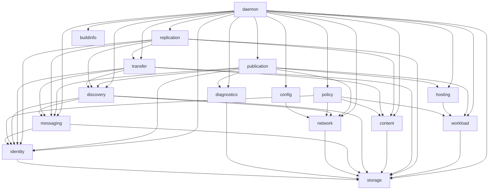

# Ardents Codebase Architecture

## 1. Status And Purpose

This document defines the target codebase architecture for Ardents `v1`.

It is a repository and runtime design, not a description of the current tree.
Product, protocol, security, persistence, and operator requirements remain the
source of required behaviour. They do not prescribe package topology.

The target has four primary qualities:

1. a developer can find the owner of behaviour from the repository tree;
2. every directory has one responsibility and one reason to change;
3. complex behaviour is concentrated in deep modules rather than distributed
   across pass-through packages;
4. CLI, RPC, Waku, Docker, persistence, and observability remain adapters and do
   not become owners of product decisions.

## 2. Baseline Findings That Drive The Design

These measurements describe the pre-reconstruction baseline. They explain the
design decisions; they are not a claim about the current working tree:

- one generated ConnectRPC service exposes 48 unrelated operations;
- `runtime/process.NodeRuntime` exposes more than 60 methods and is supplied as
  eight different dependencies to the RPC server;
- construction passes through `cmd/ardentsd`, `internal/app`,
  `runtime/process`, `runtime/orchestration`, and `runtime/assembly`;
- `runtime/process` directly imports 26 internal packages;
- `control/projection` directly imports 24 internal packages;
- `internal/data` has 28 production files, 18 internal imports, and a second
  package tree under `internal/data/internal`;
- `boundary/cli` has 29 production files and most command paths manipulate
  protobuf messages directly;
- `internal/transport/connectrpc` has 40 production files, including roughly
  55 mapping functions and duplicated authorization knowledge;
- a single data inventory query currently crosses `data -> control -> app ->
  boundary/connectrpc -> transport/connectrpc` before reaching protobuf.

These shapes reduce locality. They must not survive under different names.

## 3. Repository Rules

### 3.1 Directories Express Responsibilities

Every handwritten Go directory must answer this question in one sentence:

> This directory is responsible for X and is not responsible for Y.

A directory is invalid when its responsibility is a technical category such as
`boundary`, `runtime`, `process`, `authority`, `projection`, `api`, `contracts`,
or `helpers`.

Technical terms are allowed only for concrete adapters with a single external
system or interface, such as `network/waku`, `workload/docker`,
`localapi/protocol`, or `applicationapi`.

### 3.2 Grouping Is Required

Repository navigation is an architectural requirement. A directory must not be
kept flat merely to avoid creating packages.

Create a subdirectory when it has an independent responsibility, its own useful
interface, and a directed dependency on its parent or sibling. Do not create a
subdirectory merely to hold types, helpers, mappers, commands, or tests.

### 3.3 One Owner Per Behaviour

Every product fact and workflow has one implementation owner. Other modules may
consume a snapshot, issue a command, or adapt a protocol, but they must not
reimplement validation, authorization, state transitions, retry rules, or
projection semantics.

### 3.4 Interfaces Exist At Real Seams

An interface is introduced only when behaviour genuinely varies. Production and
in-memory test implementations count as two adapters. A one-implementation
interface used only to mock internal code is rejected.

Interfaces belong to the consuming module. There are no shared `api`,
`contracts`, or `ports` packages.

### 3.5 Generated And Handwritten Code Are Separated

Protocol source lives under `api/`. Operator protocol Go code lives under
`internal/localapi/protocol`. Public Application protocol Go code lives under
`sdk/go/protocol` so external SDK consumers do not import `internal`.
Application identity additionally has a generated-only Node adapter copy under
`internal/applicationapi/protocol`; its explicit import mappings prevent
server and SDK artifact descriptors from entering the same binary. Generated
private-messaging wire types live under `internal/messaging/protocol` and are
generated from `api/ardents/private/v1/private.proto`. Generated code is never
mixed with handwritten handlers or product models.

## 4. Target Repository Topology

```text
.github/
  workflows/

api/
  ardents/v1/
    types.proto
    node.proto
    configuration.proto
    network.proto
    content.proto
    transfer.proto
    retention.proto
    workload.proto
    diagnostics.proto
    identity.proto
  ardents/identity/v1/
    artifacts.proto
  ardents/application/v1/
    content.proto
    identity.proto
  ardents/private/v1/
    private.proto

cmd/
  ardentsctl/
    main.go
  ardentsd/
    main.go
  ardents-ingress-proxy/
    main.go

deploy/
  docker/
    compose/
    images/
    observability/

docs/
  engineering/
    codebase-architecture.md
    engineering-constraints.md
  product/
    system-concept.md
    system-properties.md
    supported-platforms.md
    workload-and-services-requirements.md
    data-substrate-requirements.md
    data-availability-replication-semantics.md
  protocols/
    canonical-network-foundation.md
    communication-contracts.md
    network-and-discovery-requirements.md
    network-participation-profiles.md
    network-privacy-protocol.md
    network-privacy-requirements.md
    network-transport-variants-requirements.md
  operations/
    deployment-contract.md
    hosted-service-probe-model.md
    hosted-service-publication-gate.md
    incident-response.md
    operator-access-contract.md
    operator-configuration-contract.md
    operator-observability.md
    operator-runbook.md
    production-observability-contract.md
    upgrade-migration.md
    workload-execution-platform.md
  security/
    persistent-state-security.md
    security-exceptions.md
    workload-security-policy.md
  governance/
    license-decision.md
    reference-invariants.md

internal/
  daemon/
  buildinfo/
  config/
  identity/
    access/
    capability/
    keyring/
    principal/
    protocol/
    trust/
  policy/
  storage/
  diagnostics/
    event/
    health/
    operation/
  network/
    peer/
    routing/
    waku/
  messaging/
    protocol/
  discovery/
    records/
    resolution/
    trust/
  content/
    catalog/
    payload/
  transfer/
  replication/
    availability/
    placement/
  workload/
    docker/
    execution/
    readiness/
    registry/
  hosting/
  publication/
  localapi/
    protocol/
      ardentsv1connect/
    auth/
    identity/
    rpc/
    node/
    network/
    content/
    transfer/
    workload/
    diagnostics/
    configuration/
  cli/
    client/
    command/
    output/
    node/
    network/
    content/
    workload/
    diagnostics/
    configuration/
    tui/
  observability/
  ingressproxy/
  applicationapi/
    admission/
    applicationerror/
    binding/
    call/
    content/
    discovery/
    principal/
    protocol/
      applicationv1/
    requestvalidation/

sdk/
  go/
    client/
    content/
    discovery/
    errors/
    internal/
    protocol/

scripts/
  deploy/
  release/

tests/
  README.md
  run.ps1
  ci/
  integration/
    node/
    network/
    messaging/
    discovery/
    content/
    transfer/
    replication/
    workload/
    hosting/
    policy/
    diagnostics/
    localapi/
  e2e/
    applicationapi/
    node/
    network/
    messaging/
    discovery/
    content/
    replication/
    workload/
    localapi/
    observability/
    operations/
  testkit/
  tooling/
    importguard/
    store-probe/
    testcatalog/

.dockerignore
.gitignore
ardents.ps1
CHANGELOG.md
go.mod
go.sum
LICENSE
README.md
```

This tree is a responsibility map. It is not permission to create empty
packages. A target directory appears only when its complete behaviour is moved
or rebuilt and its obsolete owner is removed in the same reconstruction slice.
It is also exhaustive: an internal directory shown without children is a flat
deep module in the final repository, not an omitted subtree. New internal
subdirectories require an architecture decision that updates this tree first.

The nested directories have these exact responsibilities:

| Directory | Sole responsibility |
|---|---|
| `identity/capability` | capability assertion validation and attenuation |
| `identity/access` | local-interface authentication, ephemeral sessions, signed Access Grants and revocations, and request admission; not product Policy |
| `identity/keyring` | durable node-key continuity and key material access |
| `identity/principal` | principal derivation and canonical identity encoding |
| `identity/trust` | immutable exact-purpose trusted-Principal registry and deterministic generation |
| `identity/protocol` | generated server-side signed-identity artifact messages only; no domain model or verification behavior |
| `diagnostics/event` | bounded operational event records |
| `diagnostics/health` | health evidence and aggregate health result |
| `diagnostics/operation` | long-running operation state and history |
| `network/peer` | live peer connection and reachability facts |
| `network/routing` | current usable route facts; not discovery intake |
| `network/waku` | the sole go-waku/libp2p implementation adapter |
| `messaging` | private authenticated envelopes, opaque selectors, replay protection and messaging privacy status |
| `messaging/protocol` | generated private-message wire types only; no envelope, authorization, replay, or domain behavior |
| `discovery/records` | validated durable canonical kind-specific NodeFacts and ServiceFacts records |
| `discovery/resolution` | freshness- and trust-aware record/service selection |
| `discovery/trust` | generation-aware discovery publication trust and verification cache |
| `content/catalog` | object/manifest graph and content metadata catalogue |
| `content/payload` | local blob bytes, integrity, encryption and atomic file changes |
| `replication/availability` | replica intents, availability snapshots and repair records |
| `replication/placement` | reservation, commitment, lease and capacity state machine |
| `workload/execution` | executor-neutral desired/observed lifecycle reconciliation |
| `workload/readiness` | hosted-service probe and readiness truth |
| `workload/registry` | admitted workload and hosted-service specifications |
| `workload/docker` | the sole Docker Engine implementation adapter |
| `hosting` | operator-facing hosted-service inventory combining workload backing, readiness and publication truth |

There are deliberately no target `api`, `model`, `state`, `contracts`,
`projection`, `authority`, `controller`, `helpers`, or nested `internal`
directories. Consumer-owned interfaces live beside the behaviour that consumes
them; durable schemas live with their product owner; small value types live at
the owner root.

The target repository permits repository-local agent tooling only under the
exact `.agents/skills/security-audit/` allowlist. Other `.agents` content and
tracked `.gocache`, `.idea`, `var`, `boundary`, `proto`, `docker`, or
`third_party` directories are outside the target tree. Git metadata, IDE
metadata, build caches and runtime data are local artifacts, not source-tree
architecture. Inactive fork snapshots are removed; active dependencies are
resolved through `go.mod` unless a separately approved fork is actually used.
This narrow development-tooling exception is governed by
[ADR 0010](../adr/0010-repository-local-agent-tooling.md) and pinned by
`skills-lock.json`; it is not shipped as Ardents runtime material.

`docs/engineering/architecture-acceptance.json` is the machine-readable source
for file ceilings, package-documentation exceptions, generated service
composition, the agent-tooling allowlist, and the canonical private-protocol
source, generator, output and Go package. `tests/tooling/archaccept` fails
closed when the repository diverges from that policy.

The policy discovers handwritten production Go packages from the explicit
`api`, `cmd`, `internal`, `scripts`, and `sdk/go` roots. Test tooling under
`tests` is outside the production package budget.

## 5. Ownership Of Every Top-Level Internal Directory

| Directory | Owns | Explicitly does not own |
|---|---|---|
| `daemon` | construction, startup order, shutdown rollback, cross-module process lifecycle | product state machines, RPC mapping, CLI presentation |
| `buildinfo` | immutable build and version identity | runtime health, configuration, release orchestration |
| `config` | decode, defaults, validation, source precedence, change classification | applying product changes, environment-specific startup logic |
| `identity` | node identity, key continuity, principals, capabilities, authentication facts | network transport, general policy decisions, operator RPC auth |
| `policy` | allow/deny decisions and stable denial reasons | workload execution, publication, retention, transport operations |
| `storage` | secure durable primitives, transactions, file permissions, backup-safe persistence operations | product schemas and product lifecycle decisions |
| `diagnostics` | bounded operational events, health evidence, operation history, redaction | recomputing product truth or exposing HTTP metrics |
| `network` | live network participation, reachability, peers, carrier operations, resource limits | product envelope encryption, discovery records, content semantics |
| `messaging` | private authenticated envelopes, selectors, replay protection, Relay/Store/Filter/Lightpush product use | Waku node lifecycle, discovery knowledge, content transfer state |
| `discovery` | validated knowledge about remote nodes and services, freshness, trust-aware resolution | local service readiness, local publication outcome, raw carrier lifecycle |
| `content` | local objects, manifests, blobs, payload integrity, retention and local content inventory | peer transfer, replica placement, network publication |
| `transfer` | authenticated resumable peer exchange of content | local content ownership, replica policy, raw Waku lifecycle |
| `replication` | replica intent, eligibility, placement, leases, health and repair | payload storage, transfer protocol, peer discovery |
| `workload` | desired/observed workload lifecycle, execution reconciliation, hosted-service readiness | network advertisement and remote discovery |
| `hosting` | canonical hosted-service inventory and service/publication status read model | workload transitions, probes, advertisements |
| `publication` | creation, refresh, withdrawal and retry of local node/service advertisements | workload execution, discovery intake, Waku lifecycle |
| `localapi` | authenticated local-control protocol server and protocol-specific mapping | product decisions, module state, CLI rendering |
| `applicationapi` | authenticated Application Interface adapters and protocol mapping | product decisions, content state, Operator authority, public SDK ergonomics |
| `cli` | operator command model, remote client use, human/JSON presentation, shell and TUI UX | product state transitions, RPC server behaviour |
| `observability` | Prometheus/HTTP exposure of already-owned runtime evidence | creating product health truth or diagnostics history |
| `ingressproxy` | generation-bound forwarding for admitted hosted-service ingress | workload admission, readiness, publication |

### 5.1 Adapter Subdirectories

- `network/waku` is the only owner of go-waku/libp2p integration. It implements
  interfaces consumed by `network`; `network` does not import `network/waku`.
- `workload/docker` is the only owner of Docker Engine integration. It
  implements interfaces consumed by `workload`; `workload` does not import
  `workload/docker`.
- `localapi/protocol` contains generated code only.
- `localapi/protocol/ardentsv1connect` contains generated Connect client/server
  bindings only; the nested package is imposed by the generator, not a
  handwritten architecture layer.
- `localapi/auth` owns local-protocol authentication, method authorization and
  audit context. It does not own product policy.
- `localapi/identity` is the protected Operator Unix-socket adapter for typed
  Principal authentication and identity administration. It accepts only the
  Operator session scheme and owns no durable identity state.
- `applicationapi/admission` is the sole Principal-session interceptor for
  protected Application product calls. It derives the Application Audience,
  admits exact actions/resources, and propagates sealed Actor/Effective facts;
  it owns no product state.
- `applicationapi/applicationerror` constructs the shared structured error
  detail used by protected Application services; product modules retain their
  own error-classification policy.
- `applicationapi/binding` derives the server-owned Application transport
  binding from the protected listener and OS peer.
- `applicationapi/call` carries the sealed admitted Application call across the
  adapter boundary without exposing a constructor for Actor or Effective.
- `applicationapi/discovery` projects maintained Discovery records and current
  trust into the bounded Application locator response; it does not reuse
  Operator diagnostics or trigger observation, refresh, probing, fetching, or
  dialing.
- `applicationapi/principal` is the protected Application Unix-socket adapter
  for typed Principal authentication, session termination, and one-use
  Application enrollment. It owns no durable identity state.
- `applicationapi/requestvalidation` performs shared structural protobuf
  unknown-field rejection; product adapters still own semantic request
  validation and resource canonicalization.
- `applicationapi/protocol/applicationv1` is the generated-only Node copy of
  the Application identity service. The public SDK copy is
  `sdk/go/protocol/applicationidentityv1`; both come from the same proto source
  with explicit mappings to their respective artifact packages.
- each `applicationapi/<area>` directory adapts one bounded public Application
  service to the corresponding product owner. Generated bindings remain in
  the generated-only protocol directories above.
- each `localapi/<area>` directory implements one bounded protocol service and
  maps only that owner's transport types;
- each `cli/<area>` directory owns one command family. Generated protocol
  clients are composed in `cli/client`; shared call context, input and watch
  mechanics live in `cli/command`; presentation mechanics live in
  `cli/output`.
- `identity/protocol` is generated only from
  `api/ardents/identity/v1/artifacts.proto`. The same source is generated a
  second time under `sdk/go/protocol/identityv1` with an explicit protobuf
  import mapping. Handwritten identity domain models alias neither generated
  representation.

## 6. Dependency Direction

The allowed product dependency graph is acyclic:



Additional rules:

- `policy` may consume immutable fact types owned by content, identity, network
  and workload, but feature modules define the narrow decision interfaces they
  consume and never import the concrete policy implementation;
- `diagnostics` accepts its own event/health facts and does not import feature
  modules;
- feature modules define small event/decision callbacks or interfaces at their
  seams; `diagnostics` and `policy` satisfy them without reversing ownership;
- `storage` never imports a product module;
- adapter packages depend inward on the interface they implement;
- only `daemon` may construct the complete process;
- `localapi`, `applicationapi`, and `observability` may read multiple module
  interfaces, but they may not coordinate product workflows;
- `cli` communicates only through the local control protocol.

## 7. Complete Runtime Flows

### 7.1 Startup And Shutdown

```text
cmd/ardentsd
  -> daemon
     -> config: resolve and validate
     -> storage: open durable stores
     -> identity: restore or create identity
     -> diagnostics: restore bounded operational evidence
     -> network: start Waku participation
     -> messaging: start private subscriptions
     -> discovery: restore and refresh network knowledge
     -> content: restore and reconcile local content
     -> transfer: start request/response exchange
     -> replication: restore leases and begin reconciliation
     -> workload: recover desired/observed execution
     -> publication: publish only currently eligible facts
     -> localapi, applicationapi and observability: expose the running node
```

Every start operation is idempotent. Failure rolls back successfully started
modules in reverse order. Shutdown uses the same ownership order and preserves
terminal operation evidence.

Critical identity, storage, security, or carrier failures stop startup. A
documented recoverable failure starts the daemon in an explicit degraded state
so that local control and diagnostics remain available.

There is no `runtime/process -> orchestration -> lifecycle -> recovery` call
chain. `daemon` owns process sequencing; each module owns its own recovery.

### 7.2 CLI And Local Control

```text
cmd/ardentsctl
  -> cli/<command family>
  -> cli/client
  -> one localapi protocol service
  -> localapi/<area> handler
  -> one owning module, or daemon for a true cross-module node command
```

The CLI never manipulates internal product types. Command, shell, watch, and TUI
reuse the same operator-facing client models instead of independently
interpreting protobuf state.

The local API is split into focused protocol services. There is no omnibus
`ArdentsService`, no 60-method `NodeRuntime`, and no single server object supplied
as eight different interfaces.

### 7.3 Discovery And Publication

Inbound:

```text
network/waku -> network -> messaging(open/verify) -> discovery(validate/store)
```

Outbound:

```text
workload readiness + node reachability + policy
  -> publication
  -> messaging(seal/sign)
  -> network
  -> network/waku
```

Discovery does not own local publication. Publication does not own workload
readiness or network reachability; it consumes their facts.

### 7.4 Content, Transfer And Replication

Local content operations go directly to `content`. Remote exchange is owned by
`transfer`. Availability is owned by `replication`:

```text
localapi/content -> content

transfer request
  -> discovery selects a usable peer
  -> policy authorizes exchange
  -> messaging carries encrypted protocol messages
  -> content validates and commits payload

replication reconciliation
  -> discovery supplies eligible peers
  -> policy filters candidates
  -> transfer moves content
  -> replication records commitment, lease and health
```

There is no `data` facade above these three responsibilities and no
`data/internal` package forest. Shared product types stay with the module that
owns their meaning; they are not collected into a `model` package.

### 7.5 Workload And Hosted-Service Runtime

```text
desired workload
  -> policy admission
  -> workload reconciliation
  -> workload/docker adapter
  -> readiness observation
  -> publication eligibility
  -> publication flow
```

Unexpected exit or failed readiness withdraws publication through the same
flow. A Docker container, configured endpoint, or desired state is never treated
as published runtime truth.

### 7.6 Configuration Reload

```text
config source adapter
  -> config decode/default/validate
  -> immutable/restart/reload change plan
  -> daemon applies reloadable changes
  -> rollback all applied changes on failure
  -> diagnostics records the outcome
```

Environment variables and configuration documents are inputs to one config
module. They are not parallel configuration implementations.

## 8. Local Control Protocol Structure

The monolithic proto file is split by operator responsibility. Each protocol
service remains versioned under `ardents.v1`:

- `NodeService`: lifecycle, identity and aggregate node status;
- `ConfigurationService`: effective configuration and reload;
- `NetworkService`: participation, peers, routes and discovery;
- `ContentService`: local objects, blobs, manifests and inventory;
- `TransferService`: remote fetch, sources and transfer history;
- `RetentionService`: local blob retention, pinning and drop operations;
- `WorkloadService`: workload and hosted-service operations;
- `DiagnosticsService`: health, events and failure explanation.

`ContentService` and `RetentionService` are implemented by `localapi/content`
because both adapt the local content owner. `TransferService` is implemented by
`localapi/transfer` and depends on the separate transfer owner. No service has
more than 12 methods; `types.proto` contains shared wire messages only and owns
no RPC surface.

Authorization metadata is declared once as protocol method options and consumed
by the local API interceptor. Handlers do not repeat action/domain/access string
literals or authorize the same request a second time.

Transport mapping is colocated with the handler that needs it. There is no
global mapper directory or family of `mappers_*.go` files.

## 9. What Must Disappear

The following current paths have no place in the target tree:

- `boundary/`;
- `internal/app/`;
- `internal/control/`;
- `internal/runtime/`;
- `internal/node/api`, `internal/node/lifecycle`, `internal/node/recovery`;
- `internal/data/` and every `internal/data/internal/*` package;
- `internal/transport/connectrpc`;
- feature-level `api`, `contracts`, `model`, `projection`, `authority`,
  `orchestration`, and `state` packages used only to separate technical roles;
- the monolithic `proto/ardents/v1/ardents.proto` and its single 48-method
  service;
- generic handwritten files such as `io.go`, `helpers.go`, `types.go`,
  `contracts.go`, and `service.go` when their names hide multiple concerns or
  contain pass-through code.

Removal is by behavioural replacement, not by retaining compatibility facades.
No production phase may finish with two active owners of the same behaviour.

## 10. Requirement-To-Owner Coverage

This matrix verifies that the whole product, rather than only selected modules,
has a destination in the target topology.

| Requirement family | Target owners |
|---|---|
| node startup, shutdown, recovery and deployment | `daemon`, with module-local recovery |
| build and release identity | `buildinfo` |
| operator configuration and reload | `config`, applied by `daemon` |
| node identity, principals, keys and capabilities | `identity` |
| dependency-backed Waku participation | `network`, `network/waku` |
| private envelopes, selectors, replay, Relay/Store/Filter/Lightpush use | `messaging` |
| node/service knowledge, freshness, trust-aware resolution | `discovery` |
| local node and hosted-service advertisement | `publication` |
| objects, manifests, blobs, retention and local persistence | `content`, `storage` |
| encrypted peer fetch and resumable exchange | `transfer` |
| availability, replica placement, leases and repair | `replication` |
| workload execution, Docker isolation and hosted-service readiness | `workload`, `workload/docker` |
| policy enforcement and explainable denial | `policy`, enforced by each acting owner |
| diagnostics, health, events and failure explanation | `diagnostics` |
| local operator protocol and access control | `localapi`, `localapi/auth` |
| CLI, shell, watch, TUI and JSON/human output | `cli` |
| Prometheus and HTTP operational exposure | `observability` |
| generation-bound hosted-service forwarding | `ingressproxy` |
| backup-safe persistence primitives and permissions | `storage` |

## 11. Source Layout Budgets

These budgets protect navigability without turning line count into architecture:

- a handwritten package should normally contain no more than 12 production Go
  files; exceeding the budget requires a documented single-responsibility
  justification;
- a protocol service must contain no more than 12 RPC methods;
- an exported runtime interface must not become an omnibus product surface;
- a constructor taking more than 8 independent collaborators is a design
  failure unless it is the `daemon` composition root;
- exact pass-through functions, type aliases used to avoid import cycles, and
  one-caller mapping packages are deleted;
- generated files are excluded from file-count budgets and isolated from
  handwritten code;
- tests use the same interface as production callers. Tests of private protocol
  algorithms stay inside the owning package.

## 12. Reconstruction Sequence

The reconstruction is performed as complete vertical replacements. A step is
not accepted while the new and old owners coexist indefinitely.

1. **Compatibility evidence.** Pin protocol, persisted-state, startup,
   recovery, privacy, workload and data behaviour with executable tests.
2. **Foundation modules.** Rebuild `storage`, `identity`, `diagnostics`, `policy`
   and `config` with directed dependencies and remove their old owners.
3. **Network path.** Rebuild `network`, `network/waku`, `messaging` and
   `discovery`; prove real multi-node participation before deleting old network
   packages.
4. **Content path.** Rebuild `content`, `transfer` and `replication`; prove
   persistence, encrypted fetch, peer loss, repair and restart before deleting
   `internal/data`.
5. **Workload path.** Rebuild `workload`, `workload/docker` and `publication`;
   prove readiness, withdrawal, restart and policy enforcement before deleting
   hosting/publication legacy packages.
6. **Process composition.** Build `daemon` as the single composition and
   lifecycle owner; delete `app`, `runtime`, `control` and obsolete node meta
   packages in the same step.
7. **Operator surfaces.** Split the protocol services, rebuild `localapi` and
   `cli`, then delete `boundary` and the old ConnectRPC server.
8. **Final contraction.** Remove compatibility aliases, transitional adapters,
   dead tests and empty directories; enforce the target dependency graph.

Every step must leave a buildable product and must include deletion of the
superseded production path. Temporary migration adapters may exist only inside
an active step and are not accepted as completed architecture.

### 12.1 Current Reconstruction State

Completed structural replacements:

- removed `boundary`, `internal/transport/connectrpc`, root `proto`, root
  `docker`, tracked dependency fork snapshots and obsolete process/QA material;
- moved the CLI to `internal/cli`, local RPC to `internal/localapi`, generated
  protocol code to `internal/localapi/protocol`, Docker deployment assets to
  `deploy/docker`, and concrete external adapters to `network/waku` and
  `workload/docker`;
- removed `internal/data`; local content, peer transfer and replica management
  now have distinct top-level owners: `content`, `transfer`, `replication`;
- removed `internal/runtime`, `internal/control`, the former compatibility-only
  `internal/hosting`, and `internal/node` instead of preserving facades; the
  later `hosting` owner is a new cohesive read module, not that legacy layer;
- removed the 60-method `NodeRuntime` interface. The composition root owns a
  concrete `*daemon.Node`; consumers define the narrow interfaces they need;
- moved local protocol authentication to its sole owner `localapi/auth` and
  removed the transitional root type alias.
- moved identity persistence out of daemon recovery into `identity`; product
  modules no longer import daemon merely to reuse its state types;
- removed the technical `publication/api`, `policy/api`, `policy/enforcement`
  and `publication/exposure` packages. Their interfaces, snapshots and policy
  filtering now live with their actual owners, without compatibility aliases.
- removed daemon's diagnostics proxy surface. Local API and observability now
  consume the diagnostics owner directly; the former omnibus observability
  source is split by runtime, diagnostics, workload and content responsibility;
- removed the duplicate `Hosting` dependency that pointed to the same workload
  implementation, and replaced transitional `runtime/ApplicationParts` naming
  with an explicit daemon `Owners` composition view. A distinct hosting owner
  is now exposed only because it implements a genuinely different aggregate
  read model.
- routed content reads and inventory directly to the content owner and transfer
  history directly to the transfer owner. Daemon no longer exposes
  object/blob/manifest lookup and listing, source listing, transfer
  lookup/listing or inventory proxy methods; only cross-module orchestration
  remains there.
- removed transfer/replication construction and remote workflow execution from
  `content.Service`. Daemon now composes sibling `transfer` and `replication`
  owners, while remote fetch, placement, probing and reconciliation no longer
  masquerade as local content operations.
- moved replica intent, placement commitments, availability snapshots and
  repair state into a durable `replication` repository. `content` no longer
  imports `replication`; replication loads only its strict current versioned
  state and has no fallback to the former data snapshot.
- removed the technical `network/api`, `workload/api`, `diagnostics/api`,
  `diagnostics/projection`, `diagnostics/recorder` and `diagnostics/timeline`
  package layers. Network and workload contracts now live at their owner roots;
  diagnostics recording, queries and projections are one module instead of a
  pass-through package chain.
- removed `discovery/api`, `discovery/state`, `identity/api` and
  `content/model`. Discovery persistence and snapshots now live with discovery,
  identity contracts and value types live with identity, and content facts live
  in the content catalogue. Singular `discovery/record` was merged into the
  canonical `discovery/records` owner.
- moved the durable transfer journal and its lifecycle transitions into
  `transfer`; `content` no longer stores, proxies or persists transfer records.
  The local API and observability read that owner through consumer-defined
  interfaces.
- removed the technical `content/state` package. Catalogue stores now live in
  `content/catalog`, while the strict versioned disk snapshot is a private
  persistence detail of `content.Service` rather than a reusable state layer.
- moved operator-document file loading and API/observability secret-source
  resolution into `config`. Daemon now consumes a resolved configuration
  document instead of duplicating file, permission and environment precedence
  rules in the composition root.
- consolidated startup configuration into one canonical versioned
  `config.Document` validation and runtime mapping pipeline. Obsolete identity
  environment and credential-file inputs are rejected rather than translated.
  The former 312-line `daemon/config.go` parser is now a small composition
  adapter; there is no second configuration model in daemon.
- moved the canonical network status read model and projection into `network`.
  Reachability, active transport features, abuse state and privacy posture are no
  longer modelled or computed by `daemon/status`; daemon only supplies the
  current owner snapshots to `network.ProjectStatus`.
- moved discovery health counters and peer read models into `discovery`.
  Discovery projects record/trust facts itself and accepts only a narrow
  reachability result from network composition, avoiding both a reverse import
  cycle and the former cross-domain projection logic in daemon.
- moved workload status and aggregate workload-state projections into
  `workload`; the daemon mapping file and daemon-owned workload summary type
  were deleted. Workload callers now consume one owner-defined read model.
- moved route-candidate queries to `discovery` and process features/events
  to the daemon root. These leaf contracts no longer depend on the omnibus
  `daemon/status` package, and its separate query file was deleted.
- replaced daemon-owned identity, trust, discovery-summary and content-store
  snapshot types with owner-defined read models. Their duplicate projection
  code and the now-dead observability trust classifier were deleted.
- replaced daemon's lossy transport-profile copy with the canonical typed
  `network.Snapshot`. String conversion now happens once at the local protocol
  adapter, and the duplicate daemon transport type/projector was removed.
- deleted `internal/daemon/status`. The remaining process-wide aggregate is a
  daemon composition read model whose fields retain canonical owner types from
  identity, discovery, network, content and workload. Diagnostics owns only
  health/evidence types; runtime events and process features remain at the
  daemon interface itself.
- deleted `internal/daemon/readiness`. Transport health, primary-reason
  ownership, observed-health synchronization and stop cleanup now belong to
  `diagnostics`; boot state remains in daemon recovery and crosses the seam only
  as final state/reason values.
- moved the canonical lifecycle state machine and lifecycle snapshots from
  `daemon/lifecycle` into `diagnostics`, beside the system health model that
  drives its observed transitions.
- deleted `internal/daemon/lifecycle`. Runtime owner coordination is now an
  explicit `daemon.RuntimeManager` in the composition root; the generic
  `Manager` name and hypothetical authority/data/publication coordinator
  interfaces were removed in favour of the concrete owners actually composed
  by the daemon.
- deleted `internal/daemon/recovery`. It was not a recovery domain: its files
  only coordinated process startup, diagnostics and network/discovery
  bootstrap. That orchestration now has explicit `runtime_*` names in the
  composition root. The duplicate internal boot configuration and its unused
  `Fail` flag were deleted; the daemon has one boot configuration model.
- deleted the empty `diagnostics/recorder` and `diagnostics/timeline`
  directories and the one-type technical `diagnostics/reason` package.
  Diagnostic reasons now belong to `diagnostics/health`, which owns health
  evidence and aggregation in the target topology.
- deleted `workload/controller`, `workload/desiredstate`,
  `workload/observedstate` and the nested `workload/workload` package.
  `workload/registry` now owns admitted workload and hosted-service
  specifications; `workload/execution` owns desired/observed lifecycle,
  persistence and reconciliation. The shallow controller executor interface
  and its sole pass-through adapter were removed: reconciliation consumes the
  real execution seam directly, with local-process and Docker implementations.
- reduced `identity` to its target topology: root plus `access`, `capability`,
  `keyring`, `principal`, generated-only `protocol`, and exact-purpose `trust`.
  The obsolete `authorization`, `subject`, `lifecycle`, and identity-cutover
  packages were deleted. `identity/access` is the one deep owner of typed
  authentication challenges, ephemeral sessions, Access Grants, revocations,
  one-hop Delegation, and sealed Actor/Effective admission; it does not own
  product Policy. Durable Node key access belongs to `keyring`; Node identity
  creation/restoration sits behind the root `identity.Service` seam.
  Local-realm provisioning lives behind the explicit `ardentsd init` mode and
  composes identity and capability through `internal/provision`, avoiding both
  a reverse import cycle, a false reusable identity subdomain, and a separate
  deployment binary.
- collapsed `policy/decision`, `policy/evaluation`, `policy/policyset`,
  `policy/reason` and `policy/rule` into the flat policy owner required by the
  target tree. Callers now learn one policy interface and one `BlobView` type;
  the former chains of one-file packages and aliases no longer form part of
  the interface. A publication-owned assertion was moved out of policy tests
  to the publication owner.
- reduced `discovery` to the target root plus `records`, `resolution` and
  `trust`. Record freshness, source classification and intake/merge validation
  now live together in `records`; the former one-purpose `freshness`, `source`
  and `intake` packages and the empty singular `record` directory were
  deleted.
- reduced `content` to the target root plus `catalog` and `payload`.
  Blob operations, chunk planning/validation, observed content health and
  retention lifecycle are now cohesive parts of the content owner rather than
  four extra package seams. The merge also removed duplicate policy-view and
  authorizer adapters that existed only to cross the former package boundary.
- reduced `network` to the target root plus `peer`, `routing` and
  `waku`. Transport profiles, participation modes, reachability, bootstrap
  state, health snapshots and private-envelope contracts now belong to the
  root network owner. `network/waku` is only the go-waku/libp2p adapter: it
  consumes those contracts explicitly and no longer exposes a parallel alias
  surface. The former `route`, `privacy/wire` and nested Waku technical package
  tree were removed.
- completed the missing messaging owner and removed the transitional
  `network/privacy` placement. Seal/open, opaque selectors, message classes,
  replay protection and private messaging status now live in `messaging`.
  `network.Service` carries only opaque `network.Envelope` values through
  Relay, Lightpush, Filter and Store; it does not import messaging or expose
  product-private methods. A single composition adapter converts carrier
  envelopes at the daemon seam for publication, discovery and transfer.
- contracted daemon read and command orchestration. The pass-through
  `QueryService -> Reader` chain is now one `QueryService` read model with
  explicit synchronization collaborators, and the separate `CommandService`
  wrapper was absorbed by `RuntimeManager`, the actual process lifecycle
  owner. Role-like duplicate imports of the same package were removed instead
  of pretending that aliases such as `discoveryapi` and `discoverystate` were
  architectural seams.
- removed daemon's compatibility configuration aliases (`Node*Config`) and the
  identity-store alias, updating all integration/e2e callers to the canonical
  configuration types. Removed the duplicate transport-prefixed network type
  aliases as well; callers now use the single `network.Profile`, `Family`,
  `Mode` and `Snapshot` vocabulary. Discovery record conversion moved from
  daemon to the discovery owner, and runtime snapshot projection moved to the
  diagnostics owner.
- removed the duplicate `Daemon` facade, which only copied the same owner
  pointers and exposed trivial getters. `daemon.Owners` is now the single
  process composition value consumed by `Run`, `cmd/ardentsd`, local API assembly
  and observability assembly; construction no longer advertises an impossible
  error result.
- moved local content mutation rules into `content.Commands`: process guards,
  pin authorization, policy-denial reporting and content lifecycle events no
  longer live in daemon handlers. Discovery record list/import conversion and
  mutation semantics similarly moved into `discovery.Commands`; daemon now
  wires lifecycle and diagnostics callbacks to these owner commands.
- moved trust-aware record/service resolution, route candidate filtering and
  route projection from `daemon.Controller` into `discovery.Resolver`. To make
  that dependency acyclic, `network.Service` no longer imports discovery
  records; it accepts the minimal network-owned `RouteRecord`, while discovery
  adapts its richer record at the seam. Discovery therefore depends directly
  on stable network and policy contracts, never on the Waku adapter.
- removed the former omnibus daemon `Controller` and its temporary
  `WorkloadCoordinator` successor. `workload.Runtime` now owns the complete
  desired/observed command state machine, admission, reconciliation,
  publication compensation and its own concurrency boundary. Daemon supplies
  only lifecycle/diagnostic hooks and concrete adapters during construction.
  Discovery trust health remains in `RuntimeManager`, while private-publication
  failure handling belongs to the publication owner.
- exposed the workload owner through `daemon.Owners` and connected local API
  workload queries and commands directly to `workload.Runtime`. Hosting queries
  are a separate consumer port because they combine publication and readiness
  truth; they are no longer hidden inside a misleading omnibus workload
  dependency.
- completed that hosting seam as a physical `internal/hosting` owner. Hosted
  service and publication snapshots moved out of the workload root; inventory
  composition moved out of `daemon.QueryService`; local API, observability and
  diagnostics now consume `Owners.Hosting` directly. The public workload proxy
  methods on `daemon.Node`, the wide `workload.Service` interface, and both
  daemon hosting files were deleted without compatibility aliases.
- started the physical local-control split with
  `localapi/configuration`: its Connect handler, configuration mapping and
  focused tests now live in one responsibility package embedded by the root
  protocol server. This is a real Go package boundary, not filename-only
  grouping; authorization remains centralized in `localapi/auth`.
- completed the next two vertical local-control packages:
  `localapi/workload` owns workload commands, queries, hosting queries and
  their protocol mappings; `localapi/content` owns objects, blobs, manifests,
  transfers, inventory and their mappings. The root server embeds these
  handlers and no longer stores their individual dependencies. Shared Connect
  context, error-detail and deadline mechanics live once in `localapi/rpc`, so
  physical grouping does not duplicate adapter logic.
- completed the remaining local-control split. `localapi/network` owns network
  and discovery RPCs, `localapi/diagnostics` owns diagnostic RPCs and mappings,
  and `localapi/node` owns process-level node commands, status and event
  streaming. The handwritten `localapi` root now contains only server
  composition and the access interceptor (plus its focused test); all former
  root `server_*`, `mappers_*`, context and error-helper forests are gone.
- completed the CLI split. The handwritten `cli` root now contains only
  process-level argument dispatch, root usage and version handling.
  `cli/configuration`, `content`, `network`, `node`, `diagnostics`, `workload`
  and `tui` own their command parsing and presentation; `cli/output` is the
  sole renderer; `cli/command` owns shared call context, explicit input and the
  watch loop. Hidden `os.Stdin` reads and the former root `command_*`,
  `render.go`, `error.go`, `cli_input.go`, `watch.go` forest are gone.
- removed concrete-adapter validation from `config`. Portable operator-document
  validation depends only on owner contracts; Waku material/reachability checks
  and Docker execution-spec checks remain inside their adapters and are applied
  by composition/execution at the real seam.
- established a default ceiling of 12 handwritten production files per package
  without adding holding packages. Packages above that default have exact,
  non-growing ceilings and reasons in the machine-readable acceptance policy;
  an undeclared package or any growth beyond its ceiling fails the gate.
- replaced the single 48-method `ArdentsService` with 9 generated bounded
  Operator services and 3 generated Application services. The Operator
  services are registered behind one protected local endpoint; the Application
  services remain on their distinct interface. Composition paths and proto
  service counts are checked against the machine-readable acceptance policy.
  `localapi/transfer` owns transfer RPC mapping instead of mixing peer exchange
  into `localapi/content`.
- regrouped integration and end-to-end suites by current owners. The former
  `data-substrate`, `network-foundation`, `network-privacy`,
  `local-control-surface` and `hosted-services` directory labels no longer
  determine test topology; scenario IDs remain stable compatibility evidence.
  Test executables now live under `tests/tooling`, not a second application
  root named `tests/cmd`.
- added package-level responsibility contracts to every handwritten production
  package. New handwritten packages must add a package comment; any temporary
  exception must be explicit in the machine-readable acceptance policy.
  Generated-only packages are documented by their canonical proto source and
  generation boundary.
- moved the private-message source to
  `api/ardents/private/v1/private.proto` and its generated Go representation to
  the generated-only `internal/messaging/protocol` package. The handwritten
  messaging domain owns its `MessageClass` and maps it explicitly at the wire
  seam. The acceptance gate checks the exact source, generator, output and
  `go_package`, rejects legacy locations, and permits no second generated copy.
- inverted process-surface construction. `daemon` exposes neutral local API and
  operator-surface hooks; `cmd/ardentsd` selects the localapi and observability
  adapters. This removed the former daemon-to-adapter imports and allowed the
  process aggregate snapshot to return to daemon instead of making diagnostics
  depend on content, discovery, identity, network and workload.
- removed feature imports of the concrete policy implementation. Workload,
  discovery, publication, transfer and replication own their decision seams;
  policy implements those seams over immutable owner facts. Transfer and
  replication likewise accept an event callback rather than a concrete
  diagnostics recorder.

The content/transfer/replication dependency direction now matches the target:
content owns local facts, transfer owns exchange, replication owns replica
control and durable availability state, and daemon only composes their runtime.

The network dependency direction now also matches the target: product modules
consume `network`; only the daemon composition root selects `network/waku` as
the concrete adapter. The root `network` package does not import its Waku
implementation.

The structural reconstruction is complete. The acceptance sweep confirms the
documented dependency graph, the 12-file and 12-RPC budgets, package ownership
comments, removal of forbidden paths, and compile-only coverage of all
production, integration and end-to-end source packages. The Windows Waku test
linker prerequisite is supplied by the local test toolchain rather than by a
product-source compatibility shim.

## 13. Structural Acceptance Criteria

The architecture is complete only when all of the following are true:

- the repository matches the responsibility topology in section 4;
- every internal directory has a package comment stating its single
  responsibility and explicit non-responsibilities;
- `boundary`, `runtime`, `control`, `internal/data`, nested `internal`, and
  feature `api/contracts/model` package trees are absent;
- imports follow the acyclic dependency direction in section 6;
- only `daemon` constructs the full process;
- only `network/waku` imports go-waku/libp2p implementation packages;
- only `workload/docker` imports Docker Engine implementation packages;
- local control is split into focused protocol services and authorization is
  declared once;
- CLI commands, shell, watch and TUI share one operator client model;
- startup, shutdown, recovery, configuration reload, discovery/publication,
  content transfer/replication and workload flows each have one visible owner;
- obsolete production code and its implementation-coupled tests are removed;
- protocol compatibility, persisted-state migration, security, diagnostics,
  integration and end-to-end tests prove the required product behaviour.

Passing tests alone is insufficient if the forbidden topology remains. A clean
tree alone is insufficient if the runtime and compatibility evidence is absent.
