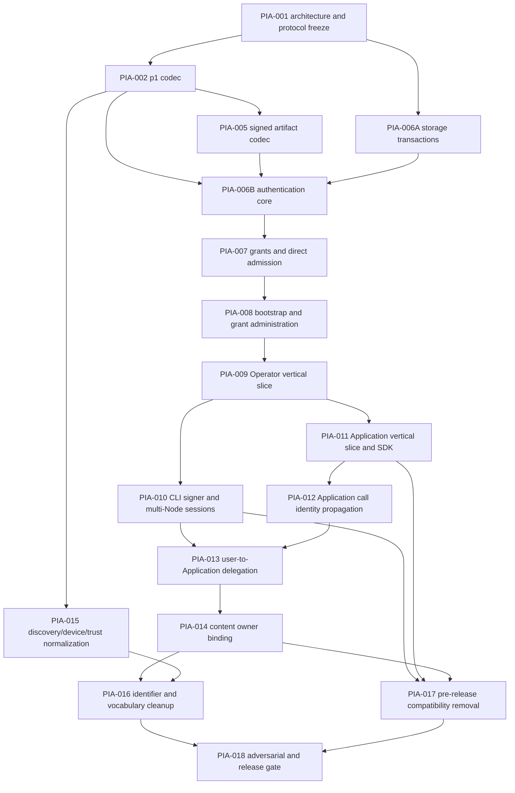

# Principal Identity And Access Work Plan

Status: proposed implementation plan; no task in this document has been started
or authorized by the document itself.

Design source: `docs/product/principal-identity-and-access.md`

Decision source: `docs/adr/0002-principal-centered-identity-and-access.md`

## 1. How To Use This Plan

Tasks are ordered by dependency, not by file location. An implementation agent
must read the design and ADR before taking a task. It must also inspect the
current worktree and preserve unrelated or overlapping changes; as of the design
date, Operator/Application authentication files already have uncommitted work.
Do not replace those files from an older branch or assume this plan describes
their eventual diff exactly.

Each task is a reviewable vertical or enabling slice. A task is complete only
when its named behavior, negative tests, persistence/rollback evidence, and
documentation are all present. Empty target packages, compatibility aliases,
unused abstractions, and “tests later” handoffs are not acceptable.

When a task discovers that a normative field, cryptographic byte sequence,
authorization order, or migration rule in the design cannot work, stop and
amend the design/ADR before coding a different behavior. Do not silently make a
wire or security decision inside implementation.

## 2. Current Code Anchors

These are the known change points at the time of design:

| Concern | Current owner/evidence | Target |
|---|---|---|
| Principal derivation | `internal/identity/principal/principal.go` truncates SHA-256 | Strict typed `p1_` codec with full digest |
| Node identity/device | `internal/identity/node_create.go`, `node_restore.go`, `contracts.go` | Node Principal retained; fake same-seed Device removed/replaced |
| Generic call identity | `identity.SubjectRef`, `identity.CallContext` | `access.AuthorizedCall` with Actor and Effective |
| Operator bearer auth | `internal/localapi/auth/*`, `localapi/access_interceptor.go` | Delete; protected Operator adapter uses `identity/access` only |
| Application bearer auth | `internal/applicationapi/auth/*` | Delete; protected Application adapter uses the same owner only |
| Application auth propagation | `applicationapi/content/handler.go` authorizes headers itself | Interceptor derives and propagates `AuthorizedCall` once |
| Operator protocol | `api/ardents/v1/*.proto`, `internal/localapi/protocol` | Separate Operator identity/authentication service |
| Application protocol | `api/ardents/application/v1/content.proto`, `sdk/go/protocol` | Separate Application authentication service, same semantics |
| SDK token source | `sdk/go/client/client.go` | Signer plus Audience-indexed session provider |
| Provisioned labels/tokens | `internal/provision/config.go`, `run.go` | One-use bootstrap/enrollment and real Principal grants |
| Channel authorization | `internal/identity/capability*` | Unchanged channel `CapabilityGrant`; never generalized |
| Content ownership | `internal/content/*`, Application content adapter | Owner binding derived from Effective Principal |
| Discovery identity | `internal/discovery/records/model.go` | Later kind-specific normalization |
| Replication target naming | `internal/replication/*PeerID*` | Node Principal naming, not Waku Peer ID |

Generated files are outputs, never edited by hand.

## 3. Delivery Graph And Gates



Release gates:

- **Format gate:** PIA-001, PIA-002, and PIA-005. PIA-003/004A/004B/004C are
  retired greenfield leaves, not pending work. No user key issuance before this
  gate because IDs and signed bytes must be stable first.
- **Operator gate:** PIA-006 through PIA-010. Normal Node administration works
  for a Principal on multiple Nodes through Principal sessions only.
- **Application gate:** PIA-011 and PIA-012. Applications authenticate as their
  own Principals and handlers receive proven identity.
- **Delegation/content gate:** PIA-013 and PIA-014. A user can safely authorize
  an Application and ownership is enforced.
- **Release gate:** PIA-015 through PIA-018. Ambiguous identifiers and all
  pre-release compatibility paths are removed.

After PIA-002, PIA-005 and independent fresh-state normalization may run in
parallel. After the Operator gate, PIA-011 and CLI portions not sharing generated files may be developed in
parallel. Do not parallelize tasks that both edit the same proto generation
script or persisted schema without an explicit file split.

### 3.1 Agent-Grabbable Leaf Issues

The numbered sections below are workstreams containing shared detail. An
implementation agent takes exactly one leaf issue from this table unless the
leaf is itself a one-piece workstream. Every leaf is a separate review/commit
boundary; do not deliver an entire broad workstream as one change.

| Leaf | Depends on | Deliverable and independent acceptance |
|---|---|---|
| `PIA-001` | — | Architecture/protocol/resource catalogue freeze; docs and stale-generation check only |
| `PIA-002` | 001 | Strict `p1_`/`d1_` codecs and public golden vectors |
| `PIA-003` | — | **Retired:** no released `p_` state exists, so inventory/dry-run tooling is deleted |
| `PIA-004A` | — | **Retired:** no Node `p_ -> p1_` persisted-state migration is a release requirement |
| `PIA-004B` | — | **Retired:** fresh canonical signed artifacts are created directly; none are reissued from `p_` |
| `PIA-004C` | — | **Retired:** there is no whole-network identity epoch before the first release |
| `PIA-005` | 002 | Canonical Credential/Grant/Delegation/revocation codecs and server/SDK vectors |
| `PIA-006A` | 001 | Long-lived Storage database lifecycle and transaction API; backup/lock/schema tests |
| `PIA-006B` | 002, 005, 006A | Bounded challenge, Credential verification, session issue/lookup/invalidation only |
| `PIA-007` | 006B | Durable grants and direct `Actor == Effective` admission; no Delegation code |
| `PIA-008A` | 007 | One-use Bootstrap Ticket state machine for the only first-Operator path |
| `PIA-008B` | 008A | Proof-bound Principal enrollment and atomic first grant |
| `PIA-008C` | 008B | Grant/Credential administration, idempotency and last-recovery-path guard |
| `PIA-009A` | 008C | Operator identity proto plus Unix-socket session adapter/catalogue entries |
| `PIA-009B1` | 009A | Shared `rpc.Respond` context plumbing plus Node/Configuration handlers; exactly one Admit per RPC |
| `PIA-009B2` | 009B1 | Network/Diagnostics handler conversion and streaming context tests |
| `PIA-009B3` | 009B1 | Workload handler conversion and resource-extractor tests |
| `PIA-009B4` | 009B1 | Content/Transfer/Retention handler conversion and resource-extractor tests |
| `PIA-010A` | 009A | Protected CLI device-signer storage and identity commands |
| `PIA-010B` | 009B1–009B4, 010A | Audience-indexed CLI session client, Alpha/Beta behavior, SSH stream-local forwarding |
| `PIA-010C` | 010B | Enrollment/grant/device administration commands and consent/output tests |
| `PIA-011A` | 009A | Application auth proto and SDK Signer/session single-flight flow on Unix socket |
| `PIA-011B` | 009B1–009B4, 011A | Application enrollment as the only supported Application credential path |
| `PIA-012` | 011B | Application interceptor/context propagation; header auth removed from content handler |
| `PIA-013` | 010B, 012 | Full one-hop Delegation validation, revocation, CLI consent, SDK attachment |
| `PIA-014A` | 012 | Atomic Blob payload/metadata/owner binding for Application acting as itself |
| `PIA-014B` | 013, 014A | Alice-via-Application ownership/intersection and non-enumeration behavior |
| `PIA-014C` | 014B | Object/Manifest owner binding plus remote-fetch/claim boundary and owner-aware GC/reconciliation |
| `PIA-015A` | 002 | Remove fake same-seed Device; expose Device only for an actual Credential |
| `PIA-015B` | 015A | Final versioned kind-specific discovery records and strict retained-state validation |
| `PIA-015C` | 015B | Purpose-scoped trust registry and verification cache invalidation |
| `PIA-016A` | 002 | Rename replication Principal targets; Waku Peer ID remains adapter-only |
| `PIA-016B` | 014C | Collapse domain Blob ID/CID directly into the final versioned wire/state form |
| `PIA-016C` | 015C, 016A, 016B | Type remaining security Owners and split overloaded Capability vocabulary |
| `PIA-017` | 010C, 011B, 014C | Delete all pre-release bearer/config/SDK/provisioning compatibility and prove Principal-only clean install |
| `PIA-018` | 016C, 017 | Adversarial, fresh-install, persistence recovery, redaction and full release acceptance |

If one leaf exceeds a reviewable change after inspection, split it by product
owner while preserving the same acceptance boundary. Never recombine adjacent
leaves merely because one agent can edit all affected files.

## 4. Rules That Apply To Every Task

Every implementation task must:

1. preserve the separation of Operator and Application protocols/listeners;
2. keep product Policy outside `identity/access`;
3. derive actions and Audience on the server;
4. use strict typed IDs at security boundaries;
5. reject unknown versions/actions/resource kinds and duplicate set entries;
6. add positive, sibling-denial, malformed, expiry, and redaction tests;
7. use an injected clock and entropy source for time/random behavior;
8. keep private keys, session/bootstrap/enrollment tickets, proof bytes, and channel
   secrets out of errors, logs, snapshots, fixtures committed to source, and
   assertion failure output;
9. update package responsibility comments and the exhaustive architecture tree
   before adding an unlisted package;
10. avoid exposing repository/store interfaces outside the deep owner;
11. include persisted-state versioning and rollback notes for every schema
    change;
12. leave the worktree formatted and run the narrow tests named by the task,
    followed by the relevant integration suite.

Use deterministic fixtures: fixed public keys and expected IDs/signatures are
public test material; fixed private test keys must be unmistakably test-only.
Never reuse production or developer keys.

## 5. Tasks

### PIA-001 — Freeze Architecture And Identity Protocol Layout

**Depends on:** none.

**Outcome:** the repository topology, protocol sources, generated-code locations,
and first-release support policy are explicit before a new package or wire method is
created.

**Required changes:**

- Update `docs/engineering/codebase-architecture.md` to add
  `internal/identity/access` as the local-interface identity/access owner and
  `internal/identity/protocol` as generated-only signed-artifact types.
- Add the planned source locations to the topology:
  `api/ardents/identity/v1/artifacts.proto`,
  `api/ardents/v1/identity.proto`, and
  `api/ardents/application/v1/identity.proto`.
- Record that the artifact proto is generated twice with explicit `M` mappings:
  server output under `internal/identity/protocol`, SDK output under
  `sdk/go/protocol/identityv1`. Domain models must not alias either generated
  representation.
- Extend/check the generation scripts so `-Check` can prove both copies and both
  authentication services are current. Pin the existing protoc/plugin versions;
  do not opportunistically upgrade them.
- Define the method names, RPC limits, HTTP paths, session/delegation header
  names, and mapping of Connect error codes before handler work.
- Materialize section 7.1 of the product design as one reviewable catalogue
  specification containing, for every existing and new procedure: public or
  protected status, exact action, read/write class, ResourceKind, two-phase
  `Canonicalize`/`Finalize` extractor, accepted scope kinds, and
  malformed/sibling negative case. Resolve every
  request-ID canonical parser here; later tasks must not invent trimming or
  fallback-to-Node behavior.
- Copy the exact v1 time, count, rate, artifact, and header bounds from section
  4.7 into protocol/config constants with one named owner; do not create a second
  set of adapter defaults.
- Freeze the transport matrix: sessions on protected Unix sockets only;
  plaintext loopback is unsupported; future TCP requires a separate mTLS
  contract. Specify SSH stream-local forwarding before changing the CLI.
- Add a credential matrix proving that Operator and Application sessions are
  accepted only on their own protected surface and every other scheme is rejected.
- Confirm that adding the two authentication methods does not violate the
  per-service RPC budget; use a focused identity service rather than adding them
  to Content or Configuration.

**Acceptance evidence:**

- architecture topology and responsibility tables include every planned
  directory;
- protocol generation has one documented command and a stale-output check;
- every current procedure in `internal/localapi/auth/access_catalog.go` and both
  Application content procedures appears in the resource catalogue with one
  extractor;
- Operator-generated code cannot import the public SDK package;
- Application generated code remains the SDK/public protocol used by its
  server adapter;
- no runtime behavior changes in this task.

**Do not do:** implement handlers, invent recovery, merge the two surfaces, or
add empty `access`/protocol directories merely to match the plan.

### PIA-002 — Implement Strict `p1_` Principal And Device Identifiers

**Depends on:** PIA-001.

**Outcome:** one canonical typed Principal ID and Device ID implementation exists,
with published vectors and no new use of the truncated helper.

**Likely files:**

- `internal/identity/principal/principal.go` and focused tests;
- new golden-vector data under an architecture-approved protocol testdata path;
- SDK conformance test consuming the same public vector file.

**Required behavior:**

- Introduce `principal.ID` with `Parse`, `FromEd25519PublicKey`, `String`, text
  marshal/unmarshal, equality, and zero-value rejection.
- Implement the exact domain bytes and lowercase unpadded base32 format from the
  product design. Do not retain a general `DeriveID(prefix, raw)` API.
- Add a separate typed `DeviceID` derivation from the device public key using the
  exact `ardents:device:v1` domain and `d1_` format. It must not accept or derive
  from a private seed.
- Delete every `p_` parser/helper; runtime `principal.Parse` accepts only `p1_`.
- Add golden vectors for zero-like, low/high-byte, and fixed RFC-compatible
  Ed25519 public keys plus malformed prefix/length/alphabet/case/padding tests.
- Add a fuzz/property test: parse/string round-trip is canonical; all one-byte
  mutations either produce a different ID or fail parse.

**Acceptance tests:**

```text
go test ./internal/identity/principal/...
go test ./sdk/go/...                 # vector consumer only at this stage
```

Replace pre-release `p_` expectations with explicit rejection tests; no package
may accept both forms.

**Do not do:** migrate persisted Node state, add key recovery, or change Waku
Peer ID.

### PIA-003 And PIA-004A/B/C — Retired Greenfield Leaves

These leaves are removed from the dependency graph. Ardents has no released
`p_` identity state, signed artifact, or bearer-authenticated installation to
inventory or migrate. Their implementation is deletion of any pre-release
inventory, epoch, marker, alias, reissue, and restore tooling.

**Acceptance evidence:** runtime and tools contain no `p_` parser or
`identity-migration` command; fresh Node/realm/Application state is created
directly with canonical `p1_` identifiers; canonical signed-artifact tests and
ordinary stopped-Node backup/restore tests remain green.

**Do not do:** retain dead migration code for a hypothetical deployment, accept
dual identifiers, or remove transactional rollback and released-schema recovery.

### PIA-005 — Implement Canonical Signed Identity Artifacts

**Depends on:** PIA-002 and the protocol layout from PIA-001.

**Outcome:** Credential, Access Grant, Delegation, and revocation artifacts have
one canonical codec, strict constructors, verification, and cross-SDK vectors.

**Likely files:**

- `api/ardents/identity/v1/artifacts.proto`;
- generated server/SDK identity protocol outputs;
- handwritten domain/codec files in `internal/identity/access` only after the
  architecture update;
- artifact generation/check scripts and testdata.

**Required behavior:**

- Define protobuf payloads without maps, `Any`, free-form metadata, or signature
  fields inside the signed payload.
- Implement every exact artifact domain/ID prefix in section 4.8 of the product
  design and the deterministic marshal profile. Treat IDs as recomputed envelope
  metadata, never a self-referential signed payload field.
- Constructors normalize timestamps, sort and deduplicate set fields, validate
  typed IDs, reject empty/unknown values, calculate full artifact IDs, and then
  sign. Verifiers repeat every structural check; they do not trust constructor
  provenance.
- Credential verification binds root key → Principal and device key → DeviceID.
- Grant verification requires `Issuer == Audience.Node`, exact registered action
  syntax, finite validity, and a supported typed scope.
- Delegation verification requires Application Audience, exact Delegatee, one
  hop/no redelegation, finite validity, and the embedded valid device Credential;
  v1 rejects root-signed Delegations.
- Define the three exact revocation payloads from product section 4.8, including
  target-prefix, signer, Audience, timestamp, known-target/preemptive rules, and
  permanent idempotency. Node DeviceID revocation is Audience-local and may be
  preemptive; do not imply cross-Node delivery.
- Enforce every numerical limit from product section 4.7 in constructors and
  verifiers, with boundary vectors at max and max+1.
  For a maximum that is unreachable under another closed v1 invariant (the
  registered catalogues contain fewer than 64 actions and no 128-byte action
  or 32-byte ResourceKind, while canonical artifact schemas contain no padding
  or free-form field capable of reaching exactly 4/16 KiB), do not invent a
  registered value or padding field. Exercise the shared bound predicate at
  max/max+1 and the largest constructible canonical value instead; accepted
  signed max/max+1 vectors remain mandatory for every reachable boundary.
- Golden vectors include UTC Unix-second timestamps (`nanos == 0`), the 2020/
  2100 range boundaries, half-open expiry, exactly ±120-second portable skew,
  no-skew challenge/session boundaries, and rejection of zero/noncanonical time.
- Make `String`, `GoString`, and JSON/log projections redact signature,
  Credential bytes, and any future secret field.
- Generate golden bytes, IDs, and signatures. Verify the same vectors through
  server codec and SDK-side parser/signer without importing `internal/*`.

**Acceptance tests:** malformed protobuf, unknown fields, duplicate actions,
unsorted actions, non-normal timestamps, wrong domain, wrong issuer, wrong key,
bit flips, expired/not-yet-valid, cross-artifact signature reuse, and cross-
language/server-SDK vector parity.

**Do not do:** implement persistence, sessions, handlers, general grant chains,
wildcards, X.509, DID, or wallet integration.

### PIA-006 — Establish Transactions And Build Authentication Core

**Depends on:** split by leaf: PIA-006A depends on PIA-001; PIA-006B depends on
PIA-002, PIA-005, and PIA-006A.

**Outcome:** identity state has a real transaction/lifecycle primitive, then
`access.Service.Begin` and `Complete` safely authenticate a Principal and issue
a Node/interface-bound ephemeral session without granting authority.

#### PIA-006A — Storage Database Lifecycle And Transactions

**Likely files:** `internal/storage` plus focused lifecycle/transaction tests and
daemon construction/shutdown/backup adapters. The new handle owns the exact file
`identity-access.db`; do not convert unrelated product repositories in this
leaf.

**Required implementation:**

- Add one daemon-owned long-lived handle for new `identity-access.db`. Opening a
  second process/handle for that file fails clearly; existing owners may continue
  current `LoadJSON`/`SaveJSON` access to `ardents.db`.
- Expose consumer-owned read/write transaction abstractions without exporting
  `*bbolt.DB`, bucket handles, or bbolt errors across Storage.
- Support versioned bucket creation/migration, read-only View, serialized Update,
  context cancellation before commit, and panic/error rollback.
- Define shutdown ordering: stop admission, drain transactions, close DB, then
  stop the process. No repository may reopen the file during shutdown.
- Define backup/checkpoint coordination used by install/upgrade scripts and
  prove a backup represents one transaction boundary.
- Do not point product `LoadJSON`/`SaveJSON` at `identity-access.db` or claim an
  atomic transaction across it and `ardents.db`.
- Add in-memory/test transaction behavior only if it preserves atomicity and
  isolation semantics; otherwise tests use a temporary bbolt database.

**Acceptance:** concurrent readers/writer, rollback on callback error/panic,
schema max+unknown version, exclusive process lock, backup consistency, shutdown
with active transaction, reopen/recovery, and Windows/Linux file behavior.

#### PIA-006B — Challenge, Credential, And Session

**Required implementation:**

- Create the concrete `internal/identity/access.Service` and package
  responsibility comment. Do not export a broad service interface from the
  owner; adapters declare consumer interfaces.
- Implement bounded in-memory ChallengeStore and SessionStore with production
  clock/entropy and deterministic test variants, using exactly the capacities,
  source keys, rates, and TTLs in product section 4.7.
- Use 16-byte random challenge IDs, 32-byte nonces, two-minute hard challenge
  expiry, atomic consume, global/per-source limits, and deterministic cleanup.
- Return only structured challenge fields. Server and SDK independently
  reconstruct the same deterministic protobuf and typed authentication or
  enrollment domain; never expose an opaque server-selected signing payload to
  a generic signer. Retain enough state to compare every field on completion.
- Implement the two closed challenge purposes. `session` requires any valid,
  unrevoked root-signed device Credential and never persists it merely because it
  was presented. `enrollment_proof` requires the root key, returns a one-use
  EnrollmentProof, and can never issue a Session; there is no configurable
  general root-login mode.
- Add the versioned DeviceRevocation repository in `identity-access.db` now,
  because Complete must check it before issuing a session. It is keyed by
  `(Audience Node, Subject, DeviceID)` and permits an authorized later command to
  create a preemptive record for an unseen DeviceID.
- Issue a 32-byte session secret, return it once, and store only an HMAC lookup
  plus non-secret Session facts. Generate the HMAC key per daemon process so
  restart invalidates sessions.
- Bind Session to Principal, DeviceID, exact CredentialID, and the complete
  server-derived AuthenticationBinding (Node/interface/protocol,
  TransportProfile, and PeerBinding).
- Maintain reverse Session indexes by DeviceID (and exact CredentialID for
  audit) so one Device Revocation invalidates sessions created from every renewed
  Credential for that key.
- Implement uniform public authentication errors and detailed redacted audit
  reasons.

**Concurrency/security tests:**

- 100 concurrent Complete calls for one challenge yield exactly one session;
- Audience/surface/Node substitutions fail;
- expiry boundaries use fake clock and do not revive entries;
- store capacity/rate limits are deterministic and do not evict a challenge in a
  way that reports success twice;
- restart loses sessions; Credentials/grants are not affected;
- session, nonce, proof, and private material do not appear in formatted errors,
  audit fixtures, or snapshots.

**Do not do:** authorize actions, persist sessions, or contact a realm service.

### PIA-007 — Add Durable Access Grants, Revocation, And `Admit`

**Depends on:** PIA-006.

**Outcome:** direct authenticated calls (`Actor == Effective`) are admitted only
when current exact Node authority exists; sessions never cache permissions.

**Required implementation:**

- Add owner-specific repositories for enrollment metadata, Access Grants, and
  Grant revocations, reusing the DeviceRevocation repository from PIA-006B. Use
  the PIA-006A database transaction/lifecycle API and versioned buckets; do not
  open bbolt independently.
- Persist canonical bytes and indexed fields; verify the binding when loading.
- Implement typed `Audience`, `Action`, `ResourceRef`, and `ResourceScope`.
- Register exact action catalogues per interface. Import/adapt the current
  Operator catalogue rather than maintaining two lists.
- Implement scope matching only for `node`, `principal-owned`, and `exact`.
- Implement only the direct `Admit` path: session → Actor grant → sealed
  `AuthorizedCall` with `Effective == Actor`. Require one matching grant, not two
  duplicate records.
- Reserve a narrow internal step for PIA-013 to resolve optional Delegation, but
  do not implement parsing, revocation storage, Effective-grant intersection, or
  multi-hop machinery here. Until PIA-013 is enabled, any Delegation presentation
  is denied as unsupported without changing the direct path.
- Return admission success before product Policy; expose enough immutable facts
  for product modules/audit without exposing store handles.
- Recheck grant/Device revocation on every call and fail closed if durable
  state cannot be read.

**Acceptance scenarios:**

- Alice has independent Alpha/Beta grants and revocation isolation;
- one action does not imply a sibling action or namespace prefix;
- `node` scope does not match another Node;
- `principal-owned:Alice` does not match Bob;
- an `exact` scope for one complete `(Node, Owner, kind, id)` does not match the
  same kind/id under a different Owner or Node;
- an unexpired session is denied immediately after grant revocation;
- a corrupted indexed record cannot bypass canonical signature verification;
- Policy denial remains distinguishable internally from access denial but maps
  safely at the public boundary;
- existing channel CapabilityGrant tests are unchanged.

**Do not do:** expose a generic policy DSL, grant-parent chains, negative grants,
put actions into sessions, or implement Delegation ahead of PIA-013.

### PIA-008 — Add Bootstrap, Enrollment, And Atomic Grant Administration

**Depends on:** PIA-007.

**Outcome:** a new Node can acquire its first real Operator, and authorized
Operators can enroll Principals, revoke Devices, and issue/revoke Node-signed grants
without a TOCTOU gap.

**Leaf boundaries:** `PIA-008A` implements only the ticket state machine;
`PIA-008B` atomically proves/enrolls a Principal and issues
the first grant; `PIA-008C` adds later administration, idempotency, and recovery
guards. Operator proto/handlers belong to PIA-009A, not this workstream.

**Likely files:** `internal/provision/*`, access administration/repository files,
config validation and operations docs.

**Required behavior:**

- Introduce a random one-use Bootstrap Ticket accepted only for first-Operator
  enrollment. It is the only first-install bootstrap credential; coordinate its
  activation with the PIA-010 CLI consumer and recovery drill.
- Store only a protected digest/state for the ticket; configure short expiry;
  consume atomically with issuance of the first Operator grant.
- Enrollment requires proof of the submitted Principal key before any grant is
  issued.
- Implement exact administration commands: enroll Principal with an initial
  proven Credential, revoke DeviceID (including a preemptive revocation for an
  unseen DeviceID with explicit Subject), list Device revocations, issue Access
  Grant, revoke Access Grant, and list non-secret enrollment/grant metadata.
- Each mutation takes the original authenticated AdminAttempt and repeats
  authorization in the same bbolt transaction as the write.
- The Node keyring signs Access Grants; Operator keys authorize the request but
  do not become the artifact issuer.
- Prevent removal/revocation of the final recovery path unless an explicit,
  separately tested replacement is committed atomically.
- Define idempotency: same command/request ID and same payload returns the prior
  result; same ID with different payload is Conflict.
- Make the one-use Bootstrap Ticket the only first-Operator bootstrap path and
  prove the released CLI can consume it before the daemon is considered ready.

**Acceptance scenarios:** first enrollment, replayed ticket, concurrent first
enrollment, expired ticket, proof for another Principal, last-Operator guard,
grant issue/revoke idempotency, operator loses authority between request parsing
and transaction, and redacted list/audit output.

**Do not do:** represent Bootstrap Ticket labels as Principal, grant
all `*`, or let a realm authority sign local Node grants.

### PIA-009 — Deliver The Operator Principal Authentication Slice

**Depends on:** PIA-008.

**Outcome:** every protected Operator RPC authenticates only a Principal session
and receives one `AuthorizedCall`.

**Leaf boundaries:** `PIA-009A` owns proto, public/protected catalogue entries,
Unix-socket presentation, and interceptor context creation. `PIA-009B1` changes
shared response plumbing and Node/Configuration. `PIA-009B2`, `B3`, and `B4`
migrate Network/Diagnostics, Workload, and Content/Transfer/Retention
respectively. Each family leaf removes its old authorization when it converts
the handlers; no dual route is retained.

**Likely files:**

- `api/ardents/v1/identity.proto` and generated local protocol;
- `internal/localapi/auth/*`, `access_interceptor.go`, server composition;
- `internal/daemon/*` composition only where access dependencies are wired;
- Operator access contract and operations docs.

**Required behavior:**

- Expose Begin/Complete and administration RPCs through a focused Operator
  identity service. Authentication endpoints are unauthenticated but bounded;
  administration endpoints are protected by exact actions.
- Mark Begin/Complete as explicit `public_bounded` catalogue entries; unknown
  procedures remain denied. Public does not mean available on plaintext TCP:
  new auth/session endpoints register only on the protected Unix listener, and
  Session stores/lookup compare the server-derived TransportProfile/PeerBinding.
- Parse only `ArdentsOperatorSession` on the new path and derive Audience from
  the Operator listener.
- Keep one procedure→action catalogue. Unknown procedures deny; the client never
  submits the action.
- Interceptor canonicalizes the request-only ResourceTarget through the exact
  PIA-001 extractor, calls `Admit` exactly once, and puts the finalized sealed
  `AuthorizedCall` in context. `Admit`, not the request, supplies Effective to
  the extractor's Finalize phase.
- Replace `rpc.Respond(auth, header, ...)` with a context-only responder that
  requires the interceptor value. It must not parse Authorization or call
  `Admit` a second time. Streaming handlers receive the
  same call at stream establishment and cannot swap identity mid-stream.
- Add an instrumented guard fixture that counts admission calls and proves one
  and only one `Admit` per protected unary/stream establishment for every
  converted handler family.
- Delete Operator bearer parsing, plaintext protected routes, and token-derived
  subjects as each handler family lands. Never accept an Application credential
  on the Operator listener.

**Acceptance scenarios:** all current Operator procedures have exact catalogue
entries; Alice/Alpha/Beta; cross-surface rejection; missing/unknown procedure;
old/unknown schemes rejected; malformed headers; public error redaction; converted
handlers observe Actor/Effective Alice.

**Narrow test commands:**

```text
go test ./internal/identity/... ./internal/localapi/...
go test ./tests/integration/localapi/...
```

**Do not do:** change Application handlers in this leaf or merge generated
services. Do not send a Principal session over the current
loopback HTTP or `ssh -W` path.

### PIA-010 — Add CLI Signer, Enrollment, And Multi-Node Sessions

**Depends on:** PIA-009.

**Outcome:** `ardentsctl` can create/import a Principal signer, enroll it, log in
to multiple Nodes, refresh sessions, and perform Operator commands through the
only supported Principal-session path.

**Leaf boundaries:** `PIA-010A` is key custody and identity display only;
`PIA-010B` is challenge/session refresh, Audience cache, Alpha/Beta, and SSH
transport; `PIA-010C` adds enrollment/grant/revocation commands. Do not mix
private-key file review with broad command conversion in one change.

**Likely files:** `internal/cli/client`, `internal/cli/command`, a focused
identity command family, `cmd/ardentsctl`, config/operations docs.

**Required behavior:**

- Define the CLI-owned Signer interface matching the design. First production
  adapter is a protected Ed25519 file/device bundle; tests use deterministic
  memory signer. Do not claim OS keychain/HSM support until implemented.
- Default file creation is atomic and least-privilege (`0600` on Unix); refuse a
  permissive existing private-key file according to the existing security
  contract. Never print private material by default.
- Provide explicit commands for Principal creation/display, device creation,
  Bootstrap enrollment, login/status/logout, grant list/issue/revoke, and device
  revocation. Command names must be frozen in PIA-001 docs before coding.
- Cache session secrets only in memory by default. If persistent session cache is
  product-required later, it needs a separate protected-state decision.
- Index sessions by `(Node Principal, interface, protocol major, signer
  Principal)` and automatically reauthenticate once on Unauthenticated. Do not
  retry PermissionDenied as authentication.
- For remote Operator use, replace the existing `ssh -W` loopback target with
  OpenSSH stream-local forwarding to the protected Operator Unix socket (or the
  separately reviewed remote-helper alternative frozen in PIA-001). Refuse to
  send `ArdentsOperatorSession` when the effective target is HTTP, even if its
  address is loopback.
- Display Principal, target Node, exact actions/scope/expiry for every grant
  mutation and require explicit confirmation in interactive mode; JSON mode is
  deterministic and noninteractive.
- Delete token flags, token-file configuration, and plaintext endpoint modes.

**Acceptance scenarios:** one Alice signer controls Alpha and Beta; session for
Alpha is never sent to Beta; daemon restart triggers one safe re-login; revoked
device cannot refresh; noninteractive signer failure is deterministic; output
redaction; Windows permission behavior follows the existing supported-platform
contract rather than pretending Unix modes apply.

**Do not do:** build a wallet UI, cloud account sync, social recovery, or persist
session secrets casually.

### PIA-011 — Deliver Application Principal Authentication And SDK Session Flow

**Depends on:** PIA-008C and PIA-009A; PIA-011B additionally waits for
PIA-009B1 through PIA-009B4. It can otherwise proceed after shared artifacts and
administration semantics are stable.

**Outcome:** an Application installation owns a key/Principal, enrolls once, and
uses an Application-bound session through the public SDK.

**Likely files:**

- `api/ardents/application/v1/identity.proto` and generated SDK protocol;
- `internal/applicationapi/auth/*` and server composition;
- `sdk/go/client/*`, `sdk/go/internal/adapter/*`, SDK errors/tests;
- provisioning for one-use Application enrollment.

**Required behavior:**

- Add Application Begin/Complete endpoints with the same domain semantics but
  Application generated package and listener-derived Audience. Register them
  only on the protected Application Unix listener; session auth is forbidden on
  plaintext loopback/TCP.
- Define public SDK `Signer` and session-provider APIs without exposing generated
  messages or importing `internal/*`.
- SDK validates all structured challenge fields, reconstructs the exact typed
  challenge/domain locally, and calls `SignAuthenticationChallenge`; it refuses
  unknown purposes/profiles or any Principal/Audience/binding mismatch. It
  caches the session in memory, refreshes once on Unauthenticated, and never
  retries PermissionDenied as login. No public SDK signer exposes generic
  `Sign([]byte)`.
- Supply an explicit protected-file Ed25519 Application signer or enrollment
  helper only if its cross-platform key-file rules are fully tested. Otherwise
  make Signer required and keep key custody with the embedding Application.
- Introduce a separately named one-use Application Enrollment Ticket authorized
  by an Operator. It is accepted only by the enrollment method and never by
  content methods.
- Provision no reusable Application token. Application Principal sessions are
  the only protected Application credential from the first release.
- Accept `ArdentsApplicationSession` only on the Application listener. Reject
  Operator sessions and every unknown credential scheme on every unintended
  endpoint.

**Acceptance scenarios:** independent installations of the same app get
different Principals; app session is rejected on Operator listener and another
Node; old/unknown schemes are rejected; SDK refresh is
single-flight under concurrent requests; secrets are redacted.

**Narrow test commands:**

```text
powershell -File scripts/generate-application-api.ps1 -Check
go test ./internal/applicationapi/... ./sdk/go/...
go test -tags=e2e ./tests/e2e/applicationapi/...
```

**Do not do:** implement user delegation or change content ownership in this
task.

### PIA-012 — Propagate `AuthorizedCall` Through Application Handlers

**Depends on:** PIA-011.

**Outcome:** Application authentication/authorization happens once at the
surface; every product adapter receives the proven Actor/Effective call instead
of reparsing headers.

**Required behavior:**

- Replace `applicationapi/content.Authorizer.Authorize(headers, action) error`
  with an Application interceptor/adapter that calls `Admit` and stores a sealed
  `AuthorizedCall` in context.
- Resource extraction remains method-specific and server-owned. For current
  content methods, validate content reference/size before admission as required
  to derive the resource, but do not perform product mutation before admission.
- Change narrow content owner interfaces/commands to receive the call or its
  exact required identity facts. Do not pass raw HTTP headers into product code.
- Preserve public SDK error codes and the existing bounded payload behavior.
- Add a guard test that every protected Application procedure is registered in
  the action/resource catalogue exactly once.
- Delete duplicate bearer/action evaluation and its parser; the Principal
  admission interceptor is the only protected entry path.

**Acceptance scenarios:** handler observes App as both Actor/Effective; forged
context values cannot construct the sealed call; direct handler tests use a real
access test fixture rather than a boolean fake; missing catalogue entry denies;
authorization errors remain structured/redacted.

**Do not do:** let product packages depend on Connect/http, or trust a request
owner/user header.

### PIA-013 — Add One-Hop User-To-Application Delegation

**Depends on:** PIA-010B and PIA-012.

**Outcome:** Alice can authorize one Application installation to act for her on
one Node within exact actions/scope/time, without sharing Alice's private key or
session.

**Required behavior:**

- Add CLI/client support to request/display and sign the exact Delegation
  artifact. Consent text must include Node Principal, Application Principal,
  actions, resource scope, start/expiry, and no-redelegation statement.
- Add SDK support to attach one canonical Delegation using the frozen bounded
  header. It remains opaque to product SDK clients except for typed consent
  construction APIs.
- In `Admit`, verify delegator Credential, signature, Delegatee equals session
  Actor, exact Application Audience, validity, action/scope, no redelegation, and
  local revocation before deriving Effective.
- Activate the PIA-007 Delegation extension only in this leaf and add the
  Delegation-revocation repository here. V1 accepts only device-signed
  Delegations with the embedded Credential; enforce all product section 4.7
  bounds and section 4.8 permanent/idempotent revocation rules.
- Require all three authority legs: Actor Application grant, Alice/effective
  grant, and Delegation. Deny if any leg is missing or narrower than the request.
- Keep Actor and Effective in context, audit, and diagnostics; never overwrite
  Actor with Alice.
- Support explicit Delegation revocation/import. Expiry remains the normal
  short-lived path; hard v1 lifetime is 24 hours.
- Bound header count/decoded size before protobuf parsing.

**Acceptance matrix:**

| Variation | Expected |
|---|---|
| App grant + Alice grant + exact Delegation | allow |
| Missing any one leg | deny |
| Delegation to another app/Node/interface | unauthenticated or denied without detail leak |
| Sibling action or broader resource | deny |
| Expired/not-yet-valid/revoked | deny |
| Nested/redelegated artifact | reject structurally |
| Direct Alice call without Delegation | allow when Alice grant matches |
| App own call without Delegation | allow only within App's own matching grant |

**Do not do:** user-to-user sharing, multi-hop OAuth-style chains, refresh tokens,
global consent registry, or arbitrary caveat language.

### PIA-014 — Make Content Ownership Principal-Bound

**Depends on:** split by leaf: PIA-014A depends on PIA-012; PIA-014B depends on
PIA-013 and PIA-014A; PIA-014C depends on PIA-014B.

**Outcome:** identical bytes remain globally deduplicated while authorization and
ownership are keyed by Principal; knowing a CID is never sufficient authority.

**Leaf boundaries:** `PIA-014A` changes only Blob Put/Get for an Application
acting as itself and the crash-safe owner-binding transaction. `PIA-014B` adds
Actor/Effective delegation behavior and non-enumeration. `PIA-014C` finalizes
Object/Manifest owner semantics, reconciliation/GC, and remote-fetch/explicit
claim boundaries. Operator administrative content semantics do not change
implicitly in A or B.

**Likely files:** `internal/content/catalog`, content service/commands, Application
content adapter and SDK protocol only if an owner selector is needed, final
persistence format, content integration/e2e tests.

**Required behavior:**

- Add a durable owner binding keyed by `(Owner PrincipalID, Content Reference)`.
  Payload/CID storage remains deduplicated and is not copied per owner.
- Implement the exact crash order from product section 8.5: temporary
  write/hash/fsync, idempotent content-addressed rename, then metadata+owner
  binding in one catalogue transaction. Startup reconciles an installed but
  unreferenced payload as reclaimable; it never creates a binding.
- On Put, derive Owner exclusively from `AuthorizedCall.Effective`. Reject or
  ignore any wire owner field according to the frozen protocol; never persist it
  as authority.
- Authorize Put/Get against the canonical content resource and
  `principal-owned` scope. Application Actor and Alice Effective are both
  retained for audit.
- For Get, distinguish payload existence from owner binding and authorization;
  public errors must not become a cross-owner existence oracle.
- Application Get requires the `(Effective, Reference)` binding before either
  local read or remote fetch. Fetch may fill bytes for that binding but cannot
  create it. V1 adds no implicit claim-by-CID operation; an explicit sharing/
  import command is a later protocol slice.
- Replace pre-release arbitrary Owner strings with the typed owner model. Fresh
  state is canonical; startup rejects untyped or ambiguous owner records rather
  than guessing or providing a compatibility mapping.
- Enable Blob-only Principal ownership only after PIA-014C either finalizes
  Object/Manifest semantics or explicitly denies their owner-sensitive
  use. Remote Get is enabled only when the Principal ownership boundary is
  complete; do not add a second authorization path to preserve old behavior.
- Add reference-count/garbage-collection rules: deleting one owner binding does
  not delete payload still bound/retained elsewhere.

**Acceptance scenarios:** same CID owned by Alice and Bob; Alice cannot infer or
read Bob-only binding; Gallery acts for Alice successfully; Gallery cannot
substitute Bob; App own data stays App-owned; one binding deletion preserves
other owner; restart/recovery; remote fetch still verifies payload but does not
invent local ownership.

**Do not do:** encode owner into CID, duplicate payloads, or use a display name as
Principal.

### PIA-015 — Normalize Device, Discovery Identity, And Purpose-Scoped Trust

**Depends on:** PIA-002. It should land after the core identity format is stable.

**Outcome:** discovery and trust no longer present duplicated fields or fake
Device identity as evidence about Principals.

**Leaf boundaries:** `PIA-015A` only removes/replaces fake Device projection;
`PIA-015B` owns the first-release discovery record format;
`PIA-015C` owns purpose-scoped trust and cache invalidation. None of these leaves
may smuggle the other two schema changes into its boundary.

**Required behavior:**

- Replace/remove Node `Device` derived from the Node private seed. A Device field
  is present only when a real independent public device Credential exists.
- Split the generic discovery record payload into kind-specific validated facts
  so fields such as `ID`, `Subject`, `Node`, `Device`, `Owner`, and `Service`
  cannot repeat the same value with contradictory meanings.
- Node records identify the Node Principal once; service records use a typed
  Service ID plus explicit owning Node/Principal and workload binding where
  required.
- Emit and accept only the canonical kind-specific record version. Reject
  duplicate pre-release shapes rather than selecting one field silently.
- Consolidate duplicated raw-public-key/trusted-issuer configuration into a
  purpose-scoped trusted-Principal model with exact purposes such as
  `discovery.publish`, `channel.issue`, and `identity.attest`.
- Verify a signed record once on import, persist verification evidence bound to
  canonical bytes/trust generation, and re-evaluate when trust generation
  changes. Avoid repeated crypto verification in projections without weakening
  freshness/trust checks.
- Add `RealmAttestation` only if a current policy consumer exists; otherwise
  reserve the purpose vocabulary and defer the artifact.

**Acceptance scenarios:** conflicting/old discovery fields fail closed;
Node/service round trips; trust purpose A never implies purpose B; trust anchor
rotation invalidates cached evidence; Waku Peer ID remains separate; remote
records cannot claim a local owner through duplicate fields.

**Do not do:** turn Realm into a global login service or require an online trust
authority for request admission.

### PIA-016 — Remove Remaining Ambiguous Identifier And “Capability” Names

**Depends on:** PIA-014 and PIA-015.

**Outcome:** security-relevant APIs make it mechanically difficult to pass a
transport/resource/string identifier where a Principal is required.

**Leaf boundaries:** `PIA-016A` is the replication target rename/type;
`PIA-016B` is Blob ID/CID domain normalization; `PIA-016C` is remaining Owner
typing and vocabulary. Each has its own final persisted/wire fixture.

**Required changes:**

- Rename replication `PeerID` fields that actually contain an Ardents Node
  Principal to `NodePrincipal` or `TargetNode`. Keep `WakuPeerID` only at the
  transport adapter boundary.
- Collapse domain `Blob.ID`/`Blob.CID` where equality is invariant into one
  typed Content Reference. Delete duplicate pre-release wire/storage fields.
- Replace security-sensitive arbitrary `Owner string` fields with
  `PrincipalID` or a closed `ResourceOwner` sum type. Keep workload/service local
  IDs typed and Node-scoped; do not make every resource a Principal.
- Rename vocabulary and exported action/config concepts so these are distinct:
  `Permission`, private-channel `ChannelGrant` concept (the stored Go type may
  retain `CapabilityGrant` until its protocol migration), `WorkloadRequirement`,
  and `TransportFeature`.
- Add compile-time/type tests or constructors that reject accidental mixing.
- Update protocol/operations/product docs and JSON fields to the final versioned
  formats; do not keep pre-release aliases.

**Acceptance evidence:** repository search has no product-level `PeerID` storing
a Principal; domain Blob cannot contain two unequal IDs; security owner parsing
is closed/typed; channel capability test vectors unchanged; obsolete wire/state
fixtures fail with a precise safe error.

**Do not do:** rename actual Waku/libp2p APIs, turn WorkloadID/ServiceID into
PrincipalID, or combine Content Reference with ownership.

### PIA-017 — Remove Pre-Release Compatibility Paths

**Depends on:** PIA-010C, PIA-011B, and PIA-014C.

**Outcome:** the repository and clean-install output expose only canonical
Principal identity, protected Principal sessions, one-use enrollment tickets,
and canonical versioned configuration.

**Required behavior:**

- Delete Operator/Application bearer authorizers, plaintext protected routes,
  token subjects/capabilities, reusable token files, token CLI/SDK inputs, and
  provisioning/deployment output for those paths.
- Delete `p_` parsing, identity inventory/epoch commands, dual-ID markers,
  reissue/restore code specific to the nonexistent cutover, and tests/docs that
  imply released `p_` state.
- Delete coexistence/tombstone/deadline state and every fallback or ambiguous
  credential branch. Each protected listener accepts only its own session
  scheme; public enrollment methods accept only their exact one-use ticket/proof.
- Require one canonical versioned configuration document. Reject obsolete
  environment/token compatibility inputs; unknown fields fail closed.
- Keep the first-Operator Bootstrap Ticket and Application Enrollment Ticket
  flows usable, one-use, short-lived, redacted, and surface-specific.
- Keep transactional database rollback, atomic file replacement, stopped-Node
  consistency-group backup, and released-schema recovery. These are current
  safety properties, not compatibility paths.
- Update install, operator access, configuration, SDK, incident, and recovery
  documentation to describe only the Principal-only first release.

**Acceptance scenarios:** clean install emits no permanent Operator/Application
token; repository search finds no runtime old-scheme parser or `p_` migrator;
old/unknown schemes and cross-surface sessions reject; first Operator and first
Application can enroll; daemon restart and store recovery preserve durable grants
while invalidating sessions; no secret appears in output or logs.

**Do not do:** remove sessions/tickets because they are bearer-like secrets,
remove transactional rollback, or add a new recovery architecture.

### PIA-018 — Run Adversarial, Persistence-Recovery, And Release Acceptance

**Depends on:** PIA-016 and PIA-017; all earlier task acceptance tests green.

**Outcome:** the whole system satisfies the product design under concurrency,
restart, corruption, cross-surface attacks, and upgrade/rollback before release.

**Required suites:**

- canonical artifact vectors and mutation/fuzz corpus;
- challenge/session race, capacity, expiry, restart, and revocation;
- Alice on Alpha/Beta with independent grants and session caches;
- Operator↔Application cross-surface credential matrix;
- full Delegation intersection and confused-deputy matrix;
- content multi-owner/non-enumeration/remote-fetch behavior;
- fresh-install canonical state plus explicit rejection of `p_`, obsolete
  config/token inputs, unknown schemes, and duplicate wire fields;
- corrupted/unknown persisted identity schema fails closed;
- discovery/trust purpose separation and channel capability regression;
- audit/error/log snapshot scanning for all secret classes;
- denied-call and successful-mutation audit events plus proof that successful
  read-only diagnostics do not append to the event stream;
- daemon startup/shutdown rollback with identity store unavailable;
- SDK/CLI concurrency and one-refresh behavior.

**Review questions that must have written answers:**

1. What exactly identifies Actor and Effective at every public handler?
2. Can any client-supplied string select action, Audience, owner, or effective
   Principal?
3. Can a valid artifact/session cross Node, interface, protocol major, or
   Application delegatee?
4. Does revocation take effect on the next call without session rotation?
5. Which private or session/ticket values are ever persisted, and why is each necessary?
6. What happens when root key, device key, session, or Node state is lost?
7. Can the system start safely with interrupted schema upgrade or corrupted grant state?
8. Does any trust purpose imply another accidentally?
9. Can CID/PeerID/WorkloadID/ServiceID be accepted as PrincipalID through a
   string conversion?
10. Does any obsolete credential/config/identifier path remain reachable, and
    do first enrollment plus persistence recovery work without it?

**Final commands:** use the repository/CI-supported Go and protocol toolchain.
At minimum run the generation stale checks, all focused suites above, then:

```text
go test ./...
```

If the full suite has a documented platform/toolchain exception, record the
exact failing package and run the repository's compile/import/test-catalog CI
equivalent; do not call the release gate green because only narrow tests passed.

## 6. Expected Task Handoff Format

An agent completing any PIA task should hand off:

1. outcome in one paragraph;
2. changed behavior and exact public-contract effect;
3. files/packages/protocols/persisted schemas changed;
4. persisted-schema transitions and rollback behavior;
5. tests run with results;
6. security-negative cases added;
7. remaining risks or the next unblocked task;
8. confirmation that no unrelated user work was overwritten.

For PIA-001 through PIA-005, include updated canonical vector hashes. For tasks
changing persistence, include fixture versions and interruption points. For
PIA-009 onward, include the public credential acceptance matrix. For PIA-017 and
PIA-018, include repository-removal evidence and recovery-drill results.
