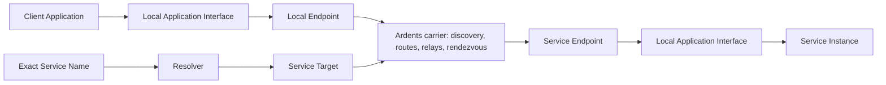

# Network functional map

Status: **product decomposition for research**

This map describes Ardents as a network product. It separates the mandatory
carrier contract from Application behavior and from optional Overlay Services.

Status labels:

- **fixed** — already follows from an accepted product decision;
- **working** — recommended baseline for focused research, still reversible;
- **open** — no product commitment yet.

## Product boundary

The network connects Applications to Service Targets. It does not send product
messages between infrastructure Node IDs, and it does not need a User identity
in order to carry a connection.

## Baseline product requirements

| ID | Requirement | Status | Evidence or decision still needed |
|---|---|---|---|
| NET-01 | A User or Developer can start a local endpoint and join the public carrier without a central account, phone, email, or wallet. | fixed | R-009 defines hostile bootstrap and Bridge recovery. |
| NET-01A | V1 runs the local Ardents endpoint and publishes ordinary local Applications on Windows 11 and Ubuntu LTS `x86-64` desktop/laptop devices. Ubuntu LTS is the sole Linux qualification baseline. Infrastructure performance is gated on an Ubuntu LTS `x86-64` `2 vCPU`, `2 GiB RAM`, symmetric `100 Mbit/s` reference VPS. Other Linux variants receive no V1 claim; macOS and mobile are later targets. | fixed | R-023 P3-D1 fixes endpoint roles, P3-D3b3 fixes the VPS class, and P3-D6b2b1 fixes the OS families, architecture, and endpoint hardware class. Exact candidate images, CPU model, network inputs, and remaining numeric budgets are retained measurement details. |
| NET-02 | The addressable application object is a location-independent Service Target. A Node ID and User identity are never substituted for it. | fixed | R-006 selected a portable Service Authority: ordinary migration preserves the target; loss or compromise replaces it. |
| NET-03 | A Developer can expose one active V1 Service Instance without publishing its ordinary origin address to Users. | fixed | R-002 defines the exact listen/accept contract. Delegated multi-instance operation is not a V1 promise. |
| NET-04 | An exact human-readable Service Name can resolve verifiably to a Service Target. Ardents does not index or recommend Unlisted Services. | fixed | R-003 defines registration, private resolution, recovery, expiry, and governance. |
| NET-04A | An existing external Application can use a local socket/proxy-style Application Interface without embedding a mandatory Ardents SDK or networking library. An SDK is only a convenience wrapper and adds no network behavior or guarantee. | fixed | R-002 P1-D1; concrete local protocol and operating-system binding remain open. |
| NET-04B | Application traffic and Service administration are separate privilege boundaries. The Connection Interface exposes connection and byte-stream operations; Service Authority, publication, and configuration require a separately authorized Service Administration Interface. | fixed | R-002 P1-D3 fixes the logical boundary and P1-D7 fixes its Local Grant model. Concrete operating-system enforcement remains open. |
| NET-04C | An outbound connection accepts either an exact Service Name or a Service Target. A name is verifiably resolved to its current target; a target bypasses naming. Success requires authentication of that exact target, which is available in the authoritative connection result. | fixed | R-002 P1-D4 fixes destination forms and the success boundary. No failed resolution or authentication silently falls back to another namespace, target, or ordinary network. |
| NET-04D | Every Application Interface operation is authorized by a narrowly scoped Local Grant: connection use, per-Service administration, or Service Authority custody. An Endpoint Owner controls grants only on that endpoint; no global administrator, shared admin token, or central approval is required to join, connect, or publish. | fixed | R-002 P1-D7 fixes local authority and non-centralization. R-012 must ensure naming, bootstrap, releases, and emergency governance do not recreate one mandatory operator. |
| NET-05 | The V1 Application Interface exposes one live logical Service Connection: a bidirectional, reliable, ordered byte stream without message boundaries whose lifetime may span bounded replacement of underlying Carrier Channels. Service Connection closure or failure is explicit; datagrams as an Application primitive, offline retention, exactly-once Application semantics, and automatic Application-operation replay are not provided. | fixed | R-002 P1-D2 fixes the primitive, P1-D5 its failure contract, R-023 P3-D4a fixes bounded same-connection recovery, and P1-D8 fixes its resource and backpressure boundary. |
| NET-06 | Service Connections authenticate the intended Service Target and protect Application Data end to end from carrier Nodes, including when all carrier roles collude, while the endpoints, Service Authority, and accepted cryptography remain uncompromised. The intended User and Service Applications receive their plaintext by design. | fixed | R-001 P2-D3 forbids plaintext at every carrier role, P2-D4 keeps payload protection independent of anonymity failure, P2-D5 fixes the endpoint limitation, and P2-D6 requires fail-closed active-attack handling. R-002 defines what authentication is exposed to the Application. |
| NET-06A | Target authentication, Route Profile binding, protocol freshness, control data, and Application Data integrity fail closed. Modified, injected, replayed, redirected, reordered beyond the stream contract, or downgraded data is rejected; a detected violation terminates the affected attempt or connection without silent fallback or Application Data replay. | fixed | R-001 P2-D6 fixes the invariant without selecting cryptography. Target substitution maps to target authentication failure when supported; established-stream integrity loss maps to connection loss; an indistinguishable cause remains indeterminate under R-002 P1-D5. |
| NET-07 | The Service does not learn the User's ordinary location, the User does not learn the Service Instance's ordinary location, and no one ordinary Node links either endpoint location to a Service Name, Service Target, or opposite endpoint within the Interactive Route contract. | fixed | R-001 P2-D1 through P2-D7 fix the observer, Node, collusion, endpoint, active-attack, condition, and falsification boundaries before R-004 compares routing families. |
| NET-07A | The Interactive Route does not promise resistance to a Broad Traffic Observer correlating timing and volume near both endpoints or across enough network locations. A stronger delayed, padded, or cover-traffic-heavy profile is optional and separate. | fixed | R-001 P2-D1 fixes the honest limitation. R-005 requires a concrete Application job and measurable advantage before adding another Route Profile. |
| NET-07B | A Local Traffic Observer may know the adjacent endpoint's ordinary location and observe external peer addresses, timing, duration, direction, volume, and retry patterns. The protocol does not directly expose the opposite endpoint's ordinary location, the selected Service Name or Service Target, Application Data, or the full Route; hiding Ardents use or preventing timing inference is not promised. | fixed | R-001 P2-D2 fixes the one-edge observation boundary; P2-D3 through P2-D7 refine Node, collusion, endpoint, active-attack, condition, and falsification handling. |
| NET-07C | The Interactive Route is multi-hop for Route Knowledge Separation. An endpoint-adjacent Node may know that endpoint's ordinary location; an interior or Rendezvous role knows only adjacent Nodes. Every role is limited to its immediate peers, required role data, traffic metadata, and short-lived opaque route handles. No ordinary Node receives the full Route, Application Data, or a link between an endpoint location and a Service Name or Service Target. | fixed | R-001 P2-D3 rejects direct P2P and a single trusted proxy. R-004 selects the route family and hop count; R-011 validates rather than assumes independent control; R-023 bounds performance cost. |
| NET-07D | The Interactive Route anonymity guarantee covers any one malicious ordinary Node, but not every pair or larger colluding set. Correlated Control that spans both endpoint-adjacent views, or otherwise combines an endpoint location with the opposite endpoint, Service Name, or Service Target, may link the relationship through metadata. Absence of a general collusion guarantee does not mean every pair has a useful combined view. | fixed | R-001 P2-D4 fixes the honest limit. R-004 minimizes position-dependent exposure, R-011 measures correlated-control risk, and any stronger multiparty-resistance profile requires R-005 evidence. |
| NET-07E | Ardents provides Endpoint Location Privacy, not automatic Application anonymity. A Service receives no User origin, Route, Isolation Context, or network-generated stable User ID, but can link credentials, content, fingerprints, timing, volume, and behavior visible to its Application. A User knows the Service Name or Service Target and receives Service output, but not the Service Instance origin, Route, or Service Authority. | fixed | R-001 P2-D5 fixes malicious-endpoint knowledge. R-002 P1-D6 prevents network-state reuse across Isolation Contexts; Applications own semantic identity, content safety, and fingerprint resistance. |
| NET-08 | Every locally authorized Application receives a distinct default Isolation Context and may request additional opaque contexts. Different contexts cannot share linkable routing or session state; no context is transmitted as a User, Service, or network identity. Missing explicit input always selects the Application's safe default, never a global shared context. | fixed | R-002 P1-D6 fixes the interface and safe default. R-004 must enforce the boundary in the selected routing design and measure its cost. |
| NET-09 | A Connection Result reports only a supported product-level class: destination or resolution failure, local denial or resource limit, Service unavailable, Route unavailable, target authentication failure, local timeout or cancellation, clean close, connection loss, or indeterminate failure. Unsupported distinctions are never guessed; Node identities and route internals are not exposed. | fixed | R-002 P1-D5 fixes the Application Interface contract. R-001 P2-D6 maps detectable active violations without inventing a new diagnostic class; R-007 determines the evidence and bounded retry behind each availability result. |
| NET-10 | Blocking ordinary entry addresses or one path has a bounded recovery route that does not require protocol expertise from a User. | fixed | R-009 defines discovery and probing resistance. |
| NET-10A | Transport Camouflage is best-effort: Ardents avoids one mandatory stable network fingerprint and aims to make confident classification or blanket blocking require active analysis or meaningful collateral blocking of ordinary traffic. It never promises invisibility or guaranteed indistinguishability. | fixed | R-001 P2-D2 fixes the product boundary. R-009 defines and measures replaceable Bridges, transport agility, classification resistance, and blocking cost. |
| NET-11 | Ordinary routing and Service reachability can use independently operated Nodes without one mandatory carrier operator. No Endpoint Owner becomes a network administrator or approval root. | fixed | R-002 P1-D7 excludes global local-interface authority. R-010 through R-012 and R-020 define abuse cost, diversity, control roots, and contributor sustainability. |
| NET-12 | Resource budgets are finite and hierarchical: Endpoint → Local Grant/Application → Service or Isolation Context → connection and operation. Creating child scopes never increases the parent budget; slow consumers receive stream backpressure; overload rejects or terminates work explicitly; one Application cannot monopolize the Endpoint. | fixed | R-002 P1-D8 fixes the local contract. R-007 and R-010 define network retry and hostile admission; R-023 sets measured budgets. |
| NET-12A | Client `64/16` and publisher `256/64` capacities are minimum V1 floors rather than ceilings. A supported endpoint derives conservative finite hierarchical budgets from resources available to its process and automatically selects no higher than a compatible qualified profile. The Endpoint Owner may cap lower; a finite higher experimental cap is unqualified. Operating below a floor is explicitly reduced local capacity, not a qualified V1 result. | fixed | R-023 P3-D3c1 fixes bounded scale-up and P3-D3c2c3c3 fixes saturation evidence. Extra capacity never grants a Node role, trust, authority, route priority, cross-context access, or security exception, and exact hardware or configured limits are not required network metadata. |
| NET-13 | Every privacy, availability, and decentralization claim is shown as a Route Profile or another testable contract with an honest limitation. | fixed | R-001 P2-D1 through P2-D7 establish the complete Interactive Route claim matrix. |
| NET-13A | A specific implementation candidate may present the Interactive Route privacy claim only after it earns Route Qualification through reproducible edge-traffic, Node-state, malicious-endpoint, isolation, and active-attack tests. Any forbidden disclosure or silently accepted substitution, modification, replay, redirect, or downgrade fails qualification. Until then the implementation is research and cannot be presented publicly as an anonymous network. | fixed | R-001 P2-D7 fixes the gate. Broad Traffic Observer and sufficiently placed collusion correlation are explicit non-claims rather than hidden test successes or failures; conditions and limitations must remain user-visible. |
| NET-14 | Security and performance are coequal gates. Connection setup latency, throughput, tail latency, CPU, memory, fairness, and overload recovery are measured under honest and adversarial load on every required platform class; performance work cannot bypass authentication, isolation, or resource bounds. | fixed | R-002 P1-D8 fixes the interface principle. R-023 P3-D1 fixes V1 platform coverage, later R-023 decisions define numeric budgets, and R-004 tests candidate routing families against them. |
| NET-14A | On the normal non-adversarial reference network, an already running and joined endpoint opening an exact Service Name reaches an exact-target-authenticated, usable Service Connection within `p95 <= 3 s` cold, with no state prepared for the exact name, target, Isolation Context, and Route Profile, and within `p95 <= 1 s` warm, with current authenticated target data and reusable Route state for that same tuple but no open Service Connection. Eligible failures and timeouts count as misses. | fixed | R-023 P3-D2a fixes the product targets and P3-D6b2b2c2a fixes the exact state classes; NET-14AA/AB/AD/AE fix the controlled topology, sample floor, normal network envelope, and post-result canary. P3-D6b2b2c2b1 fixes the reproducible impairment manifest. Startup, join, first useful Application byte, degraded paths, and hostile conditions have separate budgets. |
| NET-14B | On the normal non-adversarial reference network, an installed Ardents process reaches authenticated network readiness within `p95 <= 5 s` on a routine restart that may retain valid authenticated persistent state but no live process or connection state, and within `p95 <= 15 s` on a clean first start with only installed immutable inputs and no state generated by an earlier Ardents execution. Ready means the Application Interface is available with current authenticated network state and at least one usable entry path; a local socket or UI alone is insufficient. Eligible failures and timeouts count as misses. | fixed | R-023 P3-D2b fixes the targets and P3-D6b2b2c2a fixes state preparation. Installation, operating-system startup, subsequent Service connection work, blocked entry, and hostile conditions are outside these clocks; R-009 covers bootstrap and blocked-entry behavior. |
| NET-14C | From a running, network-ready endpoint on the normal non-adversarial reference network, the controlled Named Unlisted Site returns its first valid HTTP response byte within `p95 <= 4 s` cold, with no state prepared for the exact name, target, Isolation Context, and Route Profile, and within `p95 <= 2 s` warm, with current authenticated target data and reusable Route state for that same tuple but no open Service Connection or Application/HTTP response cache. Eligible failures and timeouts count as misses. | fixed | R-023 P3-D2c fixes the tracer KPI and P3-D6b2b2c2a fixes the exact state classes; NET-14AD/AE fix the normal link envelope and exact tracer workload. P3-D6b2b2c2b1 fixes the reproducible impairment manifest. Browser rendering, scripts, secondary assets, external resources, arbitrary Service processing, and security shortcuts are excluded. |
| NET-14D | On the normal non-adversarial reference network, the 60-second single-connection Application goodput has `p05 >= min(10 Mbit/s, 50% of paired direct-baseline goodput)` separately in each direction. Only Application Data delivered to the receiver counts; eligible failed or prematurely lost runs are misses. | fixed | R-023 P3-D3a fixes the product floor; NET-14AA/AB/AD/AE fix topology, sampling, the network envelope, and incompressible payload, while NET-14AF fixes baseline combination and drift. Protocol overhead and a faster opposite direction cannot inflate the result; no direct production path or security shortcut is allowed. |
| NET-14E | Each required Windows 11 and Ubuntu LTS `x86-64` client reference endpoint supports at least `64` concurrently open outbound Service Connections, including at least `16` simultaneously carrying the declared active-transfer workload. These are minimum total client capacities, not hard maxima or per-Service, publisher, or infrastructure-Node limits. | fixed | R-023 P3-D3b1 revises the initial `128/32` proposal after separating client and publisher workloads. P3-D3c2c1 defines the active client's duration, useful load, CPU, and memory; NET-14L through NET-14N define fairness, endpoint overhead, and combined load. Exhaustion returns an explicit local resource-limit result without crash, deadlock, unbounded queue, silent eviction, cross-context reuse, or downgrade. |
| NET-14F | Each required Windows 11 and Ubuntu LTS `x86-64` publisher reference endpoint supports at least `256` concurrently open incoming Service Connections, including at least `64` simultaneously carrying the declared active-transfer workload. The capacity is total across local published Services, but one Service may use all of it when its Local Grant and ancestor budgets allow. These are minimum capacities, not maxima. | fixed | R-023 P3-D3b2 fixes the publisher floor separately from client and infrastructure capacity. P3-D3c2c2 defines the active publisher's duration, useful load, CPU, and memory; NET-14L through NET-14N define fairness, endpoint overhead, and combined load. An Application may set a lower policy limit, while network exhaustion remains bounded and honestly reported under R-007. |
| NET-14G | Every selected V1 infrastructure role demonstrates useful bounded operation on an Ubuntu LTS `x86-64` reference VPS with `2 vCPU`, `2 GiB RAM`, and a symmetric `100 Mbit/s` link. The class is a minimum comparison target, not a capacity ceiling, and does not require every role to share one host. | fixed | R-023 P3-D3b3 fixes the class, P3-D6b2b1 fixes Ubuntu LTS as the sole Linux baseline, and NET-14AD fixes the link cap. P3-D6b2b2c2b2 fixes CPU and traffic attribution; the infrastructure workload and role-specific useful capacity remain P3-D3b4 with R-004 evidence. Stronger hardware receives no automatic additional role, trust, authority, or route-selection priority. |
| NET-14H | During the 10-minute window beginning when a required Windows 11 or Ubuntu LTS `x86-64` client reports network readiness, an otherwise idle client with no Service Connections, published Service, or infrastructure role keeps whole-Ardents-process-tree `p95 resident memory <= 256 MiB` and mean CPU `<= 1%` of one logical core. | fixed | R-023 P3-D3c2a fixes this top-down product ceiling. The endpoint must remain genuinely network-ready and perform required background and security work; disconnection, deferred validation, weakened security, or helper-process offload cannot make a run pass. NET-14AB/AC fix sample floors and reference hardware; NET-14AI fixes resource sampling and attribution, while NET-14I sets idle network bytes separately. |
| NET-14I | An already joined required client remaining network-ready for 24 hours of normal steady idle sends and receives at most `25 MiB` of total Ardents-attributable carrier traffic. This is a secondary efficiency guardrail, not a runtime quota or standalone V1 release blocker. | fixed | R-023 P3-D3c2b fixes the top-down target and its exclusions. Clean-start bootstrap, explicit software-package payloads, and blocked or degraded recovery are measured separately. Required security and liveness traffic cannot be suppressed to pass, and the baseline Interactive Route gains no hidden cover-traffic requirement. NET-14AI fixes cross-platform traffic attribution. |
| NET-14J | For separate 10-minute User-to-Service and Service-to-User runs, a required client with `16` continuously active outbound Service Connections delivering `10 Mbit/s` of aggregate Application Data keeps whole-Ardents-process-tree `p95 resident memory <= 512 MiB` and mean CPU `<= 50%` of one logical core. | fixed | R-023 P3-D3c2c1 fixes the top-down resource ceiling. The load is aggregate, not per connection; every connection must keep progressing under NET-14L, endpoint carrier overhead remains within NET-14M, and the workload coexists with the full open set under NET-14N. Lost or stalled connections, process splitting, unbounded queues, or weakened authentication, routing privacy, isolation, or required background work fail the run. NET-14AC/AI fix reference hardware, sampling, and attribution. |
| NET-14K | For separate 10-minute User-to-Service and Service-to-User runs, a required publisher with `64` continuously active incoming Service Connections delivering `40 Mbit/s` of aggregate Application Data keeps whole-Ardents-process-tree `p95 resident memory <= 1 GiB` and mean CPU `<= 100%` of one logical core. | fixed | R-023 P3-D3c2c2 fixes the top-down resource ceiling. The load is aggregate, not per connection; every connection must keep progressing under NET-14L, endpoint carrier overhead remains within NET-14M, and the workload coexists with the full open set under NET-14N. Published Application work is excluded, but carrier and publication work remain counted. Lost or stalled connections, reduced load, helper-process offload, unbounded queues, or weakened security or isolation fail the run. NET-14AC/AI fix reference hardware, sampling, and attribution. |
| NET-14L | In the controlled equal-load client and publisher active benchmarks, every Service Connection averages at least `500 kbit/s` of delivered Application Data over 10 minutes and has no continuous zero-delivery interval longer than `2 s`, separately in each direction. | fixed | R-023 P3-D3c2c3a fixes the fair-progress floor. Every test connection has equal Local Grant priority and budget, equivalent controlled paths, a `625 kbit/s` offered share, and no Application backpressure. Aggregate success and carrier bytes cannot hide starvation. Unequal production grants, heterogeneous paths, degraded networks, and hostile load have separate contracts. |
| NET-14M | In each normal 10-minute client and publisher active benchmark, every measured endpoint and direction keeps total Ardents-attributable bytes sent plus received at the endpoint network boundary at or below `1.5x` the Application Data delivered in that direction. | fixed | R-023 P3-D3c2c3b fixes the endpoint carrier ratio. Framing, protocol control, acknowledgements, retransmissions, padding, cover traffic, and required background work count in the numerator; only Application Data delivered to the receiving Application counts below it. Intermediate-Node traffic, setup, degraded paths, hostile load, and stronger privacy profiles have separate budgets. Required security or liveness work cannot be disabled to pass. |
| NET-14N | The active client benchmark runs with `64` total open connections including `16` active, and the active publisher benchmark with `256` total open including `64` active. All accepted active resource, goodput, fairness, and endpoint-overhead metrics remain in force. | fixed | R-023 P3-D3c2c3c1 fixes the combined workload. Every non-active connection remains exact-target-authenticated, open, and usable as the same Application-facing byte stream. Unpredictable canaries verify it without a new connect operation; their resource and carrier cost remains counted. Lost state, hidden eviction, canary failure, unbounded buffering, or a security or isolation shortcut fails the run. |
| NET-14O | Each required V1 client and publisher profile caps locally queued logical Application Data at `256 KiB` per Service Connection and direction. Aggregate caps apply separately in each direction: `16 MiB` across a client and `64 MiB` across a publisher. When any leaf or ancestor cap is full, the producer-facing stream stops accepting bytes and applies backpressure until capacity returns. | fixed | R-023 P3-D3c2c3c2 fixes hard queue ceilings and their meaning; NET-14AI fixes exact event and high-water evidence. Attributable local OS/IPC buffers are inside logical accounting; process-resident physical copies remain inside the whole-process-tree RSS gate and non-process buffers require separate bounded OS-resource evidence. A full queue does not close or evict a connection. False write success, silent loss, reordering, cross-scope borrowing, unbounded memory or disk buffering, or a security downgrade fails qualification. A higher aggregate may scale only under NET-14P; the per-connection cap does not rise. |
| NET-14P | An automatic higher client or publisher profile declares `S > 1` and proves at least `S` times the reference open connections, active connections, and aggregate delivered Application Data in the complete 10-minute combined workload. It preserves every applicable performance and security gate while mean CPU, `p95` RSS, and `p95` one-second carrier bitrate in each link direction use no more than `80%` of their declared finite parent budgets. | fixed | R-023 P3-D3c2c3c3 fixes useful scale-up and saturation evidence; NET-14AI fixes one-second resource sampling. The per-connection queue cap remains `256 KiB`; only the aggregate may scale. The first profile missing any gate or the `20%` resource reserve is saturation and blocks that and larger automatic profiles for the tested envelope. The Endpoint Owner may cap lower; a finite higher experimental override is unqualified. Extra capacity grants no role, trust, authority, priority, isolation exception, or security downgrade. |
| NET-14Q | During continuous traffic in either direction, the same logical Service Connection delivers an unpredictable post-failure recovery canary within `p95 <= 5 s` after one eligible ordinary Node or Carrier Channel on its Interactive Route stops carrying traffic. The clock starts after the last pre-failure delivered byte. If continuation has not succeeded by `15 s`, the connection terminates with an explicit supported result rather than hanging or silently reconnecting. | fixed | R-023 P3-D4a fixes transport-independent V1 recovery. Both endpoints, the same active Service Instance, exact target, and a qualifying alternate Route must remain available; detected active violations fail closed instead. The clock includes detection, Route and Carrier Channel replacement, authentication, queued predecessors, and continuation; pre-failure buffered bytes cannot end it. Recovery preserves target, Isolation Context, Route Profile, ordering, and the same Application-facing connection without duplicate byte presentation, direct fallback, Application-operation replay, or security downgrade. Every terminal result is a measured miss. |
| NET-14R | In separate direction-specific runs, one continuously loaded Service Connection survives three sequential eligible ordinary-Node or Carrier Channel failures during 10 minutes. Each event retains the NET-14Q recovery clock and deadline; the next is injected only after the preceding post-failure canary arrives through the same connection. | fixed | R-023 P3-D4b1 fixes the ordinary-churn workload. Each event strikes the then-current Route; failed Nodes remain unavailable and failed channel instances cannot be reused. All three recovery canaries and a final canary must arrive without terminal result, byte loss or duplication, hidden replacement connection, security downgrade, or cross-context state. Three is a qualification floor, not a runtime recovery quota or permission to close after the third recovery. |
| NET-14S | In separate direction-specific 10-minute runs, one established Service Connection remains useful with `300 ms` base end-to-end RTT, independent `5%` packet loss in each direction, `100 ms` `p95` additional per-direction jitter, and no complete interruption. Its `p05` 60-second Application goodput is at least `min(2 Mbit/s, 25% of the paired impaired direct baseline)`, and no zero-delivery interval exceeds `5 s`. | fixed | R-023 P3-D4b2a fixes the impaired-live floor. The paired direct baseline uses the same endpoints, direction, payload, `60-second` transfer duration, and impairment; NET-14AF fixes its combination and drift. The connection remains exact-target-authenticated, open, ordered, non-duplicating, and usable without an Application-visible reconnect, direct fallback, security downgrade, unbounded queue, or suppressed security work. A complete interruption invokes NET-14Q rather than counting as an impaired-live success. P3-D4b2c1 fixes endpoint CPU, memory, queue, and cleanup; P3-D4b2c2 fixes carrier cost; P3-D6b2b2c2b1 fixes the impairment distribution, while NET-14AI fixes evidence sampling. |
| NET-14T | During one direction-specific 10-minute run, the same Service Connection survives an overlapping pair of eligible failures: the first stops its current Route, and within `1 s` before recovery completes the second stops a distinct ordinary Node or Carrier Channel used by the in-progress replacement attempt. With a further qualifying Route available, the final recovery canary arrives within `p95 <= 8 s` from the first interruption; otherwise the connection terminates explicitly by `15 s` from that same point. | fixed | R-023 P3-D4b2b fixes one non-resetting recovery episode. The second failure and internal retries restart neither clock. Both failed resources remain unavailable. Target, active Service Instance, Isolation Context, Route Profile, ordering, and stream identity remain unchanged without byte loss or duplication, hidden replacement connection, Application-operation replay, direct fallback, cross-context continuity, or security downgrade. Detected active violations still fail closed. P3-D4b2c1 fixes endpoint CPU, memory, queue, and cleanup; P3-D4b2c2 fixes carrier cost; P3-D6 fixes positions and evidence. |
| NET-14U | In every direction-specific 10-minute impaired-live, single-failure, sequential-failure, and overlapping-failure run, each complete Ardents endpoint process tree keeps `p95 RSS <= 512 MiB`, mean CPU `<= 50%` of one logical core, and `p95` one-second CPU `<= 100%` of one core. | fixed | R-023 P3-D4b2c1 fixes the endpoint recovery-resource gate for both User/client and Developer/publisher sides; NET-14AI fixes process accounting and sampling. All accepted progress, recovery, security, and background work remains enabled. The `256 KiB` per-connection directional logical queue cap and every ancestor cap remain; recovery grants no extra queue. Completed or abandoned Route, Carrier Channel, timer, task, handle, queued-copy, and cryptographic state cannot accumulate with failure count. External Application work is excluded, but hidden helper processes, early termination, reconnect, omitted misses, process splitting, and security shortcuts cannot make a run pass. Infrastructure-Node cost follows R-004 and P3-D3b4. |
| NET-14V | In the impaired-live run, each endpoint and measured Application Data direction keeps `(Ardents-attributable bytes sent + received) / delivered Application Data <= 2.0`. Each single or sequential recovery episode, and the complete overlapping pair as one episode, adds no more than `8 MiB` of combined endpoint carrier traffic over its paired no-failure run. Throughout every impaired or recovery run, each endpoint network direction keeps `p95` one-second carrier bitrate `<= min(25 Mbit/s, 80% of its declared usable link budget)`. | fixed | R-023 P3-D4b2c2 fixes the three simultaneous carrier gates. All framing, control, acknowledgements, retransmission, parallel and abandoned attempts, padding, cover, security, liveness, and background traffic attributable to Ardents counts. A quiet direction or episode cannot offset another; reduced delivery, shortened evidence, hidden bytes, direct fallback, suppressed protection, or a missed recovery cannot make the result pass. The normal stable ratio remains `1.5`; intermediate-Node forwarding cost follows R-004 and P3-D3b4. NET-14AI fixes cross-platform attribution and sampling; NET-14AF fixes paired direct calculation. |
| NET-14W | On a symmetric `100 Mbit/s` access link, a publisher with `256` established connections, including `64` offered `40 Mbit/s` aggregate Application Data, withstands 10 minutes of `1,000` syntactically valid but incomplete establishment attempts per second capped at `20 Mbit/s` inbound attack traffic. All established streams remain usable; the active set delivers `>= 32 Mbit/s` aggregate, every active stream averages `>= 400 kbit/s` with no zero-delivery interval over `5 s`, and inactive streams pass unpredictable canaries without reconnecting. | fixed | R-023 P3-D5a fixes established-work isolation from anonymous pre-establishment flood. The publisher process tree simultaneously keeps `p95 RSS <= 1 GiB` and mean CPU `<= 100%` of one logical core; attack state is finite and cannot accumulate across 600,000 attempts. The test assumes no IP, global User account, or stable attacker identity. Incomplete attempts never become Application-facing Service Connections. Early eviction, reduced offered load, omitted misses, cross-context reuse, direct fallback, process splitting, or weakened security cannot make the result pass. NET-14X fixes new honest admission; R-010 selects no mechanism until its anonymity and accessibility costs are evaluated. |
| NET-14X | During the same P3-D5a flood, a publisher starts with `240` established Service Connections and `16` free slots and receives one ordinary honest anonymous attempt per second for 10 minutes. At least `95%` of all `600` attempts reach an exact-target-authenticated usable connection and pass a canary, connection latency has `p95 <= 8 s`, and every attempt returns an explicit result by `15 s`. | fixed | R-023 P3-D5b fixes honest admission while all P3-D5a established-work and publisher-resource floors remain active. Any network-mandated admission check adds at most one logical-core CPU-second, `64 MiB` peak resident memory, and `1 MiB` combined carrier traffic per honest client; it requires no money, token balance, account, IP or source reputation, stable identifier, or cross-Service or cross-Isolation-Context link. The guarantee applies only while the declared `16` slots are available. At full capacity Ardents may return an explicit bounded capacity result, but cannot hang, claim success, or evict an established connection. NET-14Y covers attackers that complete admission and then hoard or abuse connections. |
| NET-14Y | In separate 10-minute direction-specific publisher runs, all `256` slots are occupied by `128` honest and `128` hostile but valid admitted Service Connections to the same Service. The honest set contains `64` connections offered `40 Mbit/s` aggregate and `64` inactive canaries. Unread hostile input and non-reading hostile receivers reach bounded per-stream backpressure without making honest connections unusable: the active set retains `>= 32 Mbit/s` aggregate, `>= 400 kbit/s` each, and no gap over `5 s`; inactive canaries pass. | fixed | R-023 P3-D5c fixes established hostile-work isolation. Publisher `p95 RSS <= 1 GiB`, mean CPU stays within one core, and the `256 KiB` per-connection and `64 MiB` aggregate directional queue caps remain hard. Harness labels are unavailable to Ardents; no IP, account, stable identity, privileged state, or cross-context linkage may distinguish hostile peers. At sustained full capacity a new attempt receives an explicit capacity-unavailable result by `15 s`, without eviction, false success, hang, or unbounded queue. V1 does not promise per-person fairness, creation of a free slot, or honest admission against an indistinguishable admitted Sybil retaining valid connections. Application moderation is not a carrier function. |
| NET-14Z | A candidate earns V1 Route Qualification only when every mandatory platform, endpoint-side, Application Data direction, and scenario cell passes all applicable metrics simultaneously. Results are not pooled across cells. One valid security, privacy, isolation, authentication, or integrity violation hard-fails the candidate regardless of performance elsewhere. | fixed | R-023 P3-D6a fixes pass/fail semantics. Every failure, timeout, crash, premature loss, and terminal result remains in the applicable evidence. Only a confirmed harness or reference-environment failure independent of the candidate may invalidate a run; original artifacts and the reason remain linked to its replacement. One failed mandatory cell blocks qualification for that build and configuration. The build may remain explicitly unqualified research, but cannot be presented as a qualified V1 anonymous network. NET-14AA through NET-14AJ define topology, state, sampling, and evidence; P3-D6c2 still defines regression and requalification. |
| NET-14AA | The controlled V1 endpoint matrix covers Windows 11-to-Windows 11, Windows 11-to-Ubuntu LTS, Ubuntu LTS-to-Windows 11, and Ubuntu LTS-to-Ubuntu LTS `x86-64` User/client-to-Developer/publisher pairings, each separately in both Application Data directions. User, Publisher, and every ordinary Node role run on separate physical machines or isolated VMs with recorded finite resources through controlled links; loopback, shared memory, in-process Nodes, and hidden same-host fast paths cannot qualify. | fixed | R-023 P3-D6b1 fixes topology and P3-D6b2b1 refines its OS labels without choosing a Route family. Each infrastructure Node instance uses the Ubuntu LTS `x86-64` `2 vCPU`, `2 GiB RAM`, symmetric `100 Mbit/s` reference class; R-004 and P3-D3b4 still determine Route shape, roles, placement, and useful capacity. The candidate uses its production Route, protocol, transports, cryptography, authentication, isolation, resource controls, and failure behavior. Applicable direct baselines bracket the Ardents batch and never act as production fallback. Uncontrolled Internet evidence is supplementary only. |
| NET-14AB | Full Route Qualification uses `100` eligible attempts with at least `99%` success for each normal startup, connection, and tracer cell unless an accepted scenario fixes another count or floor. Each recovery profile has at least `20` eligible episodes per cell and direction with at least `95%` successful continuation where expected, while stricter scenarios retain their stricter rule. Every sustained 10-minute workload has five independent runs; `p05` goodput uses their `50` non-overlapping 60-second windows, and every run passes its resource and carrier percentiles. | fixed | R-023 P3-D6b2a fixes release sample floors. Each required client OS image also retains one complete 24-hour idle carrier run as a secondary guardrail. Percentiles use ascending nearest rank without interpolation; failed latency is positive infinity, failed goodput is zero, and every eligible sample stays in the evidence. Additional sample counts must be predeclared and all included. Smaller development or CI smoke suites may find regressions but cannot earn or contribute partial credit to Route Qualification. NET-14AG/AH/AI fix state, impairment, measurement cadence, and attribution. |
| NET-14AC | Official V1 endpoint qualification uses frozen, fully patched Windows 11 and Ubuntu LTS `x86-64` images; Ubuntu LTS is the sole Linux baseline and other distributions or architectures receive no V1 compatibility or release claim. User and Publisher reference endpoints each use `4` dedicated vCPU threads, `8 GiB RAM`, SSD-backed storage, no required GPU, and no CPU or RAM overcommit. Built-in OS security remains enabled. | fixed | R-023 P3-D6b2b1 fixes the endpoint class. Exact image identifiers, OS builds, kernels, packages, host CPU, microcode, hypervisor, storage, power mode, and caps are frozen and retained per candidate. A weaker device cannot claim the reference result. A stronger device may use only a separately qualified scale-up profile and gains no role, trust, authority, priority, isolation exception, or security downgrade. Ubuntu LTS `x86-64` also supplies the accepted infrastructure VPS image. |
| NET-14AD | The normal V1 qualification network gives the User/client `100 Mbit/s` inbound and `20 Mbit/s` outbound access, and gives the Publisher and every ordinary infrastructure Node symmetric `100 Mbit/s` links. It applies `80 ms` network-only base User-to-Publisher RTT, independent `0.1%` carrier-packet loss per direction, and `p95 <= 10 ms` additional per-direction jitter, with no harness-injected complete interruption or packet reordering. | fixed | R-023 P3-D6b2b2a fixes this transport-independent envelope below Carrier Transports. Caps include every attributable carrier byte rather than promising Application goodput. The paired direct baseline and Ardents batch use the same caps and declared impairment profile. Candidate-induced delay, loss, reordering, retry, and overhead remain counted. NET-14AH fixes the generator, seeds, and segment placement; NET-14AI fixes attribution, and NET-14AG fixes state reset. Better links cannot replace the mandatory cell; degraded, churn, blocked, and hostile profiles stay separate. |
| NET-14AE | V1 qualification validates a usable connection with a fresh unpredictable `32-byte` request and exact `32-byte` response; tests the Named Unlisted Site with an exact `512-byte` nonce-bearing HTTP request and exactly `64 KiB` of seeded incompressible response body; and measures sustained or concurrent goodput with distinct pre-generated seeded incompressible streams verified for exact order and integrity. | fixed | R-023 P3-D6b2b2b fixes the controlled payload suite at the Application Interface. A failed connection canary fails its attempt, and an invalid or incomplete site response turns its first-byte observation into a failure. Only verified bytes count as goodput. Caching, compression, deduplication, external resources, and benchmark-specific short paths are forbidden. Paired direct and Ardents transfer measurements use the same stream artifact, direction, and `60-second` comparison-window duration. HTTP remains only the tracer Application protocol and adds no Ardents semantics. |
| NET-14AF | Each goodput batch whose target references a paired direct baseline has one verified `60-second` direct transfer immediately before and after it on the same endpoints, payload, direction, link caps, impairment profile, and transfer boundary. A pair is stable only when both values are positive and `max(B_before, B_after) / min(B_before, B_after) <= 1.10`; its arithmetic mean is the baseline used by the applicable normal or impaired formula. | fixed | R-023 P3-D6b2b2c1 fixes baseline combination and drift. A zero, incomplete, corrupt, mismatched, or over-drift direct run invalidates the complete bracketed batch, retains all evidence, and requires a complete replacement only after a confirmed candidate-independent harness or environment failure. Candidate-caused drift fails the candidate. Direct results normalize no KPI that does not explicitly reference them and can never become a production fallback. |
| NET-14AG | Every startup, connection, and site-tracer qualification attempt begins from a declared verified state class. A clean first start retains only installed immutable inputs and no state generated by prior Ardents execution; a routine restart may retain valid authenticated persistent state but no live process or connection. A cold request is network-ready with no prepared state for its exact Service Name, Service Target, Isolation Context, and Route Profile; a warm request may retain current authenticated naming, reachability, and reusable Route state for that same tuple, but no open Service Connection or Application/HTTP response cache. | fixed | R-023 P3-D6b2b2c2a fixes state preparation. Preparation is repeated and its manifest and verification are retained for every attempt. Work assigned to the startup metric remains inside its timer; other fixture preparation happens before the request timer. A candidate-independent reset failure may invalidate an attempt only under P3-D6a. Candidate retention, reconstruction, hidden warm-up, response caching, or cross-context reuse of forbidden state fails the candidate rather than the harness. |
| NET-14AH | Every controlled qualification cell uses a versioned immutable network manifest fixed before candidate execution. It declares controlled topology, roles, direction mapping, link caps, delay, jitter and loss models, impairment placement, scenario failures, generator algorithm/version/parameters, and the ordered seed assignment for every scheduled attempt, episode, or run. | fixed | R-023 P3-D6b2b2c2b1 fixes reproducibility below Carrier Transports without choosing a tool or transport. The manifest and seed schedule cannot change after results. Qualification reproduces the generator and inputs, not a fixed packet trace; candidate packetization, retransmission, congestion, delay, loss, reordering, and retry remain results. Paired direct controls use the same end-to-end profile and seed discipline without internal Ardents Route segments. A confirmed candidate-independent manifest failure may invalidate evidence under P3-D6a; NET-14AI fixes observation cadence and attribution. |
| NET-14AI | Every elapsed-time qualification KPI uses one host's monotonic clock for both endpoints; wall clocks only correlate logs. Sustained resource and traffic windows retain raw unsmoothed one-second CPU, RSS, and directional carrier values. Latency, queue, failure, recovery, and security invariants use native-resolution events and exact high-water evidence rather than periodic snapshots. | fixed | R-023 P3-D6b2b2c2b2 fixes cross-platform clocks, sampling, and attribution. CPU sums user-plus-kernel time for the charged boundary with `100%` equal to one logical core; RSS sums OS-reported resident or working-set bytes across every charged process without subtracting shared pages. An isolated accounting boundary includes the complete Ardents process tree and every helper. Controlled ingress and egress counters establish traffic; candidate self-reports are diagnostic only. Candidate-independent missing attribution may invalidate evidence under P3-D6a, while escape, interference, hidden work, and resource use fail the candidate. |
| NET-14AJ | Every publicly claimed passing release keeps one complete immutable Qualification Evidence Bundle publicly downloadable for as long as the claim is used. It binds the exact source, binary and package digests, build inputs, dependencies, configuration, protocol versions, platform, hardware, topology, manifests, scheduled cells, harness, collectors, and verdict calculator to all raw observations and invalidations. | fixed | R-023 P3-D6c1 fixes the evidence contract. The content-addressed, append-only bundle includes every scheduled success, failure, timeout, crash, security violation, replacement, machine-readable per-cell result, deterministic overall verdict, and human report. It contains only synthetic qualification activity and no production secrets or persistent private authority. Selected successes, unexplained redaction, deletion, unavailable evidence, or a verdict that cannot be recalculated cannot establish Route Qualification. |

## End-to-end product functions

| Function | User-visible outcome | Network responsibility |
|---|---|---|
| Start and join | Ardents becomes ready without creating a public User account. | Discover enough current network state, validate it, select entry, and expose degraded or blocked state. |
| Create Service | A Developer receives a machine Service Target and a protectable Service Authority. | Require a narrowly scoped Authority Custody grant; create or import authority without reusing a Node or User identity. |
| Publish Service | One active local server becomes reachable inside Ardents without a public origin address. | Require per-Service administration, bind incoming Service Connections to the selected local endpoint, and publish authenticated expiring reachability without exposing raw Service Authority to the Application. |
| Name Service | The Developer can share a human-readable name rather than a cryptographic address. | Bind and verify Service Name to Service Target; expose expiry, conflict, and recovery state. |
| Resolve exact name | A User reaches a known Unlisted Service without browsing a directory. | Resolve privately enough for the accepted adversary and reject invalid, stale, or equivocating records. |
| Establish connection | The Application supplies a Service Name or Service Target and reaches the authenticated target or receives an explicit failure. | Resolve a supplied name when needed, discover current service reachability, construct routes, rendezvous endpoints, bind the Route Profile, authenticate the exact Service Target, reject downgrade or redirection, expose that target in the connection result, and establish the initial transport-specific Carrier Channels. |
| Exchange data | An existing application protocol can operate with measurable latency and throughput without understanding Ardents routing or Carrier Channels. | Carry opaque bytes in one logical Service Connection over replaceable transport-specific Carrier Channels under the accepted stream, confidentiality, integrity, congestion, fairness, recovery, and hierarchical resource contracts. |
| Isolate context | Separate Applications or logical profiles are not linked merely because they share one local endpoint. | Assign a safe per-Application default, accept optional additional contexts, keep them network-invisible, and prevent forbidden route or session sharing across them. |
| Recover connectivity | An impaired live Route keeps making useful progress, one eligible ordinary path failure preserves the same live Service Connection, and an unrecoverable or hostile failure becomes explicit instead of hanging or looking like successful delivery. | Adapt congestion and Carrier Channels while the Route remains live; after failure replace Carrier Channels and the Route without changing target, context, profile, or stream identity. Meet the applicable progress or recovery budget, or terminate explicitly when recovery reaches its deadline. Never reissue an Application operation, silently open a new Service Connection, downgrade security, or expose route internals. |
| Contribute | A person can supply a bounded network role and leave predictably. | Advertise role and limits, reject unsafe configuration, observe health, update, and withdraw responsibility. |
| Inspect trust | Users can see what the current privacy and decentralization claim depends on and whether the implementation has earned Route Qualification. | Expose the applicable Qualification Evidence Bundle, qualification scope, Control Plane roots, software provenance, concentration and Correlated Control risk, route state, and known limitations without logging application behavior. |

## Network versus Application responsibility

| Concern | Ardents network owns | Application or Overlay owns |
|---|---|---|
| Destination | Direct Service Target reachability and optional exact Service Name resolution to an authenticated target; no silent destination fallback. | User IDs, resources, rooms, accounts, paths, and application-specific addresses. |
| Live transport | The logical Service Connection semantics, replaceable Carrier Channels, end-to-end target authentication, bounded same-connection recovery, resource limits, and explicit terminal failure. | Request/response format, object schema, semantic acknowledgements, idempotency, and whether to open a new Service Connection after terminal failure. |
| Data meaning | Nothing beyond opaque bytes and protocol-safety limits; the carrier adds no semantic identity and does not inspect or sanitize content for anonymity. | Whether bytes are HTTP, chat, files, synchronization, commands, or another protocol, and whether their content or behavior identifies or links a User. |
| User identity | No required network-wide User identity. | Login, Personas, contacts, credentials, groups, and account recovery when an Application needs them. |
| Authorization | Endpoint-local grants separated into connection use, per-Service administration, and Service Authority custody; no grant is a network identity or global approval. | Who may read, write, join, administer, or invoke an operation inside the Service protocol. |
| Connection isolation | A distinct local default per Application and enforcement that different Isolation Contexts share no linkable route or session state. | Whether one Application deliberately reuses a context across its own profiles and accepts the resulting linkability. |
| Performance and resources | Hierarchical finite budgets, backpressure, fair scheduling, explicit overload, and measured security overhead for the network path and Application Interface. | Application workload, payload processing, concurrency within its Local Grant, and any stricter application-level limits. |
| Persistence | Short-lived buffers strictly required to operate a live connection. | Databases, history, offline queues, retained delivery, content pinning, deletion, and backups. |
| Availability | Finding routes to a currently published Service, bounded replacement of failed Carrier Channels within the same Service Connection, and explicit terminal failure. | Keeping the V1 Instance online; multihoming, state replication, and application-level failover require a later explicit contract. |
| Retry | Safe bounded routing and carrier attempts within the same Service Connection; carrier retransmission may preserve the ordered stream but cannot duplicate bytes at the interface or reissue an Application operation. | Reissuing an operation, deduplication, exactly-once illusions, and opening a new Service Connection after terminal failure. |
| Application execution | No arbitrary remote code execution in the carrier. | Local server, browser, application runtime, sandbox, and content rendering. A Reference Application may package these separately. |
| Abuse | Protect shared carrier capacity from flooding and Sybil capture. | Service moderation, unsolicited content, domain policy, and application admission. |
| Updates | Ardents endpoint, protocol, and Control Plane update integrity. | Service code, content, schema migration, and client compatibility. |

## Named Unlisted Site tracer

The tracer is deliberately ordinary above the network boundary:

1. a Developer starts a local HTTP server;
2. the Service Publisher exposes it as a Service Target and binds a Service Name;
3. a reference client resolves the exact name and opens a Service Connection;
4. HTTP request and response bytes cross the connection unchanged;
5. a failed path is rebuilt or reported, and an offline Service is never shown as
   having received a request;
6. an ordinary host migration imports the Service Authority and preserves both
   Service Target and Service Name;
7. a compromise drill creates a replacement target and keeps only the Service
   Name stable.

This tests the whole network control and data path. It does not make HTTP, a
browser, static content replication, or decentralized hosting mandatory Ardents
primitives.

## Candidate extensions, not baseline requirements

The following remain legitimate future products but must not constrain the core
before a concrete Application requires them:

- unreliable or message-oriented datagrams;
- several active Instances and bounded per-Instance delegation;
- delayed or cover-traffic-heavy Route Profiles;
- retained offline delivery and notifications;
- signed replicated content and origin-independent site availability;
- restricted discovery or network-assisted Service admission;
- reusable application identity, Contacts, Spaces, Credentials, or Capabilities;
- a bundled browser, sandboxed application runtime, or package format;
- contributor payments, markets, staking, or public-goods funding;
- gateways to other networks.

## Scope rule

A function enters the network core only when an Application cannot safely and
reasonably supply it above the Application Interface, multiple distinct
Applications require the same semantics, and its metadata and abuse costs are
understood. Shared convenience alone is not enough to make a feature a network
primitive.
