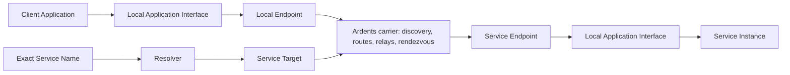

# Network functional map

Status: **product decomposition for research**

This map describes Ardents as a network product. It separates the mandatory
carrier contract from Application behavior and from optional Overlay Services.

Status labels:

- **fixed** — already follows from an accepted product decision;
- **working** — recommended baseline for focused research, still reversible;
- **open** — no product commitment yet.

## Product boundary

The network connects Applications to Service Targets. It does not send product
messages between infrastructure Node IDs, and it does not need a User identity
in order to carry a connection.

## Baseline product requirements

| ID | Requirement | Status | Evidence or decision still needed |
|---|---|---|---|
| NET-01 | A User or Developer can start a local endpoint and join the public carrier without a central account, phone, email, or wallet. | fixed | R-009 defines hostile bootstrap and Bridge recovery. |
| NET-02 | The addressable application object is a location-independent Service Target. A Node ID and User identity are never substituted for it. | fixed | R-006 selected a portable Service Authority: ordinary migration preserves the target; loss or compromise replaces it. |
| NET-03 | A Developer can expose one active V1 Service Instance without publishing its ordinary origin address to Users. | fixed | R-002 defines the exact listen/accept contract. Delegated multi-instance operation is not a V1 promise. |
| NET-04 | An exact human-readable Service Name can resolve verifiably to a Service Target. Ardents does not index or recommend Unlisted Services. | fixed | R-003 defines registration, private resolution, recovery, expiry, and governance. |
| NET-04A | An existing external Application can use a local socket/proxy-style Application Interface without embedding a mandatory Ardents SDK or networking library. An SDK is only a convenience wrapper and adds no network behavior or guarantee. | fixed | R-002 P1-D1; concrete local protocol and operating-system binding remain open. |
| NET-04B | Application traffic and Service administration are separate privilege boundaries. The Connection Interface exposes connection and byte-stream operations; Service Authority, publication, and configuration require a separately authorized Service Administration Interface. | fixed | R-002 P1-D3 fixes the logical boundary and P1-D7 fixes its Local Grant model. Concrete operating-system enforcement remains open. |
| NET-04C | An outbound connection accepts either an exact Service Name or a Service Target. A name is verifiably resolved to its current target; a target bypasses naming. Success requires authentication of that exact target, which is available in the authoritative connection result. | fixed | R-002 P1-D4 fixes destination forms and the success boundary. No failed resolution or authentication silently falls back to another namespace, target, or ordinary network. |
| NET-04D | Every Application Interface operation is authorized by a narrowly scoped Local Grant: connection use, per-Service administration, or Service Authority custody. An Endpoint Owner controls grants only on that endpoint; no global administrator, shared admin token, or central approval is required to join, connect, or publish. | fixed | R-002 P1-D7 fixes local authority and non-centralization. R-012 must ensure naming, bootstrap, releases, and emergency governance do not recreate one mandatory operator. |
| NET-05 | The V1 Application Interface exposes one live, bidirectional, reliable, ordered byte stream without message boundaries. Closure or failure is explicit; datagrams, offline retention, exactly-once delivery, and automatic replay are not provided. | fixed | R-002 P1-D2 fixes the primitive, P1-D5 its failure contract, and P1-D8 its resource and backpressure boundary. |
| NET-06 | Service Connections authenticate the intended Service Target and protect Application Data end to end from carrier Nodes. | fixed | R-001 P2-D3 forbids plaintext at every carrier role; R-002 defines what authentication is exposed to the Application. |
| NET-07 | The Service does not learn the User's ordinary location, the User does not learn the Service Instance's ordinary location, and no one ordinary Node links either endpoint location to a Service Name, Service Target, or opposite endpoint within the Interactive Route contract. | fixed | R-001 P2-D1 fixes the outer claim and P2-D3 fixes single-Node knowledge. P2-D4 through P2-D7 still define collusion, active attacks, conditions, and falsification before R-004 compares routing families. |
| NET-07A | The Interactive Route does not promise resistance to a Broad Traffic Observer correlating timing and volume near both endpoints or across enough network locations. A stronger delayed, padded, or cover-traffic-heavy profile is optional and separate. | fixed | R-001 P2-D1 fixes the honest limitation. R-005 requires a concrete Application job and measurable advantage before adding another Route Profile. |
| NET-07B | A Local Traffic Observer may know the adjacent endpoint's ordinary location and observe external peer addresses, timing, duration, direction, volume, and retry patterns. The protocol does not directly expose the opposite endpoint's ordinary location, the selected Service Name or Service Target, Application Data, or the full Route; hiding Ardents use or preventing timing inference is not promised. | fixed | R-001 P2-D2 fixes the one-edge observation boundary. P2-D3 through P2-D7 still define intermediary knowledge, collusion, active attacks, conditions, and falsification. |
| NET-07C | The Interactive Route is multi-hop for Route Knowledge Separation. An endpoint-adjacent Node may know that endpoint's ordinary location; an interior or Rendezvous role knows only adjacent Nodes. Every role is limited to its immediate peers, required role data, traffic metadata, and short-lived opaque route handles. No ordinary Node receives the full Route, Application Data, or a link between an endpoint location and a Service Name or Service Target. | fixed | R-001 P2-D3 rejects direct P2P and a single trusted proxy. R-004 selects the route family and hop count; R-011 validates rather than assumes independent control; R-023 bounds performance cost. |
| NET-08 | Every locally authorized Application receives a distinct default Isolation Context and may request additional opaque contexts. Different contexts cannot share linkable routing or session state; no context is transmitted as a User, Service, or network identity. Missing explicit input always selects the Application's safe default, never a global shared context. | fixed | R-002 P1-D6 fixes the interface and safe default. R-004 must enforce the boundary in the selected routing design and measure its cost. |
| NET-09 | A Connection Result reports only a supported product-level class: destination or resolution failure, local denial or resource limit, Service unavailable, Route unavailable, target authentication failure, local timeout or cancellation, clean close, connection loss, or indeterminate failure. Unsupported distinctions are never guessed; Node identities and route internals are not exposed. | fixed | R-002 P1-D5 fixes the Application Interface contract. R-007 must determine when network evidence supports each availability class and how bounded route retry reaches it. |
| NET-10 | Blocking ordinary entry addresses or one path has a bounded recovery route that does not require protocol expertise from a User. | fixed | R-009 defines discovery and probing resistance. |
| NET-10A | Transport Camouflage is best-effort: Ardents avoids one mandatory stable network fingerprint and aims to make confident classification or blanket blocking require active analysis or meaningful collateral blocking of ordinary traffic. It never promises invisibility or guaranteed indistinguishability. | fixed | R-001 P2-D2 fixes the product boundary. R-009 defines and measures replaceable Bridges, transport agility, classification resistance, and blocking cost. |
| NET-11 | Ordinary routing and Service reachability can use independently operated Nodes without one mandatory carrier operator. No Endpoint Owner becomes a network administrator or approval root. | fixed | R-002 P1-D7 excludes global local-interface authority. R-010 through R-012 and R-020 define abuse cost, diversity, control roots, and contributor sustainability. |
| NET-12 | Resource budgets are finite and hierarchical: Endpoint → Local Grant/Application → Service or Isolation Context → connection and operation. Creating child scopes never increases the parent budget; slow consumers receive stream backpressure; overload rejects or terminates work explicitly; one Application cannot monopolize the Endpoint. | fixed | R-002 P1-D8 fixes the local contract. R-007 and R-010 define network retry and hostile admission; R-023 sets measured budgets. |
| NET-13 | Every privacy, availability, and decentralization claim is shown as a Route Profile or another testable contract with an honest limitation. | fixed | R-001 P2-D1 through P2-D3 establish the broad-observer, local-observer, and single-Node boundaries; the remaining R-001 decisions and threat model complete the claim matrix. |
| NET-14 | Security and performance are coequal gates. Connection setup latency, throughput, tail latency, CPU, memory, fairness, and overload recovery are measured under honest and adversarial load; performance work cannot bypass authentication, isolation, or resource bounds. | fixed | R-002 P1-D8 fixes the interface principle. R-023 defines V1 budgets and R-004 tests candidate routing families against them. |

## End-to-end product functions

| Function | User-visible outcome | Network responsibility |
|---|---|---|
| Start and join | Ardents becomes ready without creating a public User account. | Discover enough current network state, validate it, select entry, and expose degraded or blocked state. |
| Create Service | A Developer receives a machine Service Target and a protectable Service Authority. | Require a narrowly scoped Authority Custody grant; create or import authority without reusing a Node or User identity. |
| Publish Service | One active local server becomes reachable inside Ardents without a public origin address. | Require per-Service administration, bind incoming Service Connections to the selected local endpoint, and publish authenticated expiring reachability without exposing raw Service Authority to the Application. |
| Name Service | The Developer can share a human-readable name rather than a cryptographic address. | Bind and verify Service Name to Service Target; expose expiry, conflict, and recovery state. |
| Resolve exact name | A User reaches a known Unlisted Service without browsing a directory. | Resolve privately enough for the accepted adversary and reject invalid, stale, or equivocating records. |
| Establish connection | The Application supplies a Service Name or Service Target and reaches the authenticated target or receives an explicit failure. | Resolve a supplied name when needed, discover current service reachability, construct routes, rendezvous endpoints, authenticate the exact Service Target, expose that target in the connection result, and negotiate the transport. |
| Exchange data | An existing application protocol can operate with measurable latency and throughput without understanding Ardents routing. | Carry opaque bytes under the accepted stream, confidentiality, integrity, congestion, fairness, and hierarchical resource contracts. |
| Isolate context | Separate Applications or logical profiles are not linked merely because they share one local endpoint. | Assign a safe per-Application default, accept optional additional contexts, keep them network-invisible, and prevent forbidden route or session sharing across them. |
| Recover connectivity | A broken path or blocked entry does not look like successful delivery. | Perform only safe bounded network recovery, then return a supported failure class or an honest indeterminate result without exposing route internals. |
| Contribute | A person can supply a bounded network role and leave predictably. | Advertise role and limits, reject unsafe configuration, observe health, update, and withdraw responsibility. |
| Inspect trust | Users can see what the current privacy and decentralization claim depends on. | Expose Control Plane roots, software provenance, concentration, route state, and known limitations without logging application behavior. |

## Network versus Application responsibility

| Concern | Ardents network owns | Application or Overlay owns |
|---|---|---|
| Destination | Direct Service Target reachability and optional exact Service Name resolution to an authenticated target; no silent destination fallback. | User IDs, resources, rooms, accounts, paths, and application-specific addresses. |
| Live transport | The accepted Service Connection semantics, end-to-end target authentication, resource bounds, and explicit network failure. | Request/response format, object schema, semantic acknowledgements, idempotency, and reconnect policy. |
| Data meaning | Nothing beyond opaque bytes and protocol-safety limits. | Whether bytes are HTTP, chat, files, synchronization, commands, or another protocol. |
| User identity | No required network-wide User identity. | Login, Personas, contacts, credentials, groups, and account recovery when an Application needs them. |
| Authorization | Endpoint-local grants separated into connection use, per-Service administration, and Service Authority custody; no grant is a network identity or global approval. | Who may read, write, join, administer, or invoke an operation inside the Service protocol. |
| Connection isolation | A distinct local default per Application and enforcement that different Isolation Contexts share no linkable route or session state. | Whether one Application deliberately reuses a context across its own profiles and accepts the resulting linkability. |
| Performance and resources | Hierarchical finite budgets, backpressure, fair scheduling, explicit overload, and measured security overhead for the network path and Application Interface. | Application workload, payload processing, concurrency within its Local Grant, and any stricter application-level limits. |
| Persistence | Short-lived buffers strictly required to operate a live connection. | Databases, history, offline queues, retained delivery, content pinning, deletion, and backups. |
| Availability | Finding routes to a currently published Service and surfacing failure. | Keeping the V1 Instance online; multihoming, state replication, and application-level failover require a later explicit contract. |
| Retry | Safe bounded routing attempts before an explicit Connection Result; never replay Application Data as a new operation. | Reissuing an operation, deduplication, exactly-once illusions, and user-visible recovery. |
| Application execution | No arbitrary remote code execution in the carrier. | Local server, browser, application runtime, sandbox, and content rendering. A Reference Application may package these separately. |
| Abuse | Protect shared carrier capacity from flooding and Sybil capture. | Service moderation, unsolicited content, domain policy, and application admission. |
| Updates | Ardents endpoint, protocol, and Control Plane update integrity. | Service code, content, schema migration, and client compatibility. |

## Named Unlisted Site tracer

The tracer is deliberately ordinary above the network boundary:

1. a Developer starts a local HTTP server;
2. the Service Publisher exposes it as a Service Target and binds a Service Name;
3. a reference client resolves the exact name and opens a Service Connection;
4. HTTP request and response bytes cross the connection unchanged;
5. a failed path is rebuilt or reported, and an offline Service is never shown as
   having received a request;
6. an ordinary host migration imports the Service Authority and preserves both
   Service Target and Service Name;
7. a compromise drill creates a replacement target and keeps only the Service
   Name stable.

This tests the whole network control and data path. It does not make HTTP, a
browser, static content replication, or decentralized hosting mandatory Ardents
primitives.

## Candidate extensions, not baseline requirements

The following remain legitimate future products but must not constrain the core
before a concrete Application requires them:

- unreliable or message-oriented datagrams;
- several active Instances and bounded per-Instance delegation;
- delayed or cover-traffic-heavy Route Profiles;
- retained offline delivery and notifications;
- signed replicated content and origin-independent site availability;
- restricted discovery or network-assisted Service admission;
- reusable application identity, Contacts, Spaces, Credentials, or Capabilities;
- a bundled browser, sandboxed application runtime, or package format;
- contributor payments, markets, staking, or public-goods funding;
- gateways to other networks.

## Scope rule

A function enters the network core only when an Application cannot safely and
reasonably supply it above the Application Interface, multiple distinct
Applications require the same semantics, and its metadata and abuse costs are
understood. Shared convenience alone is not enough to make a feature a network
primitive.
