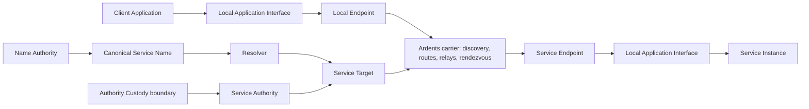

# Network functional map

Status: **accepted product requirements registry and C0 boundary input**

This map describes Ardents as a network product. It separates the mandatory
carrier contract from Application behavior and from optional Overlay Services.
Lifecycle and release behavior are defined in the accepted
[product operating model](operating-model.md). The authoritative maintained and
audit boundary is [product scope](scope.md).

Status labels:

- **fixed** — already follows from an accepted product decision;
- **working** — recommended baseline for focused research, still reversible;
- **open** — no product commitment yet.

These labels describe **decision maturity only**. They never mean “implement in
the current slice.” A fixed Public Beta or Stable Network gate remains outside
the backlog until explicitly selected. Historical `V1` wording in this
registry means the first public product contract, not the C0 audit candidate or
the next code change.

## Current implementation boundary

The maintained tree composes one explicit headless Network C0 candidate and a
separate Application/Browser candidate from accepted contracts. Neither is a
usable, released, or qualified public product. Completed experiments and
campaign implementations are historical provenance, not candidate surfaces.
Public discovery/contribution, Bridges, permissionless operation, platform
qualification, general Application isolation, and the full NET-14 matrix
remain later gates unless separately selected.

The eventual public product still requires the fixed contracts below, but this
registry is not one release checklist or backlog.

Candidate-specific records such as `NET-07H` through `NET-07M` and `NET-15`
describe a coherent design package and its eventual claim conditions. They do
not freeze that package as the production architecture or place all of it in
Carrier Lab. The lab implements only the route and Introduction subset named in
[scope](scope.md); later enforcement and control mechanisms require separate
promotion and may be replaced after evidence from the lab.

## Product boundary

The network connects Applications to Service Targets. It does not send product
messages between infrastructure Node IDs, and it does not need a User identity
in order to carry a connection.

## Accepted requirements registry

| ID | Requirement | Status | Evidence or decision still needed |
|---|---|---|---|
| NET-01 | A User or Developer can start a local endpoint and join the public carrier without a central account, phone, email, or wallet. | fixed | R-009 defines hostile bootstrap and Bridge recovery. |
| NET-01A | V1 runs the local Ardents endpoint and publishes ordinary local Applications on Windows 11 and Ubuntu LTS `x86-64` desktop/laptop devices. Ubuntu LTS is the sole Linux qualification baseline. Infrastructure performance is gated on an Ubuntu LTS `x86-64` `2 vCPU`, `2 GiB RAM`, symmetric `100 Mbit/s` reference VPS. Other Linux variants receive no V1 claim; macOS and mobile are later targets. | fixed | R-023 P3-D1 fixes endpoint roles, P3-D3b3 fixes the VPS class, and P3-D6b2b1 fixes the OS families, architecture, and endpoint hardware class. Exact candidate images, CPU model, network inputs, and remaining numeric budgets are retained measurement details. |
| NET-01B | An authenticated Windows or Ubuntu deployment creates an unprivileged local Endpoint, not an account, Service, or Contributor Node. Distribution is separate from threshold release authority; development, test, and public roots never share state. Repair, update, and removal distinguish Authority Vault, Local Grants, security watermarks, disposable cache, ephemeral Route state, and diagnostics. An Authority Recovery Bundle is a versioned encrypted root plus authority-owned monotonic commitments and signing watermarks; it excludes Local Grants and runtime Instance Keys. Test restore is isolated and non-signing, and post-restore signing remains `authority locked` until authenticated reconciliation permits a strictly higher generation/revision. Ordinary removal preserves watermarks and either retains a non-empty Vault or blocks until an Owner-chosen Recovery Bundle export verifies; destructive authority/watermark purge is a separate explicit irreversible action. | fixed | R-024 and ADR-0003 close the deployment and recovery lifecycle. Exact Distribution Profile formats, platform signing, secure-storage binding, Recovery Bundle encoding, and TUF implementation remain R-050/R-053. |
| NET-01C | Every capability first requires the Common Readiness Base: authenticated active build, current non-revoked Release Safety State, compatible Network Epoch, sufficient Time Confidence, and finite local resources. Target Connect, Private Name Resolution, Publish, and Contribute then add independent role-specific prerequisites; none inherits another's Entry path. Existing work has a finite Work Safety Lease no later than every applicable epoch, release, protocol/build, credential, and role terminal bound; only authenticated refresh may extend it. `Disabled/unconfigured`, `authority locked`, `probation/draining`, `blocked`, `stale`, `clock uncertain`, `conflicting/forked`, `incompatible`, `update state unavailable`, `update required`, `build revoked`, `unqualified`, and local resource exhaustion are explicit outcomes. | fixed | R-024 closes capability readiness, Time Confidence, and the fate of live work after safety expiry. R-023's existing startup numbers measure Target Connect Ready only; every other usable capability needs its own platform budget before release. R-013 selects mechanisms. |
| NET-01D | A qualified public V1 Contributor runs on a dedicated host/installation with no User connection or Service publication role. Co-resident development Nodes are unqualified and supply no public capacity/independence evidence; an Endpoint excludes Contributor identities/families it controls from its own Routes. Client and Publisher may coexist with separate grants and Initiator/Responder/Introduction Entry Sets, but receive no same-host unlinkability claim and require a separately qualified combined resource profile. | fixed | R-024 closes role co-residence. It avoids turning a protected endpoint into public infrastructure under an unmeasured profile. Exact deployment enforcement and combined Client+Publisher performance are R-013/R-023 work. |
| NET-01E | A Direct-Origin Source may see requester origin and a public bootstrap/materialization/time/update artifact, so a globally advertised source identity/known family cannot also be Route or Destination Resolution eligible during the same assignment. Before direct contact, the Endpoint rejects any source already present in still-valid retained Entry/Interior/Introduction/prepared-role state or live Route/Resolution work; after contact it retains the authenticated identity/family in one bounded Endpoint-wide Direct Source Exposure Set and excludes it until the exposure lease and all state/work derived from that contact terminate. Source order, retries, set growth, and local candidate skipping are finite and endpoint-precommitted; an unexpected authenticated conflict or exhaustion is explicit unavailability unless bounded Owner-approved Entry replacement was already permitted and counted. Context creation never resets the set. | fixed | R-024 closes direct-source role combination. An ordinary carrier peer serving bytes is locally quarantined rather than globally reclassified; an unauthenticated external/CDN source remains a first-contact and hidden-control non-claim. Every mandatory pre-Route artifact class has three beta/five stable effective authenticated source families with `40%`/`25%` caps; the same source families may serve several classes, but unauthenticated distribution does not count. Exact sequence, exclusion-union bound, and expiry parameters remain R-013 work. |
| NET-01F | Windows and Ubuntu support Installed and Portable Distribution Profiles for each release: Installed wraps the exact authenticated platform executable released directly as Portable and owns package/registration conveniences. Portable is that executable plus only unavoidable authenticated non-secret static configuration templates/resources; the Owner verifies it before execution, then copies, runs, stops, replaces, or deletes it without a separate installer or implicit system registration. Mutable configuration and protected state stay outside the program artifact. When the exact authenticated executable is run, both profiles expose the same Client/Publisher capabilities, Application Interfaces, resource limits, state compatibility, and claim ceilings; their pre-execution custody and install/update/remove ergonomics need not be identical. A raw executable cannot authenticate itself after untrusted bytes already execute. Moving or deleting program bytes does not silently move, merge, or delete Vault, Grants, roots, watermarks, network state, or Endpoint identity. | fixed | Product Owner accepted the two relatively equivalent profiles and clarified the deliberately small Portable scope on 2026-08-20. R-050 must freeze the exact Portable artifact contents, pre-execution verification, stopped replacement, state-root locking, and Installed lifecycle on both supported platforms. |
| NET-02 | The addressable application object is a location-independent Service Target. A Node ID and User identity are never substituted for it. A Target Link is its tagged versioned shareable form, unambiguously distinct from a Service Link and bound to the Ardents network and target algorithm without origin or mutable reachability. It bypasses naming without bypassing target authentication or Route requirements. | fixed | R-006 selects the target lifecycle and R-024 prevents an unfinished Namespace from blocking the carrier. A failed Name never becomes a Target Link implicitly. Exact target-link encoding remains R-015 protocol work. |
| NET-03 | A Developer can expose one active V1 Service Instance generation without publishing its ordinary origin address to Users. The host generates a private Service Instance Key, while Service Authority signs a public bounded Credential binding that public key, Target, exclusive generation, validity, network, and capabilities. Copying the Credential alone grants no power; routine migration creates a new key and higher generation rather than exporting the old key. | fixed | R-006 H1b and ADR-0003 separate durable Service Authority, private runtime Key, and public Credential. Delegated concurrent multi-instance operation is not a V1 promise. |
| NET-04 | An exact human-readable Service Name can resolve verifiably to a Service Target. Ardents does not index or recommend Unlisted Services. | fixed | R-003 P4-D1 through P4-D6 fix the complete Service Name product contract: authority, one Namespace, permissionless leased claims, syntax, lifecycle, recovery, Private Resolution, governance, and abuse boundaries. Exact mechanisms remain research. |
| NET-04A | An existing external Application can use a local socket/proxy-style Application Interface without embedding a mandatory Ardents SDK or networking library. An SDK is only a convenience wrapper and adds no network behavior or guarantee. | fixed | R-002 P1-D1; concrete local protocol and operating-system binding remain open. |
| NET-04B | Connection use, Service administration, and Authority Custody are three non-collapsing privilege boundaries. The Connection Interface exposes connection and byte-stream operations. The Service Administration Interface publishes and configures one Service using an already authorized public Credential and matching non-exportable private Instance Key. A separately granted Authority Custody boundary alone may create/import/export/reconcile/sign with Service or Name Authority, issue a Credential, rotate/transfer Name Authority, or initiate replacement with a new Service Authority and Target. V1 has no in-place Service Authority rotation; neither lower boundary can export root or Instance keys. | fixed | R-002 P1-D3/P1-D7, R-006, and R-024 fix the privilege lattice and Target lifecycle. Local vault-wrapping keys may rotate without changing Authority. Concrete operating-system enforcement and secure-storage binding remain R-013 work. |
| NET-04C | An outbound connection accepts either an exact Service Name or a Service Target. A name is verifiably resolved to its current target; a target bypasses naming. Success requires authentication of that exact target, which is available in the authoritative connection result. | fixed | R-002 P1-D4 fixes destination forms and the success boundary. No failed resolution or authentication silently falls back to another namespace, target, or ordinary network. |
| NET-04D | Every Application Interface operation is authorized by a narrowly scoped Local Grant bound to one OS-enforced or launcher-brokered Application Principal/process tree: connection use, per-Service administration, or Authority Custody. A desktop account, PID, loopback port, or copyable bearer alone is insufficient; applications the platform cannot distinguish are one local trust domain and receive no malicious-sibling isolation claim. Revocation immediately denies new work and invalidates descendant session capabilities; custody/admin sessions close immediately, while data connections close immediately unless the Owner preselected a finite drain-then-revoke action. Persistent policy may survive restart, but process/session bearers do not and require fresh principal binding. An Endpoint Owner controls grants only on that endpoint; no global administrator or central approval is required. | fixed | R-002 P1-D7 and R-024 fix local authority, revocation, and non-centralization. Windows/Linux hostile tests cover sibling attachment, bearer theft/replay, PID reuse, and restart; failure narrows the supported Application model to broker-launched/isolated apps rather than weakening the claim. R-012/R-024 keep network control roots separate. |
| NET-04E | Every Service Name has a distinct Name Authority controlling its authenticated Name Record independently of Service Authority. Name Authority is not a User, Target, Instance, Node, publication permission, or Application authorization and is unnecessary for ordinary publication, resolution, or connection. | fixed | R-003 P4-D1 fixes the separation required by R-006 catastrophe recovery. A lost or compromised Service Authority creates a replacement Target and uses independently held Name Authority to rebind the stable name; direct Target connections never follow that update. Co-locating both authorities is an explicit custody risk. P4-D4 fixes successor transitions and optional Recovery Policy; P4-D5 fixes Private Resolution; P4-D6 forbids administrative seizure and unilateral naming rules. |
| NET-04F | V1 uses one canonical network-wide Namespace: the same complete Service Name has the same Name Record for every honest compatible client with the same valid state. Canonical names may be hierarchical with bounded subordinate delegation. | fixed | R-003 P4-D2a fixes shared meaning without selecting one server, administrator, registrar, ledger, or operator set. Local aliases are visibly non-canonical; a failed resolution never silently tries another namespace, ordinary DNS, search, or a same-looking alias. Conflicting or unavailable canonical state fails explicitly. Global uniqueness adds no listing, authorization, or secrecy. P4-D2b fixes permissionless initial control; P4-D2c fixes explicit lowercase ASCII dot hierarchy with the parent on the right. |
| NET-04G | A root-level canonical Service Name is acquired without administrator approval through the first valid claim in deterministic shared Namespace order. The claim creates a renewable time-bounded Name Lease for a Name Authority, not permanent property, identity, a Target, or publication permission. An active parent Name Authority may issue bounded subordinate names inside its subtree. | fixed | R-003 P4-D2b fixes permissionless leased allocation. Concurrent or partitioned claims cannot create resolver-selected controllers; unresolved order is explicit conflict or unavailability. P4-D6 and R-010/R-024 fix bounded Anonymous Cost without a global account, identity document, money, IP reputation, stable identity, wallet, token, or registrar and make no personhood, fairness, or anti-squatting guarantee. Exact claim and cost mechanisms remain experiments. |
| NET-04H | A canonical V1 Service Name consists of one or more non-empty dot-separated labels using only lowercase ASCII `a-z`, digits `0-9`, and hyphen `-`; Unicode, IDNA, and Punycode are not canonical V1 forms. Its explicit shareable form is `ardents://<Service Name>`. | fixed | R-003 P4-D2c fixes an Ardents-scoped Service Link rather than a DNS domain or public TLD. The scheme is not part of the Service Name, and dot hierarchy grants no DNS trust or lookup behavior. Invalid or unavailable Ardents resolution never falls back to DNS. Exact finite label, total-length, and depth limits remain protocol-validation parameters. |
| NET-04I | Every Name Lease moves from Active to finite Grace and then Released unless its current Name Authority renews it. Grace preserves the same Name Generation, exclusive renewal, and resolution with a visible warning. Released names resolve nothing and may be claimed into a new generation that cannot revive any old record, signature, delegation, or descendant. | fixed | R-003 P4-D3 fixes the observable state machine. Record revisions are monotonic inside one generation. A child may end earlier but never outlive its parent; parent Release disables all descendants, and parent reclaim revives none. Cached evidence has bounded freshness and uncertain current generation, revision, lease, or parent state fails explicitly. Exact durations, clocks, cache intervals, and convergence mechanism remain research parameters. |
| NET-04J | The current Name Authority may authenticate one successor rotation or transfer inside the same Name Generation; the former authority then loses all future power. Optional recovery exists only through a generation-bound Recovery Policy committed before the incident, using scoped Recovery Authorities, a threshold, and visible delay. | fixed | R-003 P4-D4 fixes authority lifecycle without a help desk or registrar. Recovery Policy survives routine rotation or transfer, and changing it is itself delayed and visible. Accepted recovery enters bounded Recovery Pending: name resolution fails closed, ordinary transitions cannot bypass it, and successful recovery requires the successor to issue a fresh Name Record before resolution resumes. Without a usable policy there is no guaranteed recovery. Exact keys, thresholds, delays, contest rules, and cryptography remain research parameters. |
| NET-04K | Private Resolution prevents any one ordinary Node acting only from its permitted role-local view from learning both the querying endpoint's ordinary location and exact Service Name. An entry role may know location but not a publicly testable name lookup value; a naming participant may know the name or lookup value but receives no User location or network-generated stable User identifier. | fixed | R-003 P4-D5 applies multi-node knowledge separation and Isolation Context separation to resolution and name-control operations. The condition excludes an adversary that also controls an endpoint, direct-origin contact, or second observation role. Unlisted names have no list, search, recommendation, or public browsing API but are not secret: predictable names and lookup values may be guessed, enumerated, inferred, and counted. Same-context repetition, query popularity, colluding roles, Correlated Control, and Broad Traffic Observation remain honest limitations. Unavailable private resolution fails closed without direct public resolver, DNS, HTTP, alternate-namespace, or less-private fallback. |
| NET-04L | Every Service Target, including one obtained from a Target Link, uses Private Reachability Resolution to obtain its current authenticated Service Descriptor; no direct descriptor source or public fallback learns both origin and Target/testable lookup. Destination Resolution roles are limited to Rendezvous-domain identities, and every identity/known family used for an exact destination/context is excluded from that connection's Rendezvous. Resolution retries and distinct identities are bounded. | fixed | R-024 closes the Target-Link lookup gap without adding a fifth global Role Domain. Exact private lookup/PIR construction, replication, exclusion set, and bounds remain R-013 and qualification work. A Node-plus-endpoint active timing/volume confirmation remains the explicit NET-07D non-claim. |
| NET-04M | A Service Connection preserves the exact supplied Destination Binding. Name/Service-Link input binds authenticated Name generation/revision→Target into its Work Safety Lease: same-Target renewal or Grace may extend it, but learned Recovery Pending, Release, or rebind to another Target stops new leg/recovery work and closes by a finite deadline without silently retargeting the stream. Target/Target-Link input stays pinned and deliberately has no Name rescue. | fixed | R-003/R-006/R-024 make catastrophe recovery effective for future and live Name-origin use without violating exact-target semantics. The Application reconnects to a replacement Target; explicit Target users require external trust redistribution after root compromise. Exact deadlines remain R-013 protocol work. |
| NET-04N | Canonical Name Leases cannot be seized, blocked, transferred, or reassigned by an administrator, project, registrar, legal claimant, trademark process, or manual dispute panel. Only a finite versioned set of Protocol-reserved Names may exist for technical safety. Local filters may refuse a name but cannot alter its canonical meaning. | fixed | R-003 P4-D6 fixes non-administrative governance and bounded Anonymous Cost, requires inspectable rules and transition evidence without query logs, and makes incompatible forks explicit. No single operator may change canonical state. If no accessible, private, convergent, and decentralized mechanism satisfies this contract, root names are redesigned or removed rather than centralized. |
| NET-04O | Ardents protects only traffic submitted to its Application Interface. A user-visible private-site/application claim additionally requires a qualified Network-Isolated Application Boundary at both endpoint Applications: allow only scoped local IPC/loopback with Ardents; deny ordinary network ingress/listeners, DNS, and direct socket/network egress; isolate origin/cache/storage by Isolation Context; and either route each explicit secondary destination through Ardents or fail it. A generic HTTP/SOCKS/stream or browser adapter remains supported for compatibility but must show that Application networking is unverified and receives no Application-level Endpoint Location Privacy claim; there is never transparent clearnet fallback. | fixed | R-002 P1-D9, R-024, and ADR-0007 close carrier-versus-Application networking gaps, including a public Publisher listener and malicious requests that provoke callback/SSRF behavior. V1 qualification uses a controlled single-response client and deterministic HTTP Service with no ordinary listener/egress. A general client or server profile becomes claim-bearing only after complete-process-tree ingress, egress, and storage-isolation tests on every supported platform. |
| NET-04P | The supported Ardents binary is a first-class local Client/Application Adapter in both Distribution Profiles and remains usable without a browser, extension, URI registration, daemon, or mandatory SDK. It accepts only explicit Ardents destination and operation input, crosses the same Application Broker/Connection Interface seam with the same Local Grant, Isolation Context, failure, and no-fallback rules, and exposes a bounded automation-friendly result/byte-stream surface. A co-resident command invocation honestly reports principal claim `none`; it does not invent an external IPC peer or malicious-sibling isolation. An optional browser companion adds no authority or network behavior. | fixed | The Product Owner accepted the binary-first path and R-056 O1 topology on 2026-08-20. R-085 limits the maintained Stage 8 implementation to a generic/unqualified Broker: it selects neither a native sandbox nor a supported-platform or Application Location Privacy claim. |
| NET-05 | The V1 Application Interface exposes one live logical Service Connection: a bidirectional, reliable, ordered byte stream without message boundaries whose lifetime may span bounded replacement of underlying Carrier Channels. Service Connection closure or failure is explicit; datagrams as an Application primitive, offline retention, exactly-once Application semantics, and automatic Application-operation replay are not provided. | fixed | R-002 P1-D2 fixes the primitive, P1-D5 its failure contract, R-023 P3-D4a fixes bounded same-connection recovery, and P1-D8 fixes its resource and backpressure boundary. |
| NET-06 | Service Connections authenticate the intended Service Target and current Service Instance Key/Credential proof, and protect Application Data end to end from carrier Nodes, including when all carrier roles collude, while endpoints and accepted cryptography remain uncompromised during the connection. Fresh authenticated ephemeral endpoint/session and per-leg keys provide Forward Secrecy: later compromise of Service Authority, Instance Key, Node long-term keys, or recorded ciphertext does not decrypt an honestly completed connection after best-effort erasure. A connection's terminal `not-after` cannot exceed Credential validity/Work Safety Lease; learned authenticated supersession may stop new leg/recovery work earlier. The intended endpoint Applications receive plaintext by design. | fixed | R-001 P2-D3/P2-D4 require payload protection independent of anonymity failure, P2-D5 fixes endpoint limits, and P2-D6 requires fail-closed active-attack handling. R-002/R-006 define authentication and bounded Instance authority. Live endpoint compromise, memory/snapshot erasure failure, and lack of post-compromise healing inside an existing connection are explicit limitations; exact AKE/suite remains R-013. |
| NET-06A | Target authentication, Route Profile binding, protocol freshness, control data, and Application Data integrity fail closed. Modified, injected, replayed, redirected, reordered beyond the stream contract, or downgraded data is rejected; a detected violation terminates the affected attempt or connection without silent fallback or Application Data replay. | fixed | R-001 P2-D6 fixes the invariant without selecting cryptography. Target substitution maps to target authentication failure when supported; established-stream integrity loss maps to connection loss; an indistinguishable cause remains indeterminate under R-002 P1-D5. |
| NET-07 | Ardents does not directly disclose the User's ordinary location to the Service, the Service Instance's ordinary location to the User, or an endpoint-origin-to-Name/Target binding to one ordinary Node acting only from its role-local view. This condition excludes a Node adversary that also controls/observes an endpoint, active confirmation source, direct-origin contact, or second observation role. | fixed | R-001 P2-D1 through P2-D7 fix the observer, role-local Node, combined-adversary, endpoint, active-attack, condition, and falsification boundaries; R-004 selects the Tor-shaped split-circuit family and separates source duties. Targeted timing/volume confirmation by a combined adversary is an explicit low-latency non-claim. |
| NET-07A | The Interactive Route does not promise resistance to a Broad Traffic Observer correlating timing and volume near both endpoints or across enough network locations. A stronger delayed, padded, or cover-traffic-heavy profile is optional and separate. | fixed | R-001 P2-D1 fixes the honest limitation. R-005 requires a concrete Application job and measurable advantage before adding another Route Profile. |
| NET-07B | A Local Traffic Observer may know the adjacent endpoint's ordinary location and observe external peer addresses, timing, duration, direction, volume, and retry patterns. The protocol does not directly expose the opposite endpoint's ordinary location, the selected Service Name or Service Target, Application Data, or the full Route; hiding Ardents use or preventing timing inference is not promised. | fixed | R-001 P2-D2 fixes the one-edge observation boundary; P2-D3 through P2-D7 refine Node, collusion, endpoint, active-attack, condition, and falsification handling. |
| NET-07C | The Interactive Route is multi-hop for Route Knowledge Separation. An endpoint-adjacent Node may know that endpoint's ordinary location; an interior or Rendezvous role knows only adjacent Nodes. Every role receives only immediate peers, required role data, traffic metadata, and short-lived opaque handles. No role-local ordinary Node is directly given the full Route, Application Data, or endpoint-origin-to-Name/Target binding. | fixed | R-001 P2-D3 rejects direct P2P and one trusted proxy. R-004 fixes the split-circuit family and logical positions; R-011 validates independence and R-023 bounds cost. Traffic inference from another observation source is not equivalent to a protocol field and remains separately limited. |
| NET-07D | The one-Node guarantee covers one malicious ordinary Node's role-local view only. A Node that also controls/observes an endpoint or active probe source can use distinctive timing/volume confirmation; correlated Nodes can combine views as well. V1 makes no anonymity promise for either combination, even when only one carrier Node is involved. Qualification must separately characterize bidirectional Node+endpoint active confirmation and retain correlation accuracy/false-positive evidence so public wording cannot hide the limit. | fixed | R-001 P2-D4 fixes this honest scope. R-004/R-011 reduce correlated-role exposure but cannot give a low-latency no-cover route traffic-confirmation resistance. A stronger multiparty/confirmation-resistant profile requires R-005 product evidence. |
| NET-07E | Ardents provides Endpoint Location Privacy for traffic that crosses the qualified Ardents boundary, not automatic Application anonymity. A Service receives no User origin, Route, Isolation Context, or network-generated stable User ID, but can link credentials, content, fingerprints, timing, volume, and behavior visible to its Application. A User knows the Service Name or Service Target and receives Service output, but not the Service Instance origin, Route, or Service Authority. An Application with an ordinary-network listener/ingress or independent egress can disclose either endpoint despite a correct Route. | fixed | R-001 P2-D5 fixes malicious-endpoint knowledge; NET-04O fixes the Application-network-isolation precondition for a stronger claim. R-002 P1-D6 prevents network-state reuse across Isolation Contexts; Applications own semantic identity, content safety, and fingerprint resistance. |
| NET-07F | The Application Interface and logical Service Connection remain stable across versioned Route Profiles. A profile may replace route family, hop shape, introduction, rendezvous, multipath, padding, mixing, cover traffic, or Carrier Channel Adapters below that boundary. The exact selected profile is authenticated; unsupported profiles and incompatible capabilities fail explicitly rather than silently selecting a weaker route. | fixed | R-004 P5-D1 fixes a deep Route Module seam without selecting its implementation. Route and session state are separated by Route Profile and Isolation Context, and every distinct Implementation qualifies independently. R-005 may justify a stronger profile without rewriting Applications, naming, identity, or Service publication. |
| NET-07G | An Introduction role may hold a short-lived service-specific opaque slot and its operator may independently learn a public Service Name or Service Target exactly as any User can. This knowledge alone is not an anonymity failure. The role receives neither endpoint's ordinary location, cannot combine that state with a Service-adjacent entry view for the same Service or connection attempt, and must not link the Name or Target to a User or Service origin. | fixed | R-004 P5-D2 reconciles public exact-name access with the enforceable Route Knowledge Separation claim. It does not make names secret or authorize a combined Entry/Introduction role for one Service attempt. P5-D4 separately prevents the Rendezvous from acting as the introduction forwarder. Protocol-derived slot material remains minimized, expiring, and sealed; external knowledge never permits extra route state. |
| NET-07H | The baseline Interactive Route carries Application Data through five symmetric logical carrier positions: `User -> User Entry -> User Interior -> Rendezvous -> Service Interior -> Service Entry -> Service`. A qualifying attempt assigns each position to a different ordinary Node. Three positions remain only an explicitly unqualified performance control, and the asymmetric four-position shape is rejected. | fixed | R-004 P5-D3 fixes the smallest reviewed shape satisfying the accepted no-full-Route rule on both endpoint legs. It does not select Tor, a routing protocol, a library, cryptography, a wire format, or a programming language; different Node IDs still do not prove independent control, and the limitation against collusion and a Broad Traffic Observer is unchanged. |
| NET-07I | Before the data Route is joined, the User sends one sealed, expiring, single-use invitation over an Introduction Path that does not traverse the selected Rendezvous. The Service validates it, independently selects its data leg, and attaches to the proposed Rendezvous. Introduction carries no Application Data, retained message, or offline-delivery semantics; after acknowledgement it is no longer part of that connection attempt. | fixed | R-004 P5-D4 fixes separate introduction as the baseline role boundary. The User may prepare it in parallel with the Rendezvous leg and may perform only bounded retry through another advertised Introduction role. C1 Rendezvous-forwarding remains an unqualified performance experiment, not a silent fallback. Exact path depth, cryptography, wire protocol, and implementation remain research parameters. |
| NET-07J | Each endpoint independently selects its own Entry and Interior positions. V1 has ordinary and Bridge regimes and at most one small long-lived Entry Set for each activated adjacent Role Domain × regime: Initiator, Responder, or Introduction. Co-resident client/publisher roles use separate domain sets. Applications, Services, Targets, generations, contexts, destinations, and Bridge Invites cannot create sets or force rotation; every Bridge key is eligible for one adjacent domain only. The User selects a fresh Rendezvous for each new Service Connection, retained only for bounded retry or leg replacement of that attempt/connection. | fixed | R-004 P5-D5, R-009, and R-024 bound cumulative first-hop exposure while keeping per-context channels, keys, destinations, sessions, and recovery separate. One failure does not force fresh Entry sampling. Exact sizes, durations, weights, and rotation thresholds remain measured parameters. |
| NET-07K | Initiator Carrier, Rendezvous, Responder Carrier, and Introduction identities occupy four disjoint stable Role Domains. One Node Identity and one honestly declared operator family occupy only one authenticated finite assignment; new duty is eligible only if its maximum lifetime fits before assignment `not-after`. Reassignment stops new work and quarantines identity/family until every old-domain duty terminates; emergency may close work but never overlap domains. Destination Resolution is restricted to Rendezvous-domain identities, and identities/families used for an exact destination/context are excluded from that connection's Rendezvous. | fixed | R-004 P5-D6/ADR-0005 make five data positions enforceable across hidden legs and prevent temporal domain overlap or endpoint-adjacent plus destination-aware identity/family overlap without a fifth capacity domain. Hidden common control, dishonest family declarations, Sybils, and Node+endpoint traffic confirmation remain limitations. Exact randomness/resolution mechanism remain R-013 gates. |
| NET-07L | The Network Epoch commits one logical complete, canonically ordered Candidate View: root, length, input-log cutoff/root, and global eligibility/capacity/concentration summaries. Endpoints select locally from deterministic Candidate Materializations with indexed proofs and verify their chosen material, not global completeness. Pre-cutoff Node Records are included or receive a verifiable deterministic rejection; independent full auditors recompute the View and summaries. Withholding retries the same index elsewhere or fails explicitly, never silently resamples. | fixed | R-004 P5-D7/P5-D8, R-024, and ADR-0004 separate global commitment, client materialization, and audit. Signers, distributors, Services, and carrier roles do not choose a User's complete Route. Exact log, sampling, weights, and auditor mechanisms remain R-013 experiments. |
| NET-07M | Same-connection recovery uses an endpoint-only continuity secret, fresh handles and route keys, monotonic route generation, exact Target/Profile/Context/transcript binding, and authenticated byte-range reconciliation. It may repair a channel, attach a new leg, or use fresh Introduction for a new Rendezvous without exposing a stable relay-visible connection ID. | fixed | R-004 P5-D9 closes the product attachment boundary. Replay, rollback, cross-target, cross-profile, cross-context, duplicate byte presentation, hidden reconnect, and Application-operation replay fail; timing correlation remains an explicit limitation. |
| NET-08 | Every locally authorized Application receives a distinct default Isolation Context and may request additional opaque contexts. Contexts share no Carrier Channel, circuit key, Interior, Rendezvous, destination/query cache, session, continuity secret, or route-derived failure history; no context is transmitted as an identity. Only immutable public state, bounded endpoint Entry exposure, and the Endpoint-wide Direct Source Exposure Set may be shared. | fixed | R-002 P1-D6 and R-024 close the realistic boundary: an Entry or directly contacted source already sees the common endpoint origin, while creating contexts cannot force fresh Entry/source sampling or reset exclusions. Missing explicit input still selects the Application's safe default, never a global shared context. |
| NET-09 | A Connection Result reports only a supported product-level class: destination or resolution failure, local denial or resource limit, Service unavailable, Route unavailable, target authentication failure, local timeout or cancellation, clean close, connection loss, or indeterminate failure. Unsupported distinctions are never guessed; Node identities and route internals are not exposed. | fixed | R-002 P1-D5 fixes the Application Interface contract. R-001 P2-D6 maps detectable active violations without inventing a new diagnostic class; R-007/R-024 fix positive evidence and bounded recovery behind each availability result. |
| NET-10 | Blocking ordinary entry addresses or one path has a bounded recovery route that does not require protocol expertise from a User. | fixed | R-009 defines discovery and probing resistance. |
| NET-10A | Transport Camouflage is best-effort: Ardents avoids one mandatory stable network fingerprint and aims to make confident classification or blanket blocking require active analysis or meaningful collateral blocking of ordinary traffic. It never promises invisibility or guaranteed indistinguishability. | fixed | R-001 P2-D2 fixes the product boundary. R-009 defines and measures replaceable Bridges, transport agility, classification resistance, and blocking cost. |
| NET-11 | Ordinary routing and Service reachability can use independently operated Nodes without one mandatory carrier operator. No Endpoint Owner becomes a network administrator or approval root. | fixed | R-002 P1-D7 excludes global local-interface authority. R-010 through R-012 and R-020 define abuse cost, diversity, control roots, and contributor sustainability. |
| NET-12 | Resource budgets are finite and hierarchical: Endpoint → Local Grant/Application → Service or Isolation Context → connection and operation. Creating child scopes never increases the parent budget; slow consumers receive stream backpressure; overload rejects or terminates work explicitly; one Application cannot monopolize the Endpoint. | fixed | R-002 P1-D8 fixes the local contract. R-007 and R-010 define network retry and hostile admission; R-023 sets measured budgets. |
| NET-12A | Client `64/16` and publisher `256/64` capacities are minimum V1 floors rather than ceilings. A supported endpoint derives conservative finite hierarchical budgets from resources available to its process and automatically selects no higher than a compatible qualified profile. The Endpoint Owner may cap lower; a finite higher experimental cap is unqualified. Operating below a floor is explicitly reduced local capacity, not a qualified V1 result. | fixed | R-023 P3-D3c1 fixes bounded scale-up and P3-D3c2c3c3 fixes saturation evidence. Extra capacity never grants a Node role, trust, authority, route priority, cross-context access, or security exception, and exact hardware or configured limits are not required network metadata. |
| NET-13 | Every privacy, availability, and decentralization claim is shown as a Route Profile or another testable contract with an honest limitation. | fixed | R-001 P2-D1 through P2-D7 establish the complete Interactive Route claim matrix. |
| NET-13A | A specific implementation candidate may present the Interactive Route privacy claim only after it earns Route Qualification through reproducible edge-traffic, Node-state, malicious-endpoint, Application Principal, Application-network isolation, Direct-Origin Source, Role Domain reassignment, isolation-context, and active-attack tests. Any forbidden disclosure or silently accepted substitution, modification, replay, redirect, overlap, escape, or downgrade fails qualification. Until then the implementation is research and cannot be presented publicly as an anonymous network. | fixed | R-001 P2-D7 and R-023 P3-D6a fix the gate. Broad Traffic Observer and sufficiently placed collusion correlation are explicit non-claims rather than hidden test successes or failures; conditions and limitations must remain user-visible. |
| NET-14 | Security and performance are coequal gates. Connection setup latency, throughput, tail latency, CPU, memory, fairness, and overload recovery are measured under honest and adversarial load on every required platform class; performance work cannot bypass authentication, isolation, or resource bounds. | fixed | R-002 P1-D8 fixes the interface principle. R-023 P3-D1 fixes V1 platform coverage, later R-023 decisions define numeric budgets, and R-004 tests candidate routing families against them. |
| NET-14A | On the normal non-adversarial reference network, an already running and joined endpoint opening an exact Service Name reaches an exact-target-authenticated, usable Service Connection within `p95 <= 3 s` cold, with no state prepared for the exact name, target, Isolation Context, and Route Profile, and within `p95 <= 1 s` warm, with current authenticated target data and reusable Route state for that same tuple but no open Service Connection. Eligible failures and timeouts count as misses. | fixed | R-023 P3-D2a fixes the product targets and P3-D6b2b2c2a fixes the exact state classes; NET-14AA/AB/AD/AE fix the controlled topology, sample floor, normal network envelope, and post-result canary. P3-D6b2b2c2b1 fixes the reproducible impairment manifest. Startup, join, first useful Application byte, degraded paths, and hostile conditions have separate budgets. |
| NET-14B | On the normal non-adversarial reference network, an active Ardents process reaches **Target Connect Ready** within `p95 <= 5 s` on a routine restart that may retain valid authenticated persistent state but no live process or connection state, and within `p95 <= 15 s` on a clean first start with only deployed immutable inputs and no state generated by an earlier Ardents execution. This includes the Common Readiness Base, a usable Initiator entry path, material for every required data-path domain, and a qualified Route Profile; a local socket or UI alone is insufficient. Eligible failures and timeouts count as misses. | fixed | R-023 P3-D2b fixes these Target Connect targets and P3-D6b2b2c2a fixes state preparation. Other capability startup budgets, deployment, OS startup, connection work, blocked entry, and hostile conditions are separate; R-009 covers bootstrap and blocked-entry behavior. |
| NET-14C | From a running endpoint already reporting both Target Connect Ready and Private Name Resolution Ready on the normal non-adversarial reference network, the controlled single-response Named Unlisted Site client returns its first valid HTTP response byte within `p95 <= 4 s` cold, with no state prepared for the exact name, target, Isolation Context, and Route Profile, and within `p95 <= 2 s` warm, with current authenticated target data and reusable Route state for that same tuple but no open Service Connection or Application/HTTP response cache. Eligible failures and timeouts count as misses. | fixed | R-023 P3-D2c fixes the tracer KPI and P3-D6b2b2c2a fixes the exact state classes. Generic Private Resolution startup is a separate capability-by-platform KPI and is not hidden in this request timer. NET-14AD/AE fix the normal link envelope and exact tracer workload; P3-D6b2b2c2b1 fixes the reproducible impairment manifest. The client and deterministic Service with only scoped local IPC/loopback run inside NET-04O's boundary; browser rendering, scripts, secondary assets, arbitrary Service processing, and security shortcuts are excluded. |
| NET-14D | On the normal non-adversarial reference network, the 60-second single-connection Application goodput has `p05 >= min(10 Mbit/s, 50% of paired direct-baseline goodput)` separately in each direction. Only Application Data delivered to the receiver counts; eligible failed or prematurely lost runs are misses. | fixed | R-023 P3-D3a fixes the product floor; NET-14AA/AB/AD/AE fix topology, sampling, the network envelope, and incompressible payload, while NET-14AF fixes baseline combination and drift. Protocol overhead and a faster opposite direction cannot inflate the result; no direct production path or security shortcut is allowed. |
| NET-14E | Each required Windows 11 and Ubuntu LTS `x86-64` client reference endpoint supports at least `64` concurrently open outbound Service Connections, including at least `16` simultaneously carrying the declared active-transfer workload. These are minimum total client capacities, not hard maxima or per-Service, publisher, or infrastructure-Node limits. | fixed | R-023 P3-D3b1 revises the initial `128/32` proposal after separating client and publisher workloads. P3-D3c2c1 defines the active client's duration, useful load, CPU, and memory; NET-14L through NET-14N define fairness, endpoint overhead, and combined load. Exhaustion returns an explicit local resource-limit result without crash, deadlock, unbounded queue, silent eviction, cross-context reuse, or downgrade. |
| NET-14F | Each required Windows 11 and Ubuntu LTS `x86-64` publisher reference endpoint supports at least `256` concurrently open incoming Service Connections, including at least `64` simultaneously carrying the declared active-transfer workload. The capacity is total across local published Services, but one Service may use all of it when its Local Grant and ancestor budgets allow. These are minimum capacities, not maxima. | fixed | R-023 P3-D3b2 fixes the publisher floor separately from client and infrastructure capacity. P3-D3c2c2 defines the active publisher's duration, useful load, CPU, and memory; NET-14L through NET-14N define fairness, endpoint overhead, and combined load. An Application may set a lower policy limit, while network exhaustion remains bounded and honestly reported under R-007. |
| NET-14G | Every selected V1 infrastructure role demonstrates useful bounded operation on an Ubuntu LTS `x86-64` reference VPS with `2 vCPU`, `2 GiB RAM`, and a symmetric `100 Mbit/s` link. The class is a minimum comparison target, not a capacity ceiling, and does not require every role to share one host. | fixed | R-023 P3-D3b3 fixes the class, P3-D6b2b1 fixes Ubuntu LTS as the sole Linux baseline, and NET-14AD fixes the link cap. P3-D6b2b2c2b2 fixes CPU and traffic attribution; the infrastructure workload and role-specific useful capacity remain P3-D3b4 with R-004 evidence. Stronger hardware receives no automatic additional role, trust, authority, or route-selection priority. |
| NET-14H | During the 10-minute window beginning when a required Windows 11 or Ubuntu LTS `x86-64` client reports network readiness, an otherwise idle client with no Service Connections, published Service, or infrastructure role keeps whole-Ardents-process-tree `p95 resident memory <= 256 MiB` and mean CPU `<= 1%` of one logical core. | fixed | R-023 P3-D3c2a fixes this top-down product ceiling. The endpoint must remain genuinely network-ready and perform required background and security work; disconnection, deferred validation, weakened security, or helper-process offload cannot make a run pass. NET-14AB/AC fix sample floors and reference hardware; NET-14AI fixes resource sampling and attribution, while NET-14I sets idle network bytes separately. |
| NET-14I | An already joined required client remaining network-ready for 24 hours of normal steady idle sends and receives at most `25 MiB` of total Ardents-attributable carrier traffic. This is a secondary efficiency guardrail, not a runtime quota or standalone V1 release blocker. | fixed | R-023 P3-D3c2b fixes the top-down target and its exclusions. Clean-start bootstrap, explicit software-package payloads, and blocked or degraded recovery are measured separately. Required security and liveness traffic cannot be suppressed to pass, and the baseline Interactive Route gains no hidden cover-traffic requirement. NET-14AI fixes cross-platform traffic attribution. |
| NET-14J | For separate 10-minute User-to-Service and Service-to-User runs, a required client with `16` continuously active outbound Service Connections delivering `10 Mbit/s` of aggregate Application Data keeps whole-Ardents-process-tree `p95 resident memory <= 512 MiB` and mean CPU `<= 50%` of one logical core. | fixed | R-023 P3-D3c2c1 fixes the top-down resource ceiling. The load is aggregate, not per connection; every connection must keep progressing under NET-14L, endpoint carrier overhead remains within NET-14M, and the workload coexists with the full open set under NET-14N. Lost or stalled connections, process splitting, unbounded queues, or weakened authentication, routing privacy, isolation, or required background work fail the run. NET-14AC/AI fix reference hardware, sampling, and attribution. |
| NET-14K | For separate 10-minute User-to-Service and Service-to-User runs, a required publisher with `64` continuously active incoming Service Connections delivering `40 Mbit/s` of aggregate Application Data keeps whole-Ardents-process-tree `p95 resident memory <= 1 GiB` and mean CPU `<= 100%` of one logical core. | fixed | R-023 P3-D3c2c2 fixes the top-down resource ceiling. The load is aggregate, not per connection; every connection must keep progressing under NET-14L, endpoint carrier overhead remains within NET-14M, and the workload coexists with the full open set under NET-14N. Published Application work is excluded, but carrier and publication work remain counted. Lost or stalled connections, reduced load, helper-process offload, unbounded queues, or weakened security or isolation fail the run. NET-14AC/AI fix reference hardware, sampling, and attribution. |
| NET-14L | In the controlled equal-load client and publisher active benchmarks, every Service Connection averages at least `500 kbit/s` of delivered Application Data over 10 minutes and has no continuous zero-delivery interval longer than `2 s`, separately in each direction. | fixed | R-023 P3-D3c2c3a fixes the fair-progress floor. Every test connection has equal Local Grant priority and budget, equivalent controlled paths, a `625 kbit/s` offered share, and no Application backpressure. Aggregate success and carrier bytes cannot hide starvation. Unequal production grants, heterogeneous paths, degraded networks, and hostile load have separate contracts. |
| NET-14M | In each normal 10-minute client and publisher active benchmark, every measured endpoint and direction keeps total Ardents-attributable bytes sent plus received at the endpoint network boundary at or below `1.5x` the Application Data delivered in that direction. | fixed | R-023 P3-D3c2c3b fixes the endpoint carrier ratio. Framing, protocol control, acknowledgements, retransmissions, padding, cover traffic, and required background work count in the numerator; only Application Data delivered to the receiving Application counts below it. Intermediate-Node traffic, setup, degraded paths, hostile load, and stronger privacy profiles have separate budgets. Required security or liveness work cannot be disabled to pass. |
| NET-14N | The active client benchmark runs with `64` total open connections including `16` active, and the active publisher benchmark with `256` total open including `64` active. All accepted active resource, goodput, fairness, and endpoint-overhead metrics remain in force. | fixed | R-023 P3-D3c2c3c1 fixes the combined workload. Every non-active connection remains exact-target-authenticated, open, and usable as the same Application-facing byte stream. Unpredictable canaries verify it without a new connect operation; their resource and carrier cost remains counted. Lost state, hidden eviction, canary failure, unbounded buffering, or a security or isolation shortcut fails the run. |
| NET-14O | Each required V1 client and publisher profile caps locally queued logical Application Data at `256 KiB` per Service Connection and direction. Aggregate caps apply separately in each direction: `16 MiB` across a client and `64 MiB` across a publisher. When any leaf or ancestor cap is full, the producer-facing stream stops accepting bytes and applies backpressure until capacity returns. | fixed | R-023 P3-D3c2c3c2 fixes hard queue ceilings and their meaning; NET-14AI fixes exact event and high-water evidence. Attributable local OS/IPC buffers are inside logical accounting; process-resident physical copies remain inside the whole-process-tree RSS gate and non-process buffers require separate bounded OS-resource evidence. A full queue does not close or evict a connection. False write success, silent loss, reordering, cross-scope borrowing, unbounded memory or disk buffering, or a security downgrade fails qualification. A higher aggregate may scale only under NET-14P; the per-connection cap does not rise. |
| NET-14P | An automatic higher client or publisher profile declares `S > 1` and proves at least `S` times the reference open connections, active connections, and aggregate delivered Application Data in the complete 10-minute combined workload. It preserves every applicable performance and security gate while mean CPU, `p95` RSS, and `p95` one-second carrier bitrate in each link direction use no more than `80%` of their declared finite parent budgets. | fixed | R-023 P3-D3c2c3c3 fixes useful scale-up and saturation evidence; NET-14AI fixes one-second resource sampling. The per-connection queue cap remains `256 KiB`; only the aggregate may scale. The first profile missing any gate or the `20%` resource reserve is saturation and blocks that and larger automatic profiles for the tested envelope. The Endpoint Owner may cap lower; a finite higher experimental override is unqualified. Extra capacity grants no role, trust, authority, priority, isolation exception, or security downgrade. |
| NET-14Q | During continuous traffic in either direction, the same logical Service Connection delivers an unpredictable post-failure recovery canary within `p95 <= 5 s` after one eligible ordinary Node or Carrier Channel on its Interactive Route stops carrying traffic. The clock starts after the last pre-failure delivered byte. If continuation has not succeeded by `15 s`, the connection terminates with an explicit supported result rather than hanging or silently reconnecting. | fixed | R-023 P3-D4a fixes transport-independent V1 recovery. Both endpoints, the same active Service Instance, exact target, and a qualifying alternate Route must remain available; detected active violations fail closed instead. The clock includes detection, Route and Carrier Channel replacement, authentication, queued predecessors, and continuation; pre-failure buffered bytes cannot end it. Recovery preserves target, Isolation Context, Route Profile, ordering, and the same Application-facing connection without duplicate byte presentation, direct fallback, Application-operation replay, or security downgrade. Every terminal result is a measured miss. |
| NET-14R | In separate direction-specific runs, one continuously loaded Service Connection survives three sequential eligible ordinary-Node or Carrier Channel failures during 10 minutes. Each event retains the NET-14Q recovery clock and deadline; the next is injected only after the preceding post-failure canary arrives through the same connection. | fixed | R-023 P3-D4b1 fixes the ordinary-churn workload. Each event strikes the then-current Route; failed Nodes remain unavailable and failed channel instances cannot be reused. All three recovery canaries and a final canary must arrive without terminal result, byte loss or duplication, hidden replacement connection, security downgrade, or cross-context state. Three is a qualification floor, not a runtime recovery quota or permission to close after the third recovery. |
| NET-14S | In separate direction-specific 10-minute runs, one established Service Connection remains useful with `300 ms` base end-to-end RTT, independent `5%` packet loss in each direction, `100 ms` `p95` additional per-direction jitter, and no complete interruption. Its `p05` 60-second Application goodput is at least `min(2 Mbit/s, 25% of the paired impaired direct baseline)`, and no zero-delivery interval exceeds `5 s`. | fixed | R-023 P3-D4b2a fixes the impaired-live floor. The paired direct baseline uses the same endpoints, direction, payload, `60-second` transfer duration, and impairment; NET-14AF fixes its combination and drift. The connection remains exact-target-authenticated, open, ordered, non-duplicating, and usable without an Application-visible reconnect, direct fallback, security downgrade, unbounded queue, or suppressed security work. A complete interruption invokes NET-14Q rather than counting as an impaired-live success. P3-D4b2c1 fixes endpoint CPU, memory, queue, and cleanup; P3-D4b2c2 fixes carrier cost; P3-D6b2b2c2b1 fixes the impairment distribution, while NET-14AI fixes evidence sampling. |
| NET-14T | During one direction-specific 10-minute run, the same Service Connection survives an overlapping pair of eligible failures: the first stops its current Route, and within `1 s` before recovery completes the second stops a distinct ordinary Node or Carrier Channel used by the in-progress replacement attempt. With a further qualifying Route available, the final recovery canary arrives within `p95 <= 8 s` from the first interruption; otherwise the connection terminates explicitly by `15 s` from that same point. | fixed | R-023 P3-D4b2b fixes one non-resetting recovery episode. The second failure and internal retries restart neither clock. Both failed resources remain unavailable. Target, active Service Instance, Isolation Context, Route Profile, ordering, and stream identity remain unchanged without byte loss or duplication, hidden replacement connection, Application-operation replay, direct fallback, cross-context continuity, or security downgrade. Detected active violations still fail closed. P3-D4b2c1 fixes endpoint CPU, memory, queue, and cleanup; P3-D4b2c2 fixes carrier cost; P3-D6 fixes positions and evidence. |
| NET-14U | In every direction-specific 10-minute impaired-live, single-failure, sequential-failure, and overlapping-failure run, each complete Ardents endpoint process tree keeps `p95 RSS <= 512 MiB`, mean CPU `<= 50%` of one logical core, and `p95` one-second CPU `<= 100%` of one core. | fixed | R-023 P3-D4b2c1 fixes the endpoint recovery-resource gate for both User/client and Developer/publisher sides; NET-14AI fixes process accounting and sampling. All accepted progress, recovery, security, and background work remains enabled. The `256 KiB` per-connection directional logical queue cap and every ancestor cap remain; recovery grants no extra queue. Completed or abandoned Route, Carrier Channel, timer, task, handle, queued-copy, and cryptographic state cannot accumulate with failure count. External Application work is excluded, but hidden helper processes, early termination, reconnect, omitted misses, process splitting, and security shortcuts cannot make a run pass. Infrastructure-Node cost follows R-004 and P3-D3b4. |
| NET-14V | In the impaired-live run, each endpoint and measured Application Data direction keeps `(Ardents-attributable bytes sent + received) / delivered Application Data <= 2.0`. Each single or sequential recovery episode, and the complete overlapping pair as one episode, adds no more than `8 MiB` of combined endpoint carrier traffic over its paired no-failure run. Throughout every impaired or recovery run, each endpoint network direction keeps `p95` one-second carrier bitrate `<= min(25 Mbit/s, 80% of its declared usable link budget)`. | fixed | R-023 P3-D4b2c2 fixes the three simultaneous carrier gates. All framing, control, acknowledgements, retransmission, parallel and abandoned attempts, padding, cover, security, liveness, and background traffic attributable to Ardents counts. A quiet direction or episode cannot offset another; reduced delivery, shortened evidence, hidden bytes, direct fallback, suppressed protection, or a missed recovery cannot make the result pass. The normal stable ratio remains `1.5`; intermediate-Node forwarding cost follows R-004 and P3-D3b4. NET-14AI fixes cross-platform attribution and sampling; NET-14AF fixes paired direct calculation. |
| NET-14W | On a symmetric `100 Mbit/s` access link, a publisher with `256` established connections, including `64` offered `40 Mbit/s` aggregate Application Data, withstands 10 minutes of `1,000` syntactically valid but incomplete establishment attempts per second capped at `20 Mbit/s` inbound attack traffic. All established streams remain usable; the active set delivers `>= 32 Mbit/s` aggregate, every active stream averages `>= 400 kbit/s` with no zero-delivery interval over `5 s`, and inactive streams pass unpredictable canaries without reconnecting. | fixed | R-023 P3-D5a fixes established-work isolation from anonymous pre-establishment flood. The publisher process tree simultaneously keeps `p95 RSS <= 1 GiB` and mean CPU `<= 100%` of one logical core; attack state is finite and cannot accumulate across 600,000 attempts. The test assumes no IP, global User account, or stable attacker identity. Incomplete attempts never become Application-facing Service Connections. Early eviction, reduced offered load, omitted misses, cross-context reuse, direct fallback, process splitting, or weakened security cannot make the result pass. NET-14X fixes new honest admission; R-010 selects no mechanism until its anonymity and accessibility costs are evaluated. |
| NET-14X | During the same P3-D5a flood, a publisher starts with `240` established Service Connections and `16` free slots and receives one ordinary honest anonymous attempt per second for 10 minutes. At least `95%` of all `600` attempts reach an exact-target-authenticated usable connection and pass a canary, connection latency has `p95 <= 8 s`, and every attempt returns an explicit result by `15 s`. | fixed | R-023 P3-D5b fixes honest admission while all P3-D5a established-work and publisher-resource floors remain active. Any network-mandated admission check adds at most one logical-core CPU-second, `64 MiB` peak resident memory, and `1 MiB` combined carrier traffic per honest client; it requires no money, token balance, account, IP or source reputation, stable identifier, or cross-Service or cross-Isolation-Context link. The guarantee applies only while the declared `16` slots are available. At full capacity Ardents may return an explicit bounded capacity result, but cannot hang, claim success, or evict an established connection. NET-14Y covers attackers that complete admission and then hoard or abuse connections. |
| NET-14Y | In separate 10-minute direction-specific publisher runs, all `256` slots are occupied by `128` honest and `128` hostile but valid admitted Service Connections to the same Service. The honest set contains `64` connections offered `40 Mbit/s` aggregate and `64` inactive canaries. Unread hostile input and non-reading hostile receivers reach bounded per-stream backpressure without making honest connections unusable: the active set retains `>= 32 Mbit/s` aggregate, `>= 400 kbit/s` each, and no gap over `5 s`; inactive canaries pass. | fixed | R-023 P3-D5c fixes established hostile-work isolation. Publisher `p95 RSS <= 1 GiB`, mean CPU stays within one core, and the `256 KiB` per-connection and `64 MiB` aggregate directional queue caps remain hard. Harness labels are unavailable to Ardents; no IP, account, stable identity, privileged state, or cross-context linkage may distinguish hostile peers. At sustained full capacity a new attempt receives an explicit capacity-unavailable result by `15 s`, without eviction, false success, hang, or unbounded queue. V1 does not promise per-person fairness, creation of a free slot, or honest admission against an indistinguishable admitted Sybil retaining valid connections. Application moderation is not a carrier function. |
| NET-14Z | A candidate earns V1 Route Qualification only when every mandatory platform, endpoint-side, Application Data direction, and scenario cell passes all applicable metrics simultaneously. Results are not pooled across cells. One valid security, privacy, isolation, authentication, or integrity violation hard-fails the candidate regardless of performance elsewhere. | fixed | R-023 P3-D6a fixes pass/fail semantics. Every failure, timeout, crash, premature loss, and terminal result remains in the applicable evidence. Only a confirmed harness or reference-environment failure independent of the candidate may invalidate a run; original artifacts and the reason remain linked to its replacement. One failed mandatory cell blocks qualification for that build and configuration. The build may remain explicitly unqualified research, but cannot be presented as a qualified V1 anonymous network. NET-14AA through NET-14AK define topology, state, sampling, evidence, regression, and requalification. |
| NET-14AA | The controlled V1 endpoint matrix covers Windows 11-to-Windows 11, Windows 11-to-Ubuntu LTS, Ubuntu LTS-to-Windows 11, and Ubuntu LTS-to-Ubuntu LTS `x86-64` User/client-to-Developer/publisher pairings, each separately in both Application Data directions. User, Publisher, and every ordinary Node role run on separate physical machines or isolated VMs with recorded finite resources through controlled links; loopback, shared memory, in-process Nodes, and hidden same-host fast paths cannot qualify. | fixed | R-023 P3-D6b1 fixes topology and P3-D6b2b1 refines its OS labels without choosing a Route family. Each infrastructure Node instance uses the Ubuntu LTS `x86-64` `2 vCPU`, `2 GiB RAM`, symmetric `100 Mbit/s` reference class; R-004 fixes Route shape and roles, while R-013/P3-D3b4 determine concrete placement, workload, and useful capacity. The candidate uses its production Route, protocol, transports, cryptography, authentication, isolation, resource controls, and failure behavior. Applicable direct baselines bracket the Ardents batch and never act as production fallback. Uncontrolled Internet evidence is supplementary only. |
| NET-14AB | Full Route Qualification uses `100` eligible attempts with at least `99%` success for each normal startup, connection, and tracer cell unless an accepted scenario fixes another count or floor. Each recovery profile has at least `20` eligible episodes per cell and direction with at least `95%` successful continuation where expected, while stricter scenarios retain their stricter rule. Every sustained 10-minute workload has five independent runs; `p05` goodput uses their `50` non-overlapping 60-second windows, and every run passes its resource and carrier percentiles. | fixed | R-023 P3-D6b2a fixes release sample floors. Each required client OS image also retains one complete 24-hour idle carrier run as a secondary guardrail. Percentiles use ascending nearest rank without interpolation; failed latency is positive infinity, failed goodput is zero, and every eligible sample stays in the evidence. Additional sample counts must be predeclared and all included. Smaller development or CI smoke suites may find regressions but cannot earn or contribute partial credit to Route Qualification. NET-14AG/AH/AI fix state, impairment, measurement cadence, and attribution. |
| NET-14AC | Official V1 endpoint qualification uses frozen, fully patched Windows 11 and Ubuntu LTS `x86-64` images; Ubuntu LTS is the sole Linux baseline and other distributions or architectures receive no V1 compatibility or release claim. User and Publisher reference endpoints each use `4` dedicated vCPU threads, `8 GiB RAM`, SSD-backed storage, no required GPU, and no CPU or RAM overcommit. Built-in OS security remains enabled. | fixed | R-023 P3-D6b2b1 fixes the endpoint class. Exact image identifiers, OS builds, kernels, packages, host CPU, microcode, hypervisor, storage, power mode, and caps are frozen and retained per candidate. A weaker device cannot claim the reference result. A stronger device may use only a separately qualified scale-up profile and gains no role, trust, authority, priority, isolation exception, or security downgrade. Ubuntu LTS `x86-64` also supplies the accepted infrastructure VPS image. |
| NET-14AD | The normal V1 qualification network gives the User/client `100 Mbit/s` inbound and `20 Mbit/s` outbound access, and gives the Publisher and every ordinary infrastructure Node symmetric `100 Mbit/s` links. It applies `80 ms` network-only base User-to-Publisher RTT, independent `0.1%` carrier-packet loss per direction, and `p95 <= 10 ms` additional per-direction jitter, with no harness-injected complete interruption or packet reordering. | fixed | R-023 P3-D6b2b2a fixes this transport-independent envelope below Carrier Transports. Caps include every attributable carrier byte rather than promising Application goodput. The paired direct baseline and Ardents batch use the same caps and declared impairment profile. Candidate-induced delay, loss, reordering, retry, and overhead remain counted. NET-14AH fixes the generator, seeds, and segment placement; NET-14AI fixes attribution, and NET-14AG fixes state reset. Better links cannot replace the mandatory cell; degraded, churn, blocked, and hostile profiles stay separate. |
| NET-14AE | V1 qualification validates a usable connection with a fresh unpredictable `32-byte` request and exact `32-byte` response; tests the Named Unlisted Site with an exact `512-byte` nonce-bearing HTTP request and exactly `64 KiB` of seeded incompressible response body; and measures sustained or concurrent goodput with distinct pre-generated seeded incompressible streams verified for exact order and integrity. | fixed | R-023 P3-D6b2b2b fixes the controlled payload suite at the Application Interface. A failed connection canary fails its attempt, and an invalid or incomplete site response turns its first-byte observation into a failure. Only verified bytes count as goodput. Caching, compression, deduplication, external resources, and benchmark-specific short paths are forbidden. Paired direct and Ardents transfer measurements use the same stream artifact, direction, and `60-second` comparison-window duration. HTTP remains only the tracer Application protocol and adds no Ardents semantics. |
| NET-14AF | Each goodput batch whose target references a paired direct baseline has one verified `60-second` direct transfer immediately before and after it on the same endpoints, payload, direction, link caps, impairment profile, and transfer boundary. A pair is stable only when both values are positive and `max(B_before, B_after) / min(B_before, B_after) <= 1.10`; its arithmetic mean is the baseline used by the applicable normal or impaired formula. | fixed | R-023 P3-D6b2b2c1 fixes baseline combination and drift. A zero, incomplete, corrupt, mismatched, or over-drift direct run invalidates the complete bracketed batch, retains all evidence, and requires a complete replacement only after a confirmed candidate-independent harness or environment failure. Candidate-caused drift fails the candidate. Direct results normalize no KPI that does not explicitly reference them and can never become a production fallback. |
| NET-14AG | Every startup, connection, and site-tracer qualification attempt begins from a declared verified state class. A clean first start retains only deployed immutable inputs and no state generated by prior Ardents execution; a routine restart may retain valid authenticated persistent state but no live process or connection. A cold request is network-ready with no prepared state for its exact Service Name, Service Target, Isolation Context, and Route Profile; a warm request may retain current authenticated naming, reachability, and reusable Route state for that same tuple, but no open Service Connection or Application/HTTP response cache. | fixed | R-023 P3-D6b2b2c2a fixes state preparation. Preparation is repeated and its manifest and verification are retained for every attempt. Work assigned to the startup metric remains inside its timer; other fixture preparation happens before the request timer. A candidate-independent reset failure may invalidate an attempt only under P3-D6a. Candidate retention, reconstruction, hidden warm-up, response caching, or cross-context reuse of forbidden state fails the candidate rather than the harness. |
| NET-14AH | Every controlled qualification cell uses a versioned immutable network manifest fixed before candidate execution. It declares controlled topology, roles, direction mapping, link caps, delay, jitter and loss models, impairment placement, scenario failures, generator algorithm/version/parameters, and the ordered seed assignment for every scheduled attempt, episode, or run. | fixed | R-023 P3-D6b2b2c2b1 fixes reproducibility below Carrier Transports without choosing a tool or transport. The manifest and seed schedule cannot change after results. Qualification reproduces the generator and inputs, not a fixed packet trace; candidate packetization, retransmission, congestion, delay, loss, reordering, and retry remain results. Paired direct controls use the same end-to-end profile and seed discipline without internal Ardents Route segments. A confirmed candidate-independent manifest failure may invalidate evidence under P3-D6a; NET-14AI fixes observation cadence and attribution. |
| NET-14AI | Every elapsed-time qualification KPI uses one host's monotonic clock for both endpoints; wall clocks only correlate logs. Sustained resource and traffic windows retain raw unsmoothed one-second CPU, RSS, and directional carrier values. Latency, queue, failure, recovery, and security invariants use native-resolution events and exact high-water evidence rather than periodic snapshots. | fixed | R-023 P3-D6b2b2c2b2 fixes cross-platform clocks, sampling, and attribution. CPU sums user-plus-kernel time for the charged boundary with `100%` equal to one logical core; RSS sums OS-reported resident or working-set bytes across every charged process without subtracting shared pages. An isolated accounting boundary includes the complete Ardents process tree and every helper. Controlled ingress and egress counters establish traffic; candidate self-reports are diagnostic only. Candidate-independent missing attribution may invalidate evidence under P3-D6a, while escape, interference, hidden work, and resource use fail the candidate. |
| NET-14AJ | Every publicly claimed passing release keeps one complete immutable Qualification Evidence Bundle publicly downloadable for as long as the claim is used. It binds the exact source, binary and package digests, build inputs, dependencies, configuration, protocol versions, platform, hardware, topology, manifests, scheduled cells, harness, collectors, and verdict calculator to all raw observations and invalidations. | fixed | R-023 P3-D6c1 fixes the evidence contract. The content-addressed, append-only bundle includes every scheduled success, failure, timeout, crash, security violation, replacement, machine-readable per-cell result, deterministic overall verdict, and human report. It contains only synthetic qualification activity and no production secrets or persistent private authority. Selected successes, unexplained redaction, deletion, unavailable evidence, or a verdict that cannot be recalculated cannot establish Route Qualification. |
| NET-14AK | Every changed candidate receives a new qualification identity. Partial requalification is permitted only from a change-impact scope fixed before results and proving that omitted cells cannot execute, read, share state with, or depend on the change; unknown, indirect, shared, core, security, protocol, routing, naming, isolation, admission, recovery, transport, relevant dependency or runtime, contract, or measurement-semantic impact requires the complete mandatory matrix. | fixed | R-023 P3-D6c2 fixes regression and requalification. Documentation and external SDK or tooling changes need no Route rerun only when the tested candidate and all qualification inputs remain byte-identical; bounded installer, fixture, calculator, collector, or harness changes repeat their provably affected scope. Absolute gates and security invariants remain blocking. Across otherwise identical comparable contracts, an adverse change of at least `10%` in any numeric KPI blocks automatic promotion pending an explicit explained Product Owner decision, but does not erase qualification while every absolute gate passes. |
| NET-14AL | Client+Publisher co-residence is a supported functional mode only after a combined profile proves Target Connect Ready and Publish Ready simultaneously, at least one active outbound and one active inbound tracer connection, finite hierarchical queue/CPU/RSS/link accounting, and all security/isolation constraints together. Standalone client and Publisher capacity floors are not additive. Public Contributor co-residence with either endpoint role is not a qualified V1 profile. | fixed | R-024 closes the product boundary; R-023 must set and measure the exact combined workload and finite resource reserve before a usable release claims this mode. |
| NET-15 | A fresh or restarted endpoint accepts one expiring threshold-authenticated Network Epoch independently of which package, cache, mirror, peer, or file distributed the same bytes. Rollback or incompatible threshold-valid state is explicit. Time Confidence combines monotonic runtime, a non-decreasing freshness watermark, epoch bounds, and optional independent authenticated observations. The epoch commits the logical Candidate View, input-log cutoff/root, length, and global summaries; clients fetch proven Candidate Materializations, while independent full auditors check inclusion and global completeness. A distributor cannot create a valid personalized subset or choose a Route. | fixed | R-009 Option C, R-024, and ADR-0004 close authority, distribution, conflict, clock, and scalable-view behavior without claiming that a partial client proves global completeness. Exact metadata, log, sampling, time protocols, signers, auditors, and peer expansion remain R-013. |
| NET-16 | Diagnostics are Local-Grant-scoped: a connection Application sees bounded results and its own authorized readiness; a Service administrator sees only that Service's publication aggregate; an Endpoint Owner sees aggregate base/freshness/qualification/resource state without a peer or Service graph; a Contributor sees only its own role. Authority Custody is separate. Remote telemetry, persistent per-Route/per-Service logs, and crash upload are off by default; explicit previewable exports omit Authorities, Instance Keys, raw Credentials, Names, Targets, Local Grants, Bridge secrets/Invites, Entry membership, Application Data, continuity state, and complete Route histories. | fixed | R-024 closes the diagnostic privacy boundary. Concrete OS event integration and bounded debug tooling remain R-013 and security review. |
| NET-17 | Official update trust is separate from byte distribution. Every new public executable digest requires `3-of-5` Targets authorization binding source/dependency inputs, SBOM, qualification identity where claimed, and two matching build attestations from builders independent of each other and of the release-Targets threshold; online snapshot/timestamp delegates cannot introduce executables. Protocol (`announced → overlap-supported → preferred → required → retired`) and build safety (`current/superseded → vulnerable → revoked`) are separate. Protocol overlap is at least `90 days` except an expiring `4-of-5` emergency for a credible exploitable flaw, compromised primitive/key, or demonstrated safety incompatibility; build revocation has no overlap entitlement. Signed no-new-work and terminal deadlines bound drain/recovery, and every live workload remains inside its Work Safety Lease. `Required` normally waits for qualified independent capacity and reserve in every Role Domain and required control/discovery role. | fixed | R-024 and ADR-0006 close release safety, compatibility, capacity transition, and emergency behavior. Update retrieval is private-only by default with no direct fallback, explicitly direct-allowed, or offline; after Release Safety expiry or build revocation repair cannot use Ardents itself. Exact implementation and conformance remain R-013/R-015. |
| NET-18 | A provisional project-key network is explicitly centralized and unqualified. Public beta requires five real independent threshold custodians, two full Candidate View auditors independent from each other, the epoch signer threshold, and audited Candidate operator families, and an **effective post-exclusion** pool of at least three independent eligible operator families in every Role Domain and required subrole with no family above `40%`. Stable requires at least five effective families and no family above `25%`. “Effective” is after the profile's maximum permitted union of own-family, Direct Source Exposure, exact Destination Resolution, drain/quarantine, and other mandatory local exclusions, with workload reserve still available. Four exclusive domains give only theoretical pre-exclusion route-family floors of `12` beta/`20` stable. If `x_d` is the fixed maximum distinct excluded-family union in domain `d`, actual route-family floors are at least `Σ_d(3 + x_d)`/`Σ_d(5 + x_d)`, and capacity shares may require more. Every mandatory pre-Route artifact class separately has at least three/five effective authenticated source-only families under the same share caps; the same families may cover several classes and count once. Thus even with all `x_d=0`, the theoretical total infrastructure-family floors are `15` beta/`25` stable, before capacity effects. | fixed | R-024 defines launch gates. The profile must fix every `x_d` before public qualification; with one exact resolver-family exclusion and no others, beta route supply already needs at least `13`, hence at least `16` total with the source-only floor. Auditor and builder independence require public control evidence, not two services run by the same custodians. Until exclusion bounds, source liveness, post-exclusion capacity, and independent verification pass, launch is blocked. These gates still cannot prove against concealed ownership. |

## End-to-end product functions

| Function | User-visible outcome | Network responsibility |
|---|---|---|
| Install and update | Ardents can be installed, repaired, updated, or removed without a central account or silent loss of authority. | Authenticate release independently of distribution; separate state classes; preserve or explicitly export a monotonic Authority Recovery Bundle; stage, drain, switch, migrate, roll back, and expose incompatibility honestly. |
| Start and join | Ardents reports exactly which capabilities are ready without creating a public User account. | Establish the Common Readiness Base, materialize only proven Candidate View records needed locally, select bounded domain-scoped Entry exposure, and expose disabled, locked, probation/drain, stale, conflicting, blocked, incompatible, revoked, unqualified, or resource state. |
| Create Service | A Developer receives a machine Service Target, protectable Service Authority, host-generated private Instance Key, and public bounded Credential. | Require Authority Custody; create or import root authority, reconcile monotonic state, authorize one active generated public key, and never reuse a Node/User identity or derive Local Grants from the root. |
| Publish Service | One active local server generation becomes reachable inside Ardents without a public origin address. | Require per-Service administration, matching private Instance Key and current public Credential, Responder and Introduction entry readiness, bind incoming Service Connections to the local endpoint, and publish acknowledged expiring descriptor and overlapping Introduction reachability without exposing raw Service Authority. |
| Name Service | The Developer can permissionlessly claim or receive a delegated, renewable canonical human-readable name and share its explicit Ardents Service Link rather than a cryptographic address. | Apply bounded Anonymous Cost and local admission; create or renew a Name Lease; rotate or transfer its distinct Name Authority; optionally precommit and inspect Recovery Policy; bind the Service Name to Service Target; produce `ardents://<Service Name>`; and expose lifecycle, generation, conflict, authority, recovery, rule-version, reservation, and fork state. |
| Resolve exact name | A User reaches a known Unlisted Service from its exact Service Name or explicit Service Link without browsing a directory. | Parse one canonical lowercase ASCII name, privately separate User location from the name/lookup view, preserve Isolation Context boundaries, verify current generation and monotonic record, show Grace and explicit local-filter warnings when applicable, and reject Recovery Pending, Released, stale, conflicting, forked, or unavailable state without direct resolver, alternate-namespace, DNS, HTTP, search, or local-alias fallback. |
| Establish connection | The Application supplies a Service Name/Link or Service Target/Target Link and reaches the authenticated target or receives an explicit failure. | Preserve the exact Destination Binding; resolve name and private reachability when needed; construct routes; authenticate Target plus Instance proof; bind Route Profile and Work Safety; reject downgrade, redirect, or silent retargeting; expose the exact target; and establish Carrier Channels. |
| Exchange data | An existing application protocol can operate with measurable latency and throughput without understanding Ardents routing or Carrier Channels. | Carry opaque bytes in one logical Service Connection over replaceable transport-specific Carrier Channels under the accepted stream, confidentiality, integrity, congestion, fairness, recovery, and hierarchical resource contracts. |
| Isolate context | Separate Applications or logical profiles are not linked merely because they share one local endpoint. | Assign a safe per-Application default, accept optional additional contexts, keep them network-invisible, and prevent forbidden route or session sharing across them. |
| Recover connectivity | An impaired live Route keeps making useful progress, one eligible ordinary path failure preserves the same live Service Connection, and an unrecoverable or hostile failure becomes explicit instead of hanging or looking like successful delivery. | Adapt congestion and Carrier Channels while the Route remains live; after failure replace Carrier Channels and the Route without changing target, context, profile, or stream identity. Meet the applicable progress or recovery budget, or terminate explicitly when recovery reaches its deadline. Never reissue an Application operation, silently open a new Service Connection, downgrade security, or expose route internals. |
| Contribute | A person can supply a bounded network role and leave predictably. | Advertise role and limits, reject unsafe configuration, observe health, update, and withdraw responsibility. |
| Inspect trust | Users can see what the current privacy and decentralization claim depends on and whether the implementation has earned Route Qualification. | Expose the applicable Qualification Evidence Bundle, qualification scope, Control Plane roots, naming-rule version, incompatible fork and local-filter state, software provenance, aggregate concentration and Correlated Control uncertainty, selected Route Profile readiness, and known limitations without exposing a live Route, peers, Application behavior, or name queries. |

## Network versus Application responsibility

| Concern | Ardents network owns | Application or Overlay owns |
|---|---|---|
| Destination | Direct Service Target reachability and optional exact Service Name resolution to an authenticated target; no silent destination fallback. | User IDs, resources, rooms, accounts, paths, and application-specific addresses. |
| Live transport | The logical Service Connection semantics, replaceable Carrier Channels, end-to-end target authentication, bounded same-connection recovery, resource limits, and explicit terminal failure. | Request/response format, object schema, semantic acknowledgements, idempotency, and whether to open a new Service Connection after terminal failure. |
| Data meaning | Nothing beyond opaque bytes and protocol-safety limits; the carrier adds no semantic identity and does not inspect or sanitize content for anonymity. | Whether bytes are HTTP, chat, files, synchronization, commands, or another protocol, and whether their content or behavior identifies or links a User. |
| User identity | No required network-wide User identity. | Login, Personas, contacts, credentials, groups, and account recovery when an Application needs them. |
| Authorization | Endpoint-local grants separated into connection use, per-Service administration, and Service Authority custody; no grant is a network identity or global approval. | Who may read, write, join, administer, or invoke an operation inside the Service protocol. |
| Application networking | Never treat traffic outside the Application Interface as Ardents traffic or silently fall back to it. A claim-bearing Reference Application uses a qualified deny-by-default Network-Isolated Application Boundary and reports when that boundary is absent. | Arbitrary Applications own their code, content, listeners, subresource choices, DNS behavior, fingerprints, and any direct-network access; a generic adapter remains compatible but cannot inherit an Application-level privacy claim. |
| Connection isolation | A distinct local default per Application and enforcement that different Isolation Contexts share no linkable route or session state. | Whether one Application deliberately reuses a context across its own profiles and accepts the resulting linkability. |
| Performance and resources | Hierarchical finite budgets, backpressure, fair scheduling, explicit overload, and measured security overhead for the network path and Application Interface. | Application workload, payload processing, concurrency within its Local Grant, and any stricter application-level limits. |
| Persistence | Short-lived buffers strictly required to operate a live connection. | Databases, history, offline queues, retained delivery, content pinning, deletion, and backups. |
| Availability | Finding routes to a currently published Service, bounded replacement of failed Carrier Channels within the same Service Connection, and explicit terminal failure. | Keeping the first public-product Instance online; multihoming, state replication, and application-level failover require a later explicit contract. |
| Retry | Safe bounded routing and carrier attempts within the same Service Connection; carrier retransmission may preserve the ordered stream but cannot duplicate bytes at the interface or reissue an Application operation. | Reissuing an operation, deduplication, exactly-once illusions, and opening a new Service Connection after terminal failure. |
| Application execution | No arbitrary remote code execution in the carrier. | Local server, browser, application runtime, sandbox, and content rendering. A Reference Application may package these separately. |
| Abuse | Protect shared carrier and naming capacity through bounded Anonymous Cost, finite lifetimes, local admission, and explicit overload without identity, payment, IP reputation, or a fairness claim. | Service moderation, unsolicited content, local name filtering, application policy, and application admission; none changes the canonical Name Record. |
| Updates | Ardents endpoint, protocol, and Control Plane update integrity. | Service code, content, schema migration, and client compatibility. |

## Named Unlisted Site tracer

This conditional Reference Application starts only after Carrier Lab retains a
viable Route candidate. Its first slice is deliberately ordinary and controlled
above the network boundary:

1. a Developer starts a deterministic HTTP server in a controlled harness that
   exposes only scoped local IPC/loopback and supplies no ordinary network path;
2. the Service Publisher exposes it as a Service Target and the test fixture
   supplies one pre-provisioned exact Service Name binding;
3. a controlled single-response reference client inside a Network-Isolated
   Application Boundary opens the link, resolves the exact name, and opens a
   Service Connection;
4. HTTP request and response bytes cross the connection unchanged;
5. a failed path is rebuilt or reported, and an offline Service is never shown as
   having received a request;
6. in a later ordinary-migration slice the new host generates a private Instance
   Key and receives a newly issued higher-generation public Credential while
   Service Authority may remain offline, preserving both Service Target and
   Service Name.

This tests one complete controlled Target-to-Application path, not the public
Control Plane. A generic browser or local adapter may use the same Service
Connection, but it receives no Application-level Endpoint Location Privacy claim
unless it independently passes the same egress and storage-isolation contract.
The tracer does not make HTTP, a browser, static
content replication, or decentralized hosting mandatory Ardents primitives.
Permissionless Name claiming, leases, delegation, Recovery Policy, catastrophe
replacement, public Namespace governance, and the full R-023 matrix remain
later horizons rather than tracer prerequisites.

## Candidate extensions, not baseline requirements

The following remain legitimate future products but must not constrain the core
before a concrete Application requires them:

- unreliable or message-oriented datagrams;
- several active Instances and bounded per-Instance delegation;
- delayed or cover-traffic-heavy Route Profiles;
- retained offline delivery and notifications;
- signed replicated content and origin-independent site availability;
- restricted discovery or network-assisted Service admission;
- reusable application identity, Contacts, Spaces, Credentials, or Capabilities;
- a bundled browser, sandboxed application runtime, or package format;
- contributor payments, markets, staking, or public-goods funding;
- gateways to other networks.

## Scope rule

A function enters the network core only when an Application cannot safely and
reasonably supply it above the Application Interface, multiple distinct
Applications require the same semantics, and its metadata and abuse costs are
understood. Shared convenience alone is not enough to make a feature a network
primitive.
