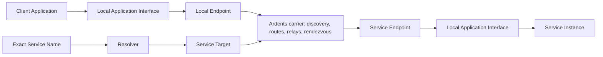

# Network functional map

Status: **product decomposition for research**

This map describes Ardents as a network product. It separates the mandatory
carrier contract from Application behavior and from optional Overlay Services.

Status labels:

- **fixed** — already follows from an accepted product decision;
- **working** — recommended baseline for focused research, still reversible;
- **open** — no product commitment yet.

## Product boundary

The network connects Applications to Service Targets. It does not send product
messages between infrastructure Node IDs, and it does not need a User identity
in order to carry a connection.

## Baseline product requirements

| ID | Requirement | Status | Evidence or decision still needed |
|---|---|---|---|
| NET-01 | A User or Developer can start a local endpoint and join the public carrier without a central account, phone, email, or wallet. | fixed | R-009 defines hostile bootstrap and Bridge recovery. |
| NET-02 | The addressable application object is a location-independent Service Target. A Node ID and User identity are never substituted for it. | fixed | R-006 defines creation, rotation, revocation, and multiple Service Instances. |
| NET-03 | A Developer can expose an existing local Service Instance without publishing its ordinary origin address to Users. | fixed | R-002 defines the exact listen/accept contract; R-006 defines service lifecycle. |
| NET-04 | An exact human-readable Service Name can resolve verifiably to a Service Target. Ardents does not index or recommend Unlisted Services. | fixed | R-003 defines registration, private resolution, recovery, expiry, and governance. |
| NET-05 | The minimum Application Interface is an online, bidirectional, reliable, ordered byte stream that either carries data while live or reports failure explicitly. | working | R-002 tests whether this is sufficient and specifies connect, accept, backpressure, close, and errors. Datagram support is not assumed. |
| NET-06 | Service Connections authenticate the intended Service Target and protect Application Data end to end from carrier Nodes. | fixed | R-001 states the adversary; R-002 defines what authentication is exposed to the Application. |
| NET-07 | The opposite endpoint and any one ordinary intermediary do not learn both ordinary endpoint locations within the Interactive Route contract. | fixed | R-001 makes the claim falsifiable; R-004 compares routing families. |
| NET-08 | An Application can declare an Isolation Context so unrelated connections are not silently linked through reused routing state. | working | R-002 defines the application signal; R-004 defines enforcement and cost. |
| NET-09 | Route loss, Service unavailability, timeout, and policy rejection are distinguishable enough that an Application can react safely. | working | R-002 and R-007 define observable failures and responsibility for retry. |
| NET-10 | Blocking ordinary entry addresses or one path has a bounded recovery route that does not require protocol expertise from a User. | fixed | R-009 defines discovery and probing resistance. |
| NET-11 | Ordinary routing and Service reachability can use independently operated Nodes without one mandatory carrier operator. | fixed | R-010 through R-012 and R-020 define abuse cost, diversity, control roots, and contributor sustainability. |
| NET-12 | Resource use is bounded; overload and malicious input fail explicitly rather than creating unlimited queues or retention. | working | R-002, R-007, and R-010 define limits at each boundary. |
| NET-13 | Every privacy, availability, and decentralization claim is shown as a Route Profile or another testable contract with an honest limitation. | fixed | R-001 and the threat model define the claim matrix. |

## End-to-end product functions

| Function | User-visible outcome | Network responsibility |
|---|---|---|
| Start and join | Ardents becomes ready without creating a public User account. | Discover enough current network state, validate it, select entry, and expose degraded or blocked state. |
| Create Service | A Developer receives a machine Service Target and protected authority material. | Create/import service authority without reusing a Node or User identity; R-006 decides rotation and recovery. |
| Publish Service | A local server becomes reachable inside Ardents without a public origin address. | Bind incoming Service Connections to the selected local endpoint and publish authenticated, expiring reachability metadata. |
| Name Service | The Developer can share a human-readable name rather than a cryptographic address. | Bind and verify Service Name to Service Target; expose expiry, conflict, and recovery state. |
| Resolve exact name | A User reaches a known Unlisted Service without browsing a directory. | Resolve privately enough for the accepted adversary and reject invalid, stale, or equivocating records. |
| Establish connection | The Application reaches the intended live Service or receives an explicit failure. | Discover current service reachability, construct routes, rendezvous endpoints, authenticate the Service Target, and negotiate the transport. |
| Exchange data | An existing application protocol can operate without understanding Ardents routing. | Carry opaque bytes under the accepted stream, confidentiality, integrity, congestion, and resource contracts. |
| Isolate context | Separate applications or logical identities are not linked merely because they share one local endpoint. | Accept an Isolation Context and prevent forbidden route/session sharing. |
| Recover connectivity | A broken path or blocked entry does not look like successful delivery. | Rebuild safe network state or return a bounded, classifiable failure. |
| Contribute | A person can supply a bounded network role and leave predictably. | Advertise role and limits, reject unsafe configuration, observe health, update, and withdraw responsibility. |
| Inspect trust | Users can see what the current privacy and decentralization claim depends on. | Expose Control Plane roots, software provenance, concentration, route state, and known limitations without logging application behavior. |

## Network versus Application responsibility

| Concern | Ardents network owns | Application or Overlay owns |
|---|---|---|
| Destination | Service Target reachability and optional Service Name resolution. | User IDs, resources, rooms, accounts, paths, and application-specific addresses. |
| Live transport | The accepted Service Connection semantics, end-to-end target authentication, resource bounds, and explicit network failure. | Request/response format, object schema, semantic acknowledgements, idempotency, and reconnect policy. |
| Data meaning | Nothing beyond opaque bytes and protocol-safety limits. | Whether bytes are HTTP, chat, files, synchronization, commands, or another protocol. |
| User identity | No required network-wide User identity. | Login, Personas, contacts, credentials, groups, and account recovery when an Application needs them. |
| Authorization | Protection of local Application Interface access and optional future restricted-discovery hooks. | Who may read, write, join, administer, or invoke a Service operation. |
| Persistence | Short-lived buffers strictly required to operate a live connection. | Databases, history, offline queues, retained delivery, content pinning, deletion, and backups. |
| Availability | Finding routes to a currently published Service and surfacing failure. | Keeping Service Instances online, multihoming, state replication, and application-level failover unless an explicit Overlay provides them. |
| Retry | Safe bounded routing attempts and an explicit result. | Reissuing an operation, deduplication, exactly-once illusions, and user-visible recovery. |
| Application execution | No arbitrary remote code execution in the carrier. | Local server, browser, application runtime, sandbox, and content rendering. A Reference Application may package these separately. |
| Abuse | Protect shared carrier capacity from flooding and Sybil capture. | Service moderation, unsolicited content, domain policy, and application admission. |
| Updates | Ardents endpoint, protocol, and Control Plane update integrity. | Service code, content, schema migration, and client compatibility. |

## Named Unlisted Site tracer

The tracer is deliberately ordinary above the network boundary:

1. a Developer starts a local HTTP server;
2. the Service Publisher exposes it as a Service Target and binds a Service Name;
3. a reference client resolves the exact name and opens a Service Connection;
4. HTTP request and response bytes cross the connection unchanged;
5. a failed path is rebuilt or reported, and an offline Service is never shown as
   having received a request;
6. the Service Name remains stable through one accepted instance or key rotation.

This tests the whole network control and data path. It does not make HTTP, a
browser, static content replication, or decentralized hosting mandatory Ardents
primitives.

## Candidate extensions, not baseline requirements

The following remain legitimate future products but must not constrain the core
before a concrete Application requires them:

- unreliable or message-oriented datagrams;
- delayed or cover-traffic-heavy Route Profiles;
- retained offline delivery and notifications;
- signed replicated content and origin-independent site availability;
- restricted discovery or network-assisted Service admission;
- reusable application identity, Contacts, Spaces, Credentials, or Capabilities;
- a bundled browser, sandboxed application runtime, or package format;
- contributor payments, markets, staking, or public-goods funding;
- gateways to other networks.

## Scope rule

A function enters the network core only when an Application cannot safely and
reasonably supply it above the Application Interface, multiple distinct
Applications require the same semantics, and its metadata and abuse costs are
understood. Shared convenience alone is not enough to make a feature a network
primitive.
