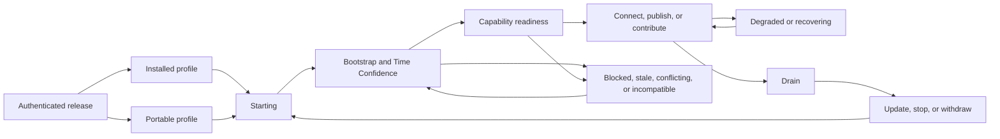

# Product operating model

Status: **accepted public-product target model; not the current implementation backlog**

Accepted: 2026-08-08

This document closes the operational shape of Ardents from deployment through
withdrawal. It does not select a programming language, library, cryptographic
suite, wire encoding, or package manager. Those choices must implement this
contract rather than redefine it.

[Product scope and delivery horizons](scope.md) controls when any part of this
model may enter implementation. Carrier Lab intentionally implements only its
controlled Route experiment subset. Deployment custody, public bootstrap,
naming governance, Bridges, updates, cross-platform qualification, independent
control, and stable operations remain promotion gates even where their product
decision is already accepted.

The product has no single `ready` boolean. Readiness is always for a named
capability, exact Network Epoch, protocol family, and Route Profile. A test
network may implement the same states, but it cannot claim public anonymity or
decentralization merely because the state machine runs.

## Lifecycle at a glance



## 1. Deployment and local state

### Distribution Profile contract

- Windows 11 and Ubuntu LTS `x86-64` support Installed and Portable Distribution
  Profiles for each release. Installed wraps the exact authenticated platform
  executable released directly as Portable. Runtime operation is unprivileged
  in both; elevation is limited to the explicit Installed-profile package/
  registration action.
- Installed owns ordinary signed package installation, repair, upgrade,
  optional explicit OS integration, and uninstall. Portable is the authenticated
  platform executable plus only unavoidable authenticated non-secret static
  configuration templates/resources.
  The Owner copies, runs, stops, replaces, or deletes it from a chosen path; it
  requires no separate installer, elevation, or implicit package, URI, browser,
  startup, service, proxy, DNS, route, or VPN registration.
- Both profiles expose the same Client/Publisher capabilities, Application
  Interfaces, direct binary behavior, resource limits, protected-state
  compatibility, and security/privacy claim ceilings when the exact authenticated
  executable is run. Portable is not a development build or reduced feature
  tier. Package-managed install, repair,
  update, rollback, and removal conveniences belong only to Installed; Portable
  uses authenticated stopped executable replacement and deletion.
- Installed bootstrap owns pre-execution verification of its payload. Portable
  instead requires the Owner or an already trusted verifier to authenticate the
  exact digest before first execution and after copying/replacement. Untrusted
  raw bytes cannot authenticate themselves after they have already executed;
  running them is outside Ardents security/privacy claims.
- Executable portability is not state portability. Vault, Grants, roots,
  watermarks, Endpoint identity, and network state remain in an explicitly owned
  protected state root and never move, merge, or become removable-media state
  merely because a Portable executable moves.
- A Portable profile may add per-user URI/browser integration only through an
  explicit, reversible, separately inventoried action. Direct binary and local
  Application Interface use remain available with no such registration.
- The default deployment creates a local Endpoint, never a public User
  identity, account, wallet, Service, or Contributor Node. Publishing and
  contribution are separate explicit actions with separate Local Grants and
  resource limits.
- A public qualified Contributor role in V1 uses a dedicated host/Endpoint
  with no User connection or Service publication role. A co-resident development
  Node is visibly unqualified and supplies no public capacity or independence
  evidence. Every endpoint also excludes Contributor identities and declared
  families it controls from its own Route selection.
- The Application Interface listens only on an operating-system local IPC or
  loopback boundary by default. Remote administration is not enabled by either
  Distribution Profile. A shared desktop user, PID, port, or copyable bearer is not enough
  for a per-Application security claim: Local Grants bind to an OS-enforced or
  launcher-brokered Application Principal covering one process tree/session.
  Unmediated applications that cannot be distinguished form one local trust
  domain and receive no malicious-sibling isolation claim.
- The Application Interface contains separately granted Connection and Service
  Administration surfaces. Service Administration may publish/configure only
  with an already authorized public Credential and matching non-exportable
  Instance Key. Authority creation, import/export, reconciliation, rotation,
  and Credential issuance use a stronger Authority Custody boundary outside the
  ordinary Application Interface; no lower grant implies it.
- Generic HTTP/SOCKS/stream or browser Adapters may be added for
  compatibility, but do not by themselves earn an Application-level privacy
  claim. A claim-bearing private-site/application mode uses a Network-Isolated
  Application Boundary that permits only scoped local IPC/loopback with Ardents,
  denies ordinary network ingress/listeners plus DNS/direct egress, isolates
  origin/cache/storage by Isolation Context, and fails rather than falling back
  outside Ardents.
- The Distribution Profile artifact binds the release identity, target
  platform, public network identity, immutable trust roots, and authenticated
  bootstrap fallback.
  Development, provisional-test, and public-network roots are distinct and
  their state cannot be merged.
- Package mirrors, application stores, CDNs, removable media, and peer transfer
  may distribute identical bytes, but none of them defines which bytes are a
  valid Ardents release.
- A malicious first installer or Portable artifact can compromise its own
  deployment and roots.
  Ardents cannot make that fact self-detecting; independent signature and
  reproducible-build verification is the external trust boundary.

### State separation

Every Endpoint deployment keeps seven lifecycle classes separate:

1. immutable release-artifact identity and trust roots;
2. an Authority Vault containing Service and Name root material plus their
   authority-owned monotonic signing state;
3. endpoint configuration, Local Grants, Service Instance Keys, and public
   bounded Service Instance Credentials;
4. non-decreasing release, epoch, Namespace, freshness, generation, and rollback
   watermarks;
5. disposable authenticated network, naming, and descriptor caches;
6. ephemeral Route, invitation, Carrier Channel, and connection state;
7. bounded local diagnostics.

A corrupted cache can be deleted without deleting authority. Repair and update
preserve the Authority Vault and grants unless the Endpoint Owner explicitly
replaces them. Ephemeral connection state never survives a process restart.

Authority backup is an explicit, versioned, encrypted **Authority Recovery
Bundle** containing root material, network/root identity, the last authenticated
authority-owned generation or revision commitments, and non-decreasing signing
watermarks. It excludes Local Grants and Service Instance Keys. A test restore
only verifies decryption and schema inside an isolated, no-network, no-signing
mode; it is not proof that a stale backup may sign safely.

Before the first post-restore signature, the restored authority reconciles
threshold-authenticated current network or Namespace state and advances strictly
beyond every accepted generation/revision. If state is unavailable, stale,
conflicting, or forked, the authority remains `authority locked` and export-only.
A new Service host generates a new Instance Key; no old runtime secret is
restored. Local Grants are reissued explicitly by the Endpoint Owner or restored
from a separate local-policy backup, never derived from a Service or Name root.

Installed uninstall removes package-owned program/runtime state but retains
required security watermarks. Deleting a Portable executable removes only that
program artifact; it is never interpreted as permission to erase protected
state. A supported protected-state removal preserves a non-empty Authority Vault
in place or blocks until the Endpoint Owner completes and verifies an explicit
Recovery Bundle export to a chosen destination; it never silently invents an
encryption secret or backup location. Erasing a non-empty Vault or rollback
watermarks is a separate explicitly confirmed destructive purge that enumerates
affected authority classes and states that recovery may be impossible. Deletion
remains best effort because filesystems, snapshots, and backups may keep copies.
Ardents performs no automatic cloud backup and has no help-desk recovery key.
Lost Service Authority still loses that Target, and lost Name Authority follows
only its precommitted Recovery Policy. Bundle names, diagnostics, and manifests
expose no Name or Target in plaintext.

Disk, log, cache, and update-staging use is finite. On exhausted storage,
Ardents preserves authority and rollback watermarks, stops accepting new work,
and reports a local resource failure. A live byte stream is never converted into
an unbounded disk queue.

## 2. Bootstrap, warm-up, and readiness

### Accepted bootstrap shape

The endpoint accepts an expiring, content-addressed **Network Epoch** only under
a threshold-authenticated transition from its active or last-known-good
roots. The same bytes may arrive from the package, cache, several mirrors,
ordinary peers, or an imported file. Sources distribute state; they do not
define it. Incompatible threshold-valid states are never merged.

A source contacted before a private Route exists is a **Direct-Origin Source**
and may observe requester origin, public artifact, timing, and probable Ardents
use. A globally advertised direct-origin source identity and known family are
therefore ineligible for every Route position and Destination Resolution during
that assignment. An ordinary carrier peer that happens to distribute bytes is
not globally reclassified; instead the Endpoint places its authenticated
identity/known family in a bounded, Endpoint-local **Direct Source Exposure
Set** and excludes it from every local Route/resolution selection until the
exposure lease and all state/work derived from that contact terminate.

Before direct contact, the Endpoint rejects a source identity/family already
present in still-valid retained Entry/Interior/Introduction/prepared-role state
or used by live Route/Resolution work, then advances through a finite precommitted
source sequence; it cannot add the source post-factum and pretend the earlier
duty was safe. An unexpected conflict learned only after authentication returns
explicit unavailability or uses one bounded Owner-approved replacement already
allowed and counted by the Entry exposure policy; it never silently rotates the
set. Direct retries and set growth are finite. Exhaustion
returns explicit bootstrap/update/time-state unavailable instead of resampling
without bound or weakening an exclusion. Route candidate selection likewise
follows its endpoint-owned precommitted sequence while skipping locally forbidden
source families; a distributor cannot choose the replacement. Creating an
Application or Isolation Context cannot reset or fork the set. Once Target
Connect is ready, destination-sensitive fetches use private paths. An
unauthenticated external/CDN source cannot be assigned a trustworthy family and
remains an explicit first-contact and hidden-common-control limitation.

For every mandatory pre-Route artifact class enabled by the qualified profile—
at least current Network Epoch/Candidate Materialization, independent
authenticated time when required, and Release Safety state—public beta has at
least three effective authenticated source-only families with no family above
`40%`; stable has at least five with no family above `25%`. The same source
families may serve several classes but count once toward global source supply.
External/CDN/file distribution without authenticated family evidence improves
availability but does not count as independent. These source-only families are
additional to the exclusive Route-domain family count.

The Network Epoch contains or authenticates only shared network facts: network
and protocol identity, monotonically increasing epoch, freshness bounds,
compatible and qualified Route Profiles, deterministic Node eligibility inputs,
role-domain assignments, signer transitions, and state digests needed to detect
rollback or a fork. It commits the logical complete, canonically ordered
**Candidate View**: root, length, publication cutoff/input-log root, and global
eligible count/capacity summaries by Role Domain and declared family. It contains
no User identity, query history, Service Name history, route trace, or
Application Data.

Node Records enter through a precommitted permissionless publication window and
append-only transparency input. Every valid record accepted before cutoff is
included or receives a publicly verifiable deterministic rejection/revocation
reason. This prevents threshold signers from silently omitting a logged eligible
Node, although a captured Control Plane may still deny or fork the whole log.
Exact convergent log and admission machinery remain R-013 feasibility work.

One endpoint may fetch a **Candidate Materialization**: deterministic shards or
indexed records with inclusion proofs under the common View commitment. It
verifies requested material, committed indices, eligibility, and proofs locally;
it does not claim to prove global completeness from a partial sample. At least
two full auditors, independent from each other, the epoch signer threshold, and
the Candidate operator families being audited, recompute the View, input-log
inclusion, global summaries, and concentration gates and publish control-
independence evidence. A missing record is retried at the same selected index from
another source or fails explicitly, never silently resampled. Fetching is batched
independently of one destination and no source receives the complete selected
Route. Exact authenticated sampling and auditor protocol remain R-013 work.

An endpoint may expand its peer view after accepting an epoch, but DHT, peer
exchange, mirrors, and bootstrap Nodes supply candidates rather than truth.
Epoch policy may reference a Route Qualification result but cannot manufacture
one without the separately authorized public evidence.

### Time Confidence

Leases, Network Epochs, descriptors, invitations, credentials, and updates all
depend on freshness. Ardents therefore maintains **Time Confidence**, not an
assumption that the wall clock is correct:

- monotonic elapsed time is used while a process runs;
- a persisted non-decreasing freshness watermark prevents clock rollback from
  reviving older accepted state;
- signed epoch bounds and several authenticated time observations may raise
  confidence, but one NTP, DNS, mirror, or ordinary Node is not authoritative;
- a clean endpoint with neither credible time nor an acceptable current epoch
  cannot become ready merely by changing its wall clock;
- uncertain time blocks new trust transitions and new connections that require
  unprovable freshness. It never silently extends expired state.

The exact combination of operating-system time, authenticated rough time, NTS,
and epoch evidence is a mechanism experiment. `Clock uncertain` is the required
product result when the evidence is insufficient.

### Capability readiness

Every capability first requires the **Common Readiness Base**: authenticated
active build, a current non-revoked **Release Safety State**, compatible
Network Epoch, sufficient Time Confidence, and finite local resources. Release
Safety bytes are expiring, cacheable public metadata distributable through the
package, cache, mirror, peer, or file channels; no vendor endpoint is mandatory.
A still-valid cached state permits restart through distributor outage. Expired,
conflicting, or missing safety state blocks new network work explicitly.

Existing network work is never grandfathered forever. At establishment it
receives a finite **Work Safety Lease** whose terminal bound is no later than the
earliest applicable Network Epoch, Release Safety, protocol/build, Service
Instance Credential, and role-specific safety deadline. Authenticated refresh
may extend the lease before it ends. A new Route, leg, recovery attachment,
publication renewal, or Contributor assignment requires the then-current Common
Readiness Base and applicable credential; stale, clock-uncertain, vulnerable
beyond deadline, or revoked state cannot extend it. At its terminal bound work
closes explicitly.

The local status vocabulary is:

- `starting` or `bootstrapping`;
- `disabled` or `unconfigured` for a capability not enabled or completed;
- `authority locked` when required custody cannot sign safely;
- `probation` or `draining` for Contributor/publication lifecycle;
- `ready` for a named capability and exact qualified profile;
- `degraded` when the capability remains safe but has lost declared reserve;
- `blocked` when known entry paths cannot be reached;
- `stale` or `clock uncertain` when freshness cannot be proved;
- `conflicting` or `forked` when authenticated state disagrees;
- `incompatible`, `update state unavailable`, `update required`, or `build
  revoked` when release or protocol safety does not permit new work;
- `unqualified` for a research build or Route Implementation;
- `local resource unavailable` when a finite local parent budget is exhausted.

The primary capabilities are independent:

- **Target Connect Ready** adds a usable Initiator-domain Entry path, enough
  materialized eligible Nodes in every required data-path domain, a separately
  isolated Private Reachability Resolution path to a Destination Resolution Role
  in the Rendezvous Domain, and a supported qualified Route Profile.
- **Private Name Resolution Ready** adds its own separately isolated private Name
  path to a Destination Resolution Role in the Rendezvous Domain, Initiator entry
  reachability, and current compatible Namespace state. It may draw from the same bounded
  Initiator Entry Set but does not inherit Target Connect readiness or prove that
  a particular Service is online.
- **Publish Ready** adds a usable listener, matching Service Instance Key and
  current Credential, Responder and Introduction entry paths, fresh descriptor
  publication/replication through Rendezvous-domain Destination Resolution roles, and
  overlapping Introduction reachability. It never requires a User/Initiator
  data path.
- **Contribute Ready** adds role self-check, deterministic domain eligibility,
  probation completion, explicit owner limits, public reachability where the
  role requires it, and sufficient reserve for drain and update. It requires no
  endpoint Entry Set unless that exact role uses one.

Target Connect can therefore remain available when the optional human Namespace
is unavailable. A Service Target has an explicit shareable **Target Link** that
bypasses naming without bypassing target authentication or Route requirements.
A Target Link is a tagged, versioned, network-bound type distinct from a Service
Link and carries no origin or mutable reachability. A Name failure never changes
a Name destination into a Target Link implicitly.

`Warm` means reusable authenticated state already exists for the same exact
tuple allowed by the performance contract; it never means an open hidden
connection or cached Application response. Readiness does not require building
Routes to Services the User has not selected.

The accepted `p95 <= 5 s` routine and `p95 <= 15 s` clean-start R-023
`network-ready` budgets mean **Target Connect Ready** only. Private Resolution,
configured Publish, and local Contribute preparation require separate
capability-by-platform startup budgets before a usable release; Contributor
probation is a network lifecycle and is never hidden inside process-start time.

Client and Publisher roles may coexist on one endpoint, using separate
Initiator, Responder, and Introduction Entry Sets and grants. This is not a
same-host unlinkability claim: the OS, host compromise, and Local Traffic
Observer may correlate both roles. The accepted standalone client and Publisher
performance floors are not additive. A release claiming the co-resident mode
usable must qualify a finite combined profile with Target Connect and Publish
Ready simultaneously, at least one active inbound and outbound tracer
connection, hierarchical resource accounting, and no security exception; exact
combined scale is R-023 evidence work.

## 3. Normal operation, routes, recovery, and diagnosis

### Route construction

The baseline uses a Tor-shaped pair of independently selected endpoint circuits
joined at a fresh Rendezvous, with Ardents Service Connection semantics above
them. The data path remains:

```text
User -> User Entry -> User Interior -> Rendezvous
     -> Service Interior -> Service Entry -> Service
```

Introduction uses its already accepted separate control path and carries no
Application Data or offline message.

To make the five-distinct-Node rule enforceable without disclosing either
endpoint's hidden leg, eligible infrastructure identities are divided into
stable, non-overlapping **Role Domains**:

- Initiator Carrier Domain;
- Rendezvous Domain;
- Responder Carrier Domain;
- Introduction Domain.

One Node Identity, and every honestly declared operator family, belongs to one
Role Domain under an authenticated finite Role Domain Assignment. A Node may be
selected for new duty only when that duty's maximum terminal lifetime, including
Entry/Introduction/Resolution use and drain, fits before assignment `not-after`.
Reassignment first publishes `no-new-work-after`, drains and quarantines the
identity and known family through the terminal expiry of every old-domain duty,
and makes neither eligible in a new domain until then. An emergency may terminate
old work immediately and make the network unavailable, but cannot authorize
overlapping old/new-domain eligibility.
The endpoint locally prevents identity or declared-family repetition inside the
leg it controls. Domain separation prevents a hidden cross-leg identity collision
without asking the Service to reveal or reject against its Entry Set.

Destination-aware Name/Target/descriptor lookup and publication use a
**Destination Resolution Role** eligible only inside the non-adjacent Rendezvous
Domain, never Initiator, Responder, or Introduction. For one exact destination
and Isolation Context, the endpoint excludes every resolution identity and known
family it used from that connection's Rendezvous selection. Resolution also hides
its query from the Entry cryptographically, uses separate channels/context state,
and has bounded retries; identity separation is not a substitute for Private
Resolution. This preserves four global domains rather than fragmenting public
capacity into a fifth, while ensuring no one valid identity/family combines
endpoint-adjacent origin and a destination-aware role in the same operation.
The assignment follows public deterministic epoch rules over precommitted
identity/family material and public randomness that neither one Node nor one
epoch signer can cheaply grind after seeing the outcome. It is not manual
approval or a Node's per-connection choice. Exact randomness and anti-grinding
evidence remain R-013 work.

This does not prove independent ownership. An operator may lie about family or
create Sybil identities; that remains Correlated Control and admission risk.
If any domain is too small or concentrated for the selected profile, the Route
is unavailable rather than shortened or built from a forbidden overlap.

### Entry exposure and Isolation Contexts

V1 has ordinary and Bridge entry regimes. An Endpoint keeps at most one
small long-lived Entry Set for each activated **adjacent Role Domain × regime**:
Initiator for client traffic, Responder for publication data, and Introduction
for prepared Service introduction paths. Client and Publisher roles co-resident
on one machine use different domain-scoped sets; creating Applications,
Services, Targets, Instance generations, Isolation Contexts, destinations, or
Bridge Invites creates no additional set.

Every ordinary Entry or Bridge key is eligible for exactly one adjacent Role
Domain. A Bridge Invite carries or references an epoch-bound eligibility/domain
proof; one key cannot serve Initiator and Responder/Introduction exposure. An
Invite adds or replaces members only inside its bounded domain Bridge set. Only
the Endpoint Owner or explicit local censorship-recovery policy may switch
regimes, with bounded retry, hysteresis, and retained exposure history. Cycling
failures cannot force an unbounded sequence of endpoint-adjacent Nodes.

Isolation Contexts use separate Carrier Channels, circuit keys, Interiors,
Rendezvous, invitations, target/name caches, continuity secrets, and failure
history. Only immutable public state, the bounded endpoint Entry exposure, and
the privacy-preserving Direct Source Exposure Set may be shared. An Entry already
sees the endpoint's ordinary location and may link
activity that reaches it; Ardents does not claim to hide same-device contexts
from that Entry or a Local Traffic Observer. Context isolation prevents the
network from adding linkability beyond that accepted view.

### Service Connection recovery

An endpoint-authenticated handshake creates a connection-only continuity secret
known solely to User and Service. It is never a stable User, Service, or network
identifier. Recovery proceeds in bounded layers:

1. replace a failed Carrier Channel inside a still-valid leg;
2. attach a fresh leg to the same live Rendezvous;
3. after Rendezvous loss, propose a fresh Rendezvous through a new sealed
   Introduction attempt and prove endpoint possession of the same continuity
   state.

Every attachment uses fresh random handles, fresh route keys, a monotonic route
generation, and binding to the exact target, Route Profile, Isolation Context,
and original handshake transcript. Replayed, rolled-back, cross-context, or
cross-target attachments fail. Endpoints reconcile authenticated byte sequence
and acknowledgement ranges; temporary overlap is allowed only for cutover, and
no byte is presented twice.

The initial handshake also binds the exact Service Instance Credential and sets
a connection terminal `not-after` no later than that Credential's validity end
or the connection's Work Safety Lease.
An authenticated higher-generation supersession may impose an earlier signed
`no-new-leg-or-recovery-after` and terminal deadline. Once the endpoint learns
that state it neither attaches a new leg nor recovers beyond the first applicable
deadline, and it closes explicitly at the terminal deadline. A partition may
delay learning supersession, so instant revocation is not claimed; Credential
expiry is the unconditional finite bound, and insufficient Time Confidence fails
closed rather than extending it.

Every connection also has an immutable **Destination Binding**. If the
Application supplied a Service Name/Link, the binding includes its authenticated
Name generation, record revision, and resolved Target. A same-generation renewal
or Grace state may refresh the Work Safety Lease only while the Target remains
identical, with Grace visible. Learned `Recovery Pending`, `Released`, or an
authenticated rebind to another Target forbids new leg/recovery work and closes
the connection by a finite signed terminal deadline. The stream is never silently
migrated to the replacement Target; the Application opens a new connection and
receives its new authenticated Target.

If the Application supplied an explicit Target/Target Link, the Destination
Binding is pinned to that Target and intentionally has no Name recovery. A
compromised Service Authority may keep that Target unsafe until external context
causes the Application to stop trusting it; Ardents cannot infer which copy of a
root is legitimate. This is the honest cost of name-independent pinning.

Relays receive fresh opaque handles. Timing can still correlate old and new
Routes, which remains inside the low-latency limitation. Recovery shares the
accepted non-resetting `15 s` terminal deadline and never reissues an Application
operation.

A live operating-system network or address change is an adjacent Carrier Channel
failure and may use the same bounded recovery only while the Endpoint process and
connection state survive. Entries may correlate the old and new addresses. A
suspend, reboot, crash, or process update loses live connection state and closes
connections explicitly; it is not disguised as successful route recovery.

### Failure evidence

- `destination/resolution failure` requires verifiable destination state such
  as invalid syntax, Released, Recovery Pending, or no current binding;
- `Service unavailable` requires authenticated positive evidence from the
  target or a still-valid explicit withdrawal; silence alone is not proof;
- `Route unavailable` means the current authenticated Candidate View cannot
  produce the required qualified path after bounded safe attempts;
- `target authentication failure` requires cryptographic mismatch evidence;
- `local denial/resource`, `timeout/cancellation`, `clean close`, and
  `connection loss` describe only the local facts they name;
- censorship, selective withholding, partition, attack, and outage that cannot
  be distinguished produce `indeterminate failure`.

Applications never receive Node identities, route topology, bootstrap sources,
or a guessed attacker diagnosis.

### Local authorization lifecycle

Local Grants are hierarchical endpoint policy, not durable bearer secrets. The
privilege lattice has Connection, per-Service Administration, and separately
gated Authority Custody families; none is silently inherited. Service
Administration cannot export Service Authority or an Instance Key, and Authority
Custody is the only boundary that may operate on root material or issue a
Credential. A grant is scoped to one local Application/principal, optional
Service, operations, and finite parent resources. The Application Principal is
bound by an OS isolation boundary or brokered launch to the complete process
tree/session, not only a desktop account, PID, loopback port, or reusable file
secret. If the platform cannot distinguish two applications, Ardents treats them
as one principal/trust domain rather than claiming isolation. Revocation immediately rejects
new operations and invalidates every descendant session capability. Authority
Custody and Service Administration sessions close immediately. Data connections
close immediately unless the Endpoint Owner explicitly selected a finite
drain-then-revoke action before revocation; no drain can exceed the Work Safety
Lease or signed terminal deadline.

A stored local policy may survive repair or restart, but process handles,
sessions, and bearer capabilities do not. After restart the Application must be
bound again to the authorized operating-system-local principal and receives
fresh ephemeral capability state. Exact Windows/Linux principal and IPC binding
remain R-013 implementation and hostile-test work. No remote network actor can
issue, prolong, or revive a Local Grant.

### Diagnostics

Diagnostics follow the same Local Grants as operations:

1. A connection Application receives bounded Connection Results plus only its
   Target Connect and, when authorized, Private Resolution readiness.
2. A per-Service administrator receives listener, generation/expiry,
   descriptor, and Introduction aggregate state for only that Service; Authority
   Custody status is separate and never returns key material.
3. An Endpoint Owner receives local aggregate base readiness, freshness,
   qualification, resource, and remediation state without a peer or Service
   activity graph.
4. A Contributor receives aggregate role, capacity, queue, epoch, drain, and
   update health for only its own Node role.

Remote telemetry, persistent per-Route or per-Service logs, and automatic crash
upload are off by default. A diagnostic export is explicit, previewable,
bounded, and excludes Authorities, Service Instance Keys, raw Credentials,
Names, Targets, Local Grants, Bridge secrets/Invites, Entry membership,
Application Data, invitations, continuity secrets, and complete Route histories.
Predictable names are omitted rather than replaced by publicly dictionary-testable hashes.
Temporary deep debugging is local, time-bounded, visibly weakens privacy, and is
never qualification evidence for the normal profile.

## 4. Security and hostile operation

### Service key hierarchy

The Service Authority is the durable Target root and need not remain on the
runtime host. The new host generates a private **Service Instance Key** and sends
only its public key in an authorization request. Service Authority issues a
public, bounded, monotonic **Service Instance Credential** binding the Target,
public key, exclusive generation, validity, network, and capabilities. The host
proves the credential with its private Instance Key in descriptors and endpoint
handshakes but cannot rotate or export Service Authority.

Co-location is supported for simple deployments but is reported as a custody
risk. Copying the public Credential alone grants no power; compromise of the
matching Instance Key remains dangerous until credential validity ends or a
newer exclusive generation becomes current. Compromise of Service Authority
still requires Target replacement. This hierarchy permits
later stronger custody and multiple-instance research without changing the
Target or Application Interface.

The endpoint handshake uses fresh authenticated ephemeral session keys bound to
the exact Target, Instance Key/Credential proof, protocol, Route Profile,
Isolation Context, and transcript. Carrier legs likewise use fresh independent
ephemeral keys. After a connection or retired leg closes, ephemeral key material
is erased on a best-effort basis. Consequently, later compromise of Service
Authority, Instance Key, Node long-term keys, or recorded ciphertext must not
decrypt an honestly completed Service Connection. A live endpoint compromise
still reads plaintext/session keys; memory dumps, swap, hibernation, and snapshots
may defeat erasure; and V1 promises no post-compromise healing inside an already
compromised live connection. Exact authenticated key exchange and cryptographic
suite remain R-013 work, but Forward Secrecy is not optional library behavior.

### Node eligibility and Sybil boundary

- A Node publishes a signed, expiring Node Record containing its key, supported
  role capabilities and transports, declared operator family, and finite
  capacity. Publication makes it discoverable, not eligible or trusted.
- Publication before a fixed cutoff yields an inclusion receipt in the
  transparency input log. Deterministic eligibility either includes the record
  in the epoch View or emits a public rejection/revocation reason; silent signer
  omission is a detected invalid epoch, not ordinary discretion.
- Eligibility and Role Domain assignment are deterministic from versioned epoch
  rules, precommitted identity/family material, probation, reachability, protocol
  compatibility, and independently reproducible synthetic capacity evidence.
- A globally advertised direct-origin source duty is an explicit incompatible
  assignment. Candidate View eligibility cannot place the same identity or known
  family into a Route or Destination Resolution role while that source
  assignment can overlap. An ordinary candidate that serves public bytes is
  quarantined only by the Endpoint that contacted it through its Direct Source
  Exposure Set.
- Candidate View eligibility includes assignment not-before/not-after,
  stop-new-work, drain/quarantine, and terminal state. A duty whose maximum
  lifetime does not fit is ineligible; reassignment never overlaps identity or
  known-family eligibility across domains.
- Endpoints select locally from authenticated Candidate Materializations under
  the same epoch-committed Candidate View. A
  signer, mirror, bootstrap peer, Service, or carrier Node never chooses a User's
  complete Route.
- Local route failures may influence only that endpoint's bounded local choice;
  there is no uploaded User reputation or route-history graph.
- Hard path constraints cover Node identity, Role Domain, and known family.
  ASN, hosting provider, jurisdiction, software supply chain, and unknown control
  are uncertainty signals and concentration gates, not proof of independence.

Admission is resource-specific, not one universal identity system. Cheap
stateless validation precedes expensive state; short-lived single-purpose
capabilities and bounded puzzles may be added under load; queues, lifetimes, and
per-parent budgets remain finite. No mechanism may rely on money, account, IP
reputation, stable User identity, or cross-context history. A valid admitted
Sybil can still occupy finite capacity, and Ardents promises isolation and an
explicit result rather than per-person fairness.

### Control Plane roots

Release, Network Epoch, Namespace, qualification, and emergency authority are
separate roles and keys. Distribution is separate from authorization. Stable
public operation requires threshold control, expiring online delegations,
offline root rotation, append-only transparency, public transition evidence,
and an explicit fork result.

The public baseline is `3-of-5` for Network Epoch, offline release-root
transitions, and authorization of every new executable Targets/package digest,
with independently operated custodians and no shared operator, hosting provider,
or administrative organization counted twice. Snapshot and timestamp duties may
be narrowly delegated online but cannot introduce a new executable digest.
Emergency
incompatibility or revocation requires `4-of-5`, expires automatically, and
cannot seize a Name, decrypt traffic, insert a Route, or install unsigned code.
Every package authorization binds source/dependency inputs, SBOM, qualification
identity where claimed, and at least two matching build attestations from
builders independent of each other and of the release-Targets threshold.

During one-to-one development, single project test keys are unavoidable. They
define only a provisional test network, are visibly centralized, and cannot
support a public `decentralized` or qualified anonymity claim.

## 5. Performance and capacity

The accepted R-023 endpoint, latency, throughput, recovery, overload, queue,
platform, and Qualification Evidence gates remain the product budgets. This
closure adds the following rules:

- startup is measured separately for each required capability; a quick
  `Target Connect Ready` result cannot hide unavailable naming or publishing;
- deployment, repair, update download, and process replacement have separate
  measurements and do not consume or escape the existing startup clock;
- disk, diagnostic, cache, descriptor, update-stage, and Authority Vault use
  receive finite platform budgets before a usable release;
- every Role Domain and discovery/control role must demonstrate useful bounded
  capacity on the accepted Ubuntu reference VPS; exact role workloads and
  numeric floors are fixed only after the Route prototype identifies real work;
- Destination Resolution is independently capacity/concentration-gated inside
  the Rendezvous Domain. Public operation needs enough resolution-capable
  families and enough remaining Rendezvous capacity after excluding every
  resolver identity/known family used for the exact destination/context;
- no shorter Route, direct path, state crossover, suppressed liveness, weaker
  authentication, or silent profile downgrade can make a performance test pass;
- a stronger endpoint may select only a previously qualified scale profile;
- Client+Publisher co-residence requires its own combined profile; standalone
  client and Publisher maxima cannot be added. Public Contributor co-residence
  with either endpoint role is unqualified and forbidden in V1;
- the Named Unlisted Site network KPI uses a controlled single-response client
  and deterministic HTTP Service with no ordinary listener or egress, with both
  endpoint Applications inside qualified Network-Isolated Application
  Boundaries. Arbitrary browser
  rendering, scripts, secondary resources, callbacks/SSRF, and direct
  Application networking neither improves that KPI nor inherits its privacy result;
- V1 has no delayed or cover-traffic-heavy profile. The Route Module seam remains
  so a separately justified future profile does not rewrite Applications.

The warm `1 s`, cold `3 s`, five-position data path, separate Introduction Path,
same-connection recovery, and reference-Node capacity combination is a hard
feasibility gate, not an assertion that implementation will pass.

## 6. Updates, compatibility, and withdrawal

### Release trust

Official packages use a TUF-shaped metadata model: threshold offline root and
Targets/package authorization, separate snapshot and short-lived timestamp
duties, authenticated versions, expiry, hashes, sizes, platform binding,
delegated roles, and consistent content-addressed artifacts. Public executable
digests require the accepted `3-of-5` Targets threshold. Snapshot/timestamp keys
may publish freshness and consistent references but cannot introduce a new
executable. A package-store signature is additional transport evidence, not the
sole Ardents update root.

A stable public release also requires reproducible-build instructions, retained
source and dependency inputs, an SBOM, and at least two matching independent
build attestations. A release with one builder may be a test release but cannot
claim this supply-chain condition.

Endpoints refresh expiring Release Safety State automatically from identical
metadata bytes available through package, cache, mirror, peer, file, or other
configured channels. No vendor endpoint is mandatory. Byte download and package
execution are separate local policies; a network signer may mark a build unsafe
but cannot force code execution.

Ongoing download has three explicit modes:

1. **private-only** (default): while Release Safety remains valid, use a currently
   qualified Ardents path or a configured external privacy proxy and fail without
   direct fallback;
2. **direct-allowed**: contact an ordinary source after a visible policy choice;
3. **offline import**: verify a locally supplied complete artifact.

Metadata checks and downloads carry no deployment token, account, Service
list, rollout cohort, `from-version`, or version-specific delta. A direct source
still observes requester IP, requested platform and exact target digest/release,
timing, repetition, and probable Ardents use and can infer download history.
Initial Distribution Profile delivery has the same honest limitation. If private
download is unavailable, the User chooses direct disclosure or offline import;
Ardents never silently changes mode.

After Release Safety expires, or once the build is revoked, V1 opens no Ardents
Service Route to repair itself. Recovery requires a previously configured
external privacy proxy, an explicit switch to direct-allowed mode, or offline
import. The local UI and Authority export remain available. This is an
intentional availability cost, not a hidden vendor dependency or use of an
unverified networking runtime as its own updater.

### Protocol and build state machines

```text
protocol: announced -> overlap-supported -> preferred -> required -> retired
build:    current -> superseded
          current/superseded -> vulnerable -> revoked
```

- The current and previous stable protocol generations overlap for at least
  `90 days` unless a credible exploitable flaw, compromised cryptographic
  primitive/key, or demonstrated safety incompatibility requires threshold
  emergency disablement. Nodes may advertise both during ordinary overlap.
- Endpoints select the highest mutually supported qualified profile permitted by
  authenticated epoch policy. The selected protocol and exact Route Profile are
  bound into the endpoint handshake. Exact build versions are not exposed to the
  opposite Application endpoint.
- A protocol generation may become `required` only after public evidence shows
  every Role Domain and required control/discovery role has independently
  operated, qualified current-generation capacity meeting its concentration and
  workload floor plus drain reserve even after previous-generation capacity is
  removed. This includes Destination Resolution capacity and post-resolver-family
  Rendezvous reserve. A normal policy signer cannot schedule a synchronized
  capacity cliff.
- After protocol `required`, an old endpoint opens no new Routes and reports `update
  required`; it never silently uses a weaker profile.
- A superseded build may remain safe during protocol overlap. A build marked
  `vulnerable` either continues the same exact qualified contract until a signed
  deadline or fails closed; it receives no weaker Route/Profile exception.
  `revoked` opens no new network work regardless of protocol compatibility.
  Build revocation is not entitled to `90 days` and never grants Route
  Qualification to a hotfix.
- Required/retirement, vulnerability, and revocation policy carry separate finite
  authenticated `no-new-work-after` and `terminate-or-no-recovery-after`
  deadlines. New leg attachment or Route recovery after the latter is new
  security work and is forbidden; the connection closes explicitly. Owner drain
  may be shorter but never extends the signed maximum, so old or vulnerable
  contracts cannot be grandfathered indefinitely.
- A `4-of-5` expiring emergency action may disable a protocol/build before the
  capacity gate only with an explicit possible-network-unavailable result. It
  may set either deadline to immediate terminal close but cannot install a
  package. Lasting disablement must appear in ordinary
  threshold release/epoch metadata before emergency expiry; otherwise clients
  report conflicting or expired safety state rather than guessing.

### Local update safety

Installed uses: verify and stage -> reserve rollback space -> stop new work ->
drain within a finite owner policy -> atomically switch -> local self-test ->
commit. For Portable, the current trusted verifier authenticates the replacement
digest, the Endpoint stops and drains, and the Owner replaces the file while
stopped and rechecks that digest before execution; the authenticated new build
then applies the same release floors, compatibility, self-test, and safe
previous-build rules before new network work. Portable does not gain a bootstrap
or lifecycle Adapter merely to automate file replacement. Mutable state migration is copy-on-write until
commit in either path, and the Authority Vault, Recovery Bundle state, and
signing watermarks are never irreversibly transformed before success.
Contributor maintenance starts inside a bounded locally randomized owner window;
no signer assigns per-Node cohorts or stable rollout identifiers.

Rollback is permitted only to a previously authenticated, schema-compatible,
non-revoked build and never rolls back Network Epoch, Namespace, authority, or
freshness watermarks. Network unavailability alone does not prove a bad update.
If neither forward start nor safe rollback works, normal networking stops while
local repair and Authority export remain available.

V1 does not promise live process migration. Updating an Endpoint, Publisher, or
Node may close Service Connections explicitly. Publishers withdraw or stop
renewing descriptor and Introduction state; Contributors enter drain before
restart. Suspend, host reboot, and crash are also process loss, not transparent
Carrier Channel failure, and never trigger Application-operation replay.

## 7. Privacy boundary

Ardents minimizes linkable state but does not call all metadata secret:

- Entry or Bridge sees the adjacent endpoint origin and traffic pattern;
- the opposite endpoint sees intended Application Data and behavior;
- naming and descriptor participants may see or enumerate exact or derived
  lookup values but not the querying origin under Private Name/Reachability
  Resolution; resolution identities are non-adjacent Rendezvous-domain roles and
  excluded from the same destination/context connection's Rendezvous;
- a directly contacted bootstrap, epoch-shard, Bridge-invite, authenticated-time,
  or package source may see requester IP, requested public artifact, timing, and
  probable Ardents use. Authenticated sources and known families are retained in
  the bounded Direct Source Exposure Set and excluded from Route/Resolution use;
  an external source's hidden common control still cannot be disproved. Package/
  cache seeding and replaceable sources reduce dependency, not the first-contact
  fact;
- low-latency timing and volume remain correlatable by a Broad Traffic Observer;
- known name possession is discovery, not authorization or secrecy;
- a compromised endpoint, malicious Application, or content fingerprint can
  identify its User despite a correct Route;
- a generic Application or browser with an ordinary-network listener or DNS,
  fetch, WebSocket, WebRTC, QUIC, or socket egress can disclose an endpoint
  independently of Ardents. Only
  traffic through the Application Interface is protected; an Application-level
  claim additionally requires a qualified Network-Isolated Application Boundary;
- public Node, epoch, qualification, and transparency information is intentionally
  public and may be shared across Isolation Contexts;
- route, query, target, failure, continuity, and Application-derived state is
  not shared across contexts, except for the explicitly bounded first-hop
  exposure described above;
- no mandatory analytics, account, contact graph, push provider, or remote
  diagnostic service is part of V1.

The product claims Endpoint Location Privacy against the opposite endpoint alone
and direct protocol Route Knowledge Separation against one malicious ordinary
Node's role-local view only after Route Qualification. It makes no blanket claim
against a Node that also controls/observes an endpoint or active probe source,
arbitrary collusion, hidden common control, Sybil majority, Broad Traffic
Observation, endpoint compromise, or identity revealed by the Application.

## Resolved contradictions

| Previous contradiction | Resolution |
|---|---|
| Independently hidden endpoint legs could not prove five distinct Node IDs. | Stable disjoint Role Domains make cross-leg identity overlap impossible without a hidden-set rejection oracle. |
| A Target Link bypassed naming but still needed descriptor lookup, which could otherwise share one identity/family with an endpoint Entry. | Private Reachability Resolution uses a Destination Resolution Role restricted to the non-adjacent Rendezvous Domain and excluded from the same connection's Rendezvous; a Target Link never means direct lookup. |
| A Service rejecting a proposed Rendezvous against its hidden Entry Set could reveal that set. | The proposed Rendezvous comes from its own domain; Service path construction never conditions an observable result on hidden cross-domain identity overlap. |
| One Entry Set per freely creatable Isolation Context let an Application force unlimited Entry sampling. | Entry exposure is Endpoint × adjacent Role Domain × regime scoped; co-resident client/publication roles remain domain-separated while per-context channels and all higher state remain separate. |
| One Bridge identity could otherwise expose several endpoint roles. | Every Bridge key has one epoch-bound adjacent Role Domain and its Invite proves that eligibility; an Invite changes only the bounded set in that domain/regime. |
| A Node/family could switch domains while an old long-lived Entry still used it, recreating cross-domain overlap. | Assignment bounds every new duty; reassignment stops new work and quarantines identity/family until all old-domain duties terminate. Emergency may close work, never overlap domains. |
| A directly contacted bootstrap/materialization/time source could later learn an exact destination as a resolver or Route Node. | Direct-origin source duty is incompatible with Route/Resolution eligibility, and every actually contacted authenticated identity/known family remains in a bounded Endpoint-local exclusion set through its terminal exposure lease. External hidden common control remains an explicit limitation. |
| One `network-ready` flag could hide missing naming, Route, publication, or qualification capability. | A Common Readiness Base is shared, then each capability adds its own role path; R-023's existing startup numbers mean Target Connect Ready only. |
| Expiring state trusted an unchecked wall clock. | Time Confidence combines monotonic runtime, a non-decreasing watermark, authenticated epochs, and explicit failure. |
| A partial Candidate View download was described as proof of a globally complete view, and signers could silently omit eligible Nodes. | The epoch commits a logical complete View and transparent input cutoff; clients verify indexed material only, while independent full auditors verify global inclusion and summaries. |
| A compromised online V1 Service Authority made the Target permanently impersonable, while “Credential” ambiguously named a secret. | Runtime holds a private Instance Key plus a public bounded Credential; copying the Credential alone grants nothing, and only root compromise requires Target replacement. |
| A stale root-only backup could sign an old generation after restore or falsely recreate Local Grants. | The Recovery Bundle carries authority-owned monotonic commitments/watermarks, remains non-signing until reconciliation, and never derives Local Grants or runtime keys. |
| Credential expiry bounded new publication but not an already-live recoverable connection. | Every connection and its recovery have a terminal bound no later than Credential expiry, with earlier authenticated supersession deadlines when learned. |
| Rebinding a Name after Service Authority compromise did not evict already-live old-Target connections. | A Name-origin Destination Binding joins the Work Safety Lease; Recovery Pending, Release, or a different authenticated Target stops recovery and closes finitely without retargeting the stream. Explicit Target connections deliberately receive no Name rescue. |
| Revoking a Local Grant did not define the fate of already-open child sessions. | Revocation immediately kills custody/admin sessions and new work; data either closes immediately or follows an explicitly preselected finite drain, and no ephemeral bearer survives restart. |
| Service Administration wording collapsed publication privilege back into permanent Service Authority custody. | Connection use, per-Service publication/configuration, and Authority Custody are three non-collapsing grants; only Custody may operate on roots or issue Credentials, and neither raw root nor Instance Key is exportable through Service Administration. |
| A public Contributor co-resident with a User/Publisher would expose the protected endpoint and invalidate separate resource/independence evidence. | V1 public contribution uses a dedicated host and own controlled identities/families are excluded from local Routes; Client+Publisher co-residence instead requires a separately qualified combined endpoint profile. |
| Release qualification existed without a safe update lifecycle, and protocol migration was conflated with unsafe-build revocation. | Threshold executable authorization, rollback protection, atomic Installed activation or stopped Portable replacement, drain, and two separate protocol/build state machines now form the lifecycle. |
| An expired Release Safety State required the blocked Ardents runtime to update itself. | Repair then uses only a preconfigured external privacy proxy, an explicit direct choice, or offline import; there is no self-route or silent privacy fallback. |
| Diagnostics could recreate a User/Service graph or cross Local Grant boundaries. | Default diagnostics are local, bounded, non-uploading, and grant-scoped to connection Application, one Service, Endpoint Owner aggregate, or Contributor role. |
| A correct Ardents Route was treated as if it also constrained an Application's public listeners, DNS, WebRTC, external-resource, callback, or direct-socket behavior. | Carrier privacy covers only traffic submitted to Ardents. Claim-bearing private application UX requires a deny-by-default Network-Isolated Application Boundary; a generic adapter remains usable but visibly unqualified for that claim. |
| The canonical Namespace could block all carrier progress. | Direct authenticated Target Links remain a complete destination path; naming is optional and never a fallback rewrite. |

## Remaining bottlenecks and stop conditions

No unresolved product function is being hidden as a library choice. The
remaining narrow points are evidence gates:

1. **Route feasibility:** the full Route, introduction, isolation, and recovery
   stack must pass R-001 and R-023 together, while the Node-plus-endpoint active-
   confirmation characterization remains visible as a non-claim. Failure stops
   production routing work and reopens the profile; it never shortens the path
   silently.
2. **Permissionless Namespace feasibility:** one mechanism must combine
   convergence, front-running resistance, Private Resolution, accessible
   Anonymous Cost, and non-administrative governance. Until it passes, Target
   Links work but canonical human names remain experimental.
3. **Sybil and concentration:** identity diversity cannot be manufactured by a
   protocol. A public anonymity claim requires measured independent capacity in
   every Role Domain and honest uncertainty reporting. The effective pool after
   the profile's maximum mandatory exclusion union must retain three beta/five
   stable families and its capacity share limit; `12`/`20` are only theoretical
   pre-exclusion floors. Until each `x_d` is fixed, the real operator-supply
   requirement is unknown and public launch is blocked.
4. **Control Plane independence:** the one-to-one project cannot supply five
   independent custodians or independent build attestations. Public operation is
   blocked until those people or organizations actually exist.
5. **Contributor supply:** V1 assumes voluntary or institution-funded Nodes and
   introduces no token or payment system. If role capacity is insufficient, the
   launch remains a test network rather than changing route security.
6. **Supply-chain evidence:** reproducible Windows and Ubuntu packages, two
   independent attestations, root-recovery drills, and hostile update tests must
   exist before stable distribution.
7. **External validation:** the current one-to-one team can define and test the
   product but cannot prove market demand, novice comprehension, or independent
   security. Those remain explicit pre-public-claim gates.
8. **Bootstrap and authenticated-time liveness:** a fresh install behind
   blocking, clock rollback, or selective epoch withholding must still obtain
   one consistent current view or fail legibly. Direct-source sequences,
   exposure growth, retained-state collision handling, and post-exclusion Route
   reserve are finite. Each mandatory pre-Route artifact class needs three beta/
   five stable effective authenticated source-only families under the `40%`/
   `25%` caps; the same families may cover classes and count once. If this cannot
   meet startup/availability budgets without one indispensable source, public
   launch stops.
9. **Candidate View and state-distribution feasibility:** the transparency input
   log, deterministic rejection, canonical View construction, authenticated
   materialization, unbiased index selection, at least two independent full
   auditors, and public global summaries must converge while keeping endpoint
   bandwidth, memory, and selection privacy bounded. A captured threshold may
   still deny or fork the log, and a full global endpoint download is not assumed
   to scale.
10. **Capability startup and recovery ergonomics:** Target Connect has numeric
    startup budgets, but Private Resolution, configured Publish, and local
    Contribute preparation still require platform budgets. Recovery Bundle
    restore, authority reconciliation, safety-state expiry repair, and destructive
    purge also require usable human journeys and hostile drills before release.
11. **Co-resident endpoint performance:** Client+Publisher is a supported
    functional mode, but its simultaneous readiness, inbound/outbound progress,
    queues, and shared CPU/memory/link reserve still need a combined R-023 profile.
    Until it passes, standalone capacity figures cannot be advertised for the
    combined mode.
12. **Application network isolation:** the controlled tracer can qualify the
    network contract without a general browser, but both controlled endpoint
    Applications must prove no ordinary listeners/ingress, deny-by-default DNS/
    socket egress, and callback/SSRF
    blocking. Any later claim-bearing client/server profile also needs origin/
    storage separation, process-tree containment, and fail-closed external
    resource handling on every supported platform. Until then generic adapters
    are compatibility tools with an explicit privacy warning.
13. **Anonymous admission denial:** established-work isolation does not create a
    free slot when indistinguishable valid hostile connections occupy all
    capacity. Before an open-Service availability claim, the selected staged
    admission/capability/puzzle mechanism must measure attacker cost-to-deny,
    useful new-admission behavior under a declared cost, and bounded operator/
    Application controls while retaining all existing-work limits. Ardents still
    promises neither per-person fairness nor Sybil identification; if denial is
    too cheap, public open-Service viability fails rather than being relabeled.
14. **Single-Instance Service availability:** V1 protects Service location but
    has one active Instance; seizure, failure, or disconnection of that host
    makes the Service unavailable until Owner-driven higher-generation migration
    or Target replacement. If the product must survive origin loss without Owner
    action, a separately modeled multi-instance or replicated Overlay is required
    and V1 is not sufficient.
15. **Per-Application local isolation:** arbitrary same-desktop-user processes
    often share one OS token and can reach loopback/files. Each supported platform
    must prove an unforgeable brokered/OS-isolated Application Principal against
    sibling connection, bearer theft/replay, PID reuse, and restart. If it cannot,
    the supported Application model narrows to broker-launched/isolated apps and
    generic same-user adapters remain one trust domain; changing a networking
    library cannot close this boundary.

Technology selection follows these gates. Routing components, language,
serialization, cryptography, DHT, storage, and local API bindings remain
replaceable decisions until bounded prototypes compare them against this model.
