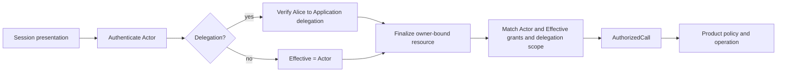

# Principal Identity And Access

Status: accepted first-release product contract; implementation status is tracked
in the engineering work plan.

Related decisions:

- `docs/adr/0002-principal-centered-identity-and-access.md`
- `docs/product/application-api-and-sdk.md`
- `docs/engineering/principal-identity-and-access-work-plan.md`

## 1. Outcome

Ardents has one portable cryptographic identity primitive: `Principal`.
Node, human, Application installation, and realm authority can each be a
Principal. `Operator` is not a kind of account: it is a Principal that holds an
administrative Access Grant for one Node. The same Alice Principal can therefore
operate `node:alpha` and `node:beta` through two independent grants.

A client program is not automatically the user. It is one of the following:

- a presentation adapter for a human Principal, such as `ardentsctl` holding an
  Alice device key;
- an Application Principal acting for itself;
- an Application Principal acting for Alice through an explicit, attenuated
  Delegation.

The daemon does not invent a separate daemon user for local calls. On network
protocols it acts as the Node Principal. On local interfaces it admits the
Principal proven by the request.

The guarantee is deliberately cryptographic: Ardents can guarantee that the
caller controls a key authorized for the same Principal. It cannot guarantee
that the Principal is a unique human, has a particular legal identity, or is
named Alice. Such claims require a separate realm attestation and remain local
policy inputs.

## 2. Required Properties

The design must provide all of these properties:

1. One Principal can be recognized on several Nodes without sharing a bearer
   token between them.
2. Authentication proves identity but never implies authority.
3. Operator and Application authority is scoped to an exact Node and interface.
4. A Node can revoke a grant without rotating the Principal's key or waiting for
   a session to expire.
5. A human can use several replaceable device keys without changing Principal.
6. An Application cannot claim an arbitrary `user_id`; acting for another
   Principal requires signed delegation and both parties' authority.
7. A leaked session, Access Grant, or Delegation for one Node/interface cannot be
   replayed against another Node/interface.
8. Existing private-channel `CapabilityGrant` semantics remain independent.
9. Waku/libp2p Peer ID remains a transport identity, never a user identity.
10. The common request path is local and does not synchronously depend on a realm
    server, certificate authority, wallet service, or network peer.

## 3. Identity Inventory

This table is normative. It prevents role, process, transport, and resource IDs
from becoming interchangeable strings.

| Entity | Target representation | Identity scope | Authentication rule |
|---|---|---|---|
| Human or long-lived pseudonymous user | Principal | Portable across Nodes | Proves a root or root-authorized device key |
| Node | Principal plus Node-owned runtime state | Portable network identity | Node key derives the canonical `p1_` identifier |
| Operator | Contextual role, not an entity | One Node and Operator Interface | Principal session plus Node-issued administrative grant |
| Application installation | Principal | Per installation by default | Its own root/device key and Application session |
| Application product/vendor | Optional attested claim | Realm or vendor namespace | Never inferred from an installation's display name |
| Workload | Node-scoped resource by default | One Node | Has no identity unless explicitly enrolled as an Application Principal |
| `ardentsctl` or an SDK client | Adapter | Process lifetime | Presents a Principal's signer/session; is not itself a Principal |
| Daemon process | Adapter for its Node | Process lifetime | Uses Node Principal only where the Node is the protocol actor |
| Device | Replaceable Credential key | One Principal | Root-signed Credential, never derived from private seed bytes |
| Session | Short-lived Credential | One Node, interface, and protocol major | Opaque secret issued after challenge proof |
| Realm | Governance/trust namespace | Deployment-defined | A realm authority may be a Principal and issue separate Attestations |
| Waku/libp2p peer | Waku Peer ID | Transport connection | Transport authentication only; never accepted as Principal ID |
| Content | Content Reference plus owner binding | Immutable payload/global reference | Reference proves bytes, not caller or ownership |
| Workload/service | Typed Node-scoped resource ID | One Node | Authority is determined from owner and Access Grants |
| Channel capability | Existing `CapabilityGrant` | Private messaging channel | Remains secret/channel-specific and is not an Access Grant |

An Application installation should generate a distinct Principal by default.
Reusing the same Application key on many hosts creates correlation and turns one
key compromise into a fleet-wide compromise. Vendor identity, if needed, is an
attestation over the installation Principal rather than a shared private key.

## 4. Core Model

### 4.1 Principal

A Principal is the stable identifier derived from one Ed25519 root public key.
The version 1 textual form is:

```text
p1_<lowercase unpadded base32 digest>
```

The 32-byte digest is:

```text
SHA-256("ardents:principal:v1\x00" || 0x01 || raw_ed25519_public_key)
```

`0x01` identifies Ed25519 within version 1. Parsers require the exact prefix,
alphabet, length, and checksum-free canonical spelling. They reject uppercase,
padding, whitespace, shortened values, unknown versions, and unknown key
algorithms. Comparisons use the decoded 32 bytes, not display strings.

The pre-release `p_<16 hex characters>` fingerprint is not a supported
Principal identifier. No released wire or persisted format accepts it, and no
runtime alias or migration mapping is provided. Every Node, human, and
Application Principal uses the canonical `p1_` form from creation.

Root-key rotation changes the Principal in v1. Recovery identities, mutable DID
documents, social recovery, and key-history consensus are explicitly deferred.
Human root keys should normally authorize device keys and remain offline. Node
root keys continue to use the protected Node keyring until a separate Node-key
hierarchy is justified.

A Principal does not need a global account record to exist. Enrollment is a
local relationship with one Node: the Principal proves its root/device keys and
the Node records the root binding and issues one or more Access Grants. The Node
does not create Alice's identity. A self-certifying Principal may successfully
prove a key yet remain unable to perform any protected action because it has no
grant on that Node.

### 4.2 Credential

A Credential is evidence that a key may authenticate one Principal. It never
contains permissions, roles, Node actions, resource scopes, or policy results.

The root public key establishes Principal, but it is not a normal session
Credential. A root signature is accepted only for the closed
`enrollment_proof` challenge purpose and yields a short one-use EnrollmentProof,
never a general session. Every normal Operator/Application session requires a
finite-lived device Credential:

```go
type KeyCredential struct {
    Version       uint32
    ID            CredentialID
    Subject       PrincipalID
    RootPublicKey [32]byte
    DeviceID      DeviceID
    DeviceKey     [32]byte
    Purposes      []CredentialPurpose // exact values; authenticate in v1
    NotBefore     time.Time
    NotAfter      time.Time
    Signature     []byte               // by Subject root key
}
```

Invariants:

- `Subject` must derive from `RootPublicKey`;
- `DeviceID` is a full domain-separated hash of `DeviceKey`;
- the private root seed is never used as an identifier input;
- unknown versions, algorithms, purposes, or fields fail closed;
- validity is finite and checked with the Node clock;
- a locally revoked device cannot create or refresh a session;
- revoking a device invalidates its live sessions;
- one Credential authenticates exactly one Principal.

The Device textual form is `d1_` plus lowercase unpadded base32 of:

```text
SHA-256("ardents:device:v1\x00" || 0x01 || raw_ed25519_device_public_key)
```

Key Credentials use the `kc1_` artifact prefix defined in section 4.8. A Node
accepts any structurally valid, unexpired, root-signed device Credential for the
claimed Principal unless its ID is locally revoked; presenting it does not write
durable state. Challenge/session caps prevent an unauthorised Principal from
turning Complete into persistent-state spam, and lack of Access Grants still
denies protected calls. A Node may record Credentials supplied during explicit
Enrollment, but that registry is informative rather than an allowlist.

Credential portability does not create an online global revocation guarantee.
Each Node enforces the revocations it has accepted locally; finite Credential
lifetime bounds stale knowledge. Cross-Node revocation distribution is a later
network protocol, not a hidden synchronous dependency.

The device key and its Key Credential are intentionally portable. Theft of the
device private key can therefore affect every Node where that Principal already
has grants until each Node receives a Device Revocation or the Credential
expires. Node/interface-bound sessions and independent grants limit but do not
erase this blast radius. Applications should use per-installation device keys;
humans should keep the root offline and rotate to a new DeviceID after compromise.

### 4.3 Audience

Every challenge, session, Access Grant, and Delegation has an exact audience:

```go
type Audience struct {
    Node          PrincipalID
    Interface     Interface // operator or application
    ProtocolMajor uint32    // 1 in the first version
}
```

The server derives Audience from the listener and protocol endpoint. A client
does not get to choose it. The Operator and Application interfaces retain
separate listeners, generated packages, handlers, action catalogues, and wire
credential schemes even though they share the identity/access implementation.

Challenges and sessions additionally carry a server-derived authentication
binding:

```go
type AuthenticationBinding struct {
    Audience         Audience
    TransportProfile TransportProfile // unix-local-v1; mtls-v1 is future
    PeerBinding      [32]byte
}
```

For `unix-local-v1`, `PeerBinding` is a domain-separated digest of the protected
listener identity and OS peer UID (or the strictly reduced fallback source from
section 4.7). A future `mtls-v1` profile binds the verified client certificate
SPKI fingerprint and any channel binding required by that transport contract.
Forwarded headers cannot supply these values. Access Grants and Delegations stay
logical Node/interface artifacts and do not need to be reissued for a transport
change; only authentication challenges/sessions are transport-bound.

### 4.4 Access Grant

An Access Grant is a Node-signed statement that a Principal may perform exact
actions within a typed resource scope on that Node:

```go
type AccessGrant struct {
    Version   uint32
    ID        AccessGrantID
    Issuer    PrincipalID // equals Audience.Node in v1
    Subject   PrincipalID
    Audience  Audience
    Actions   []Action
    Scope     ResourceScope
    NotBefore time.Time
    NotAfter  time.Time
    Signature []byte
}
```

Version 1 supports only these typed scopes:

- `node`: the audience Node and resources selected by the exact action;
- `principal-owned`: resources whose canonical owner is the named Principal;
- `exact`: one complete canonical ResourceRef, including Node, optional Owner,
  resource kind, and canonical resource ID.

There are no arbitrary globs, regular expressions, negative grants, global
`admin`, action-family inheritance, or grant-parent chains. Repeated actions are
sorted, unique, registered for the Audience interface, and matched exactly.
Unknown action or resource kinds fail closed. Every grant has finite validity.

Only the Node Principal issues local-interface Access Grants in v1. An Operator
is authorized to request issuance or revocation, but the resulting artifact is
signed by the Node authority. This keeps the final authority for local Node
resources local and avoids making a realm service part of every request.

### 4.5 Delegation

A Delegation lets one effective Principal authorize one Application Principal
to act within an attenuated subset of the effective Principal's existing Node
authority:

```go
type Delegation struct {
    Version       uint32
    ID            DelegationID
    Delegator     PrincipalID // effective Principal
    Delegatee     PrincipalID // authenticated Application actor
    Audience      Audience    // Application Interface only
    Actions       []Action
    Scope         ResourceScope
    NotBefore     time.Time
    NotAfter      time.Time
    Credential    KeyCredential // identifies the signing device
    Signature     []byte        // by that device key
}
```

A Delegation does not create authority. It can only narrow the Delegator's
current Access Grants. Version 1 permits one hop, normally Alice to an
Application installation; it is not re-delegable and cannot target the Operator
Interface. Its `Delegatee`, Node, interface, actions, scope, and validity are all
signed. Default validity is short; the hard v1 maximum is 24 hours.

Version 1 Delegations must be signed by a valid device Credential; direct root
signing is deliberately forbidden so consent does not normalize use of an
offline root key. Revoking that DeviceID invalidates every Delegation signed by
that device on the Node, including Delegations carrying a renewed Credential for
the same key. A Delegation Revocation is signed by the same device and includes
the same Credential; if the device is lost, a Node-local Device Revocation is
the recovery operation.

Verification explicitly requires `Credential.Subject == Delegator`, derives
that Subject from `Credential.RootPublicKey`, derives DeviceID from the embedded
device key, and verifies the Delegation with that key. A valid Credential for a
different Principal can never be used to select Delegator.

If the Actor and effective Principal differ, Delegation is mandatory. A header,
request field, display name, Unix user ID, Waku Peer ID, or workload owner string
can never select an effective Principal.

### 4.6 Session

A successful challenge proof produces a random 32-byte opaque session secret.
The server stores only an HMAC-SHA-256 lookup value and these facts:

```go
type Session struct {
    ID           SessionID
    Principal    PrincipalID
    DeviceID     DeviceID
    CredentialID CredentialID // exact presented device Key Credential
    Binding      AuthenticationBinding
    IssuedAt     time.Time
    ExpiresAt    time.Time
}
```

Sessions contain no permissions. Every admitted call re-evaluates current grants,
delegation, revocations, and product Policy. Sessions are memory-resident,
disappear on daemon restart, have a 15-minute default TTL and a one-hour hard
maximum, and are accepted only on their exact Audience. The secret is returned
once and must never appear in logs, diagnostics, errors, or persisted snapshots.

An opaque session is still a bearer secret. It is accepted only over the
permission-protected local sockets or a future explicitly specified mTLS remote
transport.

### 4.7 Version 1 Bounds

These are protocol maximums, not suggested implementation defaults. Lower
configuration values are allowed; higher values require a protocol-major
decision.

| Item | v1 bound |
|---|---|
| Challenge lifetime | 120 seconds, no clock-skew extension |
| Active challenges | 4,096 per Node and 8 per normalized transport source |
| Begin rate | token bucket, 10/minute/source with burst 8 |
| Session lifetime | 15-minute default, 60-minute hard maximum, no skew extension |
| Active sessions | 16,384 per Node and 16 per `(source, Principal, Audience)` |
| Bootstrap Ticket | 10-minute hard lifetime, one active ticket per new Node |
| Key Credential | 90-day default, 365-day hard lifetime |
| Access Grant | 30-day default, 365-day hard lifetime |
| Delegation | 15-minute default, 24-hour hard lifetime |
| Portable artifact clock skew | at most 120 seconds at each boundary |
| Actions per Grant/Delegation | 64, each 1–128 ASCII bytes |
| Resource kind / canonical ID | 32 / 512 bytes |
| Key Credential artifact | 4 KiB decoded |
| Access Grant/Delegation/revocation | 16 KiB decoded each |
| Authorization header | exactly one value, at most 128 encoded bytes |
| Delegation header | zero or one value, at most 22 KiB encoded and 16 KiB decoded |

The rate-limit source is never a client-supplied Principal. For a Unix socket it
is the peer UID obtained from OS peer credentials when supported; otherwise all
connections on that protected listener share one source bucket in addition to
the global bound. A future mTLS adapter uses the verified certificate
fingerprint. Unknown/unavailable peer credentials must reduce limits, not disable
them.

All v1 timestamps are protobuf UTC Unix seconds with `nanos == 0` and must be in
`[2020-01-01T00:00:00Z, 2100-01-01T00:00:00Z)`. Zero, negative, non-zero nanos,
out-of-range, or `NotAfter <= NotBefore` is noncanonical. Intervals are
half-open: `[NotBefore, NotAfter)`. The configured maximum lifetime is evaluated
as `NotAfter - NotBefore` before skew. A portable signed artifact is accepted
only when `now >= NotBefore - 120s` and `now < NotAfter + 120s`. Challenges and
sessions receive no skew: `IssuedAt <= now && now < ExpiresAt`. A revocation with
`RevokedAt > now + 120s` is rejected; once accepted, it is effective immediately
and permanently regardless of its stated time.

### 4.8 Canonical Signed Bytes

Credential, Access Grant, Delegation, and revocation signatures use one profile:

```text
ASCII("ardents:<artifact>:v1\x00") || deterministic_protobuf(payload_without_signature)
```

The exact version 1 domains, textual ID prefixes, and allowed signers are:

| Artifact | Signature/hash domain | ID prefix | Signer |
|---|---|---|---|
| Key Credential | `ardents:key-credential:v1\x00` | `kc1_` | Subject root key |
| Access Grant | `ardents:access-grant:v1\x00` | `ag1_` | Audience Node root key |
| Delegation | `ardents:delegation:v1\x00` | `dl1_` | Delegator device key named by embedded Credential |
| Node-local Device Revocation | `ardents:device-revocation:v1\x00` | `dv1_` | Audience Node root key |
| Access Grant Revocation | `ardents:access-grant-revocation:v1\x00` | `ar1_` | Original grant issuer Node root key |
| Delegation Revocation | `ardents:delegation-revocation:v1\x00` | `dr1_` | Same Delegator device key and Credential as the Delegation |

An artifact ID is the prefix plus lowercase unpadded base32 of SHA-256 over the
same domain-prefixed canonical unsigned payload. The ID displayed in the
pseudocode structures is derived envelope metadata: it is not a field inside the
payload being hashed and signed. A received envelope ID is always recomputed.

Signed messages contain no maps; unknown fields are rejected; timestamps are
normalized; repeated set-like fields are sorted and unique before signing.
Golden vectors must cover every artifact and be consumable by SDK
implementations. Node-local Device Revocation is authoritative only for its
exact Node Audience. Portable owner-issued Device revocation/distribution is
deferred; finite Credential lifetime bounds the gap.

Revocation payloads are not generic. Each contains `version`, `target_id`,
`issuer`, exact `audience`, and normalized `revoked_at`; Device Revocation
contains `target_device_id` and Subject, while Delegation Revocation contains
Delegator, Delegatee, and the signing Key Credential. The target ID prefix must
match the revocation type. A Device Revocation may be recorded preemptively for
an unseen DeviceID when an authorized request supplies the Subject; this prevents
renewing the same compromised device key under another KeyCredentialID. Grant
targets must already be known. A valid Delegation Revocation may arrive before
the Delegation because its signer and parties can be verified independently. Revocation is permanent
and idempotent: replay of the same canonical payload returns the existing
record; a different payload for the same revocation ID or target is Conflict.
Revocation records are never deleted merely because the target expired.

Signing arbitrary JSON, Go structs, request bodies, or display strings is not
permitted.

## 5. Actor, Effective Principal, And Roles

An admitted call carries two identities:

```go
type AuthorizedCall struct {
    actor        PrincipalID // directly authenticated Principal
    effective    PrincipalID // authority being exercised
    audience     Audience
    action       Action
    resource     ResourceRef
    sessionID    SessionID
    grantIDs     []AccessGrantID
    delegation   *DelegationID
    authorizedAt time.Time
    seal         *callSeal
}
```

All fields are private and exposed through read-only getters that copy slices.
Only successful `access.Service.Admit` can construct the private non-nil seal.
`access.ContextWithAuthorizedCall` rejects an unsealed/zero value, stores it
under a private context key, and `AuthorizedCallFromContext` rechecks the seal.
No public struct literal, deserializer, mapper, test helper outside the access
package, or generic context key may manufacture Actor/Effective. Protocol tests
obtain calls through a real access fixture.

For direct calls, `Actor == Effective`. For an Application acting for Alice,
`Actor == GalleryApplication` and `Effective == Alice`. Audit records retain
both. Product modules use `Effective` for ownership and authorization-sensitive
resource selection and use `Actor` when attribution to the executing Application
matters.

Roles are derived, never stored as Principal flags:

```text
Operator of Alpha = Principal + valid operator Audience grant issued by Alpha
Application on Alpha = Principal + valid application Audience grant issued by Alpha
Alice on Alpha and Beta = one Principal + two independent grant sets
```

There is no `principal.kind = user`, `is_operator`, global administrator role, or
special Operator key class.

## 6. Authentication Protocol

Both public surfaces expose their own `BeginAuthentication` and
`CompleteAuthentication` RPCs. They share semantics but not generated protocol
packages.

### 6.1 Begin

The client sends the Principal ID and one closed purpose: `session` or
`enrollment_proof`. The listener supplies AuthenticationBinding.
`enrollment_proof` is usable only inside the enrollment transaction and can
never be exchanged for a general session. The Node returns structured fields:

```go
type Challenge struct {
    Version        uint32
    ID             [16]byte
    Nonce          [32]byte
    Principal      PrincipalID
    Binding        AuthenticationBinding
    Purpose        ChallengePurpose
    IssuedAt       time.Time
    ExpiresAt      time.Time
}
```

Challenges are random, single-use, memory-resident, bounded per source and
globally, and expire within two minutes. The SDK validates every returned field,
reconstructs deterministic protobuf, and signs exactly one of:

```text
"ardents:authentication-challenge:v1\x00" || canonical_challenge_fields
"ardents:enrollment-challenge:v1\x00"     || canonical_challenge_fields
```

The Node never supplies opaque bytes to a generic signing function. Typed signer
methods select the domain themselves, so a hostile Node cannot turn login into a
Key Credential or Delegation signing oracle.

### 6.2 Complete

For `session`, the client returns challenge ID, root public key, mandatory device
Key Credential, and a device signature over the reconstructed authentication
challenge. For `enrollment_proof`, it returns root public key and a root signature
over the enrollment domain; Complete returns a one-use EnrollmentProof instead
of Session. The Node performs, in order:

1. strict size, version, and structural validation;
2. challenge lookup, Purpose/AuthenticationBinding match, secure-transport
   eligibility, and expiry check;
3. `PrincipalID` derivation from root public key and an explicit equality check
   against `Challenge.Principal` and the request Principal;
4. for a session, require `Credential.Subject == Challenge.Principal`,
   `Credential.RootPublicKey == supplied root key`, the derived DeviceID, exact
   authenticate purpose, validity, and no Device revocation;
5. challenge signature verification with the required root/device key and exact
   challenge domain;
6. atomic challenge consumption before session issuance;
7. issuance of either a session bound to Principal, DeviceID, CredentialID, and
   AuthenticationBinding, or a one-use EnrollmentProof bound to the enrollment
   request.

A failed completion does not reveal whether the Principal, Credential, or
challenge was known. A consumed or expired challenge is never restored after a
later failure.

### 6.3 Presentation

Wire schemes stay interface-specific:

```text
Authorization: ArdentsOperatorSession <base64url-secret>
Authorization: ArdentsApplicationSession <base64url-secret>
Ardents-Delegation: <base64url-canonical-delegation>   # only when needed
```

Header count and decoded sizes are bounded before parsing. The Application SDK
manages its own session. A human-facing wallet or client creates a signed
Delegation; it does not hand Alice's general session secret to the Application.

## 7. Authorization Algorithm

Protocol adapters derive `Action` from the registered RPC procedure and
canonicalize request fields into a `ResourceTarget`; identity/access finalizes
the `ResourceRef` after Actor/Effective are known. The client never supplies an
authoritative action string or resource owner.

The identity/access owner admits a call in this exact order:

1. validate cheap envelope/header/request-size bounds and the server-derived
   Audience/Action; do not hash or deeply decode an unauthenticated payload;
2. validate the session and derive Actor;
3. reject expired Actor Credentials, revoked Actor DeviceIDs, and Audience
   mismatch;
4. use the registered method extractor to validate and canonicalize a
   request-only `ResourceTarget` that contains no claimed owner;
5. if no Delegation is present, set `Effective = Actor`;
6. if Delegation is present, verify its structure, signature, time, Audience,
   `Delegatee == Actor`, `Credential.Subject == Delegator`, root/Principal and
   device/DeviceID bindings, one-hop rule, action, and revocation; derive
   `Effective = Delegator` without yet accepting its resource scope;
7. finalize canonical ResourceRef from `(ResourceTarget, Audience, Actor,
   Effective)`; the request cannot supply or override Effective/Owner;
8. find current Node-issued Actor Access Grants matching exact action/resource;
9. find current Node-issued Effective Access Grants matching the same
   action/resource;
10. require the intersection of Actor grant, Effective grant, Delegation scope,
    and request resource; when Actor equals Effective, one matching grant
    suffices;
11. construct an authenticity-sealed `AuthorizedCall`;
12. invoke the owning product module, which may apply its separate Policy,
    lifecycle, quota, retention, and state-transition rules.



Identity/access answers “may this Principal attempt this action on this
resource?” Product Policy answers contextual questions such as quota, retention,
workload admission, current lifecycle state, or content availability. Neither
layer silently substitutes for the other.

### 7.1 Canonical Resource Contract

`ResourceRef` is a closed value, not a joined string:

```go
type ResourceRef struct {
    Kind  ResourceKind
    Node  PrincipalID // always equals Audience.Node
    Owner *PrincipalID
    ID    string
}
```

Canonical signed encoding length-prefixes the four fields. `Kind` is one of the
registered values below. `Node` is mandatory. `Owner` is present only for an
owner-sensitive resource. `ID` must already be in the canonical form owned by
the target module; trimming, case folding, path cleaning, or delimiter joining
inside access control is forbidden. Empty IDs are allowed only for the named
singleton/collection kinds whose identity is the Node or Owner. The 512-byte
bound applies after canonical encoding.

Scope matching is exact:

- `node(N)` matches any registered ResourceRef whose Node is `N`;
- `principal-owned(P)` matches only ResourceRefs with `Owner == P`;
- `exact(R)` matches all canonical fields of one ResourceRef.

Every procedure has exactly one two-phase extractor registered beside its exact
action. `Canonicalize(request)` returns a request-only `ResourceTarget` or a
structural error; it cannot query product state or include a claimed owner.
`Finalize(target, Audience, Actor, Effective)` returns one ResourceRef and is the
only place an effective owner is attached. Neither phase chooses authority.
Authentication procedures are explicitly marked public/bounded rather than
omitted from the catalogue.

The initial Operator catalogue is:

| Exact action(s) | Canonical resource extractor |
|---|---|
| `node.start`, `node.stop`, `node.status`, `node.capabilities`, `node.runtime`, `node.events` | `node(Audience.Node)` |
| `config.effective`, `config.reload` | `configuration(Audience.Node)` singleton |
| `transport.network_status`, `transport.route_candidates` | `network(Audience.Node)` singleton/collection |
| `discovery.status`, `discovery.local_presence`, `discovery.peers`, `discovery.list_records` | corresponding discovery collection on Audience Node |
| `discovery.resolve_record` | exact `discovery-record(kind, subject)` from strict request values |
| `discovery.resolve_service` | exact `service(request.service)` |
| `discovery.import` | exact kind-specific record ID derived from the structurally validated signed record, before import |
| `workload.register` | exact `workload(request.spec.id)`; missing/noncanonical ID fails before mutation |
| `workload.start`, `workload.stop`, `workload.restart`, `workload.status` | exact `workload(request.id)` |
| `workload.list` | `workload-collection(Audience.Node)` |
| `workload.hosted_service`, `workload.service_publication` | exact `service(request.id)` |
| `workload.hosted_services` | `service-collection(Audience.Node)` |
| `data.publish_object`, `data.get_object` | exact `content-object(request.object.id or request.id)`; publish requires a canonical non-empty ID |
| `data.list_objects` | `content-object-collection(Audience.Node)` |
| `data.publish_blob` | exact `content-blob(ContentReference)` computed/validated from the bounded authenticated payload; declared ID/CID must match |
| `data.get_blob`, `data.fetch_blob`, `data.retain_blob`, `data.pin_blob`, `data.drop_blob`, `data.blob_sources` | exact `content-blob(request.id)` |
| `data.list_blobs` | `content-blob-collection(Audience.Node)` |
| `data.get_transfer` | exact `transfer(request.id)` |
| `data.list_transfers` | `transfer-collection(Audience.Node)` |
| `data.publish_manifest`, `data.get_manifest` | exact `content-manifest(request.manifest.id or request.id)`; publish requires a canonical non-empty ID |
| `data.list_manifests`, `data.inventory` | corresponding content collection on Audience Node |
| `diagnostics.snapshot`, `diagnostics.health_summary` | `diagnostics(Audience.Node)` singleton |
| `diagnostics.pending_operations` | `operation-collection(Audience.Node)` |
| `diagnostics.explain_failure` | exact `diagnostic-subject(request.scope, request.resource_id)` after closed scope parsing |
| `diagnostics.recent_events` | `event-collection(Audience.Node)`; cursor/limit narrow the query, not authority |

The initial Application catalogue is:

| Exact action | Canonical resource extractor |
|---|---|
| `application.content.put` | prospective `content-owner(Node, Effective)`; after admission the resulting Content Reference must be bound atomically to that same Effective Principal |
| `application.content.get` | exact `owned-content(Node, Effective, request.reference)`; a binding for that pair must already exist |

The initial Operator identity-administration catalogue is:

| Exact action | Canonical resource extractor |
|---|---|
| `identity.principal.enroll` | exact `principal(request.principal_id)` after possession proof; first enrollment additionally requires the one-use Bootstrap Ticket |
| `identity.device.revoke` | exact `device(Node, request.principal_id, request.device_id)`; the Principal/Device binding is verified from the submitted Credential or explicit preemptive revocation request |
| `identity.device-revocations.list` | `device-revocation-collection(Node, request.principal_id)`; the Principal filter is mandatory |
| `identity.grant.issue` | exact `grant-proposal(hash(canonical subject, Audience, sorted actions, scope, validity))` |
| `identity.grant.revoke` | exact `access-grant(request.grant_id)` |
| `identity.grant.list` | `grant-collection(request.subject_principal)`; the Subject filter is mandatory |

Begin/Complete are `public_bounded` and have no grant resource. Bootstrap Ticket
is an alternate authenticator only for `identity.principal.enroll`; it is never
accepted by the other methods. Administration may not fall back to a generic
Node resource merely because the operation is privileged. The code catalogue
and these tables are synchronized protocol artifacts; adding a procedure requires its
extractor and sibling-denial test in the same change.

The grant-proposal ID is lowercase unpadded base32 of
`SHA-256("ardents:grant-proposal:v1\x00" || canonical_length_prefixed_tuple)`;
it is a request-resource identifier, not an Access Grant ID or signed artifact.

## 8. Required Flows

### 8.1 First Operator Enrollment

`ardentsd init` creates the Node Principal and a random, single-use local
Bootstrap Ticket. A Bootstrap Ticket is not a Principal and is accepted only by
the first-operator enrollment operation. Alice generates her own root/device
keys, proves possession, and the Node issues an Operator Access Grant for Alice.
The ticket is atomically consumed and its file is deleted by the provisioning
workflow.

There is no permanent Operator token or bearer break-glass path. Recovery uses
the documented Principal/device/grant administration mechanisms and protected
state backup; the Bootstrap Ticket exists only for the first enrollment.

### 8.2 Alice Operates Two Nodes

1. Alice keeps one Principal and device Credential.
2. Alpha issues a grant with Audience `(Alpha, operator, 1)`.
3. Beta independently issues a grant with Audience `(Beta, operator, 1)`.
4. Alice authenticates separately to both Nodes; the CLI caches two short
   sessions indexed by Audience.
5. Revoking the Alpha grant does not alter Alice Principal, Credential, Beta
   grant, or Beta session. The Alpha session remains authenticated but its next
   administrative call is forbidden because grants are re-evaluated.

### 8.3 Application Enrollment And Own Calls

An Application installation generates its key locally and proves possession
through a one-time enrollment operation authorized by an Operator. The Node
issues exact Application-interface actions with Node scope. For a direct call,
server-owned resource finalization still binds `Effective` and every owned
resource to the Application Principal; Node scope does not let the Application
select another owner. The Application then authenticates and calls with
`Actor == Effective == Application`.

No shared or installation-wide Application bearer token is created. The
Application's own Principal, device Credential, Node-issued grant, and
Application session are required from the first supported release.

### 8.4 Application Acts For Alice

Assume Gallery needs Alice's content:

1. Gallery authenticates as its own Application Principal.
2. Alice has a Node grant for the requested action and owner/resource scope.
3. Gallery has a Node grant allowing that Application action.
4. Alice's signer displays Node, Application, exact actions, scope, and expiry,
   then signs a Delegation to Gallery.
5. Gallery presents its session and Alice's Delegation.
6. The Node derives `Actor = Gallery`, `Effective = Alice` and applies the
   intersection described above.

Gallery never receives Alice's root key, device private key, or unrestricted
session. Removing any one of the two grants or the Delegation denies the call.

### 8.5 Content Ownership

Content-addressing proves payload identity, not ownership. The content owner
must maintain a durable binding keyed by `(Owner PrincipalID, Content Reference)`
so identical bytes may be owned by several Principals without duplicating the
payload.

Application `Put` derives owner from `AuthorizedCall.Effective`; a
request-provided owner is rejected. Operator content commands retain their
Node-administrative semantics until their separate typed-owner cleanup and do
not silently reinterpret a pre-release untyped `owner` string as a human Principal.

For Application Put, payload publication and ownership use this crash-safe
order:

1. write, bound, hash, and fsync a temporary payload;
2. atomically install the content-addressed payload file (an existing identical
   payload makes this step idempotent);
3. in one catalogue transaction, commit blob metadata and the
   `(Effective Principal, Content Reference)` owner binding;
4. after a crash between steps 2 and 3, startup reconciliation treats the file
   as unreferenced payload and may reclaim it; it never invents a binding.

Application `Get` resolves the pair `(Effective Principal, Content Reference)`
and requires an existing owner binding before local read or network fetch. A
remote fetch may fill missing bytes for an existing binding, but successful
payload verification does not create ownership. Version 1 has no implicit
“claim any known CID” operation; sharing/import must later introduce an explicit
authorized binding command. Public NotFound/PermissionDenied mapping must not
become a cross-owner existence oracle.

## 9. Module Boundary

The target adds one deep owner, `internal/identity/access`. Before creating that
directory, implementation must update the exhaustive topology in
`docs/engineering/codebase-architecture.md` through the architecture task in the
work plan.

One concrete `access.Service` owns challenge/session lifecycle, Credentials,
Access Grants, Delegations, revocations, and admission decisions. Consumers
declare narrow interfaces beside themselves:

```go
type Authenticator interface {
    Begin(context.Context, BeginRequest) (Challenge, error)
    Complete(context.Context, CompleteProof) (SessionCredential, error)
}

type Admitter interface {
    Admit(context.Context, Attempt) (AuthorizedCall, error)
}

type Administrator interface {
    EnrollPrincipal(context.Context, AdminAttempt, EnrollmentSpec) (Enrollment, error)
    RevokeDevice(context.Context, AdminAttempt, DeviceID) error
    IssueGrant(context.Context, AdminAttempt, GrantSpec) (AccessGrant, error)
    RevokeGrant(context.Context, AdminAttempt, AccessGrantID) error
}
```

Administration methods accept the original authenticated attempt and recheck
authority in the same durable transaction as the mutation. A handler must not
perform `Admit`, then mutate grant state later through an unauthenticated store
method.

The Module hides:

- canonical encoding and domain-separated signatures;
- Principal/device/artifact ID derivation;
- challenge bounds, atomic consumption, and replay prevention;
- Credential validation and Device revocation;
- session issuance, hashing, lookup, expiry, and invalidation;
- exact action and typed resource matching;
- Actor/Effective derivation and Delegation attenuation;
- grant mutation concurrency and safe audit reasons;

It does not own product Policy, content ownership facts, workload state,
transport encryption, Waku identity, UI consent, or realm governance.

Existing identity packages retain these boundaries:

- `identity/principal`: typed Principal codec and derivation;
- `identity/keyring`: protected Node root-key continuity;
- `identity/capability`: private-channel capability validation;
- `identity/access`: local-interface authentication and grant-based admission.

### 9.1 Dependencies

In-process implementation details require no interfaces: Ed25519, canonical
codec, action catalogue validation, resource matching, and grant evaluation.

Local-substitutable dependencies have production and in-memory implementations:

```text
EnrollmentRepository   known enrollment bindings and metadata
DeviceRevocations      permanent Node-local DeviceID revocations
GrantRepository        durable signed grants and revocations
SessionStore           bounded in-memory sessions
ChallengeStore         bounded atomic one-use challenges
Clock                  system/fake time
Entropy                crypto/rand/deterministic test source
AuditSink               redacted security outcomes
```

Realm authorities are remote-but-owned artifact issuers, not synchronous call
dependencies. OS keychains, hardware security modules, ssh-agent-like signers,
and wallet UIs are true external client-side Signer adapters and are added only
when a real implementation is selected.

## 10. Surface And SDK Integration

The Operator and Application adapters remain separate and thin:

- map a registered procedure to one exact action;
- derive Audience from their listener;
- derive/canonicalize ResourceRef from the request;
- parse the interface-specific session presentation;
- call `Admit` and put `AuthorizedCall` into request context;
- map public errors without leaking identity existence or secrets.

New session credentials are neither issued nor accepted on the current plaintext
loopback HTTP listeners. Begin/Complete for the new scheme are not registered
there. Version 1 transport acceptance is:

| Transport | Operator session | Application session | Rule |
|---|---:|---:|---|
| Permission-protected Unix socket | issue/accept | issue/accept | Default same-host transport; session bound to listener and peer UID |
| Plaintext loopback HTTP | no | no | Principal authentication endpoints and protected calls are not exposed |
| SSH stream-local forwarding to the Unix socket | yes | no normal need | SSH protects the remote leg; the target is the protected socket, not loopback TCP |
| TCP with the future Ardents mTLS profile | future issue/accept | future issue/accept | Requires a separate transport contract and verified certificate/channel binding |
| Non-loopback plaintext TCP | no | no | Forbidden |

The server must know which listener accepted a request and derive Audience and
credential scheme from that listener; forwarded headers cannot upgrade a
plaintext connection. `ardentsctl --ssh` must move from `ssh -W` loopback TCP to
OpenSSH stream-local forwarding (or an equivalently reviewed remote helper)
before it sends Principal sessions.

The Application content handler must no longer parse authentication headers
itself. Authentication happens once in the Application adapter/interceptor and
the proven Actor/Effective values flow to product handlers.

Client libraries expose typed signers rather than a token string or generic
`Sign([]byte)` oracle:

```go
type SessionSigner interface {
    Principal(context.Context) (PrincipalID, error)
    Credential(context.Context) (CredentialPresentation, error)
    SignAuthenticationChallenge(context.Context, AuthenticationChallenge) ([]byte, error)
}

type EnrollmentSigner interface {
    Principal(context.Context) (PrincipalID, error)
    IssueKeyCredential(context.Context, KeyCredentialSpec) (KeyCredential, error)
    SignEnrollmentChallenge(context.Context, EnrollmentChallenge) ([]byte, error)
}

type DelegationSigner interface {
    SignDelegation(context.Context, DelegationProposal) (Delegation, error)
}
```

Each typed method reconstructs and displays/validates its own canonical fields
and hard-coded signature domain before the key adapter receives bytes. A raw
Ed25519 function may exist inside a key-custody adapter, but it is not an SDK,
CLI, plugin, or Application-facing interface.

The client owns challenge/complete/session refresh and caches sessions by exact
Audience. Signer implementations may use protected files, an OS key provider,
or a future wallet. The Node protocol does not depend on which implementation
signed the bytes. SDKs validate against shared golden vectors and never import
Ardents `internal/*` packages.

## 11. Persistence, Revocation, And Concurrency

Signed Credentials, Access Grants, Delegations accepted for revocation, and
their revocation records are stored as canonical bytes plus indexed fields in
owner-specific bbolt buckets. Parsed fields are a cache; verification always
binds them to the stored canonical artifact.

The current open-per-call `storage.LoadJSON`/`SaveJSON` API cannot provide the
required cross-record transaction and already serves other owners through the
shared `ardents.db`. Identity Access therefore gets a separate
`identity-access.db` under the Node state directory. Storage owns one long-lived
handle for that file and exposes bounded consumer transactions without leaking
`bbolt` types:

```go
type Database interface {
    View(context.Context, func(ReadTransaction) error) error
    Update(context.Context, func(WriteTransaction) error) error
}
```

Identity repositories receive the transaction supplied by `access.Service`.
For an administration command, session proof is checked first, then current
Credential/grant authority is re-read and the mutation/idempotency/audit-outbox
record is committed in one write transaction. Backup, daemon shutdown, and
released-schema upgrade must coordinate with the same database lifecycle; a
second process or helper may not open the live bbolt file independently.

`identity-access.db` contains signed/public artifacts, enrollment/revocation
metadata, idempotency records, audit-outbox records, and Bootstrap Ticket digests
only. It never contains private keys, session secrets, or raw Bootstrap Tickets.
Whole-state backup treats `ardents.db`, `identity-access.db`, key files, and
released-schema upgrade markers as one consistency group even though no transaction spans the
two product databases.

Challenges and sessions are deliberately ephemeral. Restart invalidates them;
clients reauthenticate. Stores have hard count/size bounds, deterministic expiry
cleanup, and per-source creation limits. Time comparisons use an injected clock
and one documented clock-skew allowance for signed portable artifacts; local
sessions use the issuing Node's time without skew extension.

Grant issuance/revocation and the durable authorization recheck that permits it
occur in one transaction. Revoking a grant is immediately visible to subsequent calls
because sessions do not cache authority. Revoking a DeviceID also removes every
session indexed by that DeviceID and invalidates renewed Credentials and
Delegations using the same device key.

No private key, session secret, Bootstrap Ticket, channel secret,
or unredacted canonical delegation is written to audit or diagnostics.

## 12. Realm Trust And Certificates

Self-certifying identity answers “which cryptographic Principal?” It does not
answer “should this Principal be trusted?” A realm authority may issue a
separate, purpose-scoped `RealmAttestation` such as membership, organization, or
vendor identity. A Node explicitly trusts an authority for exact attestation
purposes and evaluates the claims in local Policy.

Realm Attestations do not replace Node Access Grants and do not make the realm
authority an online dependency of local calls. Trust for discovery publication,
channel grant issuance, and identity attestation must be purpose-scoped rather
than sharing one untyped “trusted issuer” map.

X.509/mTLS remains appropriate for authenticating a future remote transport.
It is not the Principal format, does not carry Ardents permissions, and does not
replace challenge authentication or Access Grants. A certificate may optionally
attest a Principal public key only through an explicitly designed binding.

## 13. Errors And Audit

Public interfaces expose only stable categories:

| Public result | Meaning |
|---|---|
| `Unauthenticated` | Presentation is missing, malformed, expired, replayed, revoked, incorrectly signed, or for another Audience |
| `PermissionDenied` | A Principal was authenticated but exact grant/delegation authority is absent |
| `InvalidArgument` | A non-secret request resource is structurally invalid |
| `Conflict` | A credential/grant mutation conflicts with current durable state |
| `ResourceExhausted` | Authentication bounds or rate limits are exceeded |
| `Unavailable` | Required local identity state cannot be read safely |
| `Internal` | An implementation invariant failed |

External authentication failures do not distinguish unknown Principal,
Credential, signature, challenge, or revocation. Internal audit uses stable
redacted reasons such as `challenge_replayed`, `audience_mismatch`,
`device_revoked`, `action_unregistered`, `actor_grant_missing`,
`effective_grant_missing`, `delegation_invalid`, and `store_unavailable`.

Every denied protected call and every successfully dispatched mutating call
records Node, interface, action, Actor when safely known, Effective when safely
known, grant/delegation IDs, outcome, reason, and correlation ID. Successful
read-only calls do not append diagnostics events, because reading diagnostics
must not mutate the stream being read; they may increment bounded, non-identity
metrics. This preserves the existing Operator audit contract. Audit never
records request/response payloads, object references, proof bytes, or secrets.

## 14. Identification Debt Outside The New User Model

The following current representations were reviewed. “Separate” means the
distinction is intentional, not missing unification.

| Current shape | Decision | Required disposition |
|---|---|---|
| `principal.DeriveID` truncates SHA-256 to 8 bytes | Remove | Use strict full-length `p1_` exclusively before the first release; no compatibility parser or alias |
| Node `Device` is derived from the same private seed as Node Principal | Replace | Make Device a real independent public key Credential or remove the field where no device exists |
| `SubjectRef{Kind:"token"}` identifies a configured bearer label | Remove | Derive Actor only from cryptographic proof; do not retain token subjects in runtime or audit |
| Operator and Application authorizers duplicate token/action logic | Remove | Keep Principal-session surface adapters separate; route both to `identity/access` |
| Channel `CapabilityGrant` includes secrets and Waku permissions | Separate | Keep as `ChannelGrant` concept; never reuse it as Access Grant |
| Discovery record repeats `ID`, `Subject`, `Node`, `Device`, `Owner` | Normalize later | Define kind-specific signed record payloads; remove fields that cannot differ |
| Replication `PeerID` often contains a Node Principal | Rename | Use `NodePrincipal`/`TargetNode`; reserve Peer ID for Waku/libp2p |
| Blob `ID` and `CID` are constrained equal | Normalize before release | Keep one Content Reference in the domain model and remove the duplicate pre-release fields |
| Content/workload/service `Owner` is an arbitrary string | Type and scope | Security-relevant owners become PrincipalID or typed ResourceOwner; local workload ownership remains explicitly Node-scoped |
| Trust anchors and issuer maps duplicate public-key trust | Consolidate later | One purpose-scoped trusted-Principal registry with owner-specific projections |
| “Capability” means action, channel secret, workload requirement, and transport feature | Rename vocabulary | Permission, Channel Grant, Workload Requirement, and Transport Feature respectively |

Do not merge these valid distinctions:

- Principal ID and Waku Peer ID;
- Principal and Credential/Session;
- Node Principal and Node-scoped workload/service ID;
- content reference and owner binding;
- Realm ID and realm-authority Principal;
- local Access Grant and private-channel CapabilityGrant.

## 15. Security Model

| Threat | Required control |
|---|---|
| Stolen session | Short TTL, exact Audience, protected transport, no embedded rights, revocation recheck |
| Challenge replay | 32-byte nonce, two-minute expiry, atomic one-use consumption |
| Cross-Node or cross-interface replay | Node/interface/protocol Audience in challenge, session, grant, and delegation |
| Confused deputy Application | Actor and Effective retained separately; exact Delegatee and intersection of both grants |
| Privilege escalation by strings | Server-derived action/resource, typed parsers, exact matching, unknowns denied |
| Signature-format ambiguity | Domain-separated deterministic bytes, no maps/JSON, golden vectors |
| Identifier collision | Full 256-bit digest and strict versioned codec |
| Root key theft | Device keys for routine human use, protected key stores, finite credentials; recovery deferred explicitly |
| Stale permissions | Grants checked per call; durable immediate revocation |
| Identity enumeration | Uniform external auth errors and bounded endpoints |
| Realm outage/compromise | No synchronous dependency; purpose-scoped trust; Node remains local grant authority |

Security-sensitive decisions fail closed on unavailable stores, unknown versions,
unknown actions, malformed scopes, or malformed identity.

## 16. Greenfield Delivery Strategy

The first release is Principal-only and reads one canonical versioned
configuration contract. Pre-release bearer authentication, coexistence state
machines, dual credential parsing, truncated `p_` identifiers, alternate
configuration inputs, and identity-cutover tooling are not product contracts
and must be deleted rather than preserved behind flags. This is a greenfield
release, not a production identity migration, and there is no supported dual
path.

1. Freeze the canonical `p1_`/`d1_` and signed-artifact formats and golden
   vectors before issuing real credentials.
2. Create fresh Node, human, and Application identity state directly in the
   canonical formats. Runtime parsers never accept `p_`, aliases, or ambiguous
   alternate spellings.
3. Build `identity/access`, protected Operator sessions, Application sessions,
   one-use enrollment tickets, grants, revocations, and one-hop Delegation as
   the only public identity path.
4. Provision the first Operator through a short-lived one-use Bootstrap Ticket.
   Enroll each Application installation through its own short-lived one-use
   enrollment ticket. Neither mechanism is a normal session or reusable
   credential.
5. Use one canonical versioned configuration document. Pre-release environment
   and token-file compatibility inputs are rejected rather than translated.
6. Complete owner binding and identifier/trust cleanup directly against the
   canonical model, then run the full adversarial and release suites.

Operator and Application keep distinct listeners, wire schemes, and action
catalogues. Each accepts only its own Principal session scheme for protected
calls. A malformed, expired, unknown, or cross-surface session fails closed;
there is no alternate authentication path to try.

This greenfield rule does not remove real safety mechanisms. Short-lived
sessions, one-use Bootstrap/Application Enrollment Tickets, transactional store
rollback, stopped-Node consistency-group backup, and restore of a released
persisted schema remain required. They are current first-release mechanisms,
not compatibility paths. Because no released `p_` state or bearer credential exists,
there is no `p_ -> p1_` epoch, dual-ID alias, bearer retirement window, or
break-glass bearer mode in the first-release contract.

## 17. Alternatives Compared

### A. Minimal one-interface module

One `PrincipalAccess` interface with generic `Authenticate`, `Authorize`, and
tagged-union `Change` operations maximizes encapsulation. It was not selected
unchanged because tagged unions hide compile-time command requirements and a
generic Change endpoint would accumulate unrelated administration semantics.

### B. Separate Authentication and Authorization modules

Independent modules and stores provide very flexible replacement points. This
was not selected because challenges, Device revocation, session invalidation,
grant mutation, and admission require shared transaction/audit invariants. Two
physical owners would add coordination seams before a real alternate
implementation exists.

### C. One deep owner with narrow consumer seams — selected

One `identity/access` Service owns the cohesive security state. Consumers see
small Authenticator, Admitter, or Administrator interfaces, and product Policy
stays outside. This keeps the common path simple without creating a generic IAM
framework. Version 1 also rejects arbitrary grant chains in favor of exact
Node-issued grants plus one explicit user-to-Application Delegation.

## 18. Design Acceptance Criteria

The design is implemented only when tests demonstrate all of these cases:

- one Alice Principal receives different Operator grants on Alpha and Beta;
- Alpha revocation denies Alpha but does not change Beta authentication;
- a session, grant, or delegation for one Node/interface fails on every sibling
  Audience;
- unknown and sibling actions are denied exactly;
- challenge replay and concurrent completion issue at most one session;
- device revocation invalidates refresh and live sessions;
- grant revocation affects the next call despite an unexpired session;
- an Application can act for itself without claiming a human;
- an Application cannot act for Alice without its grant, Alice's grant, and a
  valid Alice-to-Application Delegation;
- `Put` derives Owner from Effective and `Get` does not treat CID knowledge as
  authority;
- the same content reference under another owner does not match an `exact` or
  `principal-owned` scope for the caller;
- Waku Peer ID is rejected wherever PrincipalID is required;
- private-channel CapabilityGrant behavior and test vectors are unchanged;
- logs/errors contain no root/device private material, session token, Bootstrap
  Ticket, Application Enrollment Ticket, channel secret, or proof bytes;
- a clean install creates only canonical `p1_`/`d1_` identity state and no
  permanent Operator/Application bearer credential;
- runtime configuration rejects pre-release token files, alternate environment
  configuration, `p_` identifiers, and unknown fields;
- Operator and Application protocol packages and listeners remain separate;
- a failed Principal-session presentation is denied without another credential
  path being attempted;
- all canonical artifacts pass cross-implementation golden vectors.
