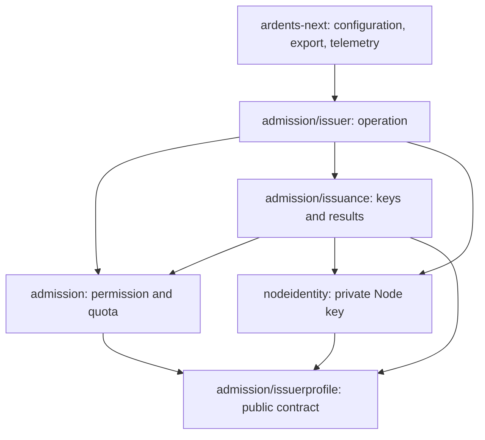

# Admission: implemented offline domain

Admission owns permission validation, nonrefundable issuance quotas and the
confirmed offline token issuance cycle. It consumes explicitly pinned facts;
it does not decide accepted live State, Time Confidence or Node duty. The
[current product contract](../../../docs/product/scope.md) limits this slice.

```text
admission/
  inspection.go              permission verification
  batch.go                   holder proof and canonical request validation
  ledger.go, ledger_storage.go      quota debit, exact retry and durable evidence
  confirmation.go            opaque proof of a committed/revalidated debit
  profile_binding.go         public keys + separately selected ledger authority
  issuerprofile/             public inventory, cohorts, SPKI, signed profile
  issuance/                  private key, profile and issuance-result stores
  issuer/                    complete issuer operations and owner retirement
```

Paths describe real packages and owners. There are no placeholder layers,
repository interfaces or generic event bus. Node Identity remains outside the
domain: it retains its private Ed25519 key and accepts only an opaque validated
profile-signing request. Each store keeps its own lease, lifetime and durable
root. The operation coordinator owns their acquisition and release order.

## Dependencies

Arrows mean imports of a public contract. The
[package map](../../../docs/development/package-map.md) and
[isolation test](../../architecture/successor_isolation_test.go) enforce these
exact directions for production, tests and platform-specific files.



The CLI also calls the public owners directly for their bounded preparation and
inspection commands. The public profile package cannot import the ledger or any
private-key owner. A nested package receives no imports from its parent.

## One real operation

`issuer.Issue(ctx, plan, batch, facts, kind)` executes:

1. Open Admission, immutable issuer keys and durable issuance results, in that
   order. Any failure closes all previously acquired owners before return.
2. `Ledger.DebitVerified` validates the permission, holder proof, exact cohort,
   time and quota under the ledger lock. Only a durable debit or currently
   revalidated exact retry returns an opaque `DebitConfirmation`.
3. `ResultStore.Issue` accepts that confirmation, revalidates the pinned key and
   time binding, and returns a committed response or the exact retained response.
   Failure between debit and response commit retains the debit; no refund or
   fabricated confirmation is available to the caller.
4. Close result store, key store and ledger. Return the primary operation result
   plus every acquired owner's cleanup outcome. A cleanup failure clears response
   bytes; `Status()` projects the existing finite CLI error without losing causes.

Other complete operations are `issuer.Initialize`, `InitializeProfile` and
`InspectProfile`. Profile preparation uses a public value model, never a dummy
ledger with invented authority. Within this domain, canonical SPKI has one implementation
shared by profile verification, ledger validation and private-key inventory.
An unsigned profile request and a verified profile have different private
representations; Go type conversion cannot bypass signature verification.

The command checks export destinations before opening the issuance operation or
initializing keys. Every output uses the same state-directory exclusion and
exclusive/idempotent writer. Cancellation during verification retains its
actual error; it does not imply expired authority or unavailable storage.

## Whole domain and current callers

The domain includes allocation, issuing, holder stock and spending. This tree
currently contains the offline issuer portion; source relocation here has not
switched the existing Endpoint or receiving Node consumers.

| Responsibility | Implementation and actual consumer |
| --- | --- |
| Offline permission verification, quota debit, key/profile preparation and retained issuance response | This tree, called by `cmd/ardents-next` |
| Permission allocation and purpose-bound signing | `internal/admission` grammar and `internal/custody/admission_authority.go`, consumed by the existing provisioning commands |
| Pending blind batch, per-class stock and permission revocation | `internal/endpoint/tokens`, consumed by the existing Endpoint duty context |
| Holder consumption journal | `internal/endpoint/tokenjournal`, consumed by that token owner |
| Receiver spend and replay floors | `internal/route/replay`, consumed by existing receiving duties |
| Live issuer request, bootstrap/admitted lane and response | `internal/route/credential`, composed by existing network consumers |

These are distinct state owners within Admission, not interchangeable credentials
or one shared store. Custody retains private authority keys; Network State
retains live authority and time verification; Hosting retains provider budgets.
Moving Admission must preserve these external responsibilities and switch real
consumers. An offline command cannot stand in for the live issuance/spending
cycle. The selected issue ledger owns the migration work and acceptance status.

## Invariants and evidence

| Invariant | Owner | Behavior evidence |
| --- | --- | --- |
| Public profile cannot supply State authority | `issuerprofile`, `profile_binding.go` | Independent signed byte fixtures; missing/reordered/reused cohorts; ledger Authority/Profile/Duty preserved |
| Unsigned preparation cannot become signature proof | `issuerprofile.Request`, `Verified` | External-package regression forbids Go conversion from Request to Verified |
| Issuance consumes only committed quota evidence | `ledger.go`, `confirmation.go`, `issuance/results.go` | Real debit, zero-confirmation refusal, exact replay, conflict, expired retry and retained quota |
| Keys and result bytes stay bound to immutable roots | `issuance` stores | Real Linux leases, process death/reopen, pending/partial files, substitution and durability faults |
| Completion retains primary and cleanup failures | `issuer/operation.go` | Canceled debit plus two real close failures; leases released under race |
| An adapter cannot rebuild domain authority | `cmd/ardents-next` | Compiled import/profile/binding/debit/issue/replay commands and real OTLP; finite JSON and export refusals |
| Directory moves cannot widen dependencies | Architecture gate | Exact-package import allowlist and negative cases for reverse, nested and unknown dependencies |

Current format and lifecycle owners:
[permission](../../../docs/technical/successor-permission-inspection.md),
[ledger](../../../docs/technical/successor-admission-ledger.md),
[key material](../../../docs/technical/successor-issuer-key-material.md),
[profile](../../../docs/technical/successor-issuer-profile.md),
[confirmed issuance](../../../docs/technical/successor-token-issuance.md).
Wire bytes, JSON and retained root formats stay compatible. No state conversion
is needed for the source moves.

Verification: `make quick-check`, `make check` and the selected pinned Linux
`make issuer-profile-check` profile (race, process/CLI behavior and both bounded
fuzz targets). Receipts and failed attempts remain outside Git.

This implements the offline issuer part of Admission. Holder stock, token spend
and live State/transport integration remain separate unimplemented successor
work. Passing this cycle is not network, anonymity or power-loss qualification.
